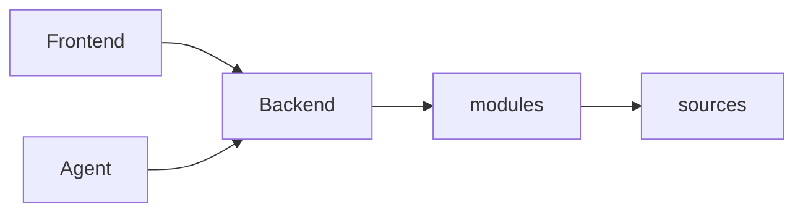

# Architecture

## Overview

Magnis is a local-first system with a backend as the source of truth and multiple clients and runtimes around it.

At a high level, the system is organized into:

- backend — persistence, graph, sync orchestration, transports, and agent execution
- frontend — main UI
- desktop — local shell
- agent — runtime for agent logic

## System Shape

## Backend as Source of Truth

The backend owns:
	•	local persistence
	•	graph and canonical data
	•	provider integrations
	•	sync orchestration
	•	transport (WebSocket, MCP)
	•	agent execution

The frontend is a client only.

⸻

## Core Backend Planes

The backend is structured into:
	•	core — domain types and invariants
	•	services — orchestration and long-lived services
	•	modules — domain adapters (emails, contacts, etc.)
	•	sources — provider integrations (Google, Telegram)
	•	api — transport layer

⸻

## Core Data Model

Magnis uses a graph-based model:
	•	entities — people, messages, projects
	•	facets — typed data with provenance
	•	links — relationships between entities
	•	events — mutation history
	•	canonical properties — resolved truth

⸻

## Main Flows

1. Frontend → Backend
	•	WebSocket RPC
	•	routed via RpcRouter
	•	handled by modules
	•	reads/writes graph

⸻

2. Sync (Modules ↔ Sources)
	•	modules define intent
	•	sources interact with external APIs
	•	SyncRouter connects both

Flow:
module → command → source → envelope → module → graph

⸻

3. Agent Loop

Agents operate through backend:
	•	read from graph
	•	call tools (MCP)
	•	pass approval layer
	•	write results back

⸻

## Design Direction

Magnis is built around one idea:

communication is system input.

Messages are not history — they are:
	•	context
	•	memory
	•	triggers
	•	decisions

The system turns this into structured, persistent state.