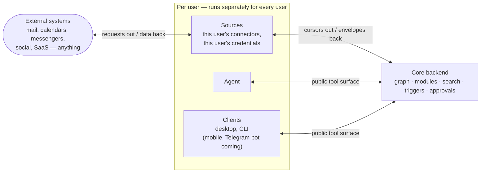
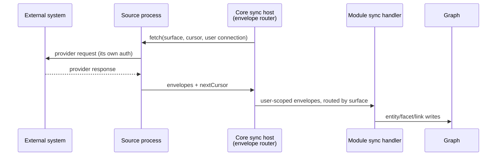
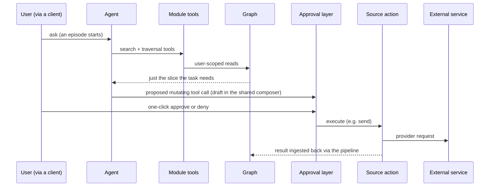

# Architecture

The whole system, top-down: what the core does, what this catalog adds, and the model a plugin author builds against. Concepts and data flows only — the core's implementation is closed; the contracts here are the stable surface. For hands-on authoring, see [docs/plugins/](plugins/README.md).

## System overview

The system has four roles — **sources**, **modules**, **agents**, and **clients** — coordinated by the **core backend** around one graph. Sources, the agent, and clients all run **per user**, and the agent and clients connect to the core through the same public tool surface — symmetric on purpose:



- **Sources** — each user runs *their own* connector instances with their own credentials; a source is asked with a cursor and answers with data (envelopes).
- **Modules** — plugged into the core; they take what sources deliver and shape it into the graph, and serve it back out through tools. (Module *code* lives in this public catalog but *runs* inside the core.)
- The **core backend** owns the graph, search, triggers, and the approval layer.
- The **agent** and **clients** are deliberately symmetric: both call the same public module tools, both per user — the difference is caller policy: agent-originated mutations require approval, human actions execute directly.

Every arrow is two-way — requests flow one direction, information flows back. (Note the two Telegram roles: the Telegram *source connector* is live today; a Telegram *bot client* is planned.) The story below runs top-down: the **graph foundation**, then three operating paths — the **data pipeline** populates the graph, **agents** reason and act on it (triggers included — the way episodes start asynchronously), **clients** expose the same tools to people. Each section ends with a pointer to its in-depth doc.

## Graph foundation

### Graph primitives

Everything lands in one graph:

- **entities** — people, messages, meetings, companies, projects
- **facets** — typed data attached to an entity, with provenance
- **links** — typed relationships between entities ("works_at", "attended", "authored_by")
- **events** — append-only mutation history
- **canonical properties** — resolved truth when several sources disagree

One graph means one *connected data model per deployment* — not unrestricted cross-user access: the graph is partitioned by entity ownership and filtered by ACL visibility for every caller (below).

### Provenance and canonical truth

Every facet and mutation carries provenance identifying the responsible module or source and, where applicable, the originating provider record — "according to Gmail, on this date, this person's name is X". Canonical properties are derived by deterministic merge rules and retain the contributing facets as evidence; agent inferences are stored separately as hypotheses, never asserted as source facts.

### Hypotheses

A **hypothesis** is a graph-resident, non-canonical assertion with a confidence score, evidence links, and a lifecycle: it accumulates evidence across sessions and channels, is promoted into the graph only past a confidence threshold with multiple independent confirmations, and decays when stale instead of fossilizing. One mechanism, defined once — how agents use it for research, analytics, and memory is described in [Agents](#agents); the storage details are in [docs/graph.md](graph.md).

### Ownership, visibility, and ACL

Every entity has exactly one owning user, recorded and enforced at the schema/storage boundary — below module code. Ownership is deliberately separated from **visibility**: owning a fact and being allowed to see it are two different questions, which is what lets team sharing layer on top without weakening isolation.

Visibility beyond the owner is modeled **in the graph itself**: a dedicated **ACL entity** whose grant links include other users is linked to the resource being shared — an account, a project, a thread — and the grant covers that resource together with the facets and history attached to it. A read is authorized by resolving the caller's identity through those ACL links during traversal, before data is returned. There is no parallel permissions table to drift out of sync: the same graph that holds the knowledge holds who may see it. Ownership isolation is implemented today; ACL-based team sharing is the designed mechanism rolling out with our first design-partner deployment.

Note the two *independent* permission layers: graph ACL governs which **users** see which entities; module capability manifests (see the data pipeline) govern what **plugin code** may touch. They enforce different things at different boundaries.

→ In depth: [docs/graph.md](graph.md) — entity/facet/link anatomy, link types, the search index, vector indexing, and the graph tools agents call.

---

## The data pipeline

How anything gets into the graph — and why **practically any system can be connected**. The pipeline is extensible end to end through two plugin types with a strict division of labor: **sources** connect to external services and emit **envelopes** (typed fact payloads) on named **surfaces** (streams a module subscribes to); **modules** own graph schemas, ingest those envelopes, and expose public tools. The envelope contract decouples the two: a source knows nothing about graph schemas, a module knows nothing about provider APIs. Nothing about Gmail or Telegram is hard-coded in the core — which is exactly why this catalog is open.

### Sources — bringing data in

A **source** connects one external system — mail and calendars (Google, Outlook), messengers (Telegram, Slack), social networks (X, LinkedIn), an internal CRM or ticket tracker — anything with data worth remembering. Which connectors exist at any given moment is just the current catalog; **the contract is what's permanent**. A source owns nothing in the graph; its whole job is to fetch facts and emit envelopes.

**From provider to graph — the envelope route.** This is the interesting part: the source never touches the graph, and the module never touches the provider. The core's sync host sits between them, routing envelopes into the right module's sync handler under the right user's context:



In push mode the direction inverts at the top: the source notifies the host as provider events arrive, and the same surface routing and user scoping apply.

**Process and credential boundary.** Every source runs as its own process the core spawns, speaking line-delimited JSON-RPC over stdio (the Magnis Sync Profile). Because it is a separate process it can do real network I/O, run its own auth ceremony (OAuth2, phone code, API key), be written in any language, and be run by hand for debugging. Provider credentials are stored by the host in a **user-scoped encrypted vault** (AES-256-GCM, versioned keys); the host resolves and injects them into the selected source call. The source process receives only the credentials needed for that call and holds no long-lived secret state; modules, agents, and clients never receive credentials at all.

**Envelopes, cursors, errors.** Sources serve poll or live-push sync; envelopes are `{ surface, remote_id, kind, payload }` facts; cursors are opaque JSON, round-tripped verbatim. Resilience is contractual, not best-effort: rate limits surface as typed errors with `retry_after` the scheduler honors; expired cursors surface as their own typed signal and re-bootstrap cleanly; re-polls are idempotent (stable remote ids, upsert semantics), so a crashed fetch never duplicates data. A connector never hangs silently.

→ In depth: [docs/plugins/source.md](plugins/source.md) — build a source end to end: surfaces, the auth ceremonies, secrets, the full wire contract, tests.

### Modules — owning the graph's shape

A **module** owns a slice of the graph for one domain — contacts, email, meetings, deals, tickets: whatever the business runs on, each domain is a module, and new domains are new modules, not core changes. Versioned schema files define its **strictly-typed entity and facet contracts**; installing the module registers those schemas with the host. The module decides how conflicting facets merge into canonical truth, and its public tools are harvested from its code — declared, not wired.

What a typed slice actually looks like in the graph — a person, as the contacts module stores them:

```jsonc
// ENTITY — the thing itself. One owner, a typed schema, little else:
{ id: "e-91…", schema: "contacts.person", owner: "user-A", name: "Sam Ito" }

// FACETS — each source's view, kept verbatim with provenance and confidence:
{ schema: "person.profile", data: { first_name: "Sam" },
  source: { source: "telegram", external_id: "tg:8841…", confidence: 90 } }
{ schema: "person.profile", data: { first_name: "Samuel" },
  source: { source: "linkedin", external_id: "li:sam-ito", confidence: 60 } }

// CANONICAL — the resolved truth (confidence, then recency); facets stay as evidence:
{ "person.first_name": "Sam" }

// LINKS — typed edges; the last one is a hypothesis, invisible until promoted:
{ kind: "works_at", to: "company: Lumen Labs" }
{ kind: "same_as",  to: "person: e-27…", status: "candidate", p: 0.74 }
```

Nothing here is module-private storage — it is all the one graph, typed by the module's schemas, which is why any agent or client can read it back with provenance attached. Full anatomy and the real schema files: [docs/graph.md](graph.md).

**Sandbox.** Modules run inside the core process in V8 isolates with no I/O of their own — no network, no filesystem, no sockets. A module reaches the graph only through the typed graph API, and only within what its capability manifest grants: the namespaces it owns, the operations it may call, the surfaces it wires to. That restriction is the point: a graph-owner can't leak to, or be attacked from, the outside world — anything that needs the outside is a source's job.

→ In depth: [docs/plugins/module.md](plugins/module.md) — build a module end to end: the class, the graph API, schemas, the canonical-vs-facet rule, tests.

### Per-user isolation, end to end

The non-mixing of users' data is not one feature — it is a chain of boundaries, one at every step of the pipeline:

1. **Connection boundary.** Each source connection belongs to one Magnis user and one verified provider identity; the host selects that connection's credentials from the user's vault namespace.
2. **Execution boundary.** Source calls and module calls carry a host-stamped user context — plugin code cannot choose another user id.
3. **Storage boundary.** Every new entity receives exactly one owning user, enforced below module code at the schema level.
4. **Query boundary.** Graph reads return only owned or ACL-visible entities (see [Ownership, visibility, and ACL](#ownership-visibility-and-acl)).
5. **State boundary.** Cursors, module state, event streams, approval queues, drafts, and notifications are all keyed to the same user — one user's sync and notifications are invisible to another's session.

### Packaging and lifecycle

Connecting a new system means writing a plugin against the same contract every built-in integration uses, and the platform treats plugins as real packages, not file drops:

- **Typed from the first line.** The manifest declares package identity, surfaces, and capabilities; versioned schema files define the entity/facet contracts the graph enforces. There is no "dump JSON somewhere" path.
- **Lifecycle, precisely.** Schema registration is host-native — modules ship no database-schema migrations; a module may ship an explicitly versioned *graph-data* migration when an upgrade must transform existing entities. Installs reconcile what's on disk with what the database believes; a running extension can be rebuilt and swapped live without restart; dependency guards block unsafe disables; extensions arrive from a signed remote catalog with system and community tiers.
- **Tools register themselves.** A module's public tools are harvested from its code on install and become available to the agent and every client automatically — the same self-describing surface agents use for discovery.
- **Agent-buildable by design.** The contract is written so coding agents can generate a plugin from a high-level description — our X integration went from nothing to working in hours this way.

→ In depth: [docs/plugins/manifest.md](plugins/manifest.md) — the manifest reference · [docs/plugins/structure.md](plugins/structure.md) — the file-structure standard and conformance checklist.

---

## Agents

The agent is an independent actor on the graph. An agent **episode** (one conversation or task run) starts either interactively — a person asks through a client — or asynchronously, from a trigger (see [Triggers](#triggers--pub-sub-on-the-graph)). In both cases the agent discovers and calls the same user-scoped public tools, and its mutations enter the approval flow.

### Self-discovery and context economy

The agent's context window is *not* stuffed with the company. At episode start it can enumerate the installed public tools and their parameter schemas; from there it retrieves graph context incrementally through typed search and traversal tools — **zoom in** on a person, a thread, a deal; **zoom out** to the surrounding neighborhood; follow links — and every result carries the entity identifiers and provenance needed for the next hop. Understanding is amortized into the graph once; each episode reads just its slice, where long-context approaches re-read the corpus on every question.

### Research over the graph — hypotheses and reasoning

This is where the meaning lives. A **hypothesis** is a graph structure (defined in [Graph foundation](#hypotheses), stored per [docs/graph.md](graph.md)): a candidate assertion with confidence, evidence, and a promote-or-decay lifecycle. Agents use it for research, analytics, and memory — anything the data never states outright: a commitment made in passing, a deal that is drifting, two contacts being the same person.

The worked example is **identity resolution**. The same person arrives via Gmail, Telegram, and a meeting as three records; the agent, navigating the graph, records `same_as` candidates between them; evidence accumulates across sessions; the graph promotes what holds and decays what doesn't — and from then on every query sees *one* person with a merged history. Measured, not asserted: cross-session entity-resolution recall of **0.63–0.80** against a memoryless baseline that is structurally 0 — methodology, raw runs, and the notebook live in [evals/](../evals/README.md). Because the overlay lives in the graph, not in a prompt, memory written by one agent — or one model — is readable by any other.

The same machinery — typed traversal plus judgment — is what lets agents do analytical work rather than lookup: assemble an account brief from every channel with a citation on every claim; find the hidden blocker of a deal (the procurement email, not the product thread); reconstruct who promised what to whom after a lost thread; digest which conversations are going quiet and prepare the follow-ups. None of these is answerable from a single inbox.

### The action pipeline

Through tools, not around them:



Approvals are **caller policy**. A mutating public tool is classified as such by the module. When the caller is an **agent**, the host records the proposed call and requires human approval before execution — there is no autonomous-write mode. When an authenticated **human** invokes the same tool through a client, it executes directly under that person's authority. Drafting happens in a shared composer — the agent reads and edits the same draft the user sees (append, rewrite, attach), and the user always owns the send.

The model layer underneath is swappable — built-in tool-calling engine, or the user's own Claude Code / Codex subscription, with persistent resumable sessions and per-user metering. → In depth: [docs/engines.md](engines.md).

### Triggers — pub/sub on the graph

Triggers are how episodes start *asynchronously* — a publish/subscribe layer over the graph, and because everything becomes the graph, subscribing to the graph means subscribing to the business itself. A trigger is a subscription plus instructions for the future:

- **Event triggers** subscribe to graph mutations — an entity created, a facet updated, a link added, a message arriving from a specific person.
- **Schedule triggers** fire at moments in time (cron-style) and evaluate current graph state — which is how "this thread has gone quiet" is detected.
- **Gate.** When a subscription fires, a gate prompt decides whether this occurrence actually matters — a relevance classifier, not an authorization mechanism.
- **Act.** If the gate passes, the trigger starts an agent episode with the prompt defined at subscription time — "draft the follow-up", "prepare my brief" — in the subscribing user's context. Agent-originated mutations from a triggered episode pass the same approval flow as any other.

This is how work gets scheduled into the future: the subscription carries the intent forward, and the graph supplies tomorrow's context when it fires. Deferred action over live company state — not a reminder bolted onto a chat log.

### Agentic search

An agent never queries raw provider data — it searches the graph. Retrieval is hybrid:

- **structured graph queries** — typed traversal over entities, facets, and links ("open deals involving people from Tuesday's meeting");
- **semantic search** — embedding-based retrieval over message and document content. The embedding endpoint is deployment-configured: an in-perimeter local service (Ollama-style or any OpenAI-compatible server) keeps indexed content inside the deployment boundary; a remote endpoint is possible where policy allows.

The combination is deliberate: multi-hop questions resolve through the graph, fuzzy recall resolves through embeddings, and both return provenance — every result carries the identifiers the agent needs for its next traversal hop. The same search serves clients. Index mechanics — full-text, vectors, rank fusion: [docs/graph.md](graph.md).

---

## Clients

**Shared public tool surface.** The core exposes one public interface: the module tools. Everything that connects — the desktop app, the CLI, and coming clients like mobile and a Telegram bot — speaks the same public tool surface the agent uses. A client is not a special case; it is another caller. A new client, or any external system, plugs in exactly the way an agent does and gets the same graph, the same tools, the same per-user scoping. (Module-internal RPC and sync handlers are separate host interfaces, not part of this shared surface.)

**Human identity and direct execution.** A person authenticates to the deployment — open mode for single-user local installs, password mode (argon2-hashed) for shared servers, with an admin role owning the deployment — and then acts as themselves: their calls carry their identity, see their ACL-visible slice of the graph, and execute directly, with no approval hop. Same tools, different trust: humans act, agents propose.

**Today and coming.** Desktop app and CLI today; mobile and a Telegram bot client are planned. Because the surface is uniform, a new client is a UI over existing tools — not a new integration.

## Deployment modes

| Mode | Database | Models |
|---|---|---|
| Desktop app | embedded Postgres server bundled inside the app — zero-dependency install | cloud Claude, any OpenAI-compatible endpoint, or fully local |
| Self-hosted server | your Postgres (Docker / VPC / bare metal) | same — including local-only |

Magnis core storage, graph processing, embeddings, and model inference can all run without any mandatory Magnis-hosted or third-party service. Source connectors, by their nature, still talk to the external providers the operator enables — that is their job.

## Security boundary summary

| Boundary | Limited side | Enforcement |
|---|---|---|
| Provider ↔ source | provider data / network | separate source process + typed wire protocol |
| Source ↔ host | connector process | JSON-RPC framing; per-call credential injection from the user-scoped encrypted vault |
| Module ↔ host | plugin code | V8 isolate + capability manifest (`owns`, operation grants) |
| Caller ↔ graph | agent / client / module user context | host-stamped user identity + ownership and ACL filtering |
| Agent ↔ mutation | autonomous caller | approval layer (human confirms before execution) |

## Engineering discipline

As of mid-2026, the core is verified by a deterministic, numbered integration-test ladder — thirteen stages from the runtime kernel up through sync, triggers, and auth — on top of ~2,100 Rust tests, with injectable clocks throughout. Determinism is a design rule, not an aspiration: if a test can flake, the seam it needed is the bug.
