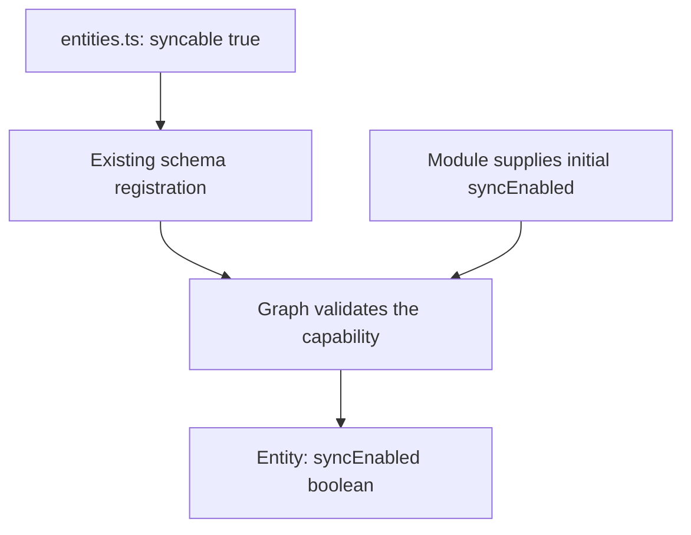
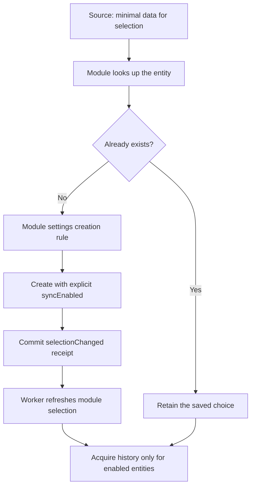
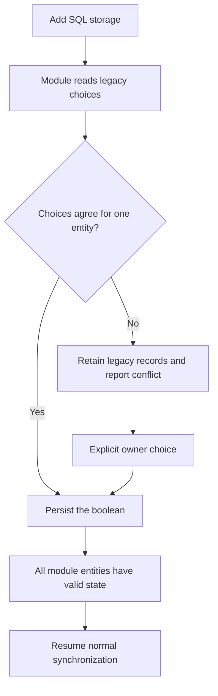
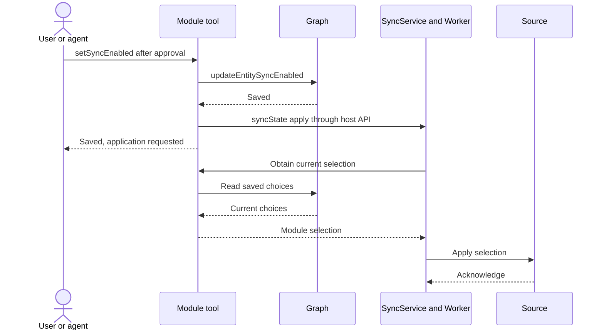
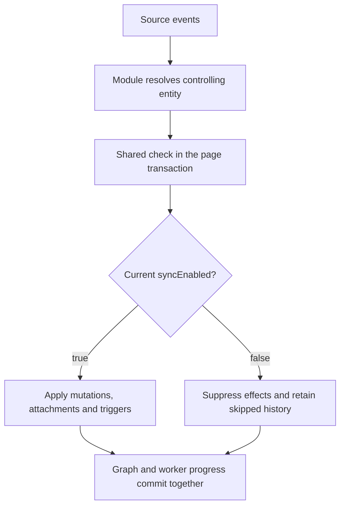
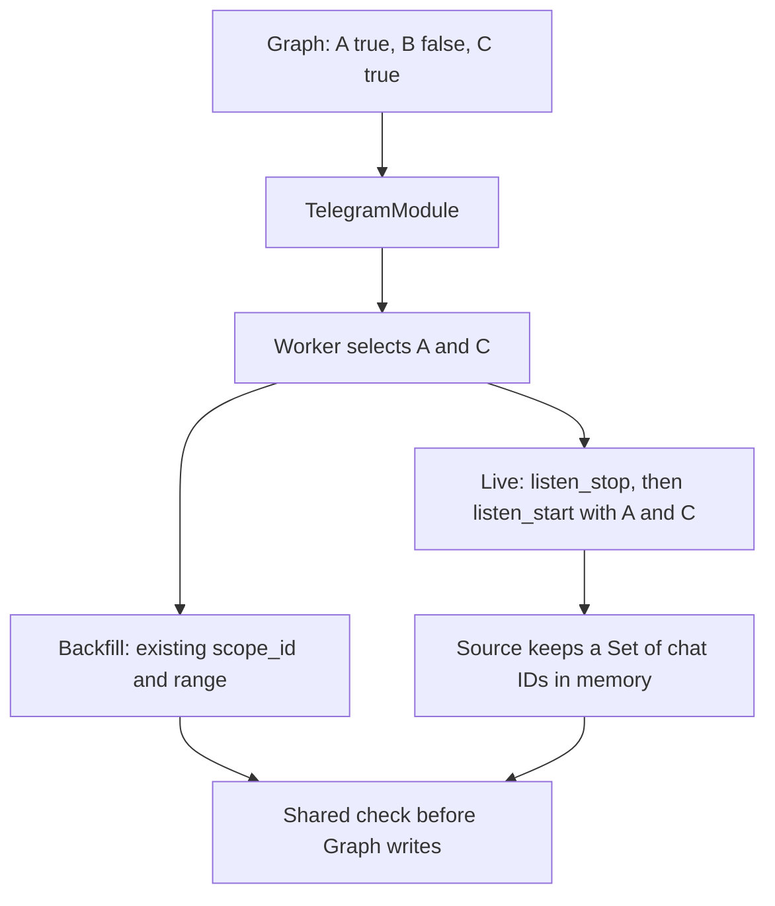
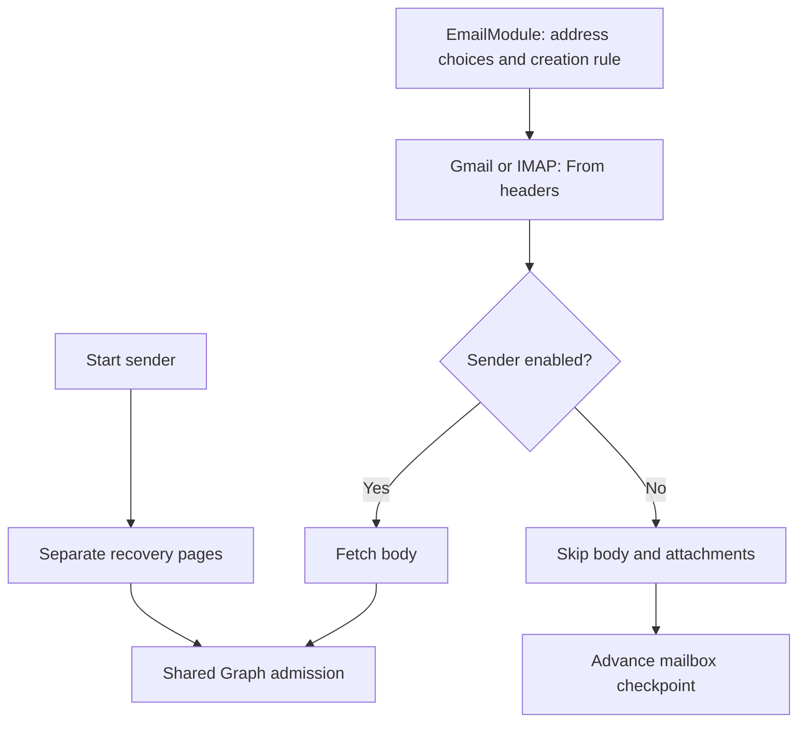
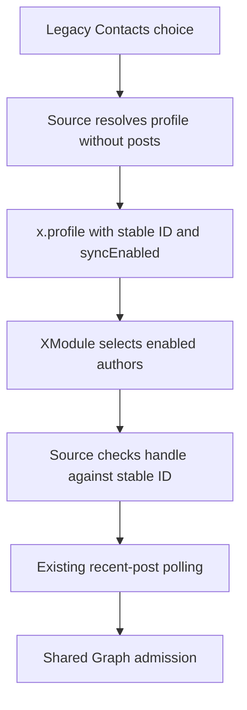
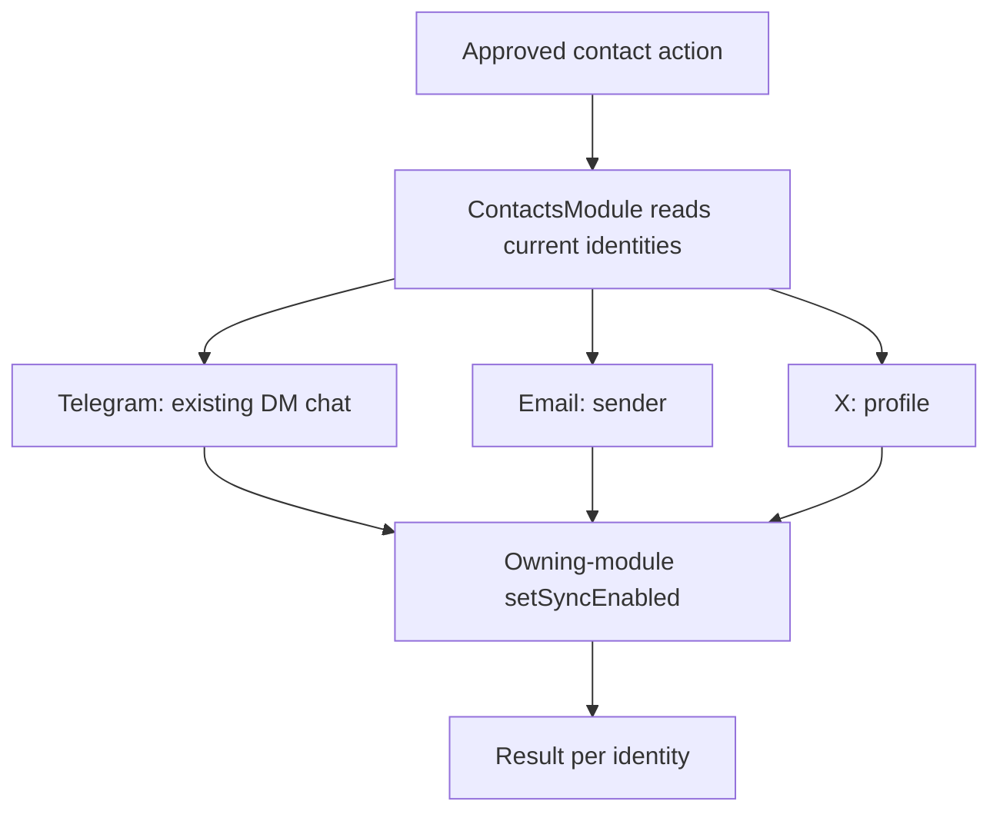

# Control source synchronization on graph entities

Status: APPROVED  
Spec lock: sha256:cccb4d2ff0988a27f4fee085e200c245bb402d0ed632310094b562fc535f0132 owner:$blueprint-start  
Implementation lock: sha256:68801de660c398107e49d09127e5cffbbda187ba44fb919780ccbe177388b41e owner:$blueprint-start  
Active Delivery: D2  
Unattended decisions: allowed  
Ledger: implemented  

<!-- plan:spec:start -->
## The Goal

Control background acquisition through one persisted `syncEnabled` field on each Telegram chat, email sender and X profile.

1. An enabled entity admits supported Source events into Graph: creation, updates, deletions and relationship changes.
2. After Stop is applied, targeted history requests and new Source-driven Graph changes stop for that entity, including attachments and triggers. Other entities continue synchronizing.
3. Start resumes Telegram history and accessible email sender history. For X, it resumes the existing recent-post polling.
4. A contact action applies to its currently linked supported identities. The contact stores no sync policy.
5. Stored data remains available. The required `Entity.indexed` field controls indexing independently.

## Why now

Now Telegram selects history through module rules, email reads mailbox events, and X reads author choices from Contacts.
There is no common persisted entity choice or shared check for Source-driven changes.

**What exists and exactly what changes**

| Area | Already exists | Work in this plan |
| --- | --- | --- |
| Graph entity | `EntityBase.indexed`; entity storage and serialization. | **Add** `Syncable.syncEnabled`, its column and validation. |
| Schema declaration | `EntityIdentity → EntityDescriptor → EntitySchemaDecl → Schema`. | **Extend** these existing types with one `syncable` capability. |
| Plugin GraphService | Entity reads, `update_properties`, `sync_state("status" / "reset")`. | **Add** updateEntitySyncEnabled; **rename** the existing sync method to syncState and extend it with apply. |
| Backend GraphService | `updateEntity`, transactions and mutation history. | **Extend** the existing write path with syncEnabled. |
| Sync | `SyncService`, `SyncWorker`, `SyncRouter`, persisted cursors and ranges. | **Add** selection application, retained suspended history and restart recovery. |
| Telegram | The module selects history; Source accepts a bounded `scope_id`. | **Replace the selection criterion** with persisted syncEnabled; **add** chat selection to the live listener. |
| Email | Gmail History, IMAP and sender identities. | **Add** selection before body downloads and recovery for one sender's history. |
| X | Selected-author polling through `tracked_handles`. | **Move the choice** from Contacts to x.profile; retain the existing post acquisition method. |
| Module settings | The service, storage and panel exist; plugin `settingsSchema()` returns null. | **Connect** plugin settings declarations and module reads. |

**The two existing GraphService types describe different boundaries.**
The plugin SDK uses this name for the host API exposed to modules, which already includes a sync bridge.
Backend GraphService stores Graph data. TelegramModule, EmailModule and XModule remain separate; their sync logic stays in those modules.

This change updates the SPEC. Implementation has not started. Catalog and app host changes require compatible versions.

## The target

### Persist the choice on the entity



1. Declare `syncable: true` for `telegram.chat`, `email.address` and `x.profile`.
2. Carry the capability through the existing builder, manifest loader and schema repository.
3. Store syncEnabled on the entity, separately from `properties`. Graph also stores an internal syncRevision counter for ordering changes; it is not another user setting.
4. Require a boolean for a supported schema. Missing and null values are errors.
5. Retain the required `indexed` field in EntityBase and expose it in plugin projections.

The new Syncable declaration is in Interfaces. EntityBase already exists; its definition is not repeated.
TelegramChatDetails, EmailAddressDetails and ProfileRecord remain provider property dictionaries; syncEnabled does not belong in them.

| Entity | Events governed by its syncEnabled |
| --- | --- |
| telegram.chat | Chat changes, messages, edits, deletions and supported membership events. |
| email.address | Mail from the exact normalized address across threads and accounts; additions, labels and deletions. |
| x.profile | Profile and post changes, including explicitly reported deletions. |
| contacts.person | No field. Only an action on linked identities. |

<details>
<summary>Implementation map</summary>

| Implementation map | Persist the choice on the entity |
| --- | --- |
| Owner | Existing declaration builder and Graph schema/entity storage. |
| Target files | Catalog `packages/declare/index.ts`, `packages/declare/derive.ts`, module `entities.ts` files; app `../../../magnis-app/.worktrees/entity-sync/backend/src/core/schema.ts`, `../../../magnis-app/.worktrees/entity-sync/backend/src/services/graph/graph.service.ts` and repositories. |
| Input / wake | Module schema registration and entity creation. |
| Output / durable state | Registered capability and persisted entity boolean. |
| RED test | Catalog `bun run agent:test:backend -- packages/declare/__tests__/derive.test.ts`; app `bun run agent:test:backend -- test/tst_bts_schema_001.test.ts`. |

</details>

### Discover selectable entities and migrate existing choices



1. Discovery creates the minimal chat, address or profile before bulk history acquisition.
2. The module supplies the initial boolean through existing create/batch operations, extended with the new field.
3. Repeated discovery preserves the saved choice and syncRevision. Source metadata updates for an existing disabled entity are also suppressed.
4. A committed page that creates a selection subject or changes its account membership returns selectionChanged. The worker yields after that page; SyncService refreshes affected workers through sync.selection before further content requests. A prefetched page retains its old selection and still passes current Graph admission.
5. Connect creation settings to the existing ModuleSettingsService, AppSettingsRepository and panel.
6. Changed settings apply to subsequent creations. Changing existing entities requires an explicit user action.

| Module | Initial choice to preserve |
| --- | --- |
| Telegram | Current history eligibility: explicit settings, chat kind and size, and the current choice including pinning. After creation, pinning and indexing do not override Stop. |
| Email | Current enabled behavior. Source receives an explicit module-supplied boolean for unknown senders. |
| X | New profiles are disabled. Existing explicit choices migrate from Contacts. |

**Migration:**



1. Check Telegram chats observed by multiple accounts: differing previous eligibility values cannot be collapsed automatically into one boolean.
2. Apply the same check to multiple legacy X entries resolving to one profile.
3. Retain legacy records on conflict or resolution failure. Mark the migration incomplete.
4. Make migration restartable. Only the affected module waits for completion; other modules continue.
5. Keep the module runtime and its syncMigration read tool available. Before fetching content, sync.selection checks for unresolved legacy rows and reports migration-required through existing account status.
6. Read legacy rows through the explicit listSyncMigrationEntities projection declared in Interfaces. Ordinary Syncable reads remain strict; their migration-required error links the UI to syncMigration.
7. The approved resolveSyncMigration tool re-reads the conflict, validates its target and writes the owner's boolean. For an existing row, use updateEntitySyncEnabled without first decoding a Syncable. For X, create/resolve the stable profile and identity links in the existing Graph batch.
8. On startup, account connection and an explicit resolution, retry the remaining migration. X lookup errors remain visible and retry on connection or the existing sync apply action. Once no unresolved rows or legacy X entries remain, the module requests apply and normal acquisition resumes.

<details>
<summary>Implementation map</summary>

| Implementation map | Discover selectable entities and migrate existing choices |
| --- | --- |
| Owner | Owning modules initialize and migrate choices; Graph validates storage. |
| Target files | Catalog `modules/telegram/module/service.ts`, `modules/email/module/service.ts`, `modules/x/module/service.ts`; app `../../../magnis-app/.worktrees/entity-sync/backend/src/core/entity.ts`, `../../../magnis-app/.worktrees/entity-sync/backend/src/core/graph-commands.ts`, `../../../magnis-app/.worktrees/entity-sync/backend/src/services/graph/entity.repository.ts`. |
| Input / wake | Discovery, migration or creation-setting changes. |
| Output / durable state | Explicit saved choices; unresolved migrations retain legacy records. |
| RED test | Catalog `bun run agent:test:backend -- modules/telegram/module/__tests__/syncPlan.test.ts`; equivalent existing email and X ingest targets in Target tree. |

</details>

### Enable or disable through the module tool



1. Add `setSyncEnabled` to the existing entity-tool registry and owning-module writeTool handlers.
2. Use existing approval, permissions and RPC. The UI calls the same handler.
3. The handler saves the field through a new plugin GraphService method; the host writes through the existing backend `updateEntity`.
4. After commit, the handler calls the new `syncState("apply")` variant. This requests action from the existing SyncService.
5. Return from RPC before waiting for the worker: its callback into the module could otherwise block the single channel.
6. The worker obtains the module's current selection, settles earlier work, applies Source selection and persists the result.
7. Extend existing sync status with pending, applied or failed application state per account.
8. Add a module-owned `sync.selection` RPC, called by PluginModuleController through the existing runtime dispatch. It returns the selection declared in Interfaces.
9. SyncService requests selection at startup, Source reconnection, apply and a committed `SyncPageReceipt` with `selectionChanged`. Creation-setting edits use the same apply wake; they change only the rule for future discovery.
10. SyncWorker serializes selection application with its existing page turns. Settle in-flight work, persist desired selection and recovery changes, then replace the listener. sourceCommandFor and protectLive use this saved selection; the unsupported buildSourceCommand method is not called.
11. For Telegram, persist appliedSelection after the replacement listener acknowledges. For email and X, selection travels with each request: persist appliedSelection after settling old requests and installing the new command inputs, without an extra provider request.
12. Before acknowledging either path, recheck current Graph revisions under the owner lock. A newer choice stays pending and requests another callback. A failure keeps desired selection and reports failed application. On restart, Telegram reinstalls its listener before reporting applied.

**Input:** SetSyncEnabledParams, declared under Interfaces, carries the entity UUID and the explicit boolean.

**Add the write method and the apply overload shown below. Rename the existing sync-control method to syncState, including its status/reset overloads and callers:**

```typescript
export interface GraphService {
  updateEntitySyncEnabled(params: SetSyncEnabledParams): Promise<{ syncRevision: string }>;
  syncState(action: "apply"): Promise<{ pending: true }>;
}
```

Use camelCase for all added TypeScript members. The write method saves the choice; syncState calls the existing sync bridge.
Backend GraphService does not call workers or write worker state.

Add syncEnabled to the existing UpdateEntityCommand as shown in Interfaces. It is optional in a patch because the command may change another field; the persisted choice remains required on Syncable.

**Agent call:**

```typescript
setSyncEnabled({
  entity: "telegram.chat",
  params: { id: chat.id, syncEnabled: false },
});
```

The agent finds the UUID through existing read tools and discovers the operation through capabilities.
The lower-camel-case name must pass SDK validation, host registration and approval serialization consistently; do not create a second RPC handler.

| Case | Result |
| --- | --- |
| Approval denied or save failed | Choice and Source remain unchanged. |
| Source application failed | The saved choice remains; status reports pending or failed. |
| Repeated same value | No syncRevision increment, mutation event or history pass; unfinished application may be retried. |
| Concurrent toggles | Apply the latest persisted revision; comparing booleans alone is insufficient. |
| Restart between save and apply | The module reads current entity revisions; the worker compares them with its saved selection and resumes pending application. |
| Multiple accounts | Report applied after every affected connected worker acknowledges. |

<details>
<summary>Implementation map</summary>

| Implementation map | Enable or disable through the module tool |
| --- | --- |
| Owner | Owning-module writeTool saves state and requests existing sync control. |
| Target files | Catalog `packages/plugin-sdk/contract/module.ts`, `packages/plugin-sdk/index.ts`, owning module handlers; app `../../../magnis-app/.worktrees/entity-sync/backend/src/plugin-runtime/ops/source-control-ops.ts`, `../../../magnis-app/.worktrees/entity-sync/backend/src/services/tools/entity-tools.ts`. |
| Input / wake | Approved setSyncEnabled invocation or reconstruction after restart. |
| Output / durable state | Saved Graph choice and reported worker application state. |
| RED test | Catalog `bun run agent:test:backend -- modules/telegram/module/__tests__/telegramCommand.test.ts`; app `bun run agent:test:backend -- test/tst_bts_tools_service.test.ts`. |

</details>

### Check syncEnabled before Source-driven Graph changes



1. The module resolves each event's chat, sender or author through existing anchors and links, in batches.
2. Shared admission reads persisted syncEnabled in the existing page UnitOfWork before any event effects.
3. Admission and the setter use consistent locking: a page commits before Stop or observes the disabled value.
4. An event rejected by Stop creates no mutations, attachments or triggers and does not complete unreceived history.
5. Distinguish suspension from confirmed scope removal. Failure to resolve an event's controlling entity remains an error.
6. The module calls admitSyncEntities once for its resolved event ownership groups, then builds all mutations and side effects only from the returned remote IDs.
7. Completion/reconciliation uses the same choice. An unstamped disabled entity is not evidence of provider deletion; retain its Graph data, links and history ranges.
8. The host sets selectionChanged only for actual subject creation or account-membership changes, including batch writes. Publish the wake after commit, never from inside module ingestion. The originating worker yields; other affected workers refresh before their next content request.

**Add these fields to the existing SyncPageReceipt:**

```typescript
export interface SyncPageReceipt {
  suspended: string[];
  selectionChanged: boolean;
}
```

`excluded` already exists and removes ranges. The new `suspended` field retains them.
The check also applies to previously fetched pages: Source may have received them before Stop.

Resolve a deletion without a parent ID through the stored object and its links. Deleting an object confirmed absent from storage is a no-op.
Initial discovery creates only a missing controlling entity and required identity links. Manual Graph editing remains available.

<details>
<summary>Implementation map</summary>

| Implementation map | Check syncEnabled before Source-driven Graph changes |
| --- | --- |
| Owner | Modules resolve controlling entities; existing page transaction enforces shared admission. |
| Target files | App `../../../magnis-app/.worktrees/entity-sync/backend/src/plugin-runtime/plugin-runtime.service.ts`, Graph operations and `../../../magnis-app/.worktrees/entity-sync/backend/src/services/sources/sync/sync.page-admission.ts`; catalog module ingest handlers. |
| Input / wake | Source event page, including queued work from an earlier selection. |
| Output / durable state | Admitted Graph effects and the worker's `SyncPageReceipt` commit together; suspended history remains. |
| RED test | App `bun run agent:test:backend -- test/tst_bts_prt_sync_atomic_001.test.ts`; catalog module ingest targets in Target tree. |

</details>

### Telegram: reuse existing scope selection



1. In `stateChat` and live-message accounting, replace sync eligibility with persisted syncEnabled. Use the previous rule only at initial creation.
2. Retain existing bounded requests with one `scope_id` and its range. Do not send the full chat list with every bounded request.
3. Add chat selection to listener transport and Source subscriptions. Keep one ID set per account; restore it from the module's selection after restart.
4. On selection changes, run `listen_stop → listen_start`: starting an existing subscription again currently changes nothing.
5. Source skips disabled-chat messages, edits and membership events before hydration or forwarding. Add missing live deletion delivery.
6. For deletions without a chat ID, forward minimal identifiers; the module resolves them using the account and stored messages.
7. Stop retains gaps. When all scopes are suspended, the worker waits; both bounded-work selection paths skip them without a busy loop.
8. For a newly discovered enabled chat or a newer enabled revision, add its scope ID to headChatIds in SyncRow. If bootstrap is running, retain this request until it completes; otherwise run the existing catchingUp stage before bounded history.
9. Begin that catch-up from the saved forwardCheckpoint with its continuation cleared, passing headChatIds beside chatIds. Keep all gaps and other chats' watermarks. Clear the requested IDs only when that catch-up completes. A selection change settles the old page, retains pending IDs and restarts this pass.
10. For each requested head, Source reads one newest page even if the opaque checkpoint already contains that head ID. Report only the actually traversed range. Existing cutRange splits the retained open gap and makes skipped older IDs bounded work; for a new chat it starts from the full missing range. An empty chat states no positive ID range.
11. This forced head read repairs the case where a queued page advanced a Source checkpoint but Graph suspended its messages. Do not treat that checkpoint as evidence of Graph admission.
12. Enumerated disabled chats retain their previous checkpoint and receive no history requests. If a requested head chat is absent from the completed dialog walk, resolve its peer by the existing resolvePeer before reading it; provider access failure remains an error.
13. A selection change during an unfinished catch-up retains already committed coverage and restarts discovery from the committed forwardCheckpoint after settling the old continuation. Replayed messages use existing identity deduplication.

**Contract reused unchanged:** `FetchArgs.scope_id` and `FetchArgs.target`.
**Contract to add:** `chatIds` in `FetchArgs` for discovery/catch-up and in `ListenStartHandler` for live delivery, as declared in Interfaces.
Bounded history retains its single scope_id; the worker checks that scope against the current selection before sending the request.

<details>
<summary>Implementation map</summary>

| Implementation map | Telegram: reuse existing scope selection |
| --- | --- |
| Owner | TelegramModule selects chats; SyncWorker schedules ranges; Telegram Source filters live delivery. |
| Target files | Catalog `modules/telegram/module/service.ts`, `sources/telegram/src/subscriptions.ts`, `sources/telegram/src/live.ts`; app sync worker and listener transport. |
| Input / wake | Discovery, selection change, bounded history turn or live event. |
| Output / durable state | Retained gaps and current per-account listener selection. |
| RED test | Catalog `bun run agent:test:backend -- modules/telegram/module/__tests__/syncPlan.test.ts` and `bun run agent:test:backend -- sources/telegram/src/live.test.ts`. |

</details>

### Email: filter senders and recover their history separately



1. Supply Source with explicit saved address choices and the rule for unknown senders.
2. Read From before bodies; verify exact normalized matches even after provider search.
3. Create an unknown disabled sender only as a minimal email.address. Before message writes, the module creates the address and checks the current Graph choice.
4. Apply the same rule to Gmail additions, labels and deletions, and to IMAP. Resolve id-only events through stored mail and authored_by.
5. Keep advancing the shared mailbox checkpoint while one sender is stopped.
6. On Start, acquire sender history through the existing `SyncTarget` variant `trackedIdentities`. Store its cursor and generation separately in the same SyncRow, as declared in Interfaces.
7. Interleave recovery pages with normal mailbox catch-up. Commit each page cursor with its Graph changes; completion removes only that sender's recovery.

**Contract reused unchanged:**

```typescript
const target: Extract<SyncTarget, { kind: "trackedIdentities" }> = {
  kind: "trackedIdentities",
  identities: ["sender@example.test"],
};

const completed: SyncProgressReceipt = {
  kind: "completeTarget",
  forwardCheckpoint: { kind: "retain" },
};
```

An empty email exclusion list excludes nobody. When the unknown-sender rule is false, only explicitly enabled senders receive body downloads.
Restart restores recovery; an expired cursor restarts only that sender query and reports the reset.

Repeated Start on an already enabled sender preserves unfinished recovery. Stop suspends recovery and retains its cursor for inspection.
A real false-to-true transition restarts that sender query from the newest accessible mail, replacing its old recovery cursor without changing the mailbox checkpoint.
Persist the restart before acknowledging application. Account restart without a new toggle resumes the saved recovery cursor.
A recovery page carries its entity revision, recovery generation and requested cursor into the existing page transaction. Require an enabled current entity with that revision and the same saved recovery before applying any effects or advancing the cursor.
A stale page rolls back without changing the mailbox checkpoint. Cursor expiry increments only that recovery generation and clears its cursor; it does not call the account-wide newPass path.

<details>
<summary>Implementation map</summary>

| Implementation map | Email: filter senders and recover their history separately |
| --- | --- |
| Owner | EmailModule resolves sender choices; Google Source filters bodies; the existing worker schedules recovery. |
| Target files | Catalog `modules/email/module/service.ts`, `sources/google/src/surfaces/email/gmail.ts`, `sources/google/src/surfaces/email/imap.ts`; app SyncRow, worker and repository. |
| Input / wake | Sender toggle, mailbox event or recovery continuation. |
| Output / durable state | Independent sender recovery cursor and preserved mailbox checkpoint. |
| RED test | Catalog `bun run agent:test:backend -- sources/google/src/surfaces/email/gmail.test.ts` and `bun run agent:test:backend -- sources/google/src/surfaces/email/imap.test.ts`. |

</details>

### X: move the choice to the profile



1. Add a profile-only execute action using the existing `XClient.userByUsername`. It must not call `recentTweets`.
2. Migrate enabled and disabled legacy X choices to profiles anchored as `x:profile:<provider id>`; preserve the contact identity link.
3. Remove a legacy choice only after the profile and link commit. Lookup failure leaves migration incomplete.
4. Send selected handles and expected stable IDs. A mismatched ID or missing user is an error before any post request.
5. Apply shared admission to profile/post updates and explicit deletions. Disappearance from recent results is not deletion evidence.
6. Migrate only `platform=x`. Preserve existing LinkedIn settings and acquisition.

`tracked_handles` and current polling already exist. Add stable-ID validation, selection from x.profile and the profile-only action.
Following discovery, full X history and streaming remain outside this SPEC.

<details>
<summary>Implementation map</summary>

| Implementation map | X: move the choice to the profile |
| --- | --- |
| Owner | XModule owns profile choices; X Source resolves stable identity and acquires selected posts. |
| Target files | Catalog `modules/x/module/service.ts`, `sources/x/src/connector.ts`, `sources/x/src/surfaces/x/fetch.ts`; app `../../../magnis-app/.worktrees/entity-sync/backend/src/services/sources/sync/sync.router.ts`. |
| Input / wake | Legacy-choice migration, profile toggle or author poll. |
| Output / durable state | Stable profile choice; post acquisition only for selected verified identities. |
| RED test | Catalog `bun run agent:test:backend -- modules/x/module/__tests__/xIngest.test.ts` and `bun run agent:test:backend -- sources/x/src/surfaces/x/fetch.test.ts`. |

</details>

### Contacts and sync controls



1. ContactsModule resolves identities once at execution and calls their modules through the existing RpcExecutor.
2. `telegram.account.setSyncEnabled` finds an existing DM and delegates to the chat setter. It neither creates a DM nor receives its own sync field.
3. Return SetSyncEnabledResult, including actual targets, item failures and missing-DM errors. A saved choice with failed application remains distinguishable from a failed save. Repeated calls are safe.
4. An identity linked later follows its module's creation rule. Contact merges preserve choices on identities.
5. Add sync controls to existing Telegram, email and contact views, separately from indexing. TelegramDetailWrapper and UI DTOs must carry the saved choice to TelegramChatView.
   Email detail must identify its exact sender entity and expose its saved choice; the UI sends the sender UUID, not the message UUID or thread ID.
6. Declare exact Contacts manifest read/call grants, X host grants and module settings. No wildcard permissions are needed.

**Call contract:** the same `SetSyncEnabledParams`; no separate contact parameter type.

<details>
<summary>Implementation map</summary>

| Implementation map | Contacts and sync controls |
| --- | --- |
| Owner | ContactsModule delegates to owning modules; existing views expose the same operations. |
| Target files | Catalog `modules/contacts/module/service.ts`, affected manifests and Telegram, email and contact views; app settings and AccountSync views. |
| Input / wake | Approved contact action, entity toggle or settings edit. |
| Output / durable state | Per-identity results and independent sync/indexing controls. |
| RED test | Catalog `bun run agent:test:backend -- modules/contacts/module/__tests__/socialTracking.test.ts` and `bun run agent:test:frontend -- modules/email/ui/__tests__/EmailDetailPanel.test.tsx`. |

</details>

## Target tree

Two repositories: catalog is this worktree; app is magnis-app `origin/staging`.
Extend existing services and adapters. The map lists 124 files: 67 catalog and 57 app files, including tests.
Only two files are new: the SQL migration and email sender-control UI test. The remaining changes carry state through existing declarations, storage, plugin/Source boundaries and views.

<details>
<summary>Technical file map for implementation</summary>

| Action | Path | Reason |
| --- | --- | --- |
| MODIFY | Catalog packages/declare/index.ts, packages/declare/derive.ts, packages/declare/__tests__/derive.test.ts | Declare and derive the existing entity capability. |
| MODIFY | Catalog modules/telegram/entities.ts, modules/email/entities.ts, modules/x/entities.ts, modules/telegram/entities.test.ts, modules/email/entities.test.ts, modules/x/entities.test.ts | Opt in the three schemas and verify their descriptors. |
| MODIFY | App ../../../magnis-app/.worktrees/entity-sync/backend/src/plugin-runtime/manifest-parser.ts, ../../../magnis-app/.worktrees/entity-sync/backend/src/plugin-runtime/manifest-types.ts, ../../../magnis-app/.worktrees/entity-sync/backend/src/core/schema.ts, ../../../magnis-app/.worktrees/entity-sync/backend/src/services/graph/schema.repository.ts, ../../../magnis-app/.worktrees/entity-sync/backend/src/services/extensions/extension.repository.ts | Register syncable and module settings through existing manifests. |
| CREATE | App ../../../magnis-app/.worktrees/entity-sync/backend/migrations/20261002000001_entity_sync.sql | Add schema capability, syncEnabled/syncRevision and the declared SyncRow storage; leave legacy choices explicitly unresolved until the module supplies them. |
| MODIFY | App ../../../magnis-app/.worktrees/entity-sync/backend/src/db/schema/graph.ts, ../../../magnis-app/.worktrees/entity-sync/backend/src/db/schema/sources.ts | Reflect Graph and sync-state storage changes. |
| MODIFY | App ../../../magnis-app/.worktrees/entity-sync/packages/sdk/src/core/entity.ts, ../../../magnis-app/.worktrees/entity-sync/backend/src/core/entity.ts, ../../../magnis-app/.worktrees/entity-sync/backend/src/core/graph-commands.ts, ../../../magnis-app/.worktrees/entity-sync/backend/src/services/graph/entity.repository.ts, ../../../magnis-app/.worktrees/entity-sync/backend/src/services/graph/graph.repository.ts, ../../../magnis-app/.worktrees/entity-sync/backend/src/services/graph/graph.service.ts | Persist and project common entity state with transactional admission. |
| MODIFY | Catalog packages/plugin-sdk/index.ts, packages/plugin-sdk/contract/module.ts, packages/plugin-sdk/__tests__/lifecycle.test.ts, packages/plugin-sdk/__tests__/graphContract.test.ts | Carry state, admission and module settings; register the selected operation spelling through the real SDK. |
| MODIFY | App ../../../magnis-app/.worktrees/entity-sync/packages/sdk/src/core/approval.ts, ../../../magnis-app/.worktrees/entity-sync/backend/src/services/tools/entity-tools.ts | Accept the same operation binding in registry, capabilities and approval serialization. |
| MODIFY | Catalog modules/telegram/module/service.ts, modules/email/module/service.ts, modules/x/module/service.ts, modules/contacts/module/service.ts, modules/telegram/types.ts, modules/email/types.ts, modules/x/types.ts | Implement owning handlers, contact delegation, creation rules, migration and event ownership in existing modules. |
| MODIFY | Catalog modules/telegram/manifest.toml, modules/email/manifest.toml, modules/x/manifest.toml, modules/contacts/manifest.toml | Declare settings and exact host, read and call permissions for the new paths. |
| MODIFY | App ../../../magnis-app/.worktrees/entity-sync/backend/src/plugin-runtime/ops/graph-op-support.ts, ../../../magnis-app/.worktrees/entity-sync/backend/src/plugin-runtime/ops/graph-mutation-ops.ts, ../../../magnis-app/.worktrees/entity-sync/backend/src/plugin-runtime/ops/graph-entity-ops.ts, ../../../magnis-app/.worktrees/entity-sync/backend/src/plugin-runtime/ops/graph-integration-ops.ts, ../../../magnis-app/.worktrees/entity-sync/backend/src/plugin-runtime/ops/state.ts, ../../../magnis-app/.worktrees/entity-sync/backend/src/plugin-runtime/sync-receipt.ts, ../../../magnis-app/.worktrees/entity-sync/backend/src/plugin-runtime/plugin-runtime.service.ts | Carry batched event ownership, suspended scopes and common admission in the existing transaction. |
| MODIFY | App `../../../magnis-app/.worktrees/entity-sync/backend/plugin-host/main.ts` | Expose the declared Graph API methods through the existing injected host proxy. |
| MODIFY | App ../../../magnis-app/.worktrees/entity-sync/docs/architecture/entity-lifecycle.md, ../../../magnis-app/.worktrees/entity-sync/docs/agent/speculative-graph-overlay.md, ../../../magnis-app/.worktrees/entity-sync/docs/agent/memory-roadmap.md, ../../../magnis-app/.worktrees/entity-sync/docs/backend/episodes.md, ../../../magnis-app/.worktrees/entity-sync/docs/plugins/authoring.md | Reverify affected Graph anchors and document synchronization independently of indexing, archive and agent state. |
| MODIFY | Catalog modules/meetings/module/service.ts, modules/meetings/entities.test.ts, modules/meetings/module/__tests__/meetingsSync.test.ts | Preserve existing Meetings status and reset calls when the shared SDK method becomes syncState; no Meetings sync policy changes. |
| MODIFY | App ../../../magnis-app/.worktrees/entity-sync/backend/src/plugin-runtime/ops/source-control-ops.ts, ../../../magnis-app/.worktrees/entity-sync/backend/src/plugin-runtime/ops/build-ops.ts, ../../../magnis-app/.worktrees/entity-sync/backend/src/plugin-runtime/host-state.ts, ../../../magnis-app/.worktrees/entity-sync/backend/src/transport/websocket/plugin-dispatch.runtime.ts | Extend the existing module-to-host control and module-scoped settings reads. |
| MODIFY | App ../../../magnis-app/.worktrees/entity-sync/backend/src/plugin-runtime/plugin-module-controller.ts, ../../../magnis-app/.worktrees/entity-sync/backend/src/services/modules/module.service.ts, ../../../magnis-app/.worktrees/entity-sync/backend/src/services/module-settings/module-settings.service.ts | Connect declared plugin settings to the existing settings registration, validation and storage. |
| MODIFY | App ../../../magnis-app/.worktrees/entity-sync/backend/src/core/sync-state.ts, ../../../magnis-app/.worktrees/entity-sync/backend/src/services/sources/types.ts, ../../../magnis-app/.worktrees/entity-sync/backend/src/services/sources/sync/sync.router.ts, ../../../magnis-app/.worktrees/entity-sync/backend/src/services/sources/sync/sync.worker.ts, ../../../magnis-app/.worktrees/entity-sync/backend/src/services/sources/sync/sync.page-admission.ts, ../../../magnis-app/.worktrees/entity-sync/backend/src/services/sources/sync/sync.repository.ts, ../../../magnis-app/.worktrees/entity-sync/backend/src/services/sources/sync/sync.service.ts, ../../../magnis-app/.worktrees/entity-sync/packages/sdk/src/core/sync.ts | Apply module choices, retain suspended ranges, persist sender recovery and expose per-account application status. |
| MODIFY | App ../../../magnis-app/.worktrees/entity-sync/backend/src/services/sources/runtime/source-runtime.ts, ../../../magnis-app/.worktrees/entity-sync/backend/src/services/sources/runtime/source-host.client.ts, ../../../magnis-app/.worktrees/entity-sync/backend/src/services/sources/runtime/source-subscription.registry.ts, ../../../magnis-app/.worktrees/entity-sync/backend/src/services/sources/runtime/source-protocol.adapter.ts | Forward selected fetch and listener inputs across the existing host transport. |
| MODIFY | Catalog packages/connector-sdk/contract/source.ts, packages/connector-sdk/index.ts, packages/connector-sdk/index.test.ts | Declare and forward the same Source inputs; retain bounded scope_id requests. |
| MODIFY | Catalog sources/telegram/src/connector.ts, sources/telegram/src/subscriptions.ts, sources/telegram/src/live.ts, sources/telegram/src/surfaces/telegram/commands.ts | Filter acquisition and route provider-reported deletions. |
| MODIFY | Catalog sources/google/src/connector.ts, sources/google/src/surfaces/email/gmail.ts, sources/google/src/surfaces/email/imap.ts | Filter headers before bodies and paginate sender-scoped recovery. |
| MODIFY | Catalog sources/x/src/connector.ts, sources/x/src/surfaces/x/fetch.ts | Reuse the current client for a profile-only resolution action and selected recent-post polling. |
| MODIFY | Catalog modules/telegram/ui/TelegramChatView.tsx, modules/telegram/ui/TelegramDetailWrapper.tsx, modules/telegram/ui/types.ts, modules/email/ui/EmailDetailPanel.tsx, modules/email/ui/types.ts, modules/email/ui/queries.ts, modules/contacts/ui/ContactOverview.tsx | Expose saved state and delegate toggles through the same owning tools. |
| MODIFY | App ../../../magnis-app/.worktrees/entity-sync/frontend/src/modules/settings/AccountSync.tsx, ../../../magnis-app/.worktrees/entity-sync/frontend/src/modules/settings/__tests__/AccountSync.test.tsx, ../../../magnis-app/.worktrees/entity-sync/frontend/src/modules/settings/__tests__/useModuleSettings.query.test.tsx | Display application status and unresolved migration choices; verify module settings in the existing UI. |
| MODIFY | Catalog docs/plugins/source.md, docs/graph.md, sources/telegram/manifest.toml, sources/google/manifest.toml, sources/x/manifest.toml | Document and certify changed inputs, the resolution action and supported event coverage. |
| MODIFY | Catalog modules/telegram/module/__tests__/syncPlan.test.ts, modules/telegram/module/__tests__/telegramIngest.test.ts, modules/telegram/module/__tests__/telegramCommand.test.ts, modules/email/module/__tests__/emailIngest.test.ts, modules/email/module/__tests__/emailControl.test.ts, modules/x/module/__tests__/xIngest.test.ts, modules/contacts/module/__tests__/socialTracking.test.ts | Prove module eligibility, admission, defaults, migration and delegation. |
| MODIFY | Catalog sources/telegram/src/fixture.test.ts, sources/telegram/src/live.test.ts, sources/google/src/surfaces/email/gmail.test.ts, sources/google/src/surfaces/email/imap.test.ts, sources/x/src/surfaces/x/fetch.test.ts, sources/x/src/__tests__/certification.test.ts | Prove provider acquisition, recovery, empty-selection behavior, identity validation and certified action routing. |
| MODIFY | App ../../../magnis-app/.worktrees/entity-sync/backend/test/tst_bts_schema_001.test.ts, ../../../magnis-app/.worktrees/entity-sync/backend/test/tst_bts_graph_statement_write.test.ts, ../../../magnis-app/.worktrees/entity-sync/backend/test/tst_bts_tools_service.test.ts, ../../../magnis-app/.worktrees/entity-sync/backend/test/tst_bts_tools_wire_pins.test.ts, ../../../magnis-app/.worktrees/entity-sync/backend/test/tst_bts_prt_ops.test.ts, ../../../magnis-app/.worktrees/entity-sync/backend/test/tst_bts_prt_sync_atomic_001.test.ts, ../../../magnis-app/.worktrees/entity-sync/backend/test/tst_bts_prt_sync_receipt_001.test.ts, ../../../magnis-app/.worktrees/entity-sync/backend/test/tst_bts_sync_service_001.test.ts, ../../../magnis-app/.worktrees/entity-sync/backend/test/tst_bts_sync_worker_001.test.ts, ../../../magnis-app/.worktrees/entity-sync/backend/test/tst_bts_sync_state_repo.test.ts, ../../../magnis-app/.worktrees/entity-sync/backend/test/tst_bts_api_ctl_settings.test.ts | Scoped RED evidence at the shared state, transport, permissions, settings, transaction and restart boundaries. |
| MODIFY | Catalog modules/telegram/ui/__tests__/TelegramChatTheme.test.tsx, modules/contacts/ui/__tests__/ContactInfoColumn.test.tsx | Exercise module controls with saved, pending and failed results. |
| CREATE | Catalog modules/email/ui/__tests__/EmailDetailPanel.test.tsx | Render the sender sync control and verify its owning-module call and application result. |

</details>

## Interfaces

The declarations below show additions or complete new types; they do not replace existing interfaces. The setter and sync-control flow above supplies the corresponding GraphService methods.

**Existing Telegram Source types:**

`DialogPager.dialogPage` adds `chatIds` to its existing options, so discovery can skip unselected history hydration. `LiveUpdate` adds provider deletion notifications. The private `MessageDeletionUpdate` carries IDs; a missing peer is resolved from stored messages within the emitting account.

```typescript
export interface DialogPager {
  dialogPage(
    offset: DialogOffset | null,
    limit: number,
    options?: {
      hydrate?: boolean;
      timeoutMs?: number;
      takeout?: TakeoutContext;
      chatIds?: readonly string[];
    },
  ): Promise<DialogPage>;
}

interface MessageDeletionUpdate {
  readonly kind: "delete";
  readonly chatId: number | null;
  readonly messageIds: readonly number[];
}

export type LiveUpdate = MessageLike | MembershipEndUpdate | MessageDeletionUpdate;
```

**Existing Telegram projections:**

The shared `TelegramChatListItem` carries Graph fields; UI types re-export this declaration instead of duplicating it. The existing presentation model keeps its `isIndexed` name but requires the value. Chat-list and detail projections populate both choices from the stored entity.

```typescript
export interface TelegramChatListItem extends Pick<RawSyncableEntity, "indexed" | "syncEnabled"> {}

export interface TelegramChat {
  readonly isIndexed: boolean;
  readonly syncEnabled: boolean;
}

export interface TelegramChatViewProps {
  readonly syncEnabled?: boolean;
  readonly onToggleSync?: () => void;
  readonly savingSettings?: boolean;
  readonly settingsStatus?: string;
  readonly settingsError?: string;
}
```

Extend the existing email `MessageDetailView` on both sides of its RPC boundary with the linked sender's saved state:

```typescript
interface MessageDetailView {
  senderSync: Pick<RawSyncableEntity, "id" | "syncEnabled" | "syncRevision"> | null;
}
```

`senderSync` comes from the unique active `authored_by` link and the existing neighbour batch read. A message with no sender link has no control; missing or conflicting linked sender state is an error. Stop keeps the stored message visible.

View props are optional while a chat is loading. They never provide a default choice. The existing `TelegramChatDetails.is_indexed` remains a legacy initialization input; the indexing control writes required Graph `indexed`.

**Shared setter input:**

```typescript
export interface SetSyncEnabledParams {
  id: string;
  syncEnabled: boolean;
}
```

**New interface and additions to existing host commands:**

```typescript
export interface Syncable extends EntityBase {
  syncEnabled: boolean;
}

export interface UpdateEntityCommand {
  syncEnabled?: boolean;
  indexed?: boolean;
}

export interface BatchEntity {
  syncEnabled?: boolean;
}
```

The optional command fields are patches or inputs validated against the schema capability. A supported persisted entity requires the boolean.

Existing workspace export/import preserves saved syncEnabled, decimal syncRevision and independent indexed values. A null storage pair remains absent in the portable entity, including unresolved legacy rows. Import never invents a choice.

Add optional `indexed: boolean` to the existing `EntityUpdateStateRequestSchema` and `GraphController.updateState` input. The existing `graph.entity.update` tool accepts this independent indexing change through GraphService.updateEntity. It preserves syncEnabled and syncRevision; Telegram's indexing control calls this existing tool.

<details>
<summary>Added members of existing types: changes only</summary>

**Schema capability.** These four types already exist at the declaration, descriptor, manifest and Graph registry boundaries.
Add only the member shown to each type; do not replace them with new types.

```typescript
export interface EntityIdentity {
  readonly syncable?: boolean;
}

export interface EntityDescriptor {
  syncable?: boolean;
}

export interface EntitySchemaDecl {
  syncable: boolean;
}

export interface Schema {
  syncable: boolean;
}
```

An absent declaration marker means the schema does not declare this capability. The loader normalizes that to false.
For a schema with this capability, a missing entity syncEnabled is an error.

**Plugin entity projection.** Add required indexed to the existing RawEntity; the corresponding backend EntityBase field already exists.

```typescript
export interface RawEntity {
  indexed: boolean;
}
```

Supported entity reads return the following projection. Graph maintains syncRevision; neither creation parameters nor provider properties can set it.

```typescript
export interface RawSyncableEntity extends RawEntity {
  syncEnabled: boolean;
  syncRevision: string;
}
```
Preserve the app's existing canonical/agent Entity branches; Syncable does not replace them.

**Creation.** Add this field to the existing plugin create/batch inputs:

```typescript
export interface CreateEntityParams {
  syncEnabled?: boolean;
}

export interface BatchEntityInput {
  syncEnabled?: boolean;
}
```

The host carries it into existing CreateEntityCommand and BatchEntity.

The existing GraphEntityDeclaration from Contact Identity carries the same creation-only member:

```typescript
export interface GraphEntityDeclaration {
  syncEnabled?: boolean;
}
```

1. An owner preparation handler reads its own moduleSettings and supplies the initial boolean.
2. Graph commits that declaration in the root batch transaction; replay preserves the saved choice.
3. Worker pages and Source command effects retain their existing atomic admission transaction.

When creating a supported entity, the module must supply a boolean; Graph validates this requirement against the registered schema.
The field does not apply to other schemas. Provider replay preserves an existing saved choice.

</details>

**Source input additions.** Add these members to existing FetchArgs. Each affected Source validates the required member; omission is an error, not an empty selection.

```typescript
export interface FetchArgs {
  chatIds?: readonly string[];
  headChatIds?: readonly string[];
  senderSync?: {
    choices: Readonly<Record<string, boolean>>;
    unknownSenderEnabled: boolean;
  };
  expectedProfileIds?: Readonly<Record<string, string>>;
}

export type ListenStartHandler = (
  args: {
    chatIds?: readonly string[];
  },
  emit: (envelope: Envelope) => void,
) => Promise<void>;
```

The ListenStartHandler excerpt shows the added member of its first argument only. Its existing subscription_id and meta fields remain unchanged.

1. Telegram requires chatIds for discovery/catch-up and listen_start. Discovery/catch-up fetch also requires headChatIds, an explicit subset of enabled chatIds, empty when no head refresh is pending. Source carries unfinished head reads in its existing opaque catch-up continuation. The bounded gap path keeps scope_id and target; its selection check happens before dispatch.
2. Dialog discovery may enumerate unselected chats. It returns only selection metadata for a new chat; explicit message/history hydration waits for a subsequent selected request.
3. Gmail and IMAP require senderSync. Match the normalized From address against choices; only an absent address uses the explicit unknownSenderEnabled value.
4. X requires expectedProfileIds together with tracked_handles. Their handle sets must match exactly; the provider ID lookup must match before recentTweets.
5. Other surfaces keep their existing inputs. The optional members exist because FetchArgs and ListenStartHandler serve those surfaces too.

Source input changes and Telegram deletion delivery follow the existing contract versioning and certification process.
Empty Telegram and X selections cause zero content requests. Required selection cannot be replaced with a missing parameter.
Email uses the exclusion semantics and explicit unknown-sender rule described above.

<details>
<summary>New selection, admission, settings and profile-resolution contracts</summary>

**Module selection.** Add this contract to the existing module SDK and host SyncSurface boundary. Register the owning module's existing-style RPC route as sync.selection.

```typescript
export interface SyncSelectionRequest {
  sourceId: string;
  accountId: string;
  accountGeneration: number;
}

export interface SyncChoice {
  id: string;
  scopeId: string;
  syncEnabled: boolean;
  syncRevision: string;
}

export type SyncSelection =
  | {
      surface: "telegram";
      choices: readonly SyncChoice[];
    }
  | {
      surface: "email";
      choices: readonly SyncChoice[];
      unknownSenderEnabled: boolean;
    }
  | {
      surface: "x";
      choices: readonly (SyncChoice & { handle: string })[];
    };

export interface SyncSurface {
  syncSelection?: (request: SyncSelectionRequest) => Promise<SyncSelection>;
}
```

The host supplies user identity and validates the request against the connected worker account.
A supported syncable surface must register the callback; other existing surfaces do not use it.
scopeId is the Telegram chat ID, exact normalized email address or stable X provider ID.
Telegram choices include enabled and disabled chats observed by the account. Email and X choices cover the owner's corresponding identities.
The adapter derives chatIds, senderSync, tracked_handles and expectedProfileIds from these choices. The worker supplies its persisted headChatIds separately. It validates unique IDs and provider keys.
The callback performs Graph/settings reads only. Migration/provider resolution runs separately through the existing connection and tool paths.
Before installing a snapshot, the host compares its entity revision/value pairs with Graph under the existing owner lock. A mismatch retries the callback after releasing the lock; it never installs an older choice.

**Revision and worker state.** Add sync_revision BIGINT to the entity row and the following members to the existing SyncRow. Decimal strings carry revisions across JSON without precision loss.

```typescript
export interface EmailSyncRecovery {
  sender: string;
  syncRevision: string;
  generation: number;
  cursor: JsonValue | null;
}

export interface SyncRow {
  selection: SyncSelection | null;
  appliedSelection: SyncSelection | null;
  recoveries: Record<string, EmailSyncRecovery>;
  headChatIds: readonly string[];
}

export type SyncApplication =
  | { kind: "pending" }
  | { kind: "applied" }
  | {
      kind: "failed";
      message: string;
    };

export interface AccountSyncState {
  syncApplication: SyncApplication | null;
  appliedSyncRevisions: Readonly<Record<string, string>>;
}

export type SyncTargetResult =
  | {
      identityId: string;
      targetId: string;
      kind: "saved";
      syncEnabled: boolean;
      syncRevision: string;
      application: Exclude<SyncApplication, { kind: "applied" }>;
    }
  | {
      identityId: string;
      targetId: string | null;
      kind: "failed";
      message: string;
    };

export interface SetSyncEnabledResult {
  results: readonly SyncTargetResult[];
}

// Added to the existing Contacts detail projection; no contact policy is stored.
export interface ContactSyncTarget {
  identityId: string;
  schemaId: string;
  name: string;
  state:
    | ({ kind: "ready" } & Pick<RawSyncableEntity, "id" | "syncEnabled" | "syncRevision">)
    | { kind: "unavailable"; message: string };
}

// Existing ContactDetailView gains this required field in both module and UI DTOs.
export interface ContactDetailView {
  syncTargets: readonly ContactSyncTarget[];
}
```

Publication tooling repair: the existing planctl DeliveryMeta gains repository: string | null, and the existing gate resolves each Delivery's receipt and check in that checkout. Backport the upstream Git environment isolation; unrelated runtime authoring changes stay local.

```typescript
export interface DeliveryMeta {
  readonly id: string;
  readonly active: boolean;
  readonly depends: readonly string[];
  readonly branch: string;
  readonly predictedExternalWaitMinutes: number;
  readonly repository: string | null;
}
```

The existing contact detail read projects current active identities from Graph. Email and X expose their saved entity choice. Telegram account identities resolve their existing private chat by the existing chat anchor; a missing chat or required sync state is an unavailable item. The common contact controls show each saved state and each operation result. They keep the current contact information and LinkedIn display.

1. Graph initializes a new or migrated choice at revision "0". Each actual boolean change increments that entity's counter under the existing owner transaction lock and records the new value/revision in the existing mutation event.
2. A same-value setter returns the saved revision without a new event. Provider metadata, indexing and unrelated Graph writes do not increment syncRevision.
3. The worker persists selection, appliedSelection and recoveries in the existing sync-state row, under its existing account/lease fence. SQL initializes new members explicitly; missing persisted fields after migration are errors.
4. null selection means this worker has not obtained its first selection. Existing unrelated surfaces keep both selections null, empty recoveries and headChatIds.
5. Compare per-entity revisions, including disabled choices. If the latest enabled revision differs from the saved desired choice, replace its email recovery from the newest accessible mail. A first-seen email revision "0" uses ordinary mailbox import; a later revision requires recovery. Repeated application of the same revision preserves progress.
6. recoveries is keyed by sender entity UUID. Start creates generation 1 or increments the retained generation; cursor expiry also increments it. Stop retains the recovery entry but the scheduler skips it; stopped Telegram IDs leave headChatIds while their gaps remain. Completion removes only that entry; saved selection prevents recreating completed recovery for the same revision.
7. Persist changed selection and recovery intent before Source application. A crash before that write recomputes them from entity revisions; a crash after it resumes them without resetting completed pages.
8. appliedSelection records the completed application step, not completion of history. AccountSyncState exposes its entity revisions as appliedSyncRevisions. UI compares the saved entity revision with every affected connected worker's acknowledgement; an older revision never confirms a newer choice. Unsupported surfaces report null application and an empty revision map.
9. An apply wake immediately marks the worker pending. Consume wakes by an in-memory counter so a wake arriving during refresh is not lost; restart always refreshes from Graph. Telegram additionally requires the current listener. Existing failure status supplies the error; history progress keeps its current reporting.
10. Direct setters return one item; contact fanout returns one per identity. A successful save returns pending application. If the apply wake fails, return saved with failed application and its error. Missing DM, unsupported identity and failed persistence return failed items.
11. Schedule at most one sender recovery page between ordinary mailbox turns, rotating senders. Mailbox continuation and recovery cursor never write each other's fields. Reject a page whose captured recovery generation, revision or cursor is stale before its Graph effects commit.

**Email Source changes.** These excerpts show additions to existing interfaces and changed fetch signatures. Sender selection reuses FetchArgs; it has no second schema or default.

```typescript
export interface ImapHeaderMessage extends Pick<ImapRawMessage, "uid" | "emailId"> {
  headers: Buffer;
}

export interface ImapMailbox {
  fetchHeaders(uids: number[]): AsyncIterable<ImapHeaderMessage>;
}

export interface ImapPage {
  discoveries: Envelope[];
}

export function readImapPage(
  email: string,
  accessToken: string,
  cursor: NonNullable<ImapPage["nextCursor"]> | undefined,
  senderSync: NonNullable<FetchArgs["senderSync"]>,
  openMailbox?: OpenImapMailbox,
): Promise<ImapPage>;

export function fetchImapMessagePage(
  token: string,
  cursor: unknown,
  fetchFn: FetchLike,
  openMailbox: OpenImapMailbox,
  senderSync: NonNullable<FetchArgs["senderSync"]>,
): Promise<EmailFetchResult>;

export function fetchMessagePage(
  token: string,
  cursor: unknown,
  fetchFn: FetchLike,
  senderSync: NonNullable<FetchArgs["senderSync"]>,
  recoverySender?: string,
): Promise<EmailFetchResult>;

export function fetchHistoryChanges(
  token: string,
  cursor: unknown,
  fetchFn: FetchLike,
  senderSync: NonNullable<FetchArgs["senderSync"]>,
): Promise<EmailFetchResult>;
```

1. Gmail reads metadata headers first; IMAP adds fetchHeaders before its existing full-message fetch. Both validate and normalize exact From addresses before requesting content.
2. An unknown disabled sender produces a snapshot with payload `{ entity_type: "sender", from_address, from_name }` under that message's remote ID. It contains no message body or attachments.
3. Header and body retry caches include account authorization and selection in their identity. A changed choice cannot reuse a previously selected body as an allowed event.
4. A trackedIdentities request contains one enabled sender. The existing REST list path adds a From query and verifies every returned header exactly. Its opaque continuation is bound to that sender; expiry reports CursorExpiredError.
5. Recovery completion returns the existing completeTarget receipt with forwardCheckpoint retain. The mailbox cursor remains independent.

**Email creation rule at existing callers.** Contacts and Meetings already build email address nodes in their own atomic batches. They resolve existing address anchors as refs, preserving saved state and metadata. Missing addresses receive the email owner's explicit creation setting through the existing read-only settings operation.

```typescript
export interface GraphService {
  // Existing method gains an optional schema whose owner supplies settings.
  moduleSettings(forSchema?: string): Promise<Readonly<Record<string, string>>>;
}

// Existing pure helper gains a required creation choice.
export function addressBatchEntity(
  key: string,
  address: string,
  displayName: string | null,
  syncEnabled: boolean,
): BatchEntityInput;
```

1. Omission keeps the current owning-module settings read.
2. A forSchema request requires the caller's existing entity-create permission. The registered schema owner determines the module; missing owners or settings are errors.
3. This read is allowed during the existing sync transaction. It performs no nested module RPC or Graph write.
4. Email ingest refreshes enabled address metadata. Foreign Contact and Meeting observations retain display names in their replica or attendee data and reuse existing address refs.

**Shared event admission.** Add these declarations to the module SDK and implement the operation in the existing Graph host operations.

```typescript
export interface SyncAdmissionSubject {
  entityId: string;
  remoteIds: readonly string[];
}

export interface GraphService {
  admitSyncEntities(
    subjects: readonly SyncAdmissionSubject[],
    controlRemoteIds?: readonly string[],
  ): Promise<readonly string[]>;
}
```

The result contains remote IDs allowed by the current saved choices. Require a worker page UnitOfWork and its existing owner transaction lock.
Validate ownership and capability for every subject, reject duplicate/conflicting mappings, and require mappings for every content event before allowing its effects.
Initial discovery is limited to creating missing subjects and identity links. Confirmed deletion of an unstored object has no effects.

1. The module supplies controlRemoteIds for account statistics such as email mailbox counts. Omission declares no control frames.
2. Host checks page membership, uniqueness and absence of stored entities at those anchors.
3. These IDs never appear among admitted content IDs. A control-only page advances mailbox progress without Graph content, attachments or triggers.

<details>
<summary>Host transport additions to existing interfaces</summary>

These members carry the selection and admission flows above through the existing host. Other members remain unchanged.

```typescript
export interface PluginHostState {
  requestSyncApply: (userId: string, surface: string) => void;
  moduleSettings: (moduleId: string) => Promise<Readonly<Record<string, string>>>;
}

export interface PluginRequestState {
  readonly syncAdmission: {
    readonly schemas: ReadonlySet<string>;
    readonly remoteScopes: ReadonlyMap<string, string | null>;
    readonly subjects: Map<string, boolean>;
    admitted: ReadonlySet<string> | null;
  } | null;
}

export interface LiveListenerContext {
  chatIds?: readonly string[];
}

export interface SyncPageReceipt {
  suspended: string[];
  selectionChanged: boolean;
}

export interface SyncPageAdmission {
  readonly recovery?: {
    readonly entityId: string;
    readonly state: EmailSyncRecovery;
  };
}

export interface SourceSyncRouterPort {
  admitPage(
    workerKey: SourceWorkerKey,
    command: SyncPageAdmission["command"],
    envelopes: readonly SourceEnvelope[],
    apply: (receipt: SyncPageReceipt) => SyncRow,
    recovery?: SyncPageAdmission["recovery"],
  ): Promise<SyncPageReceipt>;
}
```

The existing `SyncWorkKind` union gains its first two alternatives; its other alternatives are preserved:

```typescript
export type SyncWorkKind =
  | "applySelection"
  | "senderRecovery"
  | "recoverLive"
  | "protectLive"
  | "liveBatch"
  | "reconcile"
  | "catchUpPage"
  | "initialHistoryPage"
  | "backfillPage"
  | "pollDue"
  | "resume";
```
 The host-side `SyncSurface.syncSelection` callback also receives authenticated `userId: UserId` as its second argument; the module request payload remains unchanged.

</details>

**Plugin settings.** Add this manifest member using the existing ModuleSettingsSchema type and this module-scoped read method.

```typescript
export interface PluginManifest {
  settings: ModuleSettingsSchema | null;
}

export interface GraphService {
  moduleSettings(forSchema?: string): Promise<Readonly<Record<string, string>>>;
}
```

Parse the declaration through the existing settings schema validation. Bind moduleSettings to the authenticated calling module and delegate to ModuleSettingsService.portable.
The existing service resolves declared defaults and persisted values. A missing declaration or unknown requested setting is an error.
Settings declarations remain per module; no second settings store or panel is introduced.

**Migration access.** These new contracts belong to the existing module SDK and owning module tools. This is an explicit legacy projection, not a nullable Syncable.

```typescript
export interface SyncMigrationEntity {
  id: string;
  schemaId: string;
  name: string | null;
  indexed: boolean;
  isPinned: boolean | null;
  properties: Record<string, unknown>;
  syncEnabled: boolean | null;
  syncRevision: string | null;
}

export interface GraphService {
  listSyncMigrationEntities(params: {
    schemaId: string;
    after: string | null;
    limit: number;
  }): Promise<{
    items: readonly SyncMigrationEntity[];
    next: string | null;
  }>;
}

export interface SyncMigrationTarget {
  schemaId: "telegram.chat" | "email.address" | "x.profile";
  key: string;
}

export interface SyncMigrationIssue {
  target: SyncMigrationTarget | null;
  legacyIds: readonly string[];
  accounts: readonly {
    accountId: string;
    syncEnabled: boolean;
  }[];
  message: string;
}

export interface SyncMigrationStatus {
  complete: boolean;
  issues: readonly SyncMigrationIssue[];
}

export interface ResolveSyncMigrationParams {
  target: SyncMigrationTarget;
  syncEnabled: boolean;
}
```

1. listSyncMigrationEntities is owner-scoped, paginated by entity ID and restricted to the calling module's supported schemas. It returns the raw stored choice plus the metadata needed to evaluate the previous rule; null is allowed only here for an existing unmigrated row.
2. Existing row and link repositories supply observed accounts. The module's syncMigration read tool reports conflicts and unresolved lookups without requiring ordinary Syncable decoding. AccountSync displays this result while acquisition is held.
3. A target key is the existing entity UUID, or the stable x:profile:<provider id> anchor when that profile does not yet exist. A failed X lookup has no resolved target and cannot be resolved by guessing a provider ID.
4. resolveSyncMigration is an approved owning-module writeTool accepting ResolveSyncMigrationParams and returning SyncMigrationStatus. Recheck legacy inputs; reject stale or wrong-owner targets.
5. Group all legacy X entries by resolved provider ID before initializing a profile. During migration, ordinary X discovery/creation waits; only migration or an explicit owner operation can initialize that choice. A committed initialized profile is authoritative on retry.
6. For an existing row, the common setter validates the raw owner/schema row and initializes both columns in one transaction before normal decoding. It never invents a boolean. For X, commit the profile choice and links before removing legacy entries; a restart recognizes the already committed explicit choice.
7. SQL requires the two columns to be both null or both present, with a nonnegative revision. For supported schemas, only legacy rows awaiting migration may have the null pair; new creates require a boolean through Graph validation. Unsupported schemas retain null columns. Module readiness is computed from remaining uninitialized rows and legacy entries; no second migration store is added.

**X migration lookup.** Add the resolveProfile action to the existing Source execute table.

```typescript
export interface ResolveProfileParams {
  handle: string;
}

export interface ResolvedXProfile {
  providerId: string;
  handle: string;
  displayName: string;
  bio: string | null;
  avatarUrl: string | null;
}
```

The owning module calls source_command with an explicit connected account and action resolveProfile.
Source validates the input, uses userByUsername, and returns this result without requesting posts.
Missing or ambiguous identity is an error; migration retains the legacy record.

Add one internal Contacts RPC to finish the existing legacy-data migration after X commits its profile and identity links. It verifies the linked saved profile and removes only the matching X entry; LinkedIn entries remain unchanged.

```typescript
interface CompleteXSyncMigrationParams {
  contactId: string;
  profileId: string;
  handle: string;
  enabled: boolean;
}

interface ContactsModule {
  completeXSyncMigration(params: CompleteXSyncMigrationParams): Promise<{ removed: boolean }>;
}
```

A lookup failure holds initialization of unresolved X choices until all legacy entries can be grouped by stable ID. A saved profile remains authoritative when cleanup is retried.

</details>

## Invariants

The change works when Stop prevents acquisition and admission for the selected entity, Start restores the specified history, and restart preserves choice and progress.
Verify each supported event kind, every affected module, the public tool and the UI.

<details>
<summary>Complete verification scenarios retained from the previous SPEC</summary>

- Step 1 → Verify: build and load the three entity declarations. Graph registers syncable for chat, sender and profile; Contacts remains a command target without state.
- Step 2 → Verify: create supported entities with true and false. Both survive storage, serialization and provider replay. Missing state fails creation instead of inventing a value.
- Step 3 → Verify: UI and agent calls dispatch to the owning module handler. Denial, wrong-owner and unsupported targets leave Graph state and Source activity unchanged.
  Discover setSyncEnabled through capabilities, enable with true, then disable with false. Check resolved module approval and distinguish requested application from Source acknowledgement.
- Step 4 → Verify: disable one entity and replay creation, update, deletion and relationship events. After application, Graph records zero resulting mutations or triggers.
- Step 5 → Verify: enable that entity and replay the same supported event kinds. Graph applies their intended effects once through existing identity and mutation history.
- Step 6 → Verify: Telegram chats A and C are enabled and B is disabled. Existing bounded requests contain only A or C as scope_id, with their original target ranges. Stop A and C as well; verify the worker waits without an empty-turn loop while all three gaps remain.
- Step 7 → Verify: pause a fetched mixed A/B page before admission, commit Stop for B, then release it. A commits; B causes no mutations, attachments or triggers and retains its gaps. No further bounded request selects B. Restart, Start B and verify its refused range is fetched without resetting A.
- Step 8 → Verify: discover a previously unknown disabled chat and observe zero message-history requests. Enable it with no pre-existing worker gap entry; verify that its first history request occurs and the remaining range becomes schedulable. An explicit Stop remains effective despite pinning, metadata refresh or indexing changes.
- Step 9 → Verify: replace a Telegram listener after a toggle. New messages, edits, deletions and membership events obey the selection; other account subscriptions remain active.
  Restart the Source and verify that its in-memory ID set is restored before forwarding live events.
- Step 10 → Verify: stop one sender across two threads and accounts. Gmail and IMAP avoid its body downloads; label and deletion events cannot mutate its stored mail.
- Step 11 → Verify: advance the mailbox checkpoint while a sender is stopped. Start it, admit one recovery page, then restart the process. Verify that recovery resumes and mailbox catch-up continues without rewinding its checkpoint. Stop during recovery, deliver newer mail from that sender, and let another sender advance the mailbox checkpoint. Start again and verify recovery begins at the newest accessible mail, importing the newly skipped message and the remaining older history once. Release a prefetched page from the earlier recovery and verify it cannot advance the new cursor. Repeated Start while enabled preserves the cursor. Repeat for two senders and both Google transports.
- Step 12 → Verify: migrate enabled and disabled X contact choices to stable profile anchors. Assert profile resolution makes no post request, a failed lookup retains legacy state, and retry creates one profile and link. Provider refresh preserves the choice. Existing LinkedIn settings and acquisition remain unchanged.
- Step 13 → Verify: X profile and post updates obey sync. An explicit deletion is applied only when enabled; disappearance from a recent-results page does not delete a post. Reassign a selected handle to a different provider id; the Source reports resolution failure before any post request and leaves the saved profile choice unchanged.
- Step 14 → Verify: contact setSyncEnabled dispatches to the owning modules of current supported identities. Item failures are visible, later identities use module rules, and merge preserves existing choices.
- Step 15 → Verify: preserve indexed true and false through entity serialization, module views and sync toggles. Stored eligible data still indexes after Stop.
- Step 16 → Verify: fail Graph persistence, Source refresh and event ownership resolution separately. Surface the failure, preserve committed choices and checkpoints, and never report unapplied selection as applied.
- Step 17 → Verify: save the choice, crash before requesting application, then restart. The module reconstructs pending selection and recovery intent. Concurrent Stop/Start changes converge on the latest saved revision even when the final boolean matches the previously applied value. A repeated Start after completed recovery schedules no new history pass. The RPC releases before worker settlement, and status cannot acknowledge an older selection.
- Step 18 → Verify: register the real module through the plugin SDK, discover setSyncEnabled, serialize a pending approval, reload it, approve, and observe the same handler execute. A duplicate RPC declaration or unsupported operation is still rejected.
- Step 19 → Verify: run contact fanout with its real manifest permissions, including email, X and Telegram account identities. Check exact delegation, missing-DM and partial-failure results. Link another identity after execution begins and verify it is unaffected.
- Step 20 → Verify: load the module settings declarations into the existing panel, change a creation rule, restart, and discover a new entity. It receives the saved rule while existing true and false choices remain unchanged. Missing settings and invalid values surface errors.
- Step 21 → Verify: supply empty Telegram and X selections and observe zero content requests. Supply empty email exclusions with the current enabled rule and observe normal mail acquisition. Disable the unknown-sender rule and verify only explicitly enabled senders download bodies.
- Step 22 → Verify: migrate a Telegram chat whose observing accounts disagree, and two X contact entries with conflicting choices for one provider id. Neither conflict is silently resolved; migration reports exact targets, retains legacy state, and resumes after an explicit choice. Restart the migration to prove idempotence.
- Step 23 → Verify: complete a discovery pass while a stored disabled chat is unstamped. Its data, observed_in links and history ranges remain. Repeat with a provider deletion while disabled, then enable and reconcile from current provider state.
- Step 24 → Verify: use the real selection callback and host transport for all three modules. Missing required selection or a mismatched account fails before provider content requests. Complete declaration-to-module settings reads through the real host bridge.
- Step 25 → Verify: render TelegramDetailWrapper with enabled and disabled saved choices. Toggle through its owning handler, invalidate detail and list queries, and verify the displayed state survives reload. In email detail, assert that the operation receives the linked sender UUID.

- Step 26 → Verify: persist false → true before a worker sees either change. Assert that the final true has a newer syncRevision and starts recovery once. Repeat the same true, update metadata and indexed, and verify no syncRevision increment. Restart before and after selection persistence and after Source acknowledgement; verify correct reapplication without restarting completed recovery.
- Step 27 → Verify: start Telegram with an empty selection and discover an initially enabled chat. Commit its entity, deliver selectionChanged, and verify a refreshed listener and a head request without a manual toggle. Check that only fetched coverage is cut and older history becomes bounded work. Repeat across bootstrap completion and a crash immediately after discovery commit. Let a suspended queued page advance the Source checkpoint; Start must still read the head and recover the retained missing range.
- Step 28 → Verify: open syncMigration while ordinary reads reject an unmigrated chat. Resolve the conflict through the approved real tool, reload, and verify the chosen boolean and revision. Interrupt X migration after profile/link commit but before legacy cleanup; retry without duplicate identity or lost choice. Wrong-owner and stale resolution attempts leave data unchanged.
- Step 29 → Verify: fail apply after Graph saves. The public tool returns saved with failed application; a failed Graph write returns failed. Account status must not label a disconnected or stale-listener worker applied. Return an older appliedSyncRevisions map after a newer toggle and verify that the UI keeps that toggle pending. Verify email/X application without opening a listener or issuing an extra provider request.

**Checks**

- Start each behavior change with the scoped RED agent:test command in its implementation Task.
- Use only project agent:* scripts.
- Verify this SPEC with agent:verify:docs.
- Run each PR's agent:verify:pr gate once after scoped implementation checks.
- This update changes the SPEC only; implementation, worktrees and remote pushes are outside it.

**Email sender-control UI scenario**

Command: `bun run agent:test:frontend -- modules/email/ui/__tests__/EmailDetailPanel.test.tsx`.

1. Render stored mail.
2. Toggle its sender's sync control.
3. Verify that the sender UUID reaches email.address.setSyncEnabled.
4. Keep the mail visible while application is pending or failed.

The existing app AccountSync and useModuleSettings query targets cover application status and settings.

</details>

## Reuse

- Storage: existing EntityRepository, GraphService.updateEntity, mutation history and page UnitOfWork.
- Execution: existing SyncService, SyncWorker, SyncRouter, sync-control bridge and listener lifecycle.
- Actions: entity tools, writeTool, approval, RPC and RpcExecutor.
- History: Telegram scope_id/ranges, email trackedIdentities and X tracked_handles.
- Settings: ModuleSettingsSchema, ModuleSettingsService, AppSettingsRepository and the existing panel.

The existing `SyncSurface.buildSourceCommand` declaration does not provide a working plugin implementation: PluginModuleController currently returns an error.
The new syncSelection callback uses existing RPC dispatch and feeds the current sourceCommandFor/protectLive paths. The unsupported buildSourceCommand method is not used.

## New names

| Addition | Reason |
| --- | --- |
| Syncable | Shared interface for entities supporting sync control. |
| syncEnabled | Persisted boolean on a specific entity. |
| syncable | Capability on the existing descriptor and Graph Schema. |
| setSyncEnabled | Owning-module tool operation for users and agents. |
| SetSyncEnabledParams | Shared parameters for the operation and plugin API write. |
| updateEntitySyncEnabled | New camelCase plugin API member for the entity choice; calls backend updateEntity. |
| syncState | CamelCase name for the existing plugin sync-control method, preserving status/reset behavior and replacing the previous name. |
| apply in syncState | New variant of existing sync control: request application of the saved choice. |
| suspended in SyncPageReceipt | Distinguish suspended history, whose ranges remain, from excluded scopes, whose ranges are removed. |
| chatIds, headChatIds, senderSync, expectedProfileIds | Source selection inputs for Telegram, email and X within their existing fetch/listener contracts. |
| SyncSelectionRequest, SyncSelection, SyncChoice, syncSelection | Typed module-to-worker choices and their entity revisions through existing RPC dispatch. |
| syncRevision, RawSyncableEntity | Graph-owned ordering counter and its required projection for supported entities. |
| selection, appliedSelection, EmailSyncRecovery, recoveries | Desired/applied choices and resumable work in the existing SyncRow. |
| SyncApplication, appliedSyncRevisions, SyncTargetResult, SetSyncEnabledResult | Typed account application status and per-identity results, separating a saved choice from its application. |
| selectionChanged | Existing page receipt signals a committed change to the set of selectable entities. |
| SyncMigrationEntity, listSyncMigrationEntities | Explicit legacy read projection used by the three owning modules before strict decoding is possible. |
| SyncMigrationTarget, SyncMigrationIssue, SyncMigrationStatus, ResolveSyncMigrationParams, syncMigration, resolveSyncMigration | Read unresolved migration and apply an approved owner choice through the existing module tools. |
| SyncAdmissionSubject, admitSyncEntities | Shared event-to-entity admission within the existing page transaction. |
| moduleSettings | Module-scoped read backed by the existing settings service. |
| resolveProfile, ResolveProfileParams, ResolvedXProfile | Profile-only lookup shared by the X Source action and its module caller. |

## Not verified

This SPEC has no implementation evidence yet.

1. Verify Gmail/IMAP recovery and provider retention limits with deterministic fixtures and an authorized account run. Unavailable intermediate events cannot be reconstructed.
2. Telegram live deletion delivery and all declared state/transport changes remain to be implemented and tested. Current X polling does not supply a complete deletion feed.
3. Actual provider and Graph load reduction has not been measured.
4. X following discovery, full pagination and streaming remain deferred. On-demand reads and ZERO_UUID belong to the separate identity discussion.

The implementation contract must specify compatible catalog/app versions and delivery order. This SPEC adds no services, runners or worktrees.
<!-- plan:spec:end -->

<!-- plan:implementation:start -->
## Implementation contract

<!-- plan:delivery:D1:start -->
<!-- plan:delivery-meta:{"active":true,"depends":[],"predictedExternalWaitMinutes":60,"repository":"app"} -->
### PR Delivery D1 — Persist and apply entity synchronization choices in the app

Branch: `feat/entity-sync`; Depends: none; Gate: bun run agent:verify:pr.

Stage graph: `D1-S1 -> D1-S2 -> D1-S3`.

Forecast: 535 active min / 31 credits across 3 Stages; longest dependency path 535 active min; external waits 60 min.

A module can save syncEnabled on a supported Graph entity and apply the choice to its existing Source workers. Shared admission rejects disabled-entity Source effects while stored data and indexing remain independent.

Extend existing Graph storage, plugin host operations, workers, approval and account status. Scoped Graph, real plugin-host, restart, approval and UI tests prove the behavior. Run the complete app gate once for the ready PR.

Implement the app changes before the catalog changes. Activate the completed app and catalog together, including their matching plugin-host binary and Source bundles; record both exact commit IDs in the PR descriptions. The compatibility pair replaces sync_state with syncState and adds required Source selection inputs. Intermediate commits are not release candidates. This plan delivers PRs; it does not publish runtime releases.

All Stages run sequentially in the existing checkouts. Credit numbers are forecasts; record actual credits as unavailable when the runner does not expose usage.

<!-- plan:stage:D1-S1:start -->
<!-- plan:stage-meta:{"deliveryId":"D1","depends":[],"parallelWith":[],"writes":["backend/src/plugin-runtime/manifest-parser.ts","backend/src/plugin-runtime/manifest-types.ts","backend/src/core/schema.ts","backend/src/services/graph/schema.repository.ts","backend/src/services/extensions/extension.repository.ts","backend/migrations/20261002000001_entity_sync.sql","backend/src/db/schema/graph.ts","backend/test/tst_bts_schema_001.test.ts","packages/sdk/src/core/entity.ts","backend/src/core/entity.ts","backend/src/core/graph-commands.ts","backend/src/services/graph/entity.repository.ts","backend/src/services/graph/graph.repository.ts","backend/src/services/graph/graph.service.ts","backend/test/tst_bts_graph_statement_write.test.ts","backend/src/services/graph/graph.controller.ts","docs/agent/memory-roadmap.md","docs/agent/speculative-graph-overlay.md","docs/architecture/entity-lifecycle.md","docs/backend/episodes.md","docs/plugins/authoring.md","docs/datasets.md","docs/source-mcp-bridge.md","docs/backend/workspace-transfer.md"],"tempRoot":".tmp/code-production/socials/D1-S1","predictedActiveMinutes":120,"predictedCredits":7,"verifyActiveMinutes":15,"verifyCredits":1} -->
#### Stage D1-S1 — Persist and validate entity synchronization choices

- Owner: Codex; Profile: strong; Depends: none; Parallel with: none.
- Writes: `backend/src/plugin-runtime/manifest-parser.ts`, `backend/src/plugin-runtime/manifest-types.ts`, `backend/src/core/schema.ts`, `backend/src/services/graph/schema.repository.ts`, `backend/src/services/extensions/extension.repository.ts`, `backend/migrations/20261002000001_entity_sync.sql`, `backend/src/db/schema/graph.ts`, `backend/test/tst_bts_schema_001.test.ts`, `packages/sdk/src/core/entity.ts`, `backend/src/core/entity.ts`, `backend/src/core/graph-commands.ts`, `backend/src/services/graph/entity.repository.ts`, `backend/src/services/graph/graph.repository.ts`, `backend/src/services/graph/graph.service.ts`, `backend/test/tst_bts_graph_statement_write.test.ts`, `backend/src/services/graph/graph.controller.ts`, `docs/agent/memory-roadmap.md`, `docs/agent/speculative-graph-overlay.md`, `docs/architecture/entity-lifecycle.md`, `docs/backend/episodes.md`, `docs/plugins/authoring.md`, `docs/datasets.md`, `docs/source-mcp-bridge.md`, `docs/backend/workspace-transfer.md`.
- Temp root: `.tmp/code-production/socials/D1-S1` (must be absent at handoff).
- Of which verification: 15 active min / 1 credits.

feat(graph): persist entity synchronization choices

Graph owns the capability and choice on the existing entity row. The owner mutation lock orders real choice changes; provider properties and indexed remain independent.

Registration and Graph write tests prove strict supported creation, restartable legacy initialization, ownership and revision behavior.

##### Tasks

- [x] ENTITY_CAPABILITY — Supported schemas retain their syncable capability through registration and SQL storage. (40 min) — bbe706e78688983a92360305b16d706d2ecde2c4
<!-- plan:task-meta:{"writes":["backend/src/plugin-runtime/manifest-parser.ts","backend/src/plugin-runtime/manifest-types.ts","backend/src/core/schema.ts","backend/src/services/graph/schema.repository.ts","backend/src/services/extensions/extension.repository.ts","backend/migrations/20261002000001_entity_sync.sql","backend/src/db/schema/graph.ts","backend/test/tst_bts_schema_001.test.ts"],"predictedActiveMinutes":40,"predictedCredits":2,"how":"1. Start with registration tests that require syncable to survive manifest parsing, Graph registration and repository reads; observe failure before changing production code. 2. Extend EntitySchemaDecl and Schema in backend/src/plugin-runtime/manifest-types.ts and backend/src/core/schema.ts; carry the field through the existing parser, schema repository and extension repository. 3. Create backend/migrations/20261002000001_entity_sync.sql and update backend/src/db/schema/graph.ts. Add schema capability, the nullable legacy choice/revision pair and declared SyncRow storage without guessing legacy values. Apply the migration through the existing test database harness.","red":"bun run agent:test:backend -- test/tst_bts_schema_001.test.ts"} -->
- [x] ENTITY_CHOICE — Graph persists syncEnabled and advances syncRevision only when the saved boolean changes. (65 min) — 993e8ad95 — 1591899a69419845d8bd6d89029960fd2ce8ba18
<!-- plan:task-meta:{"writes":["backend/migrations/20261002000001_entity_sync.sql","backend/src/db/schema/graph.ts","packages/sdk/src/core/entity.ts","backend/src/core/entity.ts","backend/src/core/graph-commands.ts","backend/src/services/graph/entity.repository.ts","backend/src/services/graph/graph.repository.ts","backend/src/services/graph/graph.service.ts","backend/test/tst_bts_graph_statement_write.test.ts","backend/src/services/graph/graph.controller.ts","docs/agent/memory-roadmap.md","docs/agent/speculative-graph-overlay.md","docs/architecture/entity-lifecycle.md","docs/backend/episodes.md","docs/plugins/authoring.md","docs/datasets.md","docs/source-mcp-bridge.md","docs/backend/workspace-transfer.md"],"predictedActiveMinutes":65,"predictedCredits":4,"how":"1. Exercise GraphService create, update and batch paths: supported creates reject missing or null choices; explicit true and false round-trip with indexed. Repeated values, metadata and indexing edits preserve syncRevision. 2. Extend existing entity projections, commands and repositories. Initialize revision zero and increment on actual transitions under GraphRepository.withOwnerMutation; return the committed decimal revision. 3. Keep normal Syncable reads strict. Add the owner-scoped SyncMigrationEntity projection for incomplete legacy rows and allow the setter to initialize them without first decoding a Syncable. 4. Prove wrong-owner writes fail, provider replay retains the saved choice, user edits still work after Stop, and saved data remains eligible for independent indexing.","red":"bun run agent:test:backend -- test/tst_bts_graph_statement_write.test.ts"} -->

##### Acceptance criteria

- [x] `bun run agent:test:backend -- test/tst_bts_schema_001.test.ts` exits 0 — 1591899a69419845d8bd6d89029960fd2ce8ba18
- [x] `bun run agent:test:backend -- test/tst_bts_graph_statement_write.test.ts` exits 0 — 1591899a69419845d8bd6d89029960fd2ce8ba18
- [x] `bun run agent:typecheck` exits 0 — 1591899a69419845d8bd6d89029960fd2ce8ba18
- [x] Commit — 1591899a69419845d8bd6d89029960fd2ce8ba18

##### Results

<!-- plan:results:D1-S1:start -->
| Task | Commit | UTC start-end | Active / elapsed | Usage | Result / proof |
|---|---|---|---:|---|---|
| ENTITY_CAPABILITY | bbe706e78688983a92360305b16d706d2ecde2c4 | 2026-10-02T09:09:00.689Z–2026-10-02T09:43:53.657Z | 34.8828 / 34.8828 min | unavailable: not measured by planctl | RED then GREEN: persisted schema capability and explicit entity choices, transition-only decimal revisions, owner isolation, replay preservation and restartable legacy initialization including archived rows; typecheck and commit hooks pass. — beyond writes: backend/test/tst_bts_ext_boot_001.test.ts, backend/test/tst_bts_graph_batch.test.ts |
| ENTITY_CHOICE | bbe706e78688983a92360305b16d706d2ecde2c4 | 2026-10-02T09:09:00.689Z–2026-10-02T09:43:53.657Z | 34.8828 / 34.8828 min | unavailable: not measured by planctl | RED then GREEN: persisted schema capability and explicit entity choices, transition-only decimal revisions, owner isolation, replay preservation and restartable legacy initialization including archived rows; typecheck and commit hooks pass. — beyond writes: backend/test/tst_bts_ext_boot_001.test.ts, backend/test/tst_bts_graph_batch.test.ts |
| ENTITY_CHOICE | 993e8ad95 | 2026-10-02T15:49:20.355Z–2026-10-02T16:09:59.663Z | 20.655133333333332 / 20.655133333333332 min | unavailable: not measured by planctl | RED then GREEN: existing graph.entity.update persists indexed independently of synchronization and rejects foreign-owner and invalid writes; 26 scoped tests, typecheck and commit hooks passed (259 backend and 674 frontend tests). |
| ENTITY_CHOICE | 1591899a69419845d8bd6d89029960fd2ce8ba18 | 2026-10-02T17:13:35.798Z–2026-10-02T17:43:31.604Z | 29.9301 / 29.9301 min | unavailable: not measured by planctl | Verified and documented staging integration at merge 06e2948db: owner-prepared entities initialize sync choices from module settings, replay preserves choices, Source-effect modern batches retain atomic admission, and workspace transfer preserves decimal revisions and indexing. RED then GREEN: 81 Graph/host tests and 47 transfer tests; merge hooks passed 351 backend tests (1 skip), 674 frontend tests, typecheck, lint and docs. This closure commit records the reviewed merged contracts. |
<!-- plan:results:D1-S1:end -->
<!-- plan:stage:D1-S1:end -->

<!-- plan:stage:D1-S2:start -->
<!-- plan:stage-meta:{"deliveryId":"D1","depends":["D1-S1"],"parallelWith":[],"writes":["backend/src/plugin-runtime/ops/graph-entity-ops.ts","backend/src/plugin-runtime/ops/source-control-ops.ts","backend/src/plugin-runtime/ops/build-ops.ts","backend/src/plugin-runtime/host-state.ts","backend/src/plugin-runtime/plugin-module-controller.ts","backend/src/services/modules/module.service.ts","backend/src/services/module-settings/module-settings.service.ts","backend/test/tst_bts_prt_ops.test.ts","backend/test/tst_bts_api_ctl_settings.test.ts","backend/plugin-host/main.ts","backend/src/plugin-runtime/plugin-runtime.service.ts","backend/src/plugin-runtime/ops/state.ts","backend/src/plugin-runtime/ops/graph-mutation-ops.ts","backend/test/tst_bts_prt_sync_atomic_001.test.ts","backend/src/plugin-runtime/ops/graph-op-support.ts","backend/src/plugin-runtime/ops/graph-integration-ops.ts","backend/src/plugin-runtime/sync-receipt.ts","backend/src/services/sources/sync/sync.router.ts","backend/src/services/sources/sync/sync.page-admission.ts","backend/test/tst_bts_prt_sync_receipt_001.test.ts","backend/src/db/schema/sources.ts","backend/src/core/sync-state.ts","backend/src/services/sources/types.ts","backend/src/services/sources/sync/sync.worker.ts","backend/src/services/sources/sync/sync.repository.ts","backend/src/services/sources/sync/sync.service.ts","packages/sdk/src/core/sync.ts","backend/src/services/sources/runtime/source-runtime.ts","backend/src/services/sources/runtime/source-host.client.ts","backend/src/services/sources/runtime/source-subscription.registry.ts","backend/src/services/sources/runtime/source-protocol.adapter.ts","backend/test/tst_bts_sync_service_001.test.ts","backend/test/tst_bts_sync_worker_001.test.ts","backend/test/tst_bts_sync_state_repo.test.ts","backend/src/plugin-runtime/manifest-parser.ts","backend/src/plugin-runtime/manifest-types.ts","backend/src/transport/websocket/plugin-dispatch.runtime.ts","backend/src/services/graph/graph.service.ts","backend/src/services/graph/graph.repository.ts","docs/architecture/entity-lifecycle.md","docs/agent/speculative-graph-overlay.md","docs/agent/memory-roadmap.md","docs/backend/episodes.md","docs/plugins/authoring.md","backend/src/transport/rpc/rpc.module.ts","packages/sdk/test/core.contract.test.ts"],"tempRoot":".tmp/code-production/socials/D1-S2","predictedActiveMinutes":315,"predictedCredits":18,"verifyActiveMinutes":15,"verifyCredits":1} -->
#### Stage D1-S2 — Apply module selection and fence source event writes

- Owner: Codex; Profile: strong; Depends: D1-S1; Parallel with: none.
- Writes: `backend/src/plugin-runtime/ops/graph-entity-ops.ts`, `backend/src/plugin-runtime/ops/source-control-ops.ts`, `backend/src/plugin-runtime/ops/build-ops.ts`, `backend/src/plugin-runtime/host-state.ts`, `backend/src/plugin-runtime/plugin-module-controller.ts`, `backend/src/services/modules/module.service.ts`, `backend/src/services/module-settings/module-settings.service.ts`, `backend/test/tst_bts_prt_ops.test.ts`, `backend/test/tst_bts_api_ctl_settings.test.ts`, `backend/plugin-host/main.ts`, `backend/src/plugin-runtime/plugin-runtime.service.ts`, `backend/src/plugin-runtime/ops/state.ts`, `backend/src/plugin-runtime/ops/graph-mutation-ops.ts`, `backend/test/tst_bts_prt_sync_atomic_001.test.ts`, `backend/src/plugin-runtime/ops/graph-op-support.ts`, `backend/src/plugin-runtime/ops/graph-integration-ops.ts`, `backend/src/plugin-runtime/sync-receipt.ts`, `backend/src/services/sources/sync/sync.router.ts`, `backend/src/services/sources/sync/sync.page-admission.ts`, `backend/test/tst_bts_prt_sync_receipt_001.test.ts`, `backend/src/db/schema/sources.ts`, `backend/src/core/sync-state.ts`, `backend/src/services/sources/types.ts`, `backend/src/services/sources/sync/sync.worker.ts`, `backend/src/services/sources/sync/sync.repository.ts`, `backend/src/services/sources/sync/sync.service.ts`, `packages/sdk/src/core/sync.ts`, `backend/src/services/sources/runtime/source-runtime.ts`, `backend/src/services/sources/runtime/source-host.client.ts`, `backend/src/services/sources/runtime/source-subscription.registry.ts`, `backend/src/services/sources/runtime/source-protocol.adapter.ts`, `backend/test/tst_bts_sync_service_001.test.ts`, `backend/test/tst_bts_sync_worker_001.test.ts`, `backend/test/tst_bts_sync_state_repo.test.ts`, `backend/src/plugin-runtime/manifest-parser.ts`, `backend/src/plugin-runtime/manifest-types.ts`, `backend/src/transport/websocket/plugin-dispatch.runtime.ts`, `backend/src/services/graph/graph.service.ts`, `docs/architecture/entity-lifecycle.md`, `docs/agent/speculative-graph-overlay.md`, `docs/agent/memory-roadmap.md`, `docs/backend/episodes.md`, `docs/plugins/authoring.md`, `backend/src/transport/rpc/rpc.module.ts`, `packages/sdk/test/core.contract.test.ts`.
- Temp root: `.tmp/code-production/socials/D1-S2` (must be absent at handoff).
- Of which verification: 15 active min / 1 credits.

feat(sync): apply entity choices before acquisition and admission

Existing plugin operations, page transactions and workers carry module-owned selections. Source inputs reduce acquisition; shared Graph admission also protects against queued work after Stop.

Real-host transaction tests and worker restart tests prove isolated side effects, durable selection, recovery ordering and truthful application status.

##### Tasks

- [x] MODULE_SYNC_BRIDGE — The injected Graph API exposes the sync methods and reads module creation settings through existing services. (65 min) — 8ab33ce7f — 18e16b97eb5f5affcf74a2752b108f470410b41a
<!-- plan:task-meta:{"writes":["backend/src/plugin-runtime/ops/graph-entity-ops.ts","backend/src/plugin-runtime/ops/source-control-ops.ts","backend/src/plugin-runtime/ops/build-ops.ts","backend/src/plugin-runtime/host-state.ts","backend/src/plugin-runtime/plugin-module-controller.ts","backend/src/services/modules/module.service.ts","backend/src/services/module-settings/module-settings.service.ts","backend/test/tst_bts_prt_ops.test.ts","backend/test/tst_bts_api_ctl_settings.test.ts","backend/plugin-host/main.ts","backend/src/plugin-runtime/plugin-runtime.service.ts","backend/src/plugin-runtime/ops/state.ts","backend/src/plugin-runtime/ops/graph-mutation-ops.ts","backend/test/tst_bts_prt_sync_atomic_001.test.ts","backend/src/plugin-runtime/manifest-parser.ts","backend/src/plugin-runtime/manifest-types.ts","backend/src/transport/websocket/plugin-dispatch.runtime.ts","backend/src/services/graph/graph.service.ts","docs/architecture/entity-lifecycle.md","docs/agent/speculative-graph-overlay.md","docs/agent/memory-roadmap.md","docs/backend/episodes.md","docs/plugins/authoring.md","backend/src/transport/rpc/rpc.module.ts"],"predictedActiveMinutes":65,"predictedCredits":4,"how":"1. Add failing host-operation and module-settings tests, plus a real plugin-host invocation in backend/test/tst_bts_prt_sync_atomic_001.test.ts; a type declaration alone is insufficient. 2. Extend backend/plugin-host/main.ts and existing operation registration for updateEntitySyncEnabled, syncState, admitSyncEntities, listSyncMigrationEntities and moduleSettings with existing permission checks. 3. Route sync.selection through PluginModuleController and the existing runtime dispatch. The apply action requests work and returns before any callback into the single plugin channel. 4. Connect PluginManifest settings to ModuleSettingsService and existing registration/storage. Settings are module-scoped, validated and persistent; changes request apply but do not rewrite existing entity choices.","red":"bun run agent:test:backend -- test/tst_bts_prt_ops.test.ts"} -->
- [x] SOURCE_ADMISSION — A queued Source page cannot mutate a disabled entity or emit its attachments, links or triggers. (85 min) — 1e6c23f3d — 2f84dac37 — 85602f9ff
<!-- plan:task-meta:{"writes":["backend/src/plugin-runtime/ops/graph-op-support.ts","backend/src/plugin-runtime/ops/graph-mutation-ops.ts","backend/src/plugin-runtime/ops/graph-entity-ops.ts","backend/src/plugin-runtime/ops/graph-integration-ops.ts","backend/src/plugin-runtime/ops/state.ts","backend/src/plugin-runtime/sync-receipt.ts","backend/src/plugin-runtime/plugin-runtime.service.ts","backend/src/services/sources/sync/sync.router.ts","backend/src/services/sources/sync/sync.page-admission.ts","backend/test/tst_bts_prt_sync_atomic_001.test.ts","backend/test/tst_bts_prt_sync_receipt_001.test.ts","backend/src/services/graph/graph.repository.ts"],"predictedActiveMinutes":85,"predictedCredits":5,"how":"1. Reproduce Stop racing a mixed queued page through the real plugin host and database; an enabled entity still commits while the stopped entity produces zero Graph, attachment and trigger effects. 2. Implement admitSyncEntities in the existing page UnitOfWork, read current Graph choices under the owner lock and carry admitted event ownership into existing entity, batch, link and integration operations. 3. Extend SyncPageReceipt with suspended scopes and selectionChanged. Keep suspended ranges; advance progress only for accepted work and wake selection only after discovery commits. 4. Exclude disabled unstamped entities from reconciliation deletion, including observed account links. Fail unresolved event ownership atomically; preserve existing stored data and the independent indexing path.","red":"bun run agent:test:backend -- test/tst_bts_prt_sync_atomic_001.test.ts"} -->
- [x] WORKER_SELECTION — Workers restore saved choices and acknowledge only the current Graph revisions after Source application. (90 min) — dd82e900c4218cb10ba2ffe40d4029728960bc76
<!-- plan:task-meta:{"writes":["backend/src/db/schema/sources.ts","backend/src/core/sync-state.ts","backend/src/services/sources/types.ts","backend/src/services/sources/sync/sync.router.ts","backend/src/services/sources/sync/sync.worker.ts","backend/src/services/sources/sync/sync.page-admission.ts","backend/src/services/sources/sync/sync.repository.ts","backend/src/services/sources/sync/sync.service.ts","packages/sdk/src/core/sync.ts","backend/src/services/sources/runtime/source-runtime.ts","backend/src/services/sources/runtime/source-host.client.ts","backend/src/services/sources/runtime/source-subscription.registry.ts","backend/src/services/sources/runtime/source-protocol.adapter.ts","backend/test/tst_bts_sync_service_001.test.ts","backend/test/tst_bts_sync_worker_001.test.ts","backend/test/tst_bts_sync_state_repo.test.ts","backend/src/services/graph/graph.repository.ts","packages/sdk/test/core.contract.test.ts"],"predictedActiveMinutes":90,"predictedCredits":5,"how":"1. Add failing worker tests for Stop/Start races, discovery refresh, startup and listener failure using the real selection callback and Source transport. 2. Persist desired and applied SyncSelection and headChatIds in SyncRow through existing repository methods. Refresh at startup, reconnect, apply and committed selectionChanged; serialize with current page turns and retain wakes arriving during a turn. 3. Forward validated chatIds, headChatIds, senderSync and expectedProfileIds through sourceCommandFor, protectLive and current host adapters. Empty Telegram/X choices wait without content polling; bounded Telegram scope requests still carry scope_id and target. 4. Replace only the affected Telegram listener and acknowledge after successful installation. Email/X acknowledge installed request inputs after earlier work settles, without an extra provider call. 5. Recheck Graph revisions under the owner lock before saving acknowledgement. Preserve pending or failed status on errors and reconstruct pending application after restart; prove all connected affected accounts converge.","red":"bun run agent:test:backend -- test/tst_bts_sync_worker_001.test.ts"} -->
- [x] SENDER_RECOVERY — Re-enabling a sender recovers newly missed and older accessible mail without rewinding mailbox progress. (60 min) — c2275e4f44f7be37ad44202e1a2ce09ee30af083
<!-- plan:task-meta:{"writes":["backend/src/core/sync-state.ts","backend/src/services/sources/sync/sync.worker.ts","backend/src/services/sources/sync/sync.repository.ts","backend/src/services/sources/sync/sync.service.ts","backend/src/services/sources/sync/sync.page-admission.ts","backend/test/tst_bts_sync_state_repo.test.ts","backend/test/tst_bts_sync_worker_001.test.ts","backend/test/tst_bts_sync_service_001.test.ts","backend/src/services/graph/graph.repository.ts"],"predictedActiveMinutes":60,"predictedCredits":3,"how":"1. Start with persistence tests for independent sender recovery state, then exercise worker replay, Stop during recovery, a newer Start and process restart. 2. Use existing trackedIdentities recovery and SyncRow.recoveries keyed by sender UUID. Persist sender, syncRevision, generation and cursor alongside ordinary mailbox progress. 3. On a real false-to-true revision start at the newest accessible sender page; repeated true preserves the cursor. Reject stale revision, generation or cursor before committing Graph data or recovery progress. 4. Reset only an expired sender continuation and preserve other recoveries. Prove false-to-true between worker observations still schedules one recovery, completed recovery stays complete on identical Start, and Stop cancels further targeted work.","red":"bun run agent:test:backend -- test/tst_bts_sync_state_repo.test.ts"} -->

##### Acceptance criteria

- [x] `bun run agent:test:backend -- test/tst_bts_prt_ops.test.ts` exits 0 — 4a5d25bab83150acc675d1a15cb36bb73ceae3f9
- [x] `bun run agent:test:backend -- test/tst_bts_prt_sync_atomic_001.test.ts` exits 0 — 4a5d25bab83150acc675d1a15cb36bb73ceae3f9
- [x] `bun run agent:test:backend -- test/tst_bts_sync_worker_001.test.ts` exits 0 — 4a5d25bab83150acc675d1a15cb36bb73ceae3f9
- [x] `bun run agent:test:backend -- test/tst_bts_sync_state_repo.test.ts` exits 0 — 4a5d25bab83150acc675d1a15cb36bb73ceae3f9
- [x] `bun run agent:typecheck` exits 0 — 4a5d25bab83150acc675d1a15cb36bb73ceae3f9
- [x] Commit — 4a5d25bab83150acc675d1a15cb36bb73ceae3f9

##### Results

<!-- plan:results:D1-S2:start -->
| Task | Commit | UTC start-end | Active / elapsed | Usage | Result / proof |
|---|---|---|---:|---|---|
| MODULE_SYNC_BRIDGE | c2275e4f44f7be37ad44202e1a2ce09ee30af083 | 2026-10-02T09:45:18.431Z–2026-10-02T11:08:55.754Z | 83.62205 / 83.62205 min | unavailable: not measured by planctl | Persisted and applied module-owned selections with revision acknowledgement, atomic disabled-event admission, independent sender recovery and module settings. RED/green and mutation probes cover races, recovery fences and repeated Start. Commit hook passed 767 backend tests (1 skip), 34 frontend tests, typecheck, lint and documentation checks. — beyond writes: backend/test/harness/sync.ts, backend/test/tst_bts_api_ctl_sources.test.ts, backend/test/tst_bts_ext_assets_001.test.ts, backend/test/tst_bts_ext_boot_001.test.ts, backend/test/tst_bts_ext_owner_001.test.ts, backend/test/tst_bts_graph_batch.test.ts, backend/test/tst_bts_mcp_profile.test.ts, backend/test/tst_bts_prt_lifecycle.test.ts, backend/test/tst_bts_prt_link_gates.test.ts, backend/test/tst_bts_src_mode_001.test.ts, backend/test/tst_bts_src_module_adapter_001.test.ts, backend/test/tst_bts_src_runtime_003.test.ts, backend/test/tst_bts_src_status_001.test.ts, backend/test/tst_bts_sync_router.test.ts, backend/test/tst_bts_sync_seed_001.test.ts, frontend/src/api/__tests__/sourceStatus.golden.test.ts, frontend/src/hooks/__tests__/useSyncStatus.test.tsx, frontend/src/modules/settings/__tests__/AccountSync.test.tsx, frontend/src/modules/settings/__tests__/AccountsPanel.test.tsx |
| SOURCE_ADMISSION | c2275e4f44f7be37ad44202e1a2ce09ee30af083 | 2026-10-02T09:45:18.431Z–2026-10-02T11:08:55.754Z | 83.62205 / 83.62205 min | unavailable: not measured by planctl | Persisted and applied module-owned selections with revision acknowledgement, atomic disabled-event admission, independent sender recovery and module settings. RED/green and mutation probes cover races, recovery fences and repeated Start. Commit hook passed 767 backend tests (1 skip), 34 frontend tests, typecheck, lint and documentation checks. — beyond writes: backend/test/harness/sync.ts, backend/test/tst_bts_api_ctl_sources.test.ts, backend/test/tst_bts_ext_assets_001.test.ts, backend/test/tst_bts_ext_boot_001.test.ts, backend/test/tst_bts_ext_owner_001.test.ts, backend/test/tst_bts_graph_batch.test.ts, backend/test/tst_bts_mcp_profile.test.ts, backend/test/tst_bts_prt_lifecycle.test.ts, backend/test/tst_bts_prt_link_gates.test.ts, backend/test/tst_bts_src_mode_001.test.ts, backend/test/tst_bts_src_module_adapter_001.test.ts, backend/test/tst_bts_src_runtime_003.test.ts, backend/test/tst_bts_src_status_001.test.ts, backend/test/tst_bts_sync_router.test.ts, backend/test/tst_bts_sync_seed_001.test.ts, frontend/src/api/__tests__/sourceStatus.golden.test.ts, frontend/src/hooks/__tests__/useSyncStatus.test.tsx, frontend/src/modules/settings/__tests__/AccountSync.test.tsx, frontend/src/modules/settings/__tests__/AccountsPanel.test.tsx |
| WORKER_SELECTION | c2275e4f44f7be37ad44202e1a2ce09ee30af083 | 2026-10-02T09:45:18.431Z–2026-10-02T11:08:55.754Z | 83.62205 / 83.62205 min | unavailable: not measured by planctl | Persisted and applied module-owned selections with revision acknowledgement, atomic disabled-event admission, independent sender recovery and module settings. RED/green and mutation probes cover races, recovery fences and repeated Start. Commit hook passed 767 backend tests (1 skip), 34 frontend tests, typecheck, lint and documentation checks. — beyond writes: backend/test/harness/sync.ts, backend/test/tst_bts_api_ctl_sources.test.ts, backend/test/tst_bts_ext_assets_001.test.ts, backend/test/tst_bts_ext_boot_001.test.ts, backend/test/tst_bts_ext_owner_001.test.ts, backend/test/tst_bts_graph_batch.test.ts, backend/test/tst_bts_mcp_profile.test.ts, backend/test/tst_bts_prt_lifecycle.test.ts, backend/test/tst_bts_prt_link_gates.test.ts, backend/test/tst_bts_src_mode_001.test.ts, backend/test/tst_bts_src_module_adapter_001.test.ts, backend/test/tst_bts_src_runtime_003.test.ts, backend/test/tst_bts_src_status_001.test.ts, backend/test/tst_bts_sync_router.test.ts, backend/test/tst_bts_sync_seed_001.test.ts, frontend/src/api/__tests__/sourceStatus.golden.test.ts, frontend/src/hooks/__tests__/useSyncStatus.test.tsx, frontend/src/modules/settings/__tests__/AccountSync.test.tsx, frontend/src/modules/settings/__tests__/AccountsPanel.test.tsx |
| SENDER_RECOVERY | c2275e4f44f7be37ad44202e1a2ce09ee30af083 | 2026-10-02T09:45:18.431Z–2026-10-02T11:08:55.754Z | 83.62205 / 83.62205 min | unavailable: not measured by planctl | Persisted and applied module-owned selections with revision acknowledgement, atomic disabled-event admission, independent sender recovery and module settings. RED/green and mutation probes cover races, recovery fences and repeated Start. Commit hook passed 767 backend tests (1 skip), 34 frontend tests, typecheck, lint and documentation checks. — beyond writes: backend/test/harness/sync.ts, backend/test/tst_bts_api_ctl_sources.test.ts, backend/test/tst_bts_ext_assets_001.test.ts, backend/test/tst_bts_ext_boot_001.test.ts, backend/test/tst_bts_ext_owner_001.test.ts, backend/test/tst_bts_graph_batch.test.ts, backend/test/tst_bts_mcp_profile.test.ts, backend/test/tst_bts_prt_lifecycle.test.ts, backend/test/tst_bts_prt_link_gates.test.ts, backend/test/tst_bts_src_mode_001.test.ts, backend/test/tst_bts_src_module_adapter_001.test.ts, backend/test/tst_bts_src_runtime_003.test.ts, backend/test/tst_bts_src_status_001.test.ts, backend/test/tst_bts_sync_router.test.ts, backend/test/tst_bts_sync_seed_001.test.ts, frontend/src/api/__tests__/sourceStatus.golden.test.ts, frontend/src/hooks/__tests__/useSyncStatus.test.tsx, frontend/src/modules/settings/__tests__/AccountSync.test.tsx, frontend/src/modules/settings/__tests__/AccountsPanel.test.tsx |
| WORKER_SELECTION | dd82e900c4218cb10ba2ffe40d4029728960bc76 | 2026-10-02T11:50:48.736Z–2026-10-02T11:53:18.226Z | 2.4915 / 2.4915 min | unavailable: not measured by planctl | Repaired SDK wire fixtures discovered by the Delivery gate; product implementation remains c2275e4. Four application variants, missing required fields and malformed/large decimal revisions are covered. All 14 SDK core tests pass; commit hook also passed 674 frontend tests and checks. |
| SOURCE_ADMISSION | 1e6c23f3d | 2026-10-02T15:01:00.627Z–2026-10-02T15:09:28.367Z | 8.462333333333333 / 8.462333333333333 min | unavailable: not measured by planctl | Supported Source command effects now share the existing owner-locked Graph transaction and post-commit selection wake. Admission permits only confirmed absent deletion anchors to omit a subject. Two real-host RED reproductions pass; 23 atomic tests, app typecheck and the commit hook's 81 tests, lint and docs pass. |
| SOURCE_ADMISSION | 2f84dac37 | 2026-10-02T15:14:27.377Z–2026-10-02T15:19:24.148Z | 4.946183333333333 / 4.946183333333333 min | unavailable: not measured by planctl | Documented the committed Source-effect admission transaction and confirmed-absent deletion rule; documentation verification and the commit hook passed. — beyond writes: docs/plugins/authoring.md |
| MODULE_SYNC_BRIDGE | 8ab33ce7f | 2026-10-02T16:12:50.827Z–2026-10-02T16:13:46.563Z | 0.9289333333333334 / 0.9289333333333334 min | unavailable: not measured by planctl | Publication docs gate identified three stale Graph anchors; verified unchanged ownership boundaries and documented graph.entity.update's independent indexed input. Documentation verification and commit hooks passed. |
| SOURCE_ADMISSION | 85602f9ff | 2026-10-02T17:55:07.550Z–2026-10-02T18:04:42.835Z | 9.588083333333334 / 9.588083333333334 min | unavailable: not measured by planctl | RED then GREEN: explicit mailbox control IDs allow checkpoint progress without content, file or trigger effects; mixed pages still admit only enabled subjects. Invalid, conflicting, duplicate and stored-entity control IDs fail atomically. All 26 transaction tests, typecheck and commit hooks passed (88 plugin tests, one skip). — beyond writes: backend/src/plugin-runtime/ops/build-ops.ts, docs/plugins/authoring.md |
| MODULE_SYNC_BRIDGE | 18e16b97eb5f5affcf74a2752b108f470410b41a | 2026-10-02T18:40:09.125Z–2026-10-02T18:51:55.583Z | 11.7743 / 11.7743 min | unavailable: not measured by planctl | Foreign entity creators read their registered owner's portable settings inside sync via moduleSettings(forSchema), with create permission and strict owner checks; 42 scoped host tests and typecheck pass. |
<!-- plan:results:D1-S2:end -->
<!-- plan:stage:D1-S2:end -->

<!-- plan:stage:D1-S3:start -->
<!-- plan:stage-meta:{"deliveryId":"D1","depends":["D1-S2"],"parallelWith":[],"writes":["packages/sdk/src/core/approval.ts","backend/src/services/tools/entity-tools.ts","backend/src/transport/websocket/plugin-dispatch.runtime.ts","backend/test/tst_bts_tools_service.test.ts","backend/test/tst_bts_tools_wire_pins.test.ts","frontend/src/modules/settings/AccountSync.tsx","frontend/src/modules/settings/__tests__/AccountSync.test.tsx","frontend/src/modules/settings/__tests__/useModuleSettings.query.test.tsx","backend/src/core/plugin-host-protocol.ts","frontend/src/modules/settings/AccountsPanel.tsx","docs/datasets.md","docs/backend/sync.md","docs/source-mcp-bridge.md","docs/plugins/authoring.md","backend/test/harness/http.ts"],"tempRoot":".tmp/code-production/socials/D1-S3","predictedActiveMinutes":100,"predictedCredits":6,"verifyActiveMinutes":15,"verifyCredits":1} -->
#### Stage D1-S3 — Expose approved sync controls and revision-aware status

- Owner: Codex; Profile: strong; Depends: D1-S2; Parallel with: none.
- Writes: `packages/sdk/src/core/approval.ts`, `backend/src/services/tools/entity-tools.ts`, `backend/src/transport/websocket/plugin-dispatch.runtime.ts`, `backend/test/tst_bts_tools_service.test.ts`, `backend/test/tst_bts_tools_wire_pins.test.ts`, `frontend/src/modules/settings/AccountSync.tsx`, `frontend/src/modules/settings/__tests__/AccountSync.test.tsx`, `frontend/src/modules/settings/__tests__/useModuleSettings.query.test.tsx`, `backend/src/core/plugin-host-protocol.ts`, `frontend/src/modules/settings/AccountsPanel.tsx`, `docs/datasets.md`, `docs/backend/sync.md`, `docs/source-mcp-bridge.md`, `docs/plugins/authoring.md`, `backend/test/harness/http.ts`.
- Temp root: `.tmp/code-production/socials/D1-S3` (must be absent at handoff).
- Of which verification: 15 active min / 1 credits.

feat(tools): expose entity sync controls and migration resolution

Entity tools and the existing settings view expose one approved control path. Application status compares saved revisions rather than booleans, so a stale acknowledgement cannot appear successful.

Registry, approval persistence and rendered status tests prove the public path.

##### Tasks

- [x] SYNC_TOOL_APPROVAL — Users and agents discover the same approved sync controls and receive distinct save and application results. (50 min) — 299c01ba42a61e84c9311b2026ef4f961a45fe20
<!-- plan:task-meta:{"writes":["packages/sdk/src/core/approval.ts","backend/src/services/tools/entity-tools.ts","backend/src/transport/websocket/plugin-dispatch.runtime.ts","backend/test/tst_bts_tools_service.test.ts","backend/test/tst_bts_tools_wire_pins.test.ts","backend/src/core/plugin-host-protocol.ts","docs/datasets.md","docs/backend/sync.md","docs/source-mcp-bridge.md","docs/plugins/authoring.md","backend/test/harness/http.ts"],"predictedActiveMinutes":50,"predictedCredits":3,"how":"1. Add failing registry and approval tests for setSyncEnabled and resolveSyncMigration using real operation registration and pending-approval serialization. 2. Extend packages/sdk/src/core/approval.ts, backend/src/services/tools/entity-tools.ts and plugin-dispatch.runtime.ts with camelCase operation binding through the existing dispatch. 3. Prove denied approval has no writes, a saved choice with apply failure remains saved, Graph failure is reported separately, and migration reads stay available while acquisition waits. 4. Preserve duplicate-declaration and unsupported-operation rejection; carry the per-identity SetSyncEnabledResult without creating another handler.","red":"bun run agent:test:backend -- test/tst_bts_tools_service.test.ts"} -->
- [x] SYNC_STATUS_UI — Account status keeps a newer saved choice pending until every affected worker acknowledges its revision. (35 min) — 6dd8e4f6ef37167caa1ff2c32c6c421314809f5e
<!-- plan:task-meta:{"writes":["frontend/src/modules/settings/AccountSync.tsx","frontend/src/modules/settings/__tests__/AccountSync.test.tsx","frontend/src/modules/settings/__tests__/useModuleSettings.query.test.tsx","frontend/src/modules/settings/AccountsPanel.tsx"],"predictedActiveMinutes":35,"predictedCredits":2,"how":"1. Render pending, failed, disconnected and applied results. After a newer toggle, feed the UI an older appliedSyncRevisions map and prove it cannot display applied. 2. Extend the existing AccountSync view to display SyncApplication and unresolved migration through the owning read/write tools; invalidate existing detail and list queries after writes. 3. Extend useModuleSettings.query.test.ts to verify the existing settings panel reads and persists declared creation rules across reload, while existing choices remain unchanged. 4. Keep stored content available during pending or failed application; exercise approval denial without optimistic persistent state.","red":"bun run agent:test:frontend -- src/modules/settings/__tests__/AccountSync.test.tsx"} -->

##### Acceptance criteria

- [x] `bun run agent:test:backend -- test/tst_bts_tools_service.test.ts` exits 0 — 299c01ba42a61e84c9311b2026ef4f961a45fe20
- [x] `bun run agent:test:frontend -- src/modules/settings/__tests__/AccountSync.test.tsx` exits 0 — 299c01ba42a61e84c9311b2026ef4f961a45fe20
- [x] `bun run agent:typecheck` exits 0 — 299c01ba42a61e84c9311b2026ef4f961a45fe20
- [x] Commit — 299c01ba42a61e84c9311b2026ef4f961a45fe20

##### Results

<!-- plan:results:D1-S3:start -->
| Task | Commit | UTC start-end | Active / elapsed | Usage | Result / proof |
|---|---|---|---:|---|---|
| SYNC_TOOL_APPROVAL | 6dd8e4f6ef37167caa1ff2c32c6c421314809f5e | 2026-10-02T11:10:19.574Z–2026-10-02T11:27:25.539Z | 17.099416666666666 / 17.099416666666666 min | unavailable: not measured by planctl | Registered camelCase sync operations through the existing registry, isolated-host codecs and approvals. Account settings show application state and confirmed module-owned migration choices; persisted creation rules survive panel reload. RED tests and a settings mutation probe passed after implementation; commit hook passed 31 backend and 82 frontend tests, typecheck, lint and docs. |
| SYNC_STATUS_UI | 6dd8e4f6ef37167caa1ff2c32c6c421314809f5e | 2026-10-02T11:10:19.574Z–2026-10-02T11:27:25.539Z | 17.099416666666666 / 17.099416666666666 min | unavailable: not measured by planctl | Registered camelCase sync operations through the existing registry, isolated-host codecs and approvals. Account settings show application state and confirmed module-owned migration choices; persisted creation rules survive panel reload. RED tests and a settings mutation probe passed after implementation; commit hook passed 31 backend and 82 frontend tests, typecheck, lint and docs. |
| SYNC_TOOL_APPROVAL | 299c01ba42a61e84c9311b2026ef4f961a45fe20 | 2026-10-02T11:57:34.304Z–2026-10-02T12:03:17.639Z | 5.72225 / 5.72225 min | unavailable: not measured by planctl | Delivery gate repair preserves the approved Agent instruction while keeping camelCase operations registered. The typed HTTP stand accepts its empty plugin registration and rejects unexpected plugins. Prompt/tools tests and 43 HTTP/MCP/transport tests passed; typecheck and commit gate passed. |
<!-- plan:results:D1-S3:end -->
<!-- plan:stage:D1-S3:end -->
<!-- plan:delivery:D1:end -->

<!-- plan:delivery:D2:start -->
<!-- plan:delivery-meta:{"active":false,"depends":["D1"],"predictedExternalWaitMinutes":60} -->
### PR Delivery D2 — Apply entity synchronization controls in Telegram, email and X

Branch: `worktree/socials`; Depends: D1; Gate: bun run agent:verify:pr.

Stage graph: `D2-S1 -> D2-S2 -> D2-S3 -> D2-S4`.

Forecast: 710 active min / 42 credits across 4 Stages; longest dependency path 710 active min; external waits 60 min.

Users and agents control acquisition through the same approved module tools. Telegram selects saved chats, email filters exact senders before body downloads and recovers their accessible history, and X polls enabled stable profiles. Contacts delegate once to current supported identities.

Extend the existing SDKs, module handlers, Source inputs and views. Preserve explicit legacy choices, expose migration conflicts and keep indexing independent. Provider fixtures, module ingest and UI tests prove the behavior; run the complete catalog gate once for the ready PR.

Use the app Delivery's completed commit as the required host version. Version the changed Source contract through existing manifests and certification. Record the exact compatible app and catalog commits before activation. Full X history, following discovery, streaming, encrypted chats and on-demand reads remain outside this implementation.

<!-- plan:stage:D2-S1:start -->
<!-- plan:stage-meta:{"deliveryId":"D2","depends":["D1-S3"],"parallelWith":[],"writes":["packages/declare/index.ts","packages/declare/derive.ts","packages/declare/__tests__/derive.test.ts","modules/telegram/entities.ts","modules/email/entities.ts","modules/x/entities.ts","modules/telegram/entities.test.ts","modules/email/entities.test.ts","modules/x/entities.test.ts","packages/plugin-sdk/index.ts","packages/plugin-sdk/contract/module.ts","packages/plugin-sdk/__tests__/lifecycle.test.ts","packages/plugin-sdk/__tests__/graphContract.test.ts","modules/telegram/module/service.ts","modules/telegram/module/__tests__/telegramCommand.test.ts","modules/email/module/service.ts","modules/email/module/__tests__/emailControl.test.ts","modules/meetings/module/service.ts","modules/meetings/entities.test.ts","modules/meetings/module/__tests__/meetingsSync.test.ts","packages/connector-sdk/contract/source.ts","packages/connector-sdk/index.ts","packages/connector-sdk/index.test.ts","docs/plugins/source.md","docs/graph.md","packages/testkit/module.ts","modules/companies/module/service.ts","modules/contacts/module/service.ts","modules/projects/module/service.ts","modules/projects/module/helpers.ts","modules/email/module/__tests__/emailRead.test.ts","modules/email/module/__tests__/emailSend.test.ts"],"tempRoot":".tmp/code-production/socials/D2-S1","predictedActiveMinutes":135,"predictedCredits":8,"verifyActiveMinutes":15,"verifyCredits":1} -->
#### Stage D2-S1 — Declare the shared sync capability and SDK contracts

- Owner: Codex; Profile: strong; Depends: D1-S3; Parallel with: none.
- Writes: `packages/declare/index.ts`, `packages/declare/derive.ts`, `packages/declare/__tests__/derive.test.ts`, `modules/telegram/entities.ts`, `modules/email/entities.ts`, `modules/x/entities.ts`, `modules/telegram/entities.test.ts`, `modules/email/entities.test.ts`, `modules/x/entities.test.ts`, `packages/plugin-sdk/index.ts`, `packages/plugin-sdk/contract/module.ts`, `packages/plugin-sdk/__tests__/lifecycle.test.ts`, `packages/plugin-sdk/__tests__/graphContract.test.ts`, `modules/telegram/module/service.ts`, `modules/telegram/module/__tests__/telegramCommand.test.ts`, `modules/email/module/service.ts`, `modules/email/module/__tests__/emailControl.test.ts`, `modules/meetings/module/service.ts`, `modules/meetings/entities.test.ts`, `modules/meetings/module/__tests__/meetingsSync.test.ts`, `packages/connector-sdk/contract/source.ts`, `packages/connector-sdk/index.ts`, `packages/connector-sdk/index.test.ts`, `docs/plugins/source.md`, `docs/graph.md`, `packages/testkit/module.ts`, `modules/companies/module/service.ts`, `modules/contacts/module/service.ts`, `modules/projects/module/service.ts`, `modules/projects/module/helpers.ts`, `modules/email/module/__tests__/emailRead.test.ts`, `modules/email/module/__tests__/emailSend.test.ts`.
- Temp root: `.tmp/code-production/socials/D2-S1` (must be absent at handoff).
- Of which verification: 15 active min / 1 credits.

feat(sdk): declare entity synchronization contracts

The existing declaration and connector boundaries expose one shared sync contract. Only the three supported schemas opt in; the SDK method rename preserves existing status and reset callers.

Descriptor derivation, actual SDK dispatch and connector transport tests prove the declared boundary.

##### Tasks

- [x] SCHEMA_DECLARATIONS — The three supported entity descriptors declare syncable outside their properties schema. (30 min) — d236cbe299d1d23e0055685ca68b4f0041645f70
<!-- plan:task-meta:{"writes":["packages/declare/index.ts","packages/declare/derive.ts","packages/declare/__tests__/derive.test.ts","modules/telegram/entities.ts","modules/email/entities.ts","modules/x/entities.ts","modules/telegram/entities.test.ts","modules/email/entities.test.ts","modules/x/entities.test.ts"],"predictedActiveMinutes":30,"predictedCredits":2,"how":"1. Add a failing descriptor derivation test in modules/telegram/entities.test.ts that checks syncable outside the unchanged provider JSON Schema. Keep the generic true/false derivation cases in that same backend-owned test target; also run the existing generic declaration suite. 2. Extend EntityIdentity and EntityDescriptor in packages/declare/index.ts and derive.ts; mark telegram.chat, email.address and x.profile in their existing entities.ts declarations. 3. Update the three entities.test.ts targets to prove emitted descriptors carry the capability. Contacts has no Syncable field.","red":"bun run agent:test:backend -- modules/telegram/entities.test.ts"} -->
- [x] PLUGIN_SYNC_API — SDK users discover camelCase sync tools and preserve existing status and reset behavior. (50 min) — d236cbe299d1d23e0055685ca68b4f0041645f70
<!-- plan:task-meta:{"writes":["packages/plugin-sdk/index.ts","packages/plugin-sdk/contract/module.ts","packages/plugin-sdk/__tests__/lifecycle.test.ts","packages/plugin-sdk/__tests__/graphContract.test.ts","modules/telegram/module/service.ts","modules/telegram/module/__tests__/telegramCommand.test.ts","modules/email/module/service.ts","modules/email/module/__tests__/emailControl.test.ts","modules/meetings/module/service.ts","modules/meetings/entities.test.ts","modules/meetings/module/__tests__/meetingsSync.test.ts","packages/testkit/module.ts","modules/companies/module/service.ts","modules/contacts/module/service.ts","modules/projects/module/service.ts","modules/projects/module/helpers.ts","modules/email/module/__tests__/emailRead.test.ts","modules/email/module/__tests__/emailSend.test.ts"],"predictedActiveMinutes":50,"predictedCredits":3,"how":"1. Add a failing runtime SDK test that registers and dispatches the new camelCase writeTool through definePlugin. Retain compile-time Graph contract assertions, but do not count those alone as runtime host proof. 2. Extend the existing plugin contract and exports with the SPEC's entity projection, creation, selection, admission, settings, migration and application-result types. Require indexed in RawEntity and keep provider property dictionaries unchanged. 3. Apply the rename skill at the sync-control declaration, run agent:typecheck and change exactly the compiler-identified callers. Preserve status/reset semantics in Telegram, email and Meetings; add no compatibility alias. 4. Exercise actual SDK lifecycle/registration and the existing module command targets. The app real-host tests prove the matching injected methods and serialization.","red":"bun run agent:test:backend -- packages/plugin-sdk/__tests__/graphContract.test.ts"} -->
- [x] SOURCE_SELECTION_INPUTS — Connector handlers receive explicit acquisition choices without changing existing bounded request fields. (40 min) — d236cbe299d1d23e0055685ca68b4f0041645f70
<!-- plan:task-meta:{"writes":["packages/connector-sdk/contract/source.ts","packages/connector-sdk/index.ts","packages/connector-sdk/index.test.ts","docs/plugins/source.md","docs/graph.md"],"predictedActiveMinutes":40,"predictedCredits":2,"how":"1. Add failing request-dispatch tests for chatIds, headChatIds, senderSync and expectedProfileIds through the real Connector SDK. Empty arrays/maps must survive serialization distinctly from missing required inputs. 2. Extend FetchArgs and ListenStartHandler in packages/connector-sdk/contract/source.ts and forward additions in packages/connector-sdk/index.ts; retain existing subscription_id, scope_id, target and envelope fields. 3. Document the deliberate Source contract change and module-owned Graph choice in docs/plugins/source.md and docs/graph.md. Keep unrelated Source surfaces and existing error envelopes unchanged.","red":"bun run agent:test:backend -- packages/connector-sdk/index.test.ts"} -->

##### Acceptance criteria

- [x] `bun run agent:test:backend -- modules/telegram/entities.test.ts` exits 0 — d236cbe299d1d23e0055685ca68b4f0041645f70
- [x] `bun run agent:test:backend -- packages/plugin-sdk/__tests__/graphContract.test.ts` exits 0 — d236cbe299d1d23e0055685ca68b4f0041645f70
- [x] `bun run agent:test:backend -- packages/connector-sdk/index.test.ts` exits 0 — d236cbe299d1d23e0055685ca68b4f0041645f70
- [x] `bun run agent:test:backend -- packages/plugin-sdk/__tests__/lifecycle.test.ts` exits 0 — d236cbe299d1d23e0055685ca68b4f0041645f70
- [x] `bun run agent:test:backend -- modules/meetings/module/__tests__/meetingsSync.test.ts` exits 0 — d236cbe299d1d23e0055685ca68b4f0041645f70
- [x] `bun run agent:typecheck` exits 0 — d236cbe299d1d23e0055685ca68b4f0041645f70
- [x] Commit — d236cbe299d1d23e0055685ca68b4f0041645f70

##### Results

<!-- plan:results:D2-S1:start -->
| Task | Commit | UTC start-end | Active / elapsed | Usage | Result / proof |
|---|---|---|---:|---|---|
| SCHEMA_DECLARATIONS | d236cbe299d1d23e0055685ca68b4f0041645f70 | 2026-10-02T13:52:13.408Z–2026-10-02T14:36:29.593Z | 44.26975 / 44.26975 min | unavailable: not measured by planctl | Descriptors expose syncable outside properties, plugin contracts preserve required indexed and camelCase sync controls, and Source dispatch validates and forwards explicit selection inputs. RED regressions now pass; full typecheck and the enabled commit hook passed scoped types, lint, docs and 101 tests. |
| PLUGIN_SYNC_API | d236cbe299d1d23e0055685ca68b4f0041645f70 | 2026-10-02T13:52:13.408Z–2026-10-02T14:36:29.593Z | 44.26975 / 44.26975 min | unavailable: not measured by planctl | Descriptors expose syncable outside properties, plugin contracts preserve required indexed and camelCase sync controls, and Source dispatch validates and forwards explicit selection inputs. RED regressions now pass; full typecheck and the enabled commit hook passed scoped types, lint, docs and 101 tests. |
| SOURCE_SELECTION_INPUTS | d236cbe299d1d23e0055685ca68b4f0041645f70 | 2026-10-02T13:52:13.408Z–2026-10-02T14:36:29.593Z | 44.26975 / 44.26975 min | unavailable: not measured by planctl | Descriptors expose syncable outside properties, plugin contracts preserve required indexed and camelCase sync controls, and Source dispatch validates and forwards explicit selection inputs. RED regressions now pass; full typecheck and the enabled commit hook passed scoped types, lint, docs and 101 tests. |
<!-- plan:results:D2-S1:end -->
<!-- plan:stage:D2-S1:end -->

<!-- plan:stage:D2-S2:start -->
<!-- plan:stage-meta:{"deliveryId":"D2","depends":["D2-S1"],"parallelWith":[],"writes":["modules/telegram/module/service.ts","modules/telegram/types.ts","modules/telegram/manifest.toml","modules/telegram/module/__tests__/syncPlan.test.ts","modules/telegram/module/__tests__/telegramIngest.test.ts","modules/telegram/module/__tests__/telegramCommand.test.ts","modules/telegram/module/__tests__/sendMessageDelivery.test.ts","modules/telegram/module/__tests__/mediaSourceRouting.test.ts","modules/telegram/module/__tests__/telegramRead.test.ts","modules/telegram/module/__tests__/chatBatchSnapshotMerge.test.ts","sources/telegram/src/connector.ts","sources/telegram/src/client.ts","sources/telegram/src/surfaces/telegram/fixture.ts","sources/telegram/src/surfaces/telegram/commands.test.ts","sources/telegram/src/subscriptions.ts","sources/telegram/src/live.ts","sources/telegram/src/surfaces/telegram/commands.ts","sources/telegram/manifest.toml","sources/telegram/src/fixture.test.ts","sources/telegram/src/live.test.ts","sources/telegram/src/tst_src_tgflood_001.test.ts","packages/testkit/__tests__/tst_cat_src_parity_001.test.ts","modules/telegram/ui/TelegramChatView.tsx","modules/telegram/ui/TelegramDetailWrapper.tsx","modules/telegram/ui/types.ts","modules/telegram/ui/index.tsx","modules/telegram/ui/hooks/useTelegramChatList.ts","modules/telegram/ui/__tests__/TelegramChatTheme.test.tsx","modules/telegram/ui/__tests__/chatHeaderTotal.test.tsx"],"tempRoot":".tmp/code-production/socials/D2-S2","predictedActiveMinutes":195,"predictedCredits":11,"verifyActiveMinutes":15,"verifyCredits":1} -->
#### Stage D2-S2 — Use saved chat choices for Telegram history and live events

- Owner: Codex; Profile: strong; Depends: D2-S1; Parallel with: none.
- Writes: `modules/telegram/module/service.ts`, `modules/telegram/types.ts`, `modules/telegram/manifest.toml`, `modules/telegram/module/__tests__/syncPlan.test.ts`, `modules/telegram/module/__tests__/telegramIngest.test.ts`, `modules/telegram/module/__tests__/telegramCommand.test.ts`, `modules/telegram/module/__tests__/sendMessageDelivery.test.ts`, `modules/telegram/module/__tests__/mediaSourceRouting.test.ts`, `modules/telegram/module/__tests__/telegramRead.test.ts`, `modules/telegram/module/__tests__/chatBatchSnapshotMerge.test.ts`, `sources/telegram/src/connector.ts`, `sources/telegram/src/client.ts`, `sources/telegram/src/surfaces/telegram/fixture.ts`, `sources/telegram/src/surfaces/telegram/commands.test.ts`, `sources/telegram/src/subscriptions.ts`, `sources/telegram/src/live.ts`, `sources/telegram/src/surfaces/telegram/commands.ts`, `sources/telegram/manifest.toml`, `sources/telegram/src/fixture.test.ts`, `sources/telegram/src/live.test.ts`, `sources/telegram/src/tst_src_tgflood_001.test.ts`, `packages/testkit/__tests__/tst_cat_src_parity_001.test.ts`, `modules/telegram/ui/TelegramChatView.tsx`, `modules/telegram/ui/TelegramDetailWrapper.tsx`, `modules/telegram/ui/types.ts`, `modules/telegram/ui/index.tsx`, `modules/telegram/ui/hooks/useTelegramChatList.ts`, `modules/telegram/ui/__tests__/TelegramChatTheme.test.tsx`, `modules/telegram/ui/__tests__/chatHeaderTotal.test.tsx`.
- Temp root: `.tmp/code-production/socials/D2-S2` (must be absent at handoff).
- Of which verification: 15 active min / 1 credits.

feat(telegram): apply entity sync choices to history and live events

Telegram uses its existing chat selection and listener lifecycle with the persisted entity choice. Discovery and conflict-aware migration establish the initial state before history is requested.

Module ingest, fixture history, live-event and rendered control tests prove Stop, Start, discovery refresh and preserved history ranges.

##### Tasks

- [x] TELEGRAM_ENTITY_SELECTION — Telegram preserves legacy choices and admits events only for chats whose saved syncEnabled is true. (80 min) — e1a8385
<!-- plan:task-meta:{"writes":["modules/telegram/module/service.ts","modules/telegram/types.ts","modules/telegram/manifest.toml","modules/telegram/module/__tests__/syncPlan.test.ts","modules/telegram/module/__tests__/telegramIngest.test.ts","modules/telegram/module/__tests__/telegramCommand.test.ts","modules/telegram/module/__tests__/sendMessageDelivery.test.ts","modules/telegram/module/__tests__/mediaSourceRouting.test.ts","modules/telegram/module/__tests__/telegramRead.test.ts","modules/telegram/module/__tests__/chatBatchSnapshotMerge.test.ts"],"predictedActiveMinutes":80,"predictedCredits":4,"how":"1. Start with a failing mixed-chat selection test, then add ingest and command cases for disabled metadata, messages, edits, deletions, membership, attachments and triggers. 2. Implement selection and approved setSyncEnabled in modules/telegram/module/service.ts using saved Graph fields. Supply creation rules from manifest settings; preserve current eligibility including pinning and indexing only at initialization. 3. Compare all observing accounts before migrating one chat. Report conflicting eligibility through syncMigration, retain unresolved rows and let resolveSyncMigration persist an explicit owner choice. 4. Use shared admitSyncEntities for event ownership. Retain disabled unstamped chats, observed_in links and history gaps; source metadata must not override Stop. New discovery signals selectionChanged only after commit. 5. Prove restartable migration, repeated toggles, settings affecting later creation only and the existing Telegram account-to-DM delegation contract without creating a DM.","red":"bun run agent:test:backend -- modules/telegram/module/__tests__/syncPlan.test.ts"} -->
- [x] TELEGRAM_SOURCE_SELECTION — Telegram downloads history and forwards live events only for the selected chat IDs. (70 min) — e1a8385
<!-- plan:task-meta:{"writes":["sources/telegram/src/connector.ts","sources/telegram/src/client.ts","sources/telegram/src/surfaces/telegram/fixture.ts","sources/telegram/src/surfaces/telegram/commands.test.ts","sources/telegram/src/subscriptions.ts","sources/telegram/src/live.ts","sources/telegram/src/surfaces/telegram/commands.ts","sources/telegram/manifest.toml","sources/telegram/src/fixture.test.ts","sources/telegram/src/live.test.ts","sources/telegram/src/tst_src_tgflood_001.test.ts","packages/testkit/__tests__/tst_cat_src_parity_001.test.ts"],"predictedActiveMinutes":70,"predictedCredits":4,"how":"1. Add a failing fixture journey starting from an empty selection, discovering a newly enabled chat and receiving its first head request before history acquisition. 2. Pass account-scoped chatIds into existing connector fetch, subscriptions, live handling and commands. Dialog discovery stays minimal; bounded scope requests, catch-up and head reads all validate the saved selection. 3. Read pending heads even when a Source checkpoint advanced past suspended work; report only fetched coverage so older history remains bounded work. 4. Replace the current listener through listen_stop/listen_start, restore its in-memory IDs on reconnect, filter messages/edits/membership and route provider-reported deletions. Empty selection makes no content requests. 5. Update sources/telegram/manifest.toml under the existing contract-version and certification conventions. Prove live filtering and listener restoration in sources/telegram/src/live.test.ts.","red":"bun run agent:test:backend -- sources/telegram/src/fixture.test.ts"} -->
- [x] TELEGRAM_SYNC_CONTROL — The Telegram detail view toggles synchronization independently from indexed and reloads the saved choice. (30 min) — e1a8385
<!-- plan:task-meta:{"writes":["modules/telegram/ui/TelegramChatView.tsx","modules/telegram/ui/TelegramDetailWrapper.tsx","modules/telegram/ui/types.ts","modules/telegram/ui/index.tsx","modules/telegram/ui/hooks/useTelegramChatList.ts","modules/telegram/ui/__tests__/TelegramChatTheme.test.tsx","modules/telegram/ui/__tests__/chatHeaderTotal.test.tsx"],"predictedActiveMinutes":30,"predictedCredits":2,"how":"1. Render TelegramDetailWrapper with enabled and disabled entities, call the real owning operation from the control, and verify the chat UUID and boolean. 2. Carry top-level syncEnabled and required indexed through existing UI types and detail/list projections; retain TelegramChatDetails as provider properties. 3. Invalidate existing queries after a successful save, show pending or failed application, and keep the stored chat visible. Reload must retain the saved choice while indexing remains independent.","red":"bun run agent:test:frontend -- modules/telegram/ui/__tests__/TelegramChatTheme.test.tsx"} -->

##### Acceptance criteria

- [x] `bun run agent:test:backend -- modules/telegram/module/__tests__/syncPlan.test.ts` exits 0 — e1a8385f0d2fd822349192762643008712d90554
- [x] `bun run agent:test:backend -- sources/telegram/src/fixture.test.ts` exits 0 — e1a8385f0d2fd822349192762643008712d90554
- [x] `bun run agent:test:frontend -- modules/telegram/ui/__tests__/TelegramChatTheme.test.tsx` exits 0 — e1a8385f0d2fd822349192762643008712d90554
- [x] `bun run agent:test:backend -- modules/telegram/module/__tests__/telegramIngest.test.ts` exits 0 — e1a8385f0d2fd822349192762643008712d90554
- [x] `bun run agent:test:backend -- modules/telegram/module/__tests__/telegramCommand.test.ts` exits 0 — e1a8385f0d2fd822349192762643008712d90554
- [x] `bun run agent:test:backend -- sources/telegram/src/live.test.ts` exits 0 — e1a8385f0d2fd822349192762643008712d90554
- [x] `bun run agent:typecheck` exits 0 — e1a8385f0d2fd822349192762643008712d90554
- [x] Commit — e1a8385f0d2fd822349192762643008712d90554

##### Results

<!-- plan:results:D2-S2:start -->
| Task | Commit | UTC start-end | Active / elapsed | Usage | Result / proof |
|---|---|---|---:|---|---|
| TELEGRAM_ENTITY_SELECTION | e1a8385 | 2026-10-02T14:37:48.996Z–2026-10-02T16:16:48.184Z | 98.98646666666667 / 98.98646666666667 min | unavailable: not measured by planctl | RED then GREEN: persisted chat selection, conflict-aware legacy initialization, transaction admission before Source effects, selected history/head reads, filtered live updates/deletions and independent sync/indexing UI. Scoped typechecks, lint, 124 Source/certification tests, module tests and 10 UI tests pass. |
| TELEGRAM_SOURCE_SELECTION | e1a8385 | 2026-10-02T14:37:48.996Z–2026-10-02T16:16:48.184Z | 98.98646666666667 / 98.98646666666667 min | unavailable: not measured by planctl | RED then GREEN: persisted chat selection, conflict-aware legacy initialization, transaction admission before Source effects, selected history/head reads, filtered live updates/deletions and independent sync/indexing UI. Scoped typechecks, lint, 124 Source/certification tests, module tests and 10 UI tests pass. |
| TELEGRAM_SYNC_CONTROL | e1a8385 | 2026-10-02T14:37:48.996Z–2026-10-02T16:16:48.184Z | 98.98646666666667 / 98.98646666666667 min | unavailable: not measured by planctl | RED then GREEN: persisted chat selection, conflict-aware legacy initialization, transaction admission before Source effects, selected history/head reads, filtered live updates/deletions and independent sync/indexing UI. Scoped typechecks, lint, 124 Source/certification tests, module tests and 10 UI tests pass. |
<!-- plan:results:D2-S2:end -->
<!-- plan:stage:D2-S2:end -->

<!-- plan:stage:D2-S3:start -->
<!-- plan:stage-meta:{"deliveryId":"D2","depends":["D2-S2"],"parallelWith":[],"writes":["modules/email/module/service.ts","modules/email/types.ts","modules/email/manifest.toml","modules/email/module/__tests__/emailIngest.test.ts","modules/email/module/__tests__/emailControl.test.ts","sources/google/src/connector.ts","sources/google/src/surfaces/email/gmail.ts","sources/google/src/surfaces/email/imap.ts","sources/google/manifest.toml","sources/google/src/surfaces/email/gmail.test.ts","sources/google/src/surfaces/email/imap.test.ts","modules/email/ui/EmailDetailPanel.tsx","modules/email/ui/types.ts","modules/email/ui/queries.ts","modules/email/ui/__tests__/EmailDetailPanel.test.tsx","packages/plugin-sdk/contract/module.ts","packages/plugin-sdk/__tests__/graphContract.test.ts","modules/email/schema.ts","modules/email/module/__tests__/emailSend.test.ts","modules/contacts/module/service.ts","modules/contacts/manifest.toml","modules/contacts/module/__tests__/contactsIngest.test.ts","modules/meetings/module/service.ts","modules/meetings/manifest.toml","modules/meetings/module/__tests__/meetingsSync.test.ts","sources/google/src/__tests__/googleContract.test.ts","sources/google/src/__tests__/serde-parity.test.ts","sources/google/src/__tests__/fixture.test.ts","packages/testkit/__tests__/tst_cat_src_parity_001.test.ts","modules/email/module/__tests__/emailRead.test.ts"],"tempRoot":".tmp/code-production/socials/D2-S3","predictedActiveMinutes":195,"predictedCredits":12,"verifyActiveMinutes":15,"verifyCredits":1} -->
#### Stage D2-S3 — Filter email acquisition and recover enabled sender history

- Owner: Codex; Profile: strong; Depends: D2-S2; Parallel with: none.
- Writes: `modules/email/module/service.ts`, `modules/email/types.ts`, `modules/email/manifest.toml`, `modules/email/module/__tests__/emailIngest.test.ts`, `modules/email/module/__tests__/emailControl.test.ts`, `sources/google/src/connector.ts`, `sources/google/src/surfaces/email/gmail.ts`, `sources/google/src/surfaces/email/imap.ts`, `sources/google/manifest.toml`, `sources/google/src/surfaces/email/gmail.test.ts`, `sources/google/src/surfaces/email/imap.test.ts`, `modules/email/ui/EmailDetailPanel.tsx`, `modules/email/ui/types.ts`, `modules/email/ui/queries.ts`, `modules/email/ui/__tests__/EmailDetailPanel.test.tsx`, `packages/plugin-sdk/contract/module.ts`, `packages/plugin-sdk/__tests__/graphContract.test.ts`, `modules/email/schema.ts`, `sources/google/src/__tests__/googleContract.test.ts`, `sources/google/src/__tests__/serde-parity.test.ts`, `sources/google/src/__tests__/fixture.test.ts`, `packages/testkit/__tests__/tst_cat_src_parity_001.test.ts`, `modules/email/module/__tests__/emailRead.test.ts`.
- Temp root: `.tmp/code-production/socials/D2-S3` (must be absent at handoff).
- Of which verification: 15 active min / 1 credits.

feat(email): control sender synchronization across mailboxes

Email filters acquisition by the exact normalized sender across accounts. Existing mailbox cursors continue while sender history uses its own persisted recovery state.

Both provider fixtures, module event ownership and the rendered sender control prove filtering, replay and visible application results.

##### Tasks

- [x] EMAIL_SENDER_SELECTION — The email module applies one saved choice to an exact sender across threads and accounts. (65 min) — 05ad52394c07209121201658b59644d9fc20d8c5
<!-- plan:task-meta:{"writes":["modules/email/module/service.ts","modules/email/types.ts","modules/email/manifest.toml","modules/email/module/__tests__/emailIngest.test.ts","modules/email/module/__tests__/emailControl.test.ts","packages/plugin-sdk/contract/module.ts","packages/plugin-sdk/__tests__/graphContract.test.ts","modules/email/schema.ts","modules/email/module/__tests__/emailSend.test.ts","modules/contacts/module/service.ts","modules/contacts/manifest.toml","modules/contacts/module/__tests__/contactsIngest.test.ts","modules/meetings/module/service.ts","modules/meetings/manifest.toml","modules/meetings/module/__tests__/meetingsSync.test.ts"],"predictedActiveMinutes":65,"predictedCredits":4,"how":"1. Add failing mixed-sender ingest cases across accounts, including id-only label changes and deletions for stored mail from a disabled sender. 2. Extend modules/email/module/service.ts, types.ts and manifest.toml with address-owned selection, creation settings, setSyncEnabled and migration tools. Existing senders initialize enabled; new header-only discovery follows the explicit module rule. 3. Normalize exact From addresses, resolve event ownership before all Graph effects and preserve the saved choice on repeated discovery. Missing ownership is an error. 4. Use the existing trackedIdentities sender-history path for recovery. Prove the public command distinguishes save failure from saved-with-apply-failure and repeated Start does not reset progress.","red":"bun run agent:test:backend -- modules/email/module/__tests__/emailIngest.test.ts"} -->
- [x] EMAIL_SOURCE_FILTER — Gmail and IMAP skip disabled senders before body downloads while mailbox progress and sender recovery remain independent. (85 min) — 05ad52394c07209121201658b59644d9fc20d8c5
<!-- plan:task-meta:{"writes":["sources/google/src/connector.ts","sources/google/src/surfaces/email/gmail.ts","sources/google/src/surfaces/email/imap.ts","sources/google/manifest.toml","sources/google/src/surfaces/email/gmail.test.ts","sources/google/src/surfaces/email/imap.test.ts","sources/google/src/__tests__/googleContract.test.ts","sources/google/src/__tests__/serde-parity.test.ts","sources/google/src/__tests__/fixture.test.ts","packages/testkit/__tests__/tst_cat_src_parity_001.test.ts"],"predictedActiveMinutes":85,"predictedCredits":5,"how":"1. Add a failing Gmail fixture with a stopped sender and a continuing sender; assert zero stopped-sender body requests while the mailbox checkpoint advances. Repeat the same behavior through IMAP. 2. Forward required senderSync in sources/google/src/connector.ts and filter normalized sender headers in existing Gmail and IMAP acquisition before body and attachment work. 3. Return minimal unknown-sender metadata using the explicit unknownSenderEnabled rule; an absent choice is not an implicit default. Existing source-driven metadata follows the saved choice. 4. Implement sender-scoped pagination through the existing recovery request. Prove newer missed mail plus older accessible history is recovered after Start, replay deduplicates, and expired continuation affects only that sender. 5. Update sources/google/manifest.toml for the deliberate input contract change. Labels and deletions still flow through module ownership checks, and unrelated Google surfaces retain their inputs.","red":"bun run agent:test:backend -- sources/google/src/surfaces/email/gmail.test.ts"} -->
- [x] EMAIL_SYNC_CONTROL — The email detail control changes synchronization for the linked sender and leaves stored mail visible. (30 min) — 05ad52394c07209121201658b59644d9fc20d8c5
<!-- plan:task-meta:{"writes":["modules/email/ui/EmailDetailPanel.tsx","modules/email/ui/types.ts","modules/email/ui/queries.ts","modules/email/ui/__tests__/EmailDetailPanel.test.tsx","modules/email/module/__tests__/emailRead.test.ts","modules/email/module/service.ts","modules/email/types.ts"],"predictedActiveMinutes":30,"predictedCredits":2,"how":"1. Create modules/email/ui/__tests__/EmailDetailPanel.test.tsx with a failing rendered toggle assertion against the exact linked email.address UUID. 2. Extend existing UI queries, types and EmailDetailPanel to read the sender's top-level saved choice and call email.address.setSyncEnabled through the existing RPC/approval path. 3. Invalidate sender/detail queries after save and show pending or failed application. The message and its independent indexed state survive Stop and reload.","red":"bun run agent:test:frontend -- modules/email/ui/__tests__/EmailDetailPanel.test.tsx"} -->

##### Acceptance criteria

- [x] `bun run agent:test:backend -- modules/email/module/__tests__/emailIngest.test.ts` exits 0 — 05ad52394c07209121201658b59644d9fc20d8c5
- [x] `bun run agent:test:backend -- sources/google/src/surfaces/email/gmail.test.ts` exits 0 — 05ad52394c07209121201658b59644d9fc20d8c5
- [x] `bun run agent:test:frontend -- modules/email/ui/__tests__/EmailDetailPanel.test.tsx` exits 0 — 05ad52394c07209121201658b59644d9fc20d8c5
- [x] `bun run agent:test:backend -- modules/email/module/__tests__/emailControl.test.ts` exits 0 — 05ad52394c07209121201658b59644d9fc20d8c5
- [x] `bun run agent:test:backend -- sources/google/src/surfaces/email/imap.test.ts` exits 0 — 05ad52394c07209121201658b59644d9fc20d8c5
- [x] `bun run agent:typecheck` exits 0 — 05ad52394c07209121201658b59644d9fc20d8c5
- [x] Commit — 05ad52394c07209121201658b59644d9fc20d8c5

##### Results

<!-- plan:results:D2-S3:start -->
| Task | Commit | UTC start-end | Active / elapsed | Usage | Result / proof |
|---|---|---|---:|---|---|
| EMAIL_SENDER_SELECTION | 05ad52394c07209121201658b59644d9fc20d8c5 | 2026-10-02T18:18:30.239Z–2026-10-02T19:32:36.245Z | 74.1001 / 74.1001 min | unavailable: not measured by planctl | Exact sender choices govern discovery, metadata, mail, labels and deletions across accounts; Gmail/IMAP filter headers before bodies, recovery preserves mailbox progress, and detail controls retain stored mail with explicit save/apply results. RED reproductions pass; 104 module tests, 66 Google tests, 9 certification tests, 4 UI cases, typecheck and commit hooks pass. |
| EMAIL_SOURCE_FILTER | 05ad52394c07209121201658b59644d9fc20d8c5 | 2026-10-02T18:18:30.239Z–2026-10-02T19:32:36.245Z | 74.1001 / 74.1001 min | unavailable: not measured by planctl | Exact sender choices govern discovery, metadata, mail, labels and deletions across accounts; Gmail/IMAP filter headers before bodies, recovery preserves mailbox progress, and detail controls retain stored mail with explicit save/apply results. RED reproductions pass; 104 module tests, 66 Google tests, 9 certification tests, 4 UI cases, typecheck and commit hooks pass. |
| EMAIL_SYNC_CONTROL | 05ad52394c07209121201658b59644d9fc20d8c5 | 2026-10-02T18:18:30.239Z–2026-10-02T19:32:36.245Z | 74.1001 / 74.1001 min | unavailable: not measured by planctl | Exact sender choices govern discovery, metadata, mail, labels and deletions across accounts; Gmail/IMAP filter headers before bodies, recovery preserves mailbox progress, and detail controls retain stored mail with explicit save/apply results. RED reproductions pass; 104 module tests, 66 Google tests, 9 certification tests, 4 UI cases, typecheck and commit hooks pass. |
<!-- plan:results:D2-S3:end -->
<!-- plan:stage:D2-S3:end -->

<!-- plan:stage:D2-S4:start -->
<!-- plan:stage-meta:{"deliveryId":"D2","depends":["D2-S3"],"parallelWith":[],"writes":["modules/x/module/service.ts","modules/x/types.ts","modules/x/manifest.toml","sources/x/src/connector.ts","sources/x/src/surfaces/x/fetch.ts","sources/x/manifest.toml","modules/x/module/__tests__/xIngest.test.ts","sources/x/src/surfaces/x/fetch.test.ts","sources/x/src/__tests__/certification.test.ts","modules/contacts/module/service.ts","modules/contacts/manifest.toml","modules/contacts/module/__tests__/socialTracking.test.ts","modules/contacts/ui/ContactOverview.tsx","modules/contacts/ui/__tests__/ContactInfoColumn.test.tsx","modules/contacts/types.ts","sources/x/src/__tests__/xContract.test.ts","packages/testkit/__tests__/tst_cat_src_parity_001.test.ts","modules/contacts/ui/types.ts",".agents/code-production/runtime/plan-gate.ts",".agents/code-production/runtime/plan-update.ts","scripts/tst_scripts_agent_stack_001.test.ts","modules/contacts/entities.test.ts","modules/email/entities.test.ts","modules/meetings/entities.test.ts","modules/telegram/entities.test.ts","modules/x/entities.test.ts","packages/testkit/__tests__/module.test.ts"],"tempRoot":".tmp/code-production/socials/D2-S4","predictedActiveMinutes":185,"predictedCredits":11,"verifyActiveMinutes":15,"verifyCredits":1} -->
#### Stage D2-S4 — Move X synchronization choices to profiles and delegate contact actions

- Owner: Codex; Profile: strong; Depends: D2-S3; Parallel with: none.
- Writes: `modules/x/module/service.ts`, `modules/x/types.ts`, `modules/x/manifest.toml`, `sources/x/src/connector.ts`, `sources/x/src/surfaces/x/fetch.ts`, `sources/x/manifest.toml`, `modules/x/module/__tests__/xIngest.test.ts`, `sources/x/src/surfaces/x/fetch.test.ts`, `sources/x/src/__tests__/certification.test.ts`, `modules/contacts/module/service.ts`, `modules/contacts/manifest.toml`, `modules/contacts/module/__tests__/socialTracking.test.ts`, `modules/contacts/ui/ContactOverview.tsx`, `modules/contacts/ui/__tests__/ContactInfoColumn.test.tsx`, `modules/contacts/types.ts`, `sources/x/src/__tests__/xContract.test.ts`, `packages/testkit/__tests__/tst_cat_src_parity_001.test.ts`, `modules/contacts/ui/types.ts`, `.agents/code-production/runtime/plan-gate.ts`, `.agents/code-production/runtime/plan-update.ts`, `scripts/tst_scripts_agent_stack_001.test.ts`, `modules/contacts/entities.test.ts`, `modules/email/entities.test.ts`, `modules/meetings/entities.test.ts`, `modules/telegram/entities.test.ts`, `modules/x/entities.test.ts`, `packages/testkit/__tests__/module.test.ts`.
- Temp root: `.tmp/code-production/socials/D2-S4` (must be absent at handoff).
- Of which verification: 15 active min / 1 credits.

feat(x): sync selected profiles and delegate contact controls

X stores synchronization on stable profiles and reuses current recent polling. Contact controls delegate to the linked identities that exist when the action starts, with no persistent contact policy.

Migration, handle validation, certification, fanout permission and UI tests prove the public path and preserve LinkedIn behavior. The publication gate validates completed work in each Delivery's repository. Declaration fixtures supply explicit Graph synchronization and indexing state.

##### Tasks

- [x] X_PROFILE_SELECTION — X migrates contact choices to stable profile entities and polls only enabled profiles. (85 min) — 2ed97e5
<!-- plan:task-meta:{"writes":["modules/x/module/service.ts","modules/x/types.ts","modules/x/manifest.toml","sources/x/src/connector.ts","sources/x/src/surfaces/x/fetch.ts","sources/x/manifest.toml","modules/x/module/__tests__/xIngest.test.ts","sources/x/src/surfaces/x/fetch.test.ts","sources/x/src/__tests__/certification.test.ts","modules/contacts/types.ts","sources/x/src/__tests__/xContract.test.ts","packages/testkit/__tests__/tst_cat_src_parity_001.test.ts","modules/contacts/module/service.ts","modules/contacts/manifest.toml","modules/contacts/module/__tests__/socialTracking.test.ts"],"predictedActiveMinutes":85,"predictedCredits":5,"how":"1. Start with a failing migration fixture where two legacy contact entries resolve to one provider profile with conflicting choices. No arbitrary choice or post request is allowed. 2. Add profile-only resolveProfile to the existing Source client/connector action and certify its route. Group legacy choices by stable provider ID before initialization, retain unresolved entries and preserve committed profile/link state across retries. 3. Implement X creation settings, sync.selection, syncMigration, resolveSyncMigration and setSyncEnabled in the existing module and manifest. Newly discovered profiles initialize disabled; explicit migrated values remain authoritative. 4. Use expectedProfileIds with tracked_handles in the existing recent-post poll. Validate every handle-to-ID result before recentTweets; a reassigned handle fails visibly without changing the stored profile choice. 5. Admit profile/post updates and provider-reported deletions only through the saved profile choice. Missing posts in a recent page are not deletions. Empty selection makes zero content requests; LinkedIn behavior remains unchanged. 6. Prove interrupted migration resumes without duplicate profiles/links, a failed lookup retains legacy state, and enabled polling resumes without adding full history or streaming.","red":"bun run agent:test:backend -- modules/x/module/__tests__/xIngest.test.ts"} -->
- [x] CONTACT_SYNC_ACTION — One approved contact action applies once to current supported identities and reports each result. (55 min) — 2ed97e5
<!-- plan:task-meta:{"writes":["modules/contacts/module/service.ts","modules/contacts/manifest.toml","modules/contacts/module/__tests__/socialTracking.test.ts"],"predictedActiveMinutes":55,"predictedCredits":3,"how":"1. Add a failing contact fanout test using real manifest permissions and module dispatch for email, X and a Telegram account identity. 2. Implement setSyncEnabled in modules/contacts/module/service.ts and manifest.toml as delegation to each currently linked supported identity's owning module. Snapshot and deduplicate the identities once; store no contact sync policy. 3. Resolve Telegram account identities to existing DMs; return missing-DM or partial-failure results without creating chats or rolling back already saved identities. 4. Prove a later-linked identity follows its own module rule, contact merge preserves existing entity choices, and LinkedIn tracking reads/acquisition are unchanged.","red":"bun run agent:test:backend -- modules/contacts/module/__tests__/socialTracking.test.ts"} -->
- [x] CONTACT_SYNC_CONTROL — Contact controls show saved and pending identity choices through the same approved fanout operation. (30 min) — 2ed97e5 — 698d582a07221b4c02c046260c2817c86fca13e8
<!-- plan:task-meta:{"writes":["modules/contacts/ui/ContactOverview.tsx","modules/contacts/ui/__tests__/ContactInfoColumn.test.tsx","modules/contacts/module/service.ts","modules/contacts/module/__tests__/socialTracking.test.ts","modules/contacts/types.ts","modules/contacts/ui/types.ts",".agents/code-production/runtime/plan-gate.ts",".agents/code-production/runtime/plan-update.ts","scripts/tst_scripts_agent_stack_001.test.ts","modules/contacts/entities.test.ts","modules/email/entities.test.ts","modules/meetings/entities.test.ts","modules/telegram/entities.test.ts","modules/x/entities.test.ts","packages/testkit/__tests__/module.test.ts"],"predictedActiveMinutes":30,"predictedCredits":2,"how":"1. Render ContactOverview with mixed identity choices, invoke the approved contact operation and inspect distinct success, pending and failed item results. 2. Extend the existing contact detail projection with current identity sync targets and add common controls to ContactOverview; it currently has no X toggle to replace. Resolve Telegram identities to existing private chats using the existing anchor helper. Preserve contact information and LinkedIn display. 3. Invalidate affected existing queries after save and preserve successful identity results when another item fails. Reload must reflect the Graph entities rather than contact-local state. 4. Backport the upstream gate fix for repository-aware Delivery receipts and Git-hook environment isolation; reproduce it with the existing tooling regression target so the clean published catalog verifies its app receipts. 5. Update declaration-ingest and testkit fixtures exposed by the complete gate to provide explicit creation rules, saved choices, admission results and required indexed state. Preserve declaration validation of every actual write.","red":"bun run agent:test:frontend -- modules/contacts/ui/__tests__/ContactInfoColumn.test.tsx"} -->

##### Acceptance criteria

- [x] `bun run agent:test:backend -- modules/x/module/__tests__/xIngest.test.ts` exits 0 — 698d582a07221b4c02c046260c2817c86fca13e8
- [x] `bun run agent:test:backend -- modules/contacts/module/__tests__/socialTracking.test.ts` exits 0 — 698d582a07221b4c02c046260c2817c86fca13e8
- [x] `bun run agent:test:frontend -- modules/contacts/ui/__tests__/ContactInfoColumn.test.tsx` exits 0 — 698d582a07221b4c02c046260c2817c86fca13e8
- [x] `bun run agent:test:backend -- sources/x/src/surfaces/x/fetch.test.ts` exits 0 — 698d582a07221b4c02c046260c2817c86fca13e8
- [x] `bun run agent:test:backend -- sources/x/src/__tests__/certification.test.ts` exits 0 — 698d582a07221b4c02c046260c2817c86fca13e8
- [x] `bun run agent:typecheck` exits 0 — 698d582a07221b4c02c046260c2817c86fca13e8
- [x] Commit — 698d582a07221b4c02c046260c2817c86fca13e8

##### Results

<!-- plan:results:D2-S4:start -->
| Task | Commit | UTC start-end | Active / elapsed | Usage | Result / proof |
|---|---|---|---:|---|---|
| X_PROFILE_SELECTION | 2ed97e5 | 2026-10-02T19:35:04.847Z–2026-10-02T20:12:38.245Z | 37.55663333333333 / 37.55663333333333 min | unavailable: not measured by planctl | Migrated legacy X choices to stable profiles with conflict and interrupted-retry tests, protected recent polling by expected provider IDs, and admitted profile/post/deletion events through saved choices. One approved Contacts action delegates to current identities with per-item outcomes; Graph-backed controls retain saved states through partial failure and denied approval. RED/green checks passed: 37 module tests, 28 X Source/certification tests, 10 UI tests, full typecheck and the enabled commit hook. |
| CONTACT_SYNC_ACTION | 2ed97e5 | 2026-10-02T19:35:04.847Z–2026-10-02T20:12:38.245Z | 37.55663333333333 / 37.55663333333333 min | unavailable: not measured by planctl | Migrated legacy X choices to stable profiles with conflict and interrupted-retry tests, protected recent polling by expected provider IDs, and admitted profile/post/deletion events through saved choices. One approved Contacts action delegates to current identities with per-item outcomes; Graph-backed controls retain saved states through partial failure and denied approval. RED/green checks passed: 37 module tests, 28 X Source/certification tests, 10 UI tests, full typecheck and the enabled commit hook. |
| CONTACT_SYNC_CONTROL | 2ed97e5 | 2026-10-02T19:35:04.847Z–2026-10-02T20:12:38.245Z | 37.55663333333333 / 37.55663333333333 min | unavailable: not measured by planctl | Migrated legacy X choices to stable profiles with conflict and interrupted-retry tests, protected recent polling by expected provider IDs, and admitted profile/post/deletion events through saved choices. One approved Contacts action delegates to current identities with per-item outcomes; Graph-backed controls retain saved states through partial failure and denied approval. RED/green checks passed: 37 module tests, 28 X Source/certification tests, 10 UI tests, full typecheck and the enabled commit hook. |
| CONTACT_SYNC_CONTROL | 74ff45e0577d379df640c9483cf632fd5ba1af3a | 2026-10-03T04:24:51.323Z–2026-10-03T04:35:41.110Z | 10.829783333333333 / 10.829783333333333 min | unavailable: not measured by planctl | Publication repair: the clean catalog gate now validates each Delivery in its configured repository and clears inherited Git-hook paths. The new two-repository regression failed before the upstream backport and now passes; all five tooling tests, docs validation and the enabled commit hook pass. Other local toolstack edits remain outside the delivery. |
| CONTACT_SYNC_CONTROL | 698d582a07221b4c02c046260c2817c86fca13e8 | 2026-10-03T04:41:06.063Z–2026-10-03T04:43:38.380Z | 2.5386166666666665 / 2.5386166666666665 min | unavailable: not measured by planctl | The complete gate exposed seven stale declaration/testkit fixture failures. Fixtures now provide explicit creation rules, persisted sync choices, admission and required indexed state; email checks every emitted batch. All 36 tests across six files and the enabled scoped commit hook pass; no product behavior changed. |
<!-- plan:results:D2-S4:end -->
<!-- plan:stage:D2-S4:end -->

## Amendments

- 2026-10-02: Under the owner's `$blueprint-start`, include email creation callers, the existing Google certification fixtures and the sender detail projection in D2-S3. These changes supply explicit owner settings and saved sender state through existing interfaces; acquisition scope stays unchanged.

- 2026-10-02: Under the owner's `$blueprint-start`, include the existing Telegram send delivery regression target in the Telegram Stage. Saved synchronization choices also govern local Source-response enrichment; successful delivery remains successful when enrichment fails.

- 2026-10-02: Under the owner's `$blueprint-start`, correct the declaration RED and acceptance command to the supported Telegram entity test target, carry required `indexed` through compiler-identified consumers, and include the app host bridge, status fixtures and documentation repairs recorded in the execution log. Scope and dependency order remain unchanged.
- 2026-10-02: The owner approved the complete seven-Stage, twenty-Task contract with `$blueprint-start`, including the checked app paths and existing SDK callers added after the earlier SPEC-only commit.
<!-- plan:delivery:D2:end -->
<!-- plan:implementation:end -->

<!-- plan:execution:start -->
## Execution log

- lock-spec sha256:394a0fb28221cf660570b0e289e9d68444a23f5e01cd9aed23696591924fcc14 owner:$blueprint-start

- amend spec owner:Давай план к реализации sha256:e8836e5a15862286f435c6c6170b2ca9d09a10e53d0644e9aa5bf372ab8a3863

- amend spec owner:Давай план к реализации sha256:4485a644389b253f0f7376cbd9964eba46cb0e88d789e8e5fa4fa24e14f6cd6d

- approve sha256:f3796030843c727ef654deb3ff44d6345b0eb5450407f5f20ba441e32378b28b owner:$blueprint-start

- amend implementation owner:$blueprint-start sha256:179abef31421b10f948f8600814cbe89f81ba958d9dc3a7fc45506ae53cef460

- deviation D1-S1: Existing app commit hooks also run frontend checks and Graph/plugin regression targets when SDK files change. Kept the hooks intact. Updated two existing contract fixtures and made the statement serialization fixture unbounded after its fixed expiry passed; scoped tests prove the same intended behaviors.

- deviation D1-S1: complete_task refused exported type detection: Syncable and UpdateEntityCommand are declared under The target but the checker requires their names in Interfaces; BatchEntity is the existing host counterpart of the approved GraphBatchEntity creation field. Moving these same contracts into Interfaces without adding behavior.

- amend spec owner:$blueprint-start sha256:30dc7c9c091979607d95a7eb906f161549b9a8ffd4692f082f32a0766b340139

- amend spec owner:$blueprint-start sha256:a7d414811dd06859dfcb25d77c0402d53ebd01e289dc6fea18a800602599ac02

- amend spec owner:$blueprint-start sha256:2697776eefad67379158878a1d903765e6097ba49276a06c8bdf872f5ed7cbfc

- record-result D1-S1 commit:bbe706e78688983a92360305b16d706d2ecde2c4

- deviation D1-S1: Compiler required syncable=false in the existing extension boot fixture; batch SQL-refusal fixture now declares its schema in memory only; statement serialization fixture uses unbounded validity after its fixed expiry passed.

- deviation D1-S1: Actual model usage is unavailable from this runner.

- close D1-S1 closed commit:bbe706e78688983a92360305b16d706d2ecde2c4

- amend implementation owner:$blueprint-start sha256:28c6b1ad013dc78e8ca90662e11a3800aabdcc6db0ed7694cbe64ea3b7341d5c

- amend implementation owner:$blueprint-start sha256:d43b5a422d88f902be42670897011d3a1e8e6355fb921318901b9f54b4535410

- deviation D1-S2: Reused GraphRepository's owner lock for both page admission and selection acknowledgement without incrementing Graph indexing revision for selection reads. Source input serialization, required status/receipt fields and injected methods needed compiler-named fixture updates. Mutation probes confirmed the suspended-range, recovery-fence and multi-account apply tests detect missing enforcement.

- deviation D1-S2: Commit hook agent:verify:docs refused five stale verified anchors after the Graph storage commit. Reviewing and refreshing the affected existing docs before retrying; no hook bypass.

- amend implementation owner:$blueprint-start sha256:8c4c27ff0e6d7dc51a1153d04fddc78b1baeed87100c455a890d997766ec0326

- amend spec owner:$blueprint-start sha256:f8aed9c45253e1b6d34d4a23806fcccb9be97cd31aafec88d2ad9ace5ca681bd

- amend implementation owner:$blueprint-start sha256:a7aa904d36d51edfb99fd85167de0cb8d2261ffb0c4b4652288a288de29f7dd5

- deviation D1-S2: The commit gate reproduced missing ModuleSettingsService wiring in real application boot. Import the existing ModuleSettingsModule in RpcModule, then rerun the failed boot tests; no new service or provider is introduced.

- deviation D1-S2: complete_task refused missing names for seven extended host interfaces in SPEC. Declare only their added members, then register the existing tested commit.

- amend spec owner:$blueprint-start sha256:bd4eae6392ca1843f6f16fd969cde973c3f0ba8d280601491b8b490a5ece57ae

- amend spec owner:$blueprint-start sha256:93145209436354d72b5b8f2cec65022f81f4b095cb4d3df179ef842cf0bc6305

- record-result D1-S2 commit:c2275e4f44f7be37ad44202e1a2ce09ee30af083

- close D1-S2 closed commit:c2275e4f44f7be37ad44202e1a2ce09ee30af083

- amend implementation owner:$blueprint-start sha256:72535e943ee1db331379f09145846bdecfba167f04b0b7b77ab09cc163830e92

- deviation D1-S3: Wire roundtrip RED located a second operation validator in the isolated Deno host protocol, which cannot import the SDK. Update that existing boundary codec as well. Pass the actual surface from AccountsPanel into AccountSync for module-owned migration reads; reuse existing RPC/query and confirmation components.

- deviation D1-S3: AccountSync renders the worker's revision-checked SyncApplication rather than rereading every Graph entity. Its regression retains an old appliedSyncRevisions map while pending and never renders applied; entity controls in the catalog compare their returned saved revisions. The unchanged module settings transport was mutation-tested by temporarily suppressing its write; both persistence tests failed, then passed after restoration.

- amend implementation owner:$blueprint-start sha256:cc65b9d5a7a574e44ef771f15653b5baf0b56b7f43e47e2eb3bba48fc497f2f2

- deviation D1-S3: Documentation hook refused three pages whose scheduler/transport anchors changed in the prior Stage. Update their existing descriptions and verified references; dataset fixture semantics remain unchanged.

- record-result D1-S3 commit:6dd8e4f6ef37167caa1ff2c32c6c421314809f5e

- close D1-S3 closed commit:6dd8e4f6ef37167caa1ff2c32c6c421314809f5e

- deviation D2-S1: start_task refused until the completed app Delivery has its PR. Run the app Delivery gate and publish that exact head before starting catalog Tasks. Catalog dependency installation passed after the sandbox temporary-directory refusal.

- amend implementation owner:$blueprint-start sha256:c5550d16fdb3814da330d366b05d948ce6d1c2cb4ccdc011d737cc77363fa75b

- deviation D1-S3: The Delivery pre-push docs gate found authoring.md stale after the new operation registry commit. Refresh its sync-tool instructions and verified reference in a documentation closure commit; product checks remain valid and the complete PR gate has not run yet.

- deviation D1-S2: The complete SDK gate reproduced three untyped wire fixtures missing the now-required application state. Repair packages/sdk/test/core.contract.test.ts with explicit fields and strict omission/revision checks; no product code changes.

- amend implementation owner:$blueprint-start sha256:ea7edd6cf59f4ba23774eec7c82c4d8faf4a571fabb5662c2906bea3147dddce

- record-result D1-S2 commit:dd82e900c4218cb10ba2ffe40d4029728960bc76

- close D1-S2 closed commit:dd82e900c4218cb10ba2ffe40d4029728960bc76

- amend implementation owner:$blueprint-start sha256:a115cee8e45b866163bdc84b6f479c4686e3541e7ca18620f0fda24f86dc47c3

- deviation D1-S3: Full backend gate found two root causes: the frozen 858-byte Agent instruction must remain unchanged, and the common HTTP test stand lacks replacePluginRegistrations. Restore only the prompt addition; add a typed stand method accepting its empty plugin registry and rejecting unexpected installed plugins. No product fallback.

- record-result D1-S3 commit:299c01ba42a61e84c9311b2026ef4f961a45fe20

- close D1-S3 closed commit:299c01ba42a61e84c9311b2026ef4f961a45fe20

- deviation D2-S1: App PR #299 publishes the exact locally verified head 299c01ba42a61e84c9311b2026ef4f961a45fe20. GitHub Actions REST reports CI running, but planctl's GraphQL statusCheckRollup read is denied by the token; requested Checks: Read before dependent catalog work can start.

- deviation D2-S1: The planned declaration RED command exited 64: the backend adapter excludes packages/declare Vitest tests. Use the existing agent:test:modules adapter for the same test in its Task and acceptance criterion; no new runner.

- amend implementation owner:$blueprint-start sha256:d2ba99d0741349ce3571eb826b994d0a7926526e2bc88589b810e235aaf2e669

- deviation D2-S1: planctl rejects agent:test:modules in a RED command. The same descriptor behavior will start RED in the already scoped modules/telegram/entities.test.ts via agent:test:backend; generic derivation remains an additional scoped agent:test:modules check.

- deviation D2-S1: App PR https://github.com/0xmikko/magnis-app/pull/299 is ready. Full ready-for-review CI https://github.com/0xmikko/magnis-app/actions/runs/37005543206 completed success on exact head 299c01ba42a61e84c9311b2026ef4f961a45fe20; local full Delivery gate also passed. planctl still cannot read GraphQL statusCheckRollup (token lacks Checks: Read), so it reports no PR and refuses SCHEMA_DECLARATIONS. No catalog implementation edits have started; waiting for GitHub Checks: Read access.

- deviation D2-S1: Correction to the previous token diagnosis: official GitHub documentation lists calling the Checks API as an unsupported fine-grained PAT feature (https://docs.github.com/en/authentication/keeping-your-account-and-data-secure/managing-your-personal-access-tokens#fine-grained-personal-access-tokens-limitations). Requesting Checks: Read on this PAT was incorrect. gh pr list without statusCheckRollup and gh run list with the exact PR head both succeed; full CI run 37005543206 is green. planctl readPublication must use the supported Actions API for this CI instead of its incompatible statusCheckRollup query; tooling has not been edited.

- deviation D2-S1: Retry after the owner's GitHub fix: progress now observes app PR #299, exact head 299c01b and green CI run 37005543206. start_task still refuses 'Delivery D1 has no PR yet'. Verified the active planctl-rollout source: mcp/server.ts:284 binds publication to the plan root, while core/plan-update.ts:1770 reads the parent's publication without deliveryRoot and its HEAD comparison uses the same root. gh pr list from catalog returns []; the same request from the configured app checkout returns #299. Parent publication and current HEAD need the parent's resolved repository checkout, as progress already uses. No tooling edits made.

- amend implementation owner:$blueprint-start sha256:e371b69fdb6ca6e6bd29266846b22420ca3cc4346fb73661d038d89ba0a0694e

- deviation D2-S1: Required RawEntity.indexed exposed existing abbreviated row annotations in Companies, Contacts and Projects, the shared testkit entity builder, and email read/send fixtures. Carry the existing RawEntity type and explicit fixture field at the compiler-identified sites; no new behavior or defaults in product code. Runtime status/reset tests also identify untyped old mock keys that the compiler cannot see.

- amend spec owner:$blueprint-start sha256:98d3eb51a61cb5fcbdc0cfa97481c79b3262644fd5ed2164eb39191d2ad8c6cd

- amend spec owner:$blueprint-start sha256:a5d76cf6ed3494458b45f53d1c6afe4809f3c25245b09aeb1609e16b369982b0

- amend implementation owner:$blueprint-start sha256:028fcaf0c28832e044a86607be9d42cf6065f2f5c3509c101fcb196659db47c2

- deviation D2-S1: The commit verifier sends every staged non-UI test through agent:test:backend, which excludes packages/declare. Kept the proven true/false derivation cases in the already supported modules/telegram/entities.test.ts target; the original generic suite remains unchanged and passed through agent:test:modules. No verification scripts changed.

- deviation D2-S1: Commit freeze refused the amended declaration RED acceptance command because it requires a new same-commit Amendments line as well as the planctl journal. Record the existing $blueprint-start-authorized command correction and compiler-required paths under Amendments, then retry the unchanged implementation.

- amend implementation owner:$blueprint-start sha256:33f09edb7fd50832d31800079d56da4ba0f34378ca9bca1526ae4fe506ce6a46

- deviation D2-S1: The SDK commit hook rejects 22 valid app receipts as unknown because plan-gate validates every receipt in the catalog checkout. Product typecheck and scoped tests are green. Diagnose and repair repository-aware receipt validation without bypassing hooks.

- deviation D2-S1: Reproduced cross-repository receipt failure in the canonical plan-gate test. Reused deliveryMetas and deliveryRoot to validate receipts and run criteria in their owning checkout; 26 gate tests pass, including wrong-repository rejection and missing checkout refusal. Applied only that repair to the installed gate, preserving unrelated local tooling edits.

- record-result D2-S1 commit:d236cbe299d1d23e0055685ca68b4f0041645f70

- deviation D2-S1: Fixed plan-gate repository selection and inherited Git hook environment after reproducing both failures; the canonical gate suite passes 26 tests and valid app receipts now pass the catalog commit hook.

- close D2-S1 closed commit:d236cbe299d1d23e0055685ca68b4f0041645f70

- deviation D2-S2: Telegram integration exposes two missing cases in the already approved shared admission implementation: Source command effects currently have no admission transaction, and confirmed absent deletions cannot satisfy total event ownership. Add real-host reproductions and repair the existing app admission path before continuing provider wiring; no public interface or acquisition scope changes.

- record-result D1-S2 commit:1e6c23f3d

- deviation D1-S2: Telegram integration uncovered these two admission gaps after app delivery; repaired the existing app branch without changing the public SDK contract.

- close D1-S2 closed commit:1e6c23f3d1039a369f55f4d38096f1d941787050

- amend implementation owner:$blueprint-start sha256:3b91fa4a495198d1c5b0e71c2b0de795ebd31b293f2749d15f50fb42ecaaf1df

- amend implementation owner:$blueprint-start sha256:65372f289cdd7a5d4b9123ed108958584789fd93256c77163fbc883cbf57b88a

- deviation D1-S2: Publication docs verification detected authoring.md's implementation anchor changed with the Source effect repair. Update its verified revision and describe the shared transaction and confirmed absent-delete behavior, then rerun the failed docs gate before publication.

- amend implementation owner:$blueprint-start sha256:5beaa311e606867f3a250a631de0bda6623bc83fef234dd763613d7b5e902b5c

- record-result D1-S2 commit:2f84dac37

- close D1-S2 closed commit:2f84dac37a26d8ebbbdecc846490add738e0baa1

- amend implementation owner:$blueprint-start sha256:28d5716e8119bca66efecaa3ca0090e1d4dee19cc0d46d597af9418981ee8cff

- deviation D2-S2: The ordinary Telegram bootstrap already exists, but bounded fetch rejected every non-Takeout checkpoint. A Source-level RED reproduced the missing recovery path. Extend the same bounded fetch handler to recover ordinary retained gaps; preserve Takeout continuation and both existing cursor contracts. Include existing pager, fixture and command test files in Stage writes.

- amend spec owner:$blueprint-start sha256:2182cfbd09289f5cc09f03b13a6507f2683673a57a1e28269861efe5451a6a02

- amend spec owner:$blueprint-start sha256:3725a3eb3bb10d410aa435571b1b6ad61b47249d17df9eb7e3d1788ea027febb

- amend implementation owner:$blueprint-start sha256:a18572430039189b964aaca4cbdcb63bb0576dadc9d03f0ecba725d8dbe22dad

- amend implementation owner:$blueprint-start sha256:cb44c8202ff3fbeaceb3cd96e9610cee0e9702ce6995f9fcf7def56dfc32867b

- amend implementation owner:$blueprint-start sha256:60de57d44268a80b05c0a6cf3d166c692d465a478c498001a29b3f63092e5ee9

- amend implementation owner:$blueprint-start sha256:42e735b3a720c9bfabe21b72233ffb11cf98d329125d7edb8b4604af61c9f63e

- amend spec owner:$blueprint-start sha256:0c05542827ca5f73f9e1f16a3f9858b653f7b942eded886987ad2345783be65d

- amend implementation owner:$blueprint-start sha256:f369675b6bb47f1b101b0424089661577e04924b63870825ca973f3fd320cad4

- record-result D1-S1 commit:993e8ad95

- deviation D1-S1: Telegram UI exposed that its old indexing toggle only changed provider properties. Extended the existing Graph entity update input and persistence, without a new tool or storage.

- close D1-S1 closed commit:993e8ad95d6d26e93b108d5eacf81d98ad64052f

- record-result D1-S2 commit:8ab33ce7f

- close D1-S2 closed commit:8ab33ce7f3efbf3daeef73f0f023d6a0f66b13dc

- amend spec owner:$blueprint-start sha256:afd385514d0dddd1433990067e5ac4723ba0b5f17ace7ed34b68a46abfb7d435

- record-result D2-S2 commit:e1a8385

- deviation D2-S2: Ordinary bounded-history reads were needed because the existing default checkpoint could not use the Takeout-only gap reader; retained its timeout contract and verified FloodWait and bounded history.

- deviation D2-S2: Reused the shared chat DTO and existing chat detail RPC for deep links, and updated compiler-identified fixtures and certification assertions for Telegram Source 2.0.0.

- close D2-S2 closed commit:e1a8385f0d2fd822349192762643008712d90554

- amend spec owner:$blueprint-start sha256:e103f062400a653644804701acdb9a8fa8e46d6a2e958b7253f21560cea6e8a1

- amend spec owner:$blueprint-start sha256:87d7f25da86364daebe5b01b4409e88c5191a4574be880613f54bf62e2c533df

- amend implementation owner:$blueprint-start sha256:30d81e54138e19aa7fa952c5e13265d8ac639c705a4b8f65edde3034171604e4

- deviation D1-S1: The app base advanced to Contact Identity while D2 was in progress. Merge staging into the existing feature branch; preserve owner-prepared Graph batches and saved sync choices. Rename the unmerged entity-sync migration to 20261002000001 because staging already owns 20261001000001. RED tests exposed forbidden module-settings reads during owner preparation and modern Source-effect batches selecting the wrong transaction. Both paths are corrected; 81 scoped tests and full typecheck pass. Record the base merge separately from the post-merge verification closure.

- amend spec owner:$blueprint-start sha256:e3322163a76f96dbda6b9703d358c411e63f7348ea8d18337c80b40c5275da74

- deviation D1-S1: Merge hooks reproduced five workspace-transfer regressions caused by the newly schema-derived portable entity. Preserve SQL null pairs as absent optional sync fields and export syncRevision as decimal text. The existing import/merge test now covers enabled and stopped identities, indexed=false and revision 9007199254740993 without precision loss.

- amend implementation owner:$blueprint-start sha256:6d7d81882365a45ad4206bc9e785f74e3f1fbc9888893ca90fd5aedc29e62c34

- record-result D1-S1 commit:1591899a69419845d8bd6d89029960fd2ce8ba18

- close D1-S1 closed commit:1591899a69419845d8bd6d89029960fd2ce8ba18

- amend spec owner:$blueprint-start sha256:bc5a13a02e07316abdd671fc75e3989ff2e2932686b2844b24b177831883f42a

- amend spec owner:$blueprint-start sha256:5c914c1b9149e53e03f5675b65997be350fa6f6cafb2cb6e69728891c88a64fb

- deviation D1-S2: Existing Gmail/IMAP mailbox statistics have no controlling entity. Real-host test tst_bts_prt_sync_admission_004 reproduced unresolved sync event ownership. Extend the existing admission call with optional explicit controlRemoteIds, validate membership and disjointness, refuse stored-entity anchors, and exclude controls from admitted content. The regression covers control-only checkpoint progress, no Graph/file/trigger effects, invalid IDs and mixed enabled/stopped content. Catalog Email will pass these IDs through the same SDK method.

- amend spec owner:$blueprint-start sha256:30584fc9ad6953e7a1ea410fbd767871b9fe7a45d11a3a7d4d0fbd02bd0630f5

- record-result D1-S2 commit:85602f9ff

- close D1-S2 closed commit:3f9f6b4d5b6c063fdf98d83f0b38e0604beb5945

- amend implementation owner:$blueprint-start sha256:3e51e6d113bc7f2cd7d9f7bc67e332397f29130d239da7832d8eea1fa21aad41

- amend spec owner:$blueprint-start sha256:c942d869bb70fdbc3385fe4463875cba266a71d7326d332ea8087f2a3c7b60c6

- amend implementation owner:$blueprint-start sha256:9edd60b1d232df202235cf7784112dc31eaa7fb2c35fc6cafbdf98434d8176fa

- amend spec owner:$blueprint-start sha256:0dc46cf938b9996ca30f6bc146f6bb472716c329e95c199d9c9a8f0d3229ede0

- amend spec owner:$blueprint-start sha256:e52a1778364e50fd085f097d5da7cbeef479642b8bfe2d630a1a9ee269f79011

- record-result D1-S2 commit:18e16b97eb5f5affcf74a2752b108f470410b41a

- deviation D1-S2: Email's existing Contacts/Meetings address creators cannot call ordinary RPC inside a sync page. Extended the existing settings read with optional forSchema instead of adding a nested RPC or duplicate default.

- close D1-S2 closed commit:4a5d25bab83150acc675d1a15cb36bb73ceae3f9

- amend spec owner:$blueprint-start sha256:545adacdee92aaf8084b8fa55f97a485edc17b1dd7878640aee8bae1fe4a4176

- amend implementation owner:$blueprint-start sha256:c0e2d5720dbc901318a58a9e52f5636785e12046205536f28e89af8d987a149c

- amend spec owner:$blueprint-start sha256:00a5689e5730b8013d93b19fa6fae04b84dda735497fa50d8f3dc9ced70e0f8a

- amend implementation owner:$blueprint-start sha256:a522dbdb5bb7c2903da077fd914e913c996a90fc48ac858132ccb52053e736cd

- amend implementation owner:$blueprint-start sha256:dac4fe84402eb82950d5bde66690d518da29def7b7e28f8de8499a827ec44138

- record-result D2-S3 commit:05ad52394c07209121201658b59644d9fc20d8c5

- deviation D2-S3: Existing Contacts and Meetings address creators now read the email owner's explicit creation settings and preserve existing addresses as refs; the required app owner-settings and mailbox-control contracts are already published with green CI.

- deviation D2-S3: Added header/body sender consistency, zero-request disabled recovery and quota-retry Stop checks after source-level reproductions.

- close D2-S3 closed commit:05ad52394c07209121201658b59644d9fc20d8c5

- amend spec owner:$blueprint-start sha256:ed7ecf7e790714e6f6019dd83956284c26f33838f497c0c105a7533d4096c07c

- amend implementation owner:$blueprint-start sha256:13e067a101df85b7b14178dea0a6bb49dbeae0b0fd6a106fc15ed3a52b9d07b0

- amend spec owner:$blueprint-start sha256:08ffa93d1630d8602dfbdc0f7afd22f97d1e0215b48161920e8ad67ae0e6965e

- amend implementation owner:$blueprint-start sha256:a24552a7189e5274c1d249adce1d0c9e2f5fc58cd342e601677cb38a7a611643

- record-result D2-S4 commit:2ed97e5

- deviation D2-S4: The existing Contacts overview had no X toggle. Added the common controls and a required read-only syncTargets projection to the existing detail DTO, using existing Telegram chat anchors. No contact policy is stored. Legacy X cleanup is a narrow Contacts RPC after committed profile identity links; the approved SPEC declares both additions.

- close D2-S4 closed commit:2ed97e58d61deb1d5ec29684dc44984d0ea06928

- deviation D2-S4: Activation pair: catalog implementation 2ed97e58d61deb1d5ec29684dc44984d0ea06928 requires app 4a5d25bab83150acc675d1a15cb36bb73ceae3f9 (PR 299, green CI). Activate the matching host and Source artifacts together; the catalog closure commit only records completed plan results.

- amend implementation owner:$blueprint-start sha256:c98d1e30770762ca4cf10777a88f9be5ddcdaac5d16a5080234d0b5509bb08a7

- amend spec owner:$blueprint-start sha256:cccb4d2ff0988a27f4fee085e200c245bb402d0ed632310094b562fc535f0132

- record-result D2-S4 commit:74ff45e0577d379df640c9483cf632fd5ba1af3a

- close D2-S4 closed commit:74ff45e0577d379df640c9483cf632fd5ba1af3a

- amend implementation owner:$blueprint-start sha256:fd96ce775c06b50231ca0480354811ee50e8915cbe46b446ec9b53d7ec82b80a

- amend implementation owner:$blueprint-start sha256:db0cf83a29de212e104deba551df549fc990194e8f9d0c1b92d685aa42ac017b

- record-result D2-S4 commit:698d582a07221b4c02c046260c2817c86fca13e8

- close D2-S4 closed commit:698d582a07221b4c02c046260c2817c86fca13e8

- amend implementation owner:$blueprint-start sha256:68801de660c398107e49d09127e5cffbbda187ba44fb919780ccbe177388b41e
<!-- plan:execution:end -->
