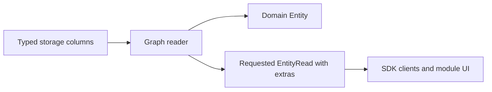
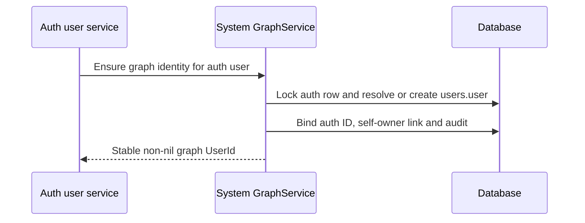

# Adopt the knowledge graph contracts

Status: SPEC_DRAFT  
Spec lock: unlocked  
Implementation lock: unlocked  
Active Delivery: none  
Unattended decisions: allowed  

<!-- plan:spec:start -->
## The Goal

1. Establish one English developer reference in `docs/vision.md`, with each type next to its behavior and exceptions, and use it as the migration contract for the app and plugin catalog.
2. Adopt explicit persistent/transient and derived types across the shared SDK and its consumers, then separate domain Entity values from requested operational extras without changing identity, evidence or access scope.
3. Migrate pin, archive, privacy, configured model trust and indexing projections and consolidate organizational membership relations into `belongs_to`, preserving sync choices, temporal history and repeat-ingestion behavior.
4. Give each Magnis auth user a canonical `users.user` Entity, connect people to it through `identity`, and maintain protected temporal `owner` Links through system GraphService functions only.
5. Bring Graph reads, Search, merge, extraction and workspace transfer onto those same boundaries; preserve deterministic replay and protected ownership. Generalize creation provenance to created, and develop communication facts and typed subscriptions to committed graph events without treating historical imports as new deliveries.
6. Publish compatible app/catalog changes through the existing SDK and package activation mechanism, with migration fixtures, scoped checks and the complete affected repository gates. Implementation begins only after the owner approves the SPEC and the resulting Delivery/Stage contract.

## Why now

The owner has defined the target graph in a sustained design discussion. Public Entity currently mixes knowledge with pin/archive/indexing state; identity, Source records and security users are represented at different boundaries. The request is to translate and restructure that reference, commit it, and prepare the migration plan. This commit changes documentation only.

The reference retains the inspected October 3–5 behavior and labels target/open rules. App `staging` inspected on October 6 at `3579a8fff765293bb14b421212552fca9800706b` still has Entity.owner, nullable isPinned/isArchived, boolean indexed and no canonicalKey in its Entity declaration. The earlier entity-one-type checkout is no longer present. Identity, entity-sync, auto-modules and WebSource work must be reconciled with their current owners before implementation; their presence in the document is not evidence they are merged into staging. Do not reimplement their approved work from an older snapshot.

Evidence owners:

| Finding | Inspected code / reference |
| --- | --- |
| Public flags and owner are part of Entity | App `packages/sdk/src/core/entity.ts`, `backend/src/core/entity.ts` |
| Viewer preference and domain rows differ | App `backend/src/db/schema/graph.ts`, `backend/src/db/repository-helpers.ts` |
| Auth users have secrets and a nil-ID default account | App `backend/src/db/schema/users.ts`, `services/users/default-user.ts`, `users.service.ts` |
| Exact identity/preparation and hub merge replay already exist in working branches | Reference sections 6–7; inspected identity/entity-one-type graph repository and merge PG scenarios 054/055 |
| Claims, pending/indexed/refused and temporal derivation exist in inspected working code | Reference sections 10–11; SDK indexing, Graph derive/claim.repository and search graph-indexer |
| Earlier privacy work is a contract, not a completed implementation | App `feat/private-entity-flag`, commit `2ea08b25957bbb3d60bdeb144d19f2d24d3d4665`; model trust replaces its local/cloud eligibility test by owner decision |
| Model execution metadata already exists; model trust does not | Identity checkout `packages/sdk/src/core/ai-model.ts`, `backend/src/agent/models/types.ts`, `ai-model-directory.service.ts` and `provider-model-catalog.source.ts`; existing `dataBoundary` comes from catalog metadata |
| Shared organizational membership and creation provenance | Owner retains belongs_to and replaces Episode → triggered_by → Trigger with Trigger → created → Episode; projects.belongs_to has matching member → project semantics |
| Communication changes the earlier chat-membership proposal | Current Telegram in_chat supplies conversation membership, not delivery direction/time; Google folds Date/internalDate into sent_at; email schema allows received_at |
| Trigger delivery requires a graph event contract | Identity Graph EventRepository/owner mutation revision and TriggersService; current EventBus is in-process, trigger.check is module-produced and live-only |

## The target

### Interfaces

The following signatures declare migration differences, not new parallel SDKs. Definitions belong in the existing SDK owner files. Persistent-ID and Derived naming follow the owner decisions. Other proposals remain explicitly marked; the New names table records their reasons.

```typescript
// SDK core/entity.ts; Id and UuidShapeSchema remain canonical imports.
export const PersistentEntityIdSchema = UuidShapeSchema
  .refine((id: string) => id !== NIL_ID, "Persistent Entity ID must not be nil")
  .brand<"PersistentEntityId">();
export type PersistentEntityId = z.output<typeof PersistentEntityIdSchema>;
export type EntityId = PersistentEntityId | NilId;

// Auth identity is intentionally separate from the graph user's node.
export type AuthUserId = Id;
export type UserId = PersistentEntityId;

export interface UserEntityBinding {
  authUserId: AuthUserId;
  entityId: UserId;
}

export type Origin = "canonical" | "derived";

export interface DerivedStatement {
  origin: "derived";
  confidence: number;
  evidence: [PersistentEntityId, ...PersistentEntityId[]];
  validFrom: DateTimeUtc | null;
  validUntil: DateTimeUtc | null;
}
export interface DerivedEntity<P extends JsonValue = JsonValue>
  extends EntityBase<P>, DerivedStatement {
  keys: string[];
}
export interface DerivedLink extends LinkBase, DerivedStatement {}
export type Link = CanonicalLink | DerivedLink;

// Internal deriveEntity result; not a graph Entity.
export interface EntityDerivation {
  eligible: boolean;
  reason: string | null;
  confidence: number;
  evidence: PersistentEntityId[];
}
export declare function deriveEntity(
  claims: readonly GraphClaim[],
  withdrawn: boolean,
): EntityDerivation;

export const derivedStatementSchema = z.strictObject({
  origin: z.literal("derived"),
  confidence: z.number().gt(0).lte(1),
  evidence: z.tuple([PersistentEntityIdSchema], PersistentEntityIdSchema),
  validFrom: dateTimeSchema.nullable(),
  validUntil: dateTimeSchema.nullable(),
});

// Existing generic Entity variants are renamed, not duplicated.
export type Entity<P extends JsonValue = JsonValue> =
  | CanonicalEntity<P>
  | DerivedEntity<P>;
export type PersistentEntity<P extends JsonValue = JsonValue> =
  Entity<P> & { id: PersistentEntityId };
export type TransientEntity<P extends JsonValue = JsonValue> =
  Entity<P> & { id: NilId };

export interface EntityRead<P extends JsonValue = JsonValue> {
  entity: PersistentEntity<P>;
  extras: EntityExtras;
}
export interface GraphReader {
  get(id: PersistentEntityId): Promise<PersistentEntity>;
  get(id: PersistentEntityId, options: { extras: true }): Promise<EntityRead>;
}

// Add this required field to the existing SDK core/ai-model.ts types.
// These excerpts omit their unchanged fields.
export interface EmbeddingModelInfo {
  readonly private: boolean;
}
export interface LlmModelInfo {
  readonly private: boolean;
}

export type CreatedLink = Link & { kind: "created" };
export type BelongsToLink = Link & { kind: "belongs_to" };

// Existing SDK neighbor projection; unchanged fields omitted.
export interface LinkedEntitySummary {
  linkKind: LinkType;
  direction: "out" | "in";
}

export type CommunicationLink = CanonicalLink & {
  kind: "sent" | "received";
  from: PersistentEntityId;
  to: PersistentEntityId;
  metadata: {
    occurredAt: DateTimeUtc | null;
    conversationId: PersistentEntityId | null;
  };
};

// GraphMutationEvent, GraphEventFilter and GraphSubscription are declared
// together with ordering/matching rules in reference section 12.
// Target changes to existing Trigger types; unchanged fields omitted.
export interface TriggerDefinition { revision: string; }
export type TriggerInput =
  | { kind: "event"; eventId: Id }
  | { kind: "schedule"; scheduledFor: DateTimeUtc }
  | { kind: "manual"; requestId: Id };
export interface TriggerExecution {
  triggerId: PersistentEntityId;
  triggerRevision: string;
  input: TriggerInput;
}

export interface EntitySystemState {
  owner: AuthUserId; // Hidden existing SQL ownership scope.
}
export type UserEntityProperties = {
  name: string;
  surname: string | null;
};
export type UserEntity = CanonicalEntity<UserEntityProperties> & {
  id: UserId;
  schemaId: "users.user";
};
export interface TransferOwnershipRequest {
  entityId: PersistentEntityId;
  newOwnerId: UserId;
}
```

EntityBase.id becomes EntityId; Link endpoints and every saved evidence/reference become PersistentEntityId. Other Source/account/schema IDs retain their existing domains. DerivedEntity, DerivedLink and DerivedStatement replace AgentEntity, AgentLink and AgentStatement throughout compiler-reported consumers. The target discriminator is `origin: "derived"`, covering extraction, aggregation and inference. `GraphClaim` remains the source assertion, while DerivedStatement carries the graph result supported by those claims. Rename the existing internal `DerivedEntity` computation result to `EntityDerivation`, matching `RelationDerivation`, before reusing DerivedEntity for the full graph value.

EntityExtras is the reference's flat required shape: `pinOrder: number | null`, `archived: boolean`, `private: boolean`, read-only `indexed: "pending" | "indexed" | "refused"`, plus either `{syncEnabled: boolean; syncRevision: string}` or the complete pair of nulls. There is no pinned boolean, trigger array, owner or independent indexingPending. Public parsers reject missing fields and half-present sync pairs. The Graph read projection maps a missing graph_index row to pending.

Model `private` means authorized to process private data at the configured execution endpoint. Apply the same required field to the existing logical-model record and administration response; keep model-directory execution metadata `dataBoundary` independently. Known local execution qualifies automatically; an authorized configuration owner may declare another endpoint, including their own cluster, private. Unclassified endpoints do not qualify. The privacy eligibility condition is `!extras.private || model.private`, alongside ordinary access, availability and processing checks.

**Proposed bootstrap choice for approval:** preserve existing auth IDs and foreign keys; add a unique `users.entity_id` mapping to a non-nil graph user. The default nil auth user therefore gets a distinct assigned Entity ID. Existing `entities.owner` and `links.owner` remain private auth-scope projections, resolved to the graph user through that mapping. This refines the reference's previously open storage mapping; it avoids rewriting every auth/session/workspace reference. The graph-user schema exposes only name/surname in this scope; login email, password hashes, admin privileges, sessions and provisioning state stay in auth storage.

### A. Publish the core SDK and extras projection together



Reuse existing Graph queries and response schemas. Persisted internal rows may contain owner and operational columns; they are not serialized by spreading a storage object into Entity. Ordinary reads can omit preference/index-status joins while still enforcing ACL, archive and privacy. Detail, traversal, lists, tools and transfer must each declare their projection explicitly; no accidental second Entity shape in plugins.

| Implementation map | Core and extras |
| --- | --- |
| Owner | SDK entity/link/statement definitions; GraphService and repository readers |
| Target files | CREATE `../../../magnis-app/backend/migrations/20261006000000_graph_derived_origin.sql`; MODIFY `../../../magnis-app/packages/sdk/src/core/entity.ts`, `../../../magnis-app/packages/sdk/src/core/link.ts`, `../../../magnis-app/packages/sdk/src/core/statement.ts`, `../../../magnis-app/packages/sdk/src/rpc/registry.ts`, `../../../magnis-app/backend/src/core/entity.ts`, `../../../magnis-app/backend/src/services/graph/entity.repository.ts`, `../../../magnis-app/backend/src/services/graph/graph.service.ts`, `../../../magnis-app/backend/src/services/graph/graph.controller.ts`, `../../../magnis-app/backend/src/db/repository-helpers.ts` |
| Input / wake | Known-ID reads, list/detail requests, explicit extras request, existing mutation commands |
| Output / durable state | One domain type, explicit extras responses, hidden auth owner; existing sync revision and processing permission retained |
| RED test | Extend `backend/test/tst_bts_graph_entity_repo_contract.test.ts`, `tst_bts_graph_pins.test.ts` and SDK `test/graph.contract.test.ts`: bare read omits operational fields; extras read preserves two viewers' distinct preferences; current parsers accept derived and reject agent |

Use `/rename` during implementation for symbol changes: change the owning declaration, follow compiler errors and run the affected project typecheck; do not perform text-search-driven symbol replacement. Runtime strings such as relation kinds and stored JSON need explicit migration fixtures independently of the compiler.

Migrate Entity and Link origin values from `agent` to `derived` with a dedicated SQL migration. Update the origin-value and statement constraints, SQL predicates, SDK discriminated unions and the agentStatementSchema export (renamed derivedStatementSchema). Preserve IDs, evidence, confidence, keys, eligibility and periods. GraphClaim.origin remains indexed/manual; auth agent settings, event producers and domain properties containing the string agent are unrelated.

Versioned workspace import translates the legacy Entity/Link discriminator explicitly; new exports and current public parsers use derived only. Update app and catalog artifacts together at the existing compatibility boundary. Stop old writers for the database cutover and validate the new constraints before activating the new runtime. A repeated upgrade changes no additional rows; an unrecognized origin aborts the transaction. No permanent third origin or silent generic string replacement is introduced.


### B. Migrate operational storage without inventing input values

Keep typed columns; do not introduce a JSONB extras table. Normalize archived null/false to false and retain true. Add private using the previously approved privacy contract's initial false. Keep the current internal processing-permission boolean separate from read-only indexed status. Move sync fields only in the public projection, preserving stored booleans, decimal revisions and pending/applied selections.

**Proposed legacy pin rule for approval:** pin status follows the old pinned flag. Preserve numeric orders of actually pinned rows. Append pinned rows lacking an order after existing pinned orders, deterministically by Entity createdAt then ID for each viewer; when no ordered pin exists, this migration starts the sequence at zero. An order-only unpinned row becomes null. Keep the old columns as deprecated migration evidence during this rollout and export the pre-migration fixture/backup for rollback. Removing those columns is a later cleanup after migrated counts and UI ordering pass, not part of the four migrations below. If appending would overflow the storage integer, fail preflight and request an explicit resequencing decision. Runtime pin commands require a supplied integer, including zero; no missing-value default.

Implement the embedding privacy scope using the owner's revised model-trust rule. A private Entity is eligible only when the selected model has private true; otherwise exclude it from selection, audit, counts and ranked hydration. A declared-private cluster is eligible even with dataBoundary cloud_allowed. This supersedes the older draft's local/cloud test. Stop excludes a scope's new Source changes, not its saved graph or local manual writes. The same trust principle applies to language models, but enforcement in chat/completion and extraction remains a follow-up contract; this migration does not claim those paths are protected.

| Implementation map | State migration |
| --- | --- |
| Owner | Database migration, Graph lifecycle/preferences and search policy |
| Target files | CREATE `../../../magnis-app/backend/migrations/20261006000001_graph_extras.sql`; MODIFY `../../../magnis-app/backend/src/db/schema/graph.ts`, `../../../magnis-app/backend/src/services/graph/entity.repository.ts`, `../../../magnis-app/backend/src/services/search/search-index.repository.ts`, `../../../magnis-app/backend/src/services/search/search-indexer.service.ts`, `../../../magnis-app/backend/src/services/search/search-query-compiler.repository.ts`, `../../../magnis-app/backend/src/services/search/search-query-helpers.ts`, `../../../magnis-app/backend/src/services/search/ranked-search-scope.repository.ts`, `../../../magnis-app/backend/src/services/search/entity-search.repository.ts` (DB schema regenerated) |
| Input / wake | Upgrade with legacy preference rows, archive nulls, existing sync choices and index records |
| Output / durable state | Deterministic nullable pin order; required archive/private projection; no false claim that processing succeeded |
| RED test | Extend `backend/test/tst_bts_graph_pins.test.ts`, `tst_bts_search_visibility.test.ts`, `tst_bts_search_indexer.test.ts` with migration/zero-order/privacy cases |

#### Configure model trust through the existing model settings

Extend the existing logical-model storage, model-settings mutation and SDK directory/admin responses with a required private boolean. Persist it in a typed ai_models.private column in the same extras migration. Known local execution is private automatically. For non-local or unclassified existing bindings, migration initializes private false; the configuration owner can explicitly authorize a cluster afterward. Do not copy dataBoundary device_only blindly: the current Ollama catalog labels a tag without remote_host as device_only even when the configured provider endpoint is remote. Reuse the installed local adapter/binding metadata to establish known local execution.

Use existing settings permissions; model output, discovery metadata and generic graph writes cannot declare an endpoint trusted. The declaration belongs to the configured logical model and endpoint, not a global model name. Preserve it across restart and catalog refresh at the same endpoint. An endpoint change requires fresh classification, and private changes use existing configuration revisions/events to invalidate cached directory and search policy. After a completed change, subsequent indexing/search uses the new policy; ordering against requests already in flight remains explicitly open. Public response validators require the boolean, and explicit trust writes reject missing/null values. Keep dataBoundary for execution metadata and existing Local captions.

| Implementation map | Model trust |
| --- | --- |
| Owner | Existing model configuration/storage, SDK model contracts and Settings UI; model services below are prerequisite definitions in the identity checkout, to be modified only on the integrated app head |
| Target files | MODIFY `../../../magnis-app/packages/sdk/src/core/ai-model.ts`, `../../../magnis-app/packages/sdk/src/rpc/registry.ts`, `../../../magnis-app/backend/src/db/schema/ai.ts`, `../../../magnis-app/.worktrees/identity/backend/src/agent/models/types.ts`, `../../../magnis-app/.worktrees/identity/backend/src/agent/models/ai-model.repository.ts`, `../../../magnis-app/.worktrees/identity/backend/src/agent/models/ai-model-management.service.ts`, `../../../magnis-app/.worktrees/identity/backend/src/agent/models/ai-model-directory.service.ts`, `../../../magnis-app/backend/src/services/settings/settings.service.ts`, `../../../magnis-app/frontend/src/modules/settings/ModelsPanel.tsx`, `../../../magnis-app/frontend/src/modules/settings/hooks/useAiModels.ts`; reuse migration `20261006000001_graph_extras.sql` and existing settings RPC and registration callers identified before Stage approval; DB schema regenerated |
| Input / wake | Upgrade, local model materialization, explicit trust change, endpoint change, catalog refresh |
| Output / durable state | Required model private boolean, persisted declaration for the current endpoint, updated model-policy revision |
| RED test | Extend `backend/test/tst_bts_ai_models_contract.test.ts`, `tst_bts_ai_models_control_plane.test.ts`, `tst_bts_search_visibility.test.ts` and frontend `hooks/__tests__/useAiModels.test.tsx`: known local, declared-private cluster, unknown endpoint, restart/refresh and subsequent work after revocation |

### C. Consolidate organizational membership and creation provenance

Register host-owned belongs_to for organizational membership. Convert triggers.belongs_to without reversing endpoints; projects.belongs_to → belongs_to is an explicit review proposal with the same member → container direction. Preserve endpoint schemas, periods, claims and producer metadata, and replace implicit prefix grants with explicit module permissions. Retain child_of for Episode hierarchy. Trigger parent lookup must filter belongs_to targets to episodes.episode and reject zero or multiple distinct active parents; project membership must not affect it.

The owner's communication correction supersedes the earlier blanket in_chat → belongs_to migration. Preserve historical in_chat until section G establishes how to retain conversation context and whether transmission/delivery facts can be recovered. A chat-membership edge alone cannot establish a received fact, an observer account or a receipt time.

Replace Episode → triggered_by → Trigger with Trigger → created → Episode. created now covers a producing Episode or Trigger. Register the Trigger-to-Episode pair and update the trigger writer, replay path, SDK ranks, readers and versioned import/export. Preserve Link IDs unless collision handling produces an explicit mapping, and retain metadata, evidence, origin, periods and timestamps. Rewrite effective claim/withdrawal identities consistently, while leaving raw source text and immutable audit history in their original versioned form. Non-Episode/Trigger historical endpoints require explicit review before conversion.

The existing LinkedEntitySummary gains direction out/in relative to the viewed Entity and retains the stored linkKind. Stop serializing inverse presentation labels as kinds. The Trigger displays outgoing created results; its Episode displays incoming created provenance. Existing reverse labels such as watched_by and child_episodes are view labels only. A self-link emits one out summary; same_as uses a symmetric label. These are projections over one stored edge, not additional inverse relations.

Before rewriting, enumerate duplicate keys caused by convergence. Identical pair/origin/period duplicates may use the existing deterministic Link collapse mechanism with an ID mapping; differing overlapping periods or conflicting producer provenance fail migration preflight without changing rows. Do not silently discard temporal history. Old workspace input is upgraded at its versioned import boundary; new organizational-membership exports and writes use belongs_to, and new creation provenance uses created. No permanent runtime alias namespace is introduced.

| Implementation map | Membership and creation |
| --- | --- |
| Owner | Graph registry, workspace codecs, Trigger/Episode writers and readers, Projects/Triggers modules |
| Target files | CREATE `../../../magnis-app/backend/migrations/20261006000002_graph_membership.sql`; MODIFY `../../../magnis-app/packages/sdk/src/core/link.ts`, `../../../magnis-app/packages/sdk/src/core/episode.ts`, `../../../magnis-app/packages/sdk/src/core/linked-entity.ts`, `../../../magnis-app/backend/src/core/episode.ts`, `../../../magnis-app/backend/src/core/graph-view.ts`, `../../../magnis-app/backend/src/services/graph/graph-contracts.ts`, `../../../magnis-app/backend/src/services/graph/link.repository.ts`, `../../../magnis-app/backend/src/services/graph/graph.transfer.ts`, `../../../magnis-app/backend/src/services/triggers/triggers.repository.ts`, `../../../magnis-app/backend/src/services/triggers/triggers.service.ts`, `../../../magnis-app/.worktrees/identity/backend/src/agent/episodes/episode.ts`, `../../../magnis-app/.worktrees/identity/backend/src/agent/episodes/episodes.service.ts`, `../../../magnis-app/.worktrees/identity/backend/src/agent/episodes/episodes-dataset-contract.ts`, `../../../magnis-app/frontend/src/modules/episodes/helpers.ts`, `modules/triggers/manifest.toml`, `modules/triggers/schema.ts`, `modules/triggers/module/service.ts`, `modules/projects/manifest.toml`, `modules/projects/schema.ts`, `modules/projects/module/service.ts`; identity paths name prerequisite owners on the integrated app head |
| Input / wake | Upgrade, module activation, message/trigger creation, import and relation queries |
| Output / durable state | Shared organizational membership, created provenance in the correct direction, direction-preserving views, retained temporal/provenance data and unresolved communication history |
| RED test | Extend app `backend/test/tst_bts_graph_link_kinds.test.ts`, `tst_bts_graph_merge_pg.test.ts`, `tst_bts_dataset_format.test.ts`, `tst_bts_triggers_repository.test.ts`, `tst_bts_triggers_service.test.ts`, `tst_bts_episodes_snapshot.test.ts`; catalog `modules/projects/module/__tests__/projectsCrud.test.ts` and trigger CRUD/read scenarios |

### D. Bootstrap graph users and protect ownership at every writer



The proposed user node is a non-mergeable, non-generic-deletable, non-syncable host identity_channel. Bootstrap is idempotent under a unique mapping and row lock. A user's root node is owned by that auth user and has the system-only self-owner Link; this is an explicit root case, not permission for generic self-owned Links. Backfill existing users, including nil auth user, before enabling public owner traversal. Add a person → user identity Link only when the user/account mapping supplies an unambiguous person; never select one by name alone.

Backfilled owner periods start at the migration's recorded timestamp. Existing ownerId supplies current ownership, not evidence of ownership since createdAt; ownership before that timestamp remains unknown unless an authoritative historical record is available. Newly created entities start their owner period at creation. Complete bootstrap in one system transaction: create the graph node for the existing auth row, set its unique binding, then record the protected self-owner Link and audit.

Every new Entity gets its current owner Link in the same transaction. Generic add/end/unlink/patch, plugin batch, extraction, registration, import and merge must reject or route protected mutations to the system function. Import restores auth bindings for the target workspace and system ownership through GraphService instead of inserting arbitrary owner rows. Exact transfer input uses graph UserId; Graph resolves both auth scopes internally. Lock participating auth scopes in stable order.

**Proposed bounded transfer policy for approval:** implement transfer for a non-user Entity only if it has no ordinary incident Links, no claims/evidence dependencies, and no non-owner references requiring transfer. Inventory relational and structured-JSON references on the integrated head before enabling transfer; if completeness cannot be established, leave transfer unavailable. Otherwise return an explicit conflict for any such dependency, with no mutation. This first contract does not guess a transfer closure or grant access across users. At one service-chosen timestamp, close prior owner, insert new owner, update internal scope/projection and audit atomically. Same-owner transfer is a no-op. Transfer/user-node deletion and connected cross-owner moves require a later owner-approved contract, not an external allowSystemLinks switch.

| Implementation map | User and ownership |
| --- | --- |
| Owner | Existing UsersService and system GraphService methods |
| Target files | CREATE `../../../magnis-app/backend/migrations/20261006000003_graph_user_ownership.sql`; MODIFY `../../../magnis-app/backend/src/db/schema/users.ts`, `../../../magnis-app/backend/src/db/schema/graph.ts`, `../../../magnis-app/backend/src/core/user.ts`, `../../../magnis-app/packages/sdk/src/core/user.ts`, `../../../magnis-app/packages/sdk/src/core/entity.ts`, `../../../magnis-app/packages/sdk/src/core/link.ts`, `../../../magnis-app/backend/src/services/users/users.service.ts`, `../../../magnis-app/backend/src/services/users/user.repository.ts`, `../../../magnis-app/backend/src/services/users/default-user.ts`, `../../../magnis-app/backend/src/services/graph/graph.registrar.ts`, `../../../magnis-app/backend/src/services/graph/graph.service.ts`, `../../../magnis-app/backend/src/services/graph/graph.repository.ts`, `../../../magnis-app/backend/src/services/graph/link.repository.ts`, `../../../magnis-app/backend/src/services/graph/graph.transfer.ts`, `../../../magnis-app/backend/src/services/search/search-query-compiler.repository.ts`, `../../../magnis-app/packages/sdk/src/rpc/registry.ts` (DB schemas regenerated) |
| Input / wake | Auth bootstrap, existing-user upgrade, Entity creation, authorized transfer, import and ownership query |
| Output / durable state | Stable graph user mapping, one current protected owner relation, hidden consistent auth projection and audit |
| RED test | Extend `backend/test/tst_bts_users_service.test.ts`, `tst_bts_workspace_identity.test.ts`, `tst_bts_graph_batch.test.ts`, `tst_bts_graph_merge_pg.test.ts`; CREATE `backend/test/tst_bts_graph_owner.test.ts` for cross-entry-point protection and atomic transfer |

### E. Preserve identity and temporal claims through the new boundary

Do not turn this migration into a new entity resolver. Reuse exact Source/canonical keys, preparation, identity Links, merge preview/execute and deterministic derive functions. Preserve the canonical identity-hub exception and repeated ensure after merge. Add the ordinary domain validator and protected-kind checks at extraction commit and merge result validation, so repository use cannot bypass them. Canonical/derived origin separation, explicit field conflicts, interval overlap refusal and source-claim replacement remain intact.

For this migration, same-schema different-version merge fails explicitly unless an existing approved version conversion is available. Keep current property merge behavior documented; do not silently add field claims or promote derived values. **Proposed conservative extras rule:** refuse merge when privacy, syncEnabled or per-viewer pinOrder differ (absent viewer preference means null); do not add an undeclared extras override to the properties-only MergeOverride. Equal choices survive; keep the survivor's syncRevision as its own counter, rather than comparing counters from different entities. Both participants must already be unarchived. Reconcile/invalidate derived indexing through the existing graph mutation path, never choose the better-looking status. A richer extras arbitration command remains a separate contract. System merge retains the survivor owner and retires the duplicate same-owner relationship through the protected path; it does not transfer ownership. Replay must still resolve both representations to the survivor.

Keep pending/indexed/refused with the existing owner revision fence. The revision-based search queue remains a follow-up design already described in the reference: requested/processed and configuration revisions, dependency invalidation, retry/refusal and crash recovery must be completed before that queue replaces digest selection. Do not claim it has been implemented by exposing the status field.

| Implementation map | Process consistency |
| --- | --- |
| Owner | Graph domain decision functions and the existing indexer |
| Target files | MODIFY `../../../magnis-app/backend/src/services/graph/merge.ts`, `../../../magnis-app/backend/src/services/graph/graph.repository.ts`, `../../../magnis-app/backend/src/services/graph/graph.service.ts`, `../../../magnis-app/backend/src/services/graph/graph.transfer.ts`, `../../../magnis-app/backend/src/core/merge.ts`; prerequisite owners currently in identity checkout: `../../../magnis-app/.worktrees/identity/backend/src/services/graph/claim.repository.ts`, `../../../magnis-app/.worktrees/identity/backend/src/services/graph/derive.ts`, `../../../magnis-app/.worktrees/identity/backend/src/services/search/graph-indexer.ts`, `../../../magnis-app/.worktrees/identity/packages/sdk/src/core/indexing.ts` |
| Input / wake | Preview/execute, model proposal, changed source, repeated ensure and workspace replay |
| Output / durable state | Validated new projection with preserved identity/provenance and deterministic temporal results |
| RED test | Extend existing graph merge, batch and workspace scenarios; CREATE `backend/test/tst_bts_graph_contract_admission.test.ts` to reject malformed domain proposals and protected owner writes at every affected commit boundary |

### F. Migrate consumers and publish compatible artifacts

Use the SDK build and existing generated host-stub workflow. Convert app frontend/client-core and plugin SDK callers from direct flags to EntityRead/extras where the UI actually needs them; domain-only processing remains on Entity. Trigger lists remain separate paginated resources. Update relation consumers and declared permissions before activating packages against the new contract.

Do not support two permanent public Entity formats. Version the shared SDK/package activation boundary and reject an incompatible package as one activation, retaining the previous accepted version. Stored legacy values and old workspace exports are translated only by explicit migration/import boundaries. Stage the app runtime and catalog artifact versions together; rollout starts only after their compatibility matrix and restore fixture pass.

| Implementation map | Consumers and publication |
| --- | --- |
| Owner | SDK publisher, app transport/client-core and catalog SDK/UI owners |
| Target files | MODIFY `../../../magnis-app/frontend/src`, `../../../magnis-app/packages/client-core/src`, `../../../magnis-app/cli/src`, `../../../magnis-app/scripts/sdk-contract-audit.ts`, `../../../magnis-app/scripts/sdk-package-smoke.ts`, `../../../magnis-app/backend/src/services/workspace/workspace-document.ts`, `packages/plugin-sdk/contract/module.ts`, `packages/plugin-sdk/__tests__/graphContract.test.ts`, `packages/host-stubs/types`; exact module and UI callers derived by compiler before Stage approval |
| Input / wake | New SDK build, module installation/upgrade, UI reads, export/import |
| Output / durable state | Compatible artifacts and strict runtime contracts, no handwritten replacement host stubs |
| RED test | Existing package smoke, plugin graph contract and affected module/UI scenarios; one migrated-workspace integration fixture |

### G. Communication facts and committed graph subscriptions

This is the newly requested concept, developed in reference sections 3 and 12. Its event boundary is the target; concrete endpoint/conversation representation and the admission policies below remain proposals to resolve before executable Stage approval. Do not pretend those decisions are already deployed.

Communication records use sent/received with an occurrence time, independently of graph createdAt and validity periods. The working direction is concrete mailbox/account → message, with conversation context separately identified. A shared chat has no account-independent incoming/outgoing direction. A successful send or authoritative source observation can establish sent; recipient headers alone cannot establish received. Keep authored_by, sent_to, created and reply_to as distinct facts. Validate conversation references through Graph, including merge/deletion handling; do not hide unchecked IDs in metadata. Choose a concrete mailbox Entity when email.address does not identify the receiving endpoint uniquely. Repeated physical deliveries of the same message/endpoint need an occurrence identity before they can be represented; current Link period constraints do not supply one.

Extend the existing graph Event/audit path with a durable, owner-scoped mutation projection: stable Event ID, owner revision plus ordinal cursor, recording/occurrence times, trusted ingestion phase, causal context and before/after snapshots. Assign event order and subscription activation under the existing owner mutation fence. Append events in the same transaction as message and communication Links. Cover GraphService, batch ingestion, merge, transfer/import and remaining repository writers; rollback must expose no event. A wake notification is optional acceleration. The current EventBus and timestamp-ordered audit table alone are not a durable subscription stream.

GraphSubscription selects registered event types and typed Entity/Link predicates, with explicit phase/occurrence bounds and before/after matching. The received template selects link_added for its receiving endpoint. Validate filters and derive owner scope server-side. Any accessible registered Entity/Link event can be selected; remove Schema.triggerable/watchable admission once legacy rules are translated. Replace trigger.check-only production with committed Graph events without double dispatch. Legacy sender-based email watches require a sender predicate; never translate them into mailbox-receipt subscriptions by matching IDs alone.

Reuse Trigger configuration, optional gate, scheduler and Episode creation. Explicit gate_prompt null bypasses the model; blank strings remain invalid. TriggerConfig gains subscriptions: readonly GraphSubscription[] and its existing gate_prompt becomes string | null. The public TriggerExecution projection uses camelCase (firedAt, gateResult, episodeId); storage decoding migrates explicitly. The durable admission key is trigger ID, rule revision and Event ID, not event Entity ID. Claim before gate evaluation, persist/reuse the decision under a lease, and commit the resulting Episode admission with the delivery receipt. At-least-once delivery must survive restart without creating duplicate Episodes. Two updates to one Entity are distinct events. TriggerInput distinguishes actual graph Event IDs, UTC schedule slots and manual request IDs. Schedule/manual admission uses trigger ID, rule revision and typed input identity; retries retain that identity without fabricating graph events. Causal ancestry prevents a Trigger from firing on its own descendant writes. Recheck current access and private-data policy before model/action execution.

Fresh-communication rules explicitly admit live and catchup events occurring since activation; bootstrap/migration and unknown occurrence time do not satisfy that rule. This deliberately improves on current blanket live-only filtering for deliveries missed during downtime. A rule can request historical processing explicitly. Do not infer receivedAt from Date headers, epoch zero or insertion time. Migrate source adapters to preserve the distinct available timestamps and classification, without manufacturing missing provider evidence.

**Decisions required before executable stages:** choose mailbox/account identity and conversation representation; define repeated-delivery identity, snapshot authorization after deletion/transfer and durable debounce/coalescing. Inventory existing watches, in_chat and Episode sent rows and document a deterministic mapping for each supported case. Unmappable historical relations remain readable and unresolved; unmappable automation stays paused for owner review. These rules are not deleted or silently broadened. Delivery uniqueness does not establish exactly-once external side effects.

| Implementation map | Communication and event subscriptions |
| --- | --- |
| Owner | Existing graph Event/transaction owners, Trigger repository/engine, communication adapters and domain modules |
| Target files | MODIFY `../../../magnis-app/backend/src/core/event.ts`, `../../../magnis-app/backend/src/core/trigger.ts`, `../../../magnis-app/backend/src/core/schema.ts`, `../../../magnis-app/backend/src/db/schema/graph.ts`, `../../../magnis-app/backend/src/db/schema/triggers.ts`, `../../../magnis-app/backend/src/services/graph/event.repository.ts`, `../../../magnis-app/backend/src/services/graph/graph.repository.ts`, `../../../magnis-app/backend/src/services/graph/graph.service.ts`, `../../../magnis-app/backend/src/services/graph/graph.transfer.ts`, `../../../magnis-app/backend/src/services/triggers/types.ts`, `../../../magnis-app/backend/src/services/triggers/triggers.repository.ts`, `../../../magnis-app/backend/src/services/triggers/triggers.service.ts`, `../../../magnis-app/backend/src/services/triggers/triggers.controller.ts`, `../../../magnis-app/backend/src/services/triggers/triggers.scheduler.ts`, `../../../magnis-app/backend/src/process/event-bus.ts`, `../../../magnis-app/packages/sdk/src/rpc/registry.ts`, `packages/declare/index.ts`, `packages/declare/derive.ts`, `modules/triggers/types.ts`, `modules/triggers/module/service.ts`, `modules/email/entities.ts`, `modules/email/types.ts`, `modules/email/module/service.ts`, `modules/telegram/module/service.ts`, `sources/google/src/surfaces/email/gmail.ts`, `sources/google/src/surfaces/email/imap.ts`, `sources/telegram/src/surfaces/telegram/envelope.ts`; exact delivery-storage migration and new endpoint declarations are chosen after the decisions above, not guessed now |
| Input / wake | Committed graph mutations, subscription activation/revision, source live/catchup/history, replay and schedule slots |
| Output / durable state | Confirmed communication facts, recoverable mutation events and idempotent admission with distinct event/Entity identities |
| RED test | Extend app Trigger repository/service and graph batch tests, plus catalog `modules/email/module/__tests__/emailIngest.test.ts`, `emailSend.test.ts`, `modules/telegram/module/__tests__/telegramIngest.test.ts`, `sources/google/src/surfaces/email/gmail.test.ts`; commit/rollback, competing-worker/restart and activation-race scenarios require PostgreSQL coverage |

### Adoption order and proposed Delivery boundaries

This is the complete SPEC-level migration sequence. The executable Delivery/Stage/Task graph is authored after SPEC approval and resolution of section G's endpoint/admission decisions through planctl; none is approved or running in this commit.

| Order | Proposed PR boundary | Depends on | Completion evidence |
| --- | --- | --- | --- |
| 0 | Reconcile SDK/identity/entity-sync/claims/module-dependency prerequisites on the actual integration head | Their existing owners' work | Record integrated commits and compile the baseline; do not duplicate their implementations |
| 1 | App SDK names, derived-origin migration, persistent IDs, strict Entity/extras, model trust and storage migration | 0, approval of legacy pin proposal | Core parser, viewer preference, sync and read-projection scenarios; matched client changes in the same releasable boundary |
| 2 | App + catalog organizational membership and creation conversion | 1; project-membership proposal | Direction reversal, temporal collision preflight, permissions and Trigger/Project/Episode scenarios; no invented chat delivery facts |
| 3 | App graph users, protected ownership and bounded transfer | 1–2, approval of bootstrap/mapping/transfer proposals | Nil-auth-user bootstrap, all-writer rejection matrix, rollback/race and owner-search isolation |
| 4 | App merge/extraction/import validation and catalog consumer completion | 1–3 | Canonical/derived and period scenarios, repeated ensure, exported/restored workspace equivalence |
| 5 | App + catalog communication events and Trigger subscriptions | 1–4; resolve G's domain/admission contracts | Confirmed observations, atomic event persistence, restart/replay/race and history-admission evidence |
| 6 | Compatible runtime/SDK/catalog release and reference reconciliation | All above | Full affected gates, package/API compatibility, migration and restore verification; release approval remains separate |

Cross-repository implementation uses one shared plan. App Deliveries name repository `app`, catalog Deliveries name `catalog`; implementation setup configures `code-production.repository.app` / `.catalog` to the owner's intended checkouts. This authoring turn does not repoint shared repository configuration or create implementation worktrees. Active-time estimates and concrete Stage writes will be derived from the integrated baseline, not guessed across unmerged prerequisite branches.

## Target tree

App paths in the maps are relative to this plan checkout: `../../../magnis-app`. Identity-checkout paths identify prerequisite definitions currently absent from app staging; those changes will target the integrated app checkout after prerequisite reconciliation. They do not authorize edits to a colleague's worktree. Catalog paths are relative to this repository. Delivery repository bindings will replace these inspection locations before executable Stage approval.

| Action | Owner/path | Why this scope is necessary |
| --- | --- | --- |
| MODIFY | Catalog `docs/vision.md`, `README.md`, `docs/typing.md` | English reference, navigation, historical-status clarification |
| CREATE | Catalog `docs/plans/2026-10-06-entity-docs.md` | One migration plan, authored and journaled through planctl |
| MODIFY | App existing SDK, core and RPC files enumerated in maps A–G | Single shared definitions and runtime validators; no parallel type package |
| MODIFY | App existing Graph, Search, Users, transport and compiler-reported client files in A–G | Remove leaked operational fields and enforce the same authority in every writer and reader |
| MODIFY | App existing AI model contracts, model configuration services, Settings and model UI files in B | Persist configured model trust and expose it through existing administration and directory contracts |
| CREATE | `../../../magnis-app/backend/migrations/20261006000000_graph_derived_origin.sql` | Entity and Link origin discriminator and constraint migration |
| CREATE | `../../../magnis-app/backend/migrations/20261006000001_graph_extras.sql` | Typed extras, logical-model trust and legacy pin conversion |
| CREATE | `../../../magnis-app/backend/migrations/20261006000002_graph_membership.sql` | Organizational membership and creation direction/history conversion |
| CREATE | `../../../magnis-app/backend/migrations/20261006000003_graph_user_ownership.sql` | Auth-to-graph-user binding and protected ownership |
| MODIFY, generated | App DB schema files and catalog host stubs | Regenerate from canonical SQL and SDK; never hand-edit generated declarations |
| MODIFY | Existing catalog plugin SDK, affected modules and manifests in maps C and F | Consume the new SDK and shared membership permissions |
| MODIFY | Existing scoped tests named in A–G | Reuse Graph, workspace, User and Source harnesses and fixtures |
| CREATE | `../../../magnis-app/backend/test/tst_bts_graph_owner.test.ts`, `../../../magnis-app/backend/test/tst_bts_graph_contract_admission.test.ts` | Missing cross-writer ownership and domain-admission behavioral scenarios |

This bounds owners rather than guessing every compiler caller. Before executable Stage approval, enumerate the actual affected caller paths on the integrated head; unexpected files require an explicit Stage update. Reuse the existing graph Event and Trigger services. Section G will need durable delivery state, but its physical tables/migration are gated by its listed decisions and must be declared before Stage approval. No unrelated runner, auth system or generic resolver framework is introduced.

## Invariants

1. Nil is an unsaved sentinel; only assigned IDs can be Link endpoints, evidence or mutation targets. Existing auth nil IDs remain valid in their own domain.
2. Entity domain meaning is independent of whether extras is requested. Omitting extras never bypasses ACL, archive or privacy.
3. Nullable pin order is the only pin state; archive/private booleans and complete sync pairs are strict required response values. Read defaults occur at the specified storage projection only.
4. Owner is hidden system state and a protected canonical temporal Link. Generic RPC, plugins, model output, import and ordinary merge never acquire ownership-writing authority.
5. Source identity, domain identity, identity Links and physical merge retain distinct meanings. No automatic person merge by name, shared address or same_as chain.
6. Merge and extraction validate final domain data and registered endpoint rules under the same transaction/fence that records the result; stale model work cannot overwrite a newer graph.
7. Human approval does not change derived origin; repeated evidence does not add to confidence; a changed ending source cannot silently reopen a relation.
8. Migration preserves explicit sync decisions, applicable periods, auth bindings and access scope. Destructive ambiguity fails preflight rather than choosing silently.
9. Private Entity processing requires model private true. Known local execution and an explicit declaration for a configured cluster both qualify; physical location metadata alone does not authorize private-data processing.
10. Creation provenance, organizational membership and observed communication are distinct. A reversed created Link replaces triggered_by; belonging to a chat does not prove delivery.
11. Trigger admission consumes committed, authorized graph events. Occurrence time differs from insertion time; replay identity is an Event ID, not an Entity ID.

### Acceptance cases

| ID | Behavioral scenario |
| --- | --- |
| KG-01 | Step 1 → parse two different unsaved Web results with nil. Step 2 → attempt a Link/evidence/save-by-ID using nil. Verify → both values remain representable, while saved-reference operations reject nil and valid assigned references still resolve |
| KG-02 | Step 1 → read one Entity without extras. Step 2 → read it as two viewers with different preferences using extras. Verify → equal domain values, distinct pin orders, no owner/trigger list leakage, unchanged access checks |
| KG-03 | Step 1 → upgrade fixtures for pinned numeric zero, pinned unordered, unpinned order-only and no preference row. Step 2 → repeat migration and read/order/unpin. Verify → deterministic approved mapping, zero stays pinned, second migration makes no new change, original state remains recoverable during rollout |
| KG-04 | Step 1 → omit/null an archived/private/indexed field or supply a half sync pair to the public parser. Verify → rejection. Step 2 → read an actual missing graph_index row. Verify → explicit pending without inserting status or inventing metadata |
| KG-05 | Step 1 → Stop a scope while a fetched page waits to commit. Step 2 → release the page and restart worker. Verify → no new content/triggers after the committed Stop; saved choice/revision survives and old acknowledgement does not apply a newer choice |
| KG-06 | Step 1 → migrate Trigger and proposed Project membership with adjacent/duplicate periods. Step 2 → read, repeat ingestion and import an old workspace. Verify → shared belongs_to, retained periods/provenance and no repeat rows. Step 3 → inspect historical in_chat. Verify → retained until its communication/context mapping is defined; no invented received fact. Conflicting overlapping membership conversion aborts atomically |
| KG-07 | Step 1 → bootstrap the default nil auth user concurrently twice. Step 2 → restart and authenticate/read existing data. Verify → one assigned users.user, one binding and self-owner Link; auth ID and existing workspace access unchanged; no secrets in properties. Step 3 → query ownership before the backfill timestamp without historical evidence. Verify → no invented past owner |
| KG-08 | Step 1 → try owner add/end/unlink/patch through RPC, aliases, plugin batch, model output, registration, import and merge. Verify → rejection or the defined system route, with no forged owner. Step 2 → normal Entity creation. Verify → exactly one owner and matching internal scope/audit |
| KG-09 | Step 1 → transfer an isolated non-user Entity at T. Verify → old interval ends at T, new starts at T, one current owner, old user gains no current read right. Step 2 → retry same owner and test rollback midway. Verify → no extra interval; failure leaves original state. Step 3 → transfer a connected/claimed/user Entity. Verify → explicit conflict, no partial reassignment |
| KG-10 | Step 1 → create two internal people through different addresses and merge after preview. Step 2 → repeat ensure through both addresses. Verify → one survivor returned, representations retained, no new people; distinct provider canonical records still reject merge |
| KG-11 | Step 1 → preview conflicting properties then introduce another conflict. Step 2 → execute old overrides. Verify → refusal/rollback. Step 3 → provide explicit values but invalid domain output or incompatible schema version. Verify → refusal before mutation; valid override commits and old ID is not falsely promised as a redirect |
| KG-12 | Step 1 → feed identical claim sets as start→ending and ending→start. Step 2 → change the ending source. Verify → same interval in both orders, then hidden unresolved relation rather than invented reopening; repeated confidence never reaches one |
| KG-13 | Step 1 → return a model proposal with invalid domain properties, unauthorized endpoint roles or system owner kind. Verify → whole attempt rejected at commit. Step 2 → change graph revision during a valid model response. Verify → no stale nodes/claims/status completion |
| KG-14 | Step 1 → mark data private and select a model with private false, including an unclassified endpoint. Verify → no selection/audit/count/ranked hydration of private content. Step 2 → use a known local model. Verify → private true and processing allowed. Step 3 → explicitly authorize a cluster whose dataBoundary remains cloud_allowed. Verify → the same private data is eligible. Step 4 → read as an unauthorized graph user. Verify → ordinary ACL still refuses access. Step 5 → repeat with a non-private Entity and model private false. Verify → this flag imposes no restriction |
| KG-15 | Step 1 → export upgraded workspace and restore for its target auth user. Step 2 → compare domain identities, claims, periods, preferences, sync choices and protected owner bindings. Verify → intentional ID mappings only, no cross-owner disclosure or direct owner injection. Step 3 → install incompatible module artifact. Verify → rejected activation leaves prior accepted module active |
| KG-16 | Step 1 → preview/execute a merge with differing privacy, syncEnabled or viewer pinOrder. Verify → refusal without mutation, even if all property conflicts were resolved. Step 2 → equalize the choices through existing explicit commands and merge. Verify → survivor revision and equal choices retained; indexing invalidated/reconciled through the normal mutation path |
| KG-17 | Step 1 → upgrade a workspace with agent-origin Entity and Link rows, canonical rows, claims and unrelated domain properties containing agent. Verify → only Entity/Link discriminators become derived; IDs, evidence, confidence, periods and other origin domains stay intact; constraints validate. Step 2 → repeat the upgrade and import an old-version export. Verify → stable mapping without duplicates. Step 3 → parse current responses with derived, then agent. Verify → derived succeeds, agent is rejected; unknown stored origins abort migration without partial updates |
| KG-18 | Step 1 → upgrade known local and unclassified model bindings. Verify → local private true, unclassified private false; missing/null directory values are rejected. Step 2 → authorize a cluster through model settings, restart and refresh its catalog. Verify → trust survives at the same endpoint; an unauthorized settings write fails. Step 3 → revoke trust and await the saved configuration change. Verify → subsequent indexing/search excludes private content using the new policy. Step 4 → change the trusted model's endpoint. Verify → the old declaration does not authorize the new endpoint without fresh classification |
| KG-19 | Step 1 → migrate Episode → triggered_by → Trigger beside existing Trigger → created → Episode rows. Verify → correct direction, preserved IDs or explicit duplicate mapping, periods/claims/metadata retained; ambiguous collision aborts. Step 2 → replay a firing and read both endpoints. Verify → one created edge, correct incoming/outgoing meaning, child_of retained and no runtime triggered_by write |
| KG-20 | Step 1 → give a Trigger one parent Episode and a project membership. Verify → parent lookup selects the Episode. Step 2 → add a second active Episode parent and attempt firing. Verify → explicit ambiguity before any child is created. Step 3 → read organizational, authored_by, sent_to and observed-participant facts. Verify → none confers ownership or proves receipt |
| KG-21 | Step 1 → observe confirmed inbound delivery and commit its message/received Link/event. Verify → a matching rule admits one Episode after commit. Step 2 → roll back the same batch or fail a send. Verify → no deliverable graph event or invented communication. Step 3 → ingest To/CC headers without delivery evidence. Verify → recipient facts only |
| KG-22 | Step 1 → import old mail after rule activation. Verify → no fresh-mail firing from insertion time. Step 2 → recover a delivery that occurred after activation through catchup. Verify → admission under the explicit phase/time rule. Step 3 → omit receipt time. Verify → it remains unknown and cannot satisfy the bounded rule |
| KG-23 | Step 1 → crash after graph commit before wake. Verify → recovery discovers the durable event. Step 2 → deliver the same Event ID to competing workers and restart after Episode admission. Verify → one persisted decision/receipt and one Episode. Step 3 → commit two genuine updates to one Entity. Verify → distinct Event IDs and two eligible admissions. Step 4 → retry a schedule slot and a manual request, then submit a new manual request. Verify → one admission per typed input identity; no synthetic graph Event |
| KG-24 | Step 1 → hold a graph mutation while activating a rule. Step 2 → release commits in both valid orders. Verify → the owner cursor boundary admits exactly the intended side, with no lost behind-watermark event. Step 3 → edit/disable the rule with queued work. Verify → revision boundary and cancellation policy, no silent historical replay |
| KG-25 | Step 1 → match an update/removal then change the live rows. Verify → snapshot matching remains stable. Step 2 → revoke access or use a non-private model on private snapshots. Verify → delivery/action gate refuses unauthorized disclosure. Deletion/transfer cases use the policy chosen before Stage approval |
| KG-26 | Step 1 → let Trigger A write data matching A, then let A invoke B whose output matches A. Verify → causal-chain policy stops recursive A admissions. Step 2 → debounce multiple admitted event candidates and restart. Verify → durable suppression/coalescing retains their event identities under the chosen policy |
| KG-27 | Step 1 → import sender-based watches and historical in_chat/Episode sent relations. Verify → only evidence-backed mappings activate; unresolved facts remain readable and unmappable rules stay paused for review. Step 2 → run cutover with duplicate legacy notifications. Verify → one engine admits each event |

### Test strategy and publication

Use existing repo scripts; new behavioral tests must first reproduce the missing guarantee. App scoped commands start with `bun run agent:test:backend -- test/<named-test>.test.ts`; SDK renames use the existing `bun run --cwd packages/sdk typecheck` and `bun run build:sdk`, followed by affected `typecheck:backend` / frontend `typecheck` callers. App staging currently has no agent:typecheck or agent:build:sdk alias; do not invent commands. Catalog module tests use `bun run agent:test:modules -- <test-path>` and catalog typechecking uses `bun run agent:typecheck`. Reuse harnesses rather than building another test runner.

For this documentation commit, verify preserved declarations, English text, Markdown/local links and TypeScript snippets. The normal commit hooks run `agent:verify:docs` and `agent:verify:commit`. For later implementation publication run each affected repository's complete `agent:verify:pr` once on the release inputs; preserve hooks and reuse passing results when inputs are unchanged. PostgreSQL migration/concurrency tests and package compatibility smoke are required evidence, not replaced by typecheck. A code version mismatch is investigated, not automatically a dependency upgrade.

## Reuse

Reuse SDK Entity/Link/statement/model/RPC schemas; existing UuidShapeSchema and GraphRef preparation; typed SQL tables, unique constraints and owner mutation fence; link_kinds registry; deterministic merge and derive functions; GraphClaim replacement; UsersService/UserRepository; workspace codecs; SDK build/host-stub generation; Graph/Search/User/Source test harnesses. Generated schema files follow the repository SQL introspection workflow. No alternate graph service, auth table, resolver or public extras JSONB store is introduced.

## New names

| Proposed name | Replaces / reason |
| --- | --- |
| PersistentEntityId / PersistentEntityIdSchema | Makes non-nil validation explicit instead of hiding it behind the general EntityId name |
| EntityId as assigned-or-nil | Represents a domain value before persistence; retires ambiguous NullableId terminology without admitting JavaScript null |
| DerivedEntity / DerivedLink / DerivedStatement | Owner-selected names for graph values derived from claims through extraction, aggregation or inference |
| EntityDerivation | Frees the existing helper name DerivedEntity for the graph Entity; parallels RelationDerivation |
| derivedStatementSchema / origin: derived | Aligns the runtime validator and serialized discriminator with DerivedStatement; migrates the legacy agent spelling explicitly |
| EntityExtras / EntityRead | Separates requested operational state from the domain value, reusing names already discussed |
| Model private | Required boolean on existing configured model types; authorizes private-data processing, including a declared-private cluster, independently of dataBoundary |
| AuthUserId / UserEntityBinding | Separates existing auth scope, including nil, from the new graph node; maps through users.entity_id instead of rekeying sessions |
| UserEntityProperties | Minimal public graph-user shape; deliberately excludes auth/admin/secrets fields |
| belongs_to | Shared organizational membership: triggers.belongs_to and proposed projects.belongs_to; chat communication needs its own evidence-backed mapping |
| CreatedLink / created | Generalizes the existing creation relation to Trigger → Episode and retires the inverse triggered_by spelling |
| LinkedEntitySummary.direction | Distinguishes incoming provenance from outgoing results without additional stored inverse kinds |
| CommunicationLink / received | Explicit observed transmission/delivery and occurrence time; account/conversation representation remains a proposal |
| GraphMutationEvent / GraphEventCursor / GraphChange | Typed dispatch projection and ordered snapshots over existing graph Event storage |
| GraphSubscription / GraphEventFilter | Declarative event selection replaces watchable capability checks and bespoke trigger.check emitters |
| TriggerDefinition.revision / TriggerInput | Stable rule and typed event/schedule/manual admission identity, independent of the affected Entity ID |
| owner | Protected system relationship, with ordinary write rejection on every route |

## Not verified

No product changes or migrations were executed in this authoring turn. The exact integration head after the prerequisite work, complete compiler-derived consumer file list, migration row counts, data-dependent overlap conflicts, generated API version and release artifact compatibility must be measured before executable Stage approval. No PR publication or deployment is authorized by this documentation commit.

Persistent-ID and Derived naming and the configured-model trust rule reflect owner decisions. Legacy pin ordering, auth-user mapping/self-owned bootstrap, bounded transfer and refusal of conflicting extras on merge are explicit proposals presented for SPEC approval, not claims of prior owner approval. Wider ACL, connected cross-owner transfer, field-level derived provenance, richer merge extras arbitration, unmerge, general alias consolidation, revision-queue storage/recovery and cloud policy beyond the existing embedding scope remain follow-up contracts. Section G additionally requires endpoint/conversation identity, repeated-delivery identity, snapshot access and durable debounce decisions before implementation. Project-membership consolidation and the direction-preserving neighbor projection are review proposals. Creation-link reversal and event-based Trigger selection reflect the owner's requests. The plan does not silently manufacture missing facts or promise these changes are implemented.
<!-- plan:spec:end -->

<!-- plan:implementation:start -->
## Implementation contract
<!-- plan:implementation:end -->

<!-- plan:execution:start -->
## Execution log
<!-- plan:execution:end -->
