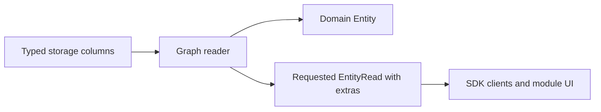
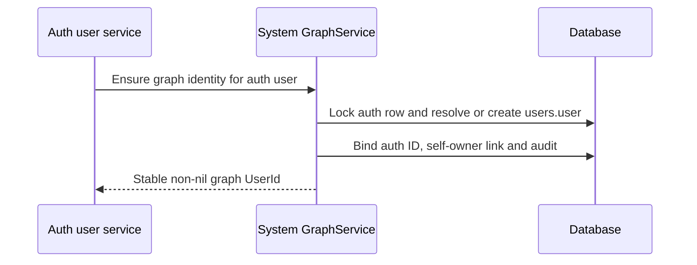

# Adopt the knowledge graph contracts

Status: APPROVED  
Spec lock: sha256:eb8320ff041bbeaabddb325576ce9ddfc2d7f0bb4d3dbf27f4053f1558a352a5 owner:SPEC is approved, lets plan  
Implementation lock: sha256:f307b8b036aacffb4ad979a4325946abc00e1e5d9c93d87d30cf6e062a32fe42 owner:$blueprint-start  
Active Delivery: D1  
Unattended decisions: allowed  

<!-- plan:spec:start -->
## The Goal

1. Establish one English developer reference in `docs/vision.md`, with each type next to its behavior and exceptions, and use it as the migration contract for the app and plugin catalog.
2. Adopt explicit persistent/transient and derived types across the shared SDK and its consumers, then separate domain Entity values from requested operational extras without changing identity, evidence or access scope.
3. Migrate pin, archive, privacy, configured model trust and indexing projections and consolidate organizational membership relations into `belongs_to`; register domain-specific Link kinds in their modules, preserving sync choices, temporal history and repeat-ingestion behavior.
4. Give each Magnis auth user a canonical `users.user` Entity, connect people to it through `identity`, and maintain protected temporal `owner` Links through system GraphService functions only.
5. Bring Graph reads, Search, merge, extraction and workspace transfer onto those same boundaries; preserve deterministic replay and protected ownership. Generalize creation provenance to created and define communication facts. Describe the event/subscription/action boundary and the later migration from watches to subscriptions, reusing existing Trigger and Episode execution.
6. Publish compatible app/catalog changes through the existing SDK and package activation mechanism, with migration fixtures, scoped checks and the complete affected repository gates. Implementation begins only after the owner approves the SPEC and the resulting Delivery/Stage contract.

## Why now

The owner has defined the target graph in a sustained design discussion. Public Entity currently mixes knowledge with pin/archive/indexing state; identity, Source records and security users are represented at different boundaries. The request is to translate and restructure that reference, commit it, and prepare the migration plan. This commit changes documentation only.

The reference retains the inspected October 3–5 behavior and labels target/open rules. App `staging` inspected on October 6 at `3579a8fff765293bb14b421212552fca9800706b` still has Entity.owner, nullable isPinned/isArchived, boolean indexed and no canonicalKey in its Entity declaration. The earlier entity-one-type checkout is no longer present. Identity, entity-sync, auto-modules and WebSource work must be reconciled with their current owners before implementation; their presence in the document is not evidence they are merged into staging. Do not reimplement their approved work from an older snapshot.

Evidence owners:

| Finding | Inspected code / reference |
| --- | --- |
| Public flags and owner are part of Entity | App `packages/sdk/src/core/entity.ts`, `backend/src/core/entity.ts` |
| Viewer preference and domain rows differ | App `backend/src/db/schema/graph.ts`, `backend/src/db/repository-helpers.ts` |
| Auth users have secrets and a nil-ID default account | App `backend/src/db/schema/users.ts`, `services/users/default-user.ts`, `users.service.ts` |
| Exact identity/preparation and hub merge replay already exist in working branches | Reference sections 6–7; inspected identity/entity-one-type graph repository and merge PG scenarios 054/055 |
| Claims, pending/indexed/refused and temporal derivation exist in inspected working code | Reference sections 10–11; SDK indexing, Graph derive/claim.repository and search graph-indexer |
| Earlier privacy work is a contract, not a completed implementation | App `feat/private-entity-flag`, commit `2ea08b25957bbb3d60bdeb144d19f2d24d3d4665`; model trust replaces its local/cloud eligibility test by owner decision |
| Model execution metadata already exists; model trust does not | Identity checkout `packages/sdk/src/core/ai-model.ts`, `backend/src/agent/models/types.ts`, `ai-model-directory.service.ts` and `provider-model-catalog.source.ts`; existing `dataBoundary` comes from catalog metadata |
| Shared organizational membership and creation provenance | Owner retains belongs_to and replaces Episode → triggered_by → Trigger with Trigger → created → Episode; projects.belongs_to has matching member → project semantics |
| Communication changes the earlier chat-membership proposal | Current Telegram in_chat supplies conversation membership, not delivery direction/time; Google folds Date/internalDate into sent_at; email schema allows received_at |
| Trigger delivery requires a graph event contract | Identity Graph EventRepository/owner mutation revision and TriggersService; current EventBus is in-process, trigger.check is module-produced and live-only |
| Execution can be reused; selection and identity must change | October 7 inspection: TriggersService already calls EpisodesService.createTriggeredChild with action_prompt; firing identity uses Trigger ID plus event Entity ID; trigger_execution stores history |
| Current time admission differs from recording new knowledge | TriggersService requires context.occurred_at and compares it with Trigger creation time; the scheduler also emits trigger.check |
| Ending evidence can exist without a Link | GraphClaim.kind ending is persisted; deriveRelation returns no matching period without an assertion. GraphService.end updates an existing Link and emits link_updated |

## The target

### Interfaces

The following signatures declare migration differences, not new parallel SDKs. Definitions belong in the existing SDK owner files. Persistent-ID and Derived naming follow the owner decisions. Other proposals remain explicitly marked; the New names table records their reasons.

```typescript
// SDK core/entity.ts; Id and UuidShapeSchema remain canonical imports.
export const PersistentEntityIdSchema = UuidShapeSchema
  .refine((id: string) => id !== NIL_ID, "Persistent Entity ID must not be nil")
  .brand<"PersistentEntityId">();
export type PersistentEntityId = z.output<typeof PersistentEntityIdSchema>;
export type EntityId = PersistentEntityId | NilId;

// Auth identity is intentionally separate from the graph user's node.
export type AuthUserId = Id;
export type UserId = PersistentEntityId;

export interface UserEntityBinding {
  authUserId: AuthUserId;
  entityId: UserId;
}

export type Origin = "canonical" | "derived";

export interface DerivedStatement {
  origin: "derived";
  confidence: number;
  evidence: [PersistentEntityId, ...PersistentEntityId[]];
  validFrom: DateTimeUtc | null;
  validUntil: DateTimeUtc | null;
}
export interface DerivedEntity<P extends JsonValue = JsonValue>
  extends EntityBase<P>, DerivedStatement {
  keys: string[];
}
export interface DerivedLink extends LinkBase, DerivedStatement {}
export type Link = CanonicalLink | DerivedLink;

// Internal deriveEntity result; not a graph Entity.
export interface EntityDerivation {
  eligible: boolean;
  reason: string | null;
  confidence: number;
  evidence: PersistentEntityId[];
}
export declare function deriveEntity(
  claims: readonly GraphClaim[],
  withdrawn: boolean,
): EntityDerivation;

export const derivedStatementSchema = z.strictObject({
  origin: z.literal("derived"),
  confidence: z.number().gt(0).lte(1),
  evidence: z.tuple([PersistentEntityIdSchema], PersistentEntityIdSchema),
  validFrom: dateTimeSchema.nullable(),
  validUntil: dateTimeSchema.nullable(),
});

// Existing generic Entity variants are renamed, not duplicated.
export type Entity<P extends JsonValue = JsonValue> =
  | CanonicalEntity<P>
  | DerivedEntity<P>;
export type PersistentEntity<P extends JsonValue = JsonValue> =
  Entity<P> & { id: PersistentEntityId };
export type TransientEntity<P extends JsonValue = JsonValue> =
  Entity<P> & { id: NilId };

// Same flat operational contract as reference section 2.
export type IndexingStatus = "pending" | "indexed" | "refused";
export interface EntityExtrasBase {
  pinOrder: number | null;
  archived: boolean;
  readonly indexed: IndexingStatus;
  private: boolean;
}
export interface Syncable {
  syncEnabled: boolean;
  syncRevision: string;
}
export type EntityExtras = EntityExtrasBase & (
  | Syncable
  | { syncEnabled: null; syncRevision: null }
);

export interface EntityRead<P extends JsonValue = JsonValue> {
  entity: PersistentEntity<P>;
  extras: EntityExtras;
}
export interface GraphReader {
  get(id: PersistentEntityId): Promise<PersistentEntity>;
  get(id: PersistentEntityId, options: { extras: true }): Promise<EntityRead>;
}

// Add this required field to the existing SDK core/ai-model.ts types.
// These excerpts omit their unchanged fields.
export interface EmbeddingModelInfo {
  readonly private: boolean;
}
export interface LlmModelInfo {
  readonly private: boolean;
}

export type CreatedLink = Link & { kind: "created" };
export type BelongsToLink = Link & { kind: "belongs_to" };

// Existing SDK neighbor projection; unchanged fields omitted.
export interface LinkedEntitySummary {
  linkKind: LinkType;
  direction: "out" | "in";
}

export type CommunicationLink = CanonicalLink & {
  kind: "sent" | "received";
  from: PersistentEntityId;
  to: PersistentEntityId;
  metadata: {
    occurredAt: DateTimeUtc | null;
    conversationId: PersistentEntityId | null;
  };
};

// GraphMutationEvent, GraphEventFilter, GraphSubscription and the event-driven
// TriggerExecution excerpt are declared in reference section 12.
// They describe the later logic story; this migration does not implement it.

export interface EntitySystemState {
  owner: AuthUserId; // Hidden existing SQL ownership scope.
}
export type UserEntityProperties = {
  name: string;
  surname: string | null;
};
export type UserEntity = CanonicalEntity<UserEntityProperties> & {
  id: UserId;
  schemaId: "users.user";
};
export interface TransferOwnershipRequest {
  entityId: PersistentEntityId;
  newOwnerId: UserId;
}
```

EntityBase.id becomes EntityId; Link endpoints and every saved evidence/reference become PersistentEntityId. Other Source/account/schema IDs retain their existing domains. DerivedEntity, DerivedLink and DerivedStatement replace AgentEntity, AgentLink and AgentStatement throughout compiler-reported consumers. The target discriminator is `origin: "derived"`, covering extraction, aggregation and inference. `GraphClaim` remains the source assertion, while DerivedStatement carries the graph result supported by those claims. Rename the existing internal `DerivedEntity` computation result to `EntityDerivation`, matching `RelationDerivation`, before reusing DerivedEntity for the full graph value.

EntityExtras is the reference's flat required shape: `pinOrder: number | null`, `archived: boolean`, `private: boolean`, read-only `indexed: "pending" | "indexed" | "refused"`, plus either `{syncEnabled: boolean; syncRevision: string}` or the complete pair of nulls. There is no pinned boolean, trigger array, owner or independent indexingPending. Public parsers reject missing fields and half-present sync pairs. The Graph read projection maps a missing graph_index row to pending.

Model `private` means authorized to process private data at the configured execution endpoint. Apply the same required field to the existing logical-model record and administration response; keep model-directory execution metadata `dataBoundary` independently. Known local execution qualifies automatically; an authorized configuration owner may declare another endpoint, including their own cluster, private. Unclassified endpoints do not qualify. The privacy eligibility condition is `!extras.private || model.private`, alongside ordinary access, availability and processing checks.

**Proposed bootstrap choice for approval:** preserve existing auth IDs and foreign keys; add a unique `users.entity_id` mapping to a non-nil graph user. The default nil auth user therefore gets a distinct assigned Entity ID. Existing `entities.owner` and `links.owner` remain private auth-scope projections, resolved to the graph user through that mapping. This refines the reference's previously open storage mapping; it avoids rewriting every auth/session/workspace reference. The graph-user schema exposes only name/surname in this scope; login email, password hashes, admin privileges, sessions and provisioning state stay in auth storage.

### A. Publish the core SDK and extras projection together



#### Adopt the agreed extras shape at every boundary

| Current or discussed field | Target response | Storage and migration |
| --- | --- | --- |
| Entity.isPinned and pinOrder | extras.pinOrder only | Viewer-specific entity_preferences.pin_order; null is unpinned, zero is a valid order. Apply B's explicit legacy mapping before dropping the boolean |
| Entity.isArchived | extras.archived: boolean | Keep entities.is_archived; normalize legacy null to false at storage/read boundary |
| Privacy draft isPrivate | extras.private: boolean | Add typed entities.is_private; Entity-wide, not a viewer preference; apply B's private-model policy |
| Entity.indexed processing boolean | extras.indexed: IndexingStatus | Read graph_index.status, with pending for no row. Keep the old processing permission internal and distinct; never translate true into indexed or false into pending |
| Entity sync fields / Syncable base | Flat extras.syncEnabled and extras.syncRevision | Preserve entities.sync_enabled and bigint sync_revision; serialize the revision as a decimal string. Unsupported sync uses both nulls |
| Public owner / proposed trigger list | Neither Entity nor extras | Owner remains protected system storage and owner Links; Triggers and execution history have separate paginated reads |

Remove the nested preferences/lifecycle/indexing/sync objects, the pinned flag and indexingPending from the target public shape. Extras remains a requested read projection over typed columns; there is no extras JSONB store. Its fields are required when extras is requested, and public parsers never repair a missing value with a default.

Migrate read consumers to EntityRead where they need operational state: Graph detail/list/traversal and search responses, SDK/RPC serializers, plugin graph adapters and UI pin/archive/sync controls. Workspace codecs preserve stored operational values separately, as specified in F. Domain ingestion, identity, merge and extraction use the domain Entity projection; Source writes must not reset viewer preferences or prepared sync choices. Keep scoped pin/archive/privacy/sync mutations and their permissions; moving their read values into extras does not grant a generic domain-properties write authority over them. indexed status remains read-only; the legacy processing-permission command must retain its distinct boolean meaning while its public naming is reconciled before API activation.

Reuse existing Graph queries and response schemas. Persisted internal rows may contain owner and operational columns; they are not serialized by spreading a storage object into Entity. Ordinary reads can omit preference/index-status joins while still enforcing ACL, archive and privacy. Detail, traversal, lists, tools and transfer must each declare their projection explicitly; no accidental second Entity shape in plugins.

| Implementation map | Core and extras |
| --- | --- |
| Owner | SDK entity/link/statement definitions; GraphService and repository readers |
| Target files | CREATE `../../../magnis-app/backend/migrations/20261006000000_graph_derived_origin.sql`; MODIFY `../../../magnis-app/packages/sdk/src/core/entity.ts`, `../../../magnis-app/packages/sdk/src/core/link.ts`, `../../../magnis-app/packages/sdk/src/core/statement.ts`, `../../../magnis-app/packages/sdk/src/rpc/registry.ts`, `../../../magnis-app/backend/src/core/entity.ts`, `../../../magnis-app/backend/src/services/graph/entity.repository.ts`, `../../../magnis-app/backend/src/services/graph/graph.service.ts`, `../../../magnis-app/backend/src/services/graph/graph.controller.ts`, `../../../magnis-app/backend/src/db/repository-helpers.ts` |
| Input / wake | Known-ID reads, list/detail requests, explicit extras request, existing mutation commands |
| Output / durable state | One domain type, explicit extras responses, hidden auth owner; existing sync revision and processing permission retained |
| RED test | Extend `backend/test/tst_bts_graph_entity_repo_contract.test.ts`, `tst_bts_graph_pins.test.ts` and SDK `test/graph.contract.test.ts`: bare read omits operational fields; extras read preserves two viewers' distinct preferences; current parsers accept derived and reject agent |

Use `/rename` during implementation for symbol changes: change the owning declaration, follow compiler errors and run the affected project typecheck; do not perform text-search-driven symbol replacement. Runtime strings such as relation kinds and stored JSON need explicit migration fixtures independently of the compiler.

Migrate Entity and Link origin values from `agent` to `derived` with a dedicated SQL migration. Update the origin-value and statement constraints, SQL predicates, SDK discriminated unions and the agentStatementSchema export (renamed derivedStatementSchema). Preserve IDs, evidence, confidence, keys, eligibility and periods. GraphClaim.origin remains indexed/manual; auth agent settings, event producers and domain properties containing the string agent are unrelated.

Versioned workspace import translates the legacy Entity/Link discriminator explicitly; new exports and current public parsers use derived only. Update app and catalog artifacts together at the existing compatibility boundary. Stop old writers for the database cutover and validate the new constraints before activating the new runtime. A repeated upgrade changes no additional rows; an unrecognized origin aborts the transaction. No permanent third origin or silent generic string replacement is introduced.


### B. Migrate operational storage without inventing input values

Keep typed columns; do not introduce a JSONB extras table. Normalize archived null/false to false and retain true. Add private using the previously approved privacy contract's initial false. Keep the current internal processing-permission boolean separate from read-only indexed status. Move sync fields only in the public projection, preserving stored booleans, decimal revisions and pending/applied selections.

**Proposed legacy pin rule for approval:** pin status follows the old pinned flag. Preserve numeric orders of actually pinned rows. Append pinned rows lacking an order after existing pinned orders, deterministically by Entity createdAt then ID for each viewer; when no ordered pin exists, this migration starts the sequence at zero. An order-only unpinned row becomes null. Keep the old columns as deprecated migration evidence during this rollout and export the pre-migration fixture/backup for rollback. Removing those columns is a later cleanup after migrated counts and UI ordering pass, not part of the four migrations below. If appending would overflow the storage integer, fail preflight and request an explicit resequencing decision. Runtime pin commands require a supplied integer, including zero; no missing-value default.

Implement the embedding privacy scope using the owner's revised model-trust rule. A private Entity is eligible only when the selected model has private true; otherwise exclude it from selection, audit, counts and ranked hydration. A declared-private cluster is eligible even with dataBoundary cloud_allowed. This supersedes the older draft's local/cloud test. Stop excludes a scope's new Source changes, not its saved graph or local manual writes. The same trust principle applies to language models, but enforcement in chat/completion and extraction remains a follow-up contract; this migration does not claim those paths are protected.

| Implementation map | State migration |
| --- | --- |
| Owner | Database migration, Graph lifecycle/preferences and search policy |
| Target files | CREATE `../../../magnis-app/backend/migrations/20261006000001_graph_extras.sql`; MODIFY `../../../magnis-app/backend/src/db/schema/graph.ts`, `../../../magnis-app/backend/src/services/graph/entity.repository.ts`, `../../../magnis-app/backend/src/services/search/search-index.repository.ts`, `../../../magnis-app/backend/src/services/search/search-indexer.service.ts`, `../../../magnis-app/backend/src/services/search/search-query-compiler.repository.ts`, `../../../magnis-app/backend/src/services/search/search-query-helpers.ts`, `../../../magnis-app/backend/src/services/search/ranked-search-scope.repository.ts`, `../../../magnis-app/backend/src/services/search/entity-search.repository.ts` (DB schema regenerated) |
| Input / wake | Upgrade with legacy preference rows, archive nulls, existing sync choices and index records |
| Output / durable state | Deterministic nullable pin order; required archive/private projection; no false claim that processing succeeded |
| RED test | Extend `backend/test/tst_bts_graph_pins.test.ts`, `tst_bts_search_visibility.test.ts`, `tst_bts_search_indexer.test.ts` with migration/zero-order/privacy cases |

#### Configure model trust through the existing model settings

Extend the existing logical-model storage, model-settings mutation and SDK directory/admin responses with a required private boolean. Persist it in a typed ai_models.private column in the same extras migration. Known local execution is private automatically. For non-local or unclassified existing bindings, migration initializes private false; the configuration owner can explicitly authorize a cluster afterward. Do not copy dataBoundary device_only blindly: the current Ollama catalog labels a tag without remote_host as device_only even when the configured provider endpoint is remote. Reuse the installed local adapter/binding metadata to establish known local execution.

Use existing settings permissions; model output, discovery metadata and generic graph writes cannot declare an endpoint trusted. The declaration belongs to the configured logical model and endpoint, not a global model name. Preserve it across restart and catalog refresh at the same endpoint. An endpoint change requires fresh classification, and private changes use existing configuration revisions/events to invalidate cached directory and search policy. After a completed change, subsequent indexing/search uses the new policy; ordering against requests already in flight remains explicitly open. Public response validators require the boolean, and explicit trust writes reject missing/null values. Keep dataBoundary for execution metadata and existing Local captions.

| Implementation map | Model trust |
| --- | --- |
| Owner | Existing model configuration/storage, SDK model contracts and Settings UI; model services below are prerequisite definitions in the identity checkout, to be modified only on the integrated app head |
| Target files | MODIFY `../../../magnis-app/packages/sdk/src/core/ai-model.ts`, `../../../magnis-app/packages/sdk/src/rpc/registry.ts`, `../../../magnis-app/backend/src/db/schema/ai.ts`, `../../../magnis-app/.worktrees/identity/backend/src/agent/models/types.ts`, `../../../magnis-app/.worktrees/identity/backend/src/agent/models/ai-model.repository.ts`, `../../../magnis-app/.worktrees/identity/backend/src/agent/models/ai-model-management.service.ts`, `../../../magnis-app/.worktrees/identity/backend/src/agent/models/ai-model-directory.service.ts`, `../../../magnis-app/backend/src/services/settings/settings.service.ts`, `../../../magnis-app/frontend/src/modules/settings/ModelsPanel.tsx`, `../../../magnis-app/frontend/src/modules/settings/hooks/useAiModels.ts`; reuse migration `20261006000001_graph_extras.sql` and existing settings RPC and registration callers identified before Stage approval; DB schema regenerated |
| Input / wake | Upgrade, local model materialization, explicit trust change, endpoint change, catalog refresh |
| Output / durable state | Required model private boolean, persisted declaration for the current endpoint, updated model-policy revision |
| RED test | Extend `backend/test/tst_bts_ai_models_contract.test.ts`, `tst_bts_ai_models_control_plane.test.ts`, `tst_bts_search_visibility.test.ts` and frontend `hooks/__tests__/useAiModels.test.tsx`: known local, declared-private cluster, unknown endpoint, restart/refresh and subsequent work after revocation |

### C. Consolidate shared relations and declare module-owned kinds

Register host-owned belongs_to for organizational membership. Convert triggers.belongs_to without reversing endpoints; projects.belongs_to → belongs_to is an explicit review proposal with the same member → container direction. Preserve endpoint schemas, periods, claims and producer metadata, and replace implicit prefix grants with explicit module permissions. Retain child_of for Episode hierarchy. Trigger parent lookup must filter belongs_to targets to episodes.episode and reject zero or multiple distinct active parents; project membership must not affect it.

The owner's communication correction supersedes the earlier blanket in_chat → belongs_to migration. Preserve historical in_chat until section G establishes how to retain conversation context and whether transmission/delivery facts can be recovered. A chat-membership edge alone cannot establish a received fact, an observer account or a receipt time.

Replace Episode → triggered_by → Trigger with Trigger → created → Episode. created now covers a producing Episode or Trigger. Register the Trigger-to-Episode pair and update the trigger writer, replay path, SDK ranks, readers and versioned import/export. Preserve Link IDs unless collision handling produces an explicit mapping, and retain metadata, evidence, origin, periods and timestamps. Rewrite effective claim/withdrawal identities consistently, while leaving raw source text and immutable audit history in their original versioned form. Non-Episode/Trigger historical endpoints require explicit review before conversion.

Move the domain-only built-ins to registered module names: attendee → meetings.attendee, observed_in → telegram.observed_in and observed_participant → telegram.observed_participant. Preserve each kind's meaning and direction. Meetings owns the meeting-to-email.address contract; Telegram owns the account-to-chat contracts. Participation does not imply the connected account's observed access, and Telegram's observer metadata carries sync state, unread counts and pins that must remain intact. The existing registry provides discovery, module ownership, endpoint validation and writer permissions; no parallel registry or global SDK union of every module kind is introduced. Verify namespace ownership from installed-module identity, not a caller-supplied prefix.

Inventory old rows by producer and endpoint schema. Convert supported cases in the same relation migration, preserving IDs, claims, periods and metadata; ambiguous producers or conflicting conversions fail preflight. Update module declarations, writers, readers, search filters, workspace import/export and compatibility together. Register the replacement kinds before changing foreign keys. Never delete orphaned historical kinds while rows still reference them, and do not let module uninstall authorize new writes. Existing Trigger candidate notifications remain compatible; no new event engine is required by this change.

The existing LinkedEntitySummary gains direction out/in relative to the viewed Entity and retains the stored linkKind. Stop serializing inverse presentation labels as kinds. The Trigger displays outgoing created results; its Episode displays incoming created provenance. Existing reverse labels such as watched_by and child_episodes are view labels only. A self-link emits one out summary; same_as uses a symmetric label. These are projections over one stored edge, not additional inverse relations.

Before rewriting, enumerate duplicate keys caused by convergence. Identical pair/origin/period duplicates may use the existing deterministic Link collapse mechanism with an ID mapping; differing overlapping periods or conflicting producer provenance fail migration preflight without changing rows. Do not silently discard temporal history. Old workspace input is upgraded at its versioned import boundary; new organizational-membership exports and writes use belongs_to, and new creation provenance uses created. No permanent runtime alias namespace is introduced.

| Implementation map | Shared relations and module ownership |
| --- | --- |
| Owner | Graph registry, workspace codecs, Trigger/Episode writers and readers, Projects/Triggers/Meetings/Telegram modules |
| Target files | CREATE `../../../magnis-app/backend/migrations/20261006000002_graph_membership.sql`; MODIFY `../../../magnis-app/packages/sdk/src/core/link.ts`, `../../../magnis-app/packages/sdk/src/core/episode.ts`, `../../../magnis-app/packages/sdk/src/core/linked-entity.ts`, `../../../magnis-app/backend/src/core/episode.ts`, `../../../magnis-app/backend/src/core/graph-view.ts`, `../../../magnis-app/backend/src/services/graph/graph-contracts.ts`, `../../../magnis-app/backend/src/services/graph/link.repository.ts`, `../../../magnis-app/backend/src/services/graph/graph.transfer.ts`, `../../../magnis-app/backend/src/services/triggers/triggers.repository.ts`, `../../../magnis-app/backend/src/services/triggers/triggers.service.ts`, `../../../magnis-app/.worktrees/identity/backend/src/agent/episodes/episode.ts`, `../../../magnis-app/.worktrees/identity/backend/src/agent/episodes/episodes.service.ts`, `../../../magnis-app/.worktrees/identity/backend/src/agent/episodes/episodes-dataset-contract.ts`, `../../../magnis-app/frontend/src/modules/episodes/helpers.ts`, `modules/triggers/manifest.toml`, `modules/triggers/schema.ts`, `modules/triggers/module/service.ts`, `modules/projects/manifest.toml`, `modules/projects/schema.ts`, `modules/projects/module/service.ts`, `modules/meetings/manifest.toml`, `modules/meetings/schema.ts`, `modules/meetings/entities.ts`, `modules/meetings/types.ts`, `modules/meetings/module/service.ts`, `modules/meetings/module/helpers.ts`, `modules/meetings/ui/EntityCards.tsx`, `modules/telegram/manifest.toml`, `modules/telegram/schema.ts`, `modules/telegram/entities.ts`, `modules/telegram/types.ts`, `modules/telegram/module/service.ts`; identity paths name prerequisite owners on the integrated app head |
| Input / wake | Upgrade, module activation, message/trigger creation, import and relation queries |
| Output / durable state | Shared organizational membership, module-owned domain kinds, created provenance in the correct direction, direction-preserving views, retained temporal/provenance data and unresolved communication history |
| RED test | Extend app `backend/test/tst_bts_graph_link_kinds.test.ts`, `tst_bts_graph_merge_pg.test.ts`, `tst_bts_dataset_format.test.ts`, `tst_bts_triggers_repository.test.ts`, `tst_bts_triggers_service.test.ts`, `tst_bts_episodes_snapshot.test.ts`; catalog `modules/projects/module/__tests__/projectsCrud.test.ts` and trigger CRUD/read scenarios; existing Meetings attendee tests and Telegram ingest/read/sync-plan tests |

### D. Bootstrap graph users and protect ownership at every writer



The proposed user node is a non-mergeable, non-generic-deletable, non-syncable host identity_channel. Bootstrap is idempotent under a unique mapping and row lock. A user's root node is owned by that auth user and has the system-only self-owner Link; this is an explicit root case, not permission for generic self-owned Links. Backfill existing users, including nil auth user, before enabling public owner traversal. Add a person → user identity Link only when the user/account mapping supplies an unambiguous person; never select one by name alone.

Backfilled owner periods start at the migration's recorded timestamp. Existing ownerId supplies current ownership, not evidence of ownership since createdAt; ownership before that timestamp remains unknown unless an authoritative historical record is available. Newly created entities start their owner period at creation. Complete bootstrap in one system transaction: create the graph node for the existing auth row, set its unique binding, then record the protected self-owner Link and audit.

Every new Entity gets its current owner Link in the same transaction. Generic add/end/unlink/patch, plugin batch, extraction, registration, import and merge must reject or route protected mutations to the system function. Import restores auth bindings for the target workspace and system ownership through GraphService instead of inserting arbitrary owner rows. Exact transfer input uses graph UserId; Graph resolves both auth scopes internally. Lock participating auth scopes in stable order.

**Proposed bounded transfer policy for approval:** implement transfer for a non-user Entity only if it has no ordinary incident Links, no claims/evidence dependencies, and no non-owner references requiring transfer. Inventory relational and structured-JSON references on the integrated head before enabling transfer; if completeness cannot be established, leave transfer unavailable. Otherwise return an explicit conflict for any such dependency, with no mutation. Bounded transfer also depends on the historical ownership read/export contract below. This first contract does not guess a transfer closure or grant access across users. At one service-chosen timestamp, close prior owner, insert new owner, update internal scope/projection and audit atomically. Same-owner transfer is a no-op. Transfer/user-node deletion and connected cross-owner moves require a later owner-approved contract, not an external allowSystemLinks switch.

**Before enabling bounded transfer:** decide who may read closed owner periods and how those references are represented in each user's workspace export. After a transfer, the old user node and the owned Entity are in different auth scopes. Current LinkRepository reads require both endpoints in the Link's scope, while allForTransfer selects by links.owner alone; leaving that path unchanged can hide history or export a Link whose endpoint is absent. Declare the system-only history projection/export mapping before implementation approval. Until that decision, transfer remains unavailable; ordinary owner creation and same-owner bootstrap can proceed. Do not relax generic endpoint ACL or copy another user's graph node into a workspace to make export pass.

| Implementation map | User and ownership |
| --- | --- |
| Owner | Existing UsersService and system GraphService methods |
| Target files | CREATE `../../../magnis-app/backend/migrations/20261006000003_graph_user_ownership.sql`; MODIFY `../../../magnis-app/backend/src/db/schema/users.ts`, `../../../magnis-app/backend/src/db/schema/graph.ts`, `../../../magnis-app/backend/src/core/user.ts`, `../../../magnis-app/packages/sdk/src/core/user.ts`, `../../../magnis-app/packages/sdk/src/core/entity.ts`, `../../../magnis-app/packages/sdk/src/core/link.ts`, `../../../magnis-app/backend/src/services/users/users.service.ts`, `../../../magnis-app/backend/src/services/users/user.repository.ts`, `../../../magnis-app/backend/src/services/users/default-user.ts`, `../../../magnis-app/backend/src/services/graph/graph.registrar.ts`, `../../../magnis-app/backend/src/services/graph/graph.service.ts`, `../../../magnis-app/backend/src/services/graph/graph.repository.ts`, `../../../magnis-app/backend/src/services/graph/link.repository.ts`, `../../../magnis-app/backend/src/services/graph/graph.transfer.ts`, `../../../magnis-app/backend/src/services/search/search-query-compiler.repository.ts`, `../../../magnis-app/packages/sdk/src/rpc/registry.ts` (DB schemas regenerated) |
| Input / wake | Auth bootstrap, existing-user upgrade, Entity creation, authorized transfer, import and ownership query |
| Output / durable state | Stable graph user mapping, one current protected owner relation, hidden consistent auth projection and audit |
| RED test | Extend `backend/test/tst_bts_users_service.test.ts`, `tst_bts_workspace_identity.test.ts`, `tst_bts_graph_batch.test.ts`, `tst_bts_graph_merge_pg.test.ts`; CREATE `backend/test/tst_bts_graph_owner.test.ts` for cross-entry-point protection and atomic transfer |

### E. Preserve identity and temporal claims through the new boundary

Do not turn this migration into a new entity resolver. Reuse exact Source/canonical keys, preparation, identity Links, merge preview/execute and deterministic derive functions. Preserve the canonical identity-hub exception and repeated ensure after merge. Add the ordinary domain validator and protected-kind checks at extraction commit and merge result validation, so repository use cannot bypass them. Canonical/derived origin separation, explicit field conflicts, interval overlap refusal and source-claim replacement remain intact.

For this migration, same-schema different-version merge fails explicitly unless an existing approved version conversion is available. Keep current property merge behavior documented; do not silently add field claims or promote derived values. **Proposed conservative extras rule:** refuse merge when privacy, syncEnabled or per-viewer pinOrder differ (absent viewer preference means null); do not add an undeclared extras override to the properties-only MergeOverride. Equal choices survive; keep the survivor's syncRevision as its own counter, rather than comparing counters from different entities. Both participants must already be unarchived. Reconcile/invalidate derived indexing through the existing graph mutation path, never choose the better-looking status. A richer extras arbitration command remains a separate contract. System merge retains the survivor owner and retires the duplicate same-owner relationship through the protected path; it does not transfer ownership. Replay must still resolve both representations to the survivor.

Keep pending/indexed/refused with the existing owner revision fence. The revision-based search queue remains a follow-up design already described in the reference: requested/processed and configuration revisions, dependency invalidation, retry/refusal and crash recovery must be completed before that queue replaces digest selection. Do not claim it has been implemented by exposing the status field.

| Implementation map | Process consistency |
| --- | --- |
| Owner | Graph domain decision functions and the existing indexer |
| Target files | MODIFY `../../../magnis-app/backend/src/services/graph/merge.ts`, `../../../magnis-app/backend/src/services/graph/graph.repository.ts`, `../../../magnis-app/backend/src/services/graph/graph.service.ts`, `../../../magnis-app/backend/src/services/graph/graph.transfer.ts`, `../../../magnis-app/backend/src/core/merge.ts`; prerequisite owners currently in identity checkout: `../../../magnis-app/.worktrees/identity/backend/src/services/graph/claim.repository.ts`, `../../../magnis-app/.worktrees/identity/backend/src/services/graph/derive.ts`, `../../../magnis-app/.worktrees/identity/backend/src/services/search/graph-indexer.ts`, `../../../magnis-app/.worktrees/identity/packages/sdk/src/core/indexing.ts` |
| Input / wake | Preview/execute, model proposal, changed source, repeated ensure and workspace replay |
| Output / durable state | Validated new projection with preserved identity/provenance and deterministic temporal results |
| RED test | Extend existing graph merge, batch and workspace scenarios; CREATE `backend/test/tst_bts_graph_contract_admission.test.ts` to reject malformed domain proposals and protected owner writes at every affected commit boundary |

### F. Migrate consumers and publish compatible artifacts

Use the SDK build and existing generated host-stub workflow. Convert app frontend/client-core and plugin SDK callers from direct flags to EntityRead/extras where the UI actually needs them; domain-only processing remains on Entity. Trigger lists remain separate paginated resources.

WorkspaceEntity/WorkspaceEntitySchema remain a versioned storage-transfer contract, not an EntityRead response. They currently derive fields from EntitySchema, including its boolean indexed shape; replace that dependency for operational fields when the public Entity loses them. Explicitly carry the stored processing permission (boolean or legacy null), archive/privacy, the workspace viewer's pin order and the sync pair in the existing transfer definitions. Keep stored permission distinct from extras.indexed and preserve source nulls except for the deliberate migrations in B. A projected pending value must not create a graph_index row or become a processing-permission value during restore. Retain the existing index rebuild policy; adding index-cache export is not part of this change. Extend the existing document/transfer tests alongside the serializers and row readers.

Update relation consumers and declared permissions before activating packages against the new contract.

Do not support two permanent public Entity formats. Version the shared SDK/package activation boundary and reject an incompatible package as one activation, retaining the previous accepted version. Stored legacy values and old workspace exports are translated only by explicit migration/import boundaries. Stage the app runtime and catalog artifact versions together; rollout starts only after their compatibility matrix and restore fixture pass.

| Implementation map | Consumers and publication |
| --- | --- |
| Owner | SDK publisher, app transport/client-core and catalog SDK/UI owners |
| Target files | MODIFY `../../../magnis-app/frontend/src`, `../../../magnis-app/packages/client-core/src`, `../../../magnis-app/cli/src`, `../../../magnis-app/scripts/sdk-contract-audit.ts`, `../../../magnis-app/scripts/sdk-package-smoke.ts`, `../../../magnis-app/backend/src/services/workspace/workspace-document.ts`, `../../../magnis-app/backend/src/core/workspace-transfer.ts`, `packages/plugin-sdk/contract/module.ts`, `packages/plugin-sdk/__tests__/graphContract.test.ts`, `packages/host-stubs/types`; exact module and UI callers derived by compiler before Stage approval |
| Input / wake | New SDK build, module installation/upgrade, UI reads, export/import |
| Output / durable state | Compatible artifacts and strict runtime contracts, no handwritten replacement host stubs |
| RED test | Existing package smoke, plugin graph contract and affected module/UI scenarios; MODIFY app `backend/test/tst_bts_workspace_document.test.ts` and `backend/test/tst_bts_workspace_transfer.test.ts` for explicit stored operational fields and one migrated-workspace integration fixture |

### G. Communication facts and the automation boundary

The owner's current scope is a simpler graph contract. Implement communication facts and declarations as part of the graph migration; retain the subscription/Trigger chain as its documented boundary. Connecting subscriptions to the existing execution mechanism belongs to the next logic story and does not block the graph release.

Communication records use sent/received with an occurrence time, independently of graph createdAt and validity periods. The working direction is concrete mailbox/account → message, with conversation context separately identified. A shared chat has no account-independent incoming/outgoing direction. A successful send or authoritative source observation can establish sent; recipient headers alone cannot establish received. Keep authorship, creation and reply context distinct from communication. The communication vocabulary has two pairs: account/mailbox → sent/received → message records observed transmission/delivery; message → sent_to/received_from → address/account records the addressed recipient and source-reported sender. received_from is not the inverse of received and does not establish a sent event from an email From header. sent_by stays retired: incoming sent traversal already resolves an observed sending endpoint. The inspected email writer uses authored_by for from_address; migrate that sender-only fact to received_from for the known email producer/schema pair, preserving provenance and history. Update its registry permissions, manifest and UI readers together; do not globally rename authored_by or emit both from one sender field. Other adapters must distinguish known content authorship from reported sender information.

Remove watches, account, prospect and supports from the target standard vocabulary as well. Runtime retirement of watches/triggerable waits for the later Trigger cutover so existing automation keeps working. After each supported kind's cutover, ordinary writes/registration reject that retired kind; explicit legacy import/read compatibility preserves historical rows. Reverse old sent_by only when its endpoints and evidence establish the target sent fact; an Episode sender or an unknown contract stays unresolved, not silently rewritten.

Validate conversation references through Graph, including merge/deletion handling; do not hide unchecked IDs in metadata. Choose a concrete mailbox Entity when email.address does not identify the receiving endpoint uniquely. Repeated physical deliveries of the same message/endpoint need an occurrence identity before they can be represented; current Link period constraints do not supply one.

Modules declare kinds, endpoint schemas, metadata and write permissions through the existing registry. The basic subscription contract selects link_added/link_updated by kind and optional endpoints, and entity_updated by schema and optional ID. Updates match the committed after state; the event carries before/after for the handler. Graph records the event; Triggers matches accessible subscriptions and runs the existing action_prompt through Episode execution. A TriggerExecution refers to the source Event ID and any resulting Episode. There is no field-predicate language, condition engine or module-specific event name. Current property writes use both entity_properties_updated and entity_updated, and sync settings also use the latter, so the later subscription producer must select actual domain changes without altering audit history. Extras are outside this contract.

The target records the mutation and event together, dispatches after commit and deduplicates one Trigger's handling by source Event ID. Recording new information is the wake, independently of source occurrence and relation-validity dates; an unchanged sync creates no event. Historical-import admission remains an explicit cutover decision. Event delivery is connected to the existing execution owners in the later logic story; this graph migration does not add a queue.

The inspected TriggerGate is an auto-pass stub. No classification context or classifier is specified for implementation here. Keep existing Trigger notifications and capability contracts working during graph adoption; translate their readers/writers only where required by the agreed Link changes. Retiring watch-based selection and replacing trigger.check belongs to the later coordinated cutover.

**Domain decisions before communication implementation:** choose concrete mailbox/account and conversation representation and repeated-delivery identity. Inventory legacy communication rows and map only evidence-backed cases; unresolved historical facts remain readable. The queue, prompts, model context and Trigger state machine are outside this section's implementation scope.

| Implementation map | Communication facts and graph boundary |
| --- | --- |
| Owner | Existing graph registry/communication owners and source adapters; reference authors for the automation boundary |
| Target files | MODIFY `../../../magnis-app/packages/sdk/src/core/link.ts`, `../../../magnis-app/backend/src/services/graph/graph-contracts.ts`, `../../../magnis-app/backend/src/services/graph/graph.transfer.ts`, `modules/email/entities.ts`, `modules/email/types.ts`, `modules/email/manifest.toml`, `modules/email/module/service.ts`, `modules/email/ui/helpers.ts`, `modules/email/ui/EntityCards.tsx`, `modules/telegram/module/service.ts`, `sources/google/src/surfaces/email/gmail.ts`, `sources/google/src/surfaces/email/imap.ts`, `sources/telegram/src/surfaces/telegram/envelope.ts`, `docs/vision.md`; declare exact endpoint and metadata schemas and any communication-data migration after domain decisions, before Stage approval |
| Input / wake | Domain declarations, confirmed source observations, sending results, historical import and graph reads |
| Output / durable state | Validated communication facts and timestamps, preserved history and existing runtime compatibility; a documented subscription/execution boundary |
| RED test | Extend catalog `modules/email/module/__tests__/emailIngest.test.ts`, `emailSend.test.ts`, `modules/telegram/module/__tests__/telegramIngest.test.ts`, `sources/google/src/surfaces/email/gmail.test.ts` and existing app graph registration/batch/import tests; failed sends, header-only observations, replay and atomic message/Link persistence |

### Adoption order and proposed Delivery boundaries

This is the graph migration sequence. The executable Delivery/Stage/Task graph is authored after SPEC approval and the relevant domain decisions through planctl; none is approved or running in this commit. The later logic story is outside these release dependencies.

| Order | Proposed PR boundary | Depends on | Completion evidence |
| --- | --- | --- | --- |
| 0 | Reconcile SDK/identity/entity-sync/claims/module-dependency prerequisites on the actual integration head | Their existing owners' work | Record integrated commits and compile the baseline; do not duplicate their implementations |
| 1 | App SDK names, derived-origin migration, persistent IDs, strict Entity/extras, model trust and storage migration | 0, approval of legacy pin proposal | Core parser, viewer preference, sync and read-projection scenarios; matched client changes in the same releasable boundary |
| 2 | App + catalog shared relations and module-owned kinds | 1; project-membership proposal | Direction reversal, temporal collision preflight, permissions and Trigger/Project/Episode/Meetings/Telegram scenarios; no invented chat delivery facts |
| 3 | App graph users, protected ownership and bounded transfer | 1–2, approval of bootstrap/mapping proposals; transfer additionally requires its history/export contract | Nil-auth-user bootstrap, all-writer rejection matrix, rollback/race and owner-search isolation |
| 4 | App merge/extraction/import validation and catalog consumer completion | 1–3 | Canonical/derived and period scenarios, repeated ensure, exported/restored workspace equivalence |
| 5 | App + catalog communication facts and declarations | 1–4; resolve G's endpoint/conversation contracts | Confirmed observations, atomic message/Link writes, historical mapping and compatibility with the existing Trigger runtime |
| 6 | Compatible runtime/SDK/catalog release and reference reconciliation | All above | Full affected gates, package/API compatibility, migration and restore verification; release approval remains separate |

Cross-repository implementation uses one shared plan. App Deliveries name repository `app`, catalog Deliveries name `catalog`; implementation setup configures `code-production.repository.app` / `.catalog` to the owner's intended checkouts. This authoring turn does not repoint shared repository configuration or create implementation worktrees. Active-time estimates and concrete Stage writes will be derived from the integrated baseline, not guessed across unmerged prerequisite branches.

## Target tree

App paths in the maps are relative to this plan checkout: `../../../magnis-app`. Identity-checkout paths identify prerequisite definitions currently absent from app staging; those changes will target the integrated app checkout after prerequisite reconciliation. They do not authorize edits to a colleague's worktree. Catalog paths are relative to this repository. Delivery repository bindings will replace these inspection locations before executable Stage approval.

| Action | Owner/path | Why this scope is necessary |
| --- | --- | --- |
| MODIFY | Catalog `docs/vision.md`, `README.md`, `docs/typing.md` | English reference, navigation, historical-status clarification |
| CREATE | Catalog `docs/plans/2026-10-06-entity-docs.md` | One migration plan, authored and journaled through planctl |
| MODIFY | App existing SDK, core and RPC files enumerated in maps A–G | Single shared definitions and runtime validators; no parallel type package |
| MODIFY | App existing Graph, Search, Users, transport and compiler-reported client files in A–G | Remove leaked operational fields and enforce the same authority in every writer and reader |
| MODIFY | App existing AI model contracts, model configuration services, Settings and model UI files in B | Persist configured model trust and expose it through existing administration and directory contracts |
| CREATE | `../../../magnis-app/backend/migrations/20261006000000_graph_derived_origin.sql` | Entity and Link origin discriminator and constraint migration |
| CREATE | `../../../magnis-app/backend/migrations/20261006000001_graph_extras.sql` | Typed extras, logical-model trust and legacy pin conversion |
| CREATE | `../../../magnis-app/backend/migrations/20261006000002_graph_membership.sql` | Shared and module-owned Link kinds, creation direction and history conversion |
| CREATE | `../../../magnis-app/backend/migrations/20261006000003_graph_user_ownership.sql` | Auth-to-graph-user binding and protected ownership |
| MODIFY, generated | App DB schema files and catalog host stubs | Regenerate from canonical SQL and SDK; never hand-edit generated declarations |
| MODIFY | Existing catalog plugin SDK, affected modules and manifests in maps C and F | Consume the new SDK and shared membership permissions |
| MODIFY | Existing scoped tests named in A–G | Reuse Graph, workspace, User and Source harnesses and fixtures |
| CREATE | `../../../magnis-app/backend/test/tst_bts_graph_owner.test.ts`, `../../../magnis-app/backend/test/tst_bts_graph_contract_admission.test.ts` | Missing cross-writer ownership and domain-admission behavioral scenarios |

This bounds owners rather than guessing every compiler caller. Before executable Stage approval, enumerate the actual affected caller paths on the integrated head; unexpected files require an explicit Stage update. Reuse the existing graph Event and Trigger services. Section G's communication schemas/data migration must be declared after its domain decisions and before Stage approval. Durable event delivery and Trigger admission storage belong to the later logic story, not this release. No unrelated runner, auth system or generic resolver framework is introduced.

## Invariants

1. Nil is an unsaved sentinel; only assigned IDs can be Link endpoints, evidence or mutation targets. Existing auth nil IDs remain valid in their own domain.
2. Entity domain meaning is independent of whether extras is requested. Omitting extras never bypasses ACL, archive or privacy.
3. Nullable pin order is the only pin state; archive/private booleans and complete sync pairs are strict required response values. Read defaults occur at the specified storage projection only.
4. Owner is hidden system state and a protected canonical temporal Link. Generic RPC, plugins, model output, import and ordinary merge never acquire ownership-writing authority.
5. Source identity, domain identity, identity Links and physical merge retain distinct meanings. No automatic person merge by name, shared address or same_as chain.
6. Merge and extraction validate final domain data and registered endpoint rules under the same transaction/fence that records the result; stale model work cannot overwrite a newer graph.
7. Human approval does not change derived origin; repeated evidence does not add to confidence; a changed ending source cannot silently reopen a relation.
8. Migration preserves explicit sync decisions, applicable periods, auth bindings and access scope. Destructive ambiguity fails preflight rather than choosing silently.
9. Private Entity processing requires model private true. Known local execution and an explicit declaration for a configured cluster both qualify; physical location metadata alone does not authorize private-data processing.
10. Creation provenance, organizational membership and observed communication are distinct. A reversed created Link replaces triggered_by; belonging to a chat does not prove delivery.
11. The future Trigger boundary consumes committed, authorized graph events. Occurrence time differs from insertion time; event-driven replay identity is an Event ID, not an Entity ID. This graph migration does not claim that the future engine is implemented.

### Acceptance cases

| ID | Behavioral scenario |
| --- | --- |
| KG-01 | Step 1 → parse two different unsaved Web results with nil. Step 2 → attempt a Link/evidence/save-by-ID using nil. Verify → both values remain representable, while saved-reference operations reject nil and valid assigned references still resolve |
| KG-02 | Step 1 → read one Entity without extras. Step 2 → read it as two viewers with different preferences using extras. Verify → equal domain values, distinct pin orders, no owner/trigger list leakage, unchanged access checks |
| KG-03 | Step 1 → upgrade fixtures for pinned numeric zero, pinned unordered, unpinned order-only and no preference row. Step 2 → repeat migration and read/order/unpin. Verify → deterministic approved mapping, zero stays pinned, second migration makes no new change, original state remains recoverable during rollout |
| KG-04 | Step 1 → omit/null an archived/private/indexed field or supply a half sync pair to the public parser. Verify → rejection. Step 2 → read an actual missing graph_index row. Verify → explicit pending without inserting status or inventing metadata |
| KG-05 | Step 1 → Stop a scope while a fetched page waits to commit. Step 2 → release the page and restart worker. Verify → no new content/triggers after the committed Stop; saved choice/revision survives and old acknowledgement does not apply a newer choice |
| KG-06 | Step 1 → migrate Trigger and proposed Project membership with adjacent/duplicate periods. Step 2 → read, repeat ingestion and import an old workspace. Verify → shared belongs_to, retained periods/provenance and no repeat rows. Step 3 → inspect historical in_chat. Verify → retained until its communication/context mapping is defined; no invented received fact. Conflicting overlapping membership conversion aborts atomically |
| KG-07 | Step 1 → bootstrap the default nil auth user concurrently twice. Step 2 → restart and authenticate/read existing data. Verify → one assigned users.user, one binding and self-owner Link; auth ID and existing workspace access unchanged; no secrets in properties. Step 3 → query ownership before the backfill timestamp without historical evidence. Verify → no invented past owner |
| KG-08 | Step 1 → try owner add/end/unlink/patch through RPC, aliases, plugin batch, model output, registration, import and merge. Verify → rejection or the defined system route, with no forged owner. Step 2 → normal Entity creation. Verify → exactly one owner and matching internal scope/audit |
| KG-09 | Prerequisite → approve the closed-owner-history read/export contract; before it, verify transfer is unavailable. Step 1 → transfer an isolated non-user Entity at T. Verify → old interval ends at T, new starts at T, one current owner, old user gains no current read right. Step 2 → retry same owner and test rollback midway. Verify → no extra interval; failure leaves original state. Step 3 → transfer a connected/claimed/user Entity. Verify → explicit conflict, no partial reassignment. Step 4 → read history and export/restore each affected user's workspace. Verify → the approved history scope, no foreign Entity disclosure and no dangling exported endpoints |
| KG-10 | Step 1 → create two internal people through different addresses and merge after preview. Step 2 → repeat ensure through both addresses. Verify → one survivor returned, representations retained, no new people; distinct provider canonical records still reject merge |
| KG-11 | Step 1 → preview conflicting properties then introduce another conflict. Step 2 → execute old overrides. Verify → refusal/rollback. Step 3 → provide explicit values but invalid domain output or incompatible schema version. Verify → refusal before mutation; valid override commits and old ID is not falsely promised as a redirect |
| KG-12 | Step 1 → feed identical claim sets as start→ending and ending→start. Step 2 → change the ending source. Verify → same interval in both orders, then hidden unresolved relation rather than invented reopening; repeated confidence never reaches one |
| KG-13 | Step 1 → return a model proposal with invalid domain properties, unauthorized endpoint roles or system owner kind. Verify → whole attempt rejected at commit. Step 2 → change graph revision during a valid model response. Verify → no stale nodes/claims/status completion |
| KG-14 | Step 1 → mark data private and select a model with private false, including an unclassified endpoint. Verify → no selection/audit/count/ranked hydration of private content. Step 2 → use a known local model. Verify → private true and processing allowed. Step 3 → explicitly authorize a cluster whose dataBoundary remains cloud_allowed. Verify → the same private data is eligible. Step 4 → read as an unauthorized graph user. Verify → ordinary ACL still refuses access. Step 5 → repeat with a non-private Entity and model private false. Verify → this flag imposes no restriction |
| KG-15 | Step 1 → export upgraded workspace and restore for its target auth user. Step 2 → compare domain identities, claims, periods, preferences, sync choices and protected owner bindings. Verify → intentional ID mappings only, no cross-owner disclosure or direct owner injection. Step 3 → install incompatible module artifact. Verify → rejected activation leaves prior accepted module active |
| KG-16 | Step 1 → preview/execute a merge with differing privacy, syncEnabled or viewer pinOrder. Verify → refusal without mutation, even if all property conflicts were resolved. Step 2 → equalize the choices through existing explicit commands and merge. Verify → survivor revision and equal choices retained; indexing invalidated/reconciled through the normal mutation path |
| KG-17 | Step 1 → upgrade a workspace with agent-origin Entity and Link rows, canonical rows, claims and unrelated domain properties containing agent. Verify → only Entity/Link discriminators become derived; IDs, evidence, confidence, periods and other origin domains stay intact; constraints validate. Step 2 → repeat the upgrade and import an old-version export. Verify → stable mapping without duplicates. Step 3 → parse current responses with derived, then agent. Verify → derived succeeds, agent is rejected; unknown stored origins abort migration without partial updates |
| KG-18 | Step 1 → upgrade known local and unclassified model bindings. Verify → local private true, unclassified private false; missing/null directory values are rejected. Step 2 → authorize a cluster through model settings, restart and refresh its catalog. Verify → trust survives at the same endpoint; an unauthorized settings write fails. Step 3 → revoke trust and await the saved configuration change. Verify → subsequent indexing/search excludes private content using the new policy. Step 4 → change the trusted model's endpoint. Verify → the old declaration does not authorize the new endpoint without fresh classification |
| KG-19 | Step 1 → migrate Episode → triggered_by → Trigger beside existing Trigger → created → Episode rows. Verify → correct direction, preserved IDs or explicit duplicate mapping, periods/claims/metadata retained; ambiguous collision aborts. Step 2 → replay a firing and read both endpoints. Verify → one created edge, correct incoming/outgoing meaning, child_of retained and no runtime triggered_by write |
| KG-20 | Step 1 → give a Trigger one parent Episode and a project membership. Verify → parent lookup selects the Episode. Step 2 → add a second active Episode parent and attempt firing. Verify → explicit ambiguity before any child is created. Step 3 → read organizational, authored_by, sent_to and observed-participant facts. Verify → none confers ownership or proves receipt |
| KG-21 | Step 1 → observe confirmed inbound delivery and commit its message/received Link. Verify → both are visible together with the source occurrence time. Step 2 → roll back the batch or fail a send. Verify → no partial message/Link write or invented communication. Step 3 → ingest To/CC headers without delivery evidence. Verify → recipient facts only; unknown receipt time remains unknown |
| KG-28 | Step 1 → create a sent fact and read the message's incoming Links. Verify → sender is resolved through sent with direction in, without a sent_by row. Step 2 → ingest an addressed recipient with no delivery evidence, then observe actual receipt. Verify → sent_to exists independently; received appears only for the observed delivery. Step 3 → upgrade historical sent_by/account/prospect/supports rows and attempt ordinary new writes or registration under retired names. Verify → evidence-backed conversion or readable unresolved history; no new retired kinds or fabricated communication facts |
| KG-29 | Step 1 → ingest a message with a reported From address and no observed sending account. Verify → received_from identifies the sender; no invented sent event or duplicate authored_by from the sender field. Step 2 → upgrade the known email-producer authored_by rows beside non-email authorship. Verify → only sender-only email relations become received_from, preserving provenance/history and repeat-ingestion identity; independent authorship stays unchanged. Step 3 → read message sender, recipient and delivery facts. Verify → correct received_from/sent_to display; sender information alone creates no received fact |
| KG-30 | Step 1 → migrate attendee and both Telegram observation kinds from known producers beside existing target rows. Verify → namespaced module ownership, preserved IDs or explicit collision mapping, periods/claims/metadata retained and repeat upgrade is stable. Step 2 → query Meetings attendees and Telegram observed chat state/participants. Verify → equivalent reads; participant edges gain no observer state. Step 3 → try an undeclared kind, claim another module's namespace or write without permission, then perform an authorized cross-module write. Verify → invalid operations fail and the authorized write satisfies the same contract. Step 4 → uninstall the declaring module. Verify → historical rows stay readable and orphan declarations authorize no new writes. Unknown-producer conversion aborts atomically |
| KG-31 | Step 1 → prepare stored processing permission false beside a graph_index indexed status, and legacy null beside no status row. Step 2 → read with extras and export/restore using the versioned workspace codec. Verify → public statuses remain distinct from permission; the dump carries false/null permissions, no status-to-boolean conversion occurs and projection alone creates no graph_index row. Step 3 → round-trip non-default archive/privacy, pin order zero and a stopped sync pair. Verify → values survive the declared ID/viewer mapping and status follows the existing rebuild policy rather than a copied response default |

### Next logic story — migrate selection, reuse execution

This is a concrete continuation of the graph migration, not an additional release gate or a new automation engine. No implementation Delivery is approved here. The reference separates Graph events, subscriptions in Trigger configuration and actions through the existing TriggersService/EpisodesService path.

| Order | Migration work | Existing mechanism retained |
| --- | --- | --- |
| 1 | Produce typed committed events for domain Entity updates and Link additions/updates, including ordinary and batch writers | EventRepository and Graph mutation transactions; modules keep producing domain facts |
| 2 | Add subscriptions to the existing Trigger configuration, validators, CRUD, RPC and UI; replace watches-based candidate lookup for converted definitions | TriggersRepository and schema/kind registry; action_prompt, status, limits and existing schedule configuration |
| 3 | Feed selected events to TriggersService; use source Event ID for event-driven admission, child identity and execution history | Existing trigger_execution storage, createTriggeredChild, agent wake, parent context and created provenance |
| 4 | Convert supported legacy definitions without broadening their meaning; enable exactly one execution route for each converted Trigger | Old definitions remain on the legacy route until mapped; historical executions remain readable |
| 5 | Retire converted Email/Telegram trigger_checks and then obsolete watches/triggerable APIs and UI | Manual and scheduled execution; the scheduler also uses trigger.check, so the bus route is not removed indiscriminately |

A mailbox receipt subscription is not a replacement for an old sender watch. Email currently supplies sender-based candidates; Telegram supplies chat/sender candidates. Convert only definitions whose selection can be preserved with the available event payload and handler context. Inventory the remaining definitions and settle their mapping before retiring the old route. No hidden predicate language or new action configuration is introduced by this migration.

For event-driven runs, replace the current Trigger-ID-plus-Entity-ID firing key with Trigger ID plus Event ID. Record the input before action execution and attach the resulting Episode using the existing execution store. Preserve the old event_entity_id as context/history where applicable; never invent graph Event IDs for historical, manual or scheduled runs. Reuse current recovery behavior while adapting its identity, rather than introducing a second worker/state machine.

The new event wake is when information is committed to Graph. Current source-date admission must not silently discard newly learned past facts, and unknown occurrence time must remain unknown. Decide initial historical-import behavior explicitly before enabling actions on imported data; source recording is not evidence of fresh delivery. Keep existing access/private-data checks. TriggerGate currently always returns relevant; retaining gate_prompt does not establish semantic classification.

**Ending without a prior Link:** preserve the owner's Katya scenario as a required extension of this same path. Existing GraphClaim.kind ending can record an unknown start or end date without a Link row. The later contract must expose the accepted ending with endpoints/kind and source evidence even when deriveRelation produces no Link. link_ended is a discussed name; its payload and admission are still open, and neither link_updated nor a created historical Link alone proves a new departure. Resolve this before enabling ending subscriptions; do not add an employment-start date, use sync time for a missing end or mistake evidence withdrawal for departure.

| Follow-up change map | Existing owners; these are later-story writes |
| --- | --- |
| MODIFY: event production | App backend/src/core/event.ts and services/graph/event.repository.ts, graph.service.ts, graph.repository.ts, entity.repository.ts, link.repository.ts; claim.repository.ts and derive.ts for the ending decision |
| MODIFY: selection and execution | App backend/src/core/trigger.ts, services/triggers/types.ts, triggers.repository.ts, triggers.service.ts, triggers.controller.ts; extend db/schema/triggers.ts through the existing SQL migration/generation workflow |
| MODIFY: configuration and consumers | Catalog modules/triggers/entities.ts, types.ts, schema.ts, manifest.toml, module/service.ts and existing ui readers; SDK/RPC declarations on the integrated head |
| MODIFY: producer cutover | Catalog modules/email and modules/telegram service/type/manifest contracts; app backend/src/plugin-runtime/plugin-module-controller.ts and sync-receipt.ts; retain scheduler compatibility |

Before the later implementation is approved, name the SQL migration and exact compiler-reported callers on the integrated head. Reuse existing app backend/test/tst_bts_triggers_service.test.ts, tst_bts_triggers_repository.test.ts, tst_bts_triggers_executions.test.ts, tst_bts_triggers_schedule.test.ts and graph writer tests, plus catalog Trigger CRUD/history and Email/Telegram ingest tests. Focus verification on a received message reaching the existing Episode path, two distinct updates of one Entity, duplicate delivery of one Event, unchanged sender/chat selection, manual/schedule compatibility and an ending learned without a prior Link. This retains the concrete checks without specifying a new general rules engine.

### Test strategy and publication

Use existing repo scripts; new behavioral tests must first reproduce the missing guarantee. App scoped commands start with `bun run agent:test:backend -- test/<named-test>.test.ts`; SDK renames use the existing `bun run --cwd packages/sdk typecheck` and `bun run build:sdk`, followed by affected `typecheck:backend` / frontend `typecheck` callers. App staging currently has no agent:typecheck or agent:build:sdk alias; do not invent commands. Catalog module tests use `bun run agent:test:modules -- <test-path>` and catalog typechecking uses `bun run agent:typecheck`. Reuse harnesses rather than building another test runner.

For this documentation commit, verify preserved declarations, English text, Markdown/local links and TypeScript snippets. The normal commit hooks run `agent:verify:docs` and `agent:verify:commit`. For later implementation publication run each affected repository's complete `agent:verify:pr` once on the release inputs; preserve hooks and reuse passing results when inputs are unchanged. PostgreSQL migration/concurrency tests and package compatibility smoke are required evidence, not replaced by typecheck. A code version mismatch is investigated, not automatically a dependency upgrade.

## Reuse

Reuse SDK Entity/Link/statement/model/RPC schemas; existing UuidShapeSchema and GraphRef preparation; typed SQL tables, unique constraints and owner mutation fence; link_kinds registry; deterministic merge and derive functions; GraphClaim replacement; UsersService/UserRepository; workspace codecs; SDK build/host-stub generation; Graph/Search/User/Source test harnesses. Generated schema files follow the repository SQL introspection workflow. No alternate graph service, auth table, resolver or public extras JSONB store is introduced.

## New names

| Proposed name | Replaces / reason |
| --- | --- |
| PersistentEntityId / PersistentEntityIdSchema | Makes non-nil validation explicit instead of hiding it behind the general EntityId name |
| EntityId as assigned-or-nil | Represents a domain value before persistence; retires ambiguous NullableId terminology without admitting JavaScript null |
| DerivedEntity / DerivedLink / DerivedStatement | Owner-selected names for graph values derived from claims through extraction, aggregation or inference |
| EntityDerivation | Frees the existing helper name DerivedEntity for the graph Entity; parallels RelationDerivation |
| derivedStatementSchema / origin: derived | Aligns the runtime validator and serialized discriminator with DerivedStatement; migrates the legacy agent spelling explicitly |
| EntityExtras / EntityRead / IndexingStatus | Flat requested operational projection: pinOrder, archived, private, indexed status and the sync pair; typed columns and separate mutation authority |
| Model private | Required boolean on existing configured model types; authorizes private-data processing, including a declared-private cluster, independently of dataBoundary |
| AuthUserId / UserEntityBinding | Separates existing auth scope, including nil, from the new graph node; maps through users.entity_id instead of rekeying sessions |
| UserEntityProperties | Minimal public graph-user shape; deliberately excludes auth/admin/secrets fields |
| belongs_to | Shared organizational membership: triggers.belongs_to and proposed projects.belongs_to; chat communication needs its own evidence-backed mapping |
| CreatedLink / created | Generalizes the existing creation relation to Trigger → Episode and retires the inverse triggered_by spelling |
| meetings.attendee / telegram.observed_in / telegram.observed_participant | Move domain meanings from unqualified built-ins into the declaring module's namespace; preserve semantics and observer state |
| LinkedEntitySummary.direction | Distinguishes incoming provenance from outgoing results without additional stored inverse kinds |
| CommunicationLink / sent / received / sent_to / received_from | Two communication pairs: observed transmission/delivery and reported recipient/sender; received_from replaces sender-only email use of authored_by, not general content authorship. No stored inverse sent_by. Account/conversation representation remains a proposal |
| GraphMutationEvent | Identified Link addition/update or Entity domain-data update; recorded-time notification connects to existing execution in the later story |
| GraphSubscription / GraphEventFilter | Select a Link kind and endpoints or an Entity schema and ID; runtime replacement of watches/trigger.check is deferred |
| TriggerExecution event excerpt | Adds source Event identity to existing execution history; retains Episode/action_prompt and separate manual/schedule paths |
| owner | Protected system relationship, with ordinary write rejection on every route |

## Not verified

No product changes or migrations were executed in this authoring turn. The exact integration head after the prerequisite work, complete compiler-derived consumer file list, migration row counts, data-dependent overlap conflicts, generated API version and release artifact compatibility must be measured before executable Stage approval. No PR publication or deployment is authorized by this documentation commit.

Persistent-ID and Derived naming and the configured-model trust rule reflect owner decisions. Legacy pin ordering, auth-user mapping/self-owned bootstrap, bounded transfer and refusal of conflicting extras on merge are explicit proposals presented for SPEC approval, not claims of prior owner approval. Wider ACL, connected cross-owner transfer, field-level derived provenance, richer merge extras arbitration, unmerge, general alias consolidation, revision-queue storage/recovery and cloud policy beyond the existing embedding scope remain follow-up contracts. Bounded ownership transfer additionally requires the closed-owner-history read/export decision in D and remains unavailable until it is defined. Section G requires endpoint/conversation and repeated-delivery identity decisions for communication. The subscription migration is documented as a follow-up using existing Trigger execution and is not a graph-release gate. Historical-import policy, faithful sender/chat mapping and the ending-without-Link event contract remain explicit decisions before their affected paths are enabled. Project-membership consolidation and the direction-preserving neighbor projection are review proposals. Creation-link reversal and event-based Trigger selection reflect the owner's requests. The plan does not silently manufacture missing facts or promise these changes are implemented.
<!-- plan:spec:end -->

<!-- plan:implementation:start -->
## Implementation contract

<!-- plan:delivery:D1:start -->
<!-- plan:delivery-meta:{"active":true,"depends":[],"predictedExternalWaitMinutes":0,"repository":"app"} -->
### PR Delivery D1 — Adopt domain Entity, extras and protected graph ownership

Branch: `feat/knowledge-graph-contracts`; Depends: none; Gate: backend, frontend, sdk, core, cli, e2e.

Stage graph: `D1-S1 -> D1-S2 -> D1-S3 -> D1-S4 -> D1-S5 -> D1-S6 -> D1-S7 -> D2-S1 -> D2-S2 -> D1-S8 -> D2-S3 -> D2-S4 -> D1-S9`.

Forecast: 1335 active min / 0 credits across 9 Stages; longest dependency path 1170 active min; external waits 0 min.

Separate the knowledge graph value from operational extras across SDK, storage and app reads. Migrate persistent/derived naming, private-model trust, temporal relation kinds and graph users while preserving auth scope, identity and workspace data. Existing merge, extraction, Search, GraphService and Trigger/Episode runtime paths remain the implementation owners.

This plan has two coordinated PRs, one in each repository. They are peer Deliveries; the explicit cross-repository Stage dependencies determine execution order. Neither new runtime nor catalog package is released independently. Existing owner merge/release authority remains in place.

Implementation baseline reconciliation is complete: app origin/staging 3ac048c5a7bb549591a982a6b07aa95aa2e72bb4 and catalog origin/staging 6a9e8d5ae744b1e2b1d06823562c87e002396258 include entity-one-type, entity-sync, module dependencies and contact-identity prerequisites. Refresh both refs at implementation start and inspect any new delta. These observations supersede the dated checkout/path/script observations in the approved SPEC; they do not change its behavior. SDK linked-entity.ts and merge.ts now own the old backend graph-view/merge contracts.

Before starting a Task, create a dedicated app checkout at /mnt/movies/dev/home/Coding/magnis-app/.worktrees/knowledge-graph-contracts on feat/knowledge-graph-contracts from the verified app integration head. Retain the current catalog docs checkout/branch and merge its current origin/staging after committing this plan. Resolve documentation conflicts while preserving the locked contract. Do not edit or reuse the entity-sync/identity worktrees.

Bind repository names app and catalog for this plan checkout with worktree-local Git configuration, using extensions.worktreeConfig after checking existing core.worktree/core.bare settings, then git config --worktree code-production.repository.app and .catalog. The shared app binding currently points to entity-sync and must remain unchanged. Verify resolved branch and root for both Deliveries before start_task.

Estimates cover 26 Tasks and 13 sequential Stages: 1,585 active implementation minutes plus 285 verification minutes, 1,870 total (about 31 hours). They are scope estimates, not measured execution or a calendar promise. Owner decisions, CI/review waits and migration preflight repairs are unestimated. Numeric zero credits/external waits are placeholders required by the plan format, not a claim of free execution or no waiting.

Approval of this draft authorizes no inference of the open communication decisions. D1-S8 and D2-S3 remain gated until mailbox/account, conversation and repeated-delivery identity are decided and the exact contract is amended and approved. Bounded ownership transfer stays unavailable pending its closed-history read/export contract. Event/subscription/action execution, ending notifications, revision-queue redesign and wider privacy enforcement remain the documented next stories.

Coverage: D1-S1 covers KG-01/17; D1-S2 and D2-S1 cover KG-02–05; D1-S3 covers KG-14/18; D1-S4 and D2-S2 cover KG-06/19/20/28–30; D1-S5 covers KG-07/08 and KG-09's unavailable prerequisite; D1-S6 covers KG-10–13/15/16/31; D1-S8 and D2-S3 cover KG-21/28/29 only after the communication amendment. D1-S7/D2-S4/D1-S9 verify compatibility and release inputs. KG-22–27 are not acceptance IDs in the approved SPEC. Future Trigger and enabled-transfer behavior is not reported as implemented.

Use the current repositories' existing agent:* scripts. On the integrated app, agent:build:sdk and agent:typecheck now exist. Catalog agent:test:backend accepts exact Vitest or Bun target paths; execute those runners separately. Verify prerequisites with the current baseline build and preserve hooks. Run scoped checks per Stage and the full affected gate once on final publication inputs, reusing unchanged passes. All declared write paths are repository-relative; generated host stubs and channel fixtures use their existing generators.

<!-- plan:stage:D1-S1:start -->
<!-- plan:stage-meta:{"deliveryId":"D1","depends":[],"parallelWith":[],"writes":["packages/sdk/src/core/entity.ts","packages/sdk/src/core/id.ts","packages/sdk/src/core/link.ts","packages/sdk/src/core/statement.ts","packages/sdk/src/core/indexing.ts","packages/sdk/src/core/graph-commands.ts","packages/sdk/src/rpc/native/graph.ts","packages/sdk/src/rpc/native/search.ts","packages/sdk/src/index.ts","packages/sdk/test/graph.contract.test.ts","backend/test/tst_bts_core_entity.test.ts","backend/test/tst_bts_core_link.test.ts","backend/migrations/20261006000000_graph_derived_origin.sql","backend/src/db/schema/graph.ts","backend/src/services/graph/derive.ts","backend/src/services/graph/claim.repository.ts","backend/src/services/graph/entity.repository.ts","backend/src/services/graph/link.repository.ts","backend/src/services/graph/graph.repository.ts","backend/src/services/graph/graph.service.ts","backend/src/services/search/graph-indexer.ts","backend/src/services/search/search-query-compiler.repository.ts","backend/test/tst_bts_graph_statement_checks.test.ts","backend/test/tst_bts_graph_statement_integration.test.ts","backend/src/core/entity.ts","backend/src/core/graph-commands.ts","backend/src/core/link.ts","backend/src/core/workspace-transfer.ts","backend/src/services/graph/graph.transfer.ts","backend/src/services/graph/types.ts","frontend/src/runtime/agent/contributions.ts","frontend/src/runtime/contracts/__tests__/contracts.test.ts","frontend/src/runtime/contracts/agent.ts","frontend/src/runtime/contracts/index.ts","backend/test/tst_bts_agents_memory_repositories.test.ts","backend/test/tst_bts_graph_approval.test.ts","backend/test/tst_bts_graph_batch.test.ts","backend/test/tst_bts_graph_end.test.ts","backend/test/tst_bts_graph_merge.test.ts","backend/test/tst_bts_graph_merge_pg.test.ts","backend/test/tst_bts_graph_overlay.test.ts","backend/test/tst_bts_graph_relations_table.test.ts","backend/test/tst_bts_graph_statement_write.test.ts","backend/test/tst_bts_modules_registry.test.ts","backend/test/tst_bts_prt_link_gates.test.ts","backend/test/tst_bts_search_statement.test.ts","backend/test/tst_bts_workspace_document.test.ts","backend/test/tst_bts_workspace_export.test.ts","frontend/src/panels/context/__tests__/panelRegions.test.tsx","packages/sdk/test/contract-kernel.test.ts","backend/src/services/workspace/workspace-document.ts"],"tempRoot":".tmp/code-production/entity-docs/D1-S1","predictedActiveMinutes":190,"predictedCredits":0,"verifyActiveMinutes":20,"verifyCredits":0} -->
#### Stage D1-S1 — Make persistence and derived origin explicit

- Owner: Codex; Profile: strong; Depends: none; Parallel with: none.
- Writes: `packages/sdk/src/core/entity.ts`, `packages/sdk/src/core/id.ts`, `packages/sdk/src/core/link.ts`, `packages/sdk/src/core/statement.ts`, `packages/sdk/src/core/indexing.ts`, `packages/sdk/src/core/graph-commands.ts`, `packages/sdk/src/rpc/native/graph.ts`, `packages/sdk/src/rpc/native/search.ts`, `packages/sdk/src/index.ts`, `packages/sdk/test/graph.contract.test.ts`, `backend/test/tst_bts_core_entity.test.ts`, `backend/test/tst_bts_core_link.test.ts`, `backend/migrations/20261006000000_graph_derived_origin.sql`, `backend/src/db/schema/graph.ts`, `backend/src/services/graph/derive.ts`, `backend/src/services/graph/claim.repository.ts`, `backend/src/services/graph/entity.repository.ts`, `backend/src/services/graph/link.repository.ts`, `backend/src/services/graph/graph.repository.ts`, `backend/src/services/graph/graph.service.ts`, `backend/src/services/search/graph-indexer.ts`, `backend/src/services/search/search-query-compiler.repository.ts`, `backend/test/tst_bts_graph_statement_checks.test.ts`, `backend/test/tst_bts_graph_statement_integration.test.ts`, `backend/src/core/entity.ts`, `backend/src/core/graph-commands.ts`, `backend/src/core/link.ts`, `backend/src/core/workspace-transfer.ts`, `backend/src/services/graph/graph.transfer.ts`, `backend/src/services/graph/types.ts`, `frontend/src/runtime/agent/contributions.ts`, `frontend/src/runtime/contracts/__tests__/contracts.test.ts`, `frontend/src/runtime/contracts/agent.ts`, `frontend/src/runtime/contracts/index.ts`, `backend/test/tst_bts_agents_memory_repositories.test.ts`, `backend/test/tst_bts_graph_approval.test.ts`, `backend/test/tst_bts_graph_batch.test.ts`, `backend/test/tst_bts_graph_end.test.ts`, `backend/test/tst_bts_graph_merge.test.ts`, `backend/test/tst_bts_graph_merge_pg.test.ts`, `backend/test/tst_bts_graph_overlay.test.ts`, `backend/test/tst_bts_graph_relations_table.test.ts`, `backend/test/tst_bts_graph_statement_write.test.ts`, `backend/test/tst_bts_modules_registry.test.ts`, `backend/test/tst_bts_prt_link_gates.test.ts`, `backend/test/tst_bts_search_statement.test.ts`, `backend/test/tst_bts_workspace_document.test.ts`, `backend/test/tst_bts_workspace_export.test.ts`, `frontend/src/panels/context/__tests__/panelRegions.test.tsx`, `packages/sdk/test/contract-kernel.test.ts`, `backend/src/services/workspace/workspace-document.ts`.
- Temp root: `.tmp/code-production/entity-docs/D1-S1` (must be absent at handoff).
- Of which verification: 20 active min / 0 credits.

Declare and migrate the persistence and derived-origin contracts before separating operational state. The baseline is app 3ac048c5a7bb549591a982a6b07aa95aa2e72bb4; it already contains entity-sync, module dependencies and contact-identity repairs. Reuse those definitions rather than restoring older checkout copies.

Acceptance: KG-01, KG-17 and unchanged human-approval evidence. Commit: refactor(graph): distinguish persistent IDs and derived statements.

##### Tasks

- [ ] KG_CORE_001 — Saved graph references reject nil while unsaved Entity values remain representable. (55 min)
<!-- plan:task-meta:{"writes":["packages/sdk/src/core/entity.ts","packages/sdk/src/core/id.ts","packages/sdk/src/core/link.ts","packages/sdk/src/core/statement.ts","packages/sdk/src/core/indexing.ts","packages/sdk/src/core/graph-commands.ts","packages/sdk/src/rpc/native/graph.ts","packages/sdk/src/rpc/native/search.ts","packages/sdk/src/index.ts","packages/sdk/test/graph.contract.test.ts","backend/test/tst_bts_core_entity.test.ts","backend/test/tst_bts_core_link.test.ts"],"predictedActiveMinutes":55,"predictedCredits":0,"how":"1. Reproduce KG-01 with two unsaved nil Entities and rejected persisted references in the existing contract tests. 2. Use the approved PersistentEntityIdSchema and keep auth/source/schema domains separate. Follow compiler-reported reference boundaries; nil remains legal only for unsaved Entity values. 3. Apply /rename to the owning DerivedStatement/DerivedLink/DerivedEntity declarations and rename the existing derive result to EntityDerivation. Compile each affected project; preserve GraphClaim indexed/manual origins.","red":"bun run agent:test:backend -- test/tst_bts_core_entity.test.ts test/tst_bts_core_link.test.ts"} -->
- [ ] KG_CORE_002 — Existing agent-origin records migrate to derived without changing evidence or periods. (65 min)
<!-- plan:task-meta:{"writes":["backend/migrations/20261006000000_graph_derived_origin.sql","backend/src/db/schema/graph.ts","backend/src/services/graph/derive.ts","backend/src/services/graph/claim.repository.ts","backend/src/services/graph/entity.repository.ts","backend/src/services/graph/link.repository.ts","backend/src/services/graph/graph.repository.ts","backend/src/services/graph/graph.service.ts","backend/src/services/search/graph-indexer.ts","backend/src/services/search/search-query-compiler.repository.ts","backend/test/tst_bts_graph_statement_checks.test.ts","backend/test/tst_bts_graph_statement_integration.test.ts"],"predictedActiveMinutes":65,"predictedCredits":0,"how":"1. Add KG-17 fixtures for both Entity and Link, unrelated agent strings, legacy workspace origins and repeat upgrades; unknown discriminators abort without partial mutation. 2. Migrate stored discriminators and constraints in one SQL transaction, then regenerate DB declarations. Convert origin predicates in the owning Graph and Search paths. 3. Coordinate cutover with the final paired artifacts; no old process writes while the migration runs. Do not replace source producer names, claims origins or arbitrary JSON strings.","red":"bun run agent:test:backend -- test/tst_bts_graph_statement_checks.test.ts test/tst_bts_graph_statement_integration.test.ts"} -->
- [ ] KG_CORE_003 — All current app callers compile against the renamed graph statements. (50 min)
<!-- plan:task-meta:{"writes":["backend/src/core/entity.ts","backend/src/core/graph-commands.ts","backend/src/core/link.ts","backend/src/core/workspace-transfer.ts","backend/src/services/graph/graph.transfer.ts","backend/src/services/graph/types.ts","frontend/src/runtime/agent/contributions.ts","frontend/src/runtime/contracts/__tests__/contracts.test.ts","frontend/src/runtime/contracts/agent.ts","frontend/src/runtime/contracts/index.ts","packages/sdk/src/core/entity.ts","packages/sdk/src/core/link.ts","packages/sdk/src/core/statement.ts","packages/sdk/src/index.ts","backend/test/tst_bts_agents_memory_repositories.test.ts","backend/test/tst_bts_core_link.test.ts","backend/test/tst_bts_graph_approval.test.ts","backend/test/tst_bts_graph_batch.test.ts","backend/test/tst_bts_graph_end.test.ts","backend/test/tst_bts_graph_merge.test.ts","backend/test/tst_bts_graph_merge_pg.test.ts","backend/test/tst_bts_graph_overlay.test.ts","backend/test/tst_bts_graph_relations_table.test.ts","backend/test/tst_bts_graph_statement_checks.test.ts","backend/test/tst_bts_graph_statement_integration.test.ts","backend/test/tst_bts_graph_statement_write.test.ts","backend/test/tst_bts_modules_registry.test.ts","backend/test/tst_bts_prt_link_gates.test.ts","backend/test/tst_bts_search_statement.test.ts","backend/test/tst_bts_workspace_document.test.ts","backend/test/tst_bts_workspace_export.test.ts","frontend/src/panels/context/__tests__/panelRegions.test.tsx","packages/sdk/test/contract-kernel.test.ts","packages/sdk/test/graph.contract.test.ts","backend/src/services/workspace/workspace-document.ts"],"predictedActiveMinutes":50,"predictedCredits":0,"how":"1. Update only compiler-reported consumers and fixtures of the changed declarations; preserve deliberate legacy-import fixtures using agent. 2. Update versioned workspace origin conversion in the existing codec and retain source IDs, timestamps and raw assertions. 3. Run the SDK build and affected backend/frontend typechecks. If compilation identifies an unlisted file, declare that exact path through planctl before editing it; do not add unrelated refactors.","red":"bun run agent:test:backend -- test/tst_bts_graph_approval.test.ts test/tst_bts_graph_merge_pg.test.ts test/tst_bts_workspace_document.test.ts"} -->

##### Acceptance criteria

- [ ] `bun run agent:build:sdk` exits 0
- [ ] `bun run agent:test:backend -- test/tst_bts_core_entity.test.ts test/tst_bts_core_link.test.ts test/tst_bts_graph_statement_integration.test.ts test/tst_bts_workspace_document.test.ts` exits 0
- [ ] Commit

##### Results

<!-- plan:results:D1-S1:start -->
| Task | Commit | UTC start-end | Active / elapsed | Usage | Result / proof |
|---|---|---|---:|---|---|
<!-- plan:results:D1-S1:end -->
<!-- plan:stage:D1-S1:end -->

<!-- plan:stage:D1-S2:start -->
<!-- plan:stage-meta:{"deliveryId":"D1","depends":["D1-S1"],"parallelWith":[],"writes":["backend/migrations/20261006000001_graph_extras.sql","backend/src/db/schema/graph.ts","backend/src/db/repository-helpers.ts","backend/src/core/entity.ts","backend/src/services/graph/entity.repository.ts","backend/src/services/graph/graph-index.repository.ts","backend/test/tst_bts_graph_pins.test.ts","backend/test/tst_bts_graph_entity_repo_contract.test.ts","backend/test/tst_bts_core_sync_state_001.test.ts","packages/sdk/src/core/entity.ts","packages/sdk/src/core/graph-commands.ts","packages/sdk/src/core/plugin.ts","packages/sdk/src/rpc/native/graph.ts","packages/sdk/src/rpc/native/search.ts","packages/sdk/src/rpc/registry.ts","backend/src/core/graph-commands.ts","packages/sdk/src/core/linked-entity.ts","backend/src/services/graph/types.ts","backend/src/services/graph/graph.service.ts","backend/src/services/graph/graph.controller.ts","backend/src/services/graph/graph.repository.ts","backend/src/services/search/entity-search.repository.ts","backend/src/services/search/search-query-compiler.repository.ts","backend/src/plugin-runtime/ops/graph-entity-ops.ts","backend/src/plugin-runtime/ops/graph-integration-ops.ts","backend/src/plugin-runtime/ops/graph-mutation-ops.ts","backend/src/plugin-runtime/ops/graph-op-support.ts","backend/src/plugin-runtime/ops/graph-query-ops.ts","backend/src/plugin-runtime/ops/graph-targeted-ops.ts","backend/src/plugin-runtime/ops/graph-window-ops.ts","backend/test/tst_bts_graph_wire_pins.test.ts","backend/test/tst_bts_entity_one_type_host_protocol.test.ts","cli/src/__tests__/app.test.tsx","cli/src/__tests__/commands.test.ts","frontend/src/components/agent/__tests__/delegation-surface.test.tsx","frontend/src/components/layout/ModuleListContent.tsx","frontend/src/components/ui/groupHelpers.ts","frontend/src/hooks/useEntityContextMenu.ts","frontend/src/modules/_base/BaseListItem.tsx","frontend/src/modules/_base/BaseModuleComponent.tsx","frontend/src/modules/_base/__tests__/BaseModuleComponent.test.tsx","frontend/src/modules/_base/__tests__/useEntityProperty.test.tsx","frontend/src/modules/_base/types.ts","frontend/src/modules/episodes/AgentModule.tsx","frontend/src/modules/episodes/EpisodeDetailWrapper.tsx","frontend/src/modules/episodes/__tests__/chatFilter.test.ts","frontend/src/modules/episodes/__tests__/helpers.test.ts","frontend/src/modules/episodes/helpers.ts","frontend/src/modules/episodes/index.tsx","frontend/src/modules/episodes/types.ts","frontend/src/modules/settings/AccountSync.tsx","frontend/src/modules/settings/__tests__/AccountSync.test.tsx","frontend/src/panels/context/contextPanelMerge.ts","frontend/src/runtime/agent/contributions.ts","frontend/src/runtime/contracts/__tests__/contracts.test.ts","frontend/src/runtime/contracts/agent.ts","frontend/src/runtime/contracts/index.ts","packages/client-core/src/__tests__/AgentChatStore.canonical.test.ts","packages/client-core/src/__tests__/EpisodeResource.registry.test.ts","packages/client-core/src/__tests__/EpisodeResource.testKit.ts","packages/client-core/src/episodes/collection.ts","packages/client-core/src/episodes/list.ts","packages/client-core/src/types/episode.ts","backend/test/tst_bts_entity_one_type_transport.test.ts"],"tempRoot":".tmp/code-production/entity-docs/D1-S2","predictedActiveMinutes":225,"predictedCredits":0,"verifyActiveMinutes":25,"verifyCredits":0} -->
#### Stage D1-S2 — Separate flat extras and preserve operational storage

- Owner: Codex; Profile: strong; Depends: D1-S1; Parallel with: none.
- Writes: `backend/migrations/20261006000001_graph_extras.sql`, `backend/src/db/schema/graph.ts`, `backend/src/db/repository-helpers.ts`, `backend/src/core/entity.ts`, `backend/src/services/graph/entity.repository.ts`, `backend/src/services/graph/graph-index.repository.ts`, `backend/test/tst_bts_graph_pins.test.ts`, `backend/test/tst_bts_graph_entity_repo_contract.test.ts`, `backend/test/tst_bts_core_sync_state_001.test.ts`, `packages/sdk/src/core/entity.ts`, `packages/sdk/src/core/graph-commands.ts`, `packages/sdk/src/core/plugin.ts`, `packages/sdk/src/rpc/native/graph.ts`, `packages/sdk/src/rpc/native/search.ts`, `packages/sdk/src/rpc/registry.ts`, `backend/src/core/graph-commands.ts`, `packages/sdk/src/core/linked-entity.ts`, `backend/src/services/graph/types.ts`, `backend/src/services/graph/graph.service.ts`, `backend/src/services/graph/graph.controller.ts`, `backend/src/services/graph/graph.repository.ts`, `backend/src/services/search/entity-search.repository.ts`, `backend/src/services/search/search-query-compiler.repository.ts`, `backend/src/plugin-runtime/ops/graph-entity-ops.ts`, `backend/src/plugin-runtime/ops/graph-integration-ops.ts`, `backend/src/plugin-runtime/ops/graph-mutation-ops.ts`, `backend/src/plugin-runtime/ops/graph-op-support.ts`, `backend/src/plugin-runtime/ops/graph-query-ops.ts`, `backend/src/plugin-runtime/ops/graph-targeted-ops.ts`, `backend/src/plugin-runtime/ops/graph-window-ops.ts`, `backend/test/tst_bts_graph_wire_pins.test.ts`, `backend/test/tst_bts_entity_one_type_host_protocol.test.ts`, `cli/src/__tests__/app.test.tsx`, `cli/src/__tests__/commands.test.ts`, `frontend/src/components/agent/__tests__/delegation-surface.test.tsx`, `frontend/src/components/layout/ModuleListContent.tsx`, `frontend/src/components/ui/groupHelpers.ts`, `frontend/src/hooks/useEntityContextMenu.ts`, `frontend/src/modules/_base/BaseListItem.tsx`, `frontend/src/modules/_base/BaseModuleComponent.tsx`, `frontend/src/modules/_base/__tests__/BaseModuleComponent.test.tsx`, `frontend/src/modules/_base/__tests__/useEntityProperty.test.tsx`, `frontend/src/modules/_base/types.ts`, `frontend/src/modules/episodes/AgentModule.tsx`, `frontend/src/modules/episodes/EpisodeDetailWrapper.tsx`, `frontend/src/modules/episodes/__tests__/chatFilter.test.ts`, `frontend/src/modules/episodes/__tests__/helpers.test.ts`, `frontend/src/modules/episodes/helpers.ts`, `frontend/src/modules/episodes/index.tsx`, `frontend/src/modules/episodes/types.ts`, `frontend/src/modules/settings/AccountSync.tsx`, `frontend/src/modules/settings/__tests__/AccountSync.test.tsx`, `frontend/src/panels/context/contextPanelMerge.ts`, `frontend/src/runtime/agent/contributions.ts`, `frontend/src/runtime/contracts/__tests__/contracts.test.ts`, `frontend/src/runtime/contracts/agent.ts`, `frontend/src/runtime/contracts/index.ts`, `packages/client-core/src/__tests__/AgentChatStore.canonical.test.ts`, `packages/client-core/src/__tests__/EpisodeResource.registry.test.ts`, `packages/client-core/src/__tests__/EpisodeResource.testKit.ts`, `packages/client-core/src/episodes/collection.ts`, `packages/client-core/src/episodes/list.ts`, `packages/client-core/src/types/episode.ts`, `backend/test/tst_bts_entity_one_type_transport.test.ts`.
- Temp root: `.tmp/code-production/entity-docs/D1-S2` (must be absent at handoff).
- Of which verification: 25 active min / 0 credits.

Entity becomes the knowledge value; flat extras remains a requested read projection over existing columns. This commit includes the app's readers and visible controls so the SDK/runtime boundary stays coherent. No extras JSONB table or new public indexing status is introduced.

Acceptance: KG-02, KG-03, KG-04 and KG-05. Commit: refactor(graph): separate operational extras from Entity.

##### Tasks

- [ ] KG_EXTRAS_001 — Pin order, archive and sync state survive the flat extras migration. (65 min)
<!-- plan:task-meta:{"writes":["backend/migrations/20261006000001_graph_extras.sql","backend/src/db/schema/graph.ts","backend/src/db/repository-helpers.ts","backend/src/core/entity.ts","backend/src/services/graph/entity.repository.ts","backend/src/services/graph/graph-index.repository.ts","backend/test/tst_bts_graph_pins.test.ts","backend/test/tst_bts_graph_entity_repo_contract.test.ts","backend/test/tst_bts_core_sync_state_001.test.ts"],"predictedActiveMinutes":65,"predictedCredits":0,"how":"1. Reproduce KG-02 through KG-05: viewer-specific pins including zero and unordered pins, archive null normalization, missing index status and complete sync pairs. 2. Implement the approved legacy pin mapping and retain deprecated evidence/backup. Keep typed columns and the stored processing boolean; a missing graph_index row projects pending without creating one. 3. Move operational read state out of Entity, preserving explicit source sync selections/revisions and rejecting half pairs. Keep domain mutation authority separate from pin/archive/privacy/sync commands.","red":"bun run agent:test:backend -- test/tst_bts_graph_pins.test.ts test/tst_bts_graph_entity_repo_contract.test.ts test/tst_bts_core_sync_state_001.test.ts"} -->
- [ ] KG_EXTRAS_002 — Graph and plugin reads return either domain Entity or explicitly requested EntityRead. (80 min)
<!-- plan:task-meta:{"writes":["packages/sdk/src/core/entity.ts","packages/sdk/src/core/graph-commands.ts","packages/sdk/src/core/plugin.ts","packages/sdk/src/rpc/native/graph.ts","packages/sdk/src/rpc/native/search.ts","packages/sdk/src/rpc/registry.ts","backend/src/core/graph-commands.ts","packages/sdk/src/core/linked-entity.ts","backend/src/services/graph/types.ts","backend/src/services/graph/graph.service.ts","backend/src/services/graph/graph.controller.ts","backend/src/services/graph/graph.repository.ts","backend/src/services/search/entity-search.repository.ts","backend/src/services/search/search-query-compiler.repository.ts","backend/src/plugin-runtime/ops/graph-entity-ops.ts","backend/src/plugin-runtime/ops/graph-integration-ops.ts","backend/src/plugin-runtime/ops/graph-mutation-ops.ts","backend/src/plugin-runtime/ops/graph-op-support.ts","backend/src/plugin-runtime/ops/graph-query-ops.ts","backend/src/plugin-runtime/ops/graph-targeted-ops.ts","backend/src/plugin-runtime/ops/graph-window-ops.ts","backend/test/tst_bts_graph_wire_pins.test.ts","backend/test/tst_bts_entity_one_type_host_protocol.test.ts"],"predictedActiveMinutes":80,"predictedCredits":0,"how":"1. Add strict response checks for bare Entity versus extras, including no public owner/trigger array and invalid missing/null statuses. 2. Extend existing detail/list/window/traversal/search contracts with an explicit extras projection, preserving their existing pagination and wrapper structure. Preserve null-for-not-found behavior where the existing API uses it. 3. Keep ACL/archive/privacy enforcement on both projections. Leave indexed status read-only and retain the old boolean processing control under its explicitly separate command contract; do not reinterpret the boolean as an enum.","red":"bun run agent:test:backend -- test/tst_bts_graph_wire_pins.test.ts test/tst_bts_entity_one_type_host_protocol.test.ts"} -->
- [ ] KG_EXTRAS_003 — App lists and cards preserve pinning and sync controls using extras. (55 min)
<!-- plan:task-meta:{"writes":["cli/src/__tests__/app.test.tsx","cli/src/__tests__/commands.test.ts","frontend/src/components/agent/__tests__/delegation-surface.test.tsx","frontend/src/components/layout/ModuleListContent.tsx","frontend/src/components/ui/groupHelpers.ts","frontend/src/hooks/useEntityContextMenu.ts","frontend/src/modules/_base/BaseListItem.tsx","frontend/src/modules/_base/BaseModuleComponent.tsx","frontend/src/modules/_base/__tests__/BaseModuleComponent.test.tsx","frontend/src/modules/_base/__tests__/useEntityProperty.test.tsx","frontend/src/modules/_base/types.ts","frontend/src/modules/episodes/AgentModule.tsx","frontend/src/modules/episodes/EpisodeDetailWrapper.tsx","frontend/src/modules/episodes/__tests__/chatFilter.test.ts","frontend/src/modules/episodes/__tests__/helpers.test.ts","frontend/src/modules/episodes/helpers.ts","frontend/src/modules/episodes/index.tsx","frontend/src/modules/episodes/types.ts","frontend/src/modules/settings/AccountSync.tsx","frontend/src/modules/settings/__tests__/AccountSync.test.tsx","frontend/src/panels/context/contextPanelMerge.ts","frontend/src/runtime/agent/contributions.ts","frontend/src/runtime/contracts/__tests__/contracts.test.ts","frontend/src/runtime/contracts/agent.ts","frontend/src/runtime/contracts/index.ts","packages/client-core/src/__tests__/AgentChatStore.canonical.test.ts","packages/client-core/src/__tests__/EpisodeResource.registry.test.ts","packages/client-core/src/__tests__/EpisodeResource.testKit.ts","packages/client-core/src/episodes/collection.ts","packages/client-core/src/episodes/list.ts","packages/client-core/src/types/episode.ts","backend/test/tst_bts_entity_one_type_transport.test.ts"],"predictedActiveMinutes":55,"predictedCredits":0,"how":"1. Request EntityRead only in consumers that need operational state and unwrap domain data at the existing client boundaries. 2. Use pinOrder !== null, remove duplicate pinned state, and preserve supplied integer order, archive and stopped-sync behavior. Domain-only paths do not acquire extra joins. 3. Follow compiler errors for the affected clients, then run the existing list/context/menu and transport scenarios. Catalog consumers are handled in D2-S1 before release.","red":"bun run agent:test:frontend -- src/modules/_base/__tests__/BaseModuleComponent.test.tsx"} -->

##### Acceptance criteria

- [ ] `bun run agent:test:backend -- test/tst_bts_graph_pins.test.ts test/tst_bts_graph_entity_repo_contract.test.ts test/tst_bts_core_sync_state_001.test.ts test/tst_bts_entity_one_type_transport.test.ts` exits 0
- [ ] `bun run agent:test:frontend -- src/modules/_base/__tests__/BaseModuleComponent.test.tsx` exits 0
- [ ] `bun run agent:typecheck` exits 0
- [ ] Commit

##### Results

<!-- plan:results:D1-S2:start -->
| Task | Commit | UTC start-end | Active / elapsed | Usage | Result / proof |
|---|---|---|---:|---|---|
<!-- plan:results:D1-S2:end -->
<!-- plan:stage:D1-S2:end -->

<!-- plan:stage:D1-S3:start -->
<!-- plan:stage-meta:{"deliveryId":"D1","depends":["D1-S2"],"parallelWith":[],"writes":["packages/sdk/src/core/ai-model.ts","packages/sdk/src/rpc/native/ai-models.ts","backend/src/agent/models/types.ts","backend/src/agent/models/ai-model.repository.ts","backend/src/agent/models/ai-model-management.service.ts","backend/src/agent/models/ai-model-directory.service.ts","backend/src/db/schema/ai.ts","backend/migrations/20261006000001_graph_extras.sql","backend/src/services/settings/settings.service.ts","frontend/src/modules/settings/ModelsPanel.tsx","frontend/src/modules/settings/hooks/useAiModels.ts","frontend/src/modules/settings/hooks/__tests__/useAiModels.test.tsx","backend/test/tst_bts_ai_models_contract.test.ts","backend/test/tst_bts_ai_models_control_plane.test.ts","backend/src/services/search/search-index.repository.ts","backend/src/services/search/search-indexer.service.ts","backend/src/services/search/search-query-compiler.repository.ts","backend/src/services/search/search-query-helpers.ts","backend/src/services/search/ranked-search-scope.repository.ts","backend/src/services/search/entity-search.repository.ts","backend/test/tst_bts_search_visibility.test.ts","backend/test/tst_bts_search_indexer.test.ts"],"tempRoot":".tmp/code-production/entity-docs/D1-S3","predictedActiveMinutes":150,"predictedCredits":0,"verifyActiveMinutes":20,"verifyCredits":0} -->
#### Stage D1-S3 — Enforce private-model trust for embedding work

- Owner: Codex; Profile: strong; Depends: D1-S2; Parallel with: none.
- Writes: `packages/sdk/src/core/ai-model.ts`, `packages/sdk/src/rpc/native/ai-models.ts`, `backend/src/agent/models/types.ts`, `backend/src/agent/models/ai-model.repository.ts`, `backend/src/agent/models/ai-model-management.service.ts`, `backend/src/agent/models/ai-model-directory.service.ts`, `backend/src/db/schema/ai.ts`, `backend/migrations/20261006000001_graph_extras.sql`, `backend/src/services/settings/settings.service.ts`, `frontend/src/modules/settings/ModelsPanel.tsx`, `frontend/src/modules/settings/hooks/useAiModels.ts`, `frontend/src/modules/settings/hooks/__tests__/useAiModels.test.tsx`, `backend/test/tst_bts_ai_models_contract.test.ts`, `backend/test/tst_bts_ai_models_control_plane.test.ts`, `backend/src/services/search/search-index.repository.ts`, `backend/src/services/search/search-indexer.service.ts`, `backend/src/services/search/search-query-compiler.repository.ts`, `backend/src/services/search/search-query-helpers.ts`, `backend/src/services/search/ranked-search-scope.repository.ts`, `backend/src/services/search/entity-search.repository.ts`, `backend/test/tst_bts_search_visibility.test.ts`, `backend/test/tst_bts_search_indexer.test.ts`.
- Temp root: `.tmp/code-production/entity-docs/D1-S3` (must be absent at handoff).
- Of which verification: 20 active min / 0 credits.

Use configured model trust for the approved embedding privacy boundary. Reuse model settings, logical-model storage and search policy; no new classifier or model-location detector is added.

Acceptance: KG-14 and KG-18. Commit: feat(graph): enforce configured model trust for private indexing.

##### Tasks

- [ ] KG_PRIVACY_001 — Configured model trust survives refresh and is invalidated when its endpoint changes. (70 min)
<!-- plan:task-meta:{"writes":["packages/sdk/src/core/ai-model.ts","packages/sdk/src/rpc/native/ai-models.ts","backend/src/agent/models/types.ts","backend/src/agent/models/ai-model.repository.ts","backend/src/agent/models/ai-model-management.service.ts","backend/src/agent/models/ai-model-directory.service.ts","backend/src/db/schema/ai.ts","backend/migrations/20261006000001_graph_extras.sql","backend/src/services/settings/settings.service.ts","frontend/src/modules/settings/ModelsPanel.tsx","frontend/src/modules/settings/hooks/useAiModels.ts","frontend/src/modules/settings/hooks/__tests__/useAiModels.test.tsx","backend/test/tst_bts_ai_models_contract.test.ts","backend/test/tst_bts_ai_models_control_plane.test.ts"],"predictedActiveMinutes":70,"predictedCredits":0,"how":"1. Reproduce KG-18 for known local execution, unclassified endpoints, an explicitly private cluster and endpoint replacement. 2. Add the required private boolean to existing logical-model storage and responses. Establish local execution from the configured adapter/binding, not dataBoundary alone; keep dataBoundary metadata. 3. Use existing administration permissions/revision events. Persist trust at the same endpoint and require reclassification after an endpoint change.","red":"bun run agent:test:backend -- test/tst_bts_ai_models_contract.test.ts test/tst_bts_ai_models_control_plane.test.ts"} -->
- [ ] KG_PRIVACY_002 — Private records are absent from embedding selection and ranked reads under an untrusted model. (60 min)
<!-- plan:task-meta:{"writes":["backend/src/services/search/search-index.repository.ts","backend/src/services/search/search-indexer.service.ts","backend/src/services/search/search-query-compiler.repository.ts","backend/src/services/search/search-query-helpers.ts","backend/src/services/search/ranked-search-scope.repository.ts","backend/src/services/search/entity-search.repository.ts","backend/test/tst_bts_search_visibility.test.ts","backend/test/tst_bts_search_indexer.test.ts"],"predictedActiveMinutes":60,"predictedCredits":0,"how":"1. Reproduce KG-14 with private/non-private records, denied models, known local execution and a declared-private remote cluster. 2. Apply !entityPrivate || model.private consistently before selection, audit, counts and ranked hydration alongside existing ACL and processing controls. 3. Verify subsequent requests after trust revocation use the refreshed policy. Preserve the SPEC's explicit limits for requests already in flight and for chat/extraction enforcement.","red":"bun run agent:test:backend -- test/tst_bts_search_visibility.test.ts test/tst_bts_search_indexer.test.ts"} -->

##### Acceptance criteria

- [ ] `bun run agent:test:backend -- test/tst_bts_ai_models_contract.test.ts test/tst_bts_ai_models_control_plane.test.ts test/tst_bts_search_visibility.test.ts test/tst_bts_search_indexer.test.ts` exits 0
- [ ] `bun run agent:test:frontend -- src/modules/settings/hooks/__tests__/useAiModels.test.tsx` exits 0
- [ ] Commit

##### Results

<!-- plan:results:D1-S3:start -->
| Task | Commit | UTC start-end | Active / elapsed | Usage | Result / proof |
|---|---|---|---:|---|---|
<!-- plan:results:D1-S3:end -->
<!-- plan:stage:D1-S3:end -->

<!-- plan:stage:D1-S4:start -->
<!-- plan:stage-meta:{"deliveryId":"D1","depends":["D1-S3"],"parallelWith":[],"writes":["backend/migrations/20261006000002_graph_membership.sql","packages/sdk/src/core/link.ts","packages/sdk/src/core/linked-entity.ts","backend/src/services/graph/graph-contracts.ts","backend/src/services/graph/graph.registrar.ts","backend/src/services/graph/link.repository.ts","backend/src/services/graph/graph.transfer.ts","backend/src/db/schema/graph.ts","backend/test/tst_bts_graph_link_kinds.test.ts","backend/test/tst_bts_graph_merge_pg.test.ts","backend/src/services/triggers/triggers.repository.ts","backend/src/services/triggers/triggers.service.ts","backend/src/agent/episodes/episode.ts","backend/src/agent/episodes/episodes.service.ts","backend/src/agent/episodes/episodes-dataset-contract.ts","backend/src/core/episode.ts","packages/sdk/src/core/episode.ts","frontend/src/modules/episodes/helpers.ts","backend/test/tst_bts_triggers_repository.test.ts","backend/test/tst_bts_triggers_service.test.ts","backend/test/tst_bts_episodes_snapshot.test.ts"],"tempRoot":".tmp/code-production/entity-docs/D1-S4","predictedActiveMinutes":140,"predictedCredits":0,"verifyActiveMinutes":20,"verifyCredits":0} -->
#### Stage D1-S4 — Unify membership, creation provenance and registered kinds

- Owner: Codex; Profile: strong; Depends: D1-S3; Parallel with: none.
- Writes: `backend/migrations/20261006000002_graph_membership.sql`, `packages/sdk/src/core/link.ts`, `packages/sdk/src/core/linked-entity.ts`, `backend/src/services/graph/graph-contracts.ts`, `backend/src/services/graph/graph.registrar.ts`, `backend/src/services/graph/link.repository.ts`, `backend/src/services/graph/graph.transfer.ts`, `backend/src/db/schema/graph.ts`, `backend/test/tst_bts_graph_link_kinds.test.ts`, `backend/test/tst_bts_graph_merge_pg.test.ts`, `backend/src/services/triggers/triggers.repository.ts`, `backend/src/services/triggers/triggers.service.ts`, `backend/src/agent/episodes/episode.ts`, `backend/src/agent/episodes/episodes.service.ts`, `backend/src/agent/episodes/episodes-dataset-contract.ts`, `backend/src/core/episode.ts`, `packages/sdk/src/core/episode.ts`, `frontend/src/modules/episodes/helpers.ts`, `backend/test/tst_bts_triggers_repository.test.ts`, `backend/test/tst_bts_triggers_service.test.ts`, `backend/test/tst_bts_episodes_snapshot.test.ts`.
- Temp root: `.tmp/code-production/entity-docs/D1-S4` (must be absent at handoff).
- Of which verification: 20 active min / 0 credits.

Consolidate shared kinds while leaving domain relations owned by their modules. Coordinate this host migration with D2-S2 before activation; intermediate commits are development states, not independent releases.

Acceptance: KG-06, KG-19, KG-20, KG-28, KG-29 and KG-30. Commit: refactor(graph): unify membership and creation provenance.

##### Tasks

- [ ] KG_LINKS_001 — Relation migration preserves periods and refuses ambiguous legacy collisions. (65 min)
<!-- plan:task-meta:{"writes":["backend/migrations/20261006000002_graph_membership.sql","packages/sdk/src/core/link.ts","packages/sdk/src/core/linked-entity.ts","backend/src/services/graph/graph-contracts.ts","backend/src/services/graph/graph.registrar.ts","backend/src/services/graph/link.repository.ts","backend/src/services/graph/graph.transfer.ts","backend/src/db/schema/graph.ts","backend/test/tst_bts_graph_link_kinds.test.ts","backend/test/tst_bts_graph_merge_pg.test.ts"],"predictedActiveMinutes":65,"predictedCredits":0,"how":"1. Reproduce KG-06, KG-19, KG-28 through KG-30 with duplicate periods, unknown producers and existing target rows. 2. Register belongs_to/created and module-owned meetings.attendee/telegram.observed_in/telegram.observed_participant before rewriting references. Preserve claims, metadata, timestamps and explicit duplicate-ID mapping. 3. On the current catalog baseline, sender-only Email rows use sent_from; include that known producer's sent_from and historical authored_by in received_from conversion. Never rewrite independent authorship or infer sent/received from headers or in_chat. 4. Keep old watches/triggerable runtime paths until the later logic cutover; reject other retired writes only after their coordinated producer migration.","red":"bun run agent:test:backend -- test/tst_bts_graph_link_kinds.test.ts test/tst_bts_graph_merge_pg.test.ts"} -->
- [ ] KG_LINKS_002 — Triggered Episodes retain correct parent lookup and incoming creation provenance. (55 min)
<!-- plan:task-meta:{"writes":["backend/src/services/triggers/triggers.repository.ts","backend/src/services/triggers/triggers.service.ts","backend/src/agent/episodes/episode.ts","backend/src/agent/episodes/episodes.service.ts","backend/src/agent/episodes/episodes-dataset-contract.ts","backend/src/core/episode.ts","packages/sdk/src/core/linked-entity.ts","packages/sdk/src/core/episode.ts","frontend/src/modules/episodes/helpers.ts","backend/test/tst_bts_triggers_repository.test.ts","backend/test/tst_bts_triggers_service.test.ts","backend/test/tst_bts_episodes_snapshot.test.ts"],"predictedActiveMinutes":55,"predictedCredits":0,"how":"1. Reproduce KG-19 and KG-20: one Episode parent plus project membership, ambiguous parents, repeated firing and both endpoint views. 2. Write Trigger -> created -> Episode through existing runtime paths. Filter belongs_to parents by episodes.episode and reject zero/multiple active parents before child creation. 3. Carry stored kind plus direction in neighbor summaries and preserve child_of. Do not replace execution selection, gate behavior, manual runs or schedules.","red":"bun run agent:test:backend -- test/tst_bts_triggers_repository.test.ts test/tst_bts_triggers_service.test.ts test/tst_bts_episodes_snapshot.test.ts"} -->

##### Acceptance criteria

- [ ] `bun run agent:test:backend -- test/tst_bts_graph_link_kinds.test.ts test/tst_bts_triggers_repository.test.ts test/tst_bts_triggers_service.test.ts test/tst_bts_episodes_snapshot.test.ts` exits 0
- [ ] Commit

##### Results

<!-- plan:results:D1-S4:start -->
| Task | Commit | UTC start-end | Active / elapsed | Usage | Result / proof |
|---|---|---|---:|---|---|
<!-- plan:results:D1-S4:end -->
<!-- plan:stage:D1-S4:end -->

<!-- plan:stage:D1-S5:start -->
<!-- plan:stage-meta:{"deliveryId":"D1","depends":["D1-S4"],"parallelWith":[],"writes":["backend/migrations/20261006000003_graph_user_ownership.sql","backend/src/db/schema/users.ts","backend/src/db/schema/graph.ts","backend/src/core/user.ts","packages/sdk/src/core/user.ts","packages/sdk/src/core/entity.ts","backend/src/services/users/users.service.ts","backend/src/services/users/user.repository.ts","backend/src/services/users/default-user.ts","backend/src/services/users/users.module.ts","backend/src/services/graph/graph.registrar.ts","backend/src/services/graph/graph.module.ts","backend/test/tst_bts_users_service.test.ts","backend/test/tst_bts_workspace_identity.test.ts","packages/sdk/src/core/link.ts","packages/sdk/src/rpc/native/graph.ts","backend/src/services/graph/graph.service.ts","backend/src/services/graph/graph.repository.ts","backend/src/services/graph/entity.repository.ts","backend/src/services/graph/link.repository.ts","backend/src/services/graph/graph.transfer.ts","backend/src/plugin-runtime/ops/graph-mutation-ops.ts","backend/src/services/search/search-query-compiler.repository.ts","backend/test/tst_bts_graph_owner.test.ts","backend/test/tst_bts_graph_batch.test.ts"],"tempRoot":".tmp/code-production/entity-docs/D1-S5","predictedActiveMinutes":170,"predictedCredits":0,"verifyActiveMinutes":20,"verifyCredits":0} -->
#### Stage D1-S5 — Bootstrap graph users and protect system ownership

- Owner: Codex; Profile: strong; Depends: D1-S4; Parallel with: none.
- Writes: `backend/migrations/20261006000003_graph_user_ownership.sql`, `backend/src/db/schema/users.ts`, `backend/src/db/schema/graph.ts`, `backend/src/core/user.ts`, `packages/sdk/src/core/user.ts`, `packages/sdk/src/core/entity.ts`, `backend/src/services/users/users.service.ts`, `backend/src/services/users/user.repository.ts`, `backend/src/services/users/default-user.ts`, `backend/src/services/users/users.module.ts`, `backend/src/services/graph/graph.registrar.ts`, `backend/src/services/graph/graph.module.ts`, `backend/test/tst_bts_users_service.test.ts`, `backend/test/tst_bts_workspace_identity.test.ts`, `packages/sdk/src/core/link.ts`, `packages/sdk/src/rpc/native/graph.ts`, `backend/src/services/graph/graph.service.ts`, `backend/src/services/graph/graph.repository.ts`, `backend/src/services/graph/entity.repository.ts`, `backend/src/services/graph/link.repository.ts`, `backend/src/services/graph/graph.transfer.ts`, `backend/src/plugin-runtime/ops/graph-mutation-ops.ts`, `backend/src/services/search/search-query-compiler.repository.ts`, `backend/test/tst_bts_graph_owner.test.ts`, `backend/test/tst_bts_graph_batch.test.ts`.
- Temp root: `.tmp/code-production/entity-docs/D1-S5` (must be absent at handoff).
- Of which verification: 20 active min / 0 credits.

Introduce graph user identity and protected ownership without rekeying authentication. The approved bootstrap proposal is concrete; the separate historical-owner transfer decision remains open and is not inferred from SPEC approval.

Acceptance: KG-07, KG-08 and the unavailable-transfer prerequisite of KG-09. Commit: feat(graph): add graph users and protected owner links.

##### Tasks

- [ ] KG_OWNER_001 — Existing auth users gain stable graph identities without changing their login IDs. (65 min)
<!-- plan:task-meta:{"writes":["backend/migrations/20261006000003_graph_user_ownership.sql","backend/src/db/schema/users.ts","backend/src/db/schema/graph.ts","backend/src/core/user.ts","packages/sdk/src/core/user.ts","packages/sdk/src/core/entity.ts","backend/src/services/users/users.service.ts","backend/src/services/users/user.repository.ts","backend/src/services/users/default-user.ts","backend/src/services/users/users.module.ts","backend/src/services/graph/graph.registrar.ts","backend/src/services/graph/graph.module.ts","backend/test/tst_bts_users_service.test.ts","backend/test/tst_bts_workspace_identity.test.ts"],"predictedActiveMinutes":65,"predictedCredits":0,"how":"1. Reproduce KG-07 with concurrent default-nil-user bootstrap and restart; use an assigned graph ID and retain the auth ID. 2. Register users.user as a host-owned non-mergeable, non-generic-deletable, non-syncable identity_channel exposing only name/surname. Add the unique users.entity_id binding. 3. Create the user Entity, mapping, self-owner Link and audit in one system transaction. Add person identity only from an unambiguous mapping; never match by name.","red":"bun run agent:test:backend -- test/tst_bts_users_service.test.ts test/tst_bts_workspace_identity.test.ts"} -->
- [ ] KG_OWNER_002 — Every entity writer maintains one protected owner without granting generic Link authority. (85 min)
<!-- plan:task-meta:{"writes":["packages/sdk/src/core/link.ts","packages/sdk/src/rpc/native/graph.ts","backend/src/services/graph/graph.service.ts","backend/src/services/graph/graph.repository.ts","backend/src/services/graph/entity.repository.ts","backend/src/services/graph/link.repository.ts","backend/src/services/graph/graph.registrar.ts","backend/src/services/graph/graph.transfer.ts","backend/src/plugin-runtime/ops/graph-mutation-ops.ts","backend/src/services/search/search-query-compiler.repository.ts","backend/test/tst_bts_graph_owner.test.ts","backend/test/tst_bts_graph_batch.test.ts"],"predictedActiveMinutes":85,"predictedCredits":0,"how":"1. Create the missing all-writer owner tests for KG-08, including public aliases, plugin batches, import, registry, extraction and ordinary merge. 2. Backfill current owner periods at the migration timestamp; maintain new Entity owner Links and hidden AuthUserId projection under the same transaction and lock. Enforce no overlap across different owner targets. 3. Reject generic owner mutation by the stored kind. Reads/search still authorize the auth scope before evaluating links. 4. Keep bounded transfer unavailable until the SPEC D history/export decision is approved and the exact affected contract is amended. Do not expose a transfer RPC or weaken endpoint ACL in this stage; KG-09's enabled-transfer cases remain gated.","red":"bun run agent:test:backend -- test/tst_bts_graph_owner.test.ts test/tst_bts_graph_batch.test.ts"} -->

##### Acceptance criteria

- [ ] `bun run agent:test:backend -- test/tst_bts_users_service.test.ts test/tst_bts_workspace_identity.test.ts test/tst_bts_graph_owner.test.ts test/tst_bts_graph_batch.test.ts` exits 0
- [ ] Commit

##### Results

<!-- plan:results:D1-S5:start -->
| Task | Commit | UTC start-end | Active / elapsed | Usage | Result / proof |
|---|---|---|---:|---|---|
<!-- plan:results:D1-S5:end -->
<!-- plan:stage:D1-S5:end -->

<!-- plan:stage:D1-S6:start -->
<!-- plan:stage-meta:{"deliveryId":"D1","depends":["D1-S5"],"parallelWith":[],"writes":["backend/src/services/graph/merge.ts","backend/src/services/graph/derive.ts","backend/src/services/graph/claim.repository.ts","backend/src/services/graph/graph.repository.ts","backend/src/services/graph/graph.service.ts","packages/sdk/src/core/merge.ts","backend/src/services/search/graph-indexer.ts","packages/sdk/src/core/indexing.ts","backend/test/tst_bts_graph_contract_admission.test.ts","backend/test/tst_bts_graph_merge_pg.test.ts","backend/test/tst_bts_graph_derive.test.ts","backend/src/core/workspace-transfer.ts","backend/src/services/workspace/workspace-document.ts","backend/src/services/graph/graph.transfer.ts","backend/src/services/graph/entity.repository.ts","backend/src/services/graph/link.repository.ts","backend/test/tst_bts_workspace_document.test.ts","backend/test/tst_bts_workspace_transfer.test.ts","backend/test/tst_bts_dataset_format.test.ts"],"tempRoot":".tmp/code-production/entity-docs/D1-S6","predictedActiveMinutes":180,"predictedCredits":0,"verifyActiveMinutes":25,"verifyCredits":0} -->
#### Stage D1-S6 — Preserve claims, merge choices and workspace storage

- Owner: Codex; Profile: strong; Depends: D1-S5; Parallel with: none.
- Writes: `backend/src/services/graph/merge.ts`, `backend/src/services/graph/derive.ts`, `backend/src/services/graph/claim.repository.ts`, `backend/src/services/graph/graph.repository.ts`, `backend/src/services/graph/graph.service.ts`, `packages/sdk/src/core/merge.ts`, `backend/src/services/search/graph-indexer.ts`, `packages/sdk/src/core/indexing.ts`, `backend/test/tst_bts_graph_contract_admission.test.ts`, `backend/test/tst_bts_graph_merge_pg.test.ts`, `backend/test/tst_bts_graph_derive.test.ts`, `backend/src/core/workspace-transfer.ts`, `backend/src/services/workspace/workspace-document.ts`, `backend/src/services/graph/graph.transfer.ts`, `backend/src/services/graph/entity.repository.ts`, `backend/src/services/graph/link.repository.ts`, `backend/test/tst_bts_workspace_document.test.ts`, `backend/test/tst_bts_workspace_transfer.test.ts`, `backend/test/tst_bts_dataset_format.test.ts`.
- Temp root: `.tmp/code-production/entity-docs/D1-S6` (must be absent at handoff).
- Of which verification: 25 active min / 0 credits.

Move processing and workspace transfer onto the same graph boundaries. Reuse merge, derive, claim replacement and workspace codecs; the new test file covers domain-admission gaps rather than introducing a new test runner.

Acceptance: KG-10, KG-11, KG-12, KG-13, KG-15, KG-16 and KG-31. Commit: fix(graph): preserve validated identity and storage during migration.

##### Tasks

- [ ] KG_PROCESS_001 — Merge and extraction reject invalid results without losing identity or operational choices. (85 min)
<!-- plan:task-meta:{"writes":["backend/src/services/graph/merge.ts","backend/src/services/graph/derive.ts","backend/src/services/graph/claim.repository.ts","backend/src/services/graph/graph.repository.ts","backend/src/services/graph/graph.service.ts","packages/sdk/src/core/merge.ts","backend/src/services/search/graph-indexer.ts","packages/sdk/src/core/indexing.ts","backend/test/tst_bts_graph_contract_admission.test.ts","backend/test/tst_bts_graph_merge_pg.test.ts","backend/test/tst_bts_graph_derive.test.ts"],"predictedActiveMinutes":85,"predictedCredits":0,"how":"1. Reproduce KG-10 through KG-13 and KG-16: repeated ensure after merge, stale previews, domain-invalid model output, claim ordering and conflicting extras. 2. Validate schema/version, final domain properties and registered endpoint/system-kind rules inside the existing transaction/revision fence. 3. Keep the canonical identity-hub exception and deterministic derivation. Refuse differing privacy, syncEnabled or per-viewer pinOrder, retain survivor syncRevision and reconcile indexing through normal mutation. 4. Keep ending claims without materialized Links and unknown dates intact. Do not turn evidence withdrawal into a departure or implement ending notifications here.","red":"bun run agent:test:backend -- test/tst_bts_graph_contract_admission.test.ts test/tst_bts_graph_merge_pg.test.ts test/tst_bts_graph_derive.test.ts"} -->
- [ ] KG_PROCESS_002 — Workspace round trips preserve stored extras without copying read defaults. (70 min)
<!-- plan:task-meta:{"writes":["backend/src/core/workspace-transfer.ts","backend/src/services/workspace/workspace-document.ts","backend/src/services/graph/graph.transfer.ts","backend/src/services/graph/entity.repository.ts","backend/src/services/graph/link.repository.ts","backend/test/tst_bts_workspace_document.test.ts","backend/test/tst_bts_workspace_transfer.test.ts","backend/test/tst_bts_dataset_format.test.ts"],"predictedActiveMinutes":70,"predictedCredits":0,"how":"1. Reproduce KG-15 and KG-31 with stored indexed false/null, no graph_index row, pinOrder zero, private/archive values and stopped sync. 2. Decouple WorkspaceEntitySchema operational fields from public EntitySchema. Carry stored processing permission, workspace viewer preference and sync pair explicitly through the versioned transfer contract. 3. Apply explicit old-origin/kind/pin migration and restore system ownership through GraphService. Preserve dates and claims; do not fabricate Event IDs, cache status rows or foreign owner endpoints. 4. Keep the existing index rebuild policy. Historical cross-owner transfer export remains disabled with the transfer gate rather than inventing an ACL projection.","red":"bun run agent:test:backend -- test/tst_bts_workspace_document.test.ts test/tst_bts_workspace_transfer.test.ts test/tst_bts_dataset_format.test.ts"} -->

##### Acceptance criteria

- [ ] `bun run agent:test:backend -- test/tst_bts_graph_contract_admission.test.ts test/tst_bts_graph_merge_pg.test.ts test/tst_bts_graph_derive.test.ts test/tst_bts_workspace_document.test.ts test/tst_bts_workspace_transfer.test.ts` exits 0
- [ ] Commit

##### Results

<!-- plan:results:D1-S6:start -->
| Task | Commit | UTC start-end | Active / elapsed | Usage | Result / proof |
|---|---|---|---:|---|---|
<!-- plan:results:D1-S6:end -->
<!-- plan:stage:D1-S6:end -->

<!-- plan:stage:D1-S7:start -->
<!-- plan:stage-meta:{"deliveryId":"D1","depends":["D1-S6"],"parallelWith":[],"writes":["backend/src/plugin-runtime/manifest-parser.ts","backend/src/plugin-runtime/manifest-types.ts","backend/src/services/extensions/extension-artifact-codec.ts","backend/src/services/extensions/extension.repository.ts","packages/sdk/src/core/plugin.ts","packages/sdk/src/rpc/registry.ts","packages/sdk/package.json","scripts/sdk-contract-audit.ts","scripts/sdk-package-smoke.ts","backend/test/tst_bts_entity_one_type_version.test.ts","backend/test/tst_bts_workspace_installation.test.ts","frontend/src/runtime/contracts/agent.ts","frontend/src/runtime/contracts/index.ts","frontend/src/runtime/agent/contributions.ts","frontend/src/runtime/contracts/__tests__/contracts.test.ts","backend/src/plugin-runtime/ops/graph-entity-ops.ts","backend/src/plugin-runtime/ops/graph-integration-ops.ts","backend/src/plugin-runtime/ops/graph-mutation-ops.ts","backend/src/plugin-runtime/ops/graph-op-support.ts","backend/src/plugin-runtime/ops/graph-query-ops.ts","backend/src/plugin-runtime/ops/graph-targeted-ops.ts","backend/src/plugin-runtime/ops/graph-window-ops.ts","backend/test/tst_bts_entity_one_type_host_protocol.test.ts","backend/test/tst_bts_entity_one_type_transport.test.ts","scripts/gen-host-stubs.sh"],"tempRoot":".tmp/code-production/entity-docs/D1-S7","predictedActiveMinutes":115,"predictedCredits":0,"verifyActiveMinutes":20,"verifyCredits":0} -->
#### Stage D1-S7 — Prepare compatible SDK and host artifacts for the catalog

- Owner: Codex; Profile: strong; Depends: D1-S6; Parallel with: none.
- Writes: `backend/src/plugin-runtime/manifest-parser.ts`, `backend/src/plugin-runtime/manifest-types.ts`, `backend/src/services/extensions/extension-artifact-codec.ts`, `backend/src/services/extensions/extension.repository.ts`, `packages/sdk/src/core/plugin.ts`, `packages/sdk/src/rpc/registry.ts`, `packages/sdk/package.json`, `scripts/sdk-contract-audit.ts`, `scripts/sdk-package-smoke.ts`, `backend/test/tst_bts_entity_one_type_version.test.ts`, `backend/test/tst_bts_workspace_installation.test.ts`, `frontend/src/runtime/contracts/agent.ts`, `frontend/src/runtime/contracts/index.ts`, `frontend/src/runtime/agent/contributions.ts`, `frontend/src/runtime/contracts/__tests__/contracts.test.ts`, `backend/src/plugin-runtime/ops/graph-entity-ops.ts`, `backend/src/plugin-runtime/ops/graph-integration-ops.ts`, `backend/src/plugin-runtime/ops/graph-mutation-ops.ts`, `backend/src/plugin-runtime/ops/graph-op-support.ts`, `backend/src/plugin-runtime/ops/graph-query-ops.ts`, `backend/src/plugin-runtime/ops/graph-targeted-ops.ts`, `backend/src/plugin-runtime/ops/graph-window-ops.ts`, `backend/test/tst_bts_entity_one_type_host_protocol.test.ts`, `backend/test/tst_bts_entity_one_type_transport.test.ts`, `scripts/gen-host-stubs.sh`.
- Temp root: `.tmp/code-production/entity-docs/D1-S7` (must be absent at handoff).
- Of which verification: 20 active min / 0 credits.

Prepare the app side of one compatible app/catalog release. D2 consumes this local SDK artifact before either new runtime/package pair is activated. D1 and D2 are peer Deliveries with Stage dependencies, avoiding a circular requirement for each PR's full CI to pass first.

Acceptance: KG-02 and KG-15 at transport and activation boundaries. Commit: refactor(sdk): publish strict graph read contracts.

##### Tasks

- [ ] KG_API_001 — Incompatible modules fail activation before replacing their accepted version. (55 min)
<!-- plan:task-meta:{"writes":["backend/src/plugin-runtime/manifest-parser.ts","backend/src/plugin-runtime/manifest-types.ts","backend/src/services/extensions/extension-artifact-codec.ts","backend/src/services/extensions/extension.repository.ts","packages/sdk/src/core/plugin.ts","packages/sdk/src/rpc/registry.ts","packages/sdk/package.json","scripts/sdk-contract-audit.ts","scripts/sdk-package-smoke.ts","backend/test/tst_bts_entity_one_type_version.test.ts","backend/test/tst_bts_workspace_installation.test.ts"],"predictedActiveMinutes":55,"predictedCredits":0,"how":"1. Reproduce KG-15 activation failure using the existing version tests; retain the previously accepted package on rejection. 2. Use the existing manifest API compatibility mechanism for the new Entity/extras response contract. Record the exact host API version and SDK artifact digest for D2; do not silently accept old Entity consumers. 3. The existing EntityUpdateStateRequestSchema indexed input keeps its legacy boolean processing-permission meaning. It does not write extras.indexed; retain that distinction in schemas and generated docs instead of inventing another status. 4. Build/check the SDK and preserve exact response validation on native RPC and plugin host adapters.","red":"bun run agent:test:backend -- test/tst_bts_entity_one_type_version.test.ts test/tst_bts_workspace_installation.test.ts"} -->
- [ ] KG_API_002 — App client and plugin host adapters agree on the final domain and extras shapes. (40 min)
<!-- plan:task-meta:{"writes":["frontend/src/runtime/contracts/agent.ts","frontend/src/runtime/contracts/index.ts","frontend/src/runtime/agent/contributions.ts","frontend/src/runtime/contracts/__tests__/contracts.test.ts","backend/src/plugin-runtime/ops/graph-entity-ops.ts","backend/src/plugin-runtime/ops/graph-integration-ops.ts","backend/src/plugin-runtime/ops/graph-mutation-ops.ts","backend/src/plugin-runtime/ops/graph-op-support.ts","backend/src/plugin-runtime/ops/graph-query-ops.ts","backend/src/plugin-runtime/ops/graph-targeted-ops.ts","backend/src/plugin-runtime/ops/graph-window-ops.ts","backend/test/tst_bts_entity_one_type_host_protocol.test.ts","backend/test/tst_bts_entity_one_type_transport.test.ts","scripts/gen-host-stubs.sh"],"predictedActiveMinutes":40,"predictedCredits":0,"how":"1. Run the existing host-protocol/transport tests and strict SDK contract audit against the final app shapes. 2. Generate host declarations through the existing workflow for D2-S1; do not hand-edit generated .d.ts files. 3. Complete compiler-reported app callers inside declared boundaries. Stage declarations must name additional discovered paths before edits; keep module/domain behavior unchanged except the approved contracts.","red":"bun run agent:test:backend -- test/tst_bts_entity_one_type_host_protocol.test.ts test/tst_bts_entity_one_type_transport.test.ts"} -->

##### Acceptance criteria

- [ ] `bun run agent:typecheck` exits 0
- [ ] `bun run check:sdk` exits 0
- [ ] `bun run agent:test:backend -- test/tst_bts_entity_one_type_version.test.ts test/tst_bts_workspace_installation.test.ts test/tst_bts_entity_one_type_host_protocol.test.ts test/tst_bts_entity_one_type_transport.test.ts` exits 0
- [ ] Commit

##### Results

<!-- plan:results:D1-S7:start -->
| Task | Commit | UTC start-end | Active / elapsed | Usage | Result / proof |
|---|---|---|---:|---|---|
<!-- plan:results:D1-S7:end -->
<!-- plan:stage:D1-S7:end -->

<!-- plan:stage:D1-S8:start -->
<!-- plan:stage-meta:{"deliveryId":"D1","depends":["D2-S2"],"parallelWith":[],"writes":["packages/sdk/src/core/link.ts","backend/src/services/graph/graph-contracts.ts","backend/src/services/graph/graph.registrar.ts","backend/src/services/graph/graph.repository.ts","backend/src/services/graph/graph.transfer.ts","backend/migrations/20261007000004_graph_communication.sql","backend/src/db/schema/graph.ts","backend/test/tst_bts_graph_link_kinds.test.ts","backend/test/tst_bts_graph_batch.test.ts","backend/test/tst_bts_workspace_transfer.test.ts"],"tempRoot":".tmp/code-production/entity-docs/D1-S8","predictedActiveMinutes":95,"predictedCredits":0,"verifyActiveMinutes":20,"verifyCredits":0} -->
#### Stage D1-S8 — Validate observed communication after its remaining domain decision

- Owner: Codex; Profile: strong; Depends: D2-S2; Parallel with: none.
- Writes: `packages/sdk/src/core/link.ts`, `backend/src/services/graph/graph-contracts.ts`, `backend/src/services/graph/graph.registrar.ts`, `backend/src/services/graph/graph.repository.ts`, `backend/src/services/graph/graph.transfer.ts`, `backend/migrations/20261007000004_graph_communication.sql`, `backend/src/db/schema/graph.ts`, `backend/test/tst_bts_graph_link_kinds.test.ts`, `backend/test/tst_bts_graph_batch.test.ts`, `backend/test/tst_bts_workspace_transfer.test.ts`.
- Temp root: `.tmp/code-production/entity-docs/D1-S8` (must be absent at handoff).
- Of which verification: 20 active min / 0 credits.

This Stage is explicitly blocked on the three communication decisions still open in the approved SPEC. The named migration is reserved for that approved mapping; its SQL and any new schema/type are not inferred here. Earlier Stages can proceed independently.

Use the existing Link registry and transaction paths. Repeated delivery must have a declared occurrence identity before it can be represented. This Stage adds domain facts, not subscription dispatch or a Trigger queue.

Acceptance: KG-21 and KG-28 after the domain amendment. Commit: feat(graph): validate observed communication facts.

Required handoff evidence: Owner-approved mailbox/account, conversation and repeated-delivery contract recorded before product writes.

##### Tasks

- [ ] KG_COMM_001 — Communication Links reference concrete authorized endpoints and preserve occurrence identity. (75 min)
<!-- plan:task-meta:{"writes":["packages/sdk/src/core/link.ts","backend/src/services/graph/graph-contracts.ts","backend/src/services/graph/graph.registrar.ts","backend/src/services/graph/graph.repository.ts","backend/src/services/graph/graph.transfer.ts","backend/migrations/20261007000004_graph_communication.sql","backend/src/db/schema/graph.ts","backend/test/tst_bts_graph_link_kinds.test.ts","backend/test/tst_bts_graph_batch.test.ts","backend/test/tst_bts_workspace_transfer.test.ts"],"predictedActiveMinutes":75,"predictedCredits":0,"how":"1. Before code changes, obtain the SPEC G decision on concrete mailbox/account and conversation representation plus repeated-delivery identity. Use planctl needs_owner for this task if absent; SPEC approval does not supply those choices. 2. Record the chosen interfaces, endpoint schemas, migration mapping and exact affected paths through an owner-backed plan amendment before resuming this stage. This is an execution prerequisite, not permission to invent missing fields or IDs. 3. Reproduce KG-21/KG-28 with confirmed delivery, unknown occurrence time, rollback, repeat ingestion and legacy context-only rows. 4. Validate sent/received metadata and all referenced endpoints through Graph. Preserve temporal facts and unresolved legacy history in a transactional migration; reject unjustified conversions.","red":"bun run agent:test:backend -- test/tst_bts_graph_link_kinds.test.ts test/tst_bts_graph_batch.test.ts test/tst_bts_workspace_transfer.test.ts"} -->

##### Acceptance criteria

- [ ] `bun run agent:test:backend -- test/tst_bts_graph_link_kinds.test.ts test/tst_bts_graph_batch.test.ts test/tst_bts_workspace_transfer.test.ts` exits 0
- [ ] Commit

##### Results

<!-- plan:results:D1-S8:start -->
| Task | Commit | UTC start-end | Active / elapsed | Usage | Result / proof |
|---|---|---|---:|---|---|
<!-- plan:results:D1-S8:end -->
<!-- plan:stage:D1-S8:end -->

<!-- plan:stage:D1-S9:start -->
<!-- plan:stage-meta:{"deliveryId":"D1","depends":["D2-S4"],"parallelWith":[],"writes":["backend/test/tst_bts_workspace_transfer.test.ts","backend/test/tst_bts_workspace_installation.test.ts","backend/test/tst_bts_graph_owner.test.ts","backend/test/tst_bts_graph_contract_admission.test.ts","test-e2e/context-panel-entity-graph.spec.ts","test-e2e/entity-triggers.spec.ts","test-e2e/plugin-store-install.spec.ts","test-e2e/fixtures/channel/module__companies.tgz","test-e2e/fixtures/channel/module__contacts.tgz","test-e2e/fixtures/channel/module__email.tgz","test-e2e/fixtures/channel/module__file.tgz","test-e2e/fixtures/channel/module__linkedin.tgz","test-e2e/fixtures/channel/module__meetings.tgz","test-e2e/fixtures/channel/module__notes.tgz","test-e2e/fixtures/channel/module__projects.tgz","test-e2e/fixtures/channel/module__telegram.tgz","test-e2e/fixtures/channel/module__triggers.tgz","test-e2e/fixtures/channel/module__x.tgz","test-e2e/fixtures/channel/onboarding.json","test-e2e/fixtures/channel/packages.json","test-e2e/fixtures/channel/receipt-0811825f7e6d038eb9a7b29312f5693c39d1ddab9c5e8594bfecb004ff06d07b.json","test-e2e/fixtures/channel/receipt-2999561ffd1f3da9049448fe3e1445bc8839717d55b23b6b0430109440c80a36.json","test-e2e/fixtures/channel/receipt-7f5aa349fa28b77e44067f6346a76af1738bd3a61521c5260ed6ca4f6936453c.json","test-e2e/fixtures/channel/receipt-c0dbeb09ce971c7459ff56335a8ca2e906f910d6e1fbebb47f78c5f5c21fee0a.json","test-e2e/fixtures/channel/receipt-eb68cc2a79a1f63972551bd760a274a80d063f0576de9d0517490515cd385c83.json","test-e2e/fixtures/channel/source__local.tgz","test-e2e/fixtures/channel/source__mock-gmail.tgz","test-e2e/fixtures/channel/source__mock-statemachine-oauth.tgz","test-e2e/fixtures/channel/source__mock-statemachine-phone.tgz","test-e2e/fixtures/channel/source__mock-telegram.tgz"],"tempRoot":".tmp/code-production/entity-docs/D1-S9","predictedActiveMinutes":70,"predictedCredits":0,"verifyActiveMinutes":25,"verifyCredits":0} -->
#### Stage D1-S9 — Verify migrations and the paired app/catalog release

- Owner: Codex; Profile: strong; Depends: D2-S4; Parallel with: none.
- Writes: `backend/test/tst_bts_workspace_transfer.test.ts`, `backend/test/tst_bts_workspace_installation.test.ts`, `backend/test/tst_bts_graph_owner.test.ts`, `backend/test/tst_bts_graph_contract_admission.test.ts`, `test-e2e/context-panel-entity-graph.spec.ts`, `test-e2e/entity-triggers.spec.ts`, `test-e2e/plugin-store-install.spec.ts`, `test-e2e/fixtures/channel/module__companies.tgz`, `test-e2e/fixtures/channel/module__contacts.tgz`, `test-e2e/fixtures/channel/module__email.tgz`, `test-e2e/fixtures/channel/module__file.tgz`, `test-e2e/fixtures/channel/module__linkedin.tgz`, `test-e2e/fixtures/channel/module__meetings.tgz`, `test-e2e/fixtures/channel/module__notes.tgz`, `test-e2e/fixtures/channel/module__projects.tgz`, `test-e2e/fixtures/channel/module__telegram.tgz`, `test-e2e/fixtures/channel/module__triggers.tgz`, `test-e2e/fixtures/channel/module__x.tgz`, `test-e2e/fixtures/channel/onboarding.json`, `test-e2e/fixtures/channel/packages.json`, `test-e2e/fixtures/channel/receipt-0811825f7e6d038eb9a7b29312f5693c39d1ddab9c5e8594bfecb004ff06d07b.json`, `test-e2e/fixtures/channel/receipt-2999561ffd1f3da9049448fe3e1445bc8839717d55b23b6b0430109440c80a36.json`, `test-e2e/fixtures/channel/receipt-7f5aa349fa28b77e44067f6346a76af1738bd3a61521c5260ed6ca4f6936453c.json`, `test-e2e/fixtures/channel/receipt-c0dbeb09ce971c7459ff56335a8ca2e906f910d6e1fbebb47f78c5f5c21fee0a.json`, `test-e2e/fixtures/channel/receipt-eb68cc2a79a1f63972551bd760a274a80d063f0576de9d0517490515cd385c83.json`, `test-e2e/fixtures/channel/source__local.tgz`, `test-e2e/fixtures/channel/source__mock-gmail.tgz`, `test-e2e/fixtures/channel/source__mock-statemachine-oauth.tgz`, `test-e2e/fixtures/channel/source__mock-statemachine-phone.tgz`, `test-e2e/fixtures/channel/source__mock-telegram.tgz`.
- Temp root: `.tmp/code-production/entity-docs/D1-S9` (must be absent at handoff).
- Of which verification: 25 active min / 0 credits.

Complete the single app publication gate with the already-verified catalog artifact. This proves the requested graph migration while retaining the SPEC's explicit limits: bounded cross-owner transfer, subscription execution, ending notification semantics and revision-based search scheduling are not silently enabled.

Acceptance: all implemented KG cases; KG-09 is checked as unavailable until its separate history contract. Commit: test(graph): verify upgraded workspaces and catalog compatibility.

Required handoff evidence: Both exact app/catalog heads and artifact digests recorded with passing gates. Migration/restore and protected-owner PostgreSQL scenarios passed; no unapproved release.

##### Tasks

- [ ] KG_RELEASE_002 — Upgraded workspaces and matching packages pass app integration without widening scope. (45 min)
<!-- plan:task-meta:{"writes":["backend/test/tst_bts_workspace_transfer.test.ts","backend/test/tst_bts_workspace_installation.test.ts","backend/test/tst_bts_graph_owner.test.ts","backend/test/tst_bts_graph_contract_admission.test.ts","test-e2e/context-panel-entity-graph.spec.ts","test-e2e/entity-triggers.spec.ts","test-e2e/plugin-store-install.spec.ts","test-e2e/fixtures/channel/module__companies.tgz","test-e2e/fixtures/channel/module__contacts.tgz","test-e2e/fixtures/channel/module__email.tgz","test-e2e/fixtures/channel/module__file.tgz","test-e2e/fixtures/channel/module__linkedin.tgz","test-e2e/fixtures/channel/module__meetings.tgz","test-e2e/fixtures/channel/module__notes.tgz","test-e2e/fixtures/channel/module__projects.tgz","test-e2e/fixtures/channel/module__telegram.tgz","test-e2e/fixtures/channel/module__triggers.tgz","test-e2e/fixtures/channel/module__x.tgz","test-e2e/fixtures/channel/onboarding.json","test-e2e/fixtures/channel/packages.json","test-e2e/fixtures/channel/receipt-0811825f7e6d038eb9a7b29312f5693c39d1ddab9c5e8594bfecb004ff06d07b.json","test-e2e/fixtures/channel/receipt-2999561ffd1f3da9049448fe3e1445bc8839717d55b23b6b0430109440c80a36.json","test-e2e/fixtures/channel/receipt-7f5aa349fa28b77e44067f6346a76af1738bd3a61521c5260ed6ca4f6936453c.json","test-e2e/fixtures/channel/receipt-c0dbeb09ce971c7459ff56335a8ca2e906f910d6e1fbebb47f78c5f5c21fee0a.json","test-e2e/fixtures/channel/receipt-eb68cc2a79a1f63972551bd760a274a80d063f0576de9d0517490515cd385c83.json","test-e2e/fixtures/channel/source__local.tgz","test-e2e/fixtures/channel/source__mock-gmail.tgz","test-e2e/fixtures/channel/source__mock-statemachine-oauth.tgz","test-e2e/fixtures/channel/source__mock-statemachine-phone.tgz","test-e2e/fixtures/channel/source__mock-telegram.tgz"],"predictedActiveMinutes":45,"predictedCredits":0,"how":"1. Use the exact D2-S4 catalog artifact in the existing E2E channel workflow; regenerate only its established fixtures. 2. Verify upgraded SQL constraints, versioned restore, nil auth-user binding, pin/archive/privacy/sync choices, protected owner rejection and domain merge/extraction scenarios. Run PostgreSQL migration/concurrency cases through the existing harness. 3. Run the complete app agent:verify:pr once after scoped checks; retain hooks and reuse unchanged passing results. Reproduce any new failure before a scoped repair. 4. Record KG coverage and remaining owner-gated transfer/Trigger work. CI must be green on both matching PR heads before the owner chooses merge/release; do not waive failures inherited from older plans.","red":"bun run agent:test:e2e -- test-e2e/context-panel-entity-graph.spec.ts test-e2e/entity-triggers.spec.ts test-e2e/plugin-store-install.spec.ts"} -->

##### Acceptance criteria

- [ ] `bun run agent:verify:pr` exits 0
- [ ] Commit

##### Results

<!-- plan:results:D1-S9:start -->
| Task | Commit | UTC start-end | Active / elapsed | Usage | Result / proof |
|---|---|---|---:|---|---|
<!-- plan:results:D1-S9:end -->
<!-- plan:stage:D1-S9:end -->
<!-- plan:delivery:D1:end -->

<!-- plan:delivery:D2:start -->
<!-- plan:delivery-meta:{"active":false,"depends":[],"predictedExternalWaitMinutes":0,"repository":"catalog"} -->
### PR Delivery D2 — Align catalog modules with knowledge graph contracts

Branch: `worktree/entity-docs`; Depends: none; Gate: backend, frontend, sdk, build.

Stage graph: `D1-S7 -> D2-S1 -> D2-S2 -> D1-S8 -> D2-S3 -> D2-S4 -> D1-S9`.

Forecast: 535 active min / 0 credits across 4 Stages; longest dependency path 330 active min; external waits 0 min.

Update the plugin SDK, generated host declarations and current module/UI consumers together. Modules declare domain Link kinds, use the shared membership/creation contract and preserve sender/recipient meaning. Email's current sent_from and its known historical sender-only authored_by map to received_from; observed sent/received facts wait for the explicit communication decision.

Use the exact app SDK/API version produced by D1-S7. D2-S4 builds and verifies the catalog artifact used by D1-S9. Record matching heads/digests and prove incompatible activation retains the prior accepted package. Preserve existing live Trigger notifications until the later logic cutover.

D2 is configured and executed under the shared setup, forecast assumptions and decision gates in D1. Its write paths belong to the catalog checkout. Its PR includes the already-authored developer reference and migration plan; app changes remain in D1.

<!-- plan:stage:D2-S1:start -->
<!-- plan:stage-meta:{"deliveryId":"D2","depends":["D1-S7"],"parallelWith":[],"writes":["packages/plugin-sdk/contract/module.ts","packages/plugin-sdk/index.ts","packages/plugin-sdk/__tests__/graphContract.test.ts","packages/plugin-sdk/__tests__/reachedEndpoints.test.ts","packages/testkit/module.ts","packages/testkit/__tests__/module.test.ts","packages/host-stubs/types/","packages/host-stubs/package.json","modules/addressbook/module/__tests__/addressbookIngest.test.ts","modules/contacts/module/__tests__/socialTracking.test.ts","modules/contacts/module/helpers.ts","modules/contacts/module/service.ts","modules/contacts/types.ts","modules/email/entities.test.ts","modules/email/module/__tests__/emailControl.test.ts","modules/email/module/__tests__/emailIngest.test.ts","modules/email/module/__tests__/emailRead.test.ts","modules/email/module/service.ts","modules/email/schema.ts","modules/email/types.ts","modules/meetings/module/__tests__/meetingsSync.test.ts","modules/notes/module/service.ts","modules/notes/types.ts","modules/projects/module/helpers.ts","modules/projects/types.ts","modules/telegram/entities.test.ts","modules/telegram/module/__tests__/sendMessageDelivery.test.ts","modules/telegram/module/__tests__/syncPlan.test.ts","modules/telegram/module/__tests__/telegramCommand.test.ts","modules/telegram/module/__tests__/telegramIngest.test.ts","modules/telegram/module/__tests__/telegramRead.test.ts","modules/telegram/module/service.ts","modules/telegram/types.ts","modules/x/entities.test.ts","modules/x/module/__tests__/xIngest.test.ts","modules/x/module/service.ts","modules/addressbook/manifest.toml","modules/companies/manifest.toml","modules/contacts/manifest.toml","modules/email/manifest.toml","modules/file/manifest.toml","modules/linkedin/manifest.toml","modules/meetings/manifest.toml","modules/notes/manifest.toml","modules/projects/manifest.toml","modules/telegram/manifest.toml","modules/triggers/manifest.toml","modules/x/manifest.toml","modules/contacts/ui/ContactOverview.tsx","modules/contacts/ui/SyncToolCallRenderer.tsx","modules/contacts/ui/__tests__/ContactInfoColumn.test.tsx","modules/contacts/ui/index.tsx","modules/email/ui/EmailDetailPanel.tsx","modules/email/ui/__tests__/EmailDetailPanel.test.tsx","modules/email/ui/index.tsx","modules/telegram/ui/TelegramChatItemContent.tsx","modules/telegram/ui/TelegramChatView.tsx","modules/telegram/ui/TelegramDetailWrapper.tsx","modules/telegram/ui/__tests__/TelegramChatTheme.test.tsx","modules/telegram/ui/__tests__/chatHeaderTotal.test.tsx","modules/telegram/ui/hooks/useTelegramChatList.ts","modules/telegram/ui/index.tsx","modules/telegram/ui/types.ts"],"tempRoot":".tmp/code-production/entity-docs/D2-S1","predictedActiveMinutes":190,"predictedCredits":0,"verifyActiveMinutes":25,"verifyCredits":0} -->
#### Stage D2-S1 — Move catalog reads and controls onto the new SDK

- Owner: Codex; Profile: strong; Depends: D1-S7; Parallel with: none.
- Writes: `packages/plugin-sdk/contract/module.ts`, `packages/plugin-sdk/index.ts`, `packages/plugin-sdk/__tests__/graphContract.test.ts`, `packages/plugin-sdk/__tests__/reachedEndpoints.test.ts`, `packages/testkit/module.ts`, `packages/testkit/__tests__/module.test.ts`, `packages/host-stubs/types/`, `packages/host-stubs/package.json`, `modules/addressbook/module/__tests__/addressbookIngest.test.ts`, `modules/contacts/module/__tests__/socialTracking.test.ts`, `modules/contacts/module/helpers.ts`, `modules/contacts/module/service.ts`, `modules/contacts/types.ts`, `modules/email/entities.test.ts`, `modules/email/module/__tests__/emailControl.test.ts`, `modules/email/module/__tests__/emailIngest.test.ts`, `modules/email/module/__tests__/emailRead.test.ts`, `modules/email/module/service.ts`, `modules/email/schema.ts`, `modules/email/types.ts`, `modules/meetings/module/__tests__/meetingsSync.test.ts`, `modules/notes/module/service.ts`, `modules/notes/types.ts`, `modules/projects/module/helpers.ts`, `modules/projects/types.ts`, `modules/telegram/entities.test.ts`, `modules/telegram/module/__tests__/sendMessageDelivery.test.ts`, `modules/telegram/module/__tests__/syncPlan.test.ts`, `modules/telegram/module/__tests__/telegramCommand.test.ts`, `modules/telegram/module/__tests__/telegramIngest.test.ts`, `modules/telegram/module/__tests__/telegramRead.test.ts`, `modules/telegram/module/service.ts`, `modules/telegram/types.ts`, `modules/x/entities.test.ts`, `modules/x/module/__tests__/xIngest.test.ts`, `modules/x/module/service.ts`, `modules/addressbook/manifest.toml`, `modules/companies/manifest.toml`, `modules/contacts/manifest.toml`, `modules/email/manifest.toml`, `modules/file/manifest.toml`, `modules/linkedin/manifest.toml`, `modules/meetings/manifest.toml`, `modules/notes/manifest.toml`, `modules/projects/manifest.toml`, `modules/telegram/manifest.toml`, `modules/triggers/manifest.toml`, `modules/x/manifest.toml`, `modules/contacts/ui/ContactOverview.tsx`, `modules/contacts/ui/SyncToolCallRenderer.tsx`, `modules/contacts/ui/__tests__/ContactInfoColumn.test.tsx`, `modules/contacts/ui/index.tsx`, `modules/email/ui/EmailDetailPanel.tsx`, `modules/email/ui/__tests__/EmailDetailPanel.test.tsx`, `modules/email/ui/index.tsx`, `modules/telegram/ui/TelegramChatItemContent.tsx`, `modules/telegram/ui/TelegramChatView.tsx`, `modules/telegram/ui/TelegramDetailWrapper.tsx`, `modules/telegram/ui/__tests__/TelegramChatTheme.test.tsx`, `modules/telegram/ui/__tests__/chatHeaderTotal.test.tsx`, `modules/telegram/ui/hooks/useTelegramChatList.ts`, `modules/telegram/ui/index.tsx`, `modules/telegram/ui/types.ts`.
- Temp root: `.tmp/code-production/entity-docs/D2-S1` (must be absent at handoff).
- Of which verification: 25 active min / 0 credits.

Consume the app's new contract from catalog baseline 6a9e8d5ae744b1e2b1d06823562c87e002396258. Regenerating the existing host-stub tree is the only generated directory write; all module changes follow actual SDK/field consumers.

Acceptance: KG-02 through KG-05 and KG-15 on the plugin boundary. Commit: refactor(catalog): consume graph domain values and flat extras.

##### Tasks

- [ ] KG_CATALOG_001 — Plugin GraphService uses the host's Entity and EntityRead contracts. (50 min)
<!-- plan:task-meta:{"writes":["packages/plugin-sdk/contract/module.ts","packages/plugin-sdk/index.ts","packages/plugin-sdk/__tests__/graphContract.test.ts","packages/plugin-sdk/__tests__/reachedEndpoints.test.ts","packages/testkit/module.ts","packages/testkit/__tests__/module.test.ts","packages/host-stubs/types/","packages/host-stubs/package.json"],"predictedActiveMinutes":50,"predictedCredits":0,"how":"1. Use the exact SDK artifact and host declarations produced by D1-S7; regenerate the existing host-stub tree with the existing generator. 2. Reproduce bare versus extras reads in graphContract.test.ts and ensure the testkit models both projections and strict required values. 3. Extend existing GraphService methods and wrappers rather than introducing a second Entity interface. Preserve caller scope, missing-result behavior, paging and source-admission APIs.","red":"bun run agent:test:backend -- packages/plugin-sdk/__tests__/graphContract.test.ts packages/plugin-sdk/__tests__/reachedEndpoints.test.ts packages/testkit/__tests__/module.test.ts"} -->
- [ ] KG_CATALOG_002 — Module ingestion preserves graph state while UI readers explicitly request extras. (70 min)
<!-- plan:task-meta:{"writes":["modules/addressbook/module/__tests__/addressbookIngest.test.ts","modules/contacts/module/__tests__/socialTracking.test.ts","modules/contacts/module/helpers.ts","modules/contacts/module/service.ts","modules/contacts/types.ts","modules/email/entities.test.ts","modules/email/module/__tests__/emailControl.test.ts","modules/email/module/__tests__/emailIngest.test.ts","modules/email/module/__tests__/emailRead.test.ts","modules/email/module/service.ts","modules/email/schema.ts","modules/email/types.ts","modules/meetings/module/__tests__/meetingsSync.test.ts","modules/notes/module/service.ts","modules/notes/types.ts","modules/projects/module/helpers.ts","modules/projects/types.ts","modules/telegram/entities.test.ts","modules/telegram/module/__tests__/sendMessageDelivery.test.ts","modules/telegram/module/__tests__/syncPlan.test.ts","modules/telegram/module/__tests__/telegramCommand.test.ts","modules/telegram/module/__tests__/telegramIngest.test.ts","modules/telegram/module/__tests__/telegramRead.test.ts","modules/telegram/module/service.ts","modules/telegram/types.ts","modules/x/entities.test.ts","modules/x/module/__tests__/xIngest.test.ts","modules/x/module/service.ts","packages/plugin-sdk/__tests__/graphContract.test.ts","packages/plugin-sdk/__tests__/reachedEndpoints.test.ts","packages/plugin-sdk/contract/module.ts","packages/testkit/module.ts","modules/addressbook/manifest.toml","modules/companies/manifest.toml","modules/contacts/manifest.toml","modules/email/manifest.toml","modules/file/manifest.toml","modules/linkedin/manifest.toml","modules/meetings/manifest.toml","modules/notes/manifest.toml","modules/projects/manifest.toml","modules/telegram/manifest.toml","modules/triggers/manifest.toml","modules/x/manifest.toml"],"predictedActiveMinutes":70,"predictedCredits":0,"how":"1. Migrate the identified Contacts/Email/Telegram/Notes/Projects/X callers and source-ingest fixtures through the new SDK. 2. Keep sync creation declarations explicit and preserve saved choices on rediscovery. Do not add preferences, owner or index status to Source domain writes. 3. Set module API versions to the exact version selected in D1-S7; Source protocol versions change only if their own contract requires it. Preserve existing notifications until the later Trigger story. 4. Run the compiler after each owning declaration change and enumerate additional caller paths through planctl before editing.","red":"bun run agent:test:backend -- modules/email/module/__tests__/emailIngest.test.ts modules/telegram/module/__tests__/syncPlan.test.ts modules/contacts/module/__tests__/socialTracking.test.ts"} -->
- [ ] KG_CATALOG_003 — Cards keep pin order, archive and sync behavior without duplicate flags. (45 min)
<!-- plan:task-meta:{"writes":["modules/contacts/ui/ContactOverview.tsx","modules/contacts/ui/SyncToolCallRenderer.tsx","modules/contacts/ui/__tests__/ContactInfoColumn.test.tsx","modules/contacts/ui/index.tsx","modules/email/ui/EmailDetailPanel.tsx","modules/email/ui/__tests__/EmailDetailPanel.test.tsx","modules/email/ui/index.tsx","modules/telegram/ui/TelegramChatItemContent.tsx","modules/telegram/ui/TelegramChatView.tsx","modules/telegram/ui/TelegramDetailWrapper.tsx","modules/telegram/ui/__tests__/TelegramChatTheme.test.tsx","modules/telegram/ui/__tests__/chatHeaderTotal.test.tsx","modules/telegram/ui/hooks/useTelegramChatList.ts","modules/telegram/ui/index.tsx","modules/telegram/ui/types.ts"],"predictedActiveMinutes":45,"predictedCredits":0,"how":"1. Use flat extras at the UI boundary and keep domain Entity values for content/identity logic. 2. Cover zero pin order and stopped sync in existing detail/card/list tests; no truthiness test for pinOrder and no parser default for missing response fields. 3. Keep Trigger lists and history as separate reads; do not add trigger IDs to extras.","red":"bun run agent:test:frontend -- modules/email/ui/__tests__/EmailDetailPanel.test.tsx modules/telegram/ui/__tests__/chatHeaderTotal.test.tsx modules/contacts/ui/__tests__/ContactInfoColumn.test.tsx"} -->

##### Acceptance criteria

- [ ] `bun run agent:typecheck` exits 0
- [ ] `bun run agent:test:backend -- packages/plugin-sdk/__tests__/graphContract.test.ts modules/email/module/__tests__/emailIngest.test.ts modules/telegram/module/__tests__/syncPlan.test.ts` exits 0
- [ ] `bun run agent:test:frontend -- modules/email/ui/__tests__/EmailDetailPanel.test.tsx modules/telegram/ui/__tests__/chatHeaderTotal.test.tsx modules/contacts/ui/__tests__/ContactInfoColumn.test.tsx` exits 0
- [ ] Commit

##### Results

<!-- plan:results:D2-S1:start -->
| Task | Commit | UTC start-end | Active / elapsed | Usage | Result / proof |
|---|---|---|---:|---|---|
<!-- plan:results:D2-S1:end -->
<!-- plan:stage:D2-S1:end -->

<!-- plan:stage:D2-S2:start -->
<!-- plan:stage-meta:{"deliveryId":"D2","depends":["D2-S1"],"parallelWith":[],"writes":["modules/triggers/manifest.toml","modules/triggers/schema.ts","modules/triggers/module/service.ts","modules/triggers/module/__tests__/triggersRead.test.ts","modules/triggers/module/__tests__/triggersWrite.test.ts","modules/triggers/module/__tests__/triggersSchedule.test.ts","modules/triggers/ui/TriggerDetailPanel.tsx","modules/triggers/ui/useTriggerDetail.ts","modules/triggers/ui/__tests__/triggerHistory.test.tsx","modules/projects/manifest.toml","modules/projects/schema.ts","modules/projects/module/service.ts","modules/projects/module/__tests__/projectsCrud.test.ts","modules/projects/module/__tests__/projectsRead.test.ts","modules/meetings/manifest.toml","modules/meetings/schema.ts","modules/meetings/entities.ts","modules/meetings/types.ts","modules/meetings/module/service.ts","modules/meetings/module/helpers.ts","modules/meetings/ui/EntityCards.tsx","modules/meetings/module/__tests__/meetingsCreate.test.ts","modules/meetings/module/__tests__/meetingsRead.test.ts","modules/telegram/manifest.toml","modules/telegram/schema.ts","modules/telegram/entities.ts","modules/telegram/types.ts","modules/telegram/module/service.ts","modules/telegram/module/helpers.ts","modules/telegram/module/__tests__/telegramIngest.test.ts","modules/telegram/module/__tests__/telegramRead.test.ts","modules/telegram/module/__tests__/syncPlan.test.ts","modules/email/manifest.toml","modules/email/schema.ts","modules/email/entities.ts","modules/email/types.ts","modules/email/module/service.ts","modules/email/module/helpers.ts","modules/email/ui/helpers.ts","modules/email/ui/EntityCards.tsx","modules/email/module/__tests__/emailIngest.test.ts","modules/email/module/__tests__/emailRead.test.ts","modules/email/module/__tests__/emailSend.test.ts"],"tempRoot":".tmp/code-production/entity-docs/D2-S2","predictedActiveMinutes":140,"predictedCredits":0,"verifyActiveMinutes":20,"verifyCredits":0} -->
#### Stage D2-S2 — Declare module kinds and preserve their existing meaning

- Owner: Codex; Profile: strong; Depends: D2-S1; Parallel with: none.
- Writes: `modules/triggers/manifest.toml`, `modules/triggers/schema.ts`, `modules/triggers/module/service.ts`, `modules/triggers/module/__tests__/triggersRead.test.ts`, `modules/triggers/module/__tests__/triggersWrite.test.ts`, `modules/triggers/module/__tests__/triggersSchedule.test.ts`, `modules/triggers/ui/TriggerDetailPanel.tsx`, `modules/triggers/ui/useTriggerDetail.ts`, `modules/triggers/ui/__tests__/triggerHistory.test.tsx`, `modules/projects/manifest.toml`, `modules/projects/schema.ts`, `modules/projects/module/service.ts`, `modules/projects/module/__tests__/projectsCrud.test.ts`, `modules/projects/module/__tests__/projectsRead.test.ts`, `modules/meetings/manifest.toml`, `modules/meetings/schema.ts`, `modules/meetings/entities.ts`, `modules/meetings/types.ts`, `modules/meetings/module/service.ts`, `modules/meetings/module/helpers.ts`, `modules/meetings/ui/EntityCards.tsx`, `modules/meetings/module/__tests__/meetingsCreate.test.ts`, `modules/meetings/module/__tests__/meetingsRead.test.ts`, `modules/telegram/manifest.toml`, `modules/telegram/schema.ts`, `modules/telegram/entities.ts`, `modules/telegram/types.ts`, `modules/telegram/module/service.ts`, `modules/telegram/module/helpers.ts`, `modules/telegram/module/__tests__/telegramIngest.test.ts`, `modules/telegram/module/__tests__/telegramRead.test.ts`, `modules/telegram/module/__tests__/syncPlan.test.ts`, `modules/email/manifest.toml`, `modules/email/schema.ts`, `modules/email/entities.ts`, `modules/email/types.ts`, `modules/email/module/service.ts`, `modules/email/module/helpers.ts`, `modules/email/ui/helpers.ts`, `modules/email/ui/EntityCards.tsx`, `modules/email/module/__tests__/emailIngest.test.ts`, `modules/email/module/__tests__/emailRead.test.ts`, `modules/email/module/__tests__/emailSend.test.ts`.
- Temp root: `.tmp/code-production/entity-docs/D2-S2` (must be absent at handoff).
- Of which verification: 20 active min / 0 credits.

Coordinate module declarations, writers and readers with D1-S4. The current baseline's sent_from spelling is a sender fact; its target meaning is the already-approved received_from, not a new inverse kind.

Acceptance: KG-06, KG-19, KG-20, KG-28, KG-29 and KG-30. Commit: refactor(catalog): declare shared and domain link kinds.

##### Tasks

- [ ] KG_CATALOG_LINKS_001 — Triggers and projects share membership while meeting and Telegram kinds remain module-owned. (75 min)
<!-- plan:task-meta:{"writes":["modules/triggers/manifest.toml","modules/triggers/schema.ts","modules/triggers/module/service.ts","modules/triggers/module/__tests__/triggersRead.test.ts","modules/triggers/module/__tests__/triggersWrite.test.ts","modules/triggers/module/__tests__/triggersSchedule.test.ts","modules/triggers/ui/TriggerDetailPanel.tsx","modules/triggers/ui/useTriggerDetail.ts","modules/triggers/ui/__tests__/triggerHistory.test.tsx","modules/projects/manifest.toml","modules/projects/schema.ts","modules/projects/module/service.ts","modules/projects/module/__tests__/projectsCrud.test.ts","modules/projects/module/__tests__/projectsRead.test.ts","modules/meetings/manifest.toml","modules/meetings/schema.ts","modules/meetings/entities.ts","modules/meetings/types.ts","modules/meetings/module/service.ts","modules/meetings/module/helpers.ts","modules/meetings/ui/EntityCards.tsx","modules/meetings/module/__tests__/meetingsCreate.test.ts","modules/meetings/module/__tests__/meetingsRead.test.ts","modules/telegram/manifest.toml","modules/telegram/schema.ts","modules/telegram/entities.ts","modules/telegram/types.ts","modules/telegram/module/service.ts","modules/telegram/module/helpers.ts","modules/telegram/module/__tests__/telegramIngest.test.ts","modules/telegram/module/__tests__/telegramRead.test.ts","modules/telegram/module/__tests__/syncPlan.test.ts"],"predictedActiveMinutes":75,"predictedCredits":0,"how":"1. Reproduce membership/creation and module-owned-kind cases against the migrated host registry. 2. Declare explicit endpoint contracts and write permissions; migrate Trigger/Project membership without reversal and use correct incoming/outgoing created provenance. 3. Use meetings.attendee and Telegram qualified observation kinds while retaining participant/access distinctions, sync metadata and historical periods. 4. Keep scheduler/manual triggers and current sender/chat watch selection working. Preserve historical in_chat as context until D1-S8 resolves its communication mapping.","red":"bun run agent:test:backend -- modules/triggers/module/__tests__/triggersRead.test.ts modules/triggers/module/__tests__/triggersWrite.test.ts modules/projects/module/__tests__/projectsCrud.test.ts modules/meetings/module/__tests__/meetingsRead.test.ts modules/telegram/module/__tests__/telegramRead.test.ts"} -->
- [ ] KG_CATALOG_LINKS_002 — Email sender facts use received_from without inventing delivery or authorship. (45 min)
<!-- plan:task-meta:{"writes":["modules/email/manifest.toml","modules/email/schema.ts","modules/email/entities.ts","modules/email/types.ts","modules/email/module/service.ts","modules/email/module/helpers.ts","modules/email/ui/helpers.ts","modules/email/ui/EntityCards.tsx","modules/email/module/__tests__/emailIngest.test.ts","modules/email/module/__tests__/emailRead.test.ts","modules/email/module/__tests__/emailSend.test.ts"],"predictedActiveMinutes":45,"predictedCredits":0,"how":"1. Reproduce KG-29 from an email From header with no observed sending account. 2. Replace the current sent_from writer/readers with received_from and declare its endpoint permissions. Coordinate legacy authored_by/sent_from data conversion with D1-S4. 3. Retain sent_to recipient semantics and general authored_by for actual authorship. Do not create a sent or received fact from headers alone or rename unrelated modules' rows.","red":"bun run agent:test:backend -- modules/email/module/__tests__/emailIngest.test.ts modules/email/module/__tests__/emailRead.test.ts modules/email/module/__tests__/emailSend.test.ts"} -->

##### Acceptance criteria

- [ ] `bun run agent:test:backend -- modules/triggers/module/__tests__/triggersRead.test.ts modules/triggers/module/__tests__/triggersSchedule.test.ts modules/projects/module/__tests__/projectsCrud.test.ts modules/meetings/module/__tests__/meetingsRead.test.ts modules/telegram/module/__tests__/syncPlan.test.ts modules/email/module/__tests__/emailIngest.test.ts` exits 0
- [ ] Commit

##### Results

<!-- plan:results:D2-S2:start -->
| Task | Commit | UTC start-end | Active / elapsed | Usage | Result / proof |
|---|---|---|---:|---|---|
<!-- plan:results:D2-S2:end -->
<!-- plan:stage:D2-S2:end -->

<!-- plan:stage:D2-S3:start -->
<!-- plan:stage-meta:{"deliveryId":"D2","depends":["D1-S8"],"parallelWith":[],"writes":["modules/email/entities.ts","modules/email/types.ts","modules/email/manifest.toml","modules/email/module/service.ts","modules/email/module/helpers.ts","modules/email/ui/helpers.ts","modules/email/ui/EntityCards.tsx","modules/email/module/__tests__/emailIngest.test.ts","modules/email/module/__tests__/emailSend.test.ts","modules/telegram/entities.ts","modules/telegram/types.ts","modules/telegram/manifest.toml","modules/telegram/module/service.ts","modules/telegram/module/helpers.ts","modules/telegram/module/__tests__/telegramIngest.test.ts","modules/telegram/module/__tests__/sendMessageDelivery.test.ts","sources/google/src/surfaces/email/gmail.ts","sources/google/src/surfaces/email/gmail.test.ts","sources/google/src/surfaces/email/imap.ts","sources/google/src/surfaces/email/imap.test.ts","sources/telegram/src/surfaces/telegram/envelope.ts","sources/telegram/src/surfaces/telegram/envelope.test.ts"],"tempRoot":".tmp/code-production/entity-docs/D2-S3","predictedActiveMinutes":140,"predictedCredits":0,"verifyActiveMinutes":20,"verifyCredits":0} -->
#### Stage D2-S3 — Persist communication observations atomically

- Owner: Codex; Profile: strong; Depends: D1-S8; Parallel with: none.
- Writes: `modules/email/entities.ts`, `modules/email/types.ts`, `modules/email/manifest.toml`, `modules/email/module/service.ts`, `modules/email/module/helpers.ts`, `modules/email/ui/helpers.ts`, `modules/email/ui/EntityCards.tsx`, `modules/email/module/__tests__/emailIngest.test.ts`, `modules/email/module/__tests__/emailSend.test.ts`, `modules/telegram/entities.ts`, `modules/telegram/types.ts`, `modules/telegram/manifest.toml`, `modules/telegram/module/service.ts`, `modules/telegram/module/helpers.ts`, `modules/telegram/module/__tests__/telegramIngest.test.ts`, `modules/telegram/module/__tests__/sendMessageDelivery.test.ts`, `sources/google/src/surfaces/email/gmail.ts`, `sources/google/src/surfaces/email/gmail.test.ts`, `sources/google/src/surfaces/email/imap.ts`, `sources/google/src/surfaces/email/imap.test.ts`, `sources/telegram/src/surfaces/telegram/envelope.ts`, `sources/telegram/src/surfaces/telegram/envelope.test.ts`.
- Temp root: `.tmp/code-production/entity-docs/D2-S3` (must be absent at handoff).
- Of which verification: 20 active min / 0 credits.

Produce the approved communication facts using existing Source envelopes and module Graph batches. App validation and concrete endpoint schemas precede these writers; no new event engine is included.

Acceptance: KG-21, KG-28 and KG-29. Commit: feat(catalog): record observed message communication.

##### Tasks

- [ ] KG_COMM_002 — Confirmed incoming and outgoing observations create message and communication Links together. (85 min)
<!-- plan:task-meta:{"writes":["modules/email/entities.ts","modules/email/types.ts","modules/email/manifest.toml","modules/email/module/service.ts","modules/email/module/helpers.ts","modules/email/ui/helpers.ts","modules/email/ui/EntityCards.tsx","modules/email/module/__tests__/emailIngest.test.ts","modules/email/module/__tests__/emailSend.test.ts","modules/telegram/entities.ts","modules/telegram/types.ts","modules/telegram/manifest.toml","modules/telegram/module/service.ts","modules/telegram/module/helpers.ts","modules/telegram/module/__tests__/telegramIngest.test.ts","modules/telegram/module/__tests__/sendMessageDelivery.test.ts"],"predictedActiveMinutes":85,"predictedCredits":0,"how":"1. Use only the endpoint/conversation/occurrence contract approved in D1-S8. Declare any added exact schema/type paths before writes. 2. Reproduce confirmed receipt, successful send, failed send, header-only metadata, no-change replay and rollback in existing ingest/source tests. 3. Commit the message and supported sent/received fact in one Graph batch; retain source occurrence time independently of insertion time and preserve unknown times. 4. Keep sent_to/received_from separate from observed delivery. Retain existing live Trigger notifications with unchanged sender/chat semantics until the later logic story.","red":"bun run agent:test:backend -- modules/email/module/__tests__/emailIngest.test.ts modules/email/module/__tests__/emailSend.test.ts modules/telegram/module/__tests__/telegramIngest.test.ts"} -->
- [ ] KG_COMM_003 — Source adapters preserve delivery evidence and unknown timestamps. (35 min)
<!-- plan:task-meta:{"writes":["sources/google/src/surfaces/email/gmail.ts","sources/google/src/surfaces/email/gmail.test.ts","sources/google/src/surfaces/email/imap.ts","sources/google/src/surfaces/email/imap.test.ts","sources/telegram/src/surfaces/telegram/envelope.ts","sources/telegram/src/surfaces/telegram/envelope.test.ts"],"predictedActiveMinutes":35,"predictedCredits":0,"how":"1. Use the existing Source fixtures to verify which timestamps and observing accounts are actually supplied. 2. Do not turn Date headers, recipient lists or a shared chat membership into proof of receipt; preserve provenance needed by the module's approved observation contract. 3. Run Bun Source targets separately from Vitest module targets through the existing agent:test:backend adapter.","red":"bun run agent:test:backend -- sources/google/src/surfaces/email/gmail.test.ts sources/google/src/surfaces/email/imap.test.ts sources/telegram/src/surfaces/telegram/envelope.test.ts"} -->

##### Acceptance criteria

- [ ] `bun run agent:test:backend -- modules/email/module/__tests__/emailIngest.test.ts modules/email/module/__tests__/emailSend.test.ts modules/telegram/module/__tests__/telegramIngest.test.ts` exits 0
- [ ] `bun run agent:test:backend -- sources/google/src/surfaces/email/gmail.test.ts sources/google/src/surfaces/email/imap.test.ts sources/telegram/src/surfaces/telegram/envelope.test.ts` exits 0
- [ ] Commit

##### Results

<!-- plan:results:D2-S3:start -->
| Task | Commit | UTC start-end | Active / elapsed | Usage | Result / proof |
|---|---|---|---:|---|---|
<!-- plan:results:D2-S3:end -->
<!-- plan:stage:D2-S3:end -->

<!-- plan:stage:D2-S4:start -->
<!-- plan:stage-meta:{"deliveryId":"D2","depends":["D2-S3"],"parallelWith":[],"writes":["packages/plugin-sdk/__tests__/graphContract.test.ts","packages/host-stubs/types/","packages/host-stubs/package.json","packages/testkit/module.ts","packages/testkit/__tests__/module.test.ts","scripts/module-bundle.test.ts","scripts/build-catalog-index.test.ts","scripts/build-catalog-index.ts","docs/vision.md","docs/typing.md","README.md"],"tempRoot":".tmp/code-production/entity-docs/D2-S4","predictedActiveMinutes":65,"predictedCredits":0,"verifyActiveMinutes":25,"verifyCredits":0} -->
#### Stage D2-S4 — Build and verify the matching catalog artifacts

- Owner: Codex; Profile: strong; Depends: D2-S3; Parallel with: none.
- Writes: `packages/plugin-sdk/__tests__/graphContract.test.ts`, `packages/host-stubs/types/`, `packages/host-stubs/package.json`, `packages/testkit/module.ts`, `packages/testkit/__tests__/module.test.ts`, `scripts/module-bundle.test.ts`, `scripts/build-catalog-index.test.ts`, `scripts/build-catalog-index.ts`, `docs/vision.md`, `docs/typing.md`, `README.md`.
- Temp root: `.tmp/code-production/entity-docs/D2-S4` (must be absent at handoff).
- Of which verification: 25 active min / 0 credits.

Verify and build the catalog artifact that the app's final integration gate consumes. Existing tests cover contract behavior; generated declarations and reference corrections remain in the established files.

Acceptance: catalog portions of KG-02 through KG-06, KG-15 and KG-19 through KG-31. Commit: test(catalog): verify knowledge graph compatibility.

Required handoff evidence: Matching catalog/SDK artifact digests recorded; no unapproved release.

##### Tasks

- [ ] KG_RELEASE_001 — The built catalog accepts the new graph contract and retains domain behavior. (40 min)
<!-- plan:task-meta:{"writes":["packages/plugin-sdk/__tests__/graphContract.test.ts","packages/host-stubs/types/","packages/host-stubs/package.json","packages/testkit/module.ts","packages/testkit/__tests__/module.test.ts","scripts/module-bundle.test.ts","scripts/build-catalog-index.test.ts","scripts/build-catalog-index.ts","docs/vision.md","docs/typing.md","README.md"],"predictedActiveMinutes":40,"predictedCredits":0,"how":"1. Build the catalog against D1's exact SDK and regenerate declarations only if their inputs changed. 2. Run the complete catalog agent:verify:pr once on these final inputs. Check incompatible activation and preserve the previously accepted version using the app scenarios in D1-S9. 3. Reconcile the reference with actual merged implementations and keep the event/subscription/action transition documented as the next logic story. Do not mark deferred ending events, Trigger dispatch or ownership transfer implemented. 4. Record artifact digests and all Goal/acceptance-case coverage in the plan results. Do not deploy or publish a channel before the separate release authorization.","red":"bun run agent:test:backend -- packages/plugin-sdk/__tests__/graphContract.test.ts packages/testkit/__tests__/module.test.ts"} -->

##### Acceptance criteria

- [ ] `bun run agent:verify:pr` exits 0
- [ ] `bun run agent:verify:docs` exits 0
- [ ] Commit

##### Results

<!-- plan:results:D2-S4:start -->
| Task | Commit | UTC start-end | Active / elapsed | Usage | Result / proof |
|---|---|---|---:|---|---|
<!-- plan:results:D2-S4:end -->
<!-- plan:stage:D2-S4:end -->
<!-- plan:delivery:D2:end -->
<!-- plan:implementation:end -->

<!-- plan:execution:start -->
## Execution log

- lock-spec sha256:eb8320ff041bbeaabddb325576ce9ddfc2d7f0bb4d3dbf27f4053f1558a352a5 owner:SPEC is approved, lets plan

- approve sha256:f307b8b036aacffb4ad979a4325946abc00e1e5d9c93d87d30cf6e062a32fe42 owner:$blueprint-start
<!-- plan:execution:end -->
