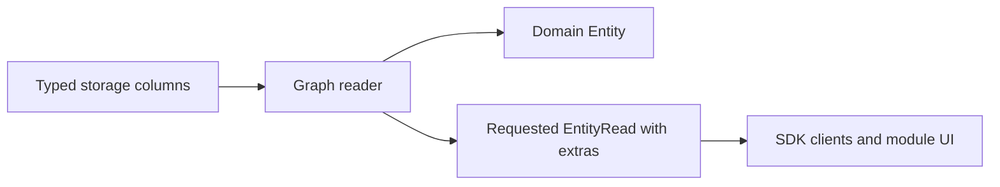
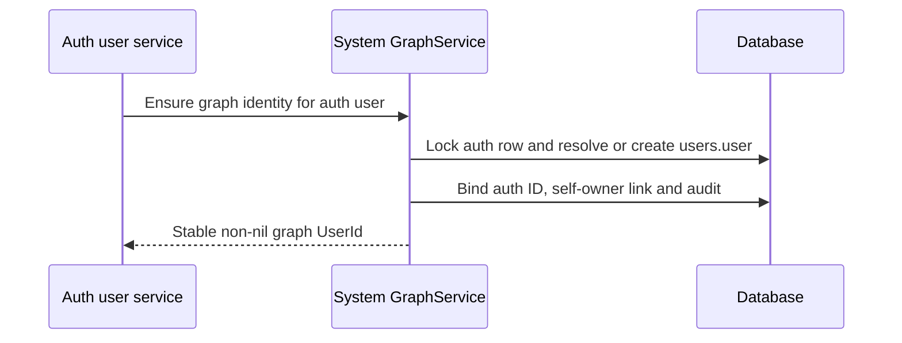

# Adopt the knowledge graph contracts

Status: SPEC_DRAFT  
Spec lock: unlocked  
Implementation lock: unlocked  
Active Delivery: none  
Unattended decisions: allowed  

<!-- plan:spec:start -->
## The Goal

1. Establish one English developer reference in `docs/vision.md`, with each type next to its behavior and exceptions, and use it as the migration contract for the app and plugin catalog.
2. Adopt explicit persistent/transient and derived types across the shared SDK and its consumers, then separate domain Entity values from requested operational extras without changing identity, evidence or access scope.
3. Migrate pin, archive, privacy and indexing projections and consolidate membership relations into `belongs_to`, preserving sync choices, temporal history and repeat-ingestion behavior.
4. Give each Magnis auth user a canonical `users.user` Entity, connect people to it through `identity`, and maintain protected temporal `owner` Links through system GraphService functions only.
5. Bring Graph reads, Search, merge, extraction and workspace transfer onto those same boundaries; prove that generic writers cannot change ownership and that replay, ambiguity and conflicting periods remain deterministic.
6. Publish compatible app/catalog changes through the existing SDK and package activation mechanism, with migration fixtures, scoped checks and the complete affected repository gates. Implementation begins only after the owner approves the SPEC and the resulting Delivery/Stage contract.

## Why now

The owner has defined the target graph in a sustained design discussion. Public Entity currently mixes knowledge with pin/archive/indexing state; identity, Source records and security users are represented at different boundaries. The request is to translate and restructure that reference, commit it, and prepare the migration plan. This commit changes documentation only.

The reference retains the inspected October 3–5 behavior and labels target/open rules. App `staging` inspected on October 6 at `3579a8fff765293bb14b421212552fca9800706b` still has Entity.owner, nullable isPinned/isArchived, boolean indexed and no canonicalKey in its Entity declaration. The earlier entity-one-type checkout is no longer present. Identity, entity-sync, auto-modules and WebSource work must be reconciled with their current owners before implementation; their presence in the document is not evidence they are merged into staging. Do not reimplement their approved work from an older snapshot.

Evidence owners:

| Finding | Inspected code / reference |
| --- | --- |
| Public flags and owner are part of Entity | App `packages/sdk/src/core/entity.ts`, `backend/src/core/entity.ts` |
| Viewer preference and domain rows differ | App `backend/src/db/schema/graph.ts`, `backend/src/db/repository-helpers.ts` |
| Auth users have secrets and a nil-ID default account | App `backend/src/db/schema/users.ts`, `services/users/default-user.ts`, `users.service.ts` |
| Exact identity/preparation and hub merge replay already exist in working branches | Reference sections 6–7; inspected identity/entity-one-type graph repository and merge PG scenarios 054/055 |
| Claims, pending/indexed/refused and temporal derivation exist in inspected working code | Reference sections 10–11; SDK indexing, Graph derive/claim.repository and search graph-indexer |
| Privacy work is a contract, not a completed implementation | App `feat/private-entity-flag`, commit `2ea08b25957bbb3d60bdeb144d19f2d24d3d4665` |
| Shared membership replaces two spellings | Existing host `in_chat`, module `triggers.belongs_to`, owner decision to use `belongs_to` |

## The target

### Interfaces

The following signatures declare migration differences, not new parallel SDKs. Definitions belong in the existing SDK owner files. Persistent-ID and Derived naming follow the owner decisions. Other proposals remain explicitly marked; the New names table records their reasons.

```typescript
// SDK core/entity.ts; Id and UuidShapeSchema remain canonical imports.
export const PersistentEntityIdSchema = UuidShapeSchema
  .refine((id: string) => id !== NIL_ID, "Persistent Entity ID must not be nil")
  .brand<"PersistentEntityId">();
export type PersistentEntityId = z.output<typeof PersistentEntityIdSchema>;
export type EntityId = PersistentEntityId | NilId;

// Auth identity is intentionally separate from the graph user's node.
export type AuthUserId = Id;
export type UserId = PersistentEntityId;

export interface UserEntityBinding {
  authUserId: AuthUserId;
  entityId: UserId;
}

export type Origin = "canonical" | "derived";

export interface DerivedStatement {
  origin: "derived";
  confidence: number;
  evidence: [PersistentEntityId, ...PersistentEntityId[]];
  validFrom: DateTimeUtc | null;
  validUntil: DateTimeUtc | null;
}
export interface DerivedEntity<P extends JsonValue = JsonValue>
  extends EntityBase<P>, DerivedStatement {
  keys: string[];
}
export interface DerivedLink extends LinkBase, DerivedStatement {}
export type Link = CanonicalLink | DerivedLink;

// Internal deriveEntity result; not a graph Entity.
export interface EntityDerivation {
  eligible: boolean;
  reason: string | null;
  confidence: number;
  evidence: PersistentEntityId[];
}
export declare function deriveEntity(
  claims: readonly GraphClaim[],
  withdrawn: boolean,
): EntityDerivation;

export const derivedStatementSchema = z.strictObject({
  origin: z.literal("derived"),
  confidence: z.number().gt(0).lte(1),
  evidence: z.tuple([PersistentEntityIdSchema], PersistentEntityIdSchema),
  validFrom: dateTimeSchema.nullable(),
  validUntil: dateTimeSchema.nullable(),
});

// Existing generic Entity variants are renamed, not duplicated.
export type Entity<P extends JsonValue = JsonValue> =
  | CanonicalEntity<P>
  | DerivedEntity<P>;
export type PersistentEntity<P extends JsonValue = JsonValue> =
  Entity<P> & { id: PersistentEntityId };
export type TransientEntity<P extends JsonValue = JsonValue> =
  Entity<P> & { id: NilId };

export interface EntityRead<P extends JsonValue = JsonValue> {
  entity: PersistentEntity<P>;
  extras: EntityExtras;
}
export interface GraphReader {
  get(id: PersistentEntityId): Promise<PersistentEntity>;
  get(id: PersistentEntityId, options: { extras: true }): Promise<EntityRead>;
}

export interface EntitySystemState {
  owner: AuthUserId; // Hidden existing SQL ownership scope.
}
export type UserEntityProperties = {
  name: string;
  surname: string | null;
};
export type UserEntity = CanonicalEntity<UserEntityProperties> & {
  id: UserId;
  schemaId: "users.user";
};
export interface TransferOwnershipRequest {
  entityId: PersistentEntityId;
  newOwnerId: UserId;
}
```

EntityBase.id becomes EntityId; Link endpoints and every saved evidence/reference become PersistentEntityId. Other Source/account/schema IDs retain their existing domains. DerivedEntity, DerivedLink and DerivedStatement replace AgentEntity, AgentLink and AgentStatement throughout compiler-reported consumers. The target discriminator is `origin: "derived"`, covering extraction, aggregation and inference. `GraphClaim` remains the source assertion, while DerivedStatement carries the graph result supported by those claims. Rename the existing internal `DerivedEntity` computation result to `EntityDerivation`, matching `RelationDerivation`, before reusing DerivedEntity for the full graph value.

EntityExtras is the reference's flat required shape: `pinOrder: number | null`, `archived: boolean`, `private: boolean`, read-only `indexed: "pending" | "indexed" | "refused"`, plus either `{syncEnabled: boolean; syncRevision: string}` or the complete pair of nulls. There is no pinned boolean, trigger array, owner or independent indexingPending. Public parsers reject missing fields and half-present sync pairs. The Graph read projection maps a missing graph_index row to pending.

**Proposed bootstrap choice for approval:** preserve existing auth IDs and foreign keys; add a unique `users.entity_id` mapping to a non-nil graph user. The default nil auth user therefore gets a distinct assigned Entity ID. Existing `entities.owner` and `links.owner` remain private auth-scope projections, resolved to the graph user through that mapping. This refines the reference's previously open storage mapping; it avoids rewriting every auth/session/workspace reference. The graph-user schema exposes only name/surname in this scope; login email, password hashes, admin privileges, sessions and provisioning state stay in auth storage.

### A. Publish the core SDK and extras projection together



Reuse existing Graph queries and response schemas. Persisted internal rows may contain owner and operational columns; they are not serialized by spreading a storage object into Entity. Ordinary reads can omit preference/index-status joins while still enforcing ACL, archive and privacy. Detail, traversal, lists, tools and transfer must each declare their projection explicitly; no accidental second Entity shape in plugins.

| Implementation map | Core and extras |
| --- | --- |
| Owner | SDK entity/link/statement definitions; GraphService and repository readers |
| Target files | CREATE `../../../magnis-app/backend/migrations/20261006000000_graph_derived_origin.sql`; MODIFY `../../../magnis-app/packages/sdk/src/core/entity.ts`, `../../../magnis-app/packages/sdk/src/core/link.ts`, `../../../magnis-app/packages/sdk/src/core/statement.ts`, `../../../magnis-app/packages/sdk/src/rpc/registry.ts`, `../../../magnis-app/backend/src/core/entity.ts`, `../../../magnis-app/backend/src/services/graph/entity.repository.ts`, `../../../magnis-app/backend/src/services/graph/graph.service.ts`, `../../../magnis-app/backend/src/services/graph/graph.controller.ts`, `../../../magnis-app/backend/src/db/repository-helpers.ts` |
| Input / wake | Known-ID reads, list/detail requests, explicit extras request, existing mutation commands |
| Output / durable state | One domain type, explicit extras responses, hidden auth owner; existing sync revision and processing permission retained |
| RED test | Extend `backend/test/tst_bts_graph_entity_repo_contract.test.ts`, `tst_bts_graph_pins.test.ts` and SDK `test/graph.contract.test.ts`: bare read omits operational fields; extras read preserves two viewers' distinct preferences; current parsers accept derived and reject agent |

Use `/rename` during implementation for symbol changes: change the owning declaration, follow compiler errors and run the affected project typecheck; do not perform text-search-driven symbol replacement. Runtime strings such as relation kinds and stored JSON need explicit migration fixtures independently of the compiler.

Migrate Entity and Link origin values from `agent` to `derived` with a dedicated SQL migration. Update the origin-value and statement constraints, SQL predicates, SDK discriminated unions and the agentStatementSchema export (renamed derivedStatementSchema). Preserve IDs, evidence, confidence, keys, eligibility and periods. GraphClaim.origin remains indexed/manual; auth agent settings, event producers and domain properties containing the string agent are unrelated.

Versioned workspace import translates the legacy Entity/Link discriminator explicitly; new exports and current public parsers use derived only. Update app and catalog artifacts together at the existing compatibility boundary. Stop old writers for the database cutover and validate the new constraints before activating the new runtime. A repeated upgrade changes no additional rows; an unrecognized origin aborts the transaction. No permanent third origin or silent generic string replacement is introduced.


### B. Migrate operational storage without inventing input values

Keep typed columns; do not introduce a JSONB extras table. Normalize archived null/false to false and retain true. Add private using the previously approved privacy contract's initial false. Keep the current internal processing-permission boolean separate from read-only indexed status. Move sync fields only in the public projection, preserving stored booleans, decimal revisions and pending/applied selections.

**Proposed legacy pin rule for approval:** pin status follows the old pinned flag. Preserve numeric orders of actually pinned rows. Append pinned rows lacking an order after existing pinned orders, deterministically by Entity createdAt then ID for each viewer; when no ordered pin exists, this migration starts the sequence at zero. An order-only unpinned row becomes null. Keep the old columns as deprecated migration evidence during this rollout and export the pre-migration fixture/backup for rollback. Removing those columns is a later cleanup after migrated counts and UI ordering pass, not part of the four migrations below. If appending would overflow the storage integer, fail preflight and request an explicit resequencing decision. Runtime pin commands require a supplied integer, including zero; no missing-value default.

Implement the embedding privacy scope already described: device-only models may process private records, cloud-allowed selection/audit/count/ranked hydration excludes them. Stop excludes a scope's new Source changes, not its saved graph or local manual writes. Do not claim protection of chat/completion or extraction until their separate policy is approved.

| Implementation map | State migration |
| --- | --- |
| Owner | Database migration, Graph lifecycle/preferences and search policy |
| Target files | CREATE `../../../magnis-app/backend/migrations/20261006000001_graph_extras.sql`; MODIFY `../../../magnis-app/backend/src/db/schema/graph.ts`, `../../../magnis-app/backend/src/services/graph/entity.repository.ts`, `../../../magnis-app/backend/src/services/search/search-index.repository.ts`, `../../../magnis-app/backend/src/services/search/search-indexer.service.ts`, `../../../magnis-app/backend/src/services/search/search-query-compiler.repository.ts`, `../../../magnis-app/backend/src/services/search/search-query-helpers.ts`, `../../../magnis-app/backend/src/services/search/ranked-search-scope.repository.ts`, `../../../magnis-app/backend/src/services/search/entity-search.repository.ts` (DB schema regenerated) |
| Input / wake | Upgrade with legacy preference rows, archive nulls, existing sync choices and index records |
| Output / durable state | Deterministic nullable pin order; required archive/private projection; no false claim that processing succeeded |
| RED test | Extend `backend/test/tst_bts_graph_pins.test.ts`, `tst_bts_search_visibility.test.ts`, `tst_bts_search_indexer.test.ts` with migration/zero-order/privacy cases |

### C. Consolidate membership and retain its history

Register host-owned `belongs_to`; convert `in_chat` and `triggers.belongs_to` in stored Links, claims/withdrawal identities, workspace format handling, module manifests, tools and queries. It means element → container and is not globally restricted to content. Preserve from/to direction and periods; do not consolidate child_of. Update explicit module permissions rather than inheriting old prefix grants.

Before rewriting, enumerate duplicate keys caused by convergence. Identical pair/origin/period duplicates may use the existing deterministic Link collapse mechanism with an ID mapping; differing overlapping periods or conflicting producer provenance fail migration preflight without changing rows. Do not silently discard temporal history. Old workspace input is upgraded at its versioned import boundary; all new exports and live writes use belongs_to. No permanent runtime alias namespace is introduced.

| Implementation map | Membership |
| --- | --- |
| Owner | Graph registry, workspace codecs and Telegram/Triggers modules |
| Target files | CREATE `../../../magnis-app/backend/migrations/20261006000002_graph_membership.sql`; MODIFY `../../../magnis-app/packages/sdk/src/core/link.ts`, `../../../magnis-app/backend/src/services/graph/graph-contracts.ts`, `../../../magnis-app/backend/src/services/graph/link.repository.ts`, `../../../magnis-app/backend/src/services/graph/graph.transfer.ts`, `../../../magnis-app/backend/src/services/triggers/triggers.repository.ts`, `../../../magnis-app/backend/src/services/episodes/episodes.repository.ts`, `modules/telegram/module/service.ts`, `modules/triggers/manifest.toml`, `modules/triggers/module/service.ts` |
| Input / wake | Upgrade, module activation, message/trigger creation, import and relation queries |
| Output / durable state | One active host kind, correct permissions, preserved IDs or explicit collapse mapping and periods |
| RED test | Extend app `backend/test/tst_bts_graph_link_kinds.test.ts`, `tst_bts_graph_merge_pg.test.ts`, `tst_bts_dataset_format.test.ts`; catalog `modules/telegram/module/__tests__/telegramIngest.test.ts` and trigger CRUD scenarios |

### D. Bootstrap graph users and protect ownership at every writer



The proposed user node is a non-mergeable, non-generic-deletable, non-syncable host identity_channel. Bootstrap is idempotent under a unique mapping and row lock. A user's root node is owned by that auth user and has the system-only self-owner Link; this is an explicit root case, not permission for generic self-owned Links. Backfill existing users, including nil auth user, before enabling public owner traversal. Add a person → user identity Link only when the user/account mapping supplies an unambiguous person; never select one by name alone.

Backfilled owner periods start at the migration's recorded timestamp. Existing ownerId supplies current ownership, not evidence of ownership since createdAt; ownership before that timestamp remains unknown unless an authoritative historical record is available. Newly created entities start their owner period at creation. Complete bootstrap in one system transaction: create the graph node for the existing auth row, set its unique binding, then record the protected self-owner Link and audit.

Every new Entity gets its current owner Link in the same transaction. Generic add/end/unlink/patch, plugin batch, extraction, registration, import and merge must reject or route protected mutations to the system function. Import restores auth bindings for the target workspace and system ownership through GraphService instead of inserting arbitrary owner rows. Exact transfer input uses graph UserId; Graph resolves both auth scopes internally. Lock participating auth scopes in stable order.

**Proposed bounded transfer policy for approval:** implement transfer for a non-user Entity only if it has no ordinary incident Links, no claims/evidence dependencies, and no non-owner references requiring transfer. Inventory relational and structured-JSON references on the integrated head before enabling transfer; if completeness cannot be established, leave transfer unavailable. Otherwise return an explicit conflict for any such dependency, with no mutation. This first contract does not guess a transfer closure or grant access across users. At one service-chosen timestamp, close prior owner, insert new owner, update internal scope/projection and audit atomically. Same-owner transfer is a no-op. Transfer/user-node deletion and connected cross-owner moves require a later owner-approved contract, not an external allowSystemLinks switch.

| Implementation map | User and ownership |
| --- | --- |
| Owner | Existing UsersService and system GraphService methods |
| Target files | CREATE `../../../magnis-app/backend/migrations/20261006000003_graph_user_ownership.sql`; MODIFY `../../../magnis-app/backend/src/db/schema/users.ts`, `../../../magnis-app/backend/src/db/schema/graph.ts`, `../../../magnis-app/backend/src/core/user.ts`, `../../../magnis-app/packages/sdk/src/core/user.ts`, `../../../magnis-app/packages/sdk/src/core/entity.ts`, `../../../magnis-app/packages/sdk/src/core/link.ts`, `../../../magnis-app/backend/src/services/users/users.service.ts`, `../../../magnis-app/backend/src/services/users/user.repository.ts`, `../../../magnis-app/backend/src/services/users/default-user.ts`, `../../../magnis-app/backend/src/services/graph/graph.registrar.ts`, `../../../magnis-app/backend/src/services/graph/graph.service.ts`, `../../../magnis-app/backend/src/services/graph/graph.repository.ts`, `../../../magnis-app/backend/src/services/graph/link.repository.ts`, `../../../magnis-app/backend/src/services/graph/graph.transfer.ts`, `../../../magnis-app/backend/src/services/search/search-query-compiler.repository.ts`, `../../../magnis-app/packages/sdk/src/rpc/registry.ts` (DB schemas regenerated) |
| Input / wake | Auth bootstrap, existing-user upgrade, Entity creation, authorized transfer, import and ownership query |
| Output / durable state | Stable graph user mapping, one current protected owner relation, hidden consistent auth projection and audit |
| RED test | Extend `backend/test/tst_bts_users_service.test.ts`, `tst_bts_workspace_identity.test.ts`, `tst_bts_graph_batch.test.ts`, `tst_bts_graph_merge_pg.test.ts`; CREATE `backend/test/tst_bts_graph_owner.test.ts` for cross-entry-point protection and atomic transfer |

### E. Preserve identity and temporal claims through the new boundary

Do not turn this migration into a new entity resolver. Reuse exact Source/canonical keys, preparation, identity Links, merge preview/execute and deterministic derive functions. Preserve the canonical identity-hub exception and repeated ensure after merge. Add the ordinary domain validator and protected-kind checks at extraction commit and merge result validation, so repository use cannot bypass them. Canonical/derived origin separation, explicit field conflicts, interval overlap refusal and source-claim replacement remain intact.

For this migration, same-schema different-version merge fails explicitly unless an existing approved version conversion is available. Keep current property merge behavior documented; do not silently add field claims or promote derived values. **Proposed conservative extras rule:** refuse merge when privacy, syncEnabled or per-viewer pinOrder differ (absent viewer preference means null); do not add an undeclared extras override to the properties-only MergeOverride. Equal choices survive; keep the survivor's syncRevision as its own counter, rather than comparing counters from different entities. Both participants must already be unarchived. Reconcile/invalidate derived indexing through the existing graph mutation path, never choose the better-looking status. A richer extras arbitration command remains a separate contract. System merge retains the survivor owner and retires the duplicate same-owner relationship through the protected path; it does not transfer ownership. Replay must still resolve both representations to the survivor.

Keep pending/indexed/refused with the existing owner revision fence. The revision-based search queue remains a follow-up design already described in the reference: requested/processed and configuration revisions, dependency invalidation, retry/refusal and crash recovery must be completed before that queue replaces digest selection. Do not claim it has been implemented by exposing the status field.

| Implementation map | Process consistency |
| --- | --- |
| Owner | Graph domain decision functions and the existing indexer |
| Target files | MODIFY `../../../magnis-app/backend/src/services/graph/merge.ts`, `../../../magnis-app/backend/src/services/graph/graph.repository.ts`, `../../../magnis-app/backend/src/services/graph/graph.service.ts`, `../../../magnis-app/backend/src/services/graph/graph.transfer.ts`, `../../../magnis-app/backend/src/core/merge.ts`; prerequisite owners currently in identity checkout: `../../../magnis-app/.worktrees/identity/backend/src/services/graph/claim.repository.ts`, `../../../magnis-app/.worktrees/identity/backend/src/services/graph/derive.ts`, `../../../magnis-app/.worktrees/identity/backend/src/services/search/graph-indexer.ts`, `../../../magnis-app/.worktrees/identity/packages/sdk/src/core/indexing.ts` |
| Input / wake | Preview/execute, model proposal, changed source, repeated ensure and workspace replay |
| Output / durable state | Validated new projection with preserved identity/provenance and deterministic temporal results |
| RED test | Extend existing graph merge, batch and workspace scenarios; CREATE `backend/test/tst_bts_graph_contract_admission.test.ts` to reject malformed domain proposals and protected owner writes at every affected commit boundary |

### F. Migrate consumers and publish compatible artifacts

Use the SDK build and existing generated host-stub workflow. Convert app frontend/client-core and plugin SDK callers from direct flags to EntityRead/extras where the UI actually needs them; domain-only processing remains on Entity. Trigger lists remain separate paginated resources. Update relation consumers and declared permissions before activating packages against the new contract.

Do not support two permanent public Entity formats. Version the shared SDK/package activation boundary and reject an incompatible package as one activation, retaining the previous accepted version. Stored legacy values and old workspace exports are translated only by explicit migration/import boundaries. Stage the app runtime and catalog artifact versions together; rollout starts only after their compatibility matrix and restore fixture pass.

| Implementation map | Consumers and publication |
| --- | --- |
| Owner | SDK publisher, app transport/client-core and catalog SDK/UI owners |
| Target files | MODIFY `../../../magnis-app/frontend/src`, `../../../magnis-app/packages/client-core/src`, `../../../magnis-app/cli/src`, `../../../magnis-app/scripts/sdk-contract-audit.ts`, `../../../magnis-app/scripts/sdk-package-smoke.ts`, `../../../magnis-app/backend/src/services/workspace/workspace-document.ts`, `packages/plugin-sdk/contract/module.ts`, `packages/plugin-sdk/__tests__/graphContract.test.ts`, `packages/host-stubs/types`; exact module and UI callers derived by compiler before Stage approval |
| Input / wake | New SDK build, module installation/upgrade, UI reads, export/import |
| Output / durable state | Compatible artifacts and strict runtime contracts, no handwritten replacement host stubs |
| RED test | Existing package smoke, plugin graph contract and affected module/UI scenarios; one migrated-workspace integration fixture |

### Adoption order and proposed Delivery boundaries

This is the complete SPEC-level migration sequence. The executable Delivery/Stage/Task graph is authored after SPEC approval through planctl; none is approved or running in this commit.

| Order | Proposed PR boundary | Depends on | Completion evidence |
| --- | --- | --- | --- |
| 0 | Reconcile SDK/identity/entity-sync/claims/module-dependency prerequisites on the actual integration head | Their existing owners' work | Record integrated commits and compile the baseline; do not duplicate their implementations |
| 1 | App SDK names, derived-origin migration, persistent IDs, strict Entity/extras and storage migration | 0, approval of legacy pin proposal | Core parser, viewer preference, sync and read-projection scenarios; matched client changes in the same releasable boundary |
| 2 | App + catalog membership conversion | 1 | Old-data migration, temporal duplicate preflight, permissions and Telegram/Triggers scenarios |
| 3 | App graph users, protected ownership and bounded transfer | 1–2, approval of bootstrap/mapping/transfer proposals | Nil-auth-user bootstrap, all-writer rejection matrix, rollback/race and owner-search isolation |
| 4 | App merge/extraction/import validation and catalog consumer completion | 1–3 | Canonical/derived and period scenarios, repeated ensure, exported/restored workspace equivalence |
| 5 | Compatible runtime/SDK/catalog release and reference reconciliation | All above | Full affected gates, package/API compatibility, migration and restore verification; release approval remains separate |

Cross-repository implementation uses one shared plan. App Deliveries name repository `app`, catalog Deliveries name `catalog`; implementation setup configures `code-production.repository.app` / `.catalog` to the owner's intended checkouts. This authoring turn does not repoint shared repository configuration or create implementation worktrees. Active-time estimates and concrete Stage writes will be derived from the integrated baseline, not guessed across unmerged prerequisite branches.

## Target tree

App paths in the maps are relative to this plan checkout: `../../../magnis-app`. Identity-checkout paths identify prerequisite definitions currently absent from app staging; those changes will target the integrated app checkout after prerequisite reconciliation. They do not authorize edits to a colleague's worktree. Catalog paths are relative to this repository. Delivery repository bindings will replace these inspection locations before executable Stage approval.

| Action | Owner/path | Why this scope is necessary |
| --- | --- | --- |
| MODIFY | Catalog `docs/vision.md`, `README.md`, `docs/typing.md` | English reference, navigation, historical-status clarification |
| CREATE | Catalog `docs/plans/2026-10-06-entity-docs.md` | One migration plan, authored and journaled through planctl |
| MODIFY | App existing SDK, core and RPC files enumerated in maps A–F | Single shared definitions and runtime validators; no parallel type package |
| MODIFY | App existing Graph, Search, Users, transport and compiler-reported client files in A–F | Remove leaked operational fields and enforce the same authority in every writer and reader |
| CREATE | `../../../magnis-app/backend/migrations/20261006000000_graph_derived_origin.sql` | Entity and Link origin discriminator and constraint migration |
| CREATE | `../../../magnis-app/backend/migrations/20261006000001_graph_extras.sql` | Typed extras and legacy pin conversion |
| CREATE | `../../../magnis-app/backend/migrations/20261006000002_graph_membership.sql` | Membership vocabulary and history conversion |
| CREATE | `../../../magnis-app/backend/migrations/20261006000003_graph_user_ownership.sql` | Auth-to-graph-user binding and protected ownership |
| MODIFY, generated | App DB schema files and catalog host stubs | Regenerate from canonical SQL and SDK; never hand-edit generated declarations |
| MODIFY | Existing catalog plugin SDK, affected modules and manifests in maps C and F | Consume the new SDK and shared membership permissions |
| MODIFY | Existing scoped tests named in A–F | Reuse Graph, workspace, User and Source harnesses and fixtures |
| CREATE | `../../../magnis-app/backend/test/tst_bts_graph_owner.test.ts`, `../../../magnis-app/backend/test/tst_bts_graph_contract_admission.test.ts` | Missing cross-writer ownership and domain-admission behavioral scenarios |

This bounds owners rather than guessing every compiler caller. Before executable Stage approval, enumerate the actual affected caller paths on the integrated head; unexpected files require an explicit Stage update. New services, queues, runners, auth systems and generic resolver frameworks are not part of the change.

## Invariants

1. Nil is an unsaved sentinel; only assigned IDs can be Link endpoints, evidence or mutation targets. Existing auth nil IDs remain valid in their own domain.
2. Entity domain meaning is independent of whether extras is requested. Omitting extras never bypasses ACL, archive or privacy.
3. Nullable pin order is the only pin state; archive/private booleans and complete sync pairs are strict required response values. Read defaults occur at the specified storage projection only.
4. Owner is hidden system state and a protected canonical temporal Link. Generic RPC, plugins, model output, import and ordinary merge never acquire ownership-writing authority.
5. Source identity, domain identity, identity Links and physical merge retain distinct meanings. No automatic person merge by name, shared address or same_as chain.
6. Merge and extraction validate final domain data and registered endpoint rules under the same transaction/fence that records the result; stale model work cannot overwrite a newer graph.
7. Human approval does not change derived origin; repeated evidence does not add to confidence; a changed ending source cannot silently reopen a relation.
8. Migration preserves explicit sync decisions, applicable periods, auth bindings and access scope. Destructive ambiguity fails preflight rather than choosing silently.

### Acceptance cases

| ID | Behavioral scenario |
| --- | --- |
| KG-01 | Step 1 → parse two different unsaved Web results with nil. Step 2 → attempt a Link/evidence/save-by-ID using nil. Verify → both values remain representable, while saved-reference operations reject nil and valid assigned references still resolve |
| KG-02 | Step 1 → read one Entity without extras. Step 2 → read it as two viewers with different preferences using extras. Verify → equal domain values, distinct pin orders, no owner/trigger list leakage, unchanged access checks |
| KG-03 | Step 1 → upgrade fixtures for pinned numeric zero, pinned unordered, unpinned order-only and no preference row. Step 2 → repeat migration and read/order/unpin. Verify → deterministic approved mapping, zero stays pinned, second migration makes no new change, original state remains recoverable during rollout |
| KG-04 | Step 1 → omit/null an archived/private/indexed field or supply a half sync pair to the public parser. Verify → rejection. Step 2 → read an actual missing graph_index row. Verify → explicit pending without inserting status or inventing metadata |
| KG-05 | Step 1 → Stop a scope while a fetched page waits to commit. Step 2 → release the page and restart worker. Verify → no new content/triggers after the committed Stop; saved choice/revision survives and old acknowledgement does not apply a newer choice |
| KG-06 | Step 1 → migrate old message/trigger membership with adjacent and duplicate intervals. Step 2 → read, ingest again and import an old-version workspace. Verify → belongs_to everywhere, periods intact, repeats stable; overlapping conflicting conversion aborts with no partial writes |
| KG-07 | Step 1 → bootstrap the default nil auth user concurrently twice. Step 2 → restart and authenticate/read existing data. Verify → one assigned users.user, one binding and self-owner Link; auth ID and existing workspace access unchanged; no secrets in properties. Step 3 → query ownership before the backfill timestamp without historical evidence. Verify → no invented past owner |
| KG-08 | Step 1 → try owner add/end/unlink/patch through RPC, aliases, plugin batch, model output, registration, import and merge. Verify → rejection or the defined system route, with no forged owner. Step 2 → normal Entity creation. Verify → exactly one owner and matching internal scope/audit |
| KG-09 | Step 1 → transfer an isolated non-user Entity at T. Verify → old interval ends at T, new starts at T, one current owner, old user gains no current read right. Step 2 → retry same owner and test rollback midway. Verify → no extra interval; failure leaves original state. Step 3 → transfer a connected/claimed/user Entity. Verify → explicit conflict, no partial reassignment |
| KG-10 | Step 1 → create two internal people through different addresses and merge after preview. Step 2 → repeat ensure through both addresses. Verify → one survivor returned, representations retained, no new people; distinct provider canonical records still reject merge |
| KG-11 | Step 1 → preview conflicting properties then introduce another conflict. Step 2 → execute old overrides. Verify → refusal/rollback. Step 3 → provide explicit values but invalid domain output or incompatible schema version. Verify → refusal before mutation; valid override commits and old ID is not falsely promised as a redirect |
| KG-12 | Step 1 → feed identical claim sets as start→ending and ending→start. Step 2 → change the ending source. Verify → same interval in both orders, then hidden unresolved relation rather than invented reopening; repeated confidence never reaches one |
| KG-13 | Step 1 → return a model proposal with invalid domain properties, unauthorized endpoint roles or system owner kind. Verify → whole attempt rejected at commit. Step 2 → change graph revision during a valid model response. Verify → no stale nodes/claims/status completion |
| KG-14 | Step 1 → mark data private and use a cloud embedding model. Verify → no selection/audit/ranked hydration of private content. Step 2 → use device-only model. Verify → local behavior allowed; ordinary ACL remains enforced independently |
| KG-15 | Step 1 → export upgraded workspace and restore for its target auth user. Step 2 → compare domain identities, claims, periods, preferences, sync choices and protected owner bindings. Verify → intentional ID mappings only, no cross-owner disclosure or direct owner injection. Step 3 → install incompatible module artifact. Verify → rejected activation leaves prior accepted module active |
| KG-16 | Step 1 → preview/execute a merge with differing privacy, syncEnabled or viewer pinOrder. Verify → refusal without mutation, even if all property conflicts were resolved. Step 2 → equalize the choices through existing explicit commands and merge. Verify → survivor revision and equal choices retained; indexing invalidated/reconciled through the normal mutation path |
| KG-17 | Step 1 → upgrade a workspace with agent-origin Entity and Link rows, canonical rows, claims and unrelated domain properties containing agent. Verify → only Entity/Link discriminators become derived; IDs, evidence, confidence, periods and other origin domains stay intact; constraints validate. Step 2 → repeat the upgrade and import an old-version export. Verify → stable mapping without duplicates. Step 3 → parse current responses with derived, then agent. Verify → derived succeeds, agent is rejected; unknown stored origins abort migration without partial updates |

### Test strategy and publication

Use existing repo scripts; new behavioral tests must first reproduce the missing guarantee. App scoped commands start with `bun run agent:test:backend -- test/<named-test>.test.ts`; SDK renames use the existing `bun run --cwd packages/sdk typecheck` and `bun run build:sdk`, followed by affected `typecheck:backend` / frontend `typecheck` callers. App staging currently has no agent:typecheck or agent:build:sdk alias; do not invent commands. Catalog module tests use `bun run agent:test:modules -- <test-path>` and catalog typechecking uses `bun run agent:typecheck`. Reuse harnesses rather than building another test runner.

For this documentation commit, verify preserved declarations, English text, Markdown/local links and TypeScript snippets. The normal commit hooks run `agent:verify:docs` and `agent:verify:commit`. For later implementation publication run each affected repository's complete `agent:verify:pr` once on the release inputs; preserve hooks and reuse passing results when inputs are unchanged. PostgreSQL migration/concurrency tests and package compatibility smoke are required evidence, not replaced by typecheck. A code version mismatch is investigated, not automatically a dependency upgrade.

## Reuse

Reuse SDK Entity/Link/statement/RPC schemas; existing UuidShapeSchema and GraphRef preparation; typed SQL tables, unique constraints and owner mutation fence; link_kinds registry; deterministic merge and derive functions; GraphClaim replacement; UsersService/UserRepository; workspace codecs; SDK build/host-stub generation; Graph/Search/User/Source test harnesses. Generated schema files follow the repository SQL introspection workflow. No alternate graph service, auth table, resolver or public extras JSONB store is introduced.

## New names

| Proposed name | Replaces / reason |
| --- | --- |
| PersistentEntityId / PersistentEntityIdSchema | Makes non-nil validation explicit instead of hiding it behind the general EntityId name |
| EntityId as assigned-or-nil | Represents a domain value before persistence; retires ambiguous NullableId terminology without admitting JavaScript null |
| DerivedEntity / DerivedLink / DerivedStatement | Owner-selected names for graph values derived from claims through extraction, aggregation or inference |
| EntityDerivation | Frees the existing helper name DerivedEntity for the graph Entity; parallels RelationDerivation |
| derivedStatementSchema / origin: derived | Aligns the runtime validator and serialized discriminator with DerivedStatement; migrates the legacy agent spelling explicitly |
| EntityExtras / EntityRead | Separates requested operational state from the domain value, reusing names already discussed |
| AuthUserId / UserEntityBinding | Separates existing auth scope, including nil, from the new graph node; maps through users.entity_id instead of rekeying sessions |
| UserEntityProperties | Minimal public graph-user shape; deliberately excludes auth/admin/secrets fields |
| belongs_to | Unifies in_chat and triggers.belongs_to membership without a domain-specific verb |
| owner | Protected system relationship, with ordinary write rejection on every route |

## Not verified

No product changes or migrations were executed in this authoring turn. The exact integration head after the prerequisite work, complete compiler-derived consumer file list, migration row counts, data-dependent overlap conflicts, generated API version and release artifact compatibility must be measured before executable Stage approval. No PR publication or deployment is authorized by this documentation commit.

Persistent-ID and Derived naming reflect owner decisions. Legacy pin ordering, auth-user mapping/self-owned bootstrap, bounded transfer and refusal of conflicting extras on merge are explicit proposals presented for SPEC approval, not claims of prior owner approval. Wider ACL, connected cross-owner transfer, field-level derived provenance, richer merge extras arbitration, unmerge, general alias consolidation, revision-queue storage/recovery and cloud policy beyond the existing embedding scope remain follow-up contracts. The plan does not silently manufacture answers to them or promise they are already implemented.
<!-- plan:spec:end -->

<!-- plan:implementation:start -->
## Implementation contract
<!-- plan:implementation:end -->

<!-- plan:execution:start -->
## Execution log
<!-- plan:execution:end -->
