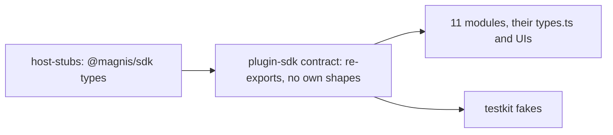

# One entity type: the catalog imports the SDK Entity and Link

Status: SPEC_LOCKED  
Spec lock: sha256:0c526caee41f55597e0e5bc6562578df3a8df0f25fde2d9a3892c6dd669edd82 owner:Утверждаю, приступаю прямо сейчас. Мы это сделаем отдельным комитом и сможем, чтобы можно было использовать другими.  
Implementation lock: unlocked  
Active Delivery: D1  
Unattended decisions: allowed  

<!-- plan:spec:start -->
## The Goal

The catalog half of "one type per thing" for Graph entities and links. The SPEC is the app repository's `docs/plans/entity-one-type.md`; this plan does not restate it.

The catalog stops declaring its own entity and link shapes. It deletes the hand-written `RawEntity`, `LinkSummary`, `EntityDetail{entity,links}`, `WindowRow`, `WindowPage`, `EntityPage`, `SearchEntitiesPage`, `LinkedRow`, `LinkedPage`, the merge types, `GraphBatchResult` and the operation input types from `packages/plugin-sdk/contract/module.ts`, and imports the SDK types through `host-stubs`. Every module, its DTOs and its UI read the camelCase fields.

The currency is hand-written type declarations and the snake fields read from them:

- **Read and input types.** 14 hand-written read and result types in `packages/plugin-sdk/contract/module.ts` go to zero, and so do the hand-written operation input types (`BatchEntityInput`, `BatchRefInput`, `BatchLinkInput`, `GraphBatchInput`, `AddLinkParams`, `ListParams`, `WindowSpec`, `LinkedSpec`, `SearchEntitiesPageParams`).
- **Field reads.** About 170 snake field reads in the 11 modules, and 59 snake field copies in `modules/*/types.ts`, become the SDK's camelCase fields.
- **The live defect.** The contacts merge preview reads the fields the host actually sends.

## The target



`packages/plugin-sdk/contract/module.ts` imports `Entity`, `Link`, `EntityWithLinks`, `EntityPage`, `LinkedEntity`, the merge types, `GraphBatchResult` and the operation input types from `@magnis/sdk`, type-only and without zod, and uses them in `GraphService`. `find_by_anchor(s)` becomes `find_by_external_id(s)`, and batch inputs use `schemaId` and `externalId`.

### Target tree

```text
MODIFY packages/plugin-sdk/contract/module.ts        SDK types in place of the hand-written ones
MODIFY packages/plugin-sdk/index.ts                  re-exports
MODIFY packages/testkit/module.ts                    fakes return SDK-shaped rows
MODIFY packages/host-stubs/types/                    regenerated with scripts/gen-host-stubs.sh from the app branch
MODIFY modules/*/module/**/*.ts                      fields named by the compiler
MODIFY modules/*/types.ts                            DTO fields in camelCase
MODIFY modules/*/ui/**/*.tsx                         UI reads in camelCase
MODIFY modules/*/**/__tests__/*.ts, modules/*/entities.test.ts   fixtures in the SDK shape
MODIFY docs/plugins/module.md, docs/graph.md         field names
```

## Today, measured against that

On catalog base `8f1e371`:

- `RawEntity` (`packages/plugin-sdk/contract/module.ts:40-58`) and its siblings (`:124-153`, `:193-249`, `:302-308`) are hand-written. Their comments still say they mirror the retired Rust host.
- No module imports `@magnis/sdk`; the stubs reach the catalog and nothing reads them.
- `modules/contacts/ui/ContactMergeRenderer.tsx:18-33,111-114,227` reads `survivor_value`, `property_count` and `links_to_repoint`, while the host sends camelCase.

## Invariants

1. **No own entity shapes.**
   - Step 1: typecheck the catalog.
   - Verify: it passes, and `packages/plugin-sdk/contract/module.ts` declares no entity, link, page, merge or batch result type of its own.
2. **Module behaviour is unchanged.**
   - Step 1: run every module suite with fixtures in the SDK shape.
   - Verify: all pass.
3. **The merge preview renders the host's fields.**
   - Step 1: render `ContactMergeRenderer` with an SDK `MergePreview`.
   - Verify: survivor and retired values are shown.

## Owner decisions

The owner's approval of 2026-10-02 is recorded in the app SPEC. Both PRs merge together.

## The pre-approval screen

### Acceptance stories

1. A module reads `entity.schemaId` and `link.from`, with types from `@magnis/sdk`.
2. The contacts merge preview shows both values.

### Deliberately not verified

- **Running against an older host:** unsupported, because both PRs land together.
<!-- plan:spec:end -->

<!-- plan:implementation:start -->
## Implementation contract

<!-- plan:delivery:D1:start -->
<!-- plan:delivery-meta:{"active":true,"depends":[],"predictedExternalWaitMinutes":60} -->
### PR Delivery D1 — The catalog imports the SDK entity types

Branch: `feat/entity-one-type`; Depends: none; Gate: backend, frontend.

Stage graph: `D1-S1 -> D1-S2`.

Forecast: 260 active min / 52 credits across 2 Stages; longest dependency path 260 active min; external waits 60 min.

What changed for people. Module authors read one entity and link shape, the SDK's, and the contacts merge preview shows its values again.

What changed in the code. packages/plugin-sdk imports Entity, Link, the page, merge and batch result types and the operation inputs from @magnis/sdk through regenerated host-stubs and declares none of its own; testkit fakes return that shape; every module, its types.ts and its UI read camelCase fields; find_by_external_id(s) and externalId replace the anchor names.

How it was proven. The testkit and every module suite pass on SDK-shaped fixtures; the contacts merge renderer shows survivor and retired values from an SDK MergePreview.

Not in this PR. The host side, which lands together in the app PR of the same name.

<!-- plan:stage:D1-S1:start -->
<!-- plan:stage-meta:{"deliveryId":"D1","depends":[],"parallelWith":[],"writes":["packages/host-stubs/types/**","packages/plugin-sdk/contract/module.ts","packages/plugin-sdk/index.ts","packages/testkit/module.ts","packages/testkit/__tests__/module.test.ts","docs/plugins/module.md","docs/graph.md"],"tempRoot":".tmp/code-production/entity-one-type/D1-S1","predictedActiveMinutes":55,"predictedCredits":11,"verifyActiveMinutes":10,"verifyCredits":2} -->
#### Stage D1-S1 — plugin-sdk and testkit use the SDK entity types

- Owner: agent-1; Profile: fast; Depends: none; Parallel with: none.
- Writes: `packages/host-stubs/types/**`, `packages/plugin-sdk/contract/module.ts`, `packages/plugin-sdk/index.ts`, `packages/testkit/module.ts`, `packages/testkit/__tests__/module.test.ts`, `docs/plugins/module.md`, `docs/graph.md`.
- Temp root: `.tmp/code-production/entity-one-type/D1-S1` (must be absent at handoff).
- Of which verification: 10 active min / 2 credits.

What this Stage solves. plugin-sdk hand-writes RawEntity, LinkSummary and twelve more read, result and input types that mirror nothing typed, and testkit fakes produce that hand-written shape.

What is built. host-stubs are regenerated from the app branch with scripts/gen-host-stubs.sh. packages/plugin-sdk/contract/module.ts imports the SDK types, type-only, and uses them in GraphService, with find_by_external_id(s) in place of find_by_anchor(s). packages/testkit/module.ts fakes return SDK-shaped rows. The plugin docs name the camelCase fields.

How it is proven. tst_cat_entity_one_type_001 mounts a module whose mock graph returns SDK-shaped rows and reads schemaId and source.externalId.

Commit. feat(plugin-sdk): import the SDK entity, link and operation types — no hand-written mirror.

##### Tasks

- [ ] ENTC_001 — Regenerate host-stubs and make plugin-sdk and testkit use the SDK entity, link, page, merge, batch and input types. (45 min)
<!-- plan:task-meta:{"writes":["packages/host-stubs/types/**","packages/plugin-sdk/contract/module.ts","packages/plugin-sdk/index.ts","packages/testkit/module.ts","packages/testkit/__tests__/module.test.ts","docs/plugins/module.md","docs/graph.md"],"predictedActiveMinutes":45,"predictedCredits":9,"how":"run the app branch's scripts/gen-host-stubs.sh into packages/host-stubs; in packages/plugin-sdk/contract/module.ts delete RawEntity, LinkSummary, EntityDetail, WindowRow, WindowPage, LinkedRow, LinkedPage, SearchEntitiesPage, EntityPage, the merge types, GraphBatchResult and the operation input types, import their SDK forms, and rename the anchor operations; re-export from packages/plugin-sdk/index.ts; make packages/testkit/module.ts fakes return SDK rows; add tst_cat_entity_one_type_001 to packages/testkit/__tests__/module.test.ts; rename fields in docs/plugins/module.md and docs/graph.md","red":"bun run agent:test:backend -- packages/testkit/__tests__/module.test.ts -t tst_cat_entity_one_type_001"} -->

##### Acceptance criteria

- [ ] `bun run agent:test:backend -- packages/testkit/__tests__/module.test.ts` exits 0 — fakes return SDK-shaped rows
- [ ] `packages/plugin-sdk/contract/module.ts` declares no entity, link, page, merge, batch result or operation input type of its own
- [ ] Commit

##### Results

<!-- plan:results:D1-S1:start -->
| Task | Commit | UTC start-end | Active / elapsed | Usage | Result / proof |
|---|---|---|---:|---|---|
<!-- plan:results:D1-S1:end -->
<!-- plan:stage:D1-S1:end -->

<!-- plan:stage:D1-S2:start -->
<!-- plan:stage-meta:{"deliveryId":"D1","depends":["D1-S1"],"parallelWith":[],"writes":["modules/**"],"tempRoot":".tmp/code-production/entity-one-type/D1-S2","predictedActiveMinutes":205,"predictedCredits":41,"verifyActiveMinutes":25,"verifyCredits":5} -->
#### Stage D1-S2 — Every module reads camelCase entity fields

- Owner: agent-1; Profile: fast; Depends: D1-S1; Parallel with: none.
- Writes: `modules/**`.
- Temp root: `.tmp/code-production/entity-one-type/D1-S2` (must be absent at handoff).
- Of which verification: 25 active min / 5 credits.

What this Stage solves. Eleven modules read about 170 snake fields from the deleted types, copy schema_id, created_at and is_pinned into their DTOs 59 times, and the contacts merge renderer reads keys the host never sends.

What is built. The compiler names every site after D1-S1. Each module, its types.ts and its UI read the SDK's camelCase fields and write batches with schemaId and externalId. Fixtures and tests take the SDK shape.

How it is proven. One RED per module group, each adding a tst_cat_entity_one_type test with an SDK-shaped fixture; the whole catalog suite passes afterwards.

Commit. refactor(modules): read the SDK entity fields — camelCase, externalId, the merge preview fixed.

##### Tasks

- [ ] ENTC_002 — Move contacts and companies, including the merge renderer, onto the SDK entity fields. (50 min)
<!-- plan:task-meta:{"writes":["modules/contacts/**","modules/companies/**"],"predictedActiveMinutes":50,"predictedCredits":10,"how":"fix every site the compiler names in modules/contacts and modules/companies, including ContactMergeRenderer.tsx reading survivorValue, propertyCount and linksToRepoint; add tst_cat_entity_one_type_002 to modules/contacts/ui/__tests__/ContactMergeResolution.test.tsx rendering an SDK MergePreview","red":"bun run agent:test:frontend -- modules/contacts/ui/__tests__/ContactMergeResolution.test.tsx -t tst_cat_entity_one_type_002"} -->
- [ ] ENTC_003 — Move telegram onto the SDK entity and link fields. (40 min)
<!-- plan:task-meta:{"writes":["modules/telegram/**"],"predictedActiveMinutes":40,"predictedCredits":8,"how":"fix every site the compiler names in modules/telegram, links read from and to; add tst_cat_entity_one_type_003 to modules/telegram/module/__tests__/telegramRead.test.ts with SDK-shaped rows","red":"bun run agent:test:backend -- modules/telegram/module/__tests__/telegramRead.test.ts -t tst_cat_entity_one_type_003"} -->
- [ ] ENTC_004 — Move email and meetings onto the SDK entity fields. (35 min)
<!-- plan:task-meta:{"writes":["modules/email/**","modules/meetings/**"],"predictedActiveMinutes":35,"predictedCredits":7,"how":"fix every site the compiler names in modules/email and modules/meetings; add tst_cat_entity_one_type_004 to modules/meetings/module/__tests__/meetingsRead.test.ts with SDK-shaped rows","red":"bun run agent:test:backend -- modules/meetings/module/__tests__/meetingsRead.test.ts -t tst_cat_entity_one_type_004"} -->
- [ ] ENTC_005 — Move triggers, notes and projects onto the SDK entity fields. (35 min)
<!-- plan:task-meta:{"writes":["modules/triggers/**","modules/notes/**","modules/projects/**"],"predictedActiveMinutes":35,"predictedCredits":7,"how":"fix every site the compiler names in modules/triggers, modules/notes and modules/projects; add tst_cat_entity_one_type_005 to modules/notes/module/__tests__/notesRead.test.ts with SDK-shaped rows","red":"bun run agent:test:backend -- modules/notes/module/__tests__/notesRead.test.ts -t tst_cat_entity_one_type_005"} -->
- [ ] ENTC_006 — Move file, linkedin and x onto the SDK entity fields. (20 min)
<!-- plan:task-meta:{"writes":["modules/file/**","modules/linkedin/**","modules/x/**"],"predictedActiveMinutes":20,"predictedCredits":4,"how":"fix every site the compiler names in modules/file, modules/linkedin and modules/x; add tst_cat_entity_one_type_006 to modules/file/module/__tests__/fileModule.test.ts with SDK-shaped rows","red":"bun run agent:test:backend -- modules/file/module/__tests__/fileModule.test.ts -t tst_cat_entity_one_type_006"} -->

##### Acceptance criteria

- [ ] `bun run agent:verify:pr` exits 0 — the whole catalog gate passes on the SDK entity fields
- [ ] Commit

##### Results

<!-- plan:results:D1-S2:start -->
| Task | Commit | UTC start-end | Active / elapsed | Usage | Result / proof |
|---|---|---|---:|---|---|
<!-- plan:results:D1-S2:end -->
<!-- plan:stage:D1-S2:end -->
<!-- plan:delivery:D1:end -->
<!-- plan:implementation:end -->

<!-- plan:execution:start -->
## Execution log

- lock-spec sha256:0c526caee41f55597e0e5bc6562578df3a8df0f25fde2d9a3892c6dd669edd82 owner:Утверждаю, приступаю прямо сейчас. Мы это сделаем отдельным комитом и сможем, чтобы можно было использовать другими.

- put-delivery D1

- put-stage D1-S1

- put-stage D1-S2
<!-- plan:execution:end -->
