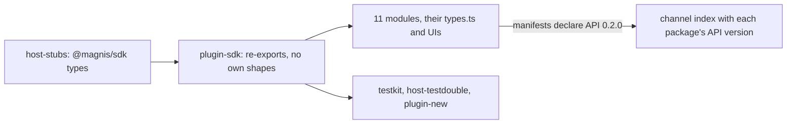

# One entity type: the catalog speaks the SDK shapes at API 0.2.0

Status: SPEC_LOCKED  
Spec lock: sha256:32d5032dfe63763557b770ec6d4b44ec8db9bd82fb2d84b5673f1cd54aa2ec3c owner:Все вот эти комментарии, убираем как можно пользу всех вещей. Упрощаем, убираем все эти кодеки. Это все как бы лишний код, который только раздражает. И запускаем еще один подробный раунд кодекса.  
Implementation lock: unlocked  
Active Delivery: none  
Unattended decisions: allowed  

<!-- plan:spec:start -->
## The Goal

The catalog half of "one type per thing, no case conversion". The SPEC is the app repository's `docs/plans/entity-one-type.md`; this plan does not restate it. The catalog stops declaring any shape the SDK owns, and every module reads and writes the SDK's camelCase fields with plugin API `0.2.0`.

The currency is deleted declarations and the snake reads behind them:

- **plugin-sdk mirrors.** These are deleted from `packages/plugin-sdk/contract/module.ts`, and their SDK forms are imported type-only through `host-stubs`:
  - `RawEntity`, `LinkSummary`, `EntityDetail{entity,links}`;
  - `WindowRow`, `WindowPage`, `EntityPage`, `SearchEntitiesPage`, `LinkedRow`, `LinkedPage`;
  - the merge types and `GraphBatchResult`;
  - every operation input type.

  `ListParams` and `SearchEntitiesPageParams` stay as plugin-side helpers, in camelCase.
- **Module mirrors.** These are deleted in favour of the SDK forms:
  - `LinkedEntitySummary` in contacts, email, meetings, notes, projects and telegram;
  - `CompanyLinkedEntity` in companies;
  - `SearchResultItem` in contacts and meetings;
  - `MergeField`, `MergePreviewData` and `MergeResult` in `modules/contacts/ui/ContactMergeRenderer.tsx`.

  Their casts through `unknown` go with them.
- **Test and scaffold mirrors.** The entity shapes in `packages/host-testdouble/{mention-search.ts,markdown.tsx,agent.tsx}`, the snake contract that `scripts/plugin-new.ts` generates, and the testkit row builders all use the SDK shapes.
- **Field reads.** About 170 snake field reads in the 11 modules, and 59 snake field copies in `modules/*/types.ts`, become camelCase.
- **The live defect.** The contacts merge preview reads the fields the host sends.

## The target



- **`packages/plugin-sdk/contract/module.ts`** imports every shape it uses from `@magnis/sdk` and declares none of the SDK's.
- **`GraphService`** uses those types, with `find_by_external_id(s)` in place of `find_by_anchor(s)`.
- **Every module manifest** declares `magnis_api_version = "0.2.0"`.
- **`scripts/build-catalog-index.ts`** writes each package's API version into the channel index, so a host installs only its own version.
- **`host-stubs` are regenerated once, last,** from the app branch after its client and frontend Stage. This plan's final Stage depends on that app commit.

### Target tree

```text
MODIFY packages/plugin-sdk/contract/module.ts        SDK types; plugin-side helpers in camelCase
MODIFY packages/plugin-sdk/index.ts                  re-exports
MODIFY packages/plugin-sdk/__tests__/reachedEndpoints.test.ts   SDK link type
MODIFY packages/testkit/module.ts                    fakes and row builders in the SDK shape
MODIFY packages/testkit/__tests__/module.test.ts
MODIFY packages/host-testdouble/{mention-search.ts,markdown.tsx,agent.tsx}   SDK entity shapes
MODIFY scripts/plugin-new.ts, scripts/plugin-new.test.ts   scaffold in the SDK shape, API 0.2.0
MODIFY scripts/build-catalog-index.ts, scripts/build-catalog-index.test.ts   API version in the index
MODIFY modules/*/manifest.toml                       magnis_api_version 0.2.0
MODIFY modules/*/module/**/*.ts, modules/*/types.ts, modules/*/ui/**/*.tsx   SDK fields; module mirrors deleted
MODIFY modules/**/__tests__/**, modules/*/entities.test.ts   fixtures in the SDK shape
MODIFY packages/host-stubs/types/**                  regenerated last from the app branch
MODIFY docs/plugins/module.md, docs/plugins/manifest.md, docs/graph.md   field names, API 0.2.0
```

## Today, measured against that

On catalog base `8f1e371`:

- **plugin-sdk mirrors:** `RawEntity` (`packages/plugin-sdk/contract/module.ts:40-58`) and its siblings (`:124-153`, `:193-249`, `:251-308`) are hand-written. Their comments say they mirror the retired Rust host.
- **No module imports `@magnis/sdk`.**
- **Module mirrors:** six modules declare their own `LinkedEntitySummary`, and `ContactMergeRenderer.tsx:18-33` declares its own merge types and reads `survivor_value`, `property_count` and `links_to_repoint`.
- **Test and scaffold mirrors:** `packages/host-testdouble/{mention-search.ts,markdown.tsx,agent.tsx}` and `scripts/plugin-new.ts` carry snake entity shapes.
- **Every manifest** declares `magnis_api_version = "0.1.0"`, and the channel index carries no API version.

## Invariants

1. **No own shapes.**
   - Step 1: typecheck the catalog.
   - Verify: it passes, and plugin-sdk and the modules declare none of the SDK's shapes; a search for `LinkedEntitySummary`, `RawEntity` or `LinkSummary` declarations outside `host-stubs` finds none.
2. **Fixtures are honest.**
   - Step 1: run the testkit builders.
   - Verify: they produce rows that satisfy the SDK `Entity`/`Link` types, and the old snake builders' output is refused by the type check.
3. **Modules behave as before.**
   - Step 1: run every module suite on SDK-shaped fixtures.
   - Verify: all pass.
4. **The merge preview renders the host's fields.**
   - Step 1: render `ContactMergeRenderer` with an SDK `MergePreview`.
   - Verify: survivor and retired values are shown.
5. **Packages carry their version.**
   - Step 1: build the catalog index.
   - Verify: every package entry carries `0.2.0`.
   - Step 2: scaffold a new plugin.
   - Verify: it declares `0.2.0` and SDK shapes.

## Owner decisions

The owner's approvals of 2026-10-02 are recorded in the app SPEC. Both PRs merge together; the app's E2E channel fixture is rebuilt from this branch.

## The pre-approval screen

### Acceptance stories

1. A module reads `entity.schemaId` and `link.from` with types from `@magnis/sdk`, and declares no entity type of its own.
2. The contacts merge preview shows both values.
3. A new plugin scaffolded today starts on API `0.2.0` with SDK shapes.

### Deliberately not verified

- **Running against an older host:** refused by the API version, by design.
<!-- plan:spec:end -->

<!-- plan:implementation:start -->
## Implementation contract
<!-- plan:implementation:end -->

<!-- plan:execution:start -->
## Execution log

- lock-spec sha256:32d5032dfe63763557b770ec6d4b44ec8db9bd82fb2d84b5673f1cd54aa2ec3c owner:Все вот эти комментарии, убираем как можно пользу всех вещей. Упрощаем, убираем все эти кодеки. Это все как бы лишний код, который только раздражает. И запускаем еще один подробный раунд кодекса.
<!-- plan:execution:end -->
