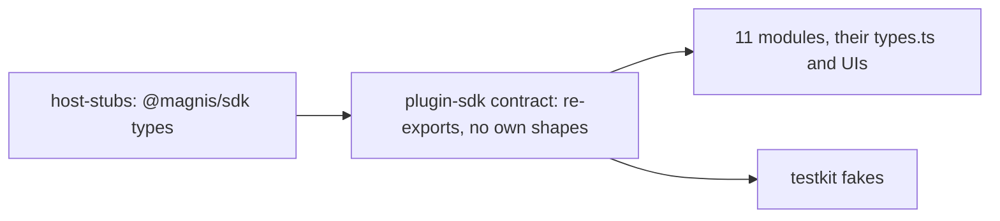

# One entity type: the catalog imports the SDK Entity and Link

Status: SPEC_LOCKED  
Spec lock: sha256:0c526caee41f55597e0e5bc6562578df3a8df0f25fde2d9a3892c6dd669edd82 owner:Утверждаю, приступаю прямо сейчас. Мы это сделаем отдельным комитом и сможем, чтобы можно было использовать другими.  
Implementation lock: unlocked  
Active Delivery: none  
Unattended decisions: allowed  

<!-- plan:spec:start -->
## The Goal

The catalog half of "one type per thing" for Graph entities and links. The SPEC is the app repository's `docs/plans/entity-one-type.md`; this plan does not restate it.

The catalog stops declaring its own entity and link shapes. It deletes the hand-written `RawEntity`, `LinkSummary`, `EntityDetail{entity,links}`, `WindowRow`, `WindowPage`, `EntityPage`, `SearchEntitiesPage`, `LinkedRow`, `LinkedPage`, the merge types, `GraphBatchResult` and the operation input types from `packages/plugin-sdk/contract/module.ts`, and imports the SDK types through `host-stubs`. Every module, its DTOs and its UI read the camelCase fields.

The currency is hand-written type declarations and the snake fields read from them:

- **Read and input types.** 14 hand-written read and result types in `packages/plugin-sdk/contract/module.ts` go to zero, and so do the hand-written operation input types (`BatchEntityInput`, `BatchRefInput`, `BatchLinkInput`, `GraphBatchInput`, `AddLinkParams`, `ListParams`, `WindowSpec`, `LinkedSpec`, `SearchEntitiesPageParams`).
- **Field reads.** About 170 snake field reads in the 11 modules, and 59 snake field copies in `modules/*/types.ts`, become the SDK's camelCase fields.
- **The live defect.** The contacts merge preview reads the fields the host actually sends.

## The target



`packages/plugin-sdk/contract/module.ts` imports `Entity`, `Link`, `EntityWithLinks`, `EntityPage`, `LinkedEntity`, the merge types, `GraphBatchResult` and the operation input types from `@magnis/sdk`, type-only and without zod, and uses them in `GraphService`. `find_by_anchor(s)` becomes `find_by_external_id(s)`, and batch inputs use `schemaId` and `externalId`.

### Target tree

```text
MODIFY packages/plugin-sdk/contract/module.ts        SDK types in place of the hand-written ones
MODIFY packages/plugin-sdk/index.ts                  re-exports
MODIFY packages/testkit/module.ts                    fakes return SDK-shaped rows
MODIFY packages/host-stubs/types/                    regenerated with scripts/gen-host-stubs.sh from the app branch
MODIFY modules/*/module/**/*.ts                      fields named by the compiler
MODIFY modules/*/types.ts                            DTO fields in camelCase
MODIFY modules/*/ui/**/*.tsx                         UI reads in camelCase
MODIFY modules/*/**/__tests__/*.ts, modules/*/entities.test.ts   fixtures in the SDK shape
MODIFY docs/plugins/module.md, docs/graph.md         field names
```

## Today, measured against that

On catalog base `8f1e371`:

- `RawEntity` (`packages/plugin-sdk/contract/module.ts:40-58`) and its siblings (`:124-153`, `:193-249`, `:302-308`) are hand-written. Their comments still say they mirror the retired Rust host.
- No module imports `@magnis/sdk`; the stubs reach the catalog and nothing reads them.
- `modules/contacts/ui/ContactMergeRenderer.tsx:18-33,111-114,227` reads `survivor_value`, `property_count` and `links_to_repoint`, while the host sends camelCase.

## Invariants

1. **No own entity shapes.**
   - Step 1: typecheck the catalog.
   - Verify: it passes, and `packages/plugin-sdk/contract/module.ts` declares no entity, link, page, merge or batch result type of its own.
2. **Module behaviour is unchanged.**
   - Step 1: run every module suite with fixtures in the SDK shape.
   - Verify: all pass.
3. **The merge preview renders the host's fields.**
   - Step 1: render `ContactMergeRenderer` with an SDK `MergePreview`.
   - Verify: survivor and retired values are shown.

## Owner decisions

The owner's approval of 2026-10-02 is recorded in the app SPEC. Both PRs merge together.

## The pre-approval screen

### Acceptance stories

1. A module reads `entity.schemaId` and `link.from`, with types from `@magnis/sdk`.
2. The contacts merge preview shows both values.

### Deliberately not verified

- **Running against an older host:** unsupported, because both PRs land together.
<!-- plan:spec:end -->

<!-- plan:implementation:start -->
## Implementation contract
<!-- plan:implementation:end -->

<!-- plan:execution:start -->
## Execution log

- lock-spec sha256:0c526caee41f55597e0e5bc6562578df3a8df0f25fde2d9a3892c6dd669edd82 owner:Утверждаю, приступаю прямо сейчас. Мы это сделаем отдельным комитом и сможем, чтобы можно было использовать другими.
<!-- plan:execution:end -->
