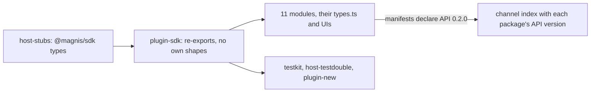

# One entity type: the catalog speaks the SDK shapes at API 0.2.0

Status: SPEC_LOCKED  
Spec lock: sha256:32d5032dfe63763557b770ec6d4b44ec8db9bd82fb2d84b5673f1cd54aa2ec3c owner:Все вот эти комментарии, убираем как можно пользу всех вещей. Упрощаем, убираем все эти кодеки. Это все как бы лишний код, который только раздражает. И запускаем еще один подробный раунд кодекса.  
Implementation lock: unlocked  
Active Delivery: D1  
Unattended decisions: allowed  

<!-- plan:spec:start -->
## The Goal

The catalog half of "one type per thing, no case conversion". The SPEC is the app repository's `docs/plans/entity-one-type.md`; this plan does not restate it. The catalog stops declaring any shape the SDK owns, and every module reads and writes the SDK's camelCase fields with plugin API `0.2.0`.

The currency is deleted declarations and the snake reads behind them:

- **plugin-sdk mirrors.** These are deleted from `packages/plugin-sdk/contract/module.ts`, and their SDK forms are imported type-only through `host-stubs`:
  - `RawEntity`, `LinkSummary`, `EntityDetail{entity,links}`;
  - `WindowRow`, `WindowPage`, `EntityPage`, `SearchEntitiesPage`, `LinkedRow`, `LinkedPage`;
  - the merge types and `GraphBatchResult`;
  - every operation input type.

  `ListParams` and `SearchEntitiesPageParams` stay as plugin-side helpers, in camelCase.
- **Module mirrors.** These are deleted in favour of the SDK forms:
  - `LinkedEntitySummary` in contacts, email, meetings, notes, projects and telegram;
  - `CompanyLinkedEntity` in companies;
  - `SearchResultItem` in contacts and meetings;
  - `MergeField`, `MergePreviewData` and `MergeResult` in `modules/contacts/ui/ContactMergeRenderer.tsx`.

  Their casts through `unknown` go with them.
- **Test and scaffold mirrors.** The entity shapes in `packages/host-testdouble/{mention-search.ts,markdown.tsx,agent.tsx}`, the snake contract that `scripts/plugin-new.ts` generates, and the testkit row builders all use the SDK shapes.
- **Field reads.** About 170 snake field reads in the 11 modules, and 59 snake field copies in `modules/*/types.ts`, become camelCase.
- **The live defect.** The contacts merge preview reads the fields the host sends.

## The target



- **`packages/plugin-sdk/contract/module.ts`** imports every shape it uses from `@magnis/sdk` and declares none of the SDK's.
- **`GraphService`** uses those types, with `find_by_external_id(s)` in place of `find_by_anchor(s)`.
- **Every module manifest** declares `magnis_api_version = "0.2.0"`.
- **`scripts/build-catalog-index.ts`** writes each package's API version into the channel index, so a host installs only its own version.
- **`host-stubs` are regenerated once, last,** from the app branch after its client and frontend Stage. This plan's final Stage depends on that app commit.

### Target tree

```text
MODIFY packages/plugin-sdk/contract/module.ts        SDK types; plugin-side helpers in camelCase
MODIFY packages/plugin-sdk/index.ts                  re-exports
MODIFY packages/plugin-sdk/__tests__/reachedEndpoints.test.ts   SDK link type
MODIFY packages/testkit/module.ts                    fakes and row builders in the SDK shape
MODIFY packages/testkit/__tests__/module.test.ts
MODIFY packages/host-testdouble/{mention-search.ts,markdown.tsx,agent.tsx}   SDK entity shapes
MODIFY scripts/plugin-new.ts, scripts/plugin-new.test.ts   scaffold in the SDK shape, API 0.2.0
MODIFY scripts/build-catalog-index.ts, scripts/build-catalog-index.test.ts   API version in the index
MODIFY modules/*/manifest.toml                       magnis_api_version 0.2.0
MODIFY modules/*/module/**/*.ts, modules/*/types.ts, modules/*/ui/**/*.tsx   SDK fields; module mirrors deleted
MODIFY modules/**/__tests__/**, modules/*/entities.test.ts   fixtures in the SDK shape
MODIFY packages/host-stubs/types/**                  regenerated last from the app branch
MODIFY docs/plugins/module.md, docs/plugins/manifest.md, docs/graph.md   field names, API 0.2.0
```

## Today, measured against that

On catalog base `8f1e371`:

- **plugin-sdk mirrors:** `RawEntity` (`packages/plugin-sdk/contract/module.ts:40-58`) and its siblings (`:124-153`, `:193-249`, `:251-308`) are hand-written. Their comments say they mirror the retired Rust host.
- **No module imports `@magnis/sdk`.**
- **Module mirrors:** six modules declare their own `LinkedEntitySummary`, and `ContactMergeRenderer.tsx:18-33` declares its own merge types and reads `survivor_value`, `property_count` and `links_to_repoint`.
- **Test and scaffold mirrors:** `packages/host-testdouble/{mention-search.ts,markdown.tsx,agent.tsx}` and `scripts/plugin-new.ts` carry snake entity shapes.
- **Every manifest** declares `magnis_api_version = "0.1.0"`, and the channel index carries no API version.

## Invariants

1. **No own shapes.**
   - Step 1: typecheck the catalog.
   - Verify: it passes, and plugin-sdk and the modules declare none of the SDK's shapes; a search for `LinkedEntitySummary`, `RawEntity` or `LinkSummary` declarations outside `host-stubs` finds none.
2. **Fixtures are honest.**
   - Step 1: run the testkit builders.
   - Verify: they produce rows that satisfy the SDK `Entity`/`Link` types, and the old snake builders' output is refused by the type check.
3. **Modules behave as before.**
   - Step 1: run every module suite on SDK-shaped fixtures.
   - Verify: all pass.
4. **The merge preview renders the host's fields.**
   - Step 1: render `ContactMergeRenderer` with an SDK `MergePreview`.
   - Verify: survivor and retired values are shown.
5. **Packages carry their version.**
   - Step 1: build the catalog index.
   - Verify: every package entry carries `0.2.0`.
   - Step 2: scaffold a new plugin.
   - Verify: it declares `0.2.0` and SDK shapes.

## Owner decisions

The owner's approvals of 2026-10-02 are recorded in the app SPEC. Both PRs merge together; the app's E2E channel fixture is rebuilt from this branch.

## The pre-approval screen

### Acceptance stories

1. A module reads `entity.schemaId` and `link.from` with types from `@magnis/sdk`, and declares no entity type of its own.
2. The contacts merge preview shows both values.
3. A new plugin scaffolded today starts on API `0.2.0` with SDK shapes.

### Deliberately not verified

- **Running against an older host:** refused by the API version, by design.
<!-- plan:spec:end -->

<!-- plan:implementation:start -->
## Implementation contract

<!-- plan:delivery:D1:start -->
<!-- plan:delivery-meta:{"active":true,"depends":[],"predictedExternalWaitMinutes":120} -->
### PR Delivery D1 — The catalog speaks the SDK shapes at API 0.2.0

Branch: `feat/entity-one-type`; Depends: none; Gate: backend, frontend.

Stage graph: `D1-S1 -> D1-S2`.

Forecast: 350 active min / 70 credits across 2 Stages; longest dependency path 350 active min; external waits 120 min.

What changed for people. Module authors use one entity and link shape, the SDK's; the contacts merge preview shows its values; a new plugin starts on API 0.2.0.

What changed in the code. host-stubs are regenerated from the app branch after its client Stage; plugin-sdk imports every SDK shape and declares none; testkit, host-testdouble and plugin-new produce SDK shapes; every module, its types.ts and UI read camelCase fields with no module mirror; manifests declare 0.2.0 and the channel index carries each package's API version.

How it was proven. Testkit builder, scaffold and index tests; every module suite on SDK fixtures; the contacts merge renderer on an SDK MergePreview.

Not in this PR. The host side, which lands together in the app PR of the same name.

<!-- plan:stage:D1-S1:start -->
<!-- plan:stage-meta:{"deliveryId":"D1","depends":[],"parallelWith":[],"writes":["packages/host-stubs/types/**","packages/plugin-sdk/contract/module.ts","packages/plugin-sdk/index.ts","packages/plugin-sdk/__tests__/reachedEndpoints.test.ts","packages/testkit/module.ts","packages/testkit/__tests__/module.test.ts","packages/host-testdouble/mention-search.ts","packages/host-testdouble/markdown.tsx","packages/host-testdouble/agent.tsx","scripts/plugin-new.ts","scripts/plugin-new.test.ts","scripts/build-catalog-index.ts","scripts/build-catalog-index.test.ts","modules/*/manifest.toml","docs/plugins/module.md","docs/plugins/manifest.md","docs/graph.md"],"tempRoot":".tmp/code-production/entity-one-type/D1-S1","predictedActiveMinutes":115,"predictedCredits":23,"verifyActiveMinutes":15,"verifyCredits":3} -->
#### Stage D1-S1 — plugin-sdk, testkit, scaffolds and the index use the SDK shapes at API 0.2.0

- Owner: agent-1; Profile: fast; Depends: none; Parallel with: none.
- Writes: `packages/host-stubs/types/**`, `packages/plugin-sdk/contract/module.ts`, `packages/plugin-sdk/index.ts`, `packages/plugin-sdk/__tests__/reachedEndpoints.test.ts`, `packages/testkit/module.ts`, `packages/testkit/__tests__/module.test.ts`, `packages/host-testdouble/mention-search.ts`, `packages/host-testdouble/markdown.tsx`, `packages/host-testdouble/agent.tsx`, `scripts/plugin-new.ts`, `scripts/plugin-new.test.ts`, `scripts/build-catalog-index.ts`, `scripts/build-catalog-index.test.ts`, `modules/*/manifest.toml`, `docs/plugins/module.md`, `docs/plugins/manifest.md`, `docs/graph.md`.
- Temp root: `.tmp/code-production/entity-one-type/D1-S1` (must be absent at handoff).
- Of which verification: 15 active min / 3 credits.

What this Stage solves. plugin-sdk hand-writes the entity, link, page, merge, batch and input shapes; testkit builders, host-testdouble and the plugin-new scaffold produce snake shapes; manifests and the channel index cannot tell API versions apart.

What is built. host-stubs are regenerated from the app branch feat/entity-one-type after its Stage D1-S6, so this Stage starts only then. plugin-sdk imports the SDK shapes and keeps only its camelCase pagination helpers; testkit builders, host-testdouble and plugin-new produce SDK shapes on API 0.2.0; every manifest declares 0.2.0 and build-catalog-index.ts writes each package's API version; the docs follow.

How it is proven. tst_cat_entity_one_type_001 to _003 check the builders, the scaffold and the index.

Commit. feat(plugin-sdk): import the SDK shapes at API 0.2.0 — no hand-written mirror in the SDK, testkit or scaffolds.

##### Tasks

- [ ] ENTC_001 — Regenerate host-stubs, import every SDK shape in plugin-sdk and make the testkit builders produce SDK rows. (50 min)
<!-- plan:task-meta:{"writes":["packages/host-stubs/types/**","packages/plugin-sdk/contract/module.ts","packages/plugin-sdk/index.ts","packages/plugin-sdk/__tests__/reachedEndpoints.test.ts","packages/testkit/module.ts","packages/testkit/__tests__/module.test.ts"],"predictedActiveMinutes":50,"predictedCredits":10,"how":"run the app branch's scripts/gen-host-stubs.sh after its D1-S6 commit; delete plugin-sdk's own entity, link, page, merge, batch and input types in favour of the SDK's, keeping ListParams and SearchEntitiesPageParams in camelCase; use the SDK link type in reachedEndpoints.test.ts; make the testkit row builders return SDK rows; add tst_cat_entity_one_type_001 asserting builder rows carry schemaId and source.externalId and no snake key","red":"bun run agent:test:backend -- packages/testkit/__tests__/module.test.ts -t tst_cat_entity_one_type_001"} -->
- [ ] ENTC_002 — Make host-testdouble and the plugin-new scaffold produce SDK shapes on API 0.2.0. (25 min)
<!-- plan:task-meta:{"writes":["packages/host-testdouble/mention-search.ts","packages/host-testdouble/markdown.tsx","packages/host-testdouble/agent.tsx","scripts/plugin-new.ts","scripts/plugin-new.test.ts"],"predictedActiveMinutes":25,"predictedCredits":5,"how":"replace the snake entity shapes in the three host-testdouble files with SDK types; make plugin-new.ts scaffold SDK shapes and magnis_api_version 0.2.0; add tst_cat_entity_one_type_002 to plugin-new.test.ts","red":"bun run agent:test:backend -- scripts/plugin-new.test.ts -t tst_cat_entity_one_type_002"} -->
- [ ] ENTC_003 — Declare API 0.2.0 in every manifest and write each package's API version into the channel index. (25 min)
<!-- plan:task-meta:{"writes":["modules/*/manifest.toml","scripts/build-catalog-index.ts","scripts/build-catalog-index.test.ts","docs/plugins/module.md","docs/plugins/manifest.md","docs/graph.md"],"predictedActiveMinutes":25,"predictedCredits":5,"how":"set magnis_api_version 0.2.0 in modules/*/manifest.toml; write it per package in build-catalog-index.ts; add tst_cat_entity_one_type_003 to build-catalog-index.test.ts; rename fields and the version in the docs","red":"bun run agent:test:backend -- scripts/build-catalog-index.test.ts -t tst_cat_entity_one_type_003"} -->

##### Acceptance criteria

- [ ] `bun run agent:test:backend -- packages/testkit/__tests__/module.test.ts scripts/plugin-new.test.ts scripts/build-catalog-index.test.ts` exits 0 — builders, scaffold and index use SDK shapes at 0.2.0
- [ ] `packages/plugin-sdk/contract/module.ts` declares none of the SDK's shapes
- [ ] Commit

##### Results

<!-- plan:results:D1-S1:start -->
| Task | Commit | UTC start-end | Active / elapsed | Usage | Result / proof |
|---|---|---|---:|---|---|
<!-- plan:results:D1-S1:end -->
<!-- plan:stage:D1-S1:end -->

<!-- plan:stage:D1-S2:start -->
<!-- plan:stage-meta:{"deliveryId":"D1","depends":["D1-S1"],"parallelWith":[],"writes":["modules/**"],"tempRoot":".tmp/code-production/entity-one-type/D1-S2","predictedActiveMinutes":235,"predictedCredits":47,"verifyActiveMinutes":25,"verifyCredits":5} -->
#### Stage D1-S2 — Every module reads and writes the SDK fields, with no module mirror

- Owner: agent-1; Profile: fast; Depends: D1-S1; Parallel with: none.
- Writes: `modules/**`.
- Temp root: `.tmp/code-production/entity-one-type/D1-S2` (must be absent at handoff).
- Of which verification: 25 active min / 5 credits.

What this Stage solves. Eleven modules read about 170 snake fields, copy schema_id, created_at and is_pinned into their DTOs 59 times, and declare their own LinkedEntitySummary, CompanyLinkedEntity, SearchResultItem and merge types; the contacts merge renderer reads keys the host never sends.

What is built. The compiler names every site after D1-S1; every module, its types.ts and UI read and write SDK camelCase fields and externalId; the module mirrors and their casts through unknown are deleted; fixtures take the SDK shape.

How it is proven. One RED per module group; then the whole catalog gate.

Commit. refactor(modules): read and write the SDK fields — no module mirror, merge preview fixed.

##### Tasks

- [ ] ENTC_004 — Move contacts and companies onto SDK fields, deleting their mirrors and fixing the merge renderer. (60 min)
<!-- plan:task-meta:{"writes":["modules/contacts/**","modules/companies/**"],"predictedActiveMinutes":60,"predictedCredits":12,"how":"fix every site the compiler names in modules/contacts and modules/companies; delete their LinkedEntitySummary, CompanyLinkedEntity and SearchResultItem in favour of SDK types; delete ContactMergeRenderer's MergeField, MergePreviewData and MergeResult and its casts through unknown; add tst_cat_entity_one_type_004 to modules/contacts/ui/__tests__/ContactMergeResolution.test.tsx rendering an SDK MergePreview","red":"bun run agent:test:frontend -- modules/contacts/ui/__tests__/ContactMergeResolution.test.tsx -t tst_cat_entity_one_type_004"} -->
- [ ] ENTC_005 — Move telegram onto SDK entity and link fields, deleting its LinkedEntitySummary. (45 min)
<!-- plan:task-meta:{"writes":["modules/telegram/**"],"predictedActiveMinutes":45,"predictedCredits":9,"how":"fix every site the compiler names in modules/telegram, links read from and to; delete its LinkedEntitySummary; add tst_cat_entity_one_type_005 to modules/telegram/module/__tests__/telegramRead.test.ts with SDK rows","red":"bun run agent:test:backend -- modules/telegram/module/__tests__/telegramRead.test.ts -t tst_cat_entity_one_type_005"} -->
- [ ] ENTC_006 — Move email and meetings onto SDK fields, deleting their mirrors. (40 min)
<!-- plan:task-meta:{"writes":["modules/email/**","modules/meetings/**"],"predictedActiveMinutes":40,"predictedCredits":8,"how":"fix every site the compiler names in modules/email and modules/meetings; delete their LinkedEntitySummary and meetings SearchResultItem; add tst_cat_entity_one_type_006 to modules/meetings/module/__tests__/meetingsRead.test.ts with SDK rows","red":"bun run agent:test:backend -- modules/meetings/module/__tests__/meetingsRead.test.ts -t tst_cat_entity_one_type_006"} -->
- [ ] ENTC_007 — Move triggers, notes and projects onto SDK fields, deleting their mirrors. (40 min)
<!-- plan:task-meta:{"writes":["modules/triggers/**","modules/notes/**","modules/projects/**"],"predictedActiveMinutes":40,"predictedCredits":8,"how":"fix every site the compiler names in modules/triggers, modules/notes and modules/projects; delete their LinkedEntitySummary; add tst_cat_entity_one_type_007 to modules/notes/module/__tests__/notesRead.test.ts with SDK rows","red":"bun run agent:test:backend -- modules/notes/module/__tests__/notesRead.test.ts -t tst_cat_entity_one_type_007"} -->
- [ ] ENTC_008 — Move file, linkedin and x onto SDK fields. (25 min)
<!-- plan:task-meta:{"writes":["modules/file/**","modules/linkedin/**","modules/x/**"],"predictedActiveMinutes":25,"predictedCredits":5,"how":"fix every site the compiler names in modules/file, modules/linkedin and modules/x; add tst_cat_entity_one_type_008 to modules/file/module/__tests__/fileModule.test.ts with SDK rows","red":"bun run agent:test:backend -- modules/file/module/__tests__/fileModule.test.ts -t tst_cat_entity_one_type_008"} -->

##### Acceptance criteria

- [ ] `bun run agent:verify:pr` exits 0 — the whole catalog gate passes on SDK shapes
- [ ] No module declares LinkedEntitySummary, CompanyLinkedEntity, SearchResultItem or merge types of its own
- [ ] Commit

##### Results

<!-- plan:results:D1-S2:start -->
| Task | Commit | UTC start-end | Active / elapsed | Usage | Result / proof |
|---|---|---|---:|---|---|
<!-- plan:results:D1-S2:end -->
<!-- plan:stage:D1-S2:end -->
<!-- plan:delivery:D1:end -->
<!-- plan:implementation:end -->

<!-- plan:execution:start -->
## Execution log

- lock-spec sha256:32d5032dfe63763557b770ec6d4b44ec8db9bd82fb2d84b5673f1cd54aa2ec3c owner:Все вот эти комментарии, убираем как можно пользу всех вещей. Упрощаем, убираем все эти кодеки. Это все как бы лишний код, который только раздражает. И запускаем еще один подробный раунд кодекса.

- put-delivery D1

- put-stage D1-S1

- put-stage D1-S2
<!-- plan:execution:end -->
