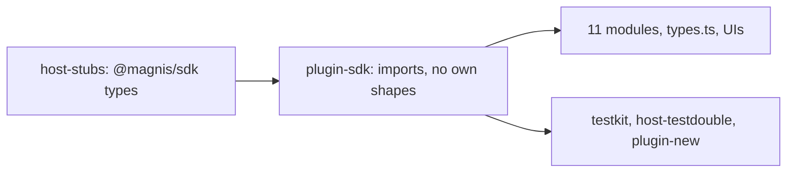

# One definition per shape: the catalog uses the SDK shapes at API 0.2.0

Status: SPEC_LOCKED  
Spec lock: sha256:0f44127a426161ca43942f42c426265c2383e80a8410e1b3f71a283f528b064b owner:Check how we can optimise stages for more parallel jobs and does the plan cover all changes needed  
Implementation lock: unlocked  
Active Delivery: D1  
Unattended decisions: allowed  

<!-- plan:spec:start -->
## The Goal

The catalog half of "one definition per shape, no case conversion". The SPEC is the app repository's `docs/plans/entity-one-type.md`; this plan does not restate it. The catalog declares none of the shapes the SDK owns. Every module, helper, scaffold and test double uses them in camelCase on plugin API `0.2.0`.

The currency is deleted declarations and the snake reads behind them:

- **plugin-sdk.** These hand-written types are deleted from `packages/plugin-sdk/contract/module.ts`, and their SDK forms are imported type-only through `host-stubs`:
  - `RawEntity`, `LinkSummary`, `EntityDetail{entity,links}`;
  - `WindowRow`, `WindowPage`, `EntityPage`, `SearchEntitiesPage`, `LinkedRow`, `LinkedPage`;
  - the merge types, `GraphBatchResult` and every operation input;
  - `PluginContext` and the tool definition fields.

  `ListParams` and `SearchEntitiesPageParams` stay as plugin-side helpers in camelCase. The linked-summary assembly in `packages/plugin-sdk/index.ts` returns the SDK `LinkedEntitySummary`, statement fields included, instead of an endpoint-to-kind map that modules rebuild without them.
- **Module mirrors.** These are deleted:
  - `LinkedEntitySummary` in contacts, email, meetings, notes, projects and telegram;
  - `CompanyLinkedEntity`;
  - `SearchResultItem` in contacts and meetings;
  - `PaginatedResponse` in `modules/telegram/types.ts`;
  - `MergePreviewParams` and `MergeParams` in `modules/contacts/types.ts`;
  - the merge types in `ContactMergeRenderer.tsx`, together with its casts through `unknown`.
- **Test doubles and scaffolds:**
  - the testkit row builders and fakes;
  - `packages/host-testdouble/{mention-search.ts,markdown.tsx,agent.tsx}`;
  - the contract that `scripts/plugin-new.ts` generates.
- **Field reads.** About 170 snake reads in 11 modules, and 59 snake copies in `modules/*/types.ts`, become camelCase.
- **The live defect.** The contacts merge preview reads what the host sends.

## The target



The catalog moves in two commits:

1. **The migration.** Removing a plugin-sdk type and migrating its users cannot be separated without an alias, so everything moves together. The module Tasks inside it write disjoint module directories, each owning its own manifests, and run in parallel once the shared plugin-sdk, testkit and stub changes are in. Contacts and companies move with email, because `modules/contacts/module/service.ts:46` imports email's `addressBatchEntity`. It starts after app D1-S1, whose commit declares every SDK shape the stubs carry; catalog tests run on testkit and host-testdouble, not on the host, so they do not wait for the host's slices.
2. **The final refresh.** After the app's last code Stage, D1-S17, `host-stubs` are regenerated from the final app contract, together with `packages/host-stubs/theme.css` and `scripts/plugin-host-imports.json`, which the same generator writes. Every catalog site the compiler then names moves to the final shapes; these are mostly module UIs reading host-shim types (`ListItem`, linked summaries, cards) that change in the app's graph-read slice. Then the catalog gate runs.

`scripts/module-bundle.test.ts` moves in the first commit, because it builds a snake `PluginContext` (`:46`) and checks `requires_approval` (`:56`, `:62`).

### Target tree

```text
MODIFY packages/host-stubs/{types/**,theme.css}      regenerated from the app branch
MODIFY scripts/plugin-host-imports.json              regenerated with the stubs
MODIFY packages/plugin-sdk/contract/module.ts        SDK types; camelCase helpers; context and tool metadata from the SDK
MODIFY packages/plugin-sdk/index.ts                  tool definition fields, context and linked-summary assembly per the SDK
MODIFY packages/plugin-sdk/__tests__/*.test.ts       SDK link and context types
MODIFY packages/testkit/module.ts, packages/testkit/__tests__/module.test.ts
MODIFY packages/host-testdouble/{mention-search.ts,markdown.tsx,agent.tsx}
MODIFY scripts/plugin-new.ts, scripts/plugin-new.test.ts   SDK shapes, API 0.2.0
MODIFY scripts/module-bundle.test.ts                 camelCase PluginContext, requiresApproval
MODIFY modules/*/manifest.toml                       magnis_api_version 0.2.0
MODIFY modules/**                                    SDK fields; module mirrors deleted; fixtures in the SDK shape
MODIFY docs/plugins/*.md, docs/graph.md              field names, API 0.2.0
```

## Today, measured against that

On catalog base `8f1e371`:

- **plugin-sdk:** `RawEntity` and its siblings are hand-written (`packages/plugin-sdk/contract/module.ts:40-58`, `:124-153`, `:193-308`). So are `PluginContext` (`:458`) and the tool metadata (`:509`, `:541`); `index.ts:412,434,437` produces snake `allowlist_gate` and `requires_approval`.
- **Linked summaries:** `index.ts:62` returns only an endpoint-to-kind map, and `modules/contacts/module/service.ts:231` rebuilds summaries without `origin`, `confidence` or `validUntil`.
- **No module imports `@magnis/sdk`.**
- **Module mirrors:**
  - `LinkedEntitySummary` in six modules;
  - `modules/telegram/types.ts:133`;
  - `modules/contacts/types.ts:128,132`;
  - `ContactMergeRenderer.tsx:18-33`.
- **Every manifest declares `0.1.0`.**

## Invariants

1. **No own shapes.**
   - Step 1: typecheck the catalog.
   - Verify: it passes, and no declaration of an SDK shape remains outside `host-stubs`.
2. **Doubles are honest.**
   - Step 1: run the testkit builders and the plugin-new scaffold.
   - Verify: they produce SDK-shaped rows and a `0.2.0` manifest.
3. **Linked summaries carry their statement.**
   - Step 1: a module lists linked entities with an agent link.
   - Verify: the summary carries `origin`, `confidence` and `validUntil`.
4. **Behaviour is unchanged.**
   - Step 1: run every module suite on SDK fixtures.
   - Verify: all pass.
5. **The merge preview renders the host's fields.**
   - Step 1: render `ContactMergeRenderer` with an SDK `MergePreview`.
   - Verify: survivor and retired values are shown.

## Owner decisions

The owner's approvals of 2026-10-02 are recorded in the app SPEC. Both PRs merge together. The app's E2E channel fixture is rebuilt from this branch.

## The pre-approval screen

### Acceptance stories

1. A module reads `entity.schemaId` and `link.from` with types from `@magnis/sdk`.
2. The contacts merge preview shows both values.
3. A scaffolded plugin starts on `0.2.0` with SDK shapes.

### Deliberately not verified

- **Running against an older host:** unsupported. An old host accepts `0.2.0` and breaks on it, which the owner accepted for development.
<!-- plan:spec:end -->

<!-- plan:implementation:start -->
## Implementation contract

<!-- plan:delivery:D1:start -->
<!-- plan:delivery-meta:{"active":true,"depends":[],"predictedExternalWaitMinutes":120} -->
### PR Delivery D1 — The catalog uses the SDK shapes at API 0.2.0

Branch: `feat/entity-one-type`; Depends: none; Gate: backend, frontend.

Stage graph: `app D1-S1 -> D1-S1; app D1-S17 and D1-S1 -> D1-S2 -> app D1-S18`.

Forecast: 410 active min / 82 credits across 2 Stages; longest dependency path 410 active min; external waits 120 min.

What changed for people. Module authors use one entity, link, context and tool shape, the SDK's; linked summaries carry their statement; the contacts merge preview shows its values; a new plugin starts on API 0.2.0.

What changed in the code. The migration Stage starts right after the app's foundation, whose commit declares every SDK shape the catalog imports: plugin-sdk declares none of them; testkit, host-testdouble, plugin-new and the module bundle test produce them; four module Tasks with disjoint directories, each setting its own manifests to 0.2.0, run in parallel. The final Stage regenerates host-stubs from the app's last code Stage and fixes every catalog site the compiler then names, including module UIs that read host-shim types; the app's E2E fixture is rebuilt from that commit.

How it was proven. plugin-sdk, scaffold, bundle and module tests in single runners; the contacts merge renderer on an SDK MergePreview; the catalog PR gate on the final stubs.

Not in this PR. The host side, which lands together in the app PR of the same name.

<!-- plan:stage:D1-S1:start -->
<!-- plan:stage-meta:{"deliveryId":"D1","depends":[],"parallelWith":[],"writes":["packages/host-stubs/types/**","packages/host-stubs/theme.css","scripts/plugin-host-imports.json","packages/plugin-sdk/**","packages/testkit/**","packages/host-testdouble/**","scripts/plugin-new.ts","scripts/plugin-new.test.ts","scripts/module-bundle.test.ts","modules/**","docs/plugins/*.md","docs/graph.md"],"tempRoot":".tmp/code-production/entity-one-type/D1-S1","predictedActiveMinutes":345,"predictedCredits":69,"verifyActiveMinutes":30,"verifyCredits":6} -->
#### Stage D1-S1 — The whole catalog uses the SDK shapes at API 0.2.0

- Owner: agent-1; Profile: fast; Depends: none; Parallel with: none.
- Writes: `packages/host-stubs/types/**`, `packages/host-stubs/theme.css`, `scripts/plugin-host-imports.json`, `packages/plugin-sdk/**`, `packages/testkit/**`, `packages/host-testdouble/**`, `scripts/plugin-new.ts`, `scripts/plugin-new.test.ts`, `scripts/module-bundle.test.ts`, `modules/**`, `docs/plugins/*.md`, `docs/graph.md`.
- Temp root: `.tmp/code-production/entity-one-type/D1-S1` (must be absent at handoff).
- Of which verification: 30 active min / 6 credits.

What this Stage solves. plugin-sdk hand-writes every shape the SDK owns, including the plugin context and tool metadata; linked summaries lose their statement fields; modules, testkit, host-testdouble, the plugin-new scaffold and scripts/module-bundle.test.ts carry snake shapes; manifests declare 0.1.0.

What is built. One commit, because deleting a plugin-sdk type and migrating its users cannot be separated without an alias. It starts after the app's Stage D1-S1, whose commit declares every SDK shape the stubs carry, and runs beside the app's slices. The first two Tasks change the shared packages and scripts; then the four module Tasks write disjoint module directories, each setting its own manifests to 0.2.0, and run in parallel. Contacts and companies move with email, whose addressBatchEntity they import. Module UIs keep the host-shim types they receive until the final Stage.

How it is proven. One RED per area, each in a single runner.

Commit. refactor(catalog): use the SDK shapes at API 0.2.0 — no mirror in plugin-sdk, testkit, scaffolds or modules.

##### Tasks

- [ ] ENTC_001 — Regenerate host-stubs and make plugin-sdk import every SDK shape, context and tool metadata, assembling SDK linked summaries. (60 min)
<!-- plan:task-meta:{"writes":["packages/host-stubs/types/**","packages/host-stubs/theme.css","scripts/plugin-host-imports.json","packages/plugin-sdk/**"],"predictedActiveMinutes":60,"predictedCredits":12,"how":"run the app branch's scripts/gen-host-stubs.sh at its D1-S1 commit; delete plugin-sdk's own shapes in favour of the SDK's, keeping ListParams and SearchEntitiesPageParams in camelCase; produce allowlistGate and requiresApproval in index.ts; return SDK LinkedEntitySummary with statement fields from the linked assembly; add tst_cat_entity_one_type_001 to packages/plugin-sdk/__tests__/reachedEndpoints.test.ts","red":"bun run agent:test:backend -- packages/plugin-sdk/__tests__/reachedEndpoints.test.ts -t tst_cat_entity_one_type_001"} -->
- [ ] ENTC_002 — Make testkit, host-testdouble, the plugin-new scaffold and the module bundle test produce SDK shapes on API 0.2.0, with the docs. (40 min)
<!-- plan:task-meta:{"writes":["packages/testkit/**","packages/host-testdouble/**","scripts/plugin-new.ts","scripts/plugin-new.test.ts","scripts/module-bundle.test.ts","docs/plugins/*.md","docs/graph.md"],"predictedActiveMinutes":40,"predictedCredits":8,"how":"make testkit fakes and row builders return SDK rows; replace the snake shapes in host-testdouble mention-search.ts, markdown.tsx and agent.tsx; scaffold SDK shapes and magnis_api_version 0.2.0 in plugin-new.ts; build a camelCase PluginContext and check requiresApproval in module-bundle.test.ts; rename fields and the version in the docs; add tst_cat_entity_one_type_002 to scripts/plugin-new.test.ts","red":"bun run agent:test:backend -- scripts/plugin-new.test.ts -t tst_cat_entity_one_type_002"} -->
- [ ] ENTC_003 — Move contacts, companies and email onto SDK fields and 0.2.0, deleting their mirrors and fixing the merge renderer. (80 min)
<!-- plan:task-meta:{"writes":["modules/contacts/**","modules/companies/**","modules/email/**"],"predictedActiveMinutes":80,"predictedCredits":16,"how":"fix every site the compiler names, email's addressBatchEntity first; delete LinkedEntitySummary, CompanyLinkedEntity, SearchResultItem, MergePreviewParams, MergeParams and ContactMergeRenderer's merge types and casts; set magnis_api_version 0.2.0 in the three manifests; add tst_cat_entity_one_type_003 to modules/contacts/ui/__tests__/ContactMergeResolution.test.tsx","red":"bun run agent:test:frontend -- modules/contacts/ui/__tests__/ContactMergeResolution.test.tsx -t tst_cat_entity_one_type_003"} -->
- [ ] ENTC_004 — Move telegram onto SDK fields and 0.2.0, deleting its LinkedEntitySummary and PaginatedResponse. (45 min)
<!-- plan:task-meta:{"writes":["modules/telegram/**"],"predictedActiveMinutes":45,"predictedCredits":9,"how":"fix every site the compiler names, links read from and to; delete LinkedEntitySummary and PaginatedResponse in modules/telegram/types.ts; set magnis_api_version 0.2.0 in its manifest; add tst_cat_entity_one_type_004 to modules/telegram/module/__tests__/telegramRead.test.ts","red":"bun run agent:test:backend -- modules/telegram/module/__tests__/telegramRead.test.ts -t tst_cat_entity_one_type_004"} -->
- [ ] ENTC_005 — Move meetings, triggers, notes and projects onto SDK fields and 0.2.0, deleting their mirrors. (60 min)
<!-- plan:task-meta:{"writes":["modules/meetings/**","modules/triggers/**","modules/notes/**","modules/projects/**"],"predictedActiveMinutes":60,"predictedCredits":12,"how":"fix every site the compiler names; delete their LinkedEntitySummary and meetings SearchResultItem; set magnis_api_version 0.2.0 in their manifests; add tst_cat_entity_one_type_005 to modules/notes/module/__tests__/notesRead.test.ts with an agent link carrying confidence","red":"bun run agent:test:backend -- modules/notes/module/__tests__/notesRead.test.ts -t tst_cat_entity_one_type_005"} -->
- [ ] ENTC_006 — Move file, linkedin and x onto SDK fields and 0.2.0. (30 min)
<!-- plan:task-meta:{"writes":["modules/file/**","modules/linkedin/**","modules/x/**"],"predictedActiveMinutes":30,"predictedCredits":6,"how":"fix every site the compiler names in modules/file, modules/linkedin and modules/x; set magnis_api_version 0.2.0 in their manifests; add tst_cat_entity_one_type_006 to modules/file/module/__tests__/fileModule.test.ts","red":"bun run agent:test:backend -- modules/file/module/__tests__/fileModule.test.ts -t tst_cat_entity_one_type_006"} -->

##### Acceptance criteria

- [ ] `bun run agent:test:backend -- scripts/plugin-new.test.ts` exits 0 — the scaffold starts on SDK shapes at 0.2.0
- [ ] `bun run agent:test:backend -- scripts/module-bundle.test.ts` exits 0 — bundles run with a camelCase context
- [ ] `bun run agent:test:frontend -- modules/contacts/ui/__tests__/ContactMergeResolution.test.tsx` exits 0 — the merge preview shows both values
- [ ] Commit

##### Results

<!-- plan:results:D1-S1:start -->
| Task | Commit | UTC start-end | Active / elapsed | Usage | Result / proof |
|---|---|---|---:|---|---|
<!-- plan:results:D1-S1:end -->
<!-- plan:stage:D1-S1:end -->

<!-- plan:stage:D1-S2:start -->
<!-- plan:stage-meta:{"deliveryId":"D1","depends":["D1-S1"],"parallelWith":[],"writes":["packages/host-stubs/types/**","packages/host-stubs/theme.css","scripts/plugin-host-imports.json","packages/plugin-sdk/**","packages/testkit/**","packages/host-testdouble/**","modules/**"],"tempRoot":".tmp/code-production/entity-one-type/D1-S2","predictedActiveMinutes":65,"predictedCredits":13,"verifyActiveMinutes":20,"verifyCredits":4} -->
#### Stage D1-S2 — host-stubs match the app's final contract and every catalog site the compiler names follows

- Owner: agent-1; Profile: fast; Depends: D1-S1; Parallel with: none.
- Writes: `packages/host-stubs/types/**`, `packages/host-stubs/theme.css`, `scripts/plugin-host-imports.json`, `packages/plugin-sdk/**`, `packages/testkit/**`, `packages/host-testdouble/**`, `modules/**`.
- Temp root: `.tmp/code-production/entity-one-type/D1-S2` (must be absent at handoff).
- Of which verification: 20 active min / 4 credits.

What this Stage solves. The migration compiled against host-stubs from the app's foundation; the app's slices then change the host-shim types module UIs read (ListItem, linked summaries, card shapes) and delete the codec machinery, so the stubs are stale and some module code still reads the old shim fields.

What is built. After the app's Stage D1-S17 is committed, host-stubs and their generated companions are regenerated from that commit, and every catalog site the compiler names is moved to the final shapes. The app's E2E fixture is rebuilt from this commit's SHA.

How it is proven. tst_cat_entity_one_type_007 fails on stubs that still declare RpcWireCodec and passes on the regenerated ones; the catalog PR gate passes.

Commit. chore(host-stubs): regenerate from the app's final contract — module readers follow.

##### Tasks

- [ ] ENTC_007 — Regenerate host-stubs from the app's last code Stage and move every catalog site the compiler names to the final shapes. (45 min)
<!-- plan:task-meta:{"writes":["packages/host-stubs/types/**","packages/host-stubs/theme.css","scripts/plugin-host-imports.json","packages/plugin-sdk/**","packages/testkit/**","packages/host-testdouble/**","modules/**"],"predictedActiveMinutes":45,"predictedCredits":9,"how":"run the app branch's scripts/gen-host-stubs.sh at its D1-S17 commit, which also writes theme.css and plugin-host-imports.json; fix every site the compiler then names, module UIs reading host-shim types included; add tst_cat_entity_one_type_007 to packages/plugin-sdk/__tests__/reachedEndpoints.test.ts asserting the stubs declare no RpcWireCodec","red":"bun run agent:test:backend -- packages/plugin-sdk/__tests__/reachedEndpoints.test.ts -t tst_cat_entity_one_type_007"} -->

##### Acceptance criteria

- [ ] `bun run agent:verify:pr` exits 0 — the whole catalog gate passes on the final stubs with no own SDK shape
- [ ] Commit

##### Results

<!-- plan:results:D1-S2:start -->
| Task | Commit | UTC start-end | Active / elapsed | Usage | Result / proof |
|---|---|---|---:|---|---|
<!-- plan:results:D1-S2:end -->
<!-- plan:stage:D1-S2:end -->
<!-- plan:delivery:D1:end -->
<!-- plan:implementation:end -->

<!-- plan:execution:start -->
## Execution log

- lock-spec sha256:0f44127a426161ca43942f42c426265c2383e80a8410e1b3f71a283f528b064b owner:Check how we can optimise stages for more parallel jobs and does the plan cover all changes needed

- put-delivery D1

- put-stage D1-S1

- put-stage D1-S2
<!-- plan:execution:end -->
