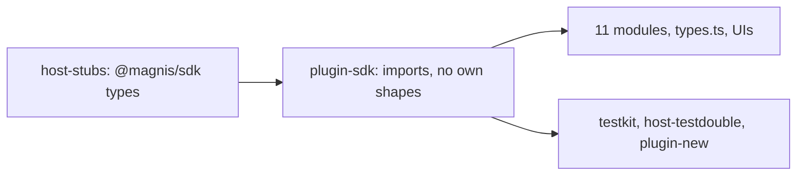

# One definition per shape: the catalog uses the SDK shapes at API 0.2.0

Status: SPEC_DRAFT  
Spec lock: unlocked  
Implementation lock: unlocked  
Active Delivery: none  
Unattended decisions: allowed  

<!-- plan:spec:start -->
## The Goal

The catalog half of "one definition per shape, no case conversion". The SPEC is the app repository's `docs/plans/entity-one-type.md`; this plan does not restate it. The catalog declares none of the shapes the SDK owns. Every module, helper, scaffold and test double uses them in camelCase on plugin API `0.2.0`.

The currency is deleted declarations and the snake reads behind them:

- **plugin-sdk.** These hand-written types are deleted from `packages/plugin-sdk/contract/module.ts`, and their SDK forms are imported type-only through `host-stubs`:
  - `RawEntity`, `LinkSummary`, `EntityDetail{entity,links}`;
  - `WindowRow`, `WindowPage`, `EntityPage`, `SearchEntitiesPage`, `LinkedRow`, `LinkedPage`;
  - the merge types, `GraphBatchResult` and every operation input;
  - `PluginContext` and the tool definition fields.

  `ListParams` and `SearchEntitiesPageParams` stay as plugin-side helpers in camelCase. The linked-summary assembly in `packages/plugin-sdk/index.ts` returns the SDK `LinkedEntitySummary`, statement fields included, instead of an endpoint-to-kind map that modules rebuild without them.
- **Module mirrors.** These are deleted:
  - `LinkedEntitySummary` in contacts, email, meetings, notes, projects and telegram;
  - `CompanyLinkedEntity`;
  - `SearchResultItem` in contacts and meetings;
  - `PaginatedResponse` in `modules/telegram/types.ts`;
  - `MergePreviewParams` and `MergeParams` in `modules/contacts/types.ts`;
  - the merge types in `ContactMergeRenderer.tsx`, together with its casts through `unknown`.
- **Test doubles and scaffolds:**
  - the testkit row builders and fakes;
  - `packages/host-testdouble/{mention-search.ts,markdown.tsx,agent.tsx}`;
  - the contract that `scripts/plugin-new.ts` generates.
- **Field reads.** About 170 snake reads in 11 modules, and 59 snake copies in `modules/*/types.ts`, become camelCase.
- **The live defect.** The contacts merge preview reads what the host sends.

## The target



The whole catalog moves in one commit. Removing a type from plugin-sdk and migrating its users cannot be separated without leaving the catalog unbuildable, and no alias may bridge the two. `host-stubs` are regenerated first, from the app branch after its Stage D1-S3, which carries the plugin contract and the client types the stubs need. The catalog commit then runs in parallel with the app's later Stages.

### Target tree

```text
MODIFY packages/host-stubs/types/**                  regenerated from the app branch
MODIFY packages/plugin-sdk/contract/module.ts        SDK types; camelCase helpers; context and tool metadata from the SDK
MODIFY packages/plugin-sdk/index.ts                  tool definition fields, context and linked-summary assembly per the SDK
MODIFY packages/plugin-sdk/__tests__/*.test.ts       SDK link and context types
MODIFY packages/testkit/module.ts, packages/testkit/__tests__/module.test.ts
MODIFY packages/host-testdouble/{mention-search.ts,markdown.tsx,agent.tsx}
MODIFY scripts/plugin-new.ts, scripts/plugin-new.test.ts   SDK shapes, API 0.2.0
MODIFY modules/*/manifest.toml                       magnis_api_version 0.2.0
MODIFY modules/**                                    SDK fields; module mirrors deleted; fixtures in the SDK shape
MODIFY docs/plugins/*.md, docs/graph.md              field names, API 0.2.0
```

## Today, measured against that

On catalog base `8f1e371`:

- **plugin-sdk:** `RawEntity` and its siblings are hand-written (`packages/plugin-sdk/contract/module.ts:40-58`, `:124-153`, `:193-308`). So are `PluginContext` (`:458`) and the tool metadata (`:509`, `:541`); `index.ts:412,434,437` produces snake `allowlist_gate` and `requires_approval`.
- **Linked summaries:** `index.ts:62` returns only an endpoint-to-kind map, and `modules/contacts/module/service.ts:231` rebuilds summaries without `origin`, `confidence` or `validUntil`.
- **No module imports `@magnis/sdk`.**
- **Module mirrors:**
  - `LinkedEntitySummary` in six modules;
  - `modules/telegram/types.ts:133`;
  - `modules/contacts/types.ts:128,132`;
  - `ContactMergeRenderer.tsx:18-33`.
- **Every manifest declares `0.1.0`.**

## Invariants

1. **No own shapes.**
   - Step 1: typecheck the catalog.
   - Verify: it passes, and no declaration of an SDK shape remains outside `host-stubs`.
2. **Doubles are honest.**
   - Step 1: run the testkit builders and the plugin-new scaffold.
   - Verify: they produce SDK-shaped rows and a `0.2.0` manifest.
3. **Linked summaries carry their statement.**
   - Step 1: a module lists linked entities with an agent link.
   - Verify: the summary carries `origin`, `confidence` and `validUntil`.
4. **Behaviour is unchanged.**
   - Step 1: run every module suite on SDK fixtures.
   - Verify: all pass.
5. **The merge preview renders the host's fields.**
   - Step 1: render `ContactMergeRenderer` with an SDK `MergePreview`.
   - Verify: survivor and retired values are shown.

## Owner decisions

The owner's approvals of 2026-10-02 are recorded in the app SPEC. Both PRs merge together. The app's E2E channel fixture is rebuilt from this branch.

## The pre-approval screen

### Acceptance stories

1. A module reads `entity.schemaId` and `link.from` with types from `@magnis/sdk`.
2. The contacts merge preview shows both values.
3. A scaffolded plugin starts on `0.2.0` with SDK shapes.

### Deliberately not verified

- **Running against an older host:** unsupported. An old host accepts `0.2.0` and breaks on it, which the owner accepted for development.
<!-- plan:spec:end -->

<!-- plan:implementation:start -->
## Implementation contract
<!-- plan:implementation:end -->

<!-- plan:execution:start -->
## Execution log
<!-- plan:execution:end -->
