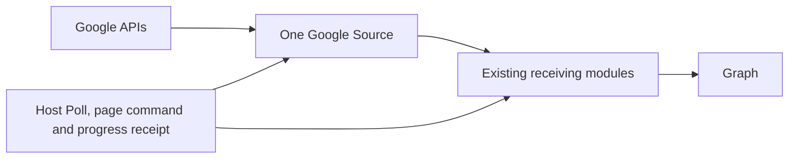

# Google Pull Sync

Status: APPROVED  
Spec lock: sha256:1197ce227cb093757dc6be758825862f5875ea8673c8bf701ae461c27df73085 owner:Тогда дополни, соответственно, стадии и приступай к исполнению  
Implementation lock: sha256:50714f0ff6d398839cf41ed82516b78e9f1bf4f2505224dc791c565a65b4dcc6 owner:approved  
Active Delivery: D1  
Unattended decisions: allowed  

<!-- plan:spec:start -->
## The Goal

Keep the Google Source on its existing 30-second Pull schedule and make that Pull correct, incremental and measurable across Gmail, Google Calendar and Google Contacts. Complete the one host-owned Source-to-module path so full passes, incremental pages and reconciliation have honest progress; do not add provider-specific fields to each event. In the same catalog work, place Modules and Sources directly at the repository root without changing their behavior. Push, Pub/Sub, IMAP IDLE, a new Source protocol and the next integration are excluded.

The currency is provider requests, repeated data and measured wall time:

- A first connection downloads email, meetings and contacts through the existing Source and module pipeline, with independent progress for each surface.
- Gmail keeps its existing `historyId` catch-up. Calendar and Contacts finish their first complete read with the provider's `syncToken`; later polls retrieve only changes. An unchanged poll must not enumerate the full calendar or contact list again. After token expiry, a completed full pass removes owned replicas that the provider no longer lists.
- The connector refreshes an OAuth access token once per credential and token lifetime, not once per sync page. Concurrent calls share the same in-flight refresh.
- A Google quota response with an exact `Retry-After` becomes the existing typed rate-limit result. After one hydration worker observes it, no worker starts another request in that page; requests already sent cannot be recalled. The host remains the only owner of the durable hold and retry time.
- Progress is honest: Gmail states mailbox total and Spam/Trash skipped; Calendar states its exact event total when the full pass finishes because Google provides no pre-count; Contacts states total items and identity-less skipped. Incremental module receipts apply each admitted addition or deletion once; updates and replays do not inflate the totals.
- One existing manual performance stand runs a selected clean app worktree with real Telegram and Google accounts, preserves credentials across data resets, and reports provider fetch time, module/Graph admission time and throughput by Source and surface. No live-provider or PostgreSQL run enters CI.
- The live acceptance receipt records exact app/catalog SHAs, page settings, per-surface counts, holds and before/after timings. It makes no speedup claim unless two equivalent runs on the same accounts were measured.
- The host forwards the command already used to fetch a worker page once in the current module call. This adds one host-to-module field, not a Source payload or a new page type. A completed replacement pass counts actual Graph removals in the same progress path as an admitted page; interrupted passes remove nothing. No Google envelope carries a `full_snapshot` flag.
- All 11 existing Modules and 13 existing Sources move from `plugins/modules/` and `plugins/sources/` to root `modules/` and `sources/`. Published package IDs, index schema, module behavior and the app's package installation stay the same; `plugins/onboarding.toml` remains where it is.

## The target

The architectural decision is one host-owned sync path for every Source: the host supplies page context and accounts Graph changes, while provider cursors remain opaque and existing modules remain the only writers to Graph. Package directory layout does not create another runtime path.



No surface gets a second scheduler, database, checkpoint store or bespoke transport. `magnis.sync.fetch`, standard envelopes, typed `RateLimitError`/`CursorExpiredError`, module plan receipts and the host's Poll loop are reused. `sync.worker.ts` already chooses `bootstrap`, `catch_up` or `backfill` when fetching a worker page; it forwards that same command with the existing `generation` and `envelopes` in the current module call. The command is one added host-to-module field, so its existing receiver decoder must accept it. The separate listener path stays unchanged; no new page type, command variant or Source envelope flag is added. `onSyncComplete` Graph removals enter the existing page progress receipt, not a second counter.

### Gmail

Bootstrap captures `historyId` before listing messages, hydrates each listed message with the existing bounded concurrency and commits the captured history boundary only after the terminal page. Compare 50, 100 and 200 IDs per page against the app's existing 30-second Source fetch deadline and the same-account live report; select only a size that finishes inside that deadline. The selected page size and hydration concurrency are printed in the receipt.

Catch-up continues to use `history.list(startHistoryId)`: additions are `live`, label-only changes are `snapshot`, and removals are `delete`. A history-list 404 remains `CursorExpiredError` and restarts only the email surface. A message-get 404 after listing is an explicit concurrent disappearance: omit only that message, emit a diagnostic and let history from the captured boundary reconcile its deletion. Other hydration or conversion failures fail the whole page without advancing its cursor; a persistent failure remains visible rather than claiming completion.

### Calendar

The current moving `now-30d..now+90d` window and `orderBy=startTime` are removed: neither can be combined with Calendar `syncToken`, and the window excludes events outside it. The initial pass reads the primary calendar through bounded provider pages with `singleEvents=true` and `showDeleted=true`, counts non-cancelled events while processing those pages, and requires `nextSyncToken` on its terminal page. The accumulated count is stated on that terminal page; the separate IDs-only counting sweep is removed. Google does not supply a full-calendar total before enumeration.

Subsequent polls pass that token and return only changed or cancelled events using the same compatible request parameters. Non-cancelled changes are `snapshot`; cancelled events are `delete`. A provider `410 GONE` is `CursorExpiredError` and causes a new full Calendar pass. Page tokens continue one pass; the new sync token replaces the previous committed token only on the terminal page. `hasMore` is true only when Google returned `nextPageToken`, never merely because `nextCursor` contains a sync token.

### Contacts

The first People API pass requests a sync token and uses a page size measured to fit the app's 30-second Source fetch deadline (Google permits up to 1000, versus the current 100). `totalItems` is mapped to the existing `total_people` envelope field. Its terminal `nextSyncToken` is required and becomes the committed cursor. Later polls use `syncToken`; `Person.metadata.deleted`, or an updated person losing all name/email/phone identity, becomes a `delete` envelope anchored by the existing resource-name hash. An expired sync token becomes `CursorExpiredError` and restarts only Contacts. As with Calendar, `hasMore` reflects `nextPageToken`, not the retained sync token.

The Contacts module deletes only the Google replica resolved by that anchor. A locally curated person hub survives removal of its Google replica. Successful Graph creates and deletes provide incremental plan deltas; updates do not inflate the count.

Calendar and Contacts use the host's existing full-snapshot completion hook only after a completed bootstrap or token-expiry rescan. Their modules stamp admitted replicas with the pass generation and Source/account ownership; the two modules reuse one SDK helper to page account-owned Graph replicas and remove only rows left unstamped at completion. Each module supplies its own replica schema, so a curated contact hub cannot be swept. Cancelled/deleted envelopes still remove immediately. The host counts successful completion removals through its existing Graph progress receipt before publishing the final synced count. A failed or interrupted pass never removes unseen replicas. The page-level `command`, never an event payload flag, distinguishes a full pass from later changes. The owner confirmed there are no previously connected Google accounts to migrate; every Google replica newly created by this work has the ownership stamp.

### OAuth and provider holds

The existing credential tuple remains the cache identity. A cached access token carries Google's `expires_in`; it is reused only before its explicit safety-adjusted expiry. A changed credential never receives another credential's token. A rejected refresh is never replaced with an old token.

All Google API and token responses pass through the existing HTTP owner. HTTP 429, and a Google quota 403 with a parseable `Retry-After`, surface the existing `-32002` with the same remaining seconds. Missing or malformed delay remains an explicit provider error; no 60-second value is invented. Network failures retain the existing bounded timeout/retry policy and are not relabelled as quota holds.

Within Gmail's concurrent hydration, the first typed fatal error closes scheduling for that page. Up to the already-running requests may finish, but queued message IDs are not sent. No partial page or cursor is returned after a fatal error.

### Progress and performance report

Gmail and Calendar retain progress on `email.message` and `meetings.calendar_event`. Contacts progress follows the provider-owned `contacts.google_contact` replicas, not the curated `contacts.person` hubs. Gmail and Contacts state their provider totals on page one; Calendar states the accumulated exact count on the terminal full-sync page. Identity-less contacts state `skipped`; malformed Calendar/Gmail payloads fail the page instead of silently changing the total. The initial provider total is stated once, not added to per-item creates in the same full pass. `SyncStateRepository.newPass` already resets the estimate on token expiry; Calendar and Contacts each state their full total once per pass, so neither module reads `sync_state("status")` or adds a `currentPlan()` helper to replace that baseline. Later Gmail history changes and Calendar/Contacts Graph creates/deletes adjust it once; updates and replays are zero-delta. Completed reconciliation adjusts the synced count by actual removed replicas. A page with no provider statement does not fabricate a total.

The current `acceptance/telegram-performance` mechanism is extended in place. One persistent data root can hold both Telegram and Google credentials. `reset` clears Graph output and sync progress while fingerprinting the existing secret, credential, connection and account tables in the same transaction. `report` groups production `sync turn` records by `sourceId` and `surface`, including turns, pages, envelopes, bytes, inserted/removed rows, fetch/admission/overlap/wall time and envelopes per second.

The stand refuses Telegram and Google fixture variables, refuses dirty app or catalog worktrees, records exact revisions and starts the repository's ordinary `scripts/dev/dev.ts`. It never owns an alternate app launcher. Automated tests cover only argument parsing, reset safety and log summarization with local fixtures; real Google, Telegram and PostgreSQL execution is manual.

### Cursor shapes at the Source boundary

These are provider-owned opaque JSON values, not new host types:

```typescript
interface GmailCursor {
  history_id: string;
  page_token?: string;
  history_page_token?: string;
}

interface CalendarCursor {
  sync_token?: string;
  page_token?: string;
  events_total?: number;
}

interface ContactsCursor {
  sync_token?: string;
  page_token?: string;
}
```

During pagination the cursor retains the committed `history_id` or `sync_token` and adds only the current `page_token`. A terminal response removes the page token, sets `hasMore=false`, and replaces the provider checkpoint with a required `nextSyncToken`; a missing terminal token fails before admission. Calendar and Contacts certification change from terminal-clear snapshots to retained forward checkpoints. Because no Google account is bound to the old contract, new connections bind the new certification directly; no account migration or Source-specific host field is needed.

### Proposed file tree

The generic page-context and completion-accounting changes belong to the app host; Google behavior and the package layout belong to the catalog. They are separate PRs because they are separate repositories. The host change is one direct TDD fix in the app repository, not a second catalog Task or a duplicate plan. The catalog module work is tested against that host PR's exact revision; the owner merges each PR.

```text
MODIFY backend/src/services/sources/sync/sync.worker.ts
MODIFY backend/src/services/sources/sync/sync.router.ts
MODIFY backend/src/services/sources/types.ts
MODIFY backend/src/plugin-runtime/plugin-module-controller.ts
MODIFY backend/test/tst_bts_sync_worker_001.test.ts
MODIFY backend/test/tst_bts_src_module_adapter_001.test.ts
       Pass one existing page command to modules and account completed Graph removals.
MODIFY plugins/sources/google/src/auth.ts
       Reuse one unexpired access token per credential and coalesce refresh.
MODIFY plugins/sources/google/src/oauth.test.ts
       Prove reuse, expiry, concurrent refresh and credential isolation.
MODIFY plugins/sources/google/src/__tests__/googleContract.test.ts
       Assert connector-level terminal `hasMore=false` with a retained sync token.
MODIFY plugins/sources/google/src/http.ts
MODIFY plugins/sources/google/src/http.test.ts
       Preserve exact Google quota waits and stop inventing a missing delay.
MODIFY plugins/sources/google/src/connector.ts
       Route the three surfaces through their existing full/delta fetchers.
MODIFY plugins/sources/google/src/surfaces/email/gmail.ts
MODIFY plugins/sources/google/src/surfaces/email/gmail.test.ts
       Tune bootstrap pages and stop hydration scheduling on a fatal result.
MODIFY plugins/sources/google/src/surfaces/meetings/calendar.ts
MODIFY plugins/sources/google/src/surfaces/meetings/calendar.test.ts
       Replace the moving window with full sync plus Calendar syncToken.
MODIFY plugins/sources/google/src/surfaces/contacts/contacts.ts
MODIFY plugins/sources/google/src/surfaces/contacts/contacts.test.ts
       Add People syncToken, deletion envelopes and expired-token recovery.
MODIFY packages/plugin-sdk/index.ts
       Share the one account-owned Graph sweep used by Meetings and Contacts; their existing module tests cover it.
MODIFY plugins/modules/meetings/module/service.ts
MODIFY plugins/modules/meetings/module/__tests__/meetingsSync.test.ts
MODIFY plugins/modules/meetings/manifest.toml
       State created/deleted Calendar deltas and reconcile owned replicas after a full pass.
MODIFY plugins/modules/email/module/service.ts
MODIFY plugins/modules/email/module/__tests__/emailIngest.test.ts
       Count distinct admitted Gmail additions/deletions once.
MODIFY plugins/modules/contacts/module/service.ts
MODIFY plugins/modules/contacts/module/__tests__/contactsIngest.test.ts
MODIFY plugins/modules/contacts/manifest.toml
       Delete Google replicas, state deltas and reconcile owned replicas after a full pass.
MODIFY plugins/sources/google/manifest.toml
       Declare the Calendar/Contacts checkpoint behavior and scenario evidence; do not rewrite immutable historical receipts.
MODIFY packages/testkit/__tests__/tst_cat_src_parity_001.test.ts
       Match the current Google declaration without changing the pinned historical contract.
MODIFY scripts/bundled-item-schemas.test.ts
       Assert the existing full-snapshot declarations for Meetings and Contacts.
MODIFY acceptance/telegram-performance/run.ts
MODIFY acceptance/telegram-performance/run.test.ts
MODIFY acceptance/telegram-performance/README.md
       Run and report real Telegram plus Google without entering CI.
MOVE plugins/modules/* -> modules/*
MOVE plugins/sources/* -> sources/*
MODIFY package.json, bun.lock, scripts/build-plugins.ts, scripts/build-catalog-index.ts
MODIFY scripts/build-plugins.test.ts, scripts/build-catalog-index.test.ts
MODIFY scripts/plugin-new.ts, scripts/test-connectors.sh, scripts/typecheck-all.sh
MODIFY vitest.config.ts, vitest.ui.config.ts, tsconfig.declarations.json, eslint.config.mjs
       Discover, generate, test and build packages from the two root directories; keep package IDs and published index shape.
MODIFY docs/plugins/*.md, packages/host-testdouble/README.md and existing path assertions only where they mention the old roots.
MODIFY module/source package tsconfig and relative imports only where the moved path requires it.
       No unrelated module logic change; no fixed package inventory test is added.
```

No new sync runner or product UI is created: existing host, Source, receiving modules, build scripts and the single stand each keep ownership. The Google OAuth test is extended for access-token reuse. The two module manifest edits enable the existing completion hook. Directory moves preserve module/source contents except mechanical relative paths and package configuration. The stand keeps its directory and command path. Generated catalog artifacts are rebuilt, never hand-authored.

## Today, measured against that

Pinned catalog base: `origin/staging` at `2f9dfe03125603953902d79764d8934558eba87d`; current Google worktree HEAD is `2d3dae6122b0d7862913e5c190bc3d2f9c551839` with two completed Source stages and an uncommitted module draft. Pinned app host inspection: `origin/staging` at `b478fd66f5d4e8bbf532e2cf71739e1f19f76efb`.

- `plugins/sources/google/manifest.toml` declares one Poll Source at 30 seconds with `email`, `meetings` and `contacts`. This mode and the three existing modules are retained.
- `connector.ts:39-42` refreshes an access token on every fetch or action. A large mailbox therefore pays an OAuth request for every 50-message page.
- `gmail.ts:647` lists 50 IDs per page; hydration already has one reusable bounded-concurrency implementation at `gmail.ts:762-846`. Gmail bootstrap/history cursor semantics and delete envelopes already exist and are extended, not rewritten.
- `calendar.ts:215-242` enumerates IDs only to count the moving window, then `calendar.ts:260-310` lists the same bounded window again. One count pass can also exceed the app's 30-second Source fetch deadline. It stores only `page_token`, returns `null` at completion and cannot perform incremental Calendar sync.
- `contacts.ts:267-354` requests 100 people, stores only `page_token` and returns `null` at completion. Its own comment records the unused People `requestSyncToken`/`nextSyncToken`; deleted People are not parsed and the Contacts module ignores delete envelopes. Google now recommends `totalItems` instead of `totalPeople`.
- `http.ts:150-157` maps only HTTP 429 and invents 60 seconds when `Retry-After` is absent. Gmail hydration collects fatal errors but other workers may continue taking queued IDs before the batch rethrows.
- The email module already states full mailbox progress but counts every `live` and `delete` envelope before checking whether it changed anything. Meetings and Contacts state full totals but not incremental create/delete deltas. The existing Graph result and anchored deletes provide the evidence for those two surfaces.
- `acceptance/telegram-performance` already selects exact clean app/catalog revisions, starts the ordinary dev command, preserves all Source credential tables on reset and reads production `sync turn` logs. Its report deliberately filters to Telegram; it is the one stand to extend.
- The host's `sync.worker.ts` knows `bootstrap` and `catch_up`, but `plugin-module-controller.ts` passes only `generation` and `envelopes` to modules. Its completion hook uses `page: null`; completion Graph deletes therefore do not contribute to `SyncPageReceipt.removed` or the worker's synced count.
- The current uncommitted Meetings/Contacts draft requires `payload.full_snapshot`, while the Google Source emits no such field. It also duplicates `currentPlan()` status reads and the account-owned Graph sweep. Contacts declares `contacts.person` as its progress item even though its provider-owned Graph replica is `contacts.google_contact`.
- The catalog has 11 module manifests and 13 source manifests under `plugins/`. `package.json`, the two build scripts and test/typecheck configuration read those directories. Their package-relative configuration and a few Source test imports depend on current directory depth.

### Reuse map

- Reuse `fetchWithRetry`, its timeout, `RateLimitError` and `CursorExpiredError`; do not add a Google retry framework.
- Reuse Gmail's existing checkpoint/page-token pattern for Calendar and Contacts terminal tokens.
- Reuse the email module's full-statement pattern in Meetings and Contacts; use their existing Graph results for replica deltas.
- Reuse each module's existing anchor and Graph delete operation; do not query Source-specific tables from a module. Put the identical account-owned Graph sweep in one SDK helper because Meetings and Contacts both need it; no generic reconciliation framework or status-plan reader is added.
- Reuse the existing performance runner, reset transaction, ordinary app launcher and production timing log; do not add a second runner or CI workflow.
- Reuse host `SyncPageAdmission`/`SyncPageReceipt` for completion removals and the existing Source command for page context; do not put phase metadata into provider envelopes.
- Reuse catalog package discovery and archive builders with new roots. Keep `plugins/onboarding.toml`, published package IDs, `plugins_dist` and index schema unchanged.

## Invariants

### `scn_google_pull_001` — Gmail pages and OAuth

- Step 1 → Verify: scripted profile and two message-list pages capture one `historyId`; one credential refresh serves both pages in source order, while another credential gets its own token (`tst_src_iso_google_001` in `gmail.test.ts`; `tst_src_iso_google_002` in `oauth.test.ts`).
- Step 2 → Verify: a listed message-get 404 is explicitly diagnosed and omitted, then a later history deletion reconciles it; a non-404 hydration/conversion error returns no page or cursor (`tst_src_iso_google_003` in `gmail.test.ts`).
- Step 3 → Verify: with several scripted hydration workers, the first typed rate limit prevents every not-yet-started request; already-started requests may finish, but no partial page commits (`tst_src_iso_google_004` in `gmail.test.ts`).

### `scn_google_pull_002` — Calendar checkpoint and recovery

- Step 1 → Verify: two full Calendar pages use no time bounds or ordering, emit non-cancelled events and a cancelled deletion, state the exact total once, and only the terminal page returns `hasMore=false` with its required sync token (`tst_src_iso_google_005` in `calendar.test.ts` and the existing connector contract test).
- Step 2 → Verify: the next poll sends that token without full enumeration; changed/cancelled events produce update/delete receipts, and a 410 starts a new full pass. An interrupted replacement pass deletes nothing; only its completed pass removes stale account-owned events (`tst_src_iso_google_006` in `calendar.test.ts`, `tst_module_google_001` in `meetingsSync.test.ts`).

### `scn_google_pull_003` — Contacts checkpoint and recovery

- Step 1 → Verify: full People pages request and retain the terminal sync token, state `totalItems` once, and account for identity-less contacts as skipped; a missing terminal token fails the page (`tst_src_iso_google_007` in `contacts.test.ts`).
- Step 2 → Verify: a token poll fetches only changes; deleted or newly identity-less people remove their anchored Google replicas, not curated hubs. Token expiry starts a full pass and only completed, account-owned reconciliation removes unseen replicas (`tst_src_iso_google_008` in `contacts.test.ts`, `tst_module_google_002` in `contactsIngest.test.ts`).

### `scn_google_pull_004` — holds and progress

- Step 1 → Verify: scripted 429 and quota-403 responses with an exact `Retry-After` reach the existing wire `-32002` unchanged; missing/malformed delay and network timeout remain distinct errors (`tst_src_iso_google_009` in `http.test.ts`).
- Step 2 → Verify: initial provider statements set totals once; later distinct additions/deletions adjust only the intended schema; unchanged snapshots and retried pages do not inflate totals (`tst_module_google_003` in `emailIngest.test.ts`, `tst_module_google_004` in `meetingsSync.test.ts`, `tst_module_google_005` in `contactsIngest.test.ts`).

### `scn_google_pull_005` — one manual stand

- Step 1 → Verify: synthetic production `sync turn` records report Telegram, Gmail, Calendar and Contacts in separate Source/surface groups; the runner refuses dirty revisions and provider fixture variables (`tst_cert_google_001` in `run.test.ts`).
- Step 2 → Verify: a reset fixture demonstrates that Graph/progress rows are cleared while credential, secret, connection and account fingerprints remain identical; module manifests certify full-snapshot completion only for Meetings and Contacts (`tst_cert_google_002` in `run.test.ts`, `tst_cert_google_003` in `bundled-item-schemas.test.ts`).

### `scn_google_pull_006` — one host-owned pass context

- Step 1 → Verify: a bootstrap page and later catch-up page reach the same module with distinct page-level commands while their provider envelopes remain unchanged; missing context is refused in the worker path (`tst_bts_src_module_adapter_004` in the existing adapter test).
- Step 2 → Verify: a completed full pass reports successful account-owned Graph removals in the synced count once; an interrupted pass, other account and curated hub remove nothing (`tst_bts_sync_worker_032` in the existing worker test and the Meetings/Contacts ingest tests).

### `scn_google_pull_007` — catalog roots without module rewrites

- Step 1 → Verify: after the move, the existing builder discovers the same 11 Modules and 13 Sources under root `modules/` and `sources/`, emits the same package IDs and index schema, and the app installs those archives. A one-shot acceptance comparison records the IDs; no permanent inventory or file-layout test is added.
- Step 2 → Verify: module behavior tests and Source certification tests still pass; only moved-path imports and package configuration change outside the three Google receiving modules.

Every new automated test has its canonical ID, scenario, covered function and deterministic fixture metadata beside the test; code branches link back with `@tested-by`. Tests are written RED first and use only scripted HTTP/Graph responses or synthetic logs through scoped `agent:test:backend` targets. The manual live run is marked manual and is not an automated correctness signal. Removing token retention, restoring full-list polling, allowing one queued Gmail request after a rate limit, or deleting a curated contact hub must make its owning test fail.

## Constraints and exclusions

- No Gmail Push, Pub/Sub, IMAP IDLE, Calendar webhook, public relay, `listen_start` or new Source protocol. The app change is restricted to the generic host page context and completion accounting; no app UI or provider-specific host path.
- No new scheduler, cursor database, generic retry abstraction, second performance runner or CI workflow.
- No behavior change in unrelated Modules or Sources. Directory moves allow only necessary relative imports, package configuration and documentation paths; `plugins/onboarding.toml`, published IDs and archive/index format stay.
- No previously connected Google account exists in the target deployment. If that premise proves false before rollout, migration needs a separate owner decision; this plan does not silently rebind an old account or attribute any pre-existing Graph replica to it.
- No real provider credentials in source, tests, logs, commits or CI. Automated tests use injected HTTP responses and synthetic logs only.
- The live stand is manual and opt-in. It stops and reports on a provider hold; it does not search for quota limits or repeatedly reconnect accounts.
- Gmail continues to exclude Spam and Trash from ingestion and reports them as skipped. Attachments remain lazy downloads. Google Drive and Tasks are outside the three declared surfaces.
- Calendar changes from the current rolling 120-day window to the complete primary calendar so provider incremental sync is valid. Additional calendars remain outside this Delivery.
- A live speed result is hardware/account/provider-specific. The PR reports raw before/after numbers and bottleneck split; it does not turn one account's throughput into a universal SLA.

## Pre-approval screen

### Files and responsibility

- Google Source: token reuse, Gmail batch scheduling, Calendar/Contacts incremental cursors and exact quota errors.
- Email, Meetings and Contacts modules: correct admitted create/delete progress; Contacts deletes only its Google replica.
- Existing performance stand: reports Telegram, Gmail, Calendar and Contacts from the same persistent data root.
- App host: one generic page command to the module and completion removals in the normal synced count; no UI change.
- Catalog layout: `modules/` and `sources/` become package roots; unrelated module logic is untouched.

### What the owner can observe after merge

- Connect one Google account and see independent email, meeting and contact progress instead of repeated full Calendar/Contacts enumeration every 30 seconds. Calendar's exact total appears after its first complete enumeration.
- Stop and restart during any page and resume from the committed provider checkpoint without claiming an uncommitted terminal token.
- Receive a real Google quota delay as a visible host hold; queued Gmail hydration stops launching new requests after the first observed hold.
- Reset the manual stand without re-authenticating Telegram or Google, run another selected app/catalog branch, and compare per-surface fetch versus Graph time.
- See the complete primary calendar; the former `now-30d..now+90d` product limit is gone.
- Inspect first real email messages, calendar events and Google contact replicas in the test Graph; repeat polling and restart without duplicate counts, and see stale owned replicas disappear only after a completed replacement pass.
- Build and install the same package IDs from top-level `modules/` and `sources/`; no other module behavior changes.

### Deliberately not verified here

- Push latency is not tested because this Delivery remains Poll-only.
- CI does not start PostgreSQL or contact real Telegram/Google accounts; the live receipt is manual.
- No fixed messages-per-second SLA is promised before the first same-account baseline. The accepted evidence is exact request reduction, correct incremental behavior and reported live wall time.
- Additional Google calendars, Drive, Tasks, Spam/Trash ingestion and attachment prefetch are unchanged. X, LinkedIn and every other next Source integration remain separate work.

After this revised SPEC is approved, the two completed Google Source stages stay intact. The remaining work is rendered as commit-sized Stages across the necessary app-host and catalog PRs; the layout move follows Google module correctness, and the live stand verifies their combined revisions. No new implementation starts from this SPEC draft.
<!-- plan:spec:end -->

<!-- plan:implementation:start -->
## Implementation contract

<!-- plan:delivery:D1:start -->
<!-- plan:delivery-meta:{"active":true,"depends":[],"predictedExternalWaitMinutes":60} -->
### PR Delivery D1 — Google Pull sync and one manual performance stand

Branch: `feat/google-pull-sync`; Depends: none; Gate: catalog.

Stage graph: `D1-S1 -> D1-S2 -> D1-S3 -> D1-S4 -> D1-S5`.

Forecast: 398 active min / 0 credits across 5 Stages; longest dependency path 398 active min; external waits 60 min.

What changes for people. One Google connection initially reads Gmail, Calendar and Contacts, then polls provider changes with honest per-surface progress and exact quota holds. The same manual stand reports Google beside Telegram. Catalog Modules and Sources live at repository roots without changing package identities.

What changes in the code. The existing Google Source gains token reuse and incremental Calendar/Contacts cursors; existing modules reconcile owned replicas and count actual changes; the package build reads root modules/ and sources/; the existing stand reports both Sources. The generic app-host page context and completion accounting are one direct TDD fix in a separate app PR, tested at an exact SHA before catalog module acceptance.

How it is proven. Scripted Source and module tests cover cursors, deletions, rate limits and progress; builder tests cover root discovery and unchanged package identity; stand tests cover reset safety and grouped production logs. One manual real-account receipt records exact app and catalog SHAs, counts and timings. The catalog PR gate runs once after the last Stage.

Not in this PR. App-host code, Push/PubSub, old Google-account migration, additional calendars and any new runner.

<!-- plan:stage:D1-S1:start -->
<!-- plan:stage-meta:{"deliveryId":"D1","depends":[],"parallelWith":[],"writes":["plugins/sources/google/src/auth.ts","plugins/sources/google/src/oauth.test.ts","plugins/sources/google/src/http.ts","plugins/sources/google/src/http.test.ts","plugins/sources/google/src/connector.ts","plugins/sources/google/src/surfaces/email/gmail.ts","plugins/sources/google/src/surfaces/email/gmail.test.ts"],"tempRoot":".tmp/code-production/google-pull-sync/D1-S1","predictedActiveMinutes":50,"predictedCredits":0,"verifyActiveMinutes":5,"verifyCredits":0} -->
#### Stage D1-S1 — Reuse Google tokens and make Gmail pages lossless

- Owner: codex; Profile: strong; Depends: none; Parallel with: none.
- Writes: `plugins/sources/google/src/auth.ts`, `plugins/sources/google/src/oauth.test.ts`, `plugins/sources/google/src/http.ts`, `plugins/sources/google/src/http.test.ts`, `plugins/sources/google/src/connector.ts`, `plugins/sources/google/src/surfaces/email/gmail.ts`, `plugins/sources/google/src/surfaces/email/gmail.test.ts`.
- Temp root: `.tmp/code-production/google-pull-sync/D1-S1` (must be absent at handoff).
- Of which verification: 5 active min / 0 credits.

What this Stage solves. A Google token is refreshed for every page, Gmail silently skips failed hydration and queued requests continue after a hold.

What is built. auth.ts caches one unexpired token per credential; http.ts preserves exact quota waits; gmail.ts keeps bounded ordered hydration and closes its work queue on a fatal result; connector.ts reuses the token owner.

How it is proven. tst_src_iso_google_001 through 004 exercise reuse, two credentials, a disappearing message, a hard failure and queued work after a hold. Existing HTTP and OAuth cases remain green.

Commit. fix(google): reuse access tokens and stop lossy Gmail pages — preserve provider errors and exact holds.

##### Tasks

- [x] GOOGLE_001 — Cache Google tokens and exact holds in auth.ts, oauth.test.ts, http.ts and http.test.ts. (20 min) — 58eb385bed76cf0bfc3c58cd7ab0dd4aea002911
<!-- plan:task-meta:{"writes":["plugins/sources/google/src/auth.ts","plugins/sources/google/src/oauth.test.ts","plugins/sources/google/src/http.ts","plugins/sources/google/src/http.test.ts"],"predictedActiveMinutes":20,"predictedCredits":0,"how":"plugins/sources/google/src/auth.ts: cache by credential and expiry; plugins/sources/google/src/oauth.test.ts: assert reuse, expiry and isolation; plugins/sources/google/src/http.ts: map exact 429/quota-403 Retry-After; plugins/sources/google/src/http.test.ts: assert typed holds and malformed delay refusal","red":"bun run agent:test:backend -- plugins/sources/google/src/oauth.test.ts plugins/sources/google/src/http.test.ts"} -->
- [x] GOOGLE_002 — Make ordered Gmail hydration lossless in connector.ts, gmail.ts and gmail.test.ts. (25 min) — 58eb385bed76cf0bfc3c58cd7ab0dd4aea002911
<!-- plan:task-meta:{"writes":["plugins/sources/google/src/connector.ts","plugins/sources/google/src/surfaces/email/gmail.ts","plugins/sources/google/src/surfaces/email/gmail.test.ts"],"predictedActiveMinutes":25,"predictedCredits":0,"how":"plugins/sources/google/src/connector.ts: reuse the cached token in fetch and execute; plugins/sources/google/src/surfaces/email/gmail.ts: stop queued hydration after fatal errors and handle message-get 404; plugins/sources/google/src/surfaces/email/gmail.test.ts: assert boundary, ordered pages, 404 and fatal queue stop","red":"bun run agent:test:backend -- plugins/sources/google/src/surfaces/email/gmail.test.ts"} -->

##### Acceptance criteria

- [x] `bun run agent:test:backend -- plugins/sources/google/src/oauth.test.ts plugins/sources/google/src/http.test.ts plugins/sources/google/src/surfaces/email/gmail.test.ts` exits 0 — token reuse, exact holds and lossless Gmail pages — 58eb385bed76cf0bfc3c58cd7ab0dd4aea002911
- [x] Commit — 58eb385bed76cf0bfc3c58cd7ab0dd4aea002911

##### Results

<!-- plan:results:D1-S1:start -->
| Task | Commit | UTC start-end | Active / elapsed | Usage | Result / proof |
|---|---|---|---:|---|---|
| GOOGLE_001 | 58eb385bed76cf0bfc3c58cd7ab0dd4aea002911 | 2026-09-23T20:03:52.261Z–2026-09-23T20:13:51.981Z | 10 / 10 min | unavailable: runner did not expose usage | Access tokens are reused through explicit expiry; Gmail pages fail on hard hydration errors and stop queued requests after a hold. |
| GOOGLE_002 | 58eb385bed76cf0bfc3c58cd7ab0dd4aea002911 | 2026-09-23T20:03:52.261Z–2026-09-23T20:13:51.981Z | 10 / 10 min | unavailable: runner did not expose usage | Access tokens are reused through explicit expiry; Gmail pages fail on hard hydration errors and stop queued requests after a hold. |
<!-- plan:results:D1-S1:end -->
<!-- plan:stage:D1-S1:end -->

<!-- plan:stage:D1-S2:start -->
<!-- plan:stage-meta:{"deliveryId":"D1","depends":["D1-S1"],"parallelWith":[],"writes":["plugins/sources/google/src/connector.ts","plugins/sources/google/src/surfaces/meetings/calendar.ts","plugins/sources/google/src/surfaces/meetings/calendar.test.ts","plugins/sources/google/src/__tests__/googleContract.test.ts","plugins/sources/google/src/surfaces/contacts/contacts.ts","plugins/sources/google/src/surfaces/contacts/contacts.test.ts","plugins/sources/google/manifest.toml","packages/testkit/__tests__/tst_cat_src_parity_001.test.ts","plugins/sources/google/src/__tests__/fixture.test.ts","plugins/sources/google/src/__tests__/serde-parity.test.ts"],"tempRoot":".tmp/code-production/google-pull-sync/D1-S2","predictedActiveMinutes":68,"predictedCredits":0,"verifyActiveMinutes":8,"verifyCredits":0} -->
#### Stage D1-S2 — Keep Calendar and Contacts provider checkpoints

- Owner: codex; Profile: strong; Depends: D1-S1; Parallel with: none.
- Writes: `plugins/sources/google/src/connector.ts`, `plugins/sources/google/src/surfaces/meetings/calendar.ts`, `plugins/sources/google/src/surfaces/meetings/calendar.test.ts`, `plugins/sources/google/src/__tests__/googleContract.test.ts`, `plugins/sources/google/src/surfaces/contacts/contacts.ts`, `plugins/sources/google/src/surfaces/contacts/contacts.test.ts`, `plugins/sources/google/manifest.toml`, `packages/testkit/__tests__/tst_cat_src_parity_001.test.ts`, `plugins/sources/google/src/__tests__/fixture.test.ts`, `plugins/sources/google/src/__tests__/serde-parity.test.ts`.
- Temp root: `.tmp/code-production/google-pull-sync/D1-S2` (must be absent at handoff).
- Of which verification: 8 active min / 0 credits.

What this Stage solves. Calendar counts one moving window twice and Contacts re-lists everything after each poll; neither retains a provider sync token.

What is built. calendar.ts and contacts.ts page full reads, return required terminal sync tokens, and fetch only changes on subsequent polls. connector.ts treats only a page token as hasMore. The current Google certification and parity test describe the new forward checkpoint; immutable historical receipts stay unchanged.

How it is proven. tst_src_iso_google_005 through 008 and the connector contract test assert full/delta pagination, deleted records, token expiry and terminal hasMore=false.

Commit. feat(google): retain Calendar and Contacts sync tokens — unchanged polls no longer enumerate all records.

##### Tasks

- [x] GOOGLE_003 — Retain Calendar pages in connector.ts, calendar.ts, calendar.test.ts and googleContract.test.ts. (30 min) — 2d3dae6122b0d7862913e5c190bc3d2f9c551839
<!-- plan:task-meta:{"writes":["plugins/sources/google/src/connector.ts","plugins/sources/google/src/surfaces/meetings/calendar.ts","plugins/sources/google/src/surfaces/meetings/calendar.test.ts","plugins/sources/google/src/__tests__/googleContract.test.ts"],"predictedActiveMinutes":30,"predictedCredits":0,"how":"plugins/sources/google/src/connector.ts: dispatch explicit hasMore from pageToken; plugins/sources/google/src/surfaces/meetings/calendar.ts: remove time window/count sweep and retain syncToken; plugins/sources/google/src/surfaces/meetings/calendar.test.ts: assert full/delta/410 and exact total; plugins/sources/google/src/__tests__/googleContract.test.ts: assert terminal retained cursor with hasMore false","red":"bun run agent:test:backend -- plugins/sources/google/src/surfaces/meetings/calendar.test.ts plugins/sources/google/src/__tests__/googleContract.test.ts"} -->
- [x] GOOGLE_004 — Retain People pages in contacts.ts, contacts.test.ts, manifest.toml and tst_cat_src_parity_001.test.ts. (30 min) — 2d3dae6122b0d7862913e5c190bc3d2f9c551839
<!-- plan:task-meta:{"writes":["plugins/sources/google/src/surfaces/contacts/contacts.ts","plugins/sources/google/src/surfaces/contacts/contacts.test.ts","plugins/sources/google/manifest.toml","packages/testkit/__tests__/tst_cat_src_parity_001.test.ts","plugins/sources/google/src/__tests__/fixture.test.ts","plugins/sources/google/src/__tests__/serde-parity.test.ts"],"predictedActiveMinutes":30,"predictedCredits":0,"how":"plugins/sources/google/src/surfaces/contacts/contacts.ts: request and retain syncToken; emit deletes; plugins/sources/google/src/surfaces/contacts/contacts.test.ts: assert full/delta/expiry and skipped contacts; plugins/sources/google/manifest.toml: declare current forward checkpoint contract; packages/testkit/__tests__/tst_cat_src_parity_001.test.ts: assert current contract while keeping historical receipts","red":"bun run agent:test:backend -- plugins/sources/google/src/surfaces/contacts/contacts.test.ts packages/testkit/__tests__/tst_cat_src_parity_001.test.ts"} -->

##### Acceptance criteria

- [x] `bun run agent:test:backend -- plugins/sources/google/src/surfaces/meetings/calendar.test.ts plugins/sources/google/src/surfaces/contacts/contacts.test.ts plugins/sources/google/src/__tests__/googleContract.test.ts packages/testkit/__tests__/tst_cat_src_parity_001.test.ts` exits 0 — all three Google surfaces retain the correct checkpoint — 2d3dae6122b0d7862913e5c190bc3d2f9c551839
- [x] Commit — 2d3dae6122b0d7862913e5c190bc3d2f9c551839

##### Results

<!-- plan:results:D1-S2:start -->
| Task | Commit | UTC start-end | Active / elapsed | Usage | Result / proof |
|---|---|---|---:|---|---|
| GOOGLE_003 | 2d3dae6122b0d7862913e5c190bc3d2f9c551839 | 2026-09-23T20:14:19.497Z–2026-09-23T20:24:57.122Z | 11 / 11 min | unavailable: runner did not expose usage | Calendar and Contacts retain provider sync tokens and fetch only changes after complete passes. |
| GOOGLE_004 | 2d3dae6122b0d7862913e5c190bc3d2f9c551839 | 2026-09-23T20:14:19.497Z–2026-09-23T20:24:57.122Z | 11 / 11 min | unavailable: runner did not expose usage | Calendar and Contacts retain provider sync tokens and fetch only changes after complete passes. |
<!-- plan:results:D1-S2:end -->
<!-- plan:stage:D1-S2:end -->

<!-- plan:stage:D1-S3:start -->
<!-- plan:stage-meta:{"deliveryId":"D1","depends":["D1-S2"],"parallelWith":[],"writes":["plugins/modules/email/module/service.ts","plugins/modules/email/module/__tests__/emailIngest.test.ts","packages/plugin-sdk/index.ts","plugins/modules/meetings/module/service.ts","plugins/modules/meetings/module/__tests__/meetingsSync.test.ts","plugins/modules/meetings/manifest.toml","plugins/modules/contacts/module/service.ts","plugins/modules/contacts/module/__tests__/contactsIngest.test.ts","plugins/modules/contacts/manifest.toml","scripts/bundled-item-schemas.test.ts"],"tempRoot":".tmp/code-production/google-pull-sync/D1-S3","predictedActiveMinutes":120,"predictedCredits":0,"verifyActiveMinutes":15,"verifyCredits":0} -->
#### Stage D1-S3 — Count Google module changes and reconcile owned replicas

- Owner: codex; Profile: strong; Depends: D1-S2; Parallel with: none.
- Writes: `plugins/modules/email/module/service.ts`, `plugins/modules/email/module/__tests__/emailIngest.test.ts`, `packages/plugin-sdk/index.ts`, `plugins/modules/meetings/module/service.ts`, `plugins/modules/meetings/module/__tests__/meetingsSync.test.ts`, `plugins/modules/meetings/manifest.toml`, `plugins/modules/contacts/module/service.ts`, `plugins/modules/contacts/module/__tests__/contactsIngest.test.ts`, `plugins/modules/contacts/manifest.toml`, `scripts/bundled-item-schemas.test.ts`.
- Temp root: `.tmp/code-production/google-pull-sync/D1-S3` (must be absent at handoff).
- Of which verification: 15 active min / 0 credits.

What this Stage solves. The module draft reads sync status twice, requires a Google full_snapshot field that the Source never emits, and duplicates the owned-replica sweep. Email counts replayed history as new work.

What is built. Email counts actual additions and deletions. Meetings and Contacts use the existing host page command and generation, state each full total once, count later Graph changes and share one SDK sweep for account-owned replicas. Contacts keeps curated hubs. The manifests opt into the existing completion hook. No module reads currentPlan or requires a provider event flag.

How it is proven. tst_module_google_001 through 005 cover bootstrap versus catch-up, replay, completed versus interrupted passes and curated hubs. The catalog module tests run against the exact app-host PR revision, recorded in Results.

Commit. fix(google): count actual module changes and reconcile owned replicas — one shared sweep, no event flag or duplicate status reader.

##### Tasks

- [x] GOOGLE_005 — Count distinct Gmail additions and deletions once without inflating progress on replay or updates. (25 min) — 69f9304c04f0607d938556237b24caef09296acc
<!-- plan:task-meta:{"writes":["plugins/modules/email/module/service.ts","plugins/modules/email/module/__tests__/emailIngest.test.ts"],"predictedActiveMinutes":25,"predictedCredits":0,"how":"plugins/modules/email/module/service.ts: use actual Graph create/delete results for plan deltas; plugins/modules/email/module/__tests__/emailIngest.test.ts: prove full baseline, replay, update, addition and repeated deletion behavior","red":"bun run agent:test:backend -- plugins/modules/email/module/__tests__/emailIngest.test.ts -t tst_module_google_003"} -->
- [x] GOOGLE_006 — State one Calendar baseline and reconcile only unseen account-owned events after completed bootstrap. (35 min) — 69f9304c04f0607d938556237b24caef09296acc
<!-- plan:task-meta:{"writes":["packages/plugin-sdk/index.ts","plugins/modules/meetings/module/service.ts","plugins/modules/meetings/module/__tests__/meetingsSync.test.ts","plugins/modules/meetings/manifest.toml","scripts/bundled-item-schemas.test.ts"],"predictedActiveMinutes":35,"predictedCredits":0,"how":"packages/plugin-sdk/index.ts: share the account-owned Graph sweep for two modules; plugins/modules/meetings/module/service.ts: stamp admitted events, count actual deltas and use the shared sweep only on completion; plugins/modules/meetings/module/__tests__/meetingsSync.test.ts: prove bootstrap, catch-up, replay and interrupted-pass safety without full_snapshot payload; plugins/modules/meetings/manifest.toml: declare the existing full_snapshot completion hook; scripts/bundled-item-schemas.test.ts: assert that declaration","red":"bun run agent:test:backend -- plugins/modules/meetings/module/__tests__/meetingsSync.test.ts -t tst_module_google_001"} -->
- [x] GOOGLE_007 — Count Google contact replicas and remove stale replicas without deleting curated person hubs. (45 min) — 69f9304c04f0607d938556237b24caef09296acc
<!-- plan:task-meta:{"writes":["plugins/modules/contacts/module/service.ts","plugins/modules/contacts/module/__tests__/contactsIngest.test.ts","plugins/modules/contacts/manifest.toml"],"predictedActiveMinutes":45,"predictedCredits":0,"how":"plugins/modules/contacts/module/service.ts: state one baseline, count actual replica deltas, delete anchored Google replicas and reuse the SDK account-owned completion sweep; plugins/modules/contacts/module/__tests__/contactsIngest.test.ts: prove replay, token-expiry rescan, other-account isolation and curated-hub survival without full_snapshot payload; plugins/modules/contacts/manifest.toml: report contacts.google_contact and declare the existing full_snapshot completion hook","red":"bun run agent:test:backend -- plugins/modules/contacts/module/__tests__/contactsIngest.test.ts -t tst_module_google_002"} -->

##### Acceptance criteria

- [ ] `bun run agent:test:backend -- plugins/modules/email/module/__tests__/emailIngest.test.ts plugins/modules/meetings/module/__tests__/meetingsSync.test.ts plugins/modules/contacts/module/__tests__/contactsIngest.test.ts scripts/bundled-item-schemas.test.ts` exits 0 — full baselines, incremental deltas and completed-only reconciliation are proven without event flags
- [ ] The exact app-host PR SHA used for module admission and completion tests is recorded in Results
- [x] Commit — 69f9304c04f0607d938556237b24caef09296acc

##### Results

<!-- plan:results:D1-S3:start -->
| Task | Commit | UTC start-end | Active / elapsed | Usage | Result / proof |
|---|---|---|---:|---|---|
| GOOGLE_005 | 69f9304c04f0607d938556237b24caef09296acc | 2026-09-24T05:15:29.534Z–2026-09-24T11:34:25.000Z | 90 / 379 min | unavailable: runner did not expose token usage | Email replay/update progress and Calendar/Contacts full-pass and incremental progress now follow actual Graph writes. Contacts reports Google replicas, not curated hubs. The module tests used app host PR #293 at 33453be0e909c8719eaac8e1d4d7239e8aafcec1; 40 module tests, 12 manifest tests and typecheck passed. Generated agent-stack files remain local and unpublished. |
| GOOGLE_006 | 69f9304c04f0607d938556237b24caef09296acc | 2026-09-24T05:15:29.534Z–2026-09-24T11:34:25.000Z | 90 / 379 min | unavailable: runner did not expose token usage | Email replay/update progress and Calendar/Contacts full-pass and incremental progress now follow actual Graph writes. Contacts reports Google replicas, not curated hubs. The module tests used app host PR #293 at 33453be0e909c8719eaac8e1d4d7239e8aafcec1; 40 module tests, 12 manifest tests and typecheck passed. Generated agent-stack files remain local and unpublished. |
| GOOGLE_007 | 69f9304c04f0607d938556237b24caef09296acc | 2026-09-24T05:15:29.534Z–2026-09-24T11:34:25.000Z | 90 / 379 min | unavailable: runner did not expose token usage | Email replay/update progress and Calendar/Contacts full-pass and incremental progress now follow actual Graph writes. Contacts reports Google replicas, not curated hubs. The module tests used app host PR #293 at 33453be0e909c8719eaac8e1d4d7239e8aafcec1; 40 module tests, 12 manifest tests and typecheck passed. Generated agent-stack files remain local and unpublished. |
<!-- plan:results:D1-S3:end -->
<!-- plan:stage:D1-S3:end -->

<!-- plan:stage:D1-S4:start -->
<!-- plan:stage-meta:{"deliveryId":"D1","depends":["D1-S3"],"parallelWith":[],"writes":["plugins/modules/","modules/","plugins/sources/","sources/","package.json","bun.lock","scripts/build-plugins.ts","scripts/build-catalog-index.ts","scripts/build-plugins.test.ts","scripts/build-catalog-index.test.ts","scripts/plugin-new.ts","scripts/test-connectors.sh","scripts/typecheck-all.sh","vitest.config.ts","vitest.ui.config.ts","tsconfig.declarations.json","eslint.config.mjs","docs/plugins/","packages/host-testdouble/README.md","scripts/bundled-item-schemas.test.ts","packages/testkit/__tests__/tst_cat_src_parity_001.test.ts"],"tempRoot":".tmp/code-production/google-pull-sync/D1-S4","predictedActiveMinutes":115,"predictedCredits":0,"verifyActiveMinutes":15,"verifyCredits":0} -->
#### Stage D1-S4 — Move catalog Modules and Sources to root directories

- Owner: codex; Profile: strong; Depends: D1-S3; Parallel with: none.
- Writes: `plugins/modules/`, `modules/`, `plugins/sources/`, `sources/`, `package.json`, `bun.lock`, `scripts/build-plugins.ts`, `scripts/build-catalog-index.ts`, `scripts/build-plugins.test.ts`, `scripts/build-catalog-index.test.ts`, `scripts/plugin-new.ts`, `scripts/test-connectors.sh`, `scripts/typecheck-all.sh`, `vitest.config.ts`, `vitest.ui.config.ts`, `tsconfig.declarations.json`, `eslint.config.mjs`, `docs/plugins/`, `packages/host-testdouble/README.md`, `scripts/bundled-item-schemas.test.ts`, `packages/testkit/__tests__/tst_cat_src_parity_001.test.ts`.
- Temp root: `.tmp/code-production/google-pull-sync/D1-S4` (must be absent at handoff).
- Of which verification: 15 active min / 0 credits.

What this Stage solves. Catalog packages are still nested under plugins/modules and plugins/sources although Modules and Sources are top-level resources.

What is built. Move the existing 11 Modules and 13 Sources to modules/ and sources/ without changing package IDs or runtime behavior. Extend the existing builders, generator, workspace and test/typecheck discovery; update only relative imports, package configuration, path assertions and documentation that the move invalidates. plugins/onboarding.toml stays put.

How it is proven. tst_cat_layout_001 and 002 exercise the existing builders against the new roots without a fixed inventory; a one-shot comparison records unchanged published package IDs and index schema. Existing module and Source suites still run from their moved paths.

Commit. refactor(catalog): move Modules and Sources to root — preserve package IDs and behavior.

##### Tasks

- [x] GOOGLE_008 — Build and certify the same catalog packages after moving Modules and Sources to repository roots. (100 min) — de4ae9d8d451dcaa22101341027a6318cfea8698
<!-- plan:task-meta:{"writes":["plugins/modules/","modules/","plugins/sources/","sources/","package.json","bun.lock","scripts/build-plugins.ts","scripts/build-catalog-index.ts","scripts/build-plugins.test.ts","scripts/build-catalog-index.test.ts","scripts/plugin-new.ts","scripts/test-connectors.sh","scripts/typecheck-all.sh","vitest.config.ts","vitest.ui.config.ts","tsconfig.declarations.json","eslint.config.mjs","docs/plugins/","packages/host-testdouble/README.md","scripts/bundled-item-schemas.test.ts","packages/testkit/__tests__/tst_cat_src_parity_001.test.ts"],"predictedActiveMinutes":100,"predictedCredits":0,"how":"plugins/modules/ and modules/: move existing Module packages, changing only depth-dependent imports/config; plugins/sources/ and sources/: move existing Source packages the same way; package.json and bun.lock: update workspace paths; scripts/build-plugins.ts, scripts/build-catalog-index.ts, scripts/build-plugins.test.ts and scripts/build-catalog-index.test.ts: discover and verify the root packages without a fixed inventory; scripts/plugin-new.ts: create packages at the root; scripts/test-connectors.sh and scripts/typecheck-all.sh: select root packages; vitest.config.ts, vitest.ui.config.ts, tsconfig.declarations.json and eslint.config.mjs: select moved tests/types/UI; docs/plugins/ and packages/host-testdouble/README.md: replace stale path examples; scripts/bundled-item-schemas.test.ts and packages/testkit/__tests__/tst_cat_src_parity_001.test.ts: update only moved-path expectations","red":"bun run agent:test:backend -- scripts/build-plugins.test.ts scripts/build-catalog-index.test.ts"} -->

##### Acceptance criteria

- [x] `bun run agent:test:backend -- scripts/build-plugins.test.ts scripts/build-catalog-index.test.ts scripts/bundled-item-schemas.test.ts packages/testkit/__tests__/tst_cat_src_parity_001.test.ts` exits 0 — root discovery builds the same package identities — de4ae9d8d451dcaa22101341027a6318cfea8698
- [ ] A one-shot before/after comparison records all published package IDs and the catalog index schema unchanged; no permanent fixed-count test is added
- [x] Commit — de4ae9d8d451dcaa22101341027a6318cfea8698

##### Results

<!-- plan:results:D1-S4:start -->
| Task | Commit | UTC start-end | Active / elapsed | Usage | Result / proof |
|---|---|---|---:|---|---|
| GOOGLE_008 | de4ae9d8d451dcaa22101341027a6318cfea8698 | 2026-09-24T11:35:08.897Z–2026-09-24T13:30:39Z | 90 / 116 min | unavailable: runner did not expose token usage | Moved all 11 Modules and 13 Sources to root. The rebuilt catalog keeps the same 23 published package IDs and index schema. Root builder tests (40), Modules (355), UI (226), Source suites, lint, typecheck and pre-commit checks passed. Generated agent-stack files and build receipts remain unpublished. — beyond writes: scripts/agent-verify.ts, scripts/certify-sources.test.ts, scripts/module-bundle.test.ts, scripts/query-migration.test.ts, scripts/tool-call-renderers.test.ts, scripts/toolcall-renderer-coverage.test.ts, scripts/tsconfig.json, scripts/tst_scripts_agent_stack_001.test.ts, scripts/tst_scripts_tgflood_001.test.ts |
<!-- plan:results:D1-S4:end -->
<!-- plan:stage:D1-S4:end -->

<!-- plan:stage:D1-S5:start -->
<!-- plan:stage-meta:{"deliveryId":"D1","depends":["D1-S4"],"parallelWith":[],"writes":["acceptance/telegram-performance/run.ts","acceptance/telegram-performance/run.test.ts","acceptance/telegram-performance/README.md"],"tempRoot":".tmp/code-production/google-pull-sync/D1-S5","predictedActiveMinutes":45,"predictedCredits":0,"verifyActiveMinutes":10,"verifyCredits":0} -->
#### Stage D1-S5 — Report Telegram and Google in the one manual stand

- Owner: codex; Profile: strong; Depends: D1-S4; Parallel with: none.
- Writes: `acceptance/telegram-performance/run.ts`, `acceptance/telegram-performance/run.test.ts`, `acceptance/telegram-performance/README.md`.
- Temp root: `.tmp/code-production/google-pull-sync/D1-S5` (must be absent at handoff).
- Of which verification: 10 active min / 0 credits.

What this Stage solves. The manual stand measures only Telegram, so the three Google surfaces and Graph admission cannot be compared using saved credentials.

What is built. Extend the existing runner and report by Source and surface; keep its one data root and credential-preserving reset. The ordinary app dev launcher remains the only launcher. No live provider or PostgreSQL job enters CI.

How it is proven. tst_cert_google_001 and 002 use synthetic production logs and reset fixtures. A manual real-account receipt names app/catalog SHAs, page settings, surface counts, provider holds and fetch/admission/wall time. Run the catalog publication gate once after this Stage.

Commit. feat(stand): report Google beside Telegram — retain secrets and expose per-surface timing.

##### Tasks

- [x] GOOGLE_009 — Report Google and Telegram sync timing by surface while reset preserves saved credentials. (35 min) — 0d63120904712a03afabbdd56cfa04dabc3ac53e
<!-- plan:task-meta:{"writes":["acceptance/telegram-performance/run.ts","acceptance/telegram-performance/run.test.ts","acceptance/telegram-performance/README.md"],"predictedActiveMinutes":35,"predictedCredits":0,"how":"acceptance/telegram-performance/run.ts: group production sync-turn records by Source/surface and retain credential fingerprints during reset; acceptance/telegram-performance/run.test.ts: prove grouping, clean revision selection and secret-preserving reset with fixtures; acceptance/telegram-performance/README.md: document the opt-in real-account run against exact app/catalog branches","red":"bun run agent:test:backend -- acceptance/telegram-performance/run.test.ts -t tst_cert_google_001"} -->

##### Acceptance criteria

- [x] `bun run agent:test:backend -- acceptance/telegram-performance/run.test.ts` exits 0 — one stand reports both Sources and preserves credentials — 0d63120904712a03afabbdd56cfa04dabc3ac53e
- [ ] A manual receipt records exact app/catalog revisions, per-surface counts and fetch/admission/wall time without claiming unmeasured speedup
- [x] Commit — 0d63120904712a03afabbdd56cfa04dabc3ac53e

##### Results

<!-- plan:results:D1-S5:start -->
| Task | Commit | UTC start-end | Active / elapsed | Usage | Result / proof |
|---|---|---|---:|---|---|
| GOOGLE_009 | 0d63120904712a03afabbdd56cfa04dabc3ac53e | 2026-09-24T13:31:13.914Z–2026-09-24T13:41:36.000Z | 10 / 11 min | unavailable: runner did not expose usage | The existing manual stand groups production sync turns by Source and surface; nine scoped tests, typecheck and lint passed. No live-account timing receipt exists yet. |
<!-- plan:results:D1-S5:end -->
<!-- plan:stage:D1-S5:end -->
<!-- plan:delivery:D1:end -->
<!-- plan:implementation:end -->

<!-- plan:execution:start -->
## Execution log

- lock-spec sha256:adc572be12b4f99e429fe2563819b3b685b4d4378efb57a983ca4a2c3e2f71bf owner:approved, make stages and implement it

- put-delivery D1

- put-stage D1-S1

- put-stage D1-S2

- put-stage D1-S3

- put-stage D1-S4

- approve sha256:afb71cfe49d1e155e53db18fb738c30c16973208d5405466a9bf51c24ecb9037 owner:approved, make stages and implement it

- record-result D1-S1 commit:58eb385bed76cf0bfc3c58cd7ab0dd4aea002911

- close D1-S1 closed commit:58eb385bed76cf0bfc3c58cd7ab0dd4aea002911

- deviation D1-S2: The existing Google fixture wire test enforces the removed Calendar window and an OAuth response without expires_in; update that one test file to verify the approved full-calendar token contract. Historical certification receipts remain untouched.

- deviation D1-S2: The existing Google serde-parity test calls the removed Calendar window argument and asserts old terminal-null behavior; update it to the approved token-based signature and response contract so typecheck and full gate can pass.

- amend implementation owner:разрешаю sha256:b7f4167ae93a8970948d63ff7f19e28682ae899eacbdfba1a750fb3ad00bdefc

- record-result D1-S2 commit:2d3dae6122b0d7862913e5c190bc3d2f9c551839

- deviation D1-S2: Existing fixture and serde-parity tests also had to change for the approved token and lossless-page contracts.

- close D1-S2 closed commit:2d3dae6122b0d7862913e5c190bc3d2f9c551839

- deviation D1-S3: GOOGLE_007 start-task was recorded after its RED tests due to an execution-order mistake; the tests failed against the old Contacts module before implementation and then passed.

- amend spec owner:да все так готовь спецификацию по процессу bluepruint sha256:9f9e64406592be385e0ea7c58a98701fe885edad0f97e67df6acf5438b7b8bcc

- amend spec owner:Да, давай это внесем sha256:add0541c0e504f062831269e48716938921ee517e13aa8d800ea25e41da9e99c

- amend spec owner:Да, давай это внесем sha256:92f8800fde384840f6b44b6b69a53924a558d31eafd068d3c8b27f675c6e0206

- amend spec owner:Да, давай это внесем sha256:56eba815a9d07dc237da319c3bd66e98adf76a4a2789207abc8be0adf4c730d5

- amend spec owner:Да, давай это внесем sha256:fe26459c6d0cfd2ed6f92e1edf8a455a8a1877055556f08f49a14662c5256e5a

- amend spec owner:Да, давай это внесем sha256:32bd89fda0e8864f2a9f12c0870ee75534f20041d899aa27ce459cd1baca30ca

- amend spec owner:Да, давай это внесем sha256:acffb9309c06956ac64aa9ad9e7d69c20c5c38a46539f0728021c6afacf5c249

- amend spec owner:Да, давай это внесем sha256:72465c0b678b7ec43e9e4a9bcf6335fe70dfba1a4af64e61f35330a86ccfa1b7

- amend spec owner:Да, давай это внесем sha256:e11c8fe905e9bee4d6fbc4c47a1dabce80cd4431848cefdc501a6b5429bbd5af

- amend spec owner:Тогда дополни, соответственно, стадии и приступай к исполнению sha256:a6102a91a18c5e59b949e43be6900da68de3a6c7ebc64fc2a42255df537a9449

- amend spec owner:Тогда дополни, соответственно, стадии и приступай к исполнению sha256:1197ce227cb093757dc6be758825862f5875ea8673c8bf701ae461c27df73085

- replace-stage D1-S3

- replace-stage D1-S4

- put-stage D1-S5

- replace-delivery D1

- approve sha256:50714f0ff6d398839cf41ed82516b78e9f1bf4f2505224dc791c565a65b4dcc6 owner:approved

- record-result D1-S3 commit:69f9304c04f0607d938556237b24caef09296acc

- deviation D1-S3: GOOGLE_007 start-task was recorded after its RED test; the RED failures and subsequent GREEN run are preserved in the session.

- close D1-S3 partial commit:69f9304c04f0607d938556237b24caef09296acc

- record-result D1-S4 commit:de4ae9d8d451dcaa22101341027a6318cfea8698

- deviation D1-S4: Path-only migration required existing Source, Module and script test path updates beyond the literal Task file list; the receipt records every committed path.

- deviation D1-S4: Module suite exposed missing declared source/account/sync-pass fields in Contacts and Meetings; declarations now match the already-approved Google ownership stamps.

- close D1-S4 partial commit:de4ae9d8d451dcaa22101341027a6318cfea8698

- record-result D1-S5 commit:0d63120904712a03afabbdd56cfa04dabc3ac53e

- deviation D1-S5: The approved manual real-account timing receipt remains pending account connection; no speedup is claimed.

- close D1-S5 partial commit:0d63120904712a03afabbdd56cfa04dabc3ac53e
<!-- plan:execution:end -->
