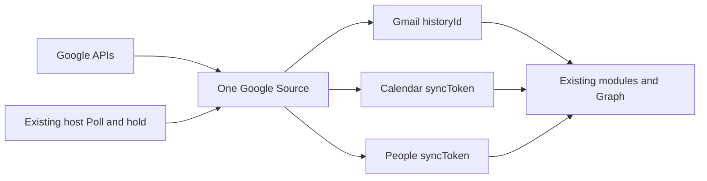

# Google Pull Sync

Status: APPROVED  
Spec lock: sha256:adc572be12b4f99e429fe2563819b3b685b4d4378efb57a983ca4a2c3e2f71bf owner:approved, make stages and implement it  
Implementation lock: sha256:afb71cfe49d1e155e53db18fb738c30c16973208d5405466a9bf51c24ecb9037 owner:approved, make stages and implement it  
Active Delivery: D1  
Unattended decisions: allowed  

<!-- plan:spec:start -->
## The Goal

Keep the Google Source on its existing 30-second Pull schedule and make that Pull correct, incremental and measurable across all three existing surfaces: Gmail, Google Calendar and Google Contacts. Push, Pub/Sub, IMAP IDLE and a new host protocol are not part of this Delivery.

The currency is provider requests, repeated data and measured wall time:

- A first connection downloads email, meetings and contacts through the existing Source and module pipeline, with independent progress for each surface.
- Gmail keeps its existing `historyId` catch-up. Calendar and Contacts finish their first complete read with the provider's `syncToken`; later polls retrieve only changes. An unchanged poll must not enumerate the full calendar or contact list again. After token expiry, a completed full pass removes owned replicas that the provider no longer lists.
- The connector refreshes an OAuth access token once per credential and token lifetime, not once per sync page. Concurrent calls share the same in-flight refresh.
- A Google quota response with an exact `Retry-After` becomes the existing typed rate-limit result. After one hydration worker observes it, no worker starts another request in that page; requests already sent cannot be recalled. The host remains the only owner of the durable hold and retry time.
- Progress is honest: Gmail states mailbox total and Spam/Trash skipped; Calendar states its exact event total when the full pass finishes because Google provides no pre-count; Contacts states total items and identity-less skipped. Incremental module receipts apply each admitted addition or deletion once; updates and replays do not inflate the totals.
- One existing manual performance stand runs a selected clean app worktree with real Telegram and Google accounts, preserves credentials across data resets, and reports provider fetch time, module/Graph admission time and throughput by Source and surface. No live-provider or PostgreSQL run enters CI.
- The live acceptance receipt records exact app/catalog SHAs, page settings, per-surface counts, holds and before/after timings. It makes no speedup claim unless two equivalent runs on the same accounts were measured.

## The target

The one architectural decision is to extend the existing Pull path. Provider cursors remain opaque Source cursors, and the existing modules remain the only writers to Graph.



No surface gets a second scheduler, database, checkpoint store or bespoke transport. `magnis.sync.fetch`, standard envelopes, typed `RateLimitError`/`CursorExpiredError`, module plan receipts and the host's Poll loop are reused.

### Gmail

Bootstrap captures `historyId` before listing messages, hydrates each listed message with the existing bounded concurrency and commits the captured history boundary only after the terminal page. Compare 50, 100 and 200 IDs per page against the app's existing 30-second Source fetch deadline and the same-account live report; select only a size that finishes inside that deadline. The selected page size and hydration concurrency are printed in the receipt.

Catch-up continues to use `history.list(startHistoryId)`: additions are `live`, label-only changes are `snapshot`, and removals are `delete`. A history-list 404 remains `CursorExpiredError` and restarts only the email surface. A message-get 404 after listing is an explicit concurrent disappearance: omit only that message, emit a diagnostic and let history from the captured boundary reconcile its deletion. Other hydration or conversion failures fail the whole page without advancing its cursor; a persistent failure remains visible rather than claiming completion.

### Calendar

The current moving `now-30d..now+90d` window and `orderBy=startTime` are removed: neither can be combined with Calendar `syncToken`, and the window excludes events outside it. The initial pass reads the primary calendar through bounded provider pages with `singleEvents=true` and `showDeleted=true`, counts non-cancelled events while processing those pages, and requires `nextSyncToken` on its terminal page. The accumulated count is stated on that terminal page; the separate IDs-only counting sweep is removed. Google does not supply a full-calendar total before enumeration.

Subsequent polls pass that token and return only changed or cancelled events using the same compatible request parameters. Non-cancelled changes are `snapshot`; cancelled events are `delete`. A provider `410 GONE` is `CursorExpiredError` and causes a new full Calendar pass. Page tokens continue one pass; the new sync token replaces the previous committed token only on the terminal page. `hasMore` is true only when Google returned `nextPageToken`, never merely because `nextCursor` contains a sync token.

### Contacts

The first People API pass requests a sync token and uses a page size measured to fit the app's 30-second Source fetch deadline (Google permits up to 1000, versus the current 100). `totalItems` is mapped to the existing `total_people` envelope field. Its terminal `nextSyncToken` is required and becomes the committed cursor. Later polls use `syncToken`; `Person.metadata.deleted`, or an updated person losing all name/email/phone identity, becomes a `delete` envelope anchored by the existing resource-name hash. An expired sync token becomes `CursorExpiredError` and restarts only Contacts. As with Calendar, `hasMore` reflects `nextPageToken`, not the retained sync token.

The Contacts module deletes only the Google replica resolved by that anchor. A locally curated person hub survives removal of its Google replica. Successful Graph creates and deletes provide incremental plan deltas; updates do not inflate the count.

Calendar and Contacts use the host's existing full-snapshot completion hook only after a completed bootstrap or token-expiry rescan. Their modules stamp admitted replicas with the pass generation and Source/account ownership, then remove only owned replicas left unstamped at completion; cancelled/deleted envelopes still remove immediately. A failed or interrupted pass never removes unseen replicas. The owner confirmed there are no previously connected Google accounts to migrate; every Google replica newly created by this Delivery has the ownership stamp.

### OAuth and provider holds

The existing credential tuple remains the cache identity. A cached access token carries Google's `expires_in`; it is reused only before its explicit safety-adjusted expiry. A changed credential never receives another credential's token. A rejected refresh is never replaced with an old token.

All Google API and token responses pass through the existing HTTP owner. HTTP 429, and a Google quota 403 with a parseable `Retry-After`, surface the existing `-32002` with the same remaining seconds. Missing or malformed delay remains an explicit provider error; no 60-second value is invented. Network failures retain the existing bounded timeout/retry policy and are not relabelled as quota holds.

Within Gmail's concurrent hydration, the first typed fatal error closes scheduling for that page. Up to the already-running requests may finish, but queued message IDs are not sent. No partial page or cursor is returned after a fatal error.

### Progress and performance report

The three modules continue to state progress in their existing schema names. Gmail and Contacts state their provider totals on page one; Calendar states the accumulated exact count on the terminal full-sync page. Identity-less contacts state `skipped`; malformed Calendar/Gmail payloads fail the page instead of silently changing the total. The initial provider total is stated once, not added to per-item creates in the same full pass. Later Gmail history changes and Calendar/Contacts Graph creates/deletes adjust that baseline once; updates and replays are zero-delta. A page with no provider statement does not fabricate a total.

The current `acceptance/telegram-performance` mechanism is extended in place. One persistent data root can hold both Telegram and Google credentials. `reset` clears Graph output and sync progress while fingerprinting the existing secret, credential, connection and account tables in the same transaction. `report` groups production `sync turn` records by `sourceId` and `surface`, including turns, pages, envelopes, bytes, inserted/removed rows, fetch/admission/overlap/wall time and envelopes per second.

The stand refuses Telegram and Google fixture variables, refuses dirty app or catalog worktrees, records exact revisions and starts the repository's ordinary `scripts/dev/dev.ts`. It never owns an alternate app launcher. Automated tests cover only argument parsing, reset safety and log summarization with local fixtures; real Google, Telegram and PostgreSQL execution is manual.

### Cursor shapes at the Source boundary

These are provider-owned opaque JSON values, not new host types:

```typescript
interface GmailCursor {
  history_id: string;
  page_token?: string;
  history_page_token?: string;
}

interface CalendarCursor {
  sync_token?: string;
  page_token?: string;
  events_total?: number;
}

interface ContactsCursor {
  sync_token?: string;
  page_token?: string;
}
```

During pagination the cursor retains the committed `history_id` or `sync_token` and adds only the current `page_token`. A terminal response removes the page token, sets `hasMore=false`, and replaces the provider checkpoint with a required `nextSyncToken`; a missing terminal token fails before admission. Calendar and Contacts certification change from terminal-clear snapshots to retained forward checkpoints. Because no Google account is bound to the old contract, new connections bind the new certification directly; no account migration or Source-specific host field is needed.

### Proposed file tree

All product changes stay in the catalog repository. The app is selected and measured by the stand but is not modified.

```text
MODIFY plugins/sources/google/src/auth.ts
       Reuse one unexpired access token per credential and coalesce refresh.
MODIFY plugins/sources/google/src/oauth.test.ts
       Prove reuse, expiry, concurrent refresh and credential isolation.
MODIFY plugins/sources/google/src/__tests__/googleContract.test.ts
       Assert connector-level terminal `hasMore=false` with a retained sync token.
MODIFY plugins/sources/google/src/http.ts
MODIFY plugins/sources/google/src/http.test.ts
       Preserve exact Google quota waits and stop inventing a missing delay.
MODIFY plugins/sources/google/src/connector.ts
       Route the three surfaces through their existing full/delta fetchers.
MODIFY plugins/sources/google/src/surfaces/email/gmail.ts
MODIFY plugins/sources/google/src/surfaces/email/gmail.test.ts
       Tune bootstrap pages and stop hydration scheduling on a fatal result.
MODIFY plugins/sources/google/src/surfaces/meetings/calendar.ts
MODIFY plugins/sources/google/src/surfaces/meetings/calendar.test.ts
       Replace the moving window with full sync plus Calendar syncToken.
MODIFY plugins/sources/google/src/surfaces/contacts/contacts.ts
MODIFY plugins/sources/google/src/surfaces/contacts/contacts.test.ts
       Add People syncToken, deletion envelopes and expired-token recovery.
MODIFY plugins/modules/meetings/module/service.ts
MODIFY plugins/modules/meetings/module/__tests__/meetingsSync.test.ts
MODIFY plugins/modules/meetings/manifest.toml
       State created/deleted Calendar deltas and reconcile owned replicas after a full pass.
MODIFY plugins/modules/email/module/service.ts
MODIFY plugins/modules/email/module/__tests__/emailIngest.test.ts
       Count distinct admitted Gmail additions/deletions once.
MODIFY plugins/modules/contacts/module/service.ts
MODIFY plugins/modules/contacts/module/__tests__/contactsIngest.test.ts
MODIFY plugins/modules/contacts/manifest.toml
       Delete Google replicas, state deltas and reconcile owned replicas after a full pass.
MODIFY plugins/sources/google/manifest.toml
       Declare the Calendar/Contacts checkpoint behavior and scenario evidence; do not rewrite immutable historical receipts.
MODIFY packages/testkit/__tests__/tst_cat_src_parity_001.test.ts
       Match the current Google declaration without changing the pinned historical contract.
MODIFY scripts/bundled-item-schemas.test.ts
       Assert the existing full-snapshot declarations for Meetings and Contacts.
MODIFY acceptance/telegram-performance/run.ts
MODIFY acceptance/telegram-performance/run.test.ts
MODIFY acceptance/telegram-performance/README.md
       Run and report real Telegram plus Google without entering CI.
```

No product file is created: the Source, each existing receiving module and the single stand each have one owning file and its existing tests. The Google OAuth test is extended for access-token reuse. The two module manifest edits enable an existing host hook, not a new reconciliation runner; their existing ingest tests cover that hook. The stand keeps its existing directory and command path. Generated catalog artifacts are rebuilt by their existing script and are not hand-authored.

## Today, measured against that

Pinned catalog base: `origin/staging` at `2f9dfe03125603953902d79764d8934558eba87d`.

- `plugins/sources/google/manifest.toml` declares one Poll Source at 30 seconds with `email`, `meetings` and `contacts`. This mode and the three existing modules are retained.
- `connector.ts:39-42` refreshes an access token on every fetch or action. A large mailbox therefore pays an OAuth request for every 50-message page.
- `gmail.ts:647` lists 50 IDs per page; hydration already has one reusable bounded-concurrency implementation at `gmail.ts:762-846`. Gmail bootstrap/history cursor semantics and delete envelopes already exist and are extended, not rewritten.
- `calendar.ts:215-242` enumerates IDs only to count the moving window, then `calendar.ts:260-310` lists the same bounded window again. One count pass can also exceed the app's 30-second Source fetch deadline. It stores only `page_token`, returns `null` at completion and cannot perform incremental Calendar sync.
- `contacts.ts:267-354` requests 100 people, stores only `page_token` and returns `null` at completion. Its own comment records the unused People `requestSyncToken`/`nextSyncToken`; deleted People are not parsed and the Contacts module ignores delete envelopes. Google now recommends `totalItems` instead of `totalPeople`.
- `http.ts:150-157` maps only HTTP 429 and invents 60 seconds when `Retry-After` is absent. Gmail hydration collects fatal errors but other workers may continue taking queued IDs before the batch rethrows.
- The email module already states full mailbox progress but counts every `live` and `delete` envelope before checking whether it changed anything. Meetings and Contacts state full totals but not incremental create/delete deltas. The existing Graph result and anchored deletes provide the evidence for those two surfaces.
- `acceptance/telegram-performance` already selects exact clean app/catalog revisions, starts the ordinary dev command, preserves all Source credential tables on reset and reads production `sync turn` logs. Its report deliberately filters to Telegram; it is the one stand to extend.

### Reuse map

- Reuse `fetchWithRetry`, its timeout, `RateLimitError` and `CursorExpiredError`; do not add a Google retry framework.
- Reuse Gmail's existing checkpoint/page-token pattern for Calendar and Contacts terminal tokens.
- Reuse the email module's full-statement pattern in Meetings and Contacts; use their existing Graph results for replica deltas.
- Reuse each module's existing anchor and Graph delete operation; do not query Source-specific tables from a module.
- Reuse the existing performance runner, reset transaction, ordinary app launcher and production timing log; do not add a second runner or CI workflow.

## Invariants

### `scn_google_pull_001` — Gmail pages and OAuth

- Step 1 → Verify: scripted profile and two message-list pages capture one `historyId`; one credential refresh serves both pages in source order, while another credential gets its own token (`tst_src_iso_google_001` in `gmail.test.ts`; `tst_src_iso_google_002` in `oauth.test.ts`).
- Step 2 → Verify: a listed message-get 404 is explicitly diagnosed and omitted, then a later history deletion reconciles it; a non-404 hydration/conversion error returns no page or cursor (`tst_src_iso_google_003` in `gmail.test.ts`).
- Step 3 → Verify: with several scripted hydration workers, the first typed rate limit prevents every not-yet-started request; already-started requests may finish, but no partial page commits (`tst_src_iso_google_004` in `gmail.test.ts`).

### `scn_google_pull_002` — Calendar checkpoint and recovery

- Step 1 → Verify: two full Calendar pages use no time bounds or ordering, emit non-cancelled events and a cancelled deletion, state the exact total once, and only the terminal page returns `hasMore=false` with its required sync token (`tst_src_iso_google_005` in `calendar.test.ts` and the existing connector contract test).
- Step 2 → Verify: the next poll sends that token without full enumeration; changed/cancelled events produce update/delete receipts, and a 410 starts a new full pass. An interrupted replacement pass deletes nothing; only its completed pass removes stale account-owned events (`tst_src_iso_google_006` in `calendar.test.ts`, `tst_module_google_001` in `meetingsSync.test.ts`).

### `scn_google_pull_003` — Contacts checkpoint and recovery

- Step 1 → Verify: full People pages request and retain the terminal sync token, state `totalItems` once, and account for identity-less contacts as skipped; a missing terminal token fails the page (`tst_src_iso_google_007` in `contacts.test.ts`).
- Step 2 → Verify: a token poll fetches only changes; deleted or newly identity-less people remove their anchored Google replicas, not curated hubs. Token expiry starts a full pass and only completed, account-owned reconciliation removes unseen replicas (`tst_src_iso_google_008` in `contacts.test.ts`, `tst_module_google_002` in `contactsIngest.test.ts`).

### `scn_google_pull_004` — holds and progress

- Step 1 → Verify: scripted 429 and quota-403 responses with an exact `Retry-After` reach the existing wire `-32002` unchanged; missing/malformed delay and network timeout remain distinct errors (`tst_src_iso_google_009` in `http.test.ts`).
- Step 2 → Verify: initial provider statements set totals once; later distinct additions/deletions adjust only the intended schema; unchanged snapshots and retried pages do not inflate totals (`tst_module_google_003` in `emailIngest.test.ts`, `tst_module_google_004` in `meetingsSync.test.ts`, `tst_module_google_005` in `contactsIngest.test.ts`).

### `scn_google_pull_005` — one manual stand

- Step 1 → Verify: synthetic production `sync turn` records report Telegram, Gmail, Calendar and Contacts in separate Source/surface groups; the runner refuses dirty revisions and provider fixture variables (`tst_cert_google_001` in `run.test.ts`).
- Step 2 → Verify: a reset fixture demonstrates that Graph/progress rows are cleared while credential, secret, connection and account fingerprints remain identical; module manifests certify full-snapshot completion only for Meetings and Contacts (`tst_cert_google_002` in `run.test.ts`, `tst_cert_google_003` in `bundled-item-schemas.test.ts`).

Every new automated test has its canonical ID, scenario, covered function and deterministic fixture metadata beside the test; code branches link back with `@tested-by`. Tests are written RED first and use only scripted HTTP/Graph responses or synthetic logs through scoped `agent:test:backend` targets. The manual live run is marked manual and is not an automated correctness signal. Removing token retention, restoring full-list polling, allowing one queued Gmail request after a rate limit, or deleting a curated contact hub must make its owning test fail.

## Constraints and exclusions

- No Gmail Push, Pub/Sub, IMAP IDLE, Calendar webhook, public relay, `listen_start`, new app protocol or app repository change.
- No new scheduler, cursor database, generic retry abstraction, second performance runner or CI workflow.
- No previously connected Google account exists in the target deployment. If that premise proves false before rollout, migration needs a separate owner decision; this plan does not silently rebind an old account or attribute any pre-existing Graph replica to it.
- No real provider credentials in source, tests, logs, commits or CI. Automated tests use injected HTTP responses and synthetic logs only.
- The live stand is manual and opt-in. It stops and reports on a provider hold; it does not search for quota limits or repeatedly reconnect accounts.
- Gmail continues to exclude Spam and Trash from ingestion and reports them as skipped. Attachments remain lazy downloads. Google Drive and Tasks are outside the three declared surfaces.
- Calendar changes from the current rolling 120-day window to the complete primary calendar so provider incremental sync is valid. Additional calendars remain outside this Delivery.
- A live speed result is hardware/account/provider-specific. The PR reports raw before/after numbers and bottleneck split; it does not turn one account's throughput into a universal SLA.

## Pre-approval screen

### Files and responsibility

- Google Source: token reuse, Gmail batch scheduling, Calendar/Contacts incremental cursors and exact quota errors.
- Email, Meetings and Contacts modules: correct admitted create/delete progress; Contacts deletes only its Google replica.
- Existing performance stand: reports Telegram, Gmail, Calendar and Contacts from the same persistent data root.
- Main app: no code change.

### What the owner can observe after merge

- Connect one Google account and see independent email, meeting and contact progress instead of repeated full Calendar/Contacts enumeration every 30 seconds. Calendar's exact total appears after its first complete enumeration.
- Stop and restart during any page and resume from the committed provider checkpoint without claiming an uncommitted terminal token.
- Receive a real Google quota delay as a visible host hold; queued Gmail hydration stops launching new requests after the first observed hold.
- Reset the manual stand without re-authenticating Telegram or Google, run another selected app/catalog branch, and compare per-surface fetch versus Graph time.
- See the complete primary calendar; the former `now-30d..now+90d` product limit is gone.

### Deliberately not verified here

- Push latency is not tested because this Delivery remains Poll-only.
- CI does not start PostgreSQL or contact real Telegram/Google accounts; the live receipt is manual.
- No fixed messages-per-second SLA is promised before the first same-account baseline. The accepted evidence is exact request reduction, correct incremental behavior and reported live wall time.
- Additional Google calendars, Drive, Tasks, Spam/Trash ingestion and attachment prefetch are unchanged.

After this SPEC is approved, one PR Delivery with commit-sized Stages will be rendered separately. No implementation starts from this draft.
<!-- plan:spec:end -->

<!-- plan:implementation:start -->
## Implementation contract

<!-- plan:delivery:D1:start -->
<!-- plan:delivery-meta:{"active":true,"depends":[],"predictedExternalWaitMinutes":30} -->
### PR Delivery D1 — Google Pull sync and one manual performance stand

Branch: `feat/google-pull-sync`; Depends: none; Gate: catalog.

Stage graph: `D1-S1 -> D1-S2 -> D1-S3 -> D1-S4`.

Forecast: 253 active min / 0 credits across 4 Stages; longest dependency path 253 active min; external waits 30 min.

What changes for people. One new Google connection initially reads Gmail, Calendar and Contacts, then polls provider changes with honest per-surface progress and exact quota holds. The same manual stand reports Google beside Telegram.

What changes in the code. The existing Google Source gains token reuse and incremental Calendar/Contacts cursors; existing modules reconcile owned replicas and count actual changes; the existing stand reports both Sources. No app protocol or CI live-provider job changes.

How it is proven. Scripted Source and module tests cover cursors, deletions, rate limits and progress; stand tests cover reset safety and grouped production logs. One manual real-account receipt records exact SHAs, counts and timings. The catalog PR gate runs once after the last Stage.

Not in this PR. Push/PubSub, old Google-account migration, additional calendars and any new runner.

<!-- plan:stage:D1-S1:start -->
<!-- plan:stage-meta:{"deliveryId":"D1","depends":[],"parallelWith":[],"writes":["plugins/sources/google/src/auth.ts","plugins/sources/google/src/oauth.test.ts","plugins/sources/google/src/http.ts","plugins/sources/google/src/http.test.ts","plugins/sources/google/src/connector.ts","plugins/sources/google/src/surfaces/email/gmail.ts","plugins/sources/google/src/surfaces/email/gmail.test.ts"],"tempRoot":".tmp/code-production/google-pull-sync/D1-S1","predictedActiveMinutes":50,"predictedCredits":0,"verifyActiveMinutes":5,"verifyCredits":0} -->
#### Stage D1-S1 — Reuse Google tokens and make Gmail pages lossless

- Owner: codex; Profile: strong; Depends: none; Parallel with: none.
- Writes: `plugins/sources/google/src/auth.ts`, `plugins/sources/google/src/oauth.test.ts`, `plugins/sources/google/src/http.ts`, `plugins/sources/google/src/http.test.ts`, `plugins/sources/google/src/connector.ts`, `plugins/sources/google/src/surfaces/email/gmail.ts`, `plugins/sources/google/src/surfaces/email/gmail.test.ts`.
- Temp root: `.tmp/code-production/google-pull-sync/D1-S1` (must be absent at handoff).
- Of which verification: 5 active min / 0 credits.

What this Stage solves. A Google token is refreshed for every page, Gmail silently skips failed hydration and queued requests continue after a hold.

What is built. auth.ts caches one unexpired token per credential; http.ts preserves exact quota waits; gmail.ts keeps bounded ordered hydration and closes its work queue on a fatal result; connector.ts reuses the token owner.

How it is proven. tst_src_iso_google_001 through 004 exercise reuse, two credentials, a disappearing message, a hard failure and queued work after a hold. Existing HTTP and OAuth cases remain green.

Commit. fix(google): reuse access tokens and stop lossy Gmail pages — preserve provider errors and exact holds.

##### Tasks

- [x] GOOGLE_001 — Cache Google tokens and exact holds in auth.ts, oauth.test.ts, http.ts and http.test.ts. (20 min) — 58eb385bed76cf0bfc3c58cd7ab0dd4aea002911
<!-- plan:task-meta:{"writes":["plugins/sources/google/src/auth.ts","plugins/sources/google/src/oauth.test.ts","plugins/sources/google/src/http.ts","plugins/sources/google/src/http.test.ts"],"predictedActiveMinutes":20,"predictedCredits":0,"how":"plugins/sources/google/src/auth.ts: cache by credential and expiry; plugins/sources/google/src/oauth.test.ts: assert reuse, expiry and isolation; plugins/sources/google/src/http.ts: map exact 429/quota-403 Retry-After; plugins/sources/google/src/http.test.ts: assert typed holds and malformed delay refusal","red":"bun run agent:test:backend -- plugins/sources/google/src/oauth.test.ts plugins/sources/google/src/http.test.ts"} -->
- [x] GOOGLE_002 — Make ordered Gmail hydration lossless in connector.ts, gmail.ts and gmail.test.ts. (25 min) — 58eb385bed76cf0bfc3c58cd7ab0dd4aea002911
<!-- plan:task-meta:{"writes":["plugins/sources/google/src/connector.ts","plugins/sources/google/src/surfaces/email/gmail.ts","plugins/sources/google/src/surfaces/email/gmail.test.ts"],"predictedActiveMinutes":25,"predictedCredits":0,"how":"plugins/sources/google/src/connector.ts: reuse the cached token in fetch and execute; plugins/sources/google/src/surfaces/email/gmail.ts: stop queued hydration after fatal errors and handle message-get 404; plugins/sources/google/src/surfaces/email/gmail.test.ts: assert boundary, ordered pages, 404 and fatal queue stop","red":"bun run agent:test:backend -- plugins/sources/google/src/surfaces/email/gmail.test.ts"} -->

##### Acceptance criteria

- [x] `bun run agent:test:backend -- plugins/sources/google/src/oauth.test.ts plugins/sources/google/src/http.test.ts plugins/sources/google/src/surfaces/email/gmail.test.ts` exits 0 — token reuse, exact holds and lossless Gmail pages — 58eb385bed76cf0bfc3c58cd7ab0dd4aea002911
- [x] Commit — 58eb385bed76cf0bfc3c58cd7ab0dd4aea002911

##### Results

<!-- plan:results:D1-S1:start -->
| Task | Commit | UTC start-end | Active / elapsed | Usage | Result / proof |
|---|---|---|---:|---|---|
| GOOGLE_001 | 58eb385bed76cf0bfc3c58cd7ab0dd4aea002911 | 2026-09-23T20:03:52.261Z–2026-09-23T20:13:51.981Z | 10 / 10 min | unavailable: runner did not expose usage | Access tokens are reused through explicit expiry; Gmail pages fail on hard hydration errors and stop queued requests after a hold. |
| GOOGLE_002 | 58eb385bed76cf0bfc3c58cd7ab0dd4aea002911 | 2026-09-23T20:03:52.261Z–2026-09-23T20:13:51.981Z | 10 / 10 min | unavailable: runner did not expose usage | Access tokens are reused through explicit expiry; Gmail pages fail on hard hydration errors and stop queued requests after a hold. |
<!-- plan:results:D1-S1:end -->
<!-- plan:stage:D1-S1:end -->

<!-- plan:stage:D1-S2:start -->
<!-- plan:stage-meta:{"deliveryId":"D1","depends":["D1-S1"],"parallelWith":[],"writes":["plugins/sources/google/src/connector.ts","plugins/sources/google/src/surfaces/meetings/calendar.ts","plugins/sources/google/src/surfaces/meetings/calendar.test.ts","plugins/sources/google/src/__tests__/googleContract.test.ts","plugins/sources/google/src/surfaces/contacts/contacts.ts","plugins/sources/google/src/surfaces/contacts/contacts.test.ts","plugins/sources/google/manifest.toml","packages/testkit/__tests__/tst_cat_src_parity_001.test.ts"],"tempRoot":".tmp/code-production/google-pull-sync/D1-S2","predictedActiveMinutes":68,"predictedCredits":0,"verifyActiveMinutes":8,"verifyCredits":0} -->
#### Stage D1-S2 — Keep Calendar and Contacts provider checkpoints

- Owner: codex; Profile: strong; Depends: D1-S1; Parallel with: none.
- Writes: `plugins/sources/google/src/connector.ts`, `plugins/sources/google/src/surfaces/meetings/calendar.ts`, `plugins/sources/google/src/surfaces/meetings/calendar.test.ts`, `plugins/sources/google/src/__tests__/googleContract.test.ts`, `plugins/sources/google/src/surfaces/contacts/contacts.ts`, `plugins/sources/google/src/surfaces/contacts/contacts.test.ts`, `plugins/sources/google/manifest.toml`, `packages/testkit/__tests__/tst_cat_src_parity_001.test.ts`.
- Temp root: `.tmp/code-production/google-pull-sync/D1-S2` (must be absent at handoff).
- Of which verification: 8 active min / 0 credits.

What this Stage solves. Calendar counts one moving window twice and Contacts re-lists everything after each poll; neither retains a provider sync token.

What is built. calendar.ts and contacts.ts page full reads, return required terminal sync tokens, and fetch only changes on subsequent polls. connector.ts treats only a page token as hasMore. The current Google certification and parity test describe the new forward checkpoint; immutable historical receipts stay unchanged.

How it is proven. tst_src_iso_google_005 through 008 and the connector contract test assert full/delta pagination, deleted records, token expiry and terminal hasMore=false.

Commit. feat(google): retain Calendar and Contacts sync tokens — unchanged polls no longer enumerate all records.

##### Tasks

- [ ] GOOGLE_003 — Retain Calendar pages in connector.ts, calendar.ts, calendar.test.ts and googleContract.test.ts. (30 min)
<!-- plan:task-meta:{"writes":["plugins/sources/google/src/connector.ts","plugins/sources/google/src/surfaces/meetings/calendar.ts","plugins/sources/google/src/surfaces/meetings/calendar.test.ts","plugins/sources/google/src/__tests__/googleContract.test.ts"],"predictedActiveMinutes":30,"predictedCredits":0,"how":"plugins/sources/google/src/connector.ts: dispatch explicit hasMore from pageToken; plugins/sources/google/src/surfaces/meetings/calendar.ts: remove time window/count sweep and retain syncToken; plugins/sources/google/src/surfaces/meetings/calendar.test.ts: assert full/delta/410 and exact total; plugins/sources/google/src/__tests__/googleContract.test.ts: assert terminal retained cursor with hasMore false","red":"bun run agent:test:backend -- plugins/sources/google/src/surfaces/meetings/calendar.test.ts plugins/sources/google/src/__tests__/googleContract.test.ts"} -->
- [ ] GOOGLE_004 — Retain People pages in contacts.ts, contacts.test.ts, manifest.toml and tst_cat_src_parity_001.test.ts. (30 min)
<!-- plan:task-meta:{"writes":["plugins/sources/google/src/surfaces/contacts/contacts.ts","plugins/sources/google/src/surfaces/contacts/contacts.test.ts","plugins/sources/google/manifest.toml","packages/testkit/__tests__/tst_cat_src_parity_001.test.ts"],"predictedActiveMinutes":30,"predictedCredits":0,"how":"plugins/sources/google/src/surfaces/contacts/contacts.ts: request and retain syncToken; emit deletes; plugins/sources/google/src/surfaces/contacts/contacts.test.ts: assert full/delta/expiry and skipped contacts; plugins/sources/google/manifest.toml: declare current forward checkpoint contract; packages/testkit/__tests__/tst_cat_src_parity_001.test.ts: assert current contract while keeping historical receipts","red":"bun run agent:test:backend -- plugins/sources/google/src/surfaces/contacts/contacts.test.ts packages/testkit/__tests__/tst_cat_src_parity_001.test.ts"} -->

##### Acceptance criteria

- [ ] `bun run agent:test:backend -- plugins/sources/google/src/surfaces/meetings/calendar.test.ts plugins/sources/google/src/surfaces/contacts/contacts.test.ts plugins/sources/google/src/__tests__/googleContract.test.ts packages/testkit/__tests__/tst_cat_src_parity_001.test.ts` exits 0 — all three Google surfaces retain the correct checkpoint
- [ ] Commit

##### Results

<!-- plan:results:D1-S2:start -->
| Task | Commit | UTC start-end | Active / elapsed | Usage | Result / proof |
|---|---|---|---:|---|---|
<!-- plan:results:D1-S2:end -->
<!-- plan:stage:D1-S2:end -->

<!-- plan:stage:D1-S3:start -->
<!-- plan:stage-meta:{"deliveryId":"D1","depends":["D1-S2"],"parallelWith":[],"writes":["plugins/modules/email/module/service.ts","plugins/modules/email/module/__tests__/emailIngest.test.ts","plugins/modules/meetings/module/service.ts","plugins/modules/meetings/module/__tests__/meetingsSync.test.ts","plugins/modules/meetings/manifest.toml","scripts/bundled-item-schemas.test.ts","plugins/modules/contacts/module/service.ts","plugins/modules/contacts/module/__tests__/contactsIngest.test.ts","plugins/modules/contacts/manifest.toml"],"tempRoot":".tmp/code-production/google-pull-sync/D1-S3","predictedActiveMinutes":95,"predictedCredits":0,"verifyActiveMinutes":10,"verifyCredits":0} -->
#### Stage D1-S3 — Make module progress and expired-token recovery truthful

- Owner: codex; Profile: strong; Depends: D1-S2; Parallel with: none.
- Writes: `plugins/modules/email/module/service.ts`, `plugins/modules/email/module/__tests__/emailIngest.test.ts`, `plugins/modules/meetings/module/service.ts`, `plugins/modules/meetings/module/__tests__/meetingsSync.test.ts`, `plugins/modules/meetings/manifest.toml`, `scripts/bundled-item-schemas.test.ts`, `plugins/modules/contacts/module/service.ts`, `plugins/modules/contacts/module/__tests__/contactsIngest.test.ts`, `plugins/modules/contacts/manifest.toml`.
- Temp root: `.tmp/code-production/google-pull-sync/D1-S3` (must be absent at handoff).
- Of which verification: 10 active min / 0 credits.

What this Stage solves. Email counts replayed envelopes; Meetings and Contacts do not count admitted deltas or remove stale owned replicas after a completed replacement pass.

What is built. Existing Email, Meetings and Contacts module handlers state one baseline and actual later changes. Meetings and Contacts stamp source/account ownership and use the host's existing full-snapshot completion hook; Contacts deletes only its Google replica. Module manifests enable the existing hook.

How it is proven. tst_module_google_001 through 005 cover create/update/delete, retries, interrupted passes and curated hub survival. The bundled manifest test covers completion declarations.

Commit. fix(google): reconcile owned replicas and count admitted changes — no replay inflation or stale records after token expiry.

##### Tasks

- [ ] GOOGLE_005 — Count Gmail receipts once in email service.ts and emailIngest.test.ts. (25 min)
<!-- plan:task-meta:{"writes":["plugins/modules/email/module/service.ts","plugins/modules/email/module/__tests__/emailIngest.test.ts"],"predictedActiveMinutes":25,"predictedCredits":0,"how":"plugins/modules/email/module/service.ts: count distinct admitted history additions/deletions without replay inflation; plugins/modules/email/module/__tests__/emailIngest.test.ts: assert full baseline, live, delete, update and retry receipts","red":"bun run agent:test:backend -- plugins/modules/email/module/__tests__/emailIngest.test.ts"} -->
- [ ] GOOGLE_006 — Reconcile Calendar in meetings service.ts, meetingsSync.test.ts, manifest.toml and bundled-item-schemas.test.ts. (30 min)
<!-- plan:task-meta:{"writes":["plugins/modules/meetings/module/service.ts","plugins/modules/meetings/module/__tests__/meetingsSync.test.ts","plugins/modules/meetings/manifest.toml","scripts/bundled-item-schemas.test.ts"],"predictedActiveMinutes":30,"predictedCredits":0,"how":"plugins/modules/meetings/module/service.ts: stamp owned events and delete unseen events only on completed bootstrap; plugins/modules/meetings/module/__tests__/meetingsSync.test.ts: assert delta counts and completed versus interrupted reconciliation; plugins/modules/meetings/manifest.toml: enable existing full_snapshot completion hook; scripts/bundled-item-schemas.test.ts: assert Meetings reconciliation declaration","red":"bun run agent:test:backend -- plugins/modules/meetings/module/__tests__/meetingsSync.test.ts scripts/bundled-item-schemas.test.ts"} -->
- [ ] GOOGLE_007 — Reconcile People in contacts service.ts, contactsIngest.test.ts and manifest.toml. (30 min)
<!-- plan:task-meta:{"writes":["plugins/modules/contacts/module/service.ts","plugins/modules/contacts/module/__tests__/contactsIngest.test.ts","plugins/modules/contacts/manifest.toml"],"predictedActiveMinutes":30,"predictedCredits":0,"how":"plugins/modules/contacts/module/service.ts: delete only Google replicas and reconcile owned unseen replicas; plugins/modules/contacts/module/__tests__/contactsIngest.test.ts: assert delta counts, expiry recovery and curated hub survival; plugins/modules/contacts/manifest.toml: enable existing full_snapshot completion hook","red":"bun run agent:test:backend -- plugins/modules/contacts/module/__tests__/contactsIngest.test.ts"} -->

##### Acceptance criteria

- [ ] `bun run agent:test:backend -- plugins/modules/email/module/__tests__/emailIngest.test.ts plugins/modules/meetings/module/__tests__/meetingsSync.test.ts plugins/modules/contacts/module/__tests__/contactsIngest.test.ts` exits 0 — module progress is idempotent and account-owned reconciliation is safe
- [ ] `bun run agent:test:backend -- scripts/bundled-item-schemas.test.ts` exits 0 — existing hook declarations are certified
- [ ] Commit

##### Results

<!-- plan:results:D1-S3:start -->
| Task | Commit | UTC start-end | Active / elapsed | Usage | Result / proof |
|---|---|---|---:|---|---|
<!-- plan:results:D1-S3:end -->
<!-- plan:stage:D1-S3:end -->

<!-- plan:stage:D1-S4:start -->
<!-- plan:stage-meta:{"deliveryId":"D1","depends":["D1-S3"],"parallelWith":[],"writes":["acceptance/telegram-performance/run.ts","acceptance/telegram-performance/run.test.ts","acceptance/telegram-performance/README.md"],"tempRoot":".tmp/code-production/google-pull-sync/D1-S4","predictedActiveMinutes":40,"predictedCredits":0,"verifyActiveMinutes":10,"verifyCredits":0} -->
#### Stage D1-S4 — Measure Telegram and Google with the one manual stand

- Owner: codex; Profile: strong; Depends: D1-S3; Parallel with: none.
- Writes: `acceptance/telegram-performance/run.ts`, `acceptance/telegram-performance/run.test.ts`, `acceptance/telegram-performance/README.md`.
- Temp root: `.tmp/code-production/google-pull-sync/D1-S4` (must be absent at handoff).
- Of which verification: 10 active min / 0 credits.

What this Stage solves. The existing manual stand reports only Telegram, so Google fetch/admission bottlenecks cannot be compared while retaining saved credentials.

What is built. run.ts groups production sync-turn records by Source and surface, protects all credential tables during reset and refuses real-provider fixture variables; run.test.ts covers those boundaries; README.md documents the one opt-in live run on selected clean app/catalog worktrees.

How it is proven. tst_cert_google_001 and 002 use synthetic logs and reset fixtures. A live receipt records exact app/catalog SHAs, page settings, counts, holds and timings; no real provider or PostgreSQL run is added to CI. The full catalog publication gate runs once after this Stage.

Commit. feat(stand): report Google beside Telegram — preserve credentials and show per-surface timings.

##### Tasks

- [ ] GOOGLE_008 — Report both Sources in run.ts, run.test.ts and README.md without CI live runs. (30 min)
<!-- plan:task-meta:{"writes":["acceptance/telegram-performance/run.ts","acceptance/telegram-performance/run.test.ts","acceptance/telegram-performance/README.md"],"predictedActiveMinutes":30,"predictedCredits":0,"how":"acceptance/telegram-performance/run.ts: group sync turns by Source/surface and protect credentials on reset; acceptance/telegram-performance/run.test.ts: assert grouping, clean revisions and reset fingerprints; acceptance/telegram-performance/README.md: document opt-in real-account run and branch selection","red":"bun run agent:test:backend -- acceptance/telegram-performance/run.test.ts"} -->

##### Acceptance criteria

- [ ] `bun run agent:test:backend -- acceptance/telegram-performance/run.test.ts` exits 0 — one stand reports both Sources and preserves credentials
- [ ] One manual receipt records exact revisions, per-surface counts and fetch/admission/wall time without claiming unmeasured speedup
- [ ] Commit

##### Results

<!-- plan:results:D1-S4:start -->
| Task | Commit | UTC start-end | Active / elapsed | Usage | Result / proof |
|---|---|---|---:|---|---|
<!-- plan:results:D1-S4:end -->
<!-- plan:stage:D1-S4:end -->
<!-- plan:delivery:D1:end -->
<!-- plan:implementation:end -->

<!-- plan:execution:start -->
## Execution log

- lock-spec sha256:adc572be12b4f99e429fe2563819b3b685b4d4378efb57a983ca4a2c3e2f71bf owner:approved, make stages and implement it

- put-delivery D1

- put-stage D1-S1

- put-stage D1-S2

- put-stage D1-S3

- put-stage D1-S4

- approve sha256:afb71cfe49d1e155e53db18fb738c30c16973208d5405466a9bf51c24ecb9037 owner:approved, make stages and implement it

- record-result D1-S1 commit:58eb385bed76cf0bfc3c58cd7ab0dd4aea002911

- close D1-S1 closed commit:58eb385bed76cf0bfc3c58cd7ab0dd4aea002911

- deviation D1-S2: The existing Google fixture wire test enforces the removed Calendar window and an OAuth response without expires_in; update that one test file to verify the approved full-calendar token contract. Historical certification receipts remain untouched.

- deviation D1-S2: The existing Google serde-parity test calls the removed Calendar window argument and asserts old terminal-null behavior; update it to the approved token-based signature and response contract so typecheck and full gate can pass.
<!-- plan:execution:end -->
