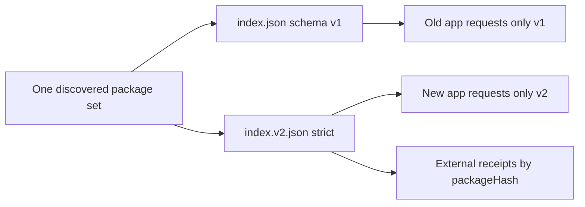
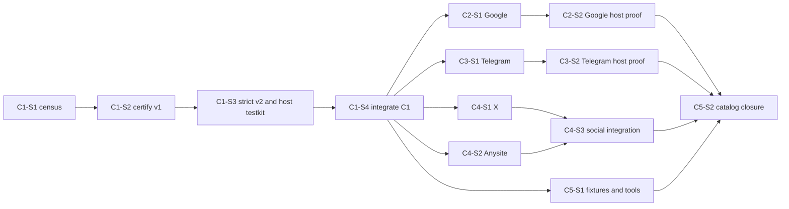

# Sources certification platform: catalog child plan and launch census

## Authority and execution boundary

This child plan expands the catalog half of the approved Sources master plan in
`magnis-app` PR #212. It does not change the product contract. The master plan
owns Source behavior, task IDs, acceptance criteria, model profiles and
cross-repository ordering; this document pins the catalog evidence and exact
catalog work zones needed to execute those tasks.

The owner withdrew the unfinished code-production tool as a launch prerequisite
on 2026-08-27. Execution therefore uses the current Git worktrees, tracked
hooks, scoped RED/GREEN commands, a fresh independent review and GitHub CI.
Only the app Delivery integrator edits the master plan. Catalog agents return
commit-bound evidence and never write app Results.

C1-S1 is documentation and census only. It changes no connector, manifest,
SDK, index or published channel behavior.

## Pinned launch state

| Boundary | Exact value | Meaning |
| --- | --- | --- |
| Catalog implementation branch | `feat/sources-certification-platform` | C1 Delivery branch |
| Catalog launch `HEAD` | `1c904e6b56c3b0e884fb2848f0b9a926ef461f4e` | exact `origin/main` used by C1-S1 |
| Published channel branch | `c35301f056e81611acda2848ffbf8fa7d2ff73fe` | exact `refs/heads/catalog` tree currently offered to apps |
| Published `generated_from` | `7b0e0c49db9a41c8e1ae032b327ff9a39916ff65` | source commit recorded by the published v1 index |
| Separate `catalog` tag | `5813b3126e27e9caa58efdc487cb02066041eb52` | a source tag, not the published channel branch |
| App hash reader | `origin/staging@dcafdd559c2bfc1705678dd265abd419cf2c4f27` | current app package/definition decoder used for the census |
| Package-tree hash implementation blob | `a18536e38189e0b92bc4121667b613a6f2e19c60` | `remote-package-files.ts` blob |
| Definition decoder implementation blob | `b967834379cc00172bcb2230fad660c0f6457dd4` | `extension-artifact-codec.ts` blob |
| Census runtime | Bun `1.3.13` on Linux x64 | local launch rebuild environment |

The published channel is intentionally treated as a separate immutable input.
It is not reconstructed from launch `main`: `main` contains the dataset-action
change for mock Gmail and mock Telegram that the published channel does not.
Offline adoption keys therefore come from the actual published package trees,
not from a rebuild of a newer commit.

## Catalog lanes

| Lane | Manifests | Admission intent |
| --- | --- | --- |
| Production sync | `anysite`, `google`, `telegram`, `x` | selected-channel artifacts; exact provider compatibility receipt required |
| Development fixture | `local`, `mock-gmail`, `mock-linkedin`, `mock-statemachine-key`, `mock-statemachine-oauth`, `mock-statemachine-phone`, `mock-telegram`, `mock-x` | must pass the same artifact and wire closure; receipt declares `development_fixture`; `local` remains sync-retired until explicitly promoted |
| Tools only | `x-mcp` | never Source account/sync/Graph authority; admitted only after an offline dependency-closed wrapper exists, otherwise explicitly inadmissible |

Discovery is the sorted set of every directory under `plugins/sources/` that
contains `manifest.toml`. The launch set is exactly 13 manifests; no script may
carry a second hand-written provider list.

## Launch-main manifest and hash census

`packageHash` below is the app `hashTree` value over a locally staged launch-main
package. `definitionHash` is the app's canonical Source manifest contract hash.
The package values are census evidence, not selected-channel adoption keys:
the catalog workflow currently uses unpinned `setup-bun@v2`, and unchanged
provider sources produced different bundle bytes from the older published
channel. C1-S2 must make receipt generation consume the exact staged bytes and
pin the build runtime before a newly generated hash becomes release evidence.

| Source | Lane | Manifest SHA-256 | Launch package hash | Definition hash / decoder result |
| --- | --- | --- | --- | --- |
| `anysite` | production | `sha256:fe20d7237bd0f4cc39eef338a291eb5aad67e3c9d2f9bdfb32d2b79d1f49c73f` | `sha256:d3807c21a23a257ebbe7ed0e80d39e89a9121e1b4a3ec039d68e9ead6f8a6805` | `sha256:8862b50d0094696a28082b4e560b9f753448e4c1e0c2a25289c5c48ea195ca5d` |
| `google` | production | `sha256:b422c82c98bd81c43f48df65feaca7ca200564304737a4503bdacd2e7c8d9bbd` | `sha256:67522942035ec1baa99eaab2984ca106482d1da56769e2dad446298274cb2b54` | `sha256:53cda0e75af3636a11dfb23ae18b34e3f81af9881852641e7272434a4ef565a4` |
| `local` | fixture | `sha256:6e4b2d6745c819f65ab141e7d2f0f81cab7bee32832e24d5bfebd8d57a3e4211` | `sha256:f073b179452108387f8c43fd25422b0aac4888231202372b492dfb232d9cbfc0` | `sha256:c1c14b32bed15d1e12a573450cf0afe085ff77c47eb42c373a0accbdeaa9df9c` |
| `mock-gmail` | fixture | `sha256:6f64529fa7201282853fb7b4fd02595a4353ca6827cdc86edaf49e99f453d950` | `sha256:6f8c28de18952a3c1278d793c75553e70a843805b94dc72489cd974caba19758` | unavailable: builder omits `schemas/dataset-actions/emit-message.json` and `emit-meeting.json` |
| `mock-linkedin` | fixture | `sha256:ab798a4b286cbdfc336f7e6e6519cf92b8cfceb6ddbe026681b52b075deded2b` | `sha256:f7fa1ea0b3fa541b9eb1b0e51138749c2d387755bc77ba204c459779f20475ce` | `sha256:92edc85ac60a6013a2841008fb91af69d249a49b515bdfd542f11e23fbb1c283` |
| `mock-statemachine-key` | fixture | `sha256:8b978ff96c32890a8936f77c5a788a73f201e18fddff9b50c14ca9e743b4b467` | `sha256:e8c92648d45081de459b88db22561d5c273ecebc0ed66896ab1e6a7bb66259da` | unavailable: three-argument manifest spawn is rejected |
| `mock-statemachine-oauth` | fixture | `sha256:2b0e171e8949e393397e79d5592ae2da58e641d162b818bfe4a2a924df873dfa` | `sha256:e82c5ce593e36887d1e03e3f93b95b999374064fbb185003f064e043eace9067` | unavailable: three-argument manifest spawn is rejected |
| `mock-statemachine-phone` | fixture | `sha256:0f3a558b33ee6e0b4b9f46e87d0ed58430c7bddacde44288c2fcd88af293e0b2` | `sha256:8bfaeb36e28959ab74b49334d6f33a989f3ca7b14504ab584ea1d1d3be71c204` | unavailable: three-argument manifest spawn is rejected |
| `mock-telegram` | fixture | `sha256:670a7a829345c27ec760467144192687cc3eedd6674a3639a624c19359942a9a` | `sha256:3884fd51965ee9c67317e9038a6bdd49f215ef8c6af15822f5dadec0959dd155` | unavailable: builder omits `schemas/dataset-actions/emit-chat.json` and `emit-message.json` |
| `mock-x` | fixture | `sha256:65e3412e8f5bea68ad3aff3316755b1e1c47e94409323eff783acb8a8449c900` | `sha256:6b396e6568e3ca802974cafbc2719d5f94cb971d044797491e6ee38aa2b039a0` | `sha256:e32d296f1abe0f850fac4dfff97394456ebdbb1deb3893ac10d3fa092467f11c` |
| `telegram` | production | `sha256:0bbcfa2ee98ee1590f1c36a3a1ef0c2a3309b1568a2cc935e1582f23777caa89` | `sha256:ca9a46aeacfab8573a4cd5e49825d48c9e3e0e67fda7accbc4949f8c3430b085` | `sha256:6b62c010d11c85212c6eeb772bc21a8e06827224871d9fd01018facd460c4f77` |
| `x` | production | `sha256:ff23354b00a9ed2e6077916eea97a326e36e78c70795f1fbb6c9532d45b6e706` | `sha256:80b9929e6307b85dc38fe2f8942142f187a73012c6661f8d2ed256a7a649c1a7` | `sha256:b5d90a3901e020b6d993cb7aedfdcb5c87913c0fef65fd31128369bea14ed35a` |
| `x-mcp` | tools only | `sha256:92eeaef848ad771f21f49bede65288be03fe630e1399a350eb517b59cd326b1d` | `sha256:e6d32cd59acabefb6f7a1d75ea34da5758ae69b063428d52a1e6687892692b19` | unavailable: manifest-only `npx` spawn has no root-local `dist/main.js` and is rejected |

The census proves six launch-main packages are not decodable as installed
Source artifacts. C1-S2 owns schema reference closure and the three fixed
state-machine wrappers. C5-S1 owns the tools-only decision and final fixture
artifacts. The host must not relax validation to admit any of them.

## Selected-channel offline upgrade matrix

These hashes come from the actual `refs/heads/catalog` package trees and are
the only pre-plan selected-channel package identities eligible for exact
offline matching. No immutable receipt exists at C1-S1. C1-S2 may mint a
retroactive receipt only for a byte-identical package that decodes and passes
its complete v1 golden matrix; the app embeds only that resulting exact set.

| Source | Selected-channel package hash | Definition hash | C1 action |
| --- | --- | --- | --- |
| `anysite` | `sha256:9ecf326ed1ac159d3b90042309c45c4a41fc8c9c6b4dbf3738be91aae9600eec` | `sha256:8862b50d0094696a28082b4e560b9f753448e4c1e0c2a25289c5c48ea195ca5d` | C1-S2 retroactive v1 receipt candidate |
| `google` | `sha256:c37f10f70bc5cb0693f4d13cc870d3df891b41d5338bcf514b00468bec5e0938` | `sha256:53cda0e75af3636a11dfb23ae18b34e3f81af9881852641e7272434a4ef565a4` | C1-S2 retroactive v1 receipt candidate |
| `local` | `sha256:a0af80600dfe74dab5ef5e8ee68f8fab4fa944eb8f7bd6bda1384ea81dac4b52` | `sha256:c1c14b32bed15d1e12a573450cf0afe085ff77c47eb42c373a0accbdeaa9df9c` | C1-S2 receipt candidate; remains development/sync-retired |
| `mock-gmail` | `sha256:f3e0077a1d9c8e0d2b4052786e3673dcb1275d06b3c8ca5a6059ffdb27542058` | `sha256:78ce540f88ab3e2538b348b1c644be8cec8285df4e3b525e35a59d8f6d613655` | C1-S2 old fixture receipt candidate; launch-main dataset revision gets a new closed package hash |
| `mock-linkedin` | `sha256:408f1d7873e621a01e0fac9bac055c87e16fe38e5642bc1255380ec601d5cd86` | `sha256:92edc85ac60a6013a2841008fb91af69d249a49b515bdfd542f11e23fbb1c283` | C1-S2 retroactive fixture receipt candidate |
| `mock-statemachine-key` | `sha256:d1089ae7bb8a29abdc3f39a4099dbc9db25ba8e16fa7cb6cbab099bd191d7ce0` | unavailable | do not adopt; C1-S2 emits a new fixed-wrapper package |
| `mock-statemachine-oauth` | `sha256:e1432719879db193be5a60d1efddccea01cf34a67a27eaaadae5d1fb7e19a61e` | unavailable | do not adopt; C1-S2 emits a new fixed-wrapper package |
| `mock-statemachine-phone` | `sha256:73db13c194902121489489edd063b69d54e40966008109739c0f35055ed950c3` | unavailable | do not adopt; C1-S2 emits a new fixed-wrapper package |
| `mock-telegram` | `sha256:b8e372686672abb0450101e0275926d3f8d9f085d66fc98d3ed2b0f934281a85` | `sha256:777a46188e110ba44abe96d971ca76b6c886a1cebe60f201f2d03016339d2d0c` | C1-S2 old fixture receipt candidate; launch-main dataset revision gets a new closed package hash |
| `mock-x` | `sha256:af53b579b2faaad14ad2ed79e027722fa218c5f51bd4bbe232fecffbe5072f1a` | `sha256:e32d296f1abe0f850fac4dfff97394456ebdbb1deb3893ac10d3fa092467f11c` | C1-S2 retroactive fixture receipt candidate |
| `telegram` | `sha256:7857f6d70f85f899b196fcdc978e6ec1ba4836384c66e920ca0791b9fe20249b` | `sha256:6b62c010d11c85212c6eeb772bc21a8e06827224871d9fd01018facd460c4f77` | C1-S2 retroactive v1 receipt candidate; C3 later emits the named gap-fix artifact |
| `x` | `sha256:bc7bf25b35d7e857ca7cc07559ac6f97ef16d25d45fd909a5e03a2a3695e5c99` | `sha256:b5d90a3901e020b6d993cb7aedfdcb5c87913c0fef65fd31128369bea14ed35a` | C1-S2 retroactive v1 receipt candidate |
| `x-mcp` | `sha256:e6d32cd59acabefb6f7a1d75ea34da5758ae69b063428d52a1e6687892692b19` | unavailable | do not adopt; C5-S1 vendors an offline wrapper or marks it inadmissible |

For any package hash not in the eventually embedded, certified subset, the app
keeps the installed Source row, accounts, encrypted credential locators,
provider progress, coverage and Graph history unchanged. Its availability is
`needs_certification`; no Source child, account worker, sync call, tool bridge
or secret resolution starts. Exact package-hash equality is mandatory: matching
an id/version/manifest alone is insufficient.

## Dual-index rollout



`index.json` remains the current schema-v1 document for old apps.
`index.v2.json` is generated from the same staged package set and gives every
Source a canonical `package_hash` plus
`certification: { path, sha256 }`. Receipt files live outside package bytes at
`receipts/<packageHash>.json`, avoiding a self-referential package hash. The
new app selects v2 explicitly and never retries v1 after a v2 failure; old apps
continue to request only v1.

Both indexes must be derived in one process from the exact staged package
trees, sorted manifest discovery and the same receipt set. A package missing a
receipt cannot appear in the admitted v2 Source set. Development fixtures are
present only under their declared tier, and an inadmissible `x-mcp` has no
tools-only v2 offer.

## Catalog Delivery and Stage graph



| Delivery / Stage | Exact master task | Dependency and result |
| --- | --- | --- |
| C1-S1 | `C1-S1-T1..T2` | this child plan, launch census and offline matrix; no product code |
| C1-S2 | `C1-S2-T1..T4` | after C1-S1; v1 declarations, discovery, fixtures, receipts and dual indexes |
| C1-S3 | `C1-S3-T1..T2` | after C1-S2; strict v2 codec/server plus real-host testkit |
| C1-S4 | `C1-S4-T1` | integrates C1, runs complete catalog gate and publishes exact reviewed head |
| C2-S1 | `C2-S1-T1` | after C1-S4; Google-local certification |
| C2-S2 | `C2-S2-T1` | after C2-S1 plus exact D2-S3/D3-S3 host; real-host proof and publication |
| C3-S1 | `C3-S1-T1` | after C1-S4; Telegram old/new artifacts and gap recovery |
| C3-S2 | `C3-S2-T1` | after C3-S1 plus exact D2-S3/D3-S3 host; real-host proof and publication |
| C4-S1 | `C4-S1-T1` | after C1-S4; X certification, parallel with C4-S2 |
| C4-S2 | `C4-S2-T1` | after C1-S4; Anysite certification, parallel with C4-S1 |
| C4-S3 | `C4-S3-T1` | after both provider stages plus exact D2-S3/D3-S3 host |
| C5-S1 | `C5-S1-T1` | after C1-S4; Local, every fixture and `x-mcp` disposition |
| C5-S2 | `C5-S2-T1` | after C5-S1 and C2-S2/C3-S2/C4-S3; combined index/receipt closure |

C2/C3/C4 provider work may prepare locally while D2/D3 run. Their Integration
Stages cannot claim real-host compatibility until the exact D2-S3 and D3-S3
commits are pinned. C5-S2 is the only Stage that combines all provider receipts
and rebuilds the selected channel.

## Initial exact write zones

Every later Stage freezes its exact file list from this zone before its first
RED test. Expansion requires a catalog-plan amendment or a reported deviation;
it never silently widens another agent's worktree.

### C1-S1

- `docs/plans/sources-certification-platform.md`

### C1-S2: v1 certification platform

- `.github/workflows/ci.yml`
- `package.json`
- `bun.lock` only if the pinned Bun/package metadata changes it
- `packages/connector-sdk/contract/source.ts`
- `packages/connector-sdk/index.ts`
- `packages/connector-sdk/codec.ts`
- `packages/connector-sdk/server.ts`
- `packages/connector-sdk/tst_cat_src_protocol_001.test.ts`
- `packages/testkit/source.ts`
- `packages/testkit/host-driver.ts`
- `packages/testkit/receipt.ts`
- `packages/testkit/__tests__/tst_cat_src_cert_001.test.ts`
- `packages/testkit/__tests__/tst_cat_src_host_001.test.ts`
- `packages/testkit/__tests__/tst_cat_src_parity_001.test.ts`
- `scripts/build-catalog-index.ts`
- `scripts/certify-sources.ts`
- `scripts/certify-sources.test.ts`
- `plugins/sources/anysite/manifest.toml`
- `plugins/sources/google/manifest.toml`
- `plugins/sources/local/manifest.toml`
- `plugins/sources/mock-gmail/manifest.toml`
- `plugins/sources/mock-linkedin/manifest.toml`
- `plugins/sources/mock-statemachine-key/manifest.toml`
- `plugins/sources/mock-statemachine-key/src/main.ts`
- `plugins/sources/mock-statemachine-oauth/manifest.toml`
- `plugins/sources/mock-statemachine-oauth/src/main.ts`
- `plugins/sources/mock-statemachine-phone/manifest.toml`
- `plugins/sources/mock-statemachine-phone/src/main.ts`
- `plugins/sources/mock-telegram/manifest.toml`
- `plugins/sources/mock-x/manifest.toml`
- `plugins/sources/telegram/manifest.toml`
- `plugins/sources/x/manifest.toml`
- `plugins/sources/x-mcp/manifest.toml`
- generated `dist/receipts/<packageHash>.json` fixtures for exact successful artifacts

The existing schema files under `plugins/sources/mock-gmail/schemas/` and
`plugins/sources/mock-telegram/schemas/` are read inputs; C1-S2 changes the
builder so they travel in the package. They enter the write set only if a RED
closure test proves an authored schema itself is invalid.

### C1-S3: strict v2 and real-host testkit

- `packages/connector-sdk/contract/source.ts`
- `packages/connector-sdk/codec.ts`
- `packages/connector-sdk/server.ts`
- `packages/connector-sdk/index.ts`
- `packages/connector-sdk/tst_cat_src_protocol_001.test.ts`
- `packages/testkit/source.ts`
- `packages/testkit/host-driver.ts`
- `packages/testkit/receipt.ts`
- `packages/testkit/__tests__/tst_cat_src_host_001.test.ts`
- `packages/testkit/__tests__/tst_cat_src_protocol_001.test.ts`

### C1-S4: C1 integration

- composition conflicts inside the C1-S2/C1-S3 lists above
- generated C1 receipt/index outputs
- this child plan's evidence block only if required by the tracked close path

### Provider Deliveries

| Stage | Exclusive package zone | Generated zone |
| --- | --- | --- |
| C2-S1 | `plugins/sources/google/**` | receipt for the exact Google package hash |
| C2-S2 | integration/evidence only | Google real-host result |
| C3-S1 | `plugins/sources/telegram/**` | old/new Telegram receipts and `tst_cat_tg_gap_001` fixture |
| C3-S2 | integration/evidence only | Telegram real-host/gap result |
| C4-S1 | `plugins/sources/x/**` | exact X receipt |
| C4-S2 | `plugins/sources/anysite/**` | exact Anysite receipt |
| C4-S3 | integration/evidence only | both social real-host results |
| C5-S1 | `plugins/sources/local/**`, every `plugins/sources/mock-*/**`, `plugins/sources/x-mcp/**` | fixture/tools-only receipts or explicit inadmissibility evidence |
| C5-S2 | `scripts/build-catalog-index.ts`, `scripts/certify-sources.ts`, generated indexes and receipts | combined C1-C5 publication receipt |

Before C2-S1, C3-S1, C4-S1, C4-S2 or C5-S1 starts, its package glob is
expanded to the existing exact file list plus named RED fixtures. Provider
stages never edit shared SDK/testkit/build scripts; a shared-platform defect
returns to C1 rather than being patched independently in five packages.

## Stage C1-S1 acceptance and evidence

C1-S1 has no permanent behavior test because it changes documentation only.
Its evidence commands are:

```text
git rev-parse HEAD
git rev-parse origin/main
git ls-remote --heads --tags origin catalog
GITHUB_SHA=1c904e6b56c3b0e884fb2848f0b9a926ef461f4e CATALOG_OUT=/tmp/magnis-c1-s1-catalog bun scripts/build-catalog-index.ts
bun <manifest/hash census using the app hashTree and decodeArtifact implementations>
```

The repository has no `docs:check` script at launch. The applicable static
checks are Markdown whitespace/link/path inspection, manifest discovery,
catalog staging and the tracked pre-commit hook. The full TypeScript,
connector and tooling suite belongs to C1-S4 publication; C1-S1 does not buy it
for a docs-only diff unless the repository hook selects it.

### Measured C1-S1 result

- 13 manifests discovered: 4 production sync, 8 development fixtures and 1
  tools-only candidate.
- Current published channel: 13 Source packages; 9 decode into immutable Source
  artifacts and 4 fail closed.
- Launch-main staging: 13 Source packages; 7 decode and 6 fail closed because
  dataset schema closure and fixed-wrapper work have not landed.
- No certification sidecar, `index.v2.json` or immutable embedded receipt exists
  at the launch SHA.
- No product code or manifest changed in C1-S1.

## Unknowns carried into named stages

1. Published catalog bytes were generated with an unpinned Bun release.
   C1-S2 must pin the build runtime and prove repeatable package/receipt hashes
   before release evidence is accepted.
2. The exact app D1-S1 launch commit and final shared golden fixture paths are
   supplied by the app Delivery. C1-S2 may consume that committed evidence; it
   must not guess or copy an uncommitted app worktree value.
3. `x-mcp` has no dependency-closed offline implementation. C5-S1 either pins
   and vendors the official server under the artifact root or records it as
   inadmissible. Restoring manifest-controlled `npx` execution is forbidden.
4. Provider live smokes remain optional operational evidence. They never
   replace deterministic certification and are not required for C1-S1.
