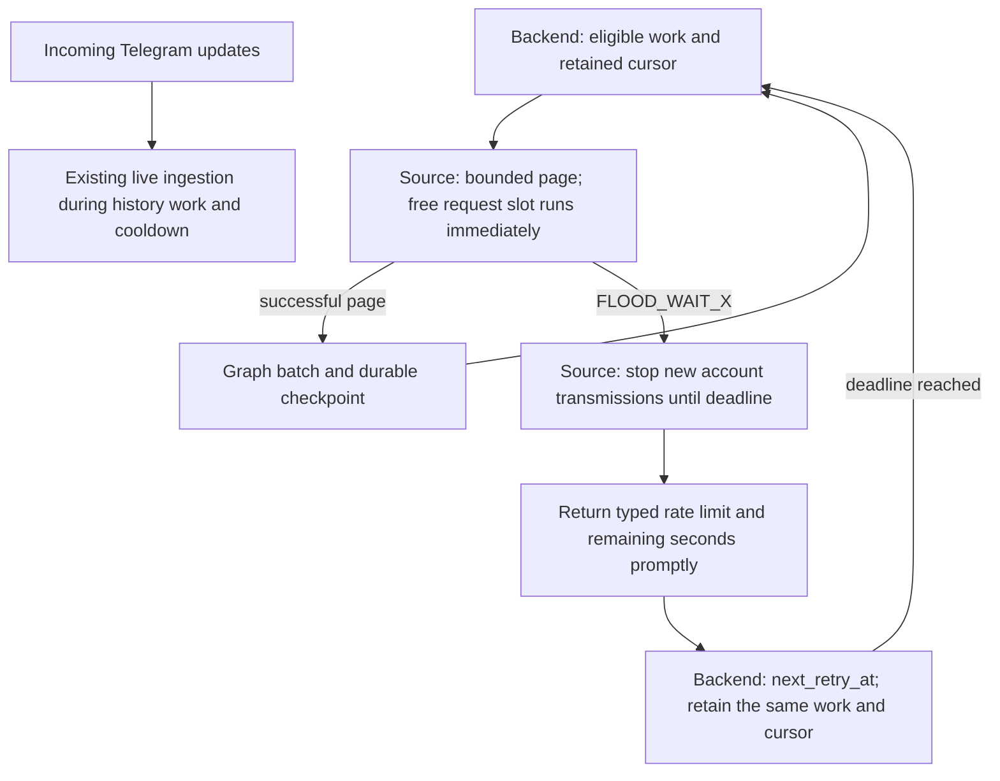

# Restore fast Telegram synchronization with provider-owned waits

Status: APPROVED  
Spec lock: sha256:0804a6ac650ba5737a8e6f4be287b8e29740481b24a253322bd7a888c1031f54 owner:2026-09-15: ИСПРАВОЯЙ ПОКА НЕ БУДЕТ РАБОТАТЬ БЫСТРО  
Implementation lock: sha256:a02e9fb07b3efc5b585bb1b1ed60fe9e17e2883cd8a75d39d7eb98d12d78be92 owner:2026-09-17 owner: ИСПРАВОЯЙ ПОКА НЕ БУДЕТ РАБОТАТЬ БЫСТРО; the live stand refused the plan answer as wider than the host frame; no SPEC change  
Active Delivery: D1  
Unattended decisions: allowed  

<!-- plan:spec:start -->
## The Goal

Restore fast, complete Telegram synchronization without inventing a provider quota. Healthy requests incur zero deliberate inter-request sleep. After a real FLOOD_WAIT, the running Source stops application transmissions for the reported duration and the existing backend schedules continuation. Completion is proved through durable Graph data, not just Source output.

Success metrics:

- **No artificial slowdown:** remove the 3,000 ms spacing, 20-starts/minute cap and fixed 2-second addition to Telegram's wait. Retain bounded concurrency and bounded queues; a free slot is usable immediately.
- **No request cascade:** zero newly transmitted application requests after observing a FLOOD_WAIT and before its deadline. Already-transmitted requests cannot be recalled. Repeated local refusals do not extend that deadline or count as new remote floods.
- **Complete history:** every expected accessible message identity in the independent mock journal exists exactly once in the Graph; short nonempty pages continue; empty terminal pages close the appropriate chat only. No blanket completion from a count estimate.
- **Responsive pages:** a full 50-dialog bootstrap and large-gap catch-up are tested against the backend's actual 30-second command deadline. Source operations yield bounded successful work with a continuation, or return a typed failure before that deadline; they do not hide an unbounded provider sweep inside one call.
- **Measured performance:** record wire requests, provider time, locally imposed wait, Source command latency, Graph write time, transaction count and durable messages/second. Compare equal synthetic workloads against both the paced anti-FLOOD baseline and the previously deployed S32 behavior; do not use improvement over our artificial slowdown as the only evidence of speed.
- **Smallest useful change:** reuse the existing SDK fence, Source pagination and host scheduler. Report production/test/SDK added and deleted lines separately. No new scheduler, rate-limit framework, UI redesign or Graph rewrite.

The request for extremely fast synchronization is a throughput goal, not permission to evade Telegram's limits. No guarantee of zero first FLOOD_WAIT, fixed real-account completion time or infinite throughput is made.

## The target

### One owner for continuation, one guard at transmission

The backend owns when to retry a Source operation. The Source owns whether this process may transmit an account request at that moment. Neither the command helper nor GramJS independently sleeps and retries a known flood behind the host's back.



Keep the existing external contract. Telegram MTProto's FLOOD_WAIT is commonly code 420, not an HTTP 429 response. Source normalizes it to the existing JSON-RPC `-32002` with `data.retry_after`; the service's existing error transport may expose HTTP 429. Do not introduce another wire error format.

```ts
// Existing boundary; names shown explicitly so wait ownership is unambiguous.
interface RateLimitReply {
  code: -32002;
  data: { retry_after: number }; // remaining seconds, rounded up
}

interface BackfillPage {
  envelopes: readonly unknown[]; // retain the existing SourceEnvelope type
  has_more: boolean;
  oldest_message_id: number | null;
  total?: number | null; // provider-reported count, never guessed from message IDs
}
```

Within the Source use monotonic time: `deadline = max(existingDeadline, observedAt + reportedSeconds * 1000)`. Remove the fixed safety addition. Only a new remote wait may extend the deadline; a late success may not clear it. A valid zero-second response reports zero without inventing a cooldown or entering an internal retry loop. Invalid or unrepresentable durations produce an explicit error and close admission rather than guess zero.

Retain one outstanding application request per account initially, without spacing after completion. Packet controls and incoming updates are not blocked by this application guard. More concurrent provider requests are a separately measured optimization, not a prerequisite for removing artificial idle time. Other accounts remain independent.

History stays page-driven. Preserve exclusive oldest-message cursors and gap-safe forward watermarks. Bound both dialog discovery and history hydration; stop before starting work that cannot fit the page budget. Never advance a durable cursor past unreturned data. A failed/unknown page is not an empty page and is never evidence of exhaustion.

Use the existing host round-robin/fair-work machinery and batch receiver. Start with its current 50-message history page. Compare 50/100/200-message candidate batch sizes on mocks, recording actual low-level requests (the SDK may split a larger request), frame sizes and Graph transactions. A larger production batch is accepted only with measured benefit and unchanged fairness/deadline limits; do not blindly restore Rust's 500-message host request.

### Candidate change map

Paths below define the SPEC boundary. Exact Tasks, dependencies and write ownership are rendered through `planctl` only after SPEC approval.

```text
magnis — catalog
  plugins/sources/telegram/src/request-admission.ts
    Remove artificial pacing; retain the account fence and exact remaining wait.
  plugins/sources/telegram/src/live.ts
    Bound/reuse dialog discovery and hydration; retain provider totals and peer cache.
  plugins/sources/telegram/src/surfaces/telegram/commands.ts
    Page bootstrap/catch-up safely; preserve backfill continuation and provider count.
  plugins/sources/telegram/src/client.ts
    Extend the existing read/deadline/result types only where bounded paging requires it.
  plugins/sources/telegram/src/tst_src_tgflood_001.test.ts
    Update healthy admission expectations, retaining all first-flood/replay/cancel proofs.
  plugins/sources/telegram/src/testing/mtproto-transport.ts
    Extend the existing low-level fake transport and clock; no high-level Telegram mock.
  plugins/sources/telegram/src/live.test.ts
  plugins/sources/telegram/src/surfaces/telegram/commands.test.ts
  plugins/sources/telegram/src/surfaces/telegram/tst_cat_tg_gap_001.test.ts
  plugins/sources/telegram/src/surfaces/telegram/execute.test.ts
    Keep existing bounded read, complete-gap and short-page regressions.

magnis-app — integration proof, no scheduler rewrite presumed
  backend/test/harness/source-sync.ts
  backend/test/harness/source-sync-postgres.ts
    Reuse the actual Nest/Source/Graph stand and isolated PostgreSQL database lease.
  backend/test/harness/source-sync-telegram.ts (new, test only)
    Connect the production Telegram Source/SDK to the existing fake transport.
  backend/test/tst_src_int_telegram_sync_001.test.ts (new)
    Three coherent end-to-end journeys: healthy, provider wait, interrupted progress.
```

Retain the already-tested SDK transmission/replay patch; do not rewrite it merely to remove the local pacing policy. Any necessary additional production file must be identified before implementation approval. Changes across the two repositories require sequential local Deliveries, not unrelated parallel PRs. No push or PR publication is authorized by this SPEC.

## Today, measured against that

Pinned references:

- Planning base: catalog `origin/staging` at `10c8060`; draft worktree `feat/telegram-fast-sync`.
- Anti-FLOOD implementation: catalog `960d2017ecaf7ffa2add2720b2ed3061b66f8506`; tested production head `cd31804a86a4828d3a3f152ccb64708d2f2b87a8`. The old plan and its historical results remain unchanged.
- Running host inspected: app `119f2bc5cffd439a8be0d44e329171adc26c7071`.
- Previously deployed S32 Source: package hash `sha256:3f5ce0dd30d41cdc069faf68c2d696e09d18d97e3e837fd18378f74bf320ea57`. Relevant later catalog changes are still mixed with uncommitted work in `smoke-catalog`; do not copy or overwrite that tree or claim it is a clean mergeable baseline.
- Last Rust Source before deletion: catalog `5c6139af876d82d9032180638f1053dc685e5c69`; deleted by `c4c6fbb`.
- Rust backend reference: app `8e2aa14b8093c44df150a7b630e2163cc2496231`.

Observed differences:

1. Rust Source `client.rs:74` sent immediately. Its send helper waited only the actual reported FLOOD duration, retrying once for waits up to 30 seconds. That helper was not an account-wide synchronization guard. Grammers' internal defaults were not independently verified.
2. Rust `commands.rs:287–343` continued every nonempty history page using exclusive `before_message_id`. This is the behavior to preserve. Rust catch-up at `commands.rs:177–210` promoted a watermark after at most 20 messages and could miss a larger gap; do not restore that defect.
3. Rust host `scheduler.rs:947` and current host `sync.page-admission.ts:315` already schedule the provider's wait. Current `sync.worker.ts:1077` distinguishes it from ordinary exponential retries. A new host rate limiter is not needed.
4. Current Source `request-admission.ts:113` adds 3 seconds between starts and caps 20/minute; `:212` adds 2 seconds to every remote wait. These are local policy, not Telegram quota data.
5. Current `LiveDialogPager.dialogPage` hydrates 50 dialogs sequentially. At the artificial 3-second spacing this takes roughly 150 seconds before network overhead, while host `source-host.client.ts:48` sets a 30-second fetch deadline. These are code-derived timings, not a performed live benchmark.
6. A host deadline failure becomes an ordinary provider failure; existing 30/60/120-second recovery can amplify the slowdown. Preserve the deadline and return bounded work/typed waits instead of raising or deleting it.
7. S32 forwards the message count; the anti-FLOOD baseline omits it. The host accepts a missing count, so synchronization can lose its numeric total without a protocol error.
8. Rust host backfill requested 500 messages and slept 2 seconds between chat rounds. Current host requests 50 and repumps eligible work fairly. Neither historical batch size nor historical delay is assumed optimal.

### Reuse and proof gap

- Reuse `AccountAdmission`, the GramJS patch, `SessionPool`, shared peer discovery, `runMcpStdio` and the existing fake transport. Preserve hidden-retry, crypto-gap, reconnect, cancellation and error-propagation coverage.
- Reuse current host `SyncWorker`, `SyncStateRepository`, Source-host cooldown handling, module batch receiver and PostgreSQL harness. Existing tests `tst_bts_sync_continuation_001f`, `tst_bts_sync_worker_001i`, `tst_bts_sync_backfill_001/002/007` and `tst_bts_src_runtime_003` cover useful pieces, not the entire combined path.
- `bootSourceSync()` currently exercises Gmail end-to-end. `tst_src_int_telegram_graph_001` supplies provider envelopes and proves module-to-Graph behavior only. There is **no existing real Telegram Source + fake MTProto + Nest + Graph fixture**; adding that connection is required work, not existing coverage.
- Before approving Tasks, pin exactly how the current Source test transport is injected into the real Source command loop under the existing host stand. It must not mock `invoke`, `getMessages`, Source results, Graph writes, the worker or scheduler. Do not introduce a second fake synchronizer. If a test-only process bridge is required, disclose that boundary and separately verify packaged Source startup; do not describe in-process proof as a real child-process run.

## Invariants and coherent acceptance journeys

### Healthy synchronization and measured overhead

Start with an empty isolated native/embedded PostgreSQL database and real registered Source/module, with no real credentials. Start the live subscription, enumerate 50 mock dialogs, ingest their initial snapshots and backfill multiple selected histories round-robin. Include histories of 120, 70 and 5 messages, a short nonempty page, and pinned metadata; inject two live arrivals while history remains unfinished.

Compare exact independent provider IDs with durable Graph IDs and displayed status/count projection. A blocked Graph transaction cannot count as saved. Duplicate delivery cannot create another identity. Completion requires terminal evidence per chat, not a coincidental count match. A restarted healthy worker continues remaining gaps without replaying the full account discovery.

Record same-workload timings against both baselines. Healthy queue admission contributes **0 ms configured delay**; requests start as soon as their predecessor completes. Include the 50-dialog case explicitly so three tiny chats cannot hide an aggregate command timeout again. Test 50/100/200 candidate batch sizes with wire-request and database-transaction counts; publish the measurements even if a larger batch is slower.

### First FLOOD, service-owned waiting and recovery

Inject real-wire-equivalent FLOOD_WAIT during discovery, history and SDK retry/replay as table-driven phases. The Source returns the remaining wait promptly; the backend retains the cursor and schedules that exact wait. No application request is sent at deadline minus 1 ms; eligible work may resume at expiry with a single outstanding request, not a queued burst. Incoming updates remain ingestible throughout.

Repeated local attempts do not change the deadline, create extra remote-flood counts or enter 30/60/120-second generic backoff. A later larger remote wait extends the hold; a shorter wait or late success does not shorten it. Exercise zero, malformed and very large durations, account isolation and in-process client replacement. Preserve the existing no-durable-Source-cooldown boundary: process death can lose the Source guard, and other clients are not coordinated. Do not add restart persistence or use restarts to evade a known hold.

### Interrupted or malformed progress

Interrupt a history read; return a malformed/nonadvancing cursor; fail a Graph commit; then recover. Failed work neither advances coverage nor counts as saved. Catch-up with more than 20 new messages preserves its committed watermark until the whole gap is accounted for. A timeout remains an explicit failure, never a successful empty page. A real provider wait remains distinct from these generic failures.

Each journey runs through the real production logic. Extend existing tests rather than creating one test for every branch. First observe RED for the missing behavior, then GREEN on the same command. Reapply the existing safety-removal negative controls after changing admission so faster traffic cannot silently disable the guard.

## Execution and live-verification boundary

- This is a new SPEC draft, not a declaration that the requested rewrite is implemented. Keep the completed anti-FLOOD plan/results intact; use `planctl` for all plan changes.
- First obtain SPEC approval, then render result-oriented PR Delivery/Stage/Task descriptions, exact files and RED commands through `planctl`; implementation starts only after that contract is approved. Independent investigation is parallel; implementation parallelism requires disjoint approved writes.
- Reuse the existing seven `agent:*` adapters already implemented with the anti-FLOOD branch when integrating it. No new process framework or duplicate launcher is part of the product change. The untouched staging hook currently runs a full catalog gate even for the initial plan commit; report this cost, do not disable the hook.
- Native/embedded PostgreSQL or a server is required for integration and any live stand. No PGlite for the app. Use temporary isolated test databases, not the existing account database.
- Do not rewrite UI, reset user data, export credentials, push, open a PR or enable live Telegram during implementation/mock validation.
- The owner's earlier clean-sync request remains the intended final check, after mocked acceptance. Begin with one selected chat, then several; monitor real waits and stop immediately on FLOOD/auth errors. Agree the bounded live request/time budget before activation; do not infer authorization for an unlimited account-wide download or intentional rate-limit probing.
- The currently saved history is preserved. A subsequent clean stand uses a separate PostgreSQL database and supported authentication; never clear a retry deadline as a shortcut or run two active sync processes for the same retained session.

## Pre-approval screen

**What changes:** healthy Telegram requests no longer carry a fabricated pacing interval; actual FLOOD_WAIT stops the account immediately and is scheduled by the existing service. Bootstrap and catch-up return bounded pages, and provider totals reach the existing progress projection.

**What proves completion:** three coherent mocked Source-to-Graph journeys on real PostgreSQL, the retained SDK safety regressions, per-stage RED/GREEN evidence, measured page/Graph timings and finally a separately bounded live check.

**What is not promised:** zero first FLOOD, unlimited speed, safety coordination with other Telegram apps, a new UI or an untested full-account reset. Neither a mock-only SDK suite nor a green build is sufficient to call the complete application fixed.
<!-- plan:spec:end -->

<!-- plan:implementation:start -->
## Implementation contract

<!-- plan:delivery:D1:start -->
<!-- plan:delivery-meta:{"active":true,"depends":[],"predictedExternalWaitMinutes":0} -->
### PR Delivery D1 — Restored fast Telegram pages and exact provider-owned waits

Branch: `feat/telegram-fast-sync`; Depends: none; Gate: backend.

Stage graph: `D1-S1 -> D1-S3; D1-S2 -> D1-S3; D1-S4 -> D1-S5; D1-S5 -> D1-S6; D1-S6 -> D1-S7; D1-S7 -> D1-S8; D1-S8 -> D1-S9; D1-S9 -> D1-S10; D1-S10 -> D1-S11; D1-S11 -> D1-S12; D1-S12 -> D1-S13; D1-S13 -> D1-S14; D1-S14 -> D1-S15`.

Forecast: 377 active min / 42 credits across 15 Stages; longest dependency path 79 active min; external waits 0 min.

Telegram uses an available account request slot immediately instead of invented three-second spacing and twenty-per-minute throttling. A real FLOOD_WAIT stops new transmissions for precisely the provider duration.

Bootstrap preserves pinned order and fifty-message previews while yielding bounded continuations; catch-up retains gaps and provider totals. Existing SDK admission, transport, and Source paging mechanisms are extended.

Real SDK wire-level mock journeys prove exact identities, deadline behavior, bounded pages and timing. Source-to-Graph proof follows in the separate app Delivery; this PR does not claim that Source output alone proves persisted progress.

No UI rewrite, new persistent cooldown, live load test, push or publication is included. Production changes remain scoped to the Telegram Source.

<!-- plan:stage:D1-S1:start -->
<!-- plan:stage-meta:{"deliveryId":"D1","depends":[],"parallelWith":["D1-S2"],"writes":["plugins/sources/telegram/src/request-admission.ts","plugins/sources/telegram/src/tst_src_tgflood_001.test.ts"],"tempRoot":".tmp/code-production/telegram-fast-sync/D1-S1","verifyActiveMinutes":3,"verifyCredits":1} -->
#### Stage D1-S1 — Removed artificial pacing while preserving account-wide provider waits

- Owner: root; Profile: strong; Depends: none; Parallel with: D1-S2.
- Writes: `plugins/sources/telegram/src/request-admission.ts`, `plugins/sources/telegram/src/tst_src_tgflood_001.test.ts`.
- Temp root: `.tmp/code-production/telegram-fast-sync/D1-S1` (must be absent at handoff).
- Predict: 38 active min / 4 credits.
- Of which verification: 3 active min / 1 credits.

Update plugins/sources/telegram/src/request-admission.ts to admit a free account slot immediately, delete 3s/20-per-minute/+2s policies, return typed zero waits without retry loops, and preserve FIFO/concurrency/queue/replay/crypto fences. Update plugins/sources/telegram/src/tst_src_tgflood_001.test.ts: healthy real SDK sends at unchanged clock time, >20 requests do not stall, exact deadline-minus-one/expiry, repeated/late/zero/malformed FLOOD and lifecycle cancellation. Preserve existing Source journeys and use wire-level mocks only.

Commit. fix(telegram): removed artificial pacing while preserving account-wide provider waits — preserve complete history and provider safety while removing unnecessary latency.

##### Tasks

- [x] TGFAST_001 — Remove invented spacing and prove exact provider waits in request-admission.ts and tst_src_tgflood_001.test.ts. (35 min) — 738b628f07d7dee3b7f15efe111089a149dfe58f
<!-- plan:task-meta:{"writes":["plugins/sources/telegram/src/request-admission.ts","plugins/sources/telegram/src/tst_src_tgflood_001.test.ts"],"predictedActiveMinutes":35,"predictedCredits":3,"how":"Update plugins/sources/telegram/src/request-admission.ts to admit a free account slot immediately, delete 3s/20-per-minute/+2s policies, return typed zero waits without retry loops, and preserve FIFO/concurrency/queue/replay/crypto fences. Update plugins/sources/telegram/src/tst_src_tgflood_001.test.ts: healthy real SDK sends at unchanged clock time, >20 requests do not stall, exact deadline-minus-one/expiry, repeated/late/zero/malformed FLOOD and lifecycle cancellation. Preserve existing Source journeys and use wire-level mocks only.","red":"bun run agent:test:backend -- plugins/sources/telegram/src/tst_src_tgflood_001.test.ts"} -->

##### Acceptance criteria

- [x] `bun run agent:test:backend -- plugins/sources/telegram/src/tst_src_tgflood_001.test.ts` exits 0 — the stated behavior journeys pass — 738b628f07d7dee3b7f15efe111089a149dfe58f
- [x] Commit — 738b628f07d7dee3b7f15efe111089a149dfe58f

##### Results

<!-- plan:results:D1-S1:start -->
| Task | Commit | UTC start-end | Active / elapsed | Usage | Result / proof |
|---|---|---|---:|---|---|
| TGFAST_001 | 738b628f07d7dee3b7f15efe111089a149dfe58f | 2026-09-15T13:19:37.011Z–2026-09-15T13:41:22.000Z | 22 / 22 min | unavailable: Runner exposes no per-stage token or credit measurement | RED 2026-09-15T13:22:59Z: real Source returned retry_after6 instead of4. RED13:29:40Z: a free healthy slot made no new transmission at unchanged clock. GREEN13:35:56Z and scoped commit gate13:41:21Z:5journeys767assertions;45realSDKtransmissions with0ms deliberately advanced clock,195history+2live IDs, exact4/3600s holds, zero-wait no automatic retry, reconnect/crypto/late-error fences, queue32 and sent-permit retention. Production+7/-23 lines;tests+54/-63;SDK patch unchanged. This proves Source/wire behavior, not durableGraph or real-account throughput. |
<!-- plan:results:D1-S1:end -->
<!-- plan:stage:D1-S1:end -->

<!-- plan:stage:D1-S2:start -->
<!-- plan:stage-meta:{"deliveryId":"D1","depends":[],"parallelWith":["D1-S1"],"writes":["plugins/sources/telegram/src/client.ts","plugins/sources/telegram/src/live.ts","plugins/sources/telegram/src/surfaces/telegram/commands.ts","plugins/sources/telegram/src/surfaces/telegram/commands.test.ts","plugins/sources/telegram/src/live.test.ts","plugins/sources/telegram/src/client.test.ts"],"tempRoot":".tmp/code-production/telegram-fast-sync/D1-S2","verifyActiveMinutes":3,"verifyCredits":1} -->
#### Stage D1-S2 — Bounded bootstrap and catch-up pages without dropping pinned chats or history

- Owner: healthy_fixture_audit; Profile: strong; Depends: none; Parallel with: D1-S1.
- Writes: `plugins/sources/telegram/src/client.ts`, `plugins/sources/telegram/src/live.ts`, `plugins/sources/telegram/src/surfaces/telegram/commands.ts`, `plugins/sources/telegram/src/surfaces/telegram/commands.test.ts`, `plugins/sources/telegram/src/live.test.ts`, `plugins/sources/telegram/src/client.test.ts`.
- Temp root: `.tmp/code-production/telegram-fast-sync/D1-S2` (must be absent at handoff).
- Predict: 51 active min / 5 credits.
- Of which verification: 3 active min / 1 credits.

Extend plugins/sources/telegram/src/client.ts and plugins/sources/telegram/src/live.ts existing paging types: discover 50 dialogs once, hydrate at most five chats of 50 messages per returned page, retain pending descriptors with OffsetPeer and provider continuation without dropping pins. A 20s page budget passes remaining timeout to operations; timeout fails without publishing candidate cursor. Extend plugins/sources/telegram/src/surfaces/telegram/commands.ts with bounded resumable catch-up and optional provider total through backfill. In plugins/sources/telegram/src/surfaces/telegram/commands.test.ts add three behavioral journeys: 50-dialog bounded hydration with pins, budget and large-gap continuation without skipped watermarks, known/null provider totals. Reuse the existing gap tests unchanged.

Commit. fix(telegram): bounded bootstrap and catch-up pages without dropping pinned chats or history — preserve complete history and provider safety while removing unnecessary latency.

Moved the already planned pool/timeout compatibility test before this Stage commit: the live.ts neighbor hook must verify the exact provider wait immediately.

##### Tasks

- [x] TGFAST_002 — Bound discovery/history work and preserve totals in client.ts, live.ts, surfaces/telegram/commands.ts and commands.test.ts. (45 min) — 43a277e691695403a464d57194fa9b0d79de90a4
<!-- plan:task-meta:{"writes":["plugins/sources/telegram/src/client.ts","plugins/sources/telegram/src/live.ts","plugins/sources/telegram/src/surfaces/telegram/commands.ts","plugins/sources/telegram/src/surfaces/telegram/commands.test.ts"],"predictedActiveMinutes":45,"predictedCredits":3,"how":"Extend plugins/sources/telegram/src/client.ts and plugins/sources/telegram/src/live.ts existing paging types: discover 50 dialogs once, hydrate at most five chats of 50 messages per returned page, retain pending descriptors with OffsetPeer and provider continuation without dropping pins. A 20s page budget passes remaining timeout to operations; timeout fails without publishing candidate cursor. Extend plugins/sources/telegram/src/surfaces/telegram/commands.ts with bounded resumable catch-up and optional provider total through backfill. In plugins/sources/telegram/src/surfaces/telegram/commands.test.ts add three behavioral journeys: 50-dialog bounded hydration with pins, budget and large-gap continuation without skipped watermarks, known/null provider totals. Reuse the existing gap tests unchanged.","red":"bun run agent:test:backend -- plugins/sources/telegram/src/surfaces/telegram/commands.test.ts"} -->
- [x] TGFAST_002B — Preserve exact provider waits through pool eviction and helper normalization in plugins/sources/telegram/src/live.test.ts and client.test.ts. (3 min) — 43a277e691695403a464d57194fa9b0d79de90a4
<!-- plan:task-meta:{"writes":["plugins/sources/telegram/src/live.test.ts","plugins/sources/telegram/src/client.test.ts"],"predictedActiveMinutes":3,"predictedCredits":1,"how":"Update plugins/sources/telegram/src/live.test.ts to expect the actual 17-second provider wait, without the removed two-second margin. Keep eviction, failed setup, retained account admission and no-transmission assertions. This compatibility proof was already in S3 and is moved before the live.ts commit hook. Update plugins/sources/telegram/src/client.test.ts existing four-second remote-wait expectation from6000 to4000ms; preserve decreasing remaining wait and no independent retry.","red":"bun run agent:test:backend -- plugins/sources/telegram/src/live.test.ts plugins/sources/telegram/src/client.test.ts"} -->

##### Acceptance criteria

- [x] `bun run agent:test:backend -- plugins/sources/telegram/src/surfaces/telegram/commands.test.ts` exits 0 — the stated behavior journeys pass — b4d6b6e40df1cb650f5feaf2d16dada9d5849b9b
- [x] `bun run agent:test:backend -- plugins/sources/telegram/src/live.test.ts plugins/sources/telegram/src/client.test.ts` exits 0 — real pool lifecycle keeps the exact provider hold — b4d6b6e40df1cb650f5feaf2d16dada9d5849b9b
- [x] Commit — b4d6b6e40df1cb650f5feaf2d16dada9d5849b9b

##### Results

<!-- plan:results:D1-S2:start -->
| Task | Commit | UTC start-end | Active / elapsed | Usage | Result / proof |
|---|---|---|---:|---|---|
| TGFAST_002 | 43a277e691695403a464d57194fa9b0d79de90a4 | 2026-09-15T13:27:13.776Z–2026-09-15T14:52:49.000Z | 70 / 86 min | unavailable: Runner exposes no per-stage token or credit measurement | Implementation43a277e plus lint-only follow-upb4d6b6e; six-path Stage union. RED: bootstrap began sixth history read, provider total78 absent, large-gap catch-up started sixth read, Saved Messages serialized as InputPeerUser, and old compatibility waits expected6/22seconds instead of4/20. GREEN14:51:22Z explicit scoped gate: TypeScript, ESLint,63tests511assertions. GREEN on committedb4d6b6e14:52:48Z: commands+unchanged gap30tests365assertions.50dialogs/2500messages over10bounded Source replies;7pins surviveJSON;147exact large-gapIDs;20second partial-page budget; rawknown78, known1equalpage, absentnull totals; cold-discovery timeout does not continue scan after last waiter expires. Source proof only; Graph proof remains separate. |
| TGFAST_002B | 43a277e691695403a464d57194fa9b0d79de90a4 | 2026-09-15T13:27:13.776Z–2026-09-15T14:52:49.000Z | 70 / 86 min | unavailable: Runner exposes no per-stage token or credit measurement | Implementation43a277e plus lint-only follow-upb4d6b6e; six-path Stage union. RED: bootstrap began sixth history read, provider total78 absent, large-gap catch-up started sixth read, Saved Messages serialized as InputPeerUser, and old compatibility waits expected6/22seconds instead of4/20. GREEN14:51:22Z explicit scoped gate: TypeScript, ESLint,63tests511assertions. GREEN on committedb4d6b6e14:52:48Z: commands+unchanged gap30tests365assertions.50dialogs/2500messages over10bounded Source replies;7pins surviveJSON;147exact large-gapIDs;20second partial-page budget; rawknown78, known1equalpage, absentnull totals; cold-discovery timeout does not continue scan after last waiter expires. Source proof only; Graph proof remains separate. |
<!-- plan:results:D1-S2:end -->
<!-- plan:stage:D1-S2:end -->

<!-- plan:stage:D1-S3:start -->
<!-- plan:stage-meta:{"deliveryId":"D1","depends":["D1-S1","D1-S2"],"parallelWith":[],"writes":["plugins/sources/telegram/src/live.ts","plugins/sources/telegram/src/tst_src_tgflood_001.test.ts","plugins/sources/telegram/src/testing/mtproto-transport.ts"],"tempRoot":".tmp/code-production/telegram-fast-sync/D1-S3","verifyActiveMinutes":3,"verifyCredits":1} -->
#### Stage D1-S3 — Verified integrated Source throughput and provider-wait regression journeys

- Owner: root; Profile: strong; Depends: D1-S1, D1-S2; Parallel with: none.
- Writes: `plugins/sources/telegram/src/live.ts`, `plugins/sources/telegram/src/tst_src_tgflood_001.test.ts`, `plugins/sources/telegram/src/testing/mtproto-transport.ts`.
- Temp root: `.tmp/code-production/telegram-fast-sync/D1-S3` (must be absent at handoff).
- Predict: 33 active min / 5 credits.
- Of which verification: 3 active min / 1 credits.

Extend plugins/sources/telegram/src/tst_src_tgflood_001.test.ts and plugins/sources/telegram/src/testing/mtproto-transport.ts real wire fixture to 50 dialogs, bounded hydrated pages and provider latency; exercise complete 120/70/5 histories and incoming live messages. Record wire count, deliberate wait, page latency, short-page continuation and exact IDs. Pool compatibility is verified in D1-S2. Compare identical workload timings against paced baseline and S32 where reproducible; label unavailable comparison, never invent measurements. Run existing SDK flood/replay/crypto tests after integrating both commits.

Commit. fix(telegram): verified integrated source throughput and provider-wait regression journeys — preserve complete history and provider safety while removing unnecessary latency.

##### Tasks

- [x] TGFAST_003 — Prove integrated fast Source journeys in tst_src_tgflood_001.test.ts using testing/mtproto-transport.ts. (25 min) — 17a99fc218a30d23944847d33a5d224929c8465b
<!-- plan:task-meta:{"writes":["plugins/sources/telegram/src/tst_src_tgflood_001.test.ts","plugins/sources/telegram/src/testing/mtproto-transport.ts"],"predictedActiveMinutes":25,"predictedCredits":3,"how":"Extend plugins/sources/telegram/src/tst_src_tgflood_001.test.ts and plugins/sources/telegram/src/testing/mtproto-transport.ts real wire fixture to 50 dialogs, bounded hydrated pages and provider latency; exercise complete 120/70/5 histories and incoming live messages. Record wire count, deliberate wait, page latency, short-page continuation and exact IDs. Pool compatibility is verified in D1-S2. Compare identical workload timings against paced baseline and S32 where reproducible; label unavailable comparison, never invent measurements. Run existing SDK flood/replay/crypto tests after integrating both commits.","red":"bun run agent:test:backend -- plugins/sources/telegram/src/tst_src_tgflood_001.test.ts"} -->


- [x] TGFAST_003B — Preserve peer-scoped dialog dates in live.ts so pagination does not skip chats. (5 min) — 17a99fc218a30d23944847d33a5d224929c8465b
<!-- plan:task-meta:{"writes":["plugins/sources/telegram/src/live.ts"],"predictedActiveMinutes":5,"predictedCredits":1,"how":"Correct inherited dialog offset dates in live.ts using the existing peerKey plus message ID, so equal IDs from different chats cannot skip later dialogs. Extend the existing real-wire journey owned by TGFAST_003 with a colliding-ID paginated response; retain the exact last-dialog peer/id/date continuation. No SPEC, wire-contract or UI changes.","red":"bun run agent:test:backend -- plugins/sources/telegram/src/tst_src_tgflood_001.test.ts"} -->

##### Acceptance criteria

- [x] `bun run agent:test:backend -- plugins/sources/telegram/src/tst_src_tgflood_001.test.ts` exits 0 — the stated behavior journeys pass — 17a99fc218a30d23944847d33a5d224929c8465b
- [x] Commit — 17a99fc218a30d23944847d33a5d224929c8465b

##### Results

<!-- plan:results:D1-S3:start -->
| Task | Commit | UTC start-end | Active / elapsed | Usage | Result / proof |
|---|---|---|---:|---|---|
| TGFAST_003 | 17a99fc218a30d23944847d33a5d224929c8465b | 2026-09-15T15:02:50.729Z–2026-09-15T15:33:06.000Z | 31 / 31 min | unavailable: Runner exposes no per-stage token or credit measurement; active time conservatively includes tool waits | RED15:04:05Z integrated timeout fixture still expected obsolete60second timer. RED after TGFAST_003B start15:22:02.531Z: real Channel collision returned offsetdate100 instead of200. GREEN15:24:43Z sevenjourneys1029assertions; explicit typecheck/lint/scoped gate15:30:33Z and normal commit hook15:33:05Z eighttests1050assertions. Peer-scoped date key corrected in live.ts(+9/-5productionlines). Tests+140/-2; fixture+1/-1; SDKpatchunchanged. Fifty dialogs, sevenpins,195history+2liveIDs,10bounded bootstrap responses, round-robinbackfill, one discovery scan. With synthetic100ms/providerresponse: requested50=>58wirecalls/5800ms/16Sourcecommands;100=>57/5700ms/15;200=>57/5700ms/15 because actualproviderpagecapped100. MaximumSourcecall600ms, maxframe41383bytes, deliberatewait0ms. No live-speed or x10claim. Existing late-FLOOD/replay/crypto/queue/zero guards remainGREEN. |
| TGFAST_003B | 17a99fc218a30d23944847d33a5d224929c8465b | 2026-09-15T15:02:50.729Z–2026-09-15T15:33:06.000Z | 31 / 31 min | unavailable: Runner exposes no per-stage token or credit measurement; active time conservatively includes tool waits | RED15:04:05Z integrated timeout fixture still expected obsolete60second timer. RED after TGFAST_003B start15:22:02.531Z: real Channel collision returned offsetdate100 instead of200. GREEN15:24:43Z sevenjourneys1029assertions; explicit typecheck/lint/scoped gate15:30:33Z and normal commit hook15:33:05Z eighttests1050assertions. Peer-scoped date key corrected in live.ts(+9/-5productionlines). Tests+140/-2; fixture+1/-1; SDKpatchunchanged. Fifty dialogs, sevenpins,195history+2liveIDs,10bounded bootstrap responses, round-robinbackfill, one discovery scan. With synthetic100ms/providerresponse: requested50=>58wirecalls/5800ms/16Sourcecommands;100=>57/5700ms/15;200=>57/5700ms/15 because actualproviderpagecapped100. MaximumSourcecall600ms, maxframe41383bytes, deliberatewait0ms. No live-speed or x10claim. Existing late-FLOOD/replay/crypto/queue/zero guards remainGREEN. |
<!-- plan:results:D1-S3:end -->
<!-- plan:stage:D1-S3:end -->

<!-- plan:stage:D1-S4:start -->
<!-- plan:stage-meta:{"deliveryId": "D1", "depends": [], "parallelWith": [], "writes": ["packages/plugin-sdk/contract/module.ts", "plugins/modules/telegram/module/service.ts", "plugins/modules/telegram/module/helpers.ts", "plugins/modules/telegram/module/__tests__/telegramIngest.test.ts", "plugins/modules/telegram/module/__tests__/chatBatchSnapshotMerge.test.ts", "plugins/modules/telegram/module/__tests__/mediaSourceRouting.test.ts"], "tempRoot": ".tmp/code-production/telegram-fast-sync/D1-S4", "verifyActiveMinutes": 5, "verifyCredits": 1} -->
#### Stage D1-S4 — Resolved packet chats through two Graph reads

- Owner: root; Profile: strong; Depends: none; Parallel with: none.
- Writes: `packages/plugin-sdk/contract/module.ts`, `plugins/modules/telegram/module/service.ts`, `plugins/modules/telegram/module/helpers.ts`, `plugins/modules/telegram/module/__tests__/telegramIngest.test.ts`, `plugins/modules/telegram/module/__tests__/chatBatchSnapshotMerge.test.ts`, `plugins/modules/telegram/module/__tests__/mediaSourceRouting.test.ts`.
- Temp root: `.tmp/code-production/telegram-fast-sync/D1-S4` (must be absent at handoff).
- Predict: 50 active min / 5 credits.
- Of which verification: 5 active min / 1 credits.

What this Stage solves. The bootstrap dialog packet carries at most fifty chats, and the module's whole-account read only started above fifty, so every existing chat cost one find_by_anchor and one get_entity: one hundred serialized host round trips per packet before a single write. The backend proof measured this as the timeout in restarted catch-up.

What is built. The SDK GraphService declares the plural find_by_anchors the backend already dispatches. The Telegram module resolves a packet's unique chat anchors with one find_by_anchors and reads the found entities with one get_entities, for chat packets and message pages alike, through one shared helper; the fifty-chat threshold and the whole-account list_entities_window scan are deleted. Field carry-over, observer edges, denorm and shouldIndex gating are unchanged.

How it is proven. tst_module_telegram_006 in telegramIngest.test.ts ingests a fifty-chat packet with existing chats and a message page across several chats and asserts exactly one find_by_anchors and one get_entities per packet, no scalar lookup, no whole-account scan and preserved previews.

Commit. fix(telegram): resolve packet chats through two Graph reads — the module asks the host for a packet's anchors once and its entities once, instead of one lookup and one read per chat.

##### Tasks

- [x] TGFAST_009 — Resolve packet chats with find_by_anchors and get_entities in service.ts and helpers.ts; declare the plural read in contract/module.ts; prove it in telegramIngest.test.ts. (40 min) — bfd0c8b6f57184fab40947224e60f11e2b8e6804
<!-- plan:task-meta:{"writes": ["packages/plugin-sdk/contract/module.ts", "plugins/modules/telegram/module/service.ts", "plugins/modules/telegram/module/helpers.ts", "plugins/modules/telegram/module/__tests__/telegramIngest.test.ts"], "predictedActiveMinutes": 40, "predictedCredits": 3, "how": "Update packages/plugin-sdk/contract/module.ts; Update plugins/modules/telegram/module/service.ts; Update plugins/modules/telegram/module/helpers.ts; Update plugins/modules/telegram/module/__tests__/telegramIngest.test.ts. Declare find_by_anchors(anchors: string[]): Promise<(string | null)[]> beside find_by_anchor on the SDK GraphService, matching the host op the backend already dispatches. In ingestChatBatch and ingestMessageBatch resolve the packet's unique chat ids with one find_by_anchors call and read the found entities with one get_entities call, through one shared private helper; delete the CHAT_BATCH_THRESHOLD whole-account list_entities_window branch and the per-chat find_by_anchor/get_entity loop. Preserve the existing field carry-over, observer edge, denorm and shouldIndex behavior. RED first in telegramIngest.test.ts: a 50-chat packet with existing chats performs exactly one find_by_anchors and one get_entities, zero find_by_anchor and zero list_entities_window, and still carries last_message_* forward; a message page across several chats reads them the same way.", "red": "bun run agent:test:backend -- plugins/modules/telegram/module/__tests__/telegramIngest.test.ts -t tst_module_telegram_006"} -->

- [x] TGFAST_009B — Retarget the strict graph doubles in chatBatchSnapshotMerge.test.ts and mediaSourceRouting.test.ts to the batched anchor and entity reads. (5 min) — bfd0c8b6f57184fab40947224e60f11e2b8e6804
<!-- plan:task-meta:{"writes": ["plugins/modules/telegram/module/__tests__/chatBatchSnapshotMerge.test.ts", "plugins/modules/telegram/module/__tests__/mediaSourceRouting.test.ts"], "predictedActiveMinutes": 5, "predictedCredits": 1, "how": "Update plugins/modules/telegram/module/__tests__/chatBatchSnapshotMerge.test.ts; Update plugins/modules/telegram/module/__tests__/mediaSourceRouting.test.ts. tst_mod_tg_ingest_001 and tst_mod_tg_ingest_002 script list_entities_window as the whole-account read and forbid the scalar lookup; script find_by_anchors and get_entities with the same chat dictionaries instead, forbid list_entities_window, and assert one anchor batch plus one entity batch per page while every preserved-field and reuse assertion stays. The media routing double gains find_by_anchors beside its existing scalar lookup.", "red": "bun run agent:test:backend -- plugins/modules/telegram/module/__tests__/chatBatchSnapshotMerge.test.ts plugins/modules/telegram/module/__tests__/mediaSourceRouting.test.ts"} -->

##### Acceptance criteria

- [x] `bun run agent:test:backend -- plugins/modules/telegram/module/__tests__/telegramIngest.test.ts` exits 0 — a packet's chats resolve through two Graph reads with no per-chat lookup or whole-account scan — bfd0c8b6f57184fab40947224e60f11e2b8e6804
- [x] Commit — bfd0c8b6f57184fab40947224e60f11e2b8e6804

##### Results

<!-- plan:results:D1-S4:start -->
| Task | Commit | UTC start-end | Active / elapsed | Usage | Result / proof |
|---|---|---|---:|---|---|
| TGFAST_009 | bfd0c8b6f57184fab40947224e60f11e2b8e6804 | 2026-09-16T09:20:37.121Z–2026-09-16T09:36:50.000Z | 16 / 16.21 min | unavailable: Runner exposes no per-stage credit meter or separate active-time measurement; active time is an elapsed upper-bound proxy | RED 09:2xZ: tst_module_telegram_006 rejected with the forbidden per-chat find_by_anchor. GREEN after the shared readChatsByAnchor helper: one find_by_anchors and one get_entities per chat packet and per message page, no scalar lookup, no list_entities_window scan; the fifty-chat threshold is deleted and the SDK declares find_by_anchors. Eleven strict doubles across three test files retargeted to the batched reads; the module lane passed 28 tests in 5 files, eslint and tsc clean. No Source change, no provider traffic, no push. |
| TGFAST_009B | bfd0c8b6f57184fab40947224e60f11e2b8e6804 | 2026-09-16T09:20:37.121Z–2026-09-16T09:36:50.000Z | 16 / 16.21 min | unavailable: Runner exposes no per-stage credit meter or separate active-time measurement; active time is an elapsed upper-bound proxy | RED 09:2xZ: tst_module_telegram_006 rejected with the forbidden per-chat find_by_anchor. GREEN after the shared readChatsByAnchor helper: one find_by_anchors and one get_entities per chat packet and per message page, no scalar lookup, no list_entities_window scan; the fifty-chat threshold is deleted and the SDK declares find_by_anchors. Eleven strict doubles across three test files retargeted to the batched reads; the module lane passed 28 tests in 5 files, eslint and tsc clean. No Source change, no provider traffic, no push. |
<!-- plan:results:D1-S4:end -->
<!-- plan:stage:D1-S4:end -->


<!-- plan:stage:D1-S5:start -->
<!-- plan:stage-meta:{"deliveryId": "D1", "depends": ["D1-S4"], "parallelWith": [], "writes": ["plugins/modules/telegram/entities.ts", "plugins/modules/telegram/entities.test.ts", "plugins/modules/telegram/types.ts", "scripts/test-connectors.sh", "scripts/tst_scripts_tgflood_001.test.ts"], "tempRoot": ".tmp/code-production/telegram-fast-sync/D1-S5", "verifyActiveMinutes": 3, "verifyCredits": 1} -->
#### Stage D1-S5 — Declared the chat index flag the module already writes

- Owner: root; Profile: strong; Depends: D1-S4; Parallel with: none.
- Writes: `plugins/modules/telegram/entities.ts`, `plugins/modules/telegram/entities.test.ts`, `plugins/modules/telegram/types.ts`, `scripts/test-connectors.sh`, `scripts/tst_scripts_tgflood_001.test.ts`.
- Temp root: `.tmp/code-production/telegram-fast-sync/D1-S5` (must be absent at handoff).
- Predict: 23 active min / 3 credits.
- Of which verification: 3 active min / 1 credits.

What this Stage solves. The module reads is_indexed from a chat's dictionary to gate media downloads and writes it through telegram.chats.set_indexed, and its ChatDetails type carries it, but the entity declaration that now replaces schemas/chat.json never listed it. The host validates every dictionary against the declaration, so a chat carrying is_indexed is rejected at apply_batch; the backend proof's Unicode regression hit this with the rebuilt archive.

What is built. The chat declaration in entities.ts adds is_indexed as an optional nullable boolean. No module logic, Source or host change.

How it is proven. tst_module_telegram_entities_003 in entities.test.ts derives the chat descriptor and asserts a dictionary with is_indexed validates and one with an unknown key still does not.

Commit. fix(telegram): declare the chat index flag the module already writes — the declaration matches the dictionary the module reads and sets.

##### Tasks

- [x] TGFAST_012 — Declare is_indexed on the chat entity in entities.ts and types.ts and prove it in entities.test.ts. (12 min) — 6ddc51ca5060b8d86045d0369099c716d20d023a
<!-- plan:task-meta:{"writes": ["plugins/modules/telegram/entities.ts", "plugins/modules/telegram/entities.test.ts", "plugins/modules/telegram/types.ts"], "predictedActiveMinutes": 12, "predictedCredits": 1, "how": "Update plugins/modules/telegram/entities.ts; Update plugins/modules/telegram/entities.test.ts. The chat declaration gains is_indexed as an optional nullable boolean, matching ChatDetails in types.ts, the shouldIndex gate and the telegram.chats.set_indexed RPC that writes it through update_properties. RED first in entities.test.ts: the derived chat descriptor must accept an is_indexed property; today it is undeclared and the host's declaration validation rejects any chat dictionary carrying it.", "red": "bun run agent:test:backend -- plugins/modules/telegram/entities.test.ts -t tst_module_telegram_entities_003"} -->

- [x] TGFAST_012B — Admit module declaration tests to the backend adapter lane in test-connectors.sh and prove it in tst_scripts_tgflood_001.test.ts. (8 min) — 6ddc51ca5060b8d86045d0369099c716d20d023a
<!-- plan:task-meta:{"writes": ["scripts/test-connectors.sh", "scripts/tst_scripts_tgflood_001.test.ts"], "predictedActiveMinutes": 8, "predictedCredits": 1, "how": "Update scripts/test-connectors.sh; Update scripts/tst_scripts_tgflood_001.test.ts. The --agent lane admits plugins/modules/*/entities.test.ts as a vitest target, exactly the path vitest.config.ts already includes, so a module's declaration test can be a Stage's RED command. RED first: tst_scripts_tgflood_002 asks the adapter to run a declaration test and expects the vitest engine instead of the unsupported-lane refusal.", "red": "bun run agent:test:backend -- scripts/tst_scripts_tgflood_001.test.ts -t tst_scripts_tgflood_002"} -->

##### Acceptance criteria

- [x] `bun run agent:test:backend -- plugins/modules/telegram/entities.test.ts` exits 0 — the chat declaration accepts is_indexed and still rejects unknown keys — 6ddc51ca5060b8d86045d0369099c716d20d023a
- [x] Commit — 6ddc51ca5060b8d86045d0369099c716d20d023a

##### Results

<!-- plan:results:D1-S5:start -->
| Task | Commit | UTC start-end | Active / elapsed | Usage | Result / proof |
|---|---|---|---:|---|---|
| TGFAST_012 | 6ddc51ca5060b8d86045d0369099c716d20d023a | 2026-09-16T09:44:06.120Z–2026-09-16T09:47:39.000Z | 3.55 / 3.55 min | unavailable: Runner exposes no per-stage credit meter or separate active-time measurement; active time is an elapsed upper-bound proxy | RED 09:44Z: the chat declaration rejected is_indexed with unrecognized_keys; RED 09:45Z: the adapter refused the declaration test with exit 64. GREEN: is_indexed declared as an optional boolean on the chat entity and mirrored in ChatDetails; the adapter routes plugins/modules/*/entities.test.ts to vitest; the declaration round-trip test regained its find_by_anchors double after S4 had left this lane unrun. tsconfig.declarations and module tsc clean, eslint clean, adapter suite 2 tests, declaration suite 4 tests. No Source or host change, no push. |
| TGFAST_012B | 6ddc51ca5060b8d86045d0369099c716d20d023a | 2026-09-16T09:44:06.120Z–2026-09-16T09:47:39.000Z | 3.55 / 3.55 min | unavailable: Runner exposes no per-stage credit meter or separate active-time measurement; active time is an elapsed upper-bound proxy | RED 09:44Z: the chat declaration rejected is_indexed with unrecognized_keys; RED 09:45Z: the adapter refused the declaration test with exit 64. GREEN: is_indexed declared as an optional boolean on the chat entity and mirrored in ChatDetails; the adapter routes plugins/modules/*/entities.test.ts to vitest; the declaration round-trip test regained its find_by_anchors double after S4 had left this lane unrun. tsconfig.declarations and module tsc clean, eslint clean, adapter suite 2 tests, declaration suite 4 tests. No Source or host change, no push. |
<!-- plan:results:D1-S5:end -->
<!-- plan:stage:D1-S5:end -->


<!-- plan:stage:D1-S6:start -->
<!-- plan:stage-meta:{"deliveryId": "D1", "depends": ["D1-S5"], "parallelWith": [], "writes": ["plugins/modules/telegram/module/__tests__/messagesGetLinks.test.ts"], "tempRoot": ".tmp/code-production/telegram-fast-sync/D1-S6", "verifyActiveMinutes": 2, "verifyCredits": 1} -->
#### Stage D1-S6 — Retargeted the message links double to the batched author read

- Owner: root; Profile: strong; Depends: D1-S5; Parallel with: none.
- Writes: `plugins/modules/telegram/module/__tests__/messagesGetLinks.test.ts`.
- Temp root: `.tmp/code-production/telegram-fast-sync/D1-S6` (must be absent at handoff).
- Predict: 8 active min / 2 credits.
- Of which verification: 2 active min / 1 credits.

What this Stage solves. The complete gate on this branch fails in tst_mod_tg_001: the merged module reads a page's author links with one list_links_for_entities call, and the older strict double in messagesGetLinks.test.ts still scripts only the singular op, so the read throws before any assertion runs.

What is built. The double scripts list_links_for_entities with the same edges; no module code changes.

How it is proven. tst_mod_tg_001 passes again with its outgoing and incoming assertions unchanged, and the complete catalog gate is green on the head.

Commit. test(telegram): script the batched author-link read in the message links double — the strict double follows the read the module makes.

##### Tasks

- [x] TGFAST_013 — Script list_links_for_entities in messagesGetLinks.test.ts so tst_mod_tg_001 follows the batched author read. (6 min) — 672daad1413740e30614d90517cd4a2214f66e35
<!-- plan:task-meta:{"writes": ["plugins/modules/telegram/module/__tests__/messagesGetLinks.test.ts"], "predictedActiveMinutes": 6, "predictedCredits": 1, "how": "Update plugins/modules/telegram/module/__tests__/messagesGetLinks.test.ts. senderNamesFor now reads a page's author links with one list_links_for_entities call (the smoke-stand correction certified by tst_module_telegram_read_005), but this older strict double still scripts the singular list_links_for_entity and throws on the plural op under the complete gate. Script list_links_for_entities with the same edges and keep every outgoing/incoming assertion.", "red": "bun run agent:test:backend -- plugins/modules/telegram/module/__tests__/messagesGetLinks.test.ts"} -->

##### Acceptance criteria

- [x] `bun run agent:test:backend -- plugins/modules/telegram/module/__tests__/messagesGetLinks.test.ts` exits 0 — the message links double follows the batched author read — 672daad1413740e30614d90517cd4a2214f66e35
- [x] Commit — 672daad1413740e30614d90517cd4a2214f66e35

##### Results

<!-- plan:results:D1-S6:start -->
| Task | Commit | UTC start-end | Active / elapsed | Usage | Result / proof |
|---|---|---|---:|---|---|
| TGFAST_013 | 672daad1413740e30614d90517cd4a2214f66e35 | 2026-09-16T09:53:46.843Z–2026-09-16T09:54:19.000Z | 0.54 / 0.54 min | unavailable: Runner exposes no per-stage credit meter or separate active-time measurement; active time is an elapsed upper-bound proxy | RED 09:53Z under the complete gate and standalone: unexpected graph op list_links_for_entities. GREEN: the double scripts the plural read beside the singular one; outgoing and incoming assertions unchanged. Test-only change. |
<!-- plan:results:D1-S6:end -->
<!-- plan:stage:D1-S6:end -->


<!-- plan:stage:D1-S7:start -->
<!-- plan:stage-meta:{"deliveryId": "D1", "depends": ["D1-S6"], "parallelWith": [], "writes": ["plugins/modules/telegram/module/service.ts", "plugins/modules/telegram/module/__tests__/telegramIngest.test.ts"], "tempRoot": ".tmp/code-production/telegram-fast-sync/D1-S7", "verifyActiveMinutes": 5, "verifyCredits": 1} -->
#### Stage D1-S7 — Live message triggers carry when the message happened

- Owner: root; Profile: strong; Depends: D1-S6; Parallel with: none.
- Writes: `plugins/modules/telegram/module/service.ts`, `plugins/modules/telegram/module/__tests__/telegramIngest.test.ts`.
- Temp root: `.tmp/code-production/telegram-fast-sync/D1-S7` (must be absent at handoff).
- Predict: 15 active min / 2 credits.
- Of which verification: 5 active min / 1 credits.

What this Stage solves. On the live smoke stand every new_message trigger check the module returns is refused by the backend: 'trigger event has no occurred_at — refusing to fire (the emitter must send it)'. The backend fails closed on purpose (INV-10: a watch is future-only), so no Telegram trigger can ever fire.

What is built. The live trigger check's context carries occurred_at, the message's own date the Source already stamps in RFC 3339.

How it is proven. The live ingest test expects occurred_at in the trigger check's context: RED before, GREEN after; the rebuilt archive is pinned by the backend stand.

Commit. fix(telegram): stamp occurred_at on live message triggers — the backend fires only for events that say when they happened.

##### Tasks

- [x] TGFAST_014 — Add occurred_at (the message date) to the new_message trigger context in service.ts; telegramIngest.test.ts expects it on the live trigger check. (10 min) — b505f617d22de615e9eca7503d71e0428a4a36ab
<!-- plan:task-meta:{"writes": ["plugins/modules/telegram/module/service.ts", "plugins/modules/telegram/module/__tests__/telegramIngest.test.ts"], "predictedActiveMinutes": 10, "predictedCredits": 1, "how": "Update plugins/modules/telegram/module/service.ts: the trigger.check context for a live message gains occurred_at from the payload's date. Update plugins/modules/telegram/module/__tests__/telegramIngest.test.ts: the live ingest expectation includes context.occurred_at. Rebuild the catalog archives and index after the change.", "red": "bun run agent:test:backend -- plugins/modules/telegram/module/__tests__/telegramIngest.test.ts"} -->

##### Acceptance criteria

- [x] `bun run agent:test:backend -- plugins/modules/telegram/module/__tests__/telegramIngest.test.ts` exits 0 — live trigger checks say when the message happened — b505f617d22de615e9eca7503d71e0428a4a36ab
- [x] Commit — b505f617d22de615e9eca7503d71e0428a4a36ab

##### Results

<!-- plan:results:D1-S7:start -->
| Task | Commit | UTC start-end | Active / elapsed | Usage | Result / proof |
|---|---|---|---:|---|---|
| TGFAST_014 | b505f617d22de615e9eca7503d71e0428a4a36ab | 2026-09-16T18:30:17.109Z–2026-09-16T18:36:40.000Z | 4 / 6.38 min | unavailable: Runner exposes no per-stage credit meter or separate active-time measurement; active time is an elapsed upper-bound proxy | RED 18:31Z: the live trigger check's context had no occurred_at. GREEN 18:33Z: context carries the message date; archives and index rebuilt, module__telegram.tgz sha 1653d232. |
<!-- plan:results:D1-S7:end -->
<!-- plan:stage:D1-S7:end -->


<!-- plan:stage:D1-S8:start -->
<!-- plan:stage-meta:{"deliveryId": "D1", "depends": ["D1-S7"], "parallelWith": [], "writes": ["plugins/sources/telegram/src/live.ts", "plugins/sources/telegram/src/surfaces/telegram/envelope.ts", "plugins/sources/telegram/src/surfaces/telegram/commands.ts", "plugins/sources/telegram/src/surfaces/telegram/commands.test.ts", "plugins/modules/telegram/entities.ts", "plugins/modules/telegram/types.ts", "plugins/modules/telegram/module/service.ts", "plugins/modules/telegram/module/__tests__/telegramRead.test.ts"], "tempRoot": ".tmp/code-production/telegram-fast-sync/D1-S8", "verifyActiveMinutes": 7, "verifyCredits": 1} -->
#### Stage D1-S8 — Every chat carries the exact message count Telegram reports

- Owner: root; Profile: strong; Depends: D1-S7; Parallel with: none.
- Writes: `plugins/sources/telegram/src/live.ts`, `plugins/sources/telegram/src/surfaces/telegram/envelope.ts`, `plugins/sources/telegram/src/surfaces/telegram/commands.ts`, `plugins/sources/telegram/src/surfaces/telegram/commands.test.ts`, `plugins/modules/telegram/entities.ts`, `plugins/modules/telegram/types.ts`, `plugins/modules/telegram/module/service.ts`, `plugins/modules/telegram/module/__tests__/telegramRead.test.ts`.
- Temp root: `.tmp/code-production/telegram-fast-sync/D1-S8` (must be absent at handoff).
- Predict: 32 active min / 3 credits.
- Of which verification: 7 active min / 1 credits.

What this Stage solves. The owner cannot plan a sync without knowing how many messages it has to download. Telegram states the exact count of every chat in each messages.getHistory answer; the Source reads it during bootstrap hydration (messages.total) and throws it away, so the chat record, the cursor and the module's chat list all carry no count and the product can only say how many messages it saved.

What is built. The Source keeps the count: on the chat record (message_count), on the chat envelope payload and in the bootstrap cursor's per-chat entry next to last_msg_id. The module declares message_count on telegram.chat, stores it with the other chat details and returns it from chats.list instead of a hard-coded null.

How it is proven. tst_src_tgfast_002 expects message_count 50 on every chat envelope and in the cursor: RED before, GREEN after. tst_module_telegram_read_001 expects message_count from the chat's details: RED on the hard-coded null, GREEN after. Archives and index rebuilt; the backend pins the new build.

Commit. feat(telegram): carry the exact per-chat message count from Telegram — the count the product needs to plan a sync.

##### Tasks

- [x] TGFAST_015 — Every chat envelope from live.ts, envelope.ts and commands.ts carries message_count equal to Telegram's GetHistory count, and so does its cursor entry; commands.test.ts proves it. (15 min) — 98438abfdf01562f039082258b1205561763b264
<!-- plan:task-meta:{"writes": ["plugins/sources/telegram/src/live.ts", "plugins/sources/telegram/src/surfaces/telegram/envelope.ts", "plugins/sources/telegram/src/surfaces/telegram/commands.ts", "plugins/sources/telegram/src/surfaces/telegram/commands.test.ts"], "predictedActiveMinutes": 15, "predictedCredits": 1, "how": "1. In plugins/sources/telegram/src/live.ts the hydration sets chat.message_count from the page's total. 2. In plugins/sources/telegram/src/surfaces/telegram/envelope.ts TgChat gains message_count and chatPayload emits it when present. 3. In plugins/sources/telegram/src/surfaces/telegram/commands.ts each cursorChats entry gains message_count. 4. Extend tst_src_tgfast_002 in plugins/sources/telegram/src/surfaces/telegram/commands.test.ts.", "red": "bun run agent:test:backend -- plugins/sources/telegram/src/surfaces/telegram/commands.test.ts"} -->
- [x] TGFAST_016 — chats.list in service.ts returns message_count from the chat details declared in entities.ts and types.ts, null only when Telegram never reported one; telegramRead.test.ts proves it. (10 min) — 98438abfdf01562f039082258b1205561763b264
<!-- plan:task-meta:{"writes": ["plugins/modules/telegram/entities.ts", "plugins/modules/telegram/types.ts", "plugins/modules/telegram/module/service.ts", "plugins/modules/telegram/module/__tests__/telegramRead.test.ts"], "predictedActiveMinutes": 10, "predictedCredits": 1, "how": "1. In plugins/modules/telegram/entities.ts and plugins/modules/telegram/types.ts declare message_count as an optional non-negative integer on the chat. 2. In plugins/modules/telegram/module/service.ts the chat list row reads message_count from the details. 3. Extend tst_module_telegram_read_001 in plugins/modules/telegram/module/__tests__/telegramRead.test.ts.", "red": "bun run agent:test:backend -- plugins/modules/telegram/module/__tests__/telegramRead.test.ts"} -->

##### Acceptance criteria

- [x] `bun run agent:test:backend -- plugins/sources/telegram/src/surfaces/telegram/commands.test.ts` exits 0 — the Source keeps the count — 98438abfdf01562f039082258b1205561763b264
- [x] `bun run agent:test:backend -- plugins/modules/telegram/module/__tests__/telegramRead.test.ts` exits 0 — the module lists it — 98438abfdf01562f039082258b1205561763b264
- [x] Commit — 98438abfdf01562f039082258b1205561763b264

##### Results

<!-- plan:results:D1-S8:start -->
| Task | Commit | UTC start-end | Active / elapsed | Usage | Result / proof |
|---|---|---|---:|---|---|
| TGFAST_015 | 98438abfdf01562f039082258b1205561763b264 | 2026-09-16T20:02:58.705Z–2026-09-16T20:08:57.000Z | 5.97 / 5.97 min | unavailable: Runner exposes no per-stage credit meter or separate active-time measurement; active time is an elapsed upper-bound proxy | RED 20:02Z: chat envelopes and cursor entries carried no message_count; chats.list returned a hard-coded null. GREEN 20:06Z: Source 27 pass, live/client/envelope/execute 82 pass, module 34 pass across 8 files, entities lane 4 pass, typecheck exit 0; archives and index rebuilt. |
| TGFAST_016 | 98438abfdf01562f039082258b1205561763b264 | 2026-09-16T20:02:58.705Z–2026-09-16T20:08:57.000Z | 5.97 / 5.97 min | unavailable: Runner exposes no per-stage credit meter or separate active-time measurement; active time is an elapsed upper-bound proxy | RED 20:02Z: chat envelopes and cursor entries carried no message_count; chats.list returned a hard-coded null. GREEN 20:06Z: Source 27 pass, live/client/envelope/execute 82 pass, module 34 pass across 8 files, entities lane 4 pass, typecheck exit 0; archives and index rebuilt. |
<!-- plan:results:D1-S8:end -->
<!-- plan:stage:D1-S8:end -->


<!-- plan:stage:D1-S9:start -->
<!-- plan:stage-meta:{"deliveryId": "D1", "depends": ["D1-S8"], "parallelWith": [], "writes": ["plugins/sources/telegram/src/dispatch.ts", "plugins/sources/telegram/src/dispatch.test.ts"], "tempRoot": ".tmp/code-production/telegram-fast-sync/D1-S9", "verifyActiveMinutes": 6, "verifyCredits": 1} -->
#### Stage D1-S9 — History pages never wait behind media downloads

- Owner: root; Profile: strong; Depends: D1-S8; Parallel with: none.
- Writes: `plugins/sources/telegram/src/dispatch.ts`, `plugins/sources/telegram/src/dispatch.test.ts`.
- Temp root: `.tmp/code-production/telegram-fast-sync/D1-S9` (must be absent at handoff).
- Predict: 20 active min / 2 credits.
- Of which verification: 6 active min / 1 credits.

What this Stage solves. On the live stand the bootstrap stalled twice for ten minutes: the Source admits eight tool calls at once, the host abandons a download_file after its 30 s deadline while the child keeps streaming the video, the host's retries open more, the eight slots fill with downloads and the next magnis.sync.fetch waits behind them until its own deadline fires and the sync reports an error.

What is built. download_file has its own small pool inside the Source's command loop; the shared eight slots serve sync fetches, listeners and actions, so a page of history is dispatched whatever the downloads are doing.

How it is proven. tst_src_tgdispatch_001 drives the real stdio loop with a resolver whose downloads never finish: eight downloads in flight, then a sync fetch; RED the fetch never answers, GREEN it answers while the downloads still run.

Commit. fix(telegram): give media downloads their own pool — a history page never waits behind a video.

##### Tasks

- [x] TGFAST_017 — download_file calls in dispatch.ts take permits from their own pool, never from the eight shared slots; dispatch.test.ts proves a sync fetch answers while eight downloads run. (14 min) — 2f8024a898eaeeb63eae8e57816834885c637f84
<!-- plan:task-meta:{"writes": ["plugins/sources/telegram/src/dispatch.ts", "plugins/sources/telegram/src/dispatch.test.ts"], "predictedActiveMinutes": 14, "predictedCredits": 1, "how": "1. In plugins/sources/telegram/src/dispatch.ts add a second semaphore for magnis.execute calls whose action is download_file and route them to it. 2. Add plugins/sources/telegram/src/dispatch.test.ts driving runMcpStdio with a fake resolver.", "red": "bun run agent:test:backend -- plugins/sources/telegram/src/dispatch.test.ts"} -->

##### Acceptance criteria

- [x] `bun run agent:test:backend -- plugins/sources/telegram/src/dispatch.test.ts` exits 0 — a sync fetch answers while eight downloads run — 2f8024a898eaeeb63eae8e57816834885c637f84
- [x] Commit — 2f8024a898eaeeb63eae8e57816834885c637f84

##### Results

<!-- plan:results:D1-S9:start -->
| Task | Commit | UTC start-end | Active / elapsed | Usage | Result / proof |
|---|---|---|---:|---|---|
| TGFAST_017 | 2f8024a898eaeeb63eae8e57816834885c637f84 | 2026-09-16T21:05:15.009Z–2026-09-16T21:18:51.000Z | 10 / 13.6 min | unavailable: Runner exposes no per-stage credit meter or separate active-time measurement; active time is an elapsed upper-bound proxy | RED 21:06Z: with eight downloads in flight the sync fetch starved. GREEN 21:14Z: the fetch answers with two downloads running and six queued in their pool; flood suite 7 pass; typecheck exit 0. |
<!-- plan:results:D1-S9:end -->
<!-- plan:stage:D1-S9:end -->


<!-- plan:stage:D1-S10:start -->
<!-- plan:stage-meta:{"deliveryId": "D1", "depends": ["D1-S9"], "parallelWith": [], "writes": ["plugins/sources/telegram/src/live.ts", "plugins/sources/telegram/src/surfaces/telegram/commands.test.ts"], "tempRoot": ".tmp/code-production/telegram-fast-sync/D1-S10", "verifyActiveMinutes": 5, "verifyCredits": 1} -->
#### Stage D1-S10 — A complete first page states the chat's count too

- Owner: root; Profile: strong; Depends: D1-S9; Parallel with: none.
- Writes: `plugins/sources/telegram/src/live.ts`, `plugins/sources/telegram/src/surfaces/telegram/commands.test.ts`.
- Temp root: `.tmp/code-production/telegram-fast-sync/D1-S10` (must be absent at handoff).
- Predict: 15 active min / 2 credits.
- Of which verification: 5 active min / 1 credits.

What this Stage solves. On the live stand 1694 of 2636 chats carry no message_count after bootstrap: Telegram answers a chat whose whole history fits the first page with messages.Messages, which has no count field, and the Source recorded a count only from MessagesSlice or ChannelMessages. For such a chat the answer IS the whole history, so its length is the exact count; without it the account total stays unknown.

What is built. getMessages sets total to the answer's length when Telegram returns messages.Messages for a first page (no offset); a count-less answer for an offset page still carries no total.

How it is proven. tst_src_tgfast_005: a first-page messages.Messages answer of three messages yields total 3, the same answer for an offset page yields no total (tst_src_tgfast_004 keeps its count-absent backfill case): RED, GREEN.

Commit. fix(telegram): a complete first page states the chat's count — messages.Messages is the whole history.

##### Tasks

- [x] TGFAST_018 — getMessages in live.ts reports total = length for a first-page messages.Messages answer and no total for an offset page; commands.test.ts proves both. (10 min) — 15c782f333160d36b912d86ccbdb25ff3f16afe5
<!-- plan:task-meta:{"writes": ["plugins/sources/telegram/src/live.ts", "plugins/sources/telegram/src/surfaces/telegram/commands.test.ts"], "predictedActiveMinutes": 10, "predictedCredits": 1, "how": "1. In plugins/sources/telegram/src/live.ts, after the count check, set total to result.messages.length when the answer is messages.Messages and no offset was requested. 2. Add tst_src_tgfast_005 to plugins/sources/telegram/src/surfaces/telegram/commands.test.ts.", "red": "bun run agent:test:backend -- plugins/sources/telegram/src/surfaces/telegram/commands.test.ts"} -->

##### Acceptance criteria

- [x] `bun run agent:test:backend -- plugins/sources/telegram/src/surfaces/telegram/commands.test.ts` exits 0 — a complete first page states the count, an offset page does not — 15c782f333160d36b912d86ccbdb25ff3f16afe5
- [x] Commit — 15c782f333160d36b912d86ccbdb25ff3f16afe5

##### Results

<!-- plan:results:D1-S10:start -->
| Task | Commit | UTC start-end | Active / elapsed | Usage | Result / proof |
|---|---|---|---:|---|---|
| TGFAST_018 | 15c782f333160d36b912d86ccbdb25ff3f16afe5 | 2026-09-16T22:23:47.862Z–2026-09-16T22:24:37.000Z | 0.82 / 0.82 min | unavailable: Runner exposes no per-stage credit meter or separate active-time measurement; active time is an elapsed upper-bound proxy | RED 22:24Z: a first-page messages.Messages answer carried no total. GREEN 22:26Z: total 3 for the complete page, none for the offset page; commands 28 pass, live/client/execute 68 pass. |
<!-- plan:results:D1-S10:end -->
<!-- plan:stage:D1-S10:end -->


<!-- plan:stage:D1-S11:start -->
<!-- plan:stage-meta:{"deliveryId": "D1", "depends": ["D1-S10"], "parallelWith": [], "writes": ["plugins/sources/telegram/src/surfaces/telegram/commands.ts", "plugins/sources/telegram/src/surfaces/telegram/commands.test.ts"], "tempRoot": ".tmp/code-production/telegram-fast-sync/D1-S11", "verifyActiveMinutes": 6, "verifyCredits": 1} -->
#### Stage D1-S11 — CatchUp keeps and refreshes every chat's count

- Owner: root; Profile: strong; Depends: D1-S10; Parallel with: none.
- Writes: `plugins/sources/telegram/src/surfaces/telegram/commands.ts`, `plugins/sources/telegram/src/surfaces/telegram/commands.test.ts`.
- Temp root: `.tmp/code-production/telegram-fast-sync/D1-S11` (must be absent at handoff).
- Predict: 18 active min / 2 credits.
- Of which verification: 6 active min / 1 credits.

What this Stage solves. CatchUp rewrites every per-chat cursor entry with the watermark alone, so the counts the bootstrap recorded vanish after the first forward walk and the account total is lost; a chat the bootstrap missed (one moved to the top while the dialog list was being paged) enters the roster through CatchUp without a count at all. On the live stand one such chat keeps the total unknown.

What is built. CatchUp carries each entry's message_count forward and replaces it with the count Telegram states in the page it reads; a chat it adds gets its count from that first read.

How it is proven. tst_src_tgfast_003 seeds counts in the cursor, has Telegram state 31 for the pages it reads, and expects every final entry to carry the count: RED (entries lose it), GREEN.

Commit. fix(telegram): CatchUp keeps and refreshes the per-chat count — the total survives every forward walk.

##### Tasks

- [x] TGFAST_019 — Every cursor entry runCatchup in commands.ts writes carries message_count, kept from the entry or refreshed from the page's count; commands.test.ts proves it across four CatchUp pages. (12 min) — 21fd6d222bda41ed26c1d16d74f64a8eac7ae148
<!-- plan:task-meta:{"writes": ["plugins/sources/telegram/src/surfaces/telegram/commands.ts", "plugins/sources/telegram/src/surfaces/telegram/commands.test.ts"], "predictedActiveMinutes": 12, "predictedCredits": 1, "how": "1. In plugins/sources/telegram/src/surfaces/telegram/commands.ts read message_count in catchupProgress and write it back in every newCursorChats assignment, replaced by messages.total when the read states one. 2. Extend tst_src_tgfast_003 in plugins/sources/telegram/src/surfaces/telegram/commands.test.ts.", "red": "bun run agent:test:backend -- plugins/sources/telegram/src/surfaces/telegram/commands.test.ts"} -->

##### Acceptance criteria

- [x] `bun run agent:test:backend -- plugins/sources/telegram/src/surfaces/telegram/commands.test.ts` exits 0 — CatchUp entries carry the count — 21fd6d222bda41ed26c1d16d74f64a8eac7ae148
- [x] Commit — 21fd6d222bda41ed26c1d16d74f64a8eac7ae148

##### Results

<!-- plan:results:D1-S11:start -->
| Task | Commit | UTC start-end | Active / elapsed | Usage | Result / proof |
|---|---|---|---:|---|---|
| TGFAST_019 | 21fd6d222bda41ed26c1d16d74f64a8eac7ae148 | 2026-09-16T23:52:09.696Z–2026-09-16T23:54:04.000Z | 1.91 / 1.91 min | unavailable: Runner exposes no per-stage credit meter or separate active-time measurement; active time is an elapsed upper-bound proxy | RED 23:53Z: the final CatchUp cursor entries carried no message_count. GREEN 23:56Z: every entry carries 31; commands 28 pass, gap+execute 31 pass, typecheck exit 0. |
<!-- plan:results:D1-S11:end -->
<!-- plan:stage:D1-S11:end -->


<!-- plan:stage:D1-S12:start -->
<!-- plan:stage-meta:{"deliveryId": "D1", "depends": ["D1-S11"], "parallelWith": [], "writes": ["plugins/modules/telegram/module/service.ts", "plugins/modules/telegram/module/helpers.ts", "plugins/modules/telegram/types.ts", "plugins/modules/telegram/module/__tests__/chatBatchSnapshotMerge.test.ts", "plugins/modules/telegram/module/__tests__/telegramIngest.test.ts", "plugins/modules/telegram/module/__tests__/syncPlan.test.ts", "plugins/sources/telegram/src/surfaces/telegram/commands.ts", "plugins/sources/telegram/src/surfaces/telegram/commands.test.ts"], "tempRoot": ".tmp/code-production/telegram-fast-sync/D1-S12", "verifyActiveMinutes": 8, "verifyCredits": 1} -->
#### Stage D1-S12 — The module owns the sync plan

- Owner: root; Profile: strong; Depends: D1-S11; Parallel with: none.
- Writes: `plugins/modules/telegram/module/service.ts`, `plugins/modules/telegram/module/helpers.ts`, `plugins/modules/telegram/types.ts`, `plugins/modules/telegram/module/__tests__/chatBatchSnapshotMerge.test.ts`, `plugins/modules/telegram/module/__tests__/telegramIngest.test.ts`, `plugins/modules/telegram/module/__tests__/syncPlan.test.ts`, `plugins/sources/telegram/src/surfaces/telegram/commands.ts`, `plugins/sources/telegram/src/surfaces/telegram/commands.test.ts`.
- Temp root: `.tmp/code-production/telegram-fast-sync/D1-S12` (must be absent at handoff).
- Predict: 48 active min / 4 credits.
- Of which verification: 8 active min / 1 credits.

What this Stage solves. The owner decided the account's second number is what the sync plans to download, so that after backfill the two numbers meet like a log; today the total sums every chat, 85 percent of it public chats the module never backfills. The module already decides admission (shouldIndex, pins) but nobody asks it for the plan. Its per-chat counts are also lost: CatchUp re-asserts a chat without message_count and the chat batch keeps only preview fields, so chats.list answers null again after the first forward walk; and a live message does not move the count.

What is built. The reserved sync method gains a sync_plan branch answering {unit:'messages', planned, excluded_scopes, excluded_items, uncounted_scopes}: admitted chats count in full, every other chat its first fifty, chats without a count are reported uncounted. The chat batch carries message_count forward like the preview fields; a live message raises its chat's count by one; CatchUp puts the entry's count on the chat envelope.

How it is proven. syncPlan.test.ts: five chats (private, small group, large group, forced on, forced off, one uncounted) yield the exact plan: RED (no branch), GREEN. tst_mod_tg_ingest_001 expects message_count kept; the live-envelope ingest test expects the chat's count raised; tst_src_tgfast_003 expects message_count on CatchUp chat envelopes: RED, GREEN.

Commit. feat(telegram): the module states its sync plan — planned messages, excluded chats, live counts.

##### Tasks

- [x] TGFAST_020 — The sync method in service.ts answers sync_plan (SyncPlan in types.ts; first page size in helpers.ts) with planned, excluded and uncounted counts by admission; syncPlan.test.ts proves it on six chats. (20 min) — e43bfae07bab2d9a2b2397c04a9cdf347337700b
<!-- plan:task-meta:{"writes": ["plugins/modules/telegram/module/service.ts", "plugins/modules/telegram/module/helpers.ts", "plugins/modules/telegram/types.ts", "plugins/modules/telegram/module/__tests__/syncPlan.test.ts"], "predictedActiveMinutes": 20, "predictedCredits": 1, "how": "0. Declare SyncPlan in plugins/modules/telegram/types.ts and BOOTSTRAP_MESSAGES_PER_CHAT in plugins/modules/telegram/module/helpers.ts. 1. In plugins/modules/telegram/module/service.ts add the sync_plan branch to ingest(): one chat window read, observed state, shouldIndex or pinned \u2192 full count, else min(50, count); no count \u2192 uncounted. 2. New plugins/modules/telegram/module/__tests__/syncPlan.test.ts with a strict graph double.", "red": "bun run agent:test:backend -- plugins/modules/telegram/module/__tests__/syncPlan.test.ts"} -->
- [x] TGFAST_021 — ingestChatBatch in service.ts keeps message_count when a re-assert omits it and a live message raises the chat's count by one; chatBatchSnapshotMerge.test.ts and telegramIngest.test.ts prove both. (12 min) — e43bfae07bab2d9a2b2397c04a9cdf347337700b
<!-- plan:task-meta:{"writes": ["plugins/modules/telegram/module/service.ts", "plugins/modules/telegram/module/__tests__/chatBatchSnapshotMerge.test.ts", "plugins/modules/telegram/module/__tests__/telegramIngest.test.ts"], "predictedActiveMinutes": 12, "predictedCredits": 1, "how": "1. In plugins/modules/telegram/module/service.ts add message_count to the carried-forward keys and, in the live branch of ingestMessageBatch, raise the chat's message_count by one. 2. Extend tst_mod_tg_ingest_001 in plugins/modules/telegram/module/__tests__/chatBatchSnapshotMerge.test.ts and the live-envelope test in plugins/modules/telegram/module/__tests__/telegramIngest.test.ts.", "red": "bun run agent:test:backend -- plugins/modules/telegram/module/__tests__/chatBatchSnapshotMerge.test.ts"} -->
- [x] TGFAST_022 — Every chat envelope runCatchup in commands.ts emits carries the entry's message_count; tst_src_tgfast_003 in commands.test.ts proves it. (8 min) — e43bfae07bab2d9a2b2397c04a9cdf347337700b
<!-- plan:task-meta:{"writes": ["plugins/sources/telegram/src/surfaces/telegram/commands.ts", "plugins/sources/telegram/src/surfaces/telegram/commands.test.ts"], "predictedActiveMinutes": 8, "predictedCredits": 1, "how": "1. In plugins/sources/telegram/src/surfaces/telegram/commands.ts set dialog.chat.message_count from the cursor entry before the chat envelope is pushed. 2. Extend tst_src_tgfast_003 in plugins/sources/telegram/src/surfaces/telegram/commands.test.ts.", "red": "bun run agent:test:backend -- plugins/sources/telegram/src/surfaces/telegram/commands.test.ts"} -->

##### Acceptance criteria

- [x] `bun run agent:test:backend -- plugins/modules/telegram/module/__tests__/syncPlan.test.ts` exits 0 — the module states its plan — e43bfae07bab2d9a2b2397c04a9cdf347337700b
- [x] `bun run agent:test:backend -- plugins/modules/telegram/module/__tests__/chatBatchSnapshotMerge.test.ts` exits 0 — counts survive a re-assert — e43bfae07bab2d9a2b2397c04a9cdf347337700b
- [x] `bun run agent:test:backend -- plugins/sources/telegram/src/surfaces/telegram/commands.test.ts` exits 0 — CatchUp envelopes carry the count — e43bfae07bab2d9a2b2397c04a9cdf347337700b
- [x] Commit — e43bfae07bab2d9a2b2397c04a9cdf347337700b

##### Results

<!-- plan:results:D1-S12:start -->
| Task | Commit | UTC start-end | Active / elapsed | Usage | Result / proof |
|---|---|---|---:|---|---|
| TGFAST_020 | e43bfae07bab2d9a2b2397c04a9cdf347337700b | 2026-09-17T06:55:23.841Z–2026-09-17T07:05:23.000Z | 10.01 / 10.01 min | unavailable: Runner exposes no per-stage credit meter or separate active-time measurement; active time is an elapsed upper-bound proxy | RED 06:57Z: no sync_plan branch (ingest returned undefined), message_count dropped by the chat batch, live message left the count at 99, CatchUp envelopes carried no count. GREEN 07:04Z: plan {planned 8570, excluded 2 chats / 886237 msgs, uncounted 1}; count kept and raised to 100; CatchUp envelopes carry 31. syncPlan 1, chatBatchSnapshotMerge 2, telegramIngest 12, commands 28 pass; module suites green; typecheck exit 0; eslint clean. |
| TGFAST_021 | e43bfae07bab2d9a2b2397c04a9cdf347337700b | 2026-09-17T06:55:23.841Z–2026-09-17T07:05:23.000Z | 10.01 / 10.01 min | unavailable: Runner exposes no per-stage credit meter or separate active-time measurement; active time is an elapsed upper-bound proxy | RED 06:57Z: no sync_plan branch (ingest returned undefined), message_count dropped by the chat batch, live message left the count at 99, CatchUp envelopes carried no count. GREEN 07:04Z: plan {planned 8570, excluded 2 chats / 886237 msgs, uncounted 1}; count kept and raised to 100; CatchUp envelopes carry 31. syncPlan 1, chatBatchSnapshotMerge 2, telegramIngest 12, commands 28 pass; module suites green; typecheck exit 0; eslint clean. |
| TGFAST_022 | e43bfae07bab2d9a2b2397c04a9cdf347337700b | 2026-09-17T06:55:23.841Z–2026-09-17T07:05:23.000Z | 10.01 / 10.01 min | unavailable: Runner exposes no per-stage credit meter or separate active-time measurement; active time is an elapsed upper-bound proxy | RED 06:57Z: no sync_plan branch (ingest returned undefined), message_count dropped by the chat batch, live message left the count at 99, CatchUp envelopes carried no count. GREEN 07:04Z: plan {planned 8570, excluded 2 chats / 886237 msgs, uncounted 1}; count kept and raised to 100; CatchUp envelopes carry 31. syncPlan 1, chatBatchSnapshotMerge 2, telegramIngest 12, commands 28 pass; module suites green; typecheck exit 0; eslint clean. |
<!-- plan:results:D1-S12:end -->
<!-- plan:stage:D1-S12:end -->


<!-- plan:stage:D1-S13:start -->
<!-- plan:stage-meta:{"deliveryId": "D1", "depends": ["D1-S12"], "parallelWith": [], "writes": ["plugins/sources/telegram/src/surfaces/telegram/commands.ts", "plugins/sources/telegram/src/surfaces/telegram/commands.test.ts"], "tempRoot": ".tmp/code-production/telegram-fast-sync/D1-S13", "verifyActiveMinutes": 4, "verifyCredits": 1} -->
#### Stage D1-S13 — CatchUp states the count of the page it read

- Owner: root; Profile: strong; Depends: D1-S12; Parallel with: none.
- Writes: `plugins/sources/telegram/src/surfaces/telegram/commands.ts`, `plugins/sources/telegram/src/surfaces/telegram/commands.test.ts`.
- Temp root: `.tmp/code-production/telegram-fast-sync/D1-S13` (must be absent at handoff).
- Predict: 12 active min / 2 credits.
- Of which verification: 4 active min / 1 credits.

What this Stage solves. On the backend's real stand the module's chat count fell back after a restart: CatchUp emitted every chat envelope with the count its cursor entry held (the bootstrap's), before reading the chat's new history whose answer stated the fresh count. The module took the older count over the one its live deliveries had raised, so the account's plan showed 195 against 197 saved.

What is built. When CatchUp reads a chat's history, the chat envelope it already placed carries the count that answer states; a chat it does not read keeps its entry's count.

How it is proven. tst_src_tgfast_003: every chat envelope the walk emits carries 31, the count of the page read for it (RED: the first page's two chats carried 10).

Commit. fix(telegram): CatchUp states the count of the page it read — a re-asserted chat never carries an older count than its own answer.

##### Tasks

- [x] TGFAST_023 — runCatchup in commands.ts restates a read chat's envelope with the count its history answer states; tst_src_tgfast_003 in commands.test.ts expects 31 on every chat envelope. (8 min) — e9682e53faeefe11fe351968223c326b22a61da2
<!-- plan:task-meta:{"writes": ["plugins/sources/telegram/src/surfaces/telegram/commands.ts", "plugins/sources/telegram/src/surfaces/telegram/commands.test.ts"], "predictedActiveMinutes": 8, "predictedCredits": 1, "how": "1. In plugins/sources/telegram/src/surfaces/telegram/commands.ts remember the chat envelope's index and replace it with chatEnvelope(dialog.chat) after messages.total arrives. 2. Tighten tst_src_tgfast_003 in plugins/sources/telegram/src/surfaces/telegram/commands.test.ts to expect 31 only.", "red": "bun run agent:test:backend -- plugins/sources/telegram/src/surfaces/telegram/commands.test.ts"} -->

##### Acceptance criteria

- [x] `bun run agent:test:backend -- plugins/sources/telegram/src/surfaces/telegram/commands.test.ts` exits 0 — a read chat carries its page's count — e9682e53faeefe11fe351968223c326b22a61da2
- [x] Commit — e9682e53faeefe11fe351968223c326b22a61da2

##### Results

<!-- plan:results:D1-S13:start -->
| Task | Commit | UTC start-end | Active / elapsed | Usage | Result / proof |
|---|---|---|---:|---|---|
| TGFAST_023 | e9682e53faeefe11fe351968223c326b22a61da2 | 2026-09-17T07:45:31.663Z–2026-09-17T07:47:15.000Z | 1.74 / 1.74 min | unavailable: Runner exposes no per-stage credit meter or separate active-time measurement; active time is an elapsed upper-bound proxy | RED 07:46Z: the first page's two chat envelopes carried the entry's 10. GREEN 07:47Z: every chat envelope carries 31; commands 28, gap and execute 31 pass; typecheck exit 0; eslint clean. |
<!-- plan:results:D1-S13:end -->
<!-- plan:stage:D1-S13:end -->


<!-- plan:stage:D1-S14:start -->
<!-- plan:stage-meta:{"deliveryId": "D1", "depends": ["D1-S13"], "parallelWith": [], "writes": ["plugins/modules/telegram/module/service.ts", "plugins/modules/telegram/module/__tests__/syncPlan.test.ts", "plugins/modules/telegram/module/__tests__/telegramCommand.test.ts"], "tempRoot": ".tmp/code-production/telegram-fast-sync/D1-S14", "verifyActiveMinutes": 6, "verifyCredits": 1} -->
#### Stage D1-S14 — The plan and the priority read pins in one window

- Owner: root; Profile: strong; Depends: D1-S13; Parallel with: none.
- Writes: `plugins/modules/telegram/module/service.ts`, `plugins/modules/telegram/module/__tests__/syncPlan.test.ts`, `plugins/modules/telegram/module/__tests__/telegramCommand.test.ts`.
- Temp root: `.tmp/code-production/telegram-fast-sync/D1-S14` (must be absent at handoff).
- Predict: 18 active min / 2 credits.
- Of which verification: 6 active min / 1 credits.

What this Stage solves. syncPlan and backfillPriorityChats read the operator's observed state one chat at a time (a list_linked traversal per chat) only to learn which chats are pinned. The host asks for both at every backfill work selection, so on the owner's 2 636-chat account each page pays thousands of graph round trips, and inside the backend's complete gate the 50-chat stand's plan asks (140-280 ms each) pushed the journeys past their 20 s windows.

What is built. A pinnedChatIds helper pages the operator's pinned chats through the existing edge-filtered chat window (proportional to the pinned set) and both the plan and the priority use it; neither traverses observed_in per chat any more.

How it is proven. tst_module_telegram_plan_001: with an operator account and a pinned large channel the plan counts it in full while list_linked is never called (RED: the double throws on list_linked). tst_module_telegram_cmd_priority: backfill_priority admits the pinned chat without list_linked (RED: same).

Commit. perf(telegram): the plan and the priority read pins in one window — no observer traversal per chat.

##### Tasks

- [x] TGFAST_024 — service.ts gains pinnedChatIds over the edge-filtered chat window; syncPlan and backfillPriorityChats use it; syncPlan.test.ts and telegramCommand.test.ts forbid list_linked. (12 min) — 8d6d370044a01aae77d4bec69c8e61d9e22f9080
<!-- plan:task-meta:{"writes": ["plugins/modules/telegram/module/service.ts", "plugins/modules/telegram/module/__tests__/syncPlan.test.ts", "plugins/modules/telegram/module/__tests__/telegramCommand.test.ts"], "predictedActiveMinutes": 12, "predictedCredits": 1, "how": "1. In plugins/modules/telegram/module/service.ts factor the pinned window loop of operatorObservedState into pinnedChatIds and call it from syncPlan and backfillPriorityChats instead of observedStateFor. 2. In syncPlan.test.ts mount an operator and a pinned chat, make list_linked throw. 3. In telegramCommand.test.ts do the same for backfill_priority.", "red": "bun run agent:test:backend -- plugins/modules/telegram/module/__tests__/syncPlan.test.ts"} -->

##### Acceptance criteria

- [x] `bun run agent:test:backend -- plugins/modules/telegram/module/__tests__/syncPlan.test.ts` exits 0 — the plan needs no per-chat traversal — 8d6d370044a01aae77d4bec69c8e61d9e22f9080
- [x] `bun run agent:test:backend -- plugins/modules/telegram/module/__tests__/telegramCommand.test.ts` exits 0 — nor does the priority — 8d6d370044a01aae77d4bec69c8e61d9e22f9080
- [x] Commit — 8d6d370044a01aae77d4bec69c8e61d9e22f9080

##### Results

<!-- plan:results:D1-S14:start -->
| Task | Commit | UTC start-end | Active / elapsed | Usage | Result / proof |
|---|---|---|---:|---|---|
| TGFAST_024 | 8d6d370044a01aae77d4bec69c8e61d9e22f9080 | 2026-09-17T08:09:08.249Z–2026-09-17T08:13:14.000Z | 4.1 / 4.1 min | unavailable: Runner exposes no per-stage credit meter or separate active-time measurement; active time is an elapsed upper-bound proxy | RED 08:10Z: both doubles rejected list_linked (the plan and the priority traversed observed_in per chat). GREEN 08:12Z: plan 8670 with the pinned channel in full through one pinned window; priority [1,3,4]; the module lane 40 pass; typecheck exit 0; eslint clean. |
<!-- plan:results:D1-S14:end -->
<!-- plan:stage:D1-S14:end -->


<!-- plan:stage:D1-S15:start -->
<!-- plan:stage-meta:{"deliveryId": "D1", "depends": ["D1-S14"], "parallelWith": [], "writes": ["plugins/modules/telegram/module/service.ts", "plugins/modules/telegram/module/__tests__/syncPlan.test.ts", "plugins/modules/telegram/module/__tests__/telegramCommand.test.ts"], "tempRoot": ".tmp/code-production/telegram-fast-sync/D1-S15", "verifyActiveMinutes": 5, "verifyCredits": 1} -->
#### Stage D1-S15 — The plan and the priority page the chat window

- Owner: root; Profile: strong; Depends: D1-S14; Parallel with: none.
- Writes: `plugins/modules/telegram/module/service.ts`, `plugins/modules/telegram/module/__tests__/syncPlan.test.ts`, `plugins/modules/telegram/module/__tests__/telegramCommand.test.ts`.
- Temp root: `.tmp/code-production/telegram-fast-sync/D1-S15` (must be absent at handoff).
- Predict: 14 active min / 2 credits.
- Of which verification: 5 active min / 1 credits.

What this Stage solves. On the owner's 2 636-chat stand the first plan ask after the update failed the catch-up run with 'plugin host frame exceeds 1048576 bytes': syncPlan and backfillPriorityChats read every chat in one window of a million, and the answer no longer fits the host's one-mebibyte frame. The priority ask had been failing the same way, silently, behind the host's fallback.

What is built. A chatsWindow helper pages the chat window five hundred at a time and refuses a window that ends before its declared total; the plan and the priority read through it.

How it is proven. tst_module_telegram_plan_001 and the priority case in tst_module_telegram_command_001: the double refuses any chat window wider than five hundred and serves offsets, and both asks still answer exactly (RED: limit 1 000 000 refused).

Commit. fix(telegram): the plan and the priority page the chat window — no answer wider than the host's frame.

##### Tasks

- [ ] TGFAST_025 — service.ts gains chatsWindow paging chats 500 at a time for syncPlan and backfillPriorityChats; syncPlan.test.ts and telegramCommand.test.ts refuse wider windows. (9 min)
<!-- plan:task-meta:{"writes": ["plugins/modules/telegram/module/service.ts", "plugins/modules/telegram/module/__tests__/syncPlan.test.ts", "plugins/modules/telegram/module/__tests__/telegramCommand.test.ts"], "predictedActiveMinutes": 9, "predictedCredits": 1, "how": "1. In plugins/modules/telegram/module/service.ts add chatsWindow() paging list_entities_window(CHAT) at 500 with the declared-total check, and use it in syncPlan and backfillPriorityChats. 2. In both test files make the unfiltered window double reject limit > 500 and slice by offset.", "red": "bun run agent:test:backend -- plugins/modules/telegram/module/__tests__/syncPlan.test.ts"} -->

##### Acceptance criteria

- [ ] `bun run agent:test:backend -- plugins/modules/telegram/module/__tests__/syncPlan.test.ts` exits 0 — the plan pages
- [ ] `bun run agent:test:backend -- plugins/modules/telegram/module/__tests__/telegramCommand.test.ts` exits 0 — the priority pages
- [ ] Commit

##### Results

<!-- plan:results:D1-S15:start -->
| Task | Commit | UTC start-end | Active / elapsed | Usage | Result / proof |
|---|---|---|---:|---|---|
<!-- plan:results:D1-S15:end -->
<!-- plan:stage:D1-S15:end -->

<!-- plan:delivery:D1:end -->
<!-- plan:implementation:end -->

<!-- plan:execution:start -->
## Execution log

- lock-spec sha256:0804a6ac650ba5737a8e6f4be287b8e29740481b24a253322bd7a888c1031f54 owner:2026-09-15: ИСПРАВОЯЙ ПОКА НЕ БУДЕТ РАБОТАТЬ БЫСТРО

- put-delivery D1

- put-stage D1-S1

- put-stage D1-S2

- put-stage D1-S3

- approve sha256:1014649347efa62c578d6261b6df2f89edf7a89c3d028c1b98eb092e9885bf4f owner:2026-09-15 owner orders immediate implementation of the published scope: ИСПРАВОЯЙ ПОКА НЕ БУДЕТ РАБОТАТЬ БЫСТРО; no additional approval loop requested

- record-result D1-S1 commit:738b628f07d7dee3b7f15efe111089a149dfe58f

- deviation D1-S1: agent-stack check failed: installed wrapper references missing /home/marketing/.local/shared/code-production/agent-stack.ts; existing seven repo agent:* adapters and frozen install worked, no framework repair added.

- close D1-S1 closed commit:738b628f07d7dee3b7f15efe111089a149dfe58f

- deviation D1-S1: Line-count correction from git diff --numstat 738b628^ 738b628: production +8/-22, tests +53/-64; prior Result prose had each side off by one. Total +61/-86 and no SDK patch change are unchanged.

- amend implementation owner:Owner 2026-09-15 orders continuing until fast; implementation sequencing correction within the already approved test scope: move existing live.test.ts compatibility work from S3 into S2 so its mandatory live.ts neighbor hook can pass; no SPEC or product scope changes. sha256:1c41d0a9428348a11f9abeb13f1e7212a239d0ae43f72b899b8af42df3f28d52

- amend implementation owner:Owner-directed continued fast-sync correction: include the existing client.test.ts four-second wait assertion in the same compatibility task, alongside live.test.ts; mandatory neighbor hook revealed its obsolete +2-second expectation. No production or SPEC expansion. sha256:8c1ca631b37af21dc32bcf5af30565c25e2938e264f00caaf4c7d81ee0979e7a

- record-result D1-S2 commit:43a277e691695403a464d57194fa9b0d79de90a4

- deviation D1-S2: Ordinary git commit43a277e ran without hook output because no core.hooksPath was configured in that worktree; no bypass was used. The agent caught remaining typing/lint issues with explicit agent:verify:commit and made follow-upb4d6b6e without rewriting history. Final explicit gate passed. Stage spans two work commits instead of one; full six-path union remains within approved writes.

- close D1-S2 closed commit:b4d6b6e40df1cb650f5feaf2d16dada9d5849b9b

- amend implementation owner:Owner orders continuing until fast and complete: ИСПРАВОЯЙ ПОКА НЕ БУДЕТ РАБОТАТЬ БЫСТРО. Add the discovered peer-scoped dialog-date correction within the existing live.ts and real-wire test scope; no SPEC changes. sha256:31b81b23c470583c4d59bdff0f26fec6f5e27ad0bc944753454ae586c4e1bf29

- record-result D1-S3 commit:17a99fc218a30d23944847d33a5d224929c8465b

- deviation D1-S3: Read-only review found an inherited cross-chat message-ID date collision. Added TGFAST_003B through planctl within existing Source scope; SPEC unchanged.

- deviation D1-S3: Old paced baseline healthy journey rerun15:24:53Z:20wirecalls,195history+2liveIDs,93assertions PASS. It does not emit comparable latency; no matched-workload speedup ratio is claimed. S32 packaged baseline is not a reproducible clean checkout and remains unmeasured. Neither missing comparison is substituted by a live benchmark.

- deviation D1-S3: Native Graph transactions and durable messages/second are measured in the separate app proof, not at this Source boundary. Active31minutes is a conservative elapsed-time allocation including orchestration/tool waits, not a metered CPU figure.

- close D1-S3 closed commit:17a99fc218a30d23944847d33a5d224929c8465b

- amend implementation owner:2026-09-16 owner merged PR 253 and ordered: сделай Pull и доеди телеграм до конца; switch the module to the batched Graph anchor read the backend already exposes; no SPEC change sha256:82e09c98f44c9214214c4799613c9b04c04f41e302bca9a7a1051b40033ed08d

- amend implementation owner:2026-09-16 owner ordered finishing Telegram; the strict graph doubles in chatBatchSnapshotMerge.test.ts and mediaSourceRouting.test.ts describe the replaced per-chat and whole-account reads and are retargeted in the same Stage as their own Task; no SPEC change sha256:c23580e144f33003af96757ab4ea5459bbcb2babe3d9e13eeb55026206ddcae9

- record-result D1-S4 commit:bfd0c8b6f57184fab40947224e60f11e2b8e6804

- deviation D1-S4: Task TGFAST_009B start (09:34:55Z) is later than the combined receipt start; the receipt uses the earliest start.

- close D1-S4 closed commit:bfd0c8b6f57184fab40947224e60f11e2b8e6804

- amend implementation owner:2026-09-16 owner ordered finishing Telegram; the backend proof's Unicode regression rejects chat dictionaries carrying the is_indexed flag the module already reads and writes, so the declaration is completed in its own Stage; no SPEC change sha256:37ef468906a21eda508685036ac504ca3992fba0146c12f6dbba9913f9302d71

- amend implementation owner:2026-09-16 owner ordered finishing Telegram; the chat details type must mirror the declaration, and the backend adapter must admit declaration tests so the Stage RED can run through it; no SPEC change sha256:888e5f8afd11e6f78e4480cbc279769bdfd2acfe8c7af61ca8eb450570f92aa5

- record-result D1-S5 commit:6ddc51ca5060b8d86045d0369099c716d20d023a

- deviation D1-S5: Task TGFAST_012B start (09:45:24Z) is later than the combined receipt start; the receipt uses the earliest start.

- deviation D1-S5: The declaration round-trip test in entities.test.ts had not run under S4 because the adapter refused its lane; S5 admits the lane and retargets that double, so the S4 result understates the tests touched.

- close D1-S5 closed commit:6ddc51ca5060b8d86045d0369099c716d20d023a

- amend implementation owner:2026-09-16 owner ordered finishing Telegram; the complete catalog gate fails on a strict double that predates the merged batched author-link read, retargeted in its own Stage; no SPEC change sha256:0df242c6e2aa8647543706c40d4dba615b78fc936d19163a6431f26ede4cf8ea

- record-result D1-S6 commit:672daad1413740e30614d90517cd4a2214f66e35

- close D1-S6 closed commit:672daad1413740e30614d90517cd4a2214f66e35

- amend implementation owner:2026-09-16 owner signed in on the smoke stand and ordered clean synchronization before any merge; the live account showed every module trigger refused for a missing occurred_at; repaired in its own Stage; no SPEC change sha256:023396194b036855555bfda9495970e7c4d3281e4ea6213cabc9736fb90b6573

- record-result D1-S7 commit:b505f617d22de615e9eca7503d71e0428a4a36ab

- close D1-S7 closed commit:b505f617d22de615e9eca7503d71e0428a4a36ab

- amend implementation owner:2026-09-16 owner: without the number of messages to download the sync cannot be planned; an estimate is unacceptable; the exact per-chat count Telegram reports must be kept and shown; no SPEC change sha256:0c278318f332ebe6f87503b86f6e3806a48cd80d87b6f858e86de4de2342b1b4

- record-result D1-S8 commit:98438abfdf01562f039082258b1205561763b264

- close D1-S8 closed commit:98438abfdf01562f039082258b1205561763b264

- amend implementation owner:2026-09-16 owner ordered clean live synchronization; the stand stalled behind media downloads twice; repaired in its own Stage; no SPEC change sha256:30f4b809076bb46ed57f6629b1028b4e83be88b6f94341877c1e85f8f3837843

- record-result D1-S9 commit:2f8024a898eaeeb63eae8e57816834885c637f84

- close D1-S9 closed commit:2f8024a898eaeeb63eae8e57816834885c637f84

- amend implementation owner:2026-09-16 owner: the exact per-chat count must be known for every chat; small chats answered without a count field were left uncounted; repaired in its own Stage; no SPEC change sha256:ccf2e8119b6fbe055892da4dae387f05255fd10dd62a89ff33ec9e2a765dd84b

- record-result D1-S10 commit:15c782f333160d36b912d86ccbdb25ff3f16afe5

- close D1-S10 closed commit:15c782f333160d36b912d86ccbdb25ff3f16afe5

- amend implementation owner:2026-09-16 owner: every chat's exact count must be known and shown; CatchUp erased it and a missed chat had none; repaired in its own Stage; no SPEC change sha256:3a5e2375b0e4a9fc04cf67fa1f49c75d306bc4121fad32a162bbcc42e205a4d6

- record-result D1-S11 commit:21fd6d222bda41ed26c1d16d74f64a8eac7ae148

- close D1-S11 closed commit:21fd6d222bda41ed26c1d16d74f64a8eac7ae148

- amend implementation owner:2026-09-17 owner: the second number is what the sync plans to download so the two numbers meet like a log after backfill; live messages count; the module decides admission and states the plan; no SPEC change sha256:9c854f83ccda56a5bd823b7d234d404d8fa5960c8304c12783a51d828542196b

- amend implementation owner:2026-09-17 owner: показывать количество только того что запланировано; the plan shape lives in types.ts and the first-page size in helpers.ts, both written by this Stage; no SPEC change sha256:95b92827227649dd51b1d50e891bae6ae882129102ededa93af20b73f421d662

- record-result D1-S12 commit:e43bfae07bab2d9a2b2397c04a9cdf347337700b

- deviation D1-S12: scope: plugins/modules/telegram/module/helpers.ts (BOOTSTRAP_MESSAGES_PER_CHAT) and plugins/modules/telegram/types.ts (SyncPlan) were needed for the plan shape; the Stage writes were amended to name them before this result was recorded.

- close D1-S12 closed commit:e43bfae07bab2d9a2b2397c04a9cdf347337700b

- amend implementation owner:2026-09-17 owner: если какое-то сообщение приходит … тоже был счетчик; the backend stand showed CatchUp re-asserting an older count; no SPEC change sha256:f16fdd5d68f8f925c89c039b42e21750d94fb4bd0f39b9e3624549c1589af2d6

- record-result D1-S13 commit:e9682e53faeefe11fe351968223c326b22a61da2

- close D1-S13 closed commit:e9682e53faeefe11fe351968223c326b22a61da2

- amend implementation owner:2026-09-17 owner: ИСПРАВОЯЙ ПОКА НЕ БУДЕТ РАБОТАТЬ БЫСТРО; the plan ask must not cost a traversal per chat; no SPEC change sha256:1a4f4141748a0a24a24585e7ae5e96dfbda0bd36b4516d94f13eae8b3fdb8674

- record-result D1-S14 commit:8d6d370044a01aae77d4bec69c8e61d9e22f9080

- close D1-S14 closed commit:8d6d370044a01aae77d4bec69c8e61d9e22f9080

- amend implementation owner:2026-09-17 owner: ИСПРАВОЯЙ ПОКА НЕ БУДЕТ РАБОТАТЬ БЫСТРО; the live stand refused the plan answer as wider than the host frame; no SPEC change sha256:a02e9fb07b3efc5b585bb1b1ed60fe9e17e2883cd8a75d39d7eb98d12d78be92
<!-- plan:execution:end -->
