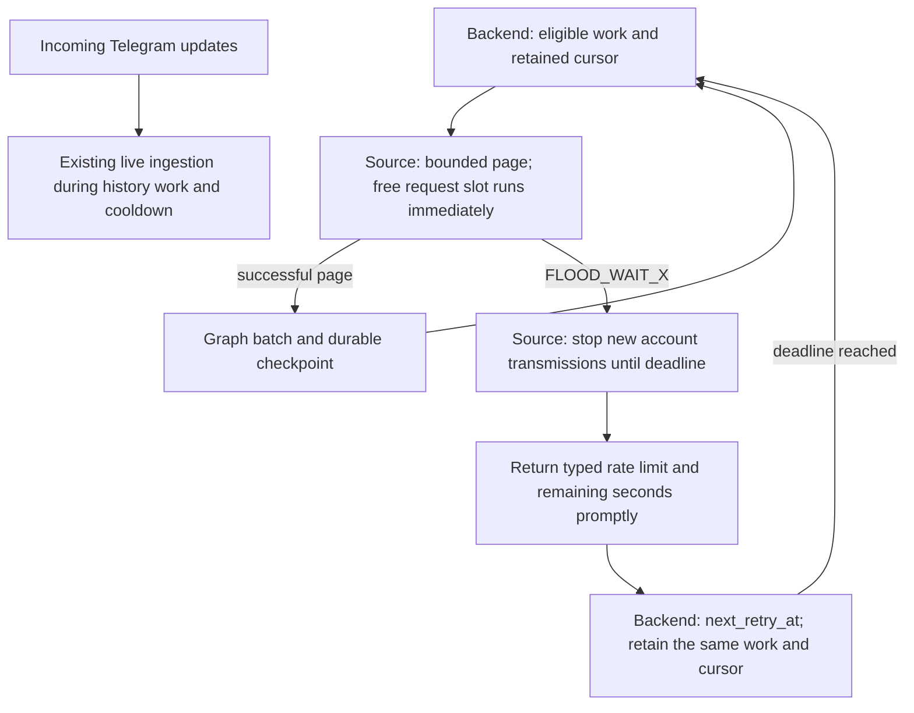

# Restore fast Telegram synchronization with provider-owned waits

Status: APPROVED  
Spec lock: sha256:0804a6ac650ba5737a8e6f4be287b8e29740481b24a253322bd7a888c1031f54 owner:2026-09-15: ИСПРАВОЯЙ ПОКА НЕ БУДЕТ РАБОТАТЬ БЫСТРО  
Implementation lock: sha256:31b81b23c470583c4d59bdff0f26fec6f5e27ad0bc944753454ae586c4e1bf29 owner:Owner orders continuing until fast and complete: ИСПРАВОЯЙ ПОКА НЕ БУДЕТ РАБОТАТЬ БЫСТРО. Add the discovered peer-scoped dialog-date correction within the existing live.ts and real-wire test scope; no SPEC changes.  
Active Delivery: D1  
Unattended decisions: allowed  

<!-- plan:spec:start -->
## The Goal

Restore fast, complete Telegram synchronization without inventing a provider quota. Healthy requests incur zero deliberate inter-request sleep. After a real FLOOD_WAIT, the running Source stops application transmissions for the reported duration and the existing backend schedules continuation. Completion is proved through durable Graph data, not just Source output.

Success metrics:

- **No artificial slowdown:** remove the 3,000 ms spacing, 20-starts/minute cap and fixed 2-second addition to Telegram's wait. Retain bounded concurrency and bounded queues; a free slot is usable immediately.
- **No request cascade:** zero newly transmitted application requests after observing a FLOOD_WAIT and before its deadline. Already-transmitted requests cannot be recalled. Repeated local refusals do not extend that deadline or count as new remote floods.
- **Complete history:** every expected accessible message identity in the independent mock journal exists exactly once in the Graph; short nonempty pages continue; empty terminal pages close the appropriate chat only. No blanket completion from a count estimate.
- **Responsive pages:** a full 50-dialog bootstrap and large-gap catch-up are tested against the backend's actual 30-second command deadline. Source operations yield bounded successful work with a continuation, or return a typed failure before that deadline; they do not hide an unbounded provider sweep inside one call.
- **Measured performance:** record wire requests, provider time, locally imposed wait, Source command latency, Graph write time, transaction count and durable messages/second. Compare equal synthetic workloads against both the paced anti-FLOOD baseline and the previously deployed S32 behavior; do not use improvement over our artificial slowdown as the only evidence of speed.
- **Smallest useful change:** reuse the existing SDK fence, Source pagination and host scheduler. Report production/test/SDK added and deleted lines separately. No new scheduler, rate-limit framework, UI redesign or Graph rewrite.

The request for extremely fast synchronization is a throughput goal, not permission to evade Telegram's limits. No guarantee of zero first FLOOD_WAIT, fixed real-account completion time or infinite throughput is made.

## The target

### One owner for continuation, one guard at transmission

The backend owns when to retry a Source operation. The Source owns whether this process may transmit an account request at that moment. Neither the command helper nor GramJS independently sleeps and retries a known flood behind the host's back.



Keep the existing external contract. Telegram MTProto's FLOOD_WAIT is commonly code 420, not an HTTP 429 response. Source normalizes it to the existing JSON-RPC `-32002` with `data.retry_after`; the service's existing error transport may expose HTTP 429. Do not introduce another wire error format.

```ts
// Existing boundary; names shown explicitly so wait ownership is unambiguous.
interface RateLimitReply {
  code: -32002;
  data: { retry_after: number }; // remaining seconds, rounded up
}

interface BackfillPage {
  envelopes: readonly unknown[]; // retain the existing SourceEnvelope type
  has_more: boolean;
  oldest_message_id: number | null;
  total?: number | null; // provider-reported count, never guessed from message IDs
}
```

Within the Source use monotonic time: `deadline = max(existingDeadline, observedAt + reportedSeconds * 1000)`. Remove the fixed safety addition. Only a new remote wait may extend the deadline; a late success may not clear it. A valid zero-second response reports zero without inventing a cooldown or entering an internal retry loop. Invalid or unrepresentable durations produce an explicit error and close admission rather than guess zero.

Retain one outstanding application request per account initially, without spacing after completion. Packet controls and incoming updates are not blocked by this application guard. More concurrent provider requests are a separately measured optimization, not a prerequisite for removing artificial idle time. Other accounts remain independent.

History stays page-driven. Preserve exclusive oldest-message cursors and gap-safe forward watermarks. Bound both dialog discovery and history hydration; stop before starting work that cannot fit the page budget. Never advance a durable cursor past unreturned data. A failed/unknown page is not an empty page and is never evidence of exhaustion.

Use the existing host round-robin/fair-work machinery and batch receiver. Start with its current 50-message history page. Compare 50/100/200-message candidate batch sizes on mocks, recording actual low-level requests (the SDK may split a larger request), frame sizes and Graph transactions. A larger production batch is accepted only with measured benefit and unchanged fairness/deadline limits; do not blindly restore Rust's 500-message host request.

### Candidate change map

Paths below define the SPEC boundary. Exact Tasks, dependencies and write ownership are rendered through `planctl` only after SPEC approval.

```text
magnis — catalog
  plugins/sources/telegram/src/request-admission.ts
    Remove artificial pacing; retain the account fence and exact remaining wait.
  plugins/sources/telegram/src/live.ts
    Bound/reuse dialog discovery and hydration; retain provider totals and peer cache.
  plugins/sources/telegram/src/surfaces/telegram/commands.ts
    Page bootstrap/catch-up safely; preserve backfill continuation and provider count.
  plugins/sources/telegram/src/client.ts
    Extend the existing read/deadline/result types only where bounded paging requires it.
  plugins/sources/telegram/src/tst_src_tgflood_001.test.ts
    Update healthy admission expectations, retaining all first-flood/replay/cancel proofs.
  plugins/sources/telegram/src/testing/mtproto-transport.ts
    Extend the existing low-level fake transport and clock; no high-level Telegram mock.
  plugins/sources/telegram/src/live.test.ts
  plugins/sources/telegram/src/surfaces/telegram/commands.test.ts
  plugins/sources/telegram/src/surfaces/telegram/tst_cat_tg_gap_001.test.ts
  plugins/sources/telegram/src/surfaces/telegram/execute.test.ts
    Keep existing bounded read, complete-gap and short-page regressions.

magnis-app — integration proof, no scheduler rewrite presumed
  backend/test/harness/source-sync.ts
  backend/test/harness/source-sync-postgres.ts
    Reuse the actual Nest/Source/Graph stand and isolated PostgreSQL database lease.
  backend/test/harness/source-sync-telegram.ts (new, test only)
    Connect the production Telegram Source/SDK to the existing fake transport.
  backend/test/tst_src_int_telegram_sync_001.test.ts (new)
    Three coherent end-to-end journeys: healthy, provider wait, interrupted progress.
```

Retain the already-tested SDK transmission/replay patch; do not rewrite it merely to remove the local pacing policy. Any necessary additional production file must be identified before implementation approval. Changes across the two repositories require sequential local Deliveries, not unrelated parallel PRs. No push or PR publication is authorized by this SPEC.

## Today, measured against that

Pinned references:

- Planning base: catalog `origin/staging` at `10c8060`; draft worktree `feat/telegram-fast-sync`.
- Anti-FLOOD implementation: catalog `960d2017ecaf7ffa2add2720b2ed3061b66f8506`; tested production head `cd31804a86a4828d3a3f152ccb64708d2f2b87a8`. The old plan and its historical results remain unchanged.
- Running host inspected: app `119f2bc5cffd439a8be0d44e329171adc26c7071`.
- Previously deployed S32 Source: package hash `sha256:3f5ce0dd30d41cdc069faf68c2d696e09d18d97e3e837fd18378f74bf320ea57`. Relevant later catalog changes are still mixed with uncommitted work in `smoke-catalog`; do not copy or overwrite that tree or claim it is a clean mergeable baseline.
- Last Rust Source before deletion: catalog `5c6139af876d82d9032180638f1053dc685e5c69`; deleted by `c4c6fbb`.
- Rust backend reference: app `8e2aa14b8093c44df150a7b630e2163cc2496231`.

Observed differences:

1. Rust Source `client.rs:74` sent immediately. Its send helper waited only the actual reported FLOOD duration, retrying once for waits up to 30 seconds. That helper was not an account-wide synchronization guard. Grammers' internal defaults were not independently verified.
2. Rust `commands.rs:287–343` continued every nonempty history page using exclusive `before_message_id`. This is the behavior to preserve. Rust catch-up at `commands.rs:177–210` promoted a watermark after at most 20 messages and could miss a larger gap; do not restore that defect.
3. Rust host `scheduler.rs:947` and current host `sync.page-admission.ts:315` already schedule the provider's wait. Current `sync.worker.ts:1077` distinguishes it from ordinary exponential retries. A new host rate limiter is not needed.
4. Current Source `request-admission.ts:113` adds 3 seconds between starts and caps 20/minute; `:212` adds 2 seconds to every remote wait. These are local policy, not Telegram quota data.
5. Current `LiveDialogPager.dialogPage` hydrates 50 dialogs sequentially. At the artificial 3-second spacing this takes roughly 150 seconds before network overhead, while host `source-host.client.ts:48` sets a 30-second fetch deadline. These are code-derived timings, not a performed live benchmark.
6. A host deadline failure becomes an ordinary provider failure; existing 30/60/120-second recovery can amplify the slowdown. Preserve the deadline and return bounded work/typed waits instead of raising or deleting it.
7. S32 forwards the message count; the anti-FLOOD baseline omits it. The host accepts a missing count, so synchronization can lose its numeric total without a protocol error.
8. Rust host backfill requested 500 messages and slept 2 seconds between chat rounds. Current host requests 50 and repumps eligible work fairly. Neither historical batch size nor historical delay is assumed optimal.

### Reuse and proof gap

- Reuse `AccountAdmission`, the GramJS patch, `SessionPool`, shared peer discovery, `runMcpStdio` and the existing fake transport. Preserve hidden-retry, crypto-gap, reconnect, cancellation and error-propagation coverage.
- Reuse current host `SyncWorker`, `SyncStateRepository`, Source-host cooldown handling, module batch receiver and PostgreSQL harness. Existing tests `tst_bts_sync_continuation_001f`, `tst_bts_sync_worker_001i`, `tst_bts_sync_backfill_001/002/007` and `tst_bts_src_runtime_003` cover useful pieces, not the entire combined path.
- `bootSourceSync()` currently exercises Gmail end-to-end. `tst_src_int_telegram_graph_001` supplies provider envelopes and proves module-to-Graph behavior only. There is **no existing real Telegram Source + fake MTProto + Nest + Graph fixture**; adding that connection is required work, not existing coverage.
- Before approving Tasks, pin exactly how the current Source test transport is injected into the real Source command loop under the existing host stand. It must not mock `invoke`, `getMessages`, Source results, Graph writes, the worker or scheduler. Do not introduce a second fake synchronizer. If a test-only process bridge is required, disclose that boundary and separately verify packaged Source startup; do not describe in-process proof as a real child-process run.

## Invariants and coherent acceptance journeys

### Healthy synchronization and measured overhead

Start with an empty isolated native/embedded PostgreSQL database and real registered Source/module, with no real credentials. Start the live subscription, enumerate 50 mock dialogs, ingest their initial snapshots and backfill multiple selected histories round-robin. Include histories of 120, 70 and 5 messages, a short nonempty page, and pinned metadata; inject two live arrivals while history remains unfinished.

Compare exact independent provider IDs with durable Graph IDs and displayed status/count projection. A blocked Graph transaction cannot count as saved. Duplicate delivery cannot create another identity. Completion requires terminal evidence per chat, not a coincidental count match. A restarted healthy worker continues remaining gaps without replaying the full account discovery.

Record same-workload timings against both baselines. Healthy queue admission contributes **0 ms configured delay**; requests start as soon as their predecessor completes. Include the 50-dialog case explicitly so three tiny chats cannot hide an aggregate command timeout again. Test 50/100/200 candidate batch sizes with wire-request and database-transaction counts; publish the measurements even if a larger batch is slower.

### First FLOOD, service-owned waiting and recovery

Inject real-wire-equivalent FLOOD_WAIT during discovery, history and SDK retry/replay as table-driven phases. The Source returns the remaining wait promptly; the backend retains the cursor and schedules that exact wait. No application request is sent at deadline minus 1 ms; eligible work may resume at expiry with a single outstanding request, not a queued burst. Incoming updates remain ingestible throughout.

Repeated local attempts do not change the deadline, create extra remote-flood counts or enter 30/60/120-second generic backoff. A later larger remote wait extends the hold; a shorter wait or late success does not shorten it. Exercise zero, malformed and very large durations, account isolation and in-process client replacement. Preserve the existing no-durable-Source-cooldown boundary: process death can lose the Source guard, and other clients are not coordinated. Do not add restart persistence or use restarts to evade a known hold.

### Interrupted or malformed progress

Interrupt a history read; return a malformed/nonadvancing cursor; fail a Graph commit; then recover. Failed work neither advances coverage nor counts as saved. Catch-up with more than 20 new messages preserves its committed watermark until the whole gap is accounted for. A timeout remains an explicit failure, never a successful empty page. A real provider wait remains distinct from these generic failures.

Each journey runs through the real production logic. Extend existing tests rather than creating one test for every branch. First observe RED for the missing behavior, then GREEN on the same command. Reapply the existing safety-removal negative controls after changing admission so faster traffic cannot silently disable the guard.

## Execution and live-verification boundary

- This is a new SPEC draft, not a declaration that the requested rewrite is implemented. Keep the completed anti-FLOOD plan/results intact; use `planctl` for all plan changes.
- First obtain SPEC approval, then render result-oriented PR Delivery/Stage/Task descriptions, exact files and RED commands through `planctl`; implementation starts only after that contract is approved. Independent investigation is parallel; implementation parallelism requires disjoint approved writes.
- Reuse the existing seven `agent:*` adapters already implemented with the anti-FLOOD branch when integrating it. No new process framework or duplicate launcher is part of the product change. The untouched staging hook currently runs a full catalog gate even for the initial plan commit; report this cost, do not disable the hook.
- Native/embedded PostgreSQL or a server is required for integration and any live stand. No PGlite for the app. Use temporary isolated test databases, not the existing account database.
- Do not rewrite UI, reset user data, export credentials, push, open a PR or enable live Telegram during implementation/mock validation.
- The owner's earlier clean-sync request remains the intended final check, after mocked acceptance. Begin with one selected chat, then several; monitor real waits and stop immediately on FLOOD/auth errors. Agree the bounded live request/time budget before activation; do not infer authorization for an unlimited account-wide download or intentional rate-limit probing.
- The currently saved history is preserved. A subsequent clean stand uses a separate PostgreSQL database and supported authentication; never clear a retry deadline as a shortcut or run two active sync processes for the same retained session.

## Pre-approval screen

**What changes:** healthy Telegram requests no longer carry a fabricated pacing interval; actual FLOOD_WAIT stops the account immediately and is scheduled by the existing service. Bootstrap and catch-up return bounded pages, and provider totals reach the existing progress projection.

**What proves completion:** three coherent mocked Source-to-Graph journeys on real PostgreSQL, the retained SDK safety regressions, per-stage RED/GREEN evidence, measured page/Graph timings and finally a separately bounded live check.

**What is not promised:** zero first FLOOD, unlimited speed, safety coordination with other Telegram apps, a new UI or an untested full-account reset. Neither a mock-only SDK suite nor a green build is sufficient to call the complete application fixed.
<!-- plan:spec:end -->

<!-- plan:implementation:start -->
## Implementation contract

<!-- plan:delivery:D1:start -->
<!-- plan:delivery-meta:{"active":true,"depends":[],"predictedExternalWaitMinutes":0} -->
### PR Delivery D1 — Restored fast Telegram pages and exact provider-owned waits

Branch: `feat/telegram-fast-sync`; Depends: none; Gate: backend.

Stage graph: `D1-S1 -> D1-S3; D1-S2 -> D1-S3`.

Forecast: 117 active min / 13 credits across 3 Stages; longest dependency path 79 active min; external waits 0 min.

Telegram uses an available account request slot immediately instead of invented three-second spacing and twenty-per-minute throttling. A real FLOOD_WAIT stops new transmissions for precisely the provider duration.

Bootstrap preserves pinned order and fifty-message previews while yielding bounded continuations; catch-up retains gaps and provider totals. Existing SDK admission, transport, and Source paging mechanisms are extended.

Real SDK wire-level mock journeys prove exact identities, deadline behavior, bounded pages and timing. Source-to-Graph proof follows in the separate app Delivery; this PR does not claim that Source output alone proves persisted progress.

No UI rewrite, new persistent cooldown, live load test, push or publication is included. Production changes remain scoped to the Telegram Source.

<!-- plan:stage:D1-S1:start -->
<!-- plan:stage-meta:{"deliveryId":"D1","depends":[],"parallelWith":["D1-S2"],"writes":["plugins/sources/telegram/src/request-admission.ts","plugins/sources/telegram/src/tst_src_tgflood_001.test.ts"],"tempRoot":".tmp/code-production/telegram-fast-sync/D1-S1","verifyActiveMinutes":3,"verifyCredits":1} -->
#### Stage D1-S1 — Removed artificial pacing while preserving account-wide provider waits

- Owner: root; Profile: strong; Depends: none; Parallel with: D1-S2.
- Writes: `plugins/sources/telegram/src/request-admission.ts`, `plugins/sources/telegram/src/tst_src_tgflood_001.test.ts`.
- Temp root: `.tmp/code-production/telegram-fast-sync/D1-S1` (must be absent at handoff).
- Predict: 38 active min / 4 credits.
- Of which verification: 3 active min / 1 credits.

Update plugins/sources/telegram/src/request-admission.ts to admit a free account slot immediately, delete 3s/20-per-minute/+2s policies, return typed zero waits without retry loops, and preserve FIFO/concurrency/queue/replay/crypto fences. Update plugins/sources/telegram/src/tst_src_tgflood_001.test.ts: healthy real SDK sends at unchanged clock time, >20 requests do not stall, exact deadline-minus-one/expiry, repeated/late/zero/malformed FLOOD and lifecycle cancellation. Preserve existing Source journeys and use wire-level mocks only.

Commit. fix(telegram): removed artificial pacing while preserving account-wide provider waits — preserve complete history and provider safety while removing unnecessary latency.

##### Tasks

- [x] TGFAST_001 — Remove invented spacing and prove exact provider waits in request-admission.ts and tst_src_tgflood_001.test.ts. (35 min) — 738b628f07d7dee3b7f15efe111089a149dfe58f
<!-- plan:task-meta:{"writes":["plugins/sources/telegram/src/request-admission.ts","plugins/sources/telegram/src/tst_src_tgflood_001.test.ts"],"predictedActiveMinutes":35,"predictedCredits":3,"how":"Update plugins/sources/telegram/src/request-admission.ts to admit a free account slot immediately, delete 3s/20-per-minute/+2s policies, return typed zero waits without retry loops, and preserve FIFO/concurrency/queue/replay/crypto fences. Update plugins/sources/telegram/src/tst_src_tgflood_001.test.ts: healthy real SDK sends at unchanged clock time, >20 requests do not stall, exact deadline-minus-one/expiry, repeated/late/zero/malformed FLOOD and lifecycle cancellation. Preserve existing Source journeys and use wire-level mocks only.","red":"bun run agent:test:backend -- plugins/sources/telegram/src/tst_src_tgflood_001.test.ts"} -->

##### Acceptance criteria

- [x] `bun run agent:test:backend -- plugins/sources/telegram/src/tst_src_tgflood_001.test.ts` exits 0 — the stated behavior journeys pass — 738b628f07d7dee3b7f15efe111089a149dfe58f
- [x] Commit — 738b628f07d7dee3b7f15efe111089a149dfe58f

##### Results

<!-- plan:results:D1-S1:start -->
| Task | Commit | UTC start-end | Active / elapsed | Usage | Result / proof |
|---|---|---|---:|---|---|
| TGFAST_001 | 738b628f07d7dee3b7f15efe111089a149dfe58f | 2026-09-15T13:19:37.011Z–2026-09-15T13:41:22.000Z | 22 / 22 min | unavailable: Runner exposes no per-stage token or credit measurement | RED 2026-09-15T13:22:59Z: real Source returned retry_after6 instead of4. RED13:29:40Z: a free healthy slot made no new transmission at unchanged clock. GREEN13:35:56Z and scoped commit gate13:41:21Z:5journeys767assertions;45realSDKtransmissions with0ms deliberately advanced clock,195history+2live IDs, exact4/3600s holds, zero-wait no automatic retry, reconnect/crypto/late-error fences, queue32 and sent-permit retention. Production+7/-23 lines;tests+54/-63;SDK patch unchanged. This proves Source/wire behavior, not durableGraph or real-account throughput. |
<!-- plan:results:D1-S1:end -->
<!-- plan:stage:D1-S1:end -->

<!-- plan:stage:D1-S2:start -->
<!-- plan:stage-meta:{"deliveryId":"D1","depends":[],"parallelWith":["D1-S1"],"writes":["plugins/sources/telegram/src/client.ts","plugins/sources/telegram/src/live.ts","plugins/sources/telegram/src/surfaces/telegram/commands.ts","plugins/sources/telegram/src/surfaces/telegram/commands.test.ts","plugins/sources/telegram/src/live.test.ts","plugins/sources/telegram/src/client.test.ts"],"tempRoot":".tmp/code-production/telegram-fast-sync/D1-S2","verifyActiveMinutes":3,"verifyCredits":1} -->
#### Stage D1-S2 — Bounded bootstrap and catch-up pages without dropping pinned chats or history

- Owner: healthy_fixture_audit; Profile: strong; Depends: none; Parallel with: D1-S1.
- Writes: `plugins/sources/telegram/src/client.ts`, `plugins/sources/telegram/src/live.ts`, `plugins/sources/telegram/src/surfaces/telegram/commands.ts`, `plugins/sources/telegram/src/surfaces/telegram/commands.test.ts`, `plugins/sources/telegram/src/live.test.ts`, `plugins/sources/telegram/src/client.test.ts`.
- Temp root: `.tmp/code-production/telegram-fast-sync/D1-S2` (must be absent at handoff).
- Predict: 51 active min / 5 credits.
- Of which verification: 3 active min / 1 credits.

Extend plugins/sources/telegram/src/client.ts and plugins/sources/telegram/src/live.ts existing paging types: discover 50 dialogs once, hydrate at most five chats of 50 messages per returned page, retain pending descriptors with OffsetPeer and provider continuation without dropping pins. A 20s page budget passes remaining timeout to operations; timeout fails without publishing candidate cursor. Extend plugins/sources/telegram/src/surfaces/telegram/commands.ts with bounded resumable catch-up and optional provider total through backfill. In plugins/sources/telegram/src/surfaces/telegram/commands.test.ts add three behavioral journeys: 50-dialog bounded hydration with pins, budget and large-gap continuation without skipped watermarks, known/null provider totals. Reuse the existing gap tests unchanged.

Commit. fix(telegram): bounded bootstrap and catch-up pages without dropping pinned chats or history — preserve complete history and provider safety while removing unnecessary latency.

Moved the already planned pool/timeout compatibility test before this Stage commit: the live.ts neighbor hook must verify the exact provider wait immediately.

##### Tasks

- [x] TGFAST_002 — Bound discovery/history work and preserve totals in client.ts, live.ts, surfaces/telegram/commands.ts and commands.test.ts. (45 min) — 43a277e691695403a464d57194fa9b0d79de90a4
<!-- plan:task-meta:{"writes":["plugins/sources/telegram/src/client.ts","plugins/sources/telegram/src/live.ts","plugins/sources/telegram/src/surfaces/telegram/commands.ts","plugins/sources/telegram/src/surfaces/telegram/commands.test.ts"],"predictedActiveMinutes":45,"predictedCredits":3,"how":"Extend plugins/sources/telegram/src/client.ts and plugins/sources/telegram/src/live.ts existing paging types: discover 50 dialogs once, hydrate at most five chats of 50 messages per returned page, retain pending descriptors with OffsetPeer and provider continuation without dropping pins. A 20s page budget passes remaining timeout to operations; timeout fails without publishing candidate cursor. Extend plugins/sources/telegram/src/surfaces/telegram/commands.ts with bounded resumable catch-up and optional provider total through backfill. In plugins/sources/telegram/src/surfaces/telegram/commands.test.ts add three behavioral journeys: 50-dialog bounded hydration with pins, budget and large-gap continuation without skipped watermarks, known/null provider totals. Reuse the existing gap tests unchanged.","red":"bun run agent:test:backend -- plugins/sources/telegram/src/surfaces/telegram/commands.test.ts"} -->
- [x] TGFAST_002B — Preserve exact provider waits through pool eviction and helper normalization in plugins/sources/telegram/src/live.test.ts and client.test.ts. (3 min) — 43a277e691695403a464d57194fa9b0d79de90a4
<!-- plan:task-meta:{"writes":["plugins/sources/telegram/src/live.test.ts","plugins/sources/telegram/src/client.test.ts"],"predictedActiveMinutes":3,"predictedCredits":1,"how":"Update plugins/sources/telegram/src/live.test.ts to expect the actual 17-second provider wait, without the removed two-second margin. Keep eviction, failed setup, retained account admission and no-transmission assertions. This compatibility proof was already in S3 and is moved before the live.ts commit hook. Update plugins/sources/telegram/src/client.test.ts existing four-second remote-wait expectation from6000 to4000ms; preserve decreasing remaining wait and no independent retry.","red":"bun run agent:test:backend -- plugins/sources/telegram/src/live.test.ts plugins/sources/telegram/src/client.test.ts"} -->

##### Acceptance criteria

- [x] `bun run agent:test:backend -- plugins/sources/telegram/src/surfaces/telegram/commands.test.ts` exits 0 — the stated behavior journeys pass — b4d6b6e40df1cb650f5feaf2d16dada9d5849b9b
- [x] `bun run agent:test:backend -- plugins/sources/telegram/src/live.test.ts plugins/sources/telegram/src/client.test.ts` exits 0 — real pool lifecycle keeps the exact provider hold — b4d6b6e40df1cb650f5feaf2d16dada9d5849b9b
- [x] Commit — b4d6b6e40df1cb650f5feaf2d16dada9d5849b9b

##### Results

<!-- plan:results:D1-S2:start -->
| Task | Commit | UTC start-end | Active / elapsed | Usage | Result / proof |
|---|---|---|---:|---|---|
| TGFAST_002 | 43a277e691695403a464d57194fa9b0d79de90a4 | 2026-09-15T13:27:13.776Z–2026-09-15T14:52:49.000Z | 70 / 86 min | unavailable: Runner exposes no per-stage token or credit measurement | Implementation43a277e plus lint-only follow-upb4d6b6e; six-path Stage union. RED: bootstrap began sixth history read, provider total78 absent, large-gap catch-up started sixth read, Saved Messages serialized as InputPeerUser, and old compatibility waits expected6/22seconds instead of4/20. GREEN14:51:22Z explicit scoped gate: TypeScript, ESLint,63tests511assertions. GREEN on committedb4d6b6e14:52:48Z: commands+unchanged gap30tests365assertions.50dialogs/2500messages over10bounded Source replies;7pins surviveJSON;147exact large-gapIDs;20second partial-page budget; rawknown78, known1equalpage, absentnull totals; cold-discovery timeout does not continue scan after last waiter expires. Source proof only; Graph proof remains separate. |
| TGFAST_002B | 43a277e691695403a464d57194fa9b0d79de90a4 | 2026-09-15T13:27:13.776Z–2026-09-15T14:52:49.000Z | 70 / 86 min | unavailable: Runner exposes no per-stage token or credit measurement | Implementation43a277e plus lint-only follow-upb4d6b6e; six-path Stage union. RED: bootstrap began sixth history read, provider total78 absent, large-gap catch-up started sixth read, Saved Messages serialized as InputPeerUser, and old compatibility waits expected6/22seconds instead of4/20. GREEN14:51:22Z explicit scoped gate: TypeScript, ESLint,63tests511assertions. GREEN on committedb4d6b6e14:52:48Z: commands+unchanged gap30tests365assertions.50dialogs/2500messages over10bounded Source replies;7pins surviveJSON;147exact large-gapIDs;20second partial-page budget; rawknown78, known1equalpage, absentnull totals; cold-discovery timeout does not continue scan after last waiter expires. Source proof only; Graph proof remains separate. |
<!-- plan:results:D1-S2:end -->
<!-- plan:stage:D1-S2:end -->

<!-- plan:stage:D1-S3:start -->
<!-- plan:stage-meta:{"deliveryId":"D1","depends":["D1-S1","D1-S2"],"parallelWith":[],"writes":["plugins/sources/telegram/src/live.ts","plugins/sources/telegram/src/tst_src_tgflood_001.test.ts","plugins/sources/telegram/src/testing/mtproto-transport.ts"],"tempRoot":".tmp/code-production/telegram-fast-sync/D1-S3","verifyActiveMinutes":3,"verifyCredits":1} -->
#### Stage D1-S3 — Verified integrated Source throughput and provider-wait regression journeys

- Owner: root; Profile: strong; Depends: D1-S1, D1-S2; Parallel with: none.
- Writes: `plugins/sources/telegram/src/live.ts`, `plugins/sources/telegram/src/tst_src_tgflood_001.test.ts`, `plugins/sources/telegram/src/testing/mtproto-transport.ts`.
- Temp root: `.tmp/code-production/telegram-fast-sync/D1-S3` (must be absent at handoff).
- Predict: 33 active min / 5 credits.
- Of which verification: 3 active min / 1 credits.

Extend plugins/sources/telegram/src/tst_src_tgflood_001.test.ts and plugins/sources/telegram/src/testing/mtproto-transport.ts real wire fixture to 50 dialogs, bounded hydrated pages and provider latency; exercise complete 120/70/5 histories and incoming live messages. Record wire count, deliberate wait, page latency, short-page continuation and exact IDs. Pool compatibility is verified in D1-S2. Compare identical workload timings against paced baseline and S32 where reproducible; label unavailable comparison, never invent measurements. Run existing SDK flood/replay/crypto tests after integrating both commits.

Commit. fix(telegram): verified integrated source throughput and provider-wait regression journeys — preserve complete history and provider safety while removing unnecessary latency.

##### Tasks

- [x] TGFAST_003 — Prove integrated fast Source journeys in tst_src_tgflood_001.test.ts using testing/mtproto-transport.ts. (25 min) — 17a99fc218a30d23944847d33a5d224929c8465b
<!-- plan:task-meta:{"writes":["plugins/sources/telegram/src/tst_src_tgflood_001.test.ts","plugins/sources/telegram/src/testing/mtproto-transport.ts"],"predictedActiveMinutes":25,"predictedCredits":3,"how":"Extend plugins/sources/telegram/src/tst_src_tgflood_001.test.ts and plugins/sources/telegram/src/testing/mtproto-transport.ts real wire fixture to 50 dialogs, bounded hydrated pages and provider latency; exercise complete 120/70/5 histories and incoming live messages. Record wire count, deliberate wait, page latency, short-page continuation and exact IDs. Pool compatibility is verified in D1-S2. Compare identical workload timings against paced baseline and S32 where reproducible; label unavailable comparison, never invent measurements. Run existing SDK flood/replay/crypto tests after integrating both commits.","red":"bun run agent:test:backend -- plugins/sources/telegram/src/tst_src_tgflood_001.test.ts"} -->


- [x] TGFAST_003B — Preserve peer-scoped dialog dates in live.ts so pagination does not skip chats. (5 min) — 17a99fc218a30d23944847d33a5d224929c8465b
<!-- plan:task-meta:{"writes":["plugins/sources/telegram/src/live.ts"],"predictedActiveMinutes":5,"predictedCredits":1,"how":"Correct inherited dialog offset dates in live.ts using the existing peerKey plus message ID, so equal IDs from different chats cannot skip later dialogs. Extend the existing real-wire journey owned by TGFAST_003 with a colliding-ID paginated response; retain the exact last-dialog peer/id/date continuation. No SPEC, wire-contract or UI changes.","red":"bun run agent:test:backend -- plugins/sources/telegram/src/tst_src_tgflood_001.test.ts"} -->

##### Acceptance criteria

- [x] `bun run agent:test:backend -- plugins/sources/telegram/src/tst_src_tgflood_001.test.ts` exits 0 — the stated behavior journeys pass — 17a99fc218a30d23944847d33a5d224929c8465b
- [x] Commit — 17a99fc218a30d23944847d33a5d224929c8465b

##### Results

<!-- plan:results:D1-S3:start -->
| Task | Commit | UTC start-end | Active / elapsed | Usage | Result / proof |
|---|---|---|---:|---|---|
| TGFAST_003 | 17a99fc218a30d23944847d33a5d224929c8465b | 2026-09-15T15:02:50.729Z–2026-09-15T15:33:06.000Z | 31 / 31 min | unavailable: Runner exposes no per-stage token or credit measurement; active time conservatively includes tool waits | RED15:04:05Z integrated timeout fixture still expected obsolete60second timer. RED after TGFAST_003B start15:22:02.531Z: real Channel collision returned offsetdate100 instead of200. GREEN15:24:43Z sevenjourneys1029assertions; explicit typecheck/lint/scoped gate15:30:33Z and normal commit hook15:33:05Z eighttests1050assertions. Peer-scoped date key corrected in live.ts(+9/-5productionlines). Tests+140/-2; fixture+1/-1; SDKpatchunchanged. Fifty dialogs, sevenpins,195history+2liveIDs,10bounded bootstrap responses, round-robinbackfill, one discovery scan. With synthetic100ms/providerresponse: requested50=>58wirecalls/5800ms/16Sourcecommands;100=>57/5700ms/15;200=>57/5700ms/15 because actualproviderpagecapped100. MaximumSourcecall600ms, maxframe41383bytes, deliberatewait0ms. No live-speed or x10claim. Existing late-FLOOD/replay/crypto/queue/zero guards remainGREEN. |
| TGFAST_003B | 17a99fc218a30d23944847d33a5d224929c8465b | 2026-09-15T15:02:50.729Z–2026-09-15T15:33:06.000Z | 31 / 31 min | unavailable: Runner exposes no per-stage token or credit measurement; active time conservatively includes tool waits | RED15:04:05Z integrated timeout fixture still expected obsolete60second timer. RED after TGFAST_003B start15:22:02.531Z: real Channel collision returned offsetdate100 instead of200. GREEN15:24:43Z sevenjourneys1029assertions; explicit typecheck/lint/scoped gate15:30:33Z and normal commit hook15:33:05Z eighttests1050assertions. Peer-scoped date key corrected in live.ts(+9/-5productionlines). Tests+140/-2; fixture+1/-1; SDKpatchunchanged. Fifty dialogs, sevenpins,195history+2liveIDs,10bounded bootstrap responses, round-robinbackfill, one discovery scan. With synthetic100ms/providerresponse: requested50=>58wirecalls/5800ms/16Sourcecommands;100=>57/5700ms/15;200=>57/5700ms/15 because actualproviderpagecapped100. MaximumSourcecall600ms, maxframe41383bytes, deliberatewait0ms. No live-speed or x10claim. Existing late-FLOOD/replay/crypto/queue/zero guards remainGREEN. |
<!-- plan:results:D1-S3:end -->
<!-- plan:stage:D1-S3:end -->
<!-- plan:delivery:D1:end -->
<!-- plan:implementation:end -->

<!-- plan:execution:start -->
## Execution log

- lock-spec sha256:0804a6ac650ba5737a8e6f4be287b8e29740481b24a253322bd7a888c1031f54 owner:2026-09-15: ИСПРАВОЯЙ ПОКА НЕ БУДЕТ РАБОТАТЬ БЫСТРО

- put-delivery D1

- put-stage D1-S1

- put-stage D1-S2

- put-stage D1-S3

- approve sha256:1014649347efa62c578d6261b6df2f89edf7a89c3d028c1b98eb092e9885bf4f owner:2026-09-15 owner orders immediate implementation of the published scope: ИСПРАВОЯЙ ПОКА НЕ БУДЕТ РАБОТАТЬ БЫСТРО; no additional approval loop requested

- record-result D1-S1 commit:738b628f07d7dee3b7f15efe111089a149dfe58f

- deviation D1-S1: agent-stack check failed: installed wrapper references missing /home/marketing/.local/shared/code-production/agent-stack.ts; existing seven repo agent:* adapters and frozen install worked, no framework repair added.

- close D1-S1 closed commit:738b628f07d7dee3b7f15efe111089a149dfe58f

- deviation D1-S1: Line-count correction from git diff --numstat 738b628^ 738b628: production +8/-22, tests +53/-64; prior Result prose had each side off by one. Total +61/-86 and no SDK patch change are unchanged.

- amend implementation owner:Owner 2026-09-15 orders continuing until fast; implementation sequencing correction within the already approved test scope: move existing live.test.ts compatibility work from S3 into S2 so its mandatory live.ts neighbor hook can pass; no SPEC or product scope changes. sha256:1c41d0a9428348a11f9abeb13f1e7212a239d0ae43f72b899b8af42df3f28d52

- amend implementation owner:Owner-directed continued fast-sync correction: include the existing client.test.ts four-second wait assertion in the same compatibility task, alongside live.test.ts; mandatory neighbor hook revealed its obsolete +2-second expectation. No production or SPEC expansion. sha256:8c1ca631b37af21dc32bcf5af30565c25e2938e264f00caaf4c7d81ee0979e7a

- record-result D1-S2 commit:43a277e691695403a464d57194fa9b0d79de90a4

- deviation D1-S2: Ordinary git commit43a277e ran without hook output because no core.hooksPath was configured in that worktree; no bypass was used. The agent caught remaining typing/lint issues with explicit agent:verify:commit and made follow-upb4d6b6e without rewriting history. Final explicit gate passed. Stage spans two work commits instead of one; full six-path union remains within approved writes.

- close D1-S2 closed commit:b4d6b6e40df1cb650f5feaf2d16dada9d5849b9b

- amend implementation owner:Owner orders continuing until fast and complete: ИСПРАВОЯЙ ПОКА НЕ БУДЕТ РАБОТАТЬ БЫСТРО. Add the discovered peer-scoped dialog-date correction within the existing live.ts and real-wire test scope; no SPEC changes. sha256:31b81b23c470583c4d59bdff0f26fec6f5e27ad0bc944753454ae586c4e1bf29

- record-result D1-S3 commit:17a99fc218a30d23944847d33a5d224929c8465b

- deviation D1-S3: Read-only review found an inherited cross-chat message-ID date collision. Added TGFAST_003B through planctl within existing Source scope; SPEC unchanged.

- deviation D1-S3: Old paced baseline healthy journey rerun15:24:53Z:20wirecalls,195history+2liveIDs,93assertions PASS. It does not emit comparable latency; no matched-workload speedup ratio is claimed. S32 packaged baseline is not a reproducible clean checkout and remains unmeasured. Neither missing comparison is substituted by a live benchmark.

- deviation D1-S3: Native Graph transactions and durable messages/second are measured in the separate app proof, not at this Source boundary. Active31minutes is a conservative elapsed-time allocation including orchestration/tool waits, not a metered CPU figure.

- close D1-S3 closed commit:17a99fc218a30d23944847d33a5d224929c8465b
<!-- plan:execution:end -->
