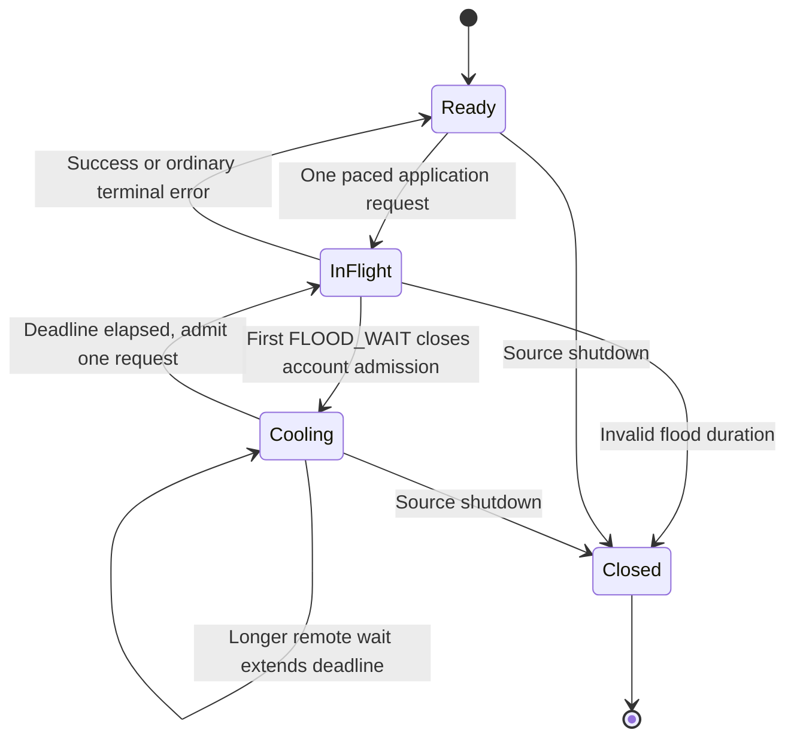

# Prevent avoidable Telegram floods and preserve account cooldowns

Status: APPROVED  
Spec lock: sha256:fd0817986ef22b2e7c124c2f1b41ee6a4785f3774747a653a54eed5fa19d5ace owner:да - спек ок, давай стадии подробно  
Implementation lock: sha256:026e3fc44c7368bef48947d1c3fee69e0cb6b183bbd82fbf9697cf6cb7ca653e owner:$blueprint-start; давай (preparation, local only, no push/live/SPEC changes)  
Active Delivery: D1  
Unattended decisions: allowed  

<!-- plan:spec:start -->
## The Goal

Prevent a Telegram flood from becoming a cascade of additional requests in the same running Source process. Measure requests at the real SDK transmission boundary, not the number of high-level commands.

- After the first observed `FLOOD_WAIT`, **zero further application requests for that account are transmitted before its wait expires**, including queued history, peer discovery, media chunks, refresh, actions, SDK retries and reconnect replays. Requests already handed to the transport cannot be recalled.
- Use one conservative, account-wide in-memory admission budget across the account's clients and senders. After a wait, release at most one request, never a accumulated burst.
- Local rejections neither count as fresh Telegram floods nor keep extending the original deadline. A later genuine remote wait can only extend it.
- Concurrent missing-peer lookups share an advancing discovery scan; a cached peer needs zero discovery requests. Failed pages do not become empty success or advance Source receipts.
- Keep existing Source wire contracts, sync cursors, Graph batching, credentials and UI unchanged. Add no database tables, migrations, durable cooldowns or cross-process ownership service.
- No real Telegram traffic during development or automated verification; no push or live re-enable without separate owner authorization.

### Owner scope clarification — 2026-09-14

The owner explicitly removed cooldown persistence after a backend/Source crash from this task: a restarted or independent service may receive its first flood; the important guarantee is that the remaining requests then stop. This resolves the previous review's durability objection as **context-mismatched, with an explicit owner override**, not an unresolved requirement.

The limiter's lifetime is the Source process. In-process client eviction/recreation retains that account's limiter, but process death loses it. Independent processes, other Telegram apps and other services are not coordinated. No durable stop flag or manual approval after an ordinary process crash is added. Deliberate process/session rotation to bypass a known wait is still forbidden. The live instance previously disabled for containment stays disabled until separately authorized; removing the persistence requirement does not authorize running it.

Telegram's quota is external and variable. This plan does not guarantee that the first flood can never happen, that a future flood cannot recur, or that another service cannot increase account pressure. It guarantees that this process does not continue hammering after observing one.

## The target

One in-memory account admission owner in the Telegram Source controls the patched GramJS sender boundary. A response hook closes admission synchronously before rejecting the caller's promise; no host round-trip, disk write or background-notification protocol is necessary.



Incoming updates and a narrowly identified set of MTProto control messages remain responsive while application admission is closed. Auth requests, `help.GetConfig`, DC authorization export/import, media reads and nested application requests inside init/container wrappers are application traffic, not control exemptions. Unknown methods cannot silently enter the control allowlist.

### Reused owners and concrete SDK seam

`SessionPool` remains the owner of account clients. It also retains account admission objects across in-process reconnect/evict/recreate. Create and install the guard **before** `TelegramClient.connect()`. Sync clients share by the existing required `account_id`; the separate auth-mode process uses one provisional process-local guard for all clients in that auth ceremony, including a repeated begin. There is no new claim of deduplication across independent processes or distinct externally supplied account identities.

Use a tracked Bun dependency patch pinned to **GramJS 2.26.22**, rather than runtime prototype monkey-patching or a new Telegram transport implementation. The patch adds narrow optional SDK hooks; every Telegram Source client must install them before connect and verify the expected hook revision. Missing hooks are an explicit startup error, never an unguarded fallback.

The patch's exact dependency owners are `client/telegramBaseClient.js` and `.d.ts` (hook revision and typed client hook), `network/MTProtoSender.js` (main/exported sender integration, outgoing recheck, response observation and replay lifecycle), and `extensions/MessagePacker.js` and `.d.ts` (select admissible states without blocking control traffic). These are tracked only inside the patch file, never edited as untracked installed dependencies. Existing sender construction already supplies the same `_client` to main/exported senders; they read the same installed account hook.

Before packing, reserve at most one application request across all that account's senders and leave other states waiting; preserve action ordering and never pack several application requests into one container as one admission. A control-only packet can still proceed. After asynchronous packing/encryption, recheck cancellation and the account hold immediately before handing bytes to `connection.send`. If no longer admissible, requeue the untransmitted application state without treating it as a successful attempt; control acknowledgements remain eligible. Register transmitted state identity so reconnect replay must acquire a new eligible attempt without leaking or double-acquiring the old permit.

A nonempty but ineligible packer queue must sleep on the shared gate's wake signal/next monotonic deadline, not repeatedly return an empty batch into `_sendLoop`. A newly queued control message wakes it immediately. Account gating owns that wake; do not add a second retry timer per request or sender.

In `_handleRPCResult`, record the actual remote error and set the account hold before `state.reject` or releasing the in-flight slot. Success, terminal errors, disconnect and cancellation release or retire permits exactly once. Failed packet construction/send cannot leave a stuck permit; uncertain transmission is not counted as successful receipt. The patch preserves GramJS request serialization, response decoding, sender/DC handling and internal retry code. Wrapping only `TelegramClient.invoke`, `sender.send` or initial queue insertion is insufficient: internal retries and replays bypass those narrower paths.

Proposed internal policy vocabulary (not a Source wire change):

```typescript
interface FloodObservation {
  readonly method: string;
  readonly attemptId: string;
  readonly waitSeconds: number;
  readonly observedAtMonoMs: number;
}

type AdmissionDecision =
  | { readonly kind: "ready" }
  | { readonly kind: "wait"; readonly untilMonoMs: number; readonly reason: "pacing" | "flood" }
  | { readonly kind: "closed"; readonly reason: "stopped" | "invalidFlood" };
```

Initial policy: one in-flight application request per account, at least 3,000 ms between starts, no saved burst tokens, at most 20 starts in `(now - 60 seconds, now]`. A remote wait sets `holdUntil = max(oldHoldUntil, observationTime + waitSeconds * 1000 + 2000)`. All scheduling uses monotonic time; wall-clock timestamps are diagnostic only. Missing, negative, non-finite or unrepresentable durations close this process's account guard without guessing zero. Only a real remote observation changes the deadline. After it expires, the same conservative pacing remains; no speed ramp or exponential retry schedule is introduced. These are conservative local settings, not a promise about Telegram's safe quota.

Do not park a known flooded SDK operation for an hour inside a 30-second host command: reject pending/new application attempts against the current hold using the existing typed rate-limit result and **remaining** wait, not a new remote observation. The current request's caller retains its normal Source error/continuation behavior. SDK-internal retries meet the same gate and cannot transmit; the independent short-flood sleep-and-retry in `sendWithFloodRetry` is removed. For ordinary pacing use a bounded waiting queue of 32 states per account; excess/expired work gets an explicit ordinary local failure without fabricated remote-flood telemetry. No expired waiter is released later. Incoming subscription processing and `listen_stop` do not await a quota permit.

Keep the original remote error as the cause of the internal rate-limit error; normalize its exposed wait to the guard's current remaining hold at the existing client/dispatch boundary. This preserves `-32002`/`data.retry_after` without adding wire fields or recording a second remote flood. Give an ordinary pacing waiter a finite 20-second local queue deadline; SDK/client cancellation can remove it earlier. This does not claim to know an uncommunicated backend command deadline. During a known flood, admission refuses immediately instead of consuming that queue deadline. In the existing stdio loop, control-only `listen_stop` must bypass the eight-command work semaphore: it cannot sit behind eight paced fetches. Keep that same loop testable with injected streams/dependencies; do not build a second protocol driver.

Preserve the host's import-based startup: `main.ts` still starts the Source when its bundle is imported, not only when `import.meta.main` is true. Put the reusable loop with the existing dispatcher in `dispatch.ts` and keep `main.ts` as its normal startup caller; tests inject streams into that same function. No new production entrypoint or test-only production environment switch.

Diagnostics at the Source boundary record only pseudonymous owner, method, attempt ID, origin, monotonic times, remaining wait, deadline, queue length and outcome. Only decoded remote errors increment the remote-flood counter. Never log messages, phone numbers, sessions, request arguments or environment dumps. The test harness captures this structured sink; exposing new diagnostics in Accounts or changing backend stderr handling is outside this fix.

### Proposed file map

All product/test changes are in the **magnis catalog repository**. The app repository changes only this plan; no app runtime or database edits.

```text
MODIFY package.json
       Register the exact SDK patch and route agent:test:backend to the existing test launcher.
MODIFY bun.lock
       Lock the pinned SDK and tracked patch; preserve unrelated dependency versions.
MODIFY plugins/sources/telegram/package.json
       Pin telegram to 2.26.22 because the sender hook is version-specific.
CREATE patches/telegram@2.26.22.patch
       Narrow hooks in the five listed SDK implementation/declaration files.
MODIFY scripts/test-connectors.sh
       Add explicit --agent scoped routing; keep its existing connector-suite behavior.
CREATE scripts/tst_scripts_tgflood_001.test.ts
       Verify exact Bun/Vitest routing and nonzero failure propagation without running providers.
MODIFY plugins/sources/telegram/src/live.ts
       Install/reuse account guards, preserve them on reconnect, and coalesce peer discovery.
MODIFY plugins/sources/telegram/src/client.ts
       Validate flood duration and remove independent short-flood retry policy.
MODIFY plugins/sources/telegram/src/dispatch.ts
       Preserve typed runtime floods during listen/auth/command errors; keep validation errors distinct.
MODIFY plugins/sources/telegram/src/main.ts
       Reuse the stdio loop with injectable streams; let listen_stop bypass only the work semaphore.
CREATE plugins/sources/telegram/src/request-admission.ts
       Single in-memory account policy, clock, wake/cancel and structured observations.
CREATE plugins/sources/telegram/src/testing/mtproto-transport.ts
       Fake low-level transport/crypto boundary and deterministic recording/barriers for real SDK loops.
CREATE plugins/sources/telegram/src/tst_src_tgflood_001.test.ts
       Five coherent in-process behavioral journeys through SDK and Source dispatch.
MODIFY plugins/sources/telegram/src/client.test.ts
       Update the explicitly superseded short-wait retry assertions; preserve unrelated tests and IDs.
MODIFY plugins/sources/telegram/src/live.test.ts
       Supply explicit guard owners to existing client fixtures; preserve paging/media regression coverage.
MODIFY plugins/sources/telegram/src/surfaces/telegram/execute.test.ts
       Replace the superseded short-flood auto-send expectation with an immediate typed refusal.
```

Sixteen files: four dependency/patch files, two test-entrypoint files, five production Source files, and five test/fixture files. The patch is one tracked file but contains changes to five SDK files; report its actual added/deleted lines separately so the file count does not hide a vendor rewrite. `main.ts` is included because direct dispatcher tests would miss the existing eight-command semaphore; the execute regression is included because it currently requires the very short-flood retry the owner wants removed. Existing pagination, Source envelopes, subscriptions, sync state and Graph implementations are reused, not copied. The peer-scan changes stay in `live.ts` with the existing `LiveDialogPager`; no new discovery service. The implementation review must reject unrelated formatting/dependency churn.

### User flows

1. Connect and subscribe once; share paced outgoing requests between history, discovery and media while incoming updates continue.
2. A request receives the first flood. The account guard closes before other callers can launch another application request. Every other queued caller sees the same remaining pause.
3. Advancing time or repeated UI/host commands during the pause sends nothing and does not extend it. An already-transmitted request reporting a longer real wait can extend it.
4. At expiry, one request is allowed. A success keeps conservative pacing; another flood closes the account again immediately. There is no queued burst or separate retry loop per caller.
5. Recreating a client in the same process cannot erase a known wait. Process death may erase it, as explicitly accepted by the owner. A fresh process uses the initial conservative policy and reacts to its own first flood.

## Today, measured against that

App planning base: `origin/staging` at `0d8b5f6cc77493cbd3117446f9a05b0769378103`. The running instance was on `telegram-sync-integration`, receipt `119f2bc5c`, not that base. Catalog audit: `3824bd3065e59ef4a081146a3a1138c15051d881` with pre-existing dirty Telegram changes; the dirty work is not implicitly owned or included. Before implementation decomposition, record the approved catalog base/prerequisite commits through the normal branch workflow. Do not copy files or silently stage that dirty work. No app-native-PG harness prerequisite is needed for this narrowed Source-only task.

Verified deployed Source package: `sha256:3f5ce0dd30d41cdc069faf68c2d696e09d18d97e3e837fd18378f74bf320ea57`; bundled `dist/main.js` digest `ccdd421e109f27565158fcade946f4ad43fe5959b42b14e13bf5d2f14cec5483`. Older unpacked S18 directories are not evidence for this S32 deployment.

- The observed integration branch's host cooldown was process-local and reactive. It is not the fix's enforcement boundary and is not assumed present on staging.
- Catalog `client.ts::sendWithFloodRetry` independently sleeps/retries short waits. `SessionPool` shares clients but no account-wide request budget; `resolvePeer` can restart `iterDialogs({})` on every cache miss.
- GramJS `client/users.js::invoke` requeues retry states; downloads use `invokeWithSender`; `_sendLoop` prepends pending states on reconnect; `_handleRPCResult` has the originating request/error before caller catches. These are why a command-only limiter cannot establish the desired guarantee.
- `dispatch.ts` can relabel listener-start runtime errors as invalid parameters. Background SDK handling can swallow a flood after it reaches the sender, so observation belongs before that catch.
- The catalog agent backend entrypoint currently runs Vitest, whose include list excludes Bun Telegram tests. The existing `scripts/test-connectors.sh` already owns their Bun lane and will be extended rather than bypassed.

### Incident facts retained, not a new live check

On 2026-09-14 the retained log had 138 committed backfill pages between 11:22:48 and 11:27:50 UTC, none afterward through containment. Stored statuses at 16:51/16:55 reported another 27/28 seconds but do not identify fresh Telegram responses versus local hold rejections. Source stderr was discarded by the observed host, so the original method, exact flood count and maximum remote penalty cannot be reconstructed.

At 17:16:06 UTC pause was acknowledged; at 17:16:07 the normal disable action acknowledged `source:magnis.telegram = installed_disabled`. Read-only PostgreSQL observations at 17:17:41 and 17:19:03 retained one account/connection, last attempt 17:15:55.502, update 17:16:06.394 and ingested count 452926 beyond the old retry deadline. No logout, credential export or Graph deletion occurred. This proves stopped sync-state advancement in that instance, not Telegram account health or absence of another client's traffic. No new provider probe is part of this plan update.

## Invariants and five complete mock journeys

Use `test-protocol` metadata (`@test-id`, `@scenario`, `@covers`, `@deterministic`, `@fixtures`) and first-token test IDs. Existing proposed source IDs remain attached to their original behaviors. Retire the unimplemented durable-backend proposals `tst_bts_tgflood_001/002` and `scn_tgflood_003/005`; do not silently repurpose those IDs. New in-process scenarios use `006/007`.

Shared fixture: synthetic account A, three historical chat ID sets of 120, 70 and 5 messages, pinned metadata, two later live messages, and a three-chunk media file; synthetic account B is independent. Real GramJS request construction, message packing, response decoding, internal retry/reconnect code, Telegram Source client and dispatcher run. Fake only low-level socket/crypto I/O and clock/barrier control; inject decoded wire-equivalent error/results through the real sender handlers, never replace `invoke`, `getMessages` or `sendWithFloodRetry`. Record each application request at transmission. Unexpected network attempts fail immediately; no real session or host/DB is needed. This is Source integration, **not a claim of full Nest-to-Graph or live Telegram certification**.

### F1 — Healthy mixed requests share one account budget

`tst_src_tgflood_001` / `scn_tgflood_001`.

1. **Step 1 → Verify:** Construct guarded clients and run normal connection/setup and subscription against fake I/O. Even setup application calls are recorded and gated before the first history page; main/exported senders have the same account owner.
2. **Step 2 → Verify:** Queue history, three media chunks and concurrent peer lookups. Advance fake time through explicit barriers. Maximum application concurrency is one per account, starts are at least 3 seconds apart, rolling count is at most 20, and each media chunk costs its own admission.
3. **Step 3 → Verify:** Inject two incoming updates while application work waits and release a control acknowledgement. Updates are emitted without a quota token; control is not blocked behind waiting application states. Nested application requests do not inherit a control exemption.
4. **Step 4 → Verify:** Finish the history fixture. Its unique emitted historical IDs equal exactly 195, pages contain at most 50 messages, pins survive, and both live IDs appear. No Graph persistence is inferred from Source emissions.
5. **Step 5 → Verify:** Hold A and progress B, then stop A. B has its own budget; A's cancelled work never transmits and every owned timer/permit settles.

### F2 — First flood blocks every other queued request and hidden retry

`tst_src_tgflood_002` / `scn_tgflood_002`; one table-driven journey with separately reported cases.

1. **Step 1 → Verify:** For each named origin (GetDialogs, GetHistory, GetState, media chunk, fake action, fake auth, listen-start setup, SDK server-error retry and reconnect replay), assert the real request reaches the transmission recorder. Queue different request families behind it; a case that misses its intended origin fails rather than skips.
2. **Step 2 → Verify:** Inject `FLOOD_WAIT_4`, then a separate `FLOOD_WAIT_3600` case through the real RPC error handler. Observe the account hold set before the original promise rejects. The recorder sees zero additional application attempts until deadline plus margin; queued requests and caller retries do not escape through another sender.
3. **Step 3 → Verify:** Issue repeated new Source calls during that wait and advance fake time to one millisecond before expiry. All report the decreasing remaining wait; remote-flood count stays one and the deadline stays fixed. No independent short-wait helper sleeps and resends.
4. **Step 4 → Verify:** Seed a genuine delayed response from explicitly pre-existing transmitted work, first shorter then longer, followed by a late success. Only the longer remote wait extends the maximum; successes and local rejections cannot clear or inflate it. Do not fabricate impossible overlapping starts to test this race.
5. **Step 5 → Verify:** Deliver incoming updates/control, then advance past expiry. At most one application request starts. Its new flood closes the account immediately again; its success in a separate case keeps the 3-second spacing. No backlog burst occurs.

### F4 — Peer resolution resumes rather than causing repeat discovery bursts

`tst_src_tgflood_003` / `scn_tgflood_004`.

1. **Step 1 → Verify:** Ask concurrently for two peers beyond the first dialog page. Exactly one shared scan advances; both callers do not request offset zero independently.
2. **Step 2 → Verify:** Flood the next page and retry after fake-time expiry. The shared scan resumes from its last successful continuation, not the beginning. One caller cancelling leaves the other caller's scan intact.
3. **Step 3 → Verify:** Resolve a peer already learned from live data. No GetDialogs request occurs; pinned entities are not dropped from the shared cache.
4. **Step 4 → Verify:** Exhaust the scan for an inaccessible peer and time out a separate history page. Neither failure becomes empty success, advances Source receipt/continuation or claims end-of-history merely because a total estimate matches.
5. **Step 5 → Verify:** Resume successfully. The unique historical IDs are the expected 195; no successful earlier discovery page is needlessly reread in this runtime.

### F6 — In-process guard survives client replacement and expires/cancels correctly

`tst_src_tgflood_004` / `scn_tgflood_006`.

1. **Step 1 → Verify:** Flood account A, evict/recreate its client inside the same SessionPool, and create an exported DC sender. They share the original hold; none transmits before expiry. Repeating auth begin within the same auth-mode process likewise cannot reset its provisional hold.
2. **Step 2 → Verify:** With no flood, fill the 32-state pacing queue and offer a 33rd state. Queue remains bounded, overflow is explicit local failure, and no remote-flood event is invented. Hold fake time fixed: pack/send invocation counters do not spin on the ineligible queue, and only the shared deadline wake is scheduled. A new control message wakes the sender immediately. Cancel/expire waiting operations and advance time: none is transmitted after cancellation.
3. **Step 3 → Verify:** Exercise absent, negative, non-finite and overflowed flood durations plus wall-clock jumps. Invalid values close account admission without a guessed deadline; wall-clock changes do not alter a valid monotonic hold.
4. **Step 4 → Verify:** Fail packet packing/send, reconnect with a replay state, then stop. Permits are neither leaked nor acquired twice; replay is still paced and cancelled states cannot return to the queue. Incoming control is responsive throughout.
5. **Step 5 → Verify:** Construct a completely fresh process-owned pool with no carried state. It starts at the conservative initial policy and reacts correctly to its own first flood. Assert no safety-state file/DB write, cross-process lock or manual-recovery requirement was introduced. This is the owner's explicitly accepted restart boundary, not a durability test.

### F7 — Real Source dispatch exposes one wait and preserves subsequent output

`tst_src_tgflood_005` / `scn_tgflood_007`.

1. **Step 1 → Verify:** Drive the existing stdio loop and its `handleMessage` dispatcher with injected streams and normal fetch, listen and execute calls wired to the guarded real SDK clients on fake I/O. Do not use the high-level `TELEGRAM_FIXTURE_FILE` branch to bypass the client. The real subscription registry emits incoming envelopes. In an entrypoint smoke substep, import `main.ts` in a test-owned child and send only `initialize` plus EOF: exactly one initialization reply proves import-based startup still works; that metadata-only check performs no Telegram call.
2. **Step 2 → Verify:** Inject a runtime flood during listen setup and again during a fetch in separate cases. Responses preserve `-32002` and valid remaining `data.retry_after`; malformed user arguments still return validation errors. No new Source wire field or protocol version is needed.
3. **Step 3 → Verify:** Queue history/media while that hold is active and deliver the two live identities. Zero further application calls transmit; the failed page emits no successful receipt and local command responses are not counted as additional remote floods. Separately fill all eight command slots with paced work and send `listen_stop` through the same stdio stream: it completes without waiting for a command slot or quota permit.
4. **Step 4 → Verify:** Resume one request at expiry, finish the remaining Source pages and compare emitted IDs. Exactly 197 unique message identities are observed, including the two live identities. Replayed envelopes may repeat IDs; no false claim of Graph commit or provider-wide completion is made.
5. **Step 5 → Verify:** Inspect structured diagnostics for original method, remote/local origin, fixed hold and remaining wait; assert fake session/phone/payload/env sentinels are absent. Shut down only fixture-owned clients/tasks; no network or storage resources are left running.

### Commands and required evidence

Extend the existing catalog launcher with an explicit `--agent` lane. `package.json` points `agent:test:backend` at `bash scripts/test-connectors.sh --agent`; exact Telegram Source and `scripts/tst_scripts_tgflood_001.test.ts` targets route to Bun, explicit existing Vitest targets route to Vitest, unsupported targets fail rather than run zero tests. With `--agent` and no target preserve the previous Vitest default. Without `--agent` preserve the existing full connector suite. The routing test (`tst_scripts_tgflood_001` / `scn_tgflood_008`) uses test-owned fake executables to check both lanes, exact argument forwarding, unknown-target rejection and propagated failure exit codes; it invokes no provider tests.

After this adapter exists, the scoped commands from catalog root are:

```bash
bun run agent:test:backend -- scripts/tst_scripts_tgflood_001.test.ts
bun run agent:test:backend -- plugins/sources/telegram/src/tst_src_tgflood_001.test.ts
bun run agent:test:backend -- plugins/sources/telegram/src/client.test.ts plugins/sources/telegram/src/live.test.ts
```

Use fake monotonic time and explicit queue/send/response barriers, never long real sleeps. Each new behavioral case must be RED against the original implementation for the expected behavior, not missing dependencies, missing tests or a runner import error. Removing the first-flood fence, allowing SDK replay, resetting an in-process guard or restarting discovery must make its relevant journey RED. Existing auth/execute/commands/fixture regressions run through the same scoped Bun lane. Installation must apply the tracked SDK patch reproducibly; tests assert hook revision. No automated test uses the owner's credentials.

For each journey and parameter case record UTC start/end, code/patch digests, command, expected/actual result, remote floods, local refusals, per-account transmissions, timestamps, maximum concurrency and emitted IDs/receipts. These are mock correctness metrics, not live Telegram throughput or Graph transaction evidence. No new behavior test has been written or run in this planning turn.

## Validation, sequencing and scope

- The removed durable-host requirement is not allowed to return as a Stage 0 blocker. This task does not need a new database or Nest/Graph harness. Existing application-level sync/Graph verification remains separate and is not certified by these Source tests.
- The SDK hook, admission owner and client wiring share an interface and are sequential work. Once that interface is fixed, launcher/runner checks are disjoint from Source implementation and may run in parallel; final Source regression integration joins them. Do not start parallel agents on overlapping Source files.
- Freeze the catalog prerequisite/base and exact commit-sized Task graph after the owner approves this narrowed SPEC, using the normal worktree/planctl process. Approval of this scope correction alone is not approval of an implementation graph. No app code needs to be merged/copied into that catalog worktree.
- No UI redesign, Source specification amendment, Graph/sync schema change, new durable cooldown, account deletion, session rotation or live full-account run. Record actual changed lines, including dependency patch lines, to measure the minimal-change constraint.
- A later separately authorized live check stays bounded to one known chat, no media/discovery sweep/send, at most three application attempts including setup/retries, at most 60 seconds, and immediate stop on a flood/auth error. A clean result only proves that bounded operation at that time. No new request is needed to assess the already-recorded incident facts.

## Pre-approval screen

- **Result:** the first observed flood stops all remaining application traffic for that account in the running Source; expiry releases one paced request, not a burst.
- **Removed:** database persistence, crash-safe cooldown recovery, cross-process coordination, migrations and backend safety-protocol changes.
- **Still required:** real SDK-path mock tests, typed command errors, no repeat-discovery bursts and unchanged emitted data/receipts. Five journeys are described above, not claimed implemented.
- **Not verified here:** full application/Graph integration, UI, live quota safety or account health. No live Telegram call is authorized by this revision.
- **Next approval:** the narrowed SPEC, then the separately rendered Delivery/Stage/Task plan. No code or publication starts from this draft.
<!-- plan:spec:end -->

<!-- plan:implementation:start -->
## Implementation contract

<!-- plan:delivery:D1:start -->
<!-- plan:delivery-meta:{"active":true,"depends":[],"predictedExternalWaitMinutes":45} -->
### PR Delivery D1 — Stopped Telegram request cascades after the first FLOOD_WAIT

Branch: `feat/telegram-flood-safety`; Depends: none; Gate: backend.

Stage graph: `D1-S7 -> D1-S1 -> D1-S2 -> (D1-S3 || D1-S4) -> D1-S5 -> D1-S6`.

Forecast: 320 active min / 36 credits across 7 Stages; longest dependency path 295 active min; external waits 45 min.

PR text (target result, not a completion report). Telegram stopped issuing account application requests as soon as the running Source observed FLOOD_WAIT. History, discovery, media, authentication, background refresh and SDK retries shared an in-memory account fence. Incoming updates remained responsive, and expiry released one paced request instead of a backlog burst.

Implementation. A version-pinned GramJS patch enforced admission at the actual transmission boundary and observed remote errors before callers or retries could run. SessionPool retained the guard across in-process client replacement. Repeated peer lookups shared one advancing scan. Existing Source rate-limit replies exposed the remaining wait without inventing a new protocol.

Proof. Five deterministic Source/SDK journeys covered normal traffic, short and long floods, shared discovery, cancellation/recreation and the real stdio command loop. The fixture contained 195 historical identities and two live identities. Verification counted actual application transmissions and distinguished real remote floods from local refusals; it did not infer Graph commits from emitted messages.

Not in this PR. No UI changes, backend/Graph migrations, durable cooldown, cross-process coordination, Source specification amendment, credential export or live Telegram traffic. There is no guarantee that a first flood can never occur. The owner retains control over push, live re-enable and merge.

Execution repository and pinned base. All product paths below are relative to the magnis catalog repository. Use a clean feature worktree branched from catalog origin/staging 885e02028e7b6c62108acb9fee962cb3c1a567bb; there are no prerequisite commits to import. Its Telegram Source and relevant scripts match audited commit 3824bd3065e59ef4a081146a3a1138c15051d881. Branch-only UI commits and every dirty smoke-catalog edit are excluded. At that committed base floodSleepThreshold is 30, not the dirty working tree's 0; live.test.ts is not tracked yet. The Task writes explicitly account for both.

Owner-authorized preparation (D1-S7). The canonical plan moved from magnis-app to this clean magnis catalog worktree with exactly unchanged SPEC. The owner authorized catalog agent:* adapters and managed runtime/hooks while retaining all original verification coverage and branch protections. The seven adapters expose scoped commit checks and the existing full catalog check. The catalog keeps its existing CI workflow. A small project pre-push extension rejects every remote main ref before exact-head receipt reuse; its intentional template mismatch is explicitly reported rather than weakening protection or changing upstream tools. Existing main/staging direct-commit refusal is retained in the mandatory commit adapter. Local execution without a PR is the owner's explicit exception; no push, live activation or SPEC changes are authorized.

Execution cadence. Each Stage is one work commit. Run planctl start-task for every Task before its changes or RED evidence. Co-located SDK installation/hook Tasks in D1-S2 belong to one agent and one Stage; do not delegate their interdependent writes separately. Only D1-S3 and D1-S4 may run concurrently from the exact D1-S2 commit, because their write sets are disjoint. The integrator merges both commits before D1-S5; no file copying or hidden scope. Do not use a missing command, missing test import or dependency error as behavioral RED.

Verification forecast and currency. Active minutes are agent-work estimates, not wall-clock promises. Credit numbers are low-confidence planning estimates, not a rate-card quote or measured spend; actual credits must be recorded as unavailable if the runner exposes no usage. The 45-minute external-wait estimate covers owner/CI waits only and is not a guarantee. D1-S7 accounts separately for infrastructure preparation; product Stage estimates are unchanged. Final integration buys each affected complete lane once, not after every Task.

Evidence and scope control. Every journey and parameter case records UTC start/end, exact command and commit/patch digests, RED cause, GREEN outcome, remote-flood count, local refusals, per-account send times/concurrency and emitted identities/receipts. Record actual added/deleted lines separately for Source, tests, launcher/dependencies and each of the five SDK files represented inside the patch. No unrelated formatting, dependency refresh, deletion of assertions or replacement of real SDK behavior with high-level mocks is permitted.

Approval boundary. The owner approved the SPEC with: "да - спек ок, давай стадии подробно". The owner then approved execution with $blueprint-start and authorized the preparation with 'давай'. These are execution authorizations, not claims of completed work. Its future-tense intent is rendered as completed-result PR/commit text for readability; no implementation result is claimed.

<!-- plan:stage:D1-S7:start -->
<!-- plan:stage-meta:{"deliveryId":"D1","depends":[],"parallelWith":[],"writes":["package.json","scripts/agent-verify.ts","scripts/tst_scripts_agent_stack_001.test.ts",".agents/code-production/runtime/planctl.ts",".agents/code-production/runtime/plan-update.ts",".agents/code-production/runtime/plan-gate.ts",".agents/code-production/manifest.json",".githooks/pre-commit",".githooks/pre-push",".githooks/post-commit",".gitignore"],"tempRoot":".tmp/code-production/telegram-flood-safety/D1-S7","verifyActiveMinutes":5,"verifyCredits":1} -->
#### Stage D1-S7 — Catalog execution retained verification coverage and branch protection

- Owner: integrator; Profile: strong; Depends: none; Parallel with: none.
- Writes: `package.json`, `scripts/agent-verify.ts`, `scripts/tst_scripts_agent_stack_001.test.ts`, `.agents/code-production/runtime/planctl.ts`, `.agents/code-production/runtime/plan-update.ts`, `.agents/code-production/runtime/plan-gate.ts`, `.agents/code-production/manifest.json`, `.githooks/pre-commit`, `.githooks/pre-push`, `.githooks/post-commit`, `.gitignore`.
- Temp root: `.tmp/code-production/telegram-flood-safety/D1-S7` (must be absent at handoff).
- Predict: 35 active min / 4 credits.
- Of which verification: 5 active min / 1 credits.

Owner-authorized preparation moved the canonical plan into the implementation repository without changing SPEC. Seven Bun agent:* adapters retained all existing suite coverage at the complete gate and exposed changed-scope commit checks. Managed plan runtime/hooks preserved locks, mutation journals and exact-head gate receipts. The existing main/staging direct-commit ban and remote-main push ban remained effective, including receipt reuse. Tests invoked hooks in isolated fake-Git fixtures, never real push. The project-specific pre-push protection is an explicit, verified template exception; no upstream tools are modified. Local/no-PR/no-push execution is explicitly authorized. Scoped behavior file: scripts/tst_scripts_agent_stack_001.test.ts. Commit: chore(telegram): prepare guarded catalog execution. Body: preserve verification and branch safety while executing the approved Source plan locally.

##### Tasks

- [x] TGFLOOD_009 — Expose catalog agent adapters in package.json and agent-verify.ts with regression proof in tst_scripts_agent_stack_001.test.ts. (15 min) — 503a6d7e4d6beb492e98095f900cd9ebf5196eee
<!-- plan:task-meta:{"writes":["package.json","scripts/agent-verify.ts","scripts/tst_scripts_agent_stack_001.test.ts"],"predictedActiveMinutes":15,"predictedCredits":1,"how":"Bootstrap agent:test:backend with Bun as setup, then write real behavioral hook/adapter assertions in the named test file and observe RED on existing broad-hook dispatch and missing receipt reuse; missing tools/imports are not RED. Extend package.json with the seven adapters and external existing CI metadata. Reuse existing suites: complete gate remains bun run check; scoped commit gate identifies staged owners for typechecking and runs lint/tests only for affected files, preserving protected-branch refusal. Docs adapter uses installed canonical plan validation. Unsupported E2E is explicitly N/A with reason; Source integration remains in the connector lane. No independent second test runner is introduced.","red":"bun run agent:test:backend -- scripts/tst_scripts_agent_stack_001.test.ts"} -->
- [x] TGFLOOD_010 — Install planctl.ts, plan-update.ts, plan-gate.ts and manifest.json without editing shared upstream tools. (5 min) — 503a6d7e4d6beb492e98095f900cd9ebf5196eee
<!-- plan:task-meta:{"writes":[".agents/code-production/runtime/planctl.ts",".agents/code-production/runtime/plan-update.ts",".agents/code-production/runtime/plan-gate.ts",".agents/code-production/manifest.json"],"predictedActiveMinutes":5,"predictedCredits":1,"how":"Use the approved canonical agent-stack installer to generate the three runtime files and manifest after safe hook reconciliation. Keep runtime bytes identical to its pinned source and external CI mode. Observe the same named behavioral RED before installation; verify local plan lock checks and journal enforcement after installation. Keep Task receipt lifecycle on one CLI version through completion; do not mix global V2 and vendored V1 timers.","red":"bun run agent:test:backend -- scripts/tst_scripts_agent_stack_001.test.ts"} -->
- [x] TGFLOOD_011 — Reconcile pre-commit, pre-push, post-commit and .gitignore while preserving branch bans and cached-receipt safety. (10 min) — 503a6d7e4d6beb492e98095f900cd9ebf5196eee
<!-- plan:task-meta:{"writes":[".githooks/pre-commit",".githooks/pre-push",".githooks/post-commit",".gitignore"],"predictedActiveMinutes":10,"predictedCredits":1,"how":"Replace unmanaged catalog hooks with canonical templates as explicitly authorized, then run the installer to enable hooks for this worktree. Add only the project remote-main guard before any managed pre-push early return. Do not weaken existing checks: commit adapter retains main/staging protection and scoped checks, complete adapter retains every original suite. Regression fixture feeds allowed and forbidden refs in the same push batch with a valid cached receipt; forbidden main must still fail. Never perform a push. Report agent-stack check's sole expected pre-push template difference explicitly and verify all other installed assets unchanged; allow no arbitrary mismatch. Add generated local artifact ignores and retain existing ignores.","red":"bun run agent:test:backend -- scripts/tst_scripts_agent_stack_001.test.ts"} -->

##### Acceptance criteria

- [x] `bun run agent:test:backend -- scripts/tst_scripts_agent_stack_001.test.ts` exits 0 — hooks route to scoped adapters, protected commits and every remote-main push are rejected, including cached-receipt reuse. — 503a6d7e4d6beb492e98095f900cd9ebf5196eee
- [x] `bun run agent:verify:docs` exits 0 — canonical locked plan validates without modifying SPEC. — 503a6d7e4d6beb492e98095f900cd9ebf5196eee
- [ ] All seven agent adapters exist; complete gate preserves the existing check command and CI; no full suite is invoked by the scoped commit adapter.
- [ ] Canonical runtime and hooks match the installer except the explicitly tested remote-main pre-push extension; strict agent-stack check's expected mismatch is recorded, never concealed.
- [ ] No PR, push, live Telegram request, upstream tooling change or approved SPEC change occurred.
- [x] Commit — 503a6d7e4d6beb492e98095f900cd9ebf5196eee

##### Results

<!-- plan:results:D1-S7:start -->
| Task | Commit | UTC start-end | Active / elapsed | Usage | Result / proof |
|---|---|---|---:|---|---|
| TGFLOOD_009 | 503a6d7e4d6beb492e98095f900cd9ebf5196eee | 2026-09-14T20:32:26.256Z–2026-09-14T20:46:29.000Z | 14 / 14.05 min | unavailable: Runner exposes no per-Task credit usage. | Behavioral RED: 2 executed failures (old broad pre-commit routing, absent receipt reuse), not the initial fixture syntax error. GREEN: 2/2 and 14 assertions. Normal pre-commit passed scripts TypeScript, strict ESLint, docs locks and the same scoped tests. Complete gate remains exact bun run check; seven adapters and existing external CI retained. SPEC unchanged. No push/PR/provider calls. Managed runtime comprises 3239 generated lines; Source code remains unchanged. |
| TGFLOOD_010 | 503a6d7e4d6beb492e98095f900cd9ebf5196eee | 2026-09-14T20:32:26.256Z–2026-09-14T20:46:29.000Z | 14 / 14.05 min | unavailable: Runner exposes no per-Task credit usage. | Behavioral RED: 2 executed failures (old broad pre-commit routing, absent receipt reuse), not the initial fixture syntax error. GREEN: 2/2 and 14 assertions. Normal pre-commit passed scripts TypeScript, strict ESLint, docs locks and the same scoped tests. Complete gate remains exact bun run check; seven adapters and existing external CI retained. SPEC unchanged. No push/PR/provider calls. Managed runtime comprises 3239 generated lines; Source code remains unchanged. |
| TGFLOOD_011 | 503a6d7e4d6beb492e98095f900cd9ebf5196eee | 2026-09-14T20:32:26.256Z–2026-09-14T20:46:29.000Z | 14 / 14.05 min | unavailable: Runner exposes no per-Task credit usage. | Behavioral RED: 2 executed failures (old broad pre-commit routing, absent receipt reuse), not the initial fixture syntax error. GREEN: 2/2 and 14 assertions. Normal pre-commit passed scripts TypeScript, strict ESLint, docs locks and the same scoped tests. Complete gate remains exact bun run check; seven adapters and existing external CI retained. SPEC unchanged. No push/PR/provider calls. Managed runtime comprises 3239 generated lines; Source code remains unchanged. |
<!-- plan:results:D1-S7:end -->
<!-- plan:stage:D1-S7:end -->

<!-- plan:stage:D1-S1:start -->
<!-- plan:stage-meta:{"deliveryId":"D1","depends":["D1-S7"],"parallelWith":[],"writes":["package.json","scripts/test-connectors.sh","scripts/tst_scripts_tgflood_001.test.ts"],"tempRoot":".tmp/code-production/telegram-flood-safety/D1-S1","verifyActiveMinutes":5,"verifyCredits":1} -->
#### Stage D1-S1 — Scoped verification executed the real Telegram Bun tests

- Owner: integrator; Profile: strong; Depends: D1-S7; Parallel with: none.
- Writes: `package.json`, `scripts/test-connectors.sh`, `scripts/tst_scripts_tgflood_001.test.ts`.
- Temp root: `.tmp/code-production/telegram-flood-safety/D1-S1` (must be absent at handoff).
- Predict: 30 active min / 3 credits.
- Of which verification: 5 active min / 1 credits.

The test command reached the actual Bun Telegram suite instead of silently selecting the module-only Vitest lane. package.json and scripts/test-connectors.sh extended the existing owner; scripts/tst_scripts_tgflood_001.test.ts exercised routing with fake child executables.

The Stage did not introduce a second suite launcher or hide a missing managed-stack prerequisite. Bootstrap of a runnable verification entrypoint is setup evidence; only the observed routing/exit-status mismatch counts as RED.

Scoped behavior file: scripts/tst_scripts_tgflood_001.test.ts. Commit: test(telegram): route scoped Source checks through the connector launcher. Body: preserve existing Bun/Vitest ownership and fail visibly when a requested target cannot run.

##### Tasks

- [x] TGFLOOD_001 — Route Telegram tests through package.json and scripts/test-connectors.sh; prove routing and failures in tst_scripts_tgflood_001.test.ts. (25 min) — 478c725f0206f579a0ec019e6a775f36e5160336
<!-- plan:task-meta:{"writes":["package.json","scripts/test-connectors.sh","scripts/tst_scripts_tgflood_001.test.ts"],"predictedActiveMinutes":25,"predictedCredits":2,"how":"In package.json register agent:test:backend against the existing scripts/test-connectors.sh --agent entrypoint. Keep any standard stack bootstrap separate and explicit: a missing agent command is not a passing RED receipt. In scripts/tst_scripts_tgflood_001.test.ts use test-owned fake Bun/Vitest executables to demonstrate incorrect target dispatch, ignored arguments and swallowed nonzero exits against the existing launcher behavior. Create no provider session; the test must actually execute its assertions before RED is accepted. In scripts/test-connectors.sh add explicit scoped routing: Telegram .test.ts and this runner contract go to Bun; existing Vitest targets go to Vitest; reject unsupported or mixed incompatible targets instead of executing zero tests. Forward the selected target/filter and child exit code. --agent without a target preserves the prior Vitest default; invocation without --agent preserves the existing complete connector suite. In scripts/tst_scripts_tgflood_001.test.ts verify both successful lanes, exact argument forwarding, a failing child and unsupported-target refusal. Use one parameterized runner scenario tst_scripts_tgflood_001 / scn_tgflood_008, not file-list snapshot assertions.","red":"bun run agent:test:backend -- scripts/tst_scripts_tgflood_001.test.ts"} -->

##### Acceptance criteria

- [x] `bun run agent:test:backend -- scripts/tst_scripts_tgflood_001.test.ts` exits 0 — exact Bun and Vitest targets are selected, filters are preserved, unsupported targets are refused and a child failure remains nonzero. — 478c725f0206f579a0ec019e6a775f36e5160336
- [ ] The runner contract uses only test-owned fake executables; no Telegram credentials, network call or whole-suite run is used to prove routing.
- [x] Commit — 478c725f0206f579a0ec019e6a775f36e5160336

##### Results

<!-- plan:results:D1-S1:start -->
| Task | Commit | UTC start-end | Active / elapsed | Usage | Result / proof |
|---|---|---|---:|---|---|
| TGFLOOD_001 | 478c725f0206f579a0ec019e6a775f36e5160336 | 2026-09-14T20:48:00.632Z–2026-09-14T20:51:17.000Z | 3.2 / 3.27 min | unavailable: Runner exposes no per-Task credit usage. | RED executed the existing launcher and observed ignored target/filter with twelve full-lane invocations. GREEN: one coherent runner scenario, 21 assertions covering Bun/Vitest exact arguments, filter retention, child exit 23, same-lane multiple targets, missing/unsupported/mixed refusal, default Vitest and unchanged complete connector selection. Normal hook passed TypeScript and 3/3 tests across two scoped files (35 assertions). No provider traffic or full product gate. |
<!-- plan:results:D1-S1:end -->
<!-- plan:stage:D1-S1:end -->

<!-- plan:stage:D1-S2:start -->
<!-- plan:stage-meta:{"deliveryId":"D1","depends":["D1-S1"],"parallelWith":[],"writes":["patches/telegram@2.26.22.patch","plugins/sources/telegram/src/testing/mtproto-transport.ts","plugins/sources/telegram/src/tst_src_tgflood_001.test.ts","package.json","plugins/sources/telegram/package.json","bun.lock","plugins/sources/telegram/src/request-admission.ts","plugins/sources/telegram/src/live.ts","plugins/sources/telegram/src/live.test.ts"],"tempRoot":".tmp/code-production/telegram-flood-safety/D1-S2","verifyActiveMinutes":15,"verifyCredits":2} -->
#### Stage D1-S2 — Account admission fenced actual SDK transmissions and retained in-process holds

- Owner: integrator; Profile: strong; Depends: D1-S1; Parallel with: none.
- Writes: `patches/telegram@2.26.22.patch`, `plugins/sources/telegram/src/testing/mtproto-transport.ts`, `plugins/sources/telegram/src/tst_src_tgflood_001.test.ts`, `package.json`, `plugins/sources/telegram/package.json`, `bun.lock`, `plugins/sources/telegram/src/request-admission.ts`, `plugins/sources/telegram/src/live.ts`, `plugins/sources/telegram/src/live.test.ts`.
- Temp root: `.tmp/code-production/telegram-flood-safety/D1-S2` (must be absent at handoff).
- Predict: 110 active min / 12 credits.
- Of which verification: 15 active min / 2 credits.

The running Source owned the account budget and the patched SDK enforced it at transmission, including hidden retry/replay and exported media senders. No new transport implementation, database state, host handshake or Source wire field was introduced.

Five dependency implementation/declaration files are represented in one patch; report their added/deleted lines individually. Optional SDK hooks preserve normal behavior for unrelated consumers, but every Telegram Source client requires the correct hook revision before connect.

Healthy journey (tst_src_tgflood_001 / scn_tgflood_001): connect and subscribe with real SDK setup on fake I/O; queue history/discovery/media; inject two live updates while outgoing calls wait; finish exactly 195 historical plus two live unique identities, retain pins; show independent progress for account B.

Flood journey (tst_src_tgflood_002 / scn_tgflood_002): for each named SDK origin inject waits of 4 and 3600 seconds; observe the hold before rejection; count zero subsequent application sends until expiry plus margin. Repeated local calls keep a fixed deadline and decreasing remaining wait. Seed only explicitly pre-existing transmitted states for delayed shorter/longer flood responses; a longer wait extends the maximum and late success cannot clear it. Expiry admits one request; a new flood immediately closes again. Source action helper and full stdio output are completed in their explicit later Stages, not claimed from SDK-only assertions.

Lifecycle journey (tst_src_tgflood_004 / scn_tgflood_006): replacement in one process retains the hold, a new process does not inherit it, queue overflow and cancellation are local failures, invalid waits fail closed, controls wake without CPU spin, and packing/replay/timeouts do not leak or double-release permits. No safety-state file, database table or cross-process lock exists.

The installation and sender-hook Tasks are coupled work inside this one Stage, never parallel assignments. Named behavior files: plugins/sources/telegram/src/tst_src_tgflood_001.test.ts and plugins/sources/telegram/src/live.test.ts. Commit: fix(telegram): fence account RPCs at the SDK send boundary. Body: observe the first remote flood before caller retries and retain one monotonic in-process account hold.

##### Tasks

- [ ] TGFLOOD_002 — Fence SDK transmissions in telegram@2.26.22.patch; exercise real sender loops using mtproto-transport.ts and tst_src_tgflood_001.test.ts. (40 min)
<!-- plan:task-meta:{"writes":["patches/telegram@2.26.22.patch","plugins/sources/telegram/src/testing/mtproto-transport.ts","plugins/sources/telegram/src/tst_src_tgflood_001.test.ts"],"predictedActiveMinutes":40,"predictedCredits":4,"how":"In plugins/sources/telegram/src/testing/mtproto-transport.ts create deterministic low-level socket/crypto I/O, monotonic clock and send/response barriers. Keep real GramJS serialization, packing, RPC decoding, retries and reconnect code; never replace invoke/getMessages/sendWithFloodRetry. Deny unexpected network attempts and expose a sanitized transmission recorder. In plugins/sources/telegram/src/tst_src_tgflood_001.test.ts build the SDK-origin cases of tst_src_tgflood_002 and the normal/control and lifecycle assertions used by tst_src_tgflood_001/004. An unguarded sender must visibly transmit queued/replayed work after the injected flood; missing symbols or an unapplied dependency patch do not count as RED. Complete Source-policy assertions with TGFLOOD_004 in this same Stage. In patches/telegram@2.26.22.patch add optional versioned hooks only to client/telegramBaseClient.js and .d.ts, network/MTProtoSender.js, extensions/MessagePacker.js and .d.ts. Reserve one application state across main/exported senders; preserve action order and control-only packets; check again after asynchronous packing/encryption immediately before connection.send. Observe an RPC flood before rejecting the request promise or releasing its permit. In patches/telegram@2.26.22.patch make reconnect replay reacquire admission, settle permits once on terminal outcomes, and wait on the shared wake/deadline rather than spinning over nonempty ineligible queues. Classify nested application requests as application traffic; unknown methods are never silently exempted. A control message can wake a waiting sender. In plugins/sources/telegram/src/tst_src_tgflood_001.test.ts record every actual application attempt, not only high-level calls. Cover GetDialogs/GetHistory/GetState, media chunks, SDK auth/action calls, listen setup, server-error retry and reconnect replay. The command-envelope/action-helper behavior is additionally exercised by the existing regression in D1-S3 and the complete stdio journey in D1-S5.","red":"bun run agent:test:backend -- plugins/sources/telegram/src/tst_src_tgflood_001.test.ts -t 'tst_src_tgflood_002'"} -->
- [ ] TGFLOOD_003 — Install the pinned SDK hook through package.json, plugins/sources/telegram/package.json and bun.lock. (10 min)
<!-- plan:task-meta:{"writes":["package.json","plugins/sources/telegram/package.json","bun.lock"],"predictedActiveMinutes":10,"predictedCredits":1,"how":"In plugins/sources/telegram/package.json pin telegram to 2.26.22; the patch is version-specific. In package.json register patches/telegram@2.26.22.patch using Bun's tracked dependency patch mechanism. In bun.lock record that exact version/patch without refreshing unrelated dependency versions. Use the TGFLOOD_002 fixture and test as the same Stage's installation/behavior oracle: before the patch is effective, a valid SDK path fails the account-fence assertion; after installation it executes the hook and prevents the extra transmission. A package-version snapshot or missing-import failure is not sufficient proof. Stage TGFLOOD_002 and TGFLOOD_003 together under one owner before touching their combined files; a dependency installation may update only the declared package.json, plugin package.json and bun.lock. Never edit installed node_modules as the final deliverable. Removing the expected SDK hook must cause an explicit Source startup error before any application request.","red":"bun run agent:test:backend -- plugins/sources/telegram/src/tst_src_tgflood_001.test.ts -t 'tst_src_tgflood_002'"} -->
- [ ] TGFLOOD_004 — Share account holds in request-admission.ts and live.ts; cover healthy traffic and replacement in live.test.ts and tst_src_tgflood_001.test.ts. (45 min)
<!-- plan:task-meta:{"writes":["plugins/sources/telegram/src/request-admission.ts","plugins/sources/telegram/src/live.ts","plugins/sources/telegram/src/live.test.ts","plugins/sources/telegram/src/tst_src_tgflood_001.test.ts"],"predictedActiveMinutes":45,"predictedCredits":5,"how":"In plugins/sources/telegram/src/request-admission.ts implement one in-memory owner per account: one in-flight application request, at least 3000 ms between starts, at most 20 starts in a rolling 60 seconds, no accumulated burst tokens. Use monotonic time and a bounded 32-state queue with a 20-second ordinary pacing deadline. In plugins/sources/telegram/src/request-admission.ts set holdUntil to the maximum of the existing hold and remote observation plus validated wait plus 2000 ms. Only decoded remote observations advance it. Pending/new work during a known hold is refused with its remaining wait; local refusal does not increment remote-flood count. Absent, negative, non-finite or overflowing waits close admission. Expiry releases one paced request. In plugins/sources/telegram/src/live.ts install and validate the SDK hook before every sync/auth connect, reuse SessionPool account identity, keep guards after in-process client eviction, and share one provisional owner across repeated auth begins in the auth process. Set floodSleepThreshold to 0 explicitly; committed base uses 30. Leave existing Source subscription and wire owners in place. In plugins/sources/telegram/src/live.test.ts supply explicit fixture ownership and retain client/paging/media regressions. This path is absent from the selected committed base even though it exists as somebody else's untracked work: author the required fixture checks independently, do not stage or copy that file. In plugins/sources/telegram/src/tst_src_tgflood_001.test.ts complete tst_src_tgflood_001: three histories of 120/70/5 messages, pages <=50, three media chunks, pins and two live identities; maximum application concurrency one per account, >=3000 ms spacing, account B independent, controls/incoming live responsive. In plugins/sources/telegram/src/tst_src_tgflood_001.test.ts complete tst_src_tgflood_004: same-process client/DC/auth replacement retains a hold; queue 33 overflows without fake flood; expiry/cancellation never releases dead waiters; fixed fake time does not spin; invalid durations fail closed; wall-clock jumps do not move monotonic deadlines; packing/send/replay/stop settle permits once. A fresh process-owned pool is explicitly allowed a fresh initial budget. In plugins/sources/telegram/src/request-admission.ts and plugins/sources/telegram/src/live.ts do not release an in-flight permit merely because the existing Promise.race withTimeout wrapper rejected: that wrapper does not cancel underlying transport. Track the real request's terminal/cancellation state; an uncertain still-running request cannot make room for overlapping wire traffic. Cover this race in plugins/sources/telegram/src/tst_src_tgflood_001.test.ts.","red":"bun run agent:test:backend -- plugins/sources/telegram/src/tst_src_tgflood_001.test.ts -t 'tst_src_tgflood_001|tst_src_tgflood_004'"} -->

##### Acceptance criteria

- [ ] `bun run agent:test:backend -- plugins/sources/telegram/src/tst_src_tgflood_001.test.ts -t 'tst_src_tgflood_001|tst_src_tgflood_002|tst_src_tgflood_004'` exits 0 — guarded real SDK traffic obeys pacing; short/long flood cases transmit zero further application calls during their holds; account replacement and queue cancellation preserve safety.
- [ ] `bun run agent:test:backend -- plugins/sources/telegram/src/live.test.ts` exits 0 — explicit account guard wiring retains existing paging/media behavior without using another worktree's uncommitted fixtures.
- [ ] The healthy fixture emits exactly 195 unique historical identities and two unique live identities, with historical pages no larger than 50; this is Source output evidence, not Graph persistence.
- [ ] After a 4-second or 3600-second flood, new/queued/replayed application sends remain zero before the monotonic deadline plus 2000 ms; incoming updates/control remain responsive and one eligible request is released after expiry.
- [ ] Invalid wait values, clock jumps, a 33rd queued state, client replacement, reconnect replay and a caller-only timeout neither reset the hold nor free a still-active transport permit.
- [ ] Commit

##### Results

<!-- plan:results:D1-S2:start -->
| Task | Commit | UTC start-end | Active / elapsed | Usage | Result / proof |
|---|---|---|---:|---|---|
<!-- plan:results:D1-S2:end -->
<!-- plan:stage:D1-S2:end -->

<!-- plan:stage:D1-S3:start -->
<!-- plan:stage-meta:{"deliveryId":"D1","depends":["D1-S2"],"parallelWith":["D1-S4"],"writes":["plugins/sources/telegram/src/client.ts","plugins/sources/telegram/src/client.test.ts","plugins/sources/telegram/src/surfaces/telegram/execute.test.ts"],"tempRoot":".tmp/code-production/telegram-flood-safety/D1-S3","verifyActiveMinutes":5,"verifyCredits":1} -->
#### Stage D1-S3 — Source actions stopped independently retrying short flood waits

- Owner: retry-agent; Profile: strong; Depends: D1-S2; Parallel with: D1-S4.
- Writes: `plugins/sources/telegram/src/client.ts`, `plugins/sources/telegram/src/client.test.ts`, `plugins/sources/telegram/src/surfaces/telegram/execute.test.ts`.
- Temp root: `.tmp/code-production/telegram-flood-safety/D1-S3` (must be absent at handoff).
- Predict: 25 active min / 3 credits.
- Of which verification: 5 active min / 1 credits.

Source action handling stopped sleeping and resending after a short flood. It returned the same typed pause that the shared account fence had already established, preserving the original cause and remaining duration.

The existing client and execute regressions now expected one attempt rather than success on a second send. This Stage may run in parallel with D1-S4 from the exact D1-S2 commit: their complete write sets are disjoint.

Scoped behavior files: plugins/sources/telegram/src/client.test.ts and plugins/sources/telegram/src/surfaces/telegram/execute.test.ts. Commit: fix(telegram): surface short floods without a helper resend. Body: keep retry ownership in the account admission guard and retain the existing Source error contract.

##### Tasks

- [ ] TGFLOOD_005 — Remove short-flood resends in client.ts; preserve typed waits in client.test.ts and surfaces/telegram/execute.test.ts. (20 min)
<!-- plan:task-meta:{"writes":["plugins/sources/telegram/src/client.ts","plugins/sources/telegram/src/client.test.ts","plugins/sources/telegram/src/surfaces/telegram/execute.test.ts"],"predictedActiveMinutes":20,"predictedCredits":2,"how":"In plugins/sources/telegram/src/client.test.ts and plugins/sources/telegram/src/surfaces/telegram/execute.test.ts replace only explicitly superseded short-flood resend assertions with one attempt, immediate typed refusal and no helper sleep/resend. Preserve existing IDs and unrelated action/auth/rate-limit tests. Observe RED against the current helper before changing production behavior. In plugins/sources/telegram/src/client.ts remove the independent short-wait sleep-and-retry policy, validate durations and preserve the original remote error as cause while exposing the guard's remaining wait through the existing rate-limit convention. Do not introduce another timer, fixed new deadline or remote-observation increment. In plugins/sources/telegram/src/surfaces/telegram/execute.test.ts drive a synthetic send/reply failure through the public execute path: short and long waits both retain -32002 and retry_after; no message is sent twice. These fixture actions never contact Telegram or the owner's chats. Do not edit live.ts, the shared journey file, command schemas or execute production code.","red":"bun run agent:test:backend -- plugins/sources/telegram/src/client.test.ts plugins/sources/telegram/src/surfaces/telegram/execute.test.ts"} -->

##### Acceptance criteria

- [ ] `bun run agent:test:backend -- plugins/sources/telegram/src/client.test.ts plugins/sources/telegram/src/surfaces/telegram/execute.test.ts` exits 0 — short and long flood actions attempt once, return typed rate limits, and do not sleep/resend independently.
- [ ] Local refusals preserve the account's existing deadline and do not count as additional remote Telegram floods; original errors remain available as causes.
- [ ] No unrelated regression assertion or existing canonical test ID is removed to obtain GREEN.
- [ ] Commit

##### Results

<!-- plan:results:D1-S3:start -->
| Task | Commit | UTC start-end | Active / elapsed | Usage | Result / proof |
|---|---|---|---:|---|---|
<!-- plan:results:D1-S3:end -->
<!-- plan:stage:D1-S3:end -->

<!-- plan:stage:D1-S4:start -->
<!-- plan:stage-meta:{"deliveryId":"D1","depends":["D1-S2"],"parallelWith":["D1-S3"],"writes":["plugins/sources/telegram/src/live.ts","plugins/sources/telegram/src/tst_src_tgflood_001.test.ts"],"tempRoot":".tmp/code-production/telegram-flood-safety/D1-S4","verifyActiveMinutes":5,"verifyCredits":1} -->
#### Stage D1-S4 — Peer discovery shared one advancing scan and resumed after a flood

- Owner: discovery-agent; Profile: strong; Depends: D1-S2; Parallel with: D1-S3.
- Writes: `plugins/sources/telegram/src/live.ts`, `plugins/sources/telegram/src/tst_src_tgflood_001.test.ts`.
- Temp root: `.tmp/code-production/telegram-flood-safety/D1-S4` (must be absent at handoff).
- Predict: 40 active min / 5 credits.
- Of which verification: 5 active min / 1 credits.

Concurrent peer-cache misses reused one discovery pass and resumed from the last successful continuation after a flood. A peer already learned from live data required no discovery RPC; cancellation of one caller did not cancel everybody.

The mock journey tested discovery on real Source/SDK paths, not a stub returning pre-filled peer lists. Pinned peers survived and unavailable peers or failed history pages did not become false successful coverage.

Only live.ts and the shared journey file are written here. D1-S3 owns client/error regression files and may run concurrently; merge both Stage commits before D1-S5.

Scoped behavior files: plugins/sources/telegram/src/tst_src_tgflood_001.test.ts and existing plugins/sources/telegram/src/live.test.ts. Commit: fix(telegram): resume shared peer discovery after rate limits. Body: eliminate repeated successful dialog scans while keeping existing continuation and cache owners.

##### Tasks

- [ ] TGFLOOD_006 — Coalesce and resume peer discovery in live.ts; prove cache hits and failure recovery in tst_src_tgflood_001.test.ts. (35 min)
<!-- plan:task-meta:{"writes":["plugins/sources/telegram/src/live.ts","plugins/sources/telegram/src/tst_src_tgflood_001.test.ts"],"predictedActiveMinutes":35,"predictedCredits":4,"how":"In plugins/sources/telegram/src/tst_src_tgflood_001.test.ts add tst_src_tgflood_003 / scn_tgflood_004: simultaneously resolve two peers beyond page one, flood the next page, cancel one waiter, advance fake time and continue. Assert one shared scan, no repeated successful offset-zero page, unchanged failed-page continuation and exactly the expected recovered identities. In plugins/sources/telegram/src/live.ts extend the existing peer cache and LiveDialogPager, not a second discovery service. Cache entities observed during live delivery where available, share an advancing scan between misses, retain its last successful cursor through a flood and remove only the cancelled caller. A known peer uses zero GetDialogs calls. In plugins/sources/telegram/src/tst_src_tgflood_001.test.ts exercise pinned peers, scan exhaustion, an inaccessible peer and an independently timed-out history page. Failures remain failures: no fabricated empty success, EOF, successful Source receipt or cursor advancement. Finish the 120/70/5 history fixture and compare the exact 195 unique historical identities. In plugins/sources/telegram/src/live.ts keep existing account guard ownership and all admitted network calls from D1-S2. Do not reset pacing, restart the client, erase a known hold or modify commands.ts, subscriptions.ts, pagination wire formats or Graph state.","red":"bun run agent:test:backend -- plugins/sources/telegram/src/tst_src_tgflood_001.test.ts -t 'tst_src_tgflood_003'"} -->

##### Acceptance criteria

- [ ] `bun run agent:test:backend -- plugins/sources/telegram/src/tst_src_tgflood_001.test.ts -t 'tst_src_tgflood_003'` exits 0 — concurrent misses share one advancing scan, known peers require zero discovery calls and a flood resumes without rereading successful pages.
- [ ] `bun run agent:test:backend -- plugins/sources/telegram/src/live.test.ts` exits 0 — existing peer/paging/media regressions remain intact.
- [ ] Cancelling one waiter preserves other callers; inaccessible peers and timed-out history pages do not emit successful coverage or advance continuation; recovery yields the exact 195 historical identities.
- [ ] Commit

##### Results

<!-- plan:results:D1-S4:start -->
| Task | Commit | UTC start-end | Active / elapsed | Usage | Result / proof |
|---|---|---|---:|---|---|
<!-- plan:results:D1-S4:end -->
<!-- plan:stage:D1-S4:end -->

<!-- plan:stage:D1-S5:start -->
<!-- plan:stage-meta:{"deliveryId":"D1","depends":["D1-S3","D1-S4"],"parallelWith":[],"writes":["plugins/sources/telegram/src/dispatch.ts","plugins/sources/telegram/src/main.ts","plugins/sources/telegram/src/tst_src_tgflood_001.test.ts"],"tempRoot":".tmp/code-production/telegram-flood-safety/D1-S5","verifyActiveMinutes":5,"verifyCredits":1} -->
#### Stage D1-S5 — The real Source command loop preserved waits and responsive subscription control

- Owner: integrator; Profile: strong; Depends: D1-S3, D1-S4; Parallel with: none.
- Writes: `plugins/sources/telegram/src/dispatch.ts`, `plugins/sources/telegram/src/main.ts`, `plugins/sources/telegram/src/tst_src_tgflood_001.test.ts`.
- Temp root: `.tmp/code-production/telegram-flood-safety/D1-S5` (must be absent at handoff).
- Predict: 40 active min / 5 credits.
- Of which verification: 5 active min / 1 credits.

The production stdio entrypoint and dispatcher exposed runtime rate limits consistently instead of misclassifying them as invalid input. Subscription shutdown remained responsive even when all eight work slots were occupied by paced operations.

The complete journey connected and subscribed against fake low-level I/O, flooded listen setup and fetch separately, queued history/media, received two live messages, released one request after expiry and finished the three chat histories. It asserted 197 unique emitted identities, no successful receipt for a failed page and no credential/payload leakage in the structured sink.

Importing main.ts still started the Source as the host expects. The metadata-only initialize/EOF subprocess exercised this production entrypoint without creating a live Telegram session.

Scoped behavior file: plugins/sources/telegram/src/tst_src_tgflood_001.test.ts; existing auth/execute suites are run in final integration. Commit: fix(telegram): preserve flood replies through the Source stdio loop. Body: use the existing error codec and keep subscription control out of the paced work queue.

##### Tasks

- [ ] TGFLOOD_007 — Preserve flood replies and responsive listen_stop in dispatch.ts and main.ts; exercise stdio end to end in tst_src_tgflood_001.test.ts. (35 min)
<!-- plan:task-meta:{"writes":["plugins/sources/telegram/src/dispatch.ts","plugins/sources/telegram/src/main.ts","plugins/sources/telegram/src/tst_src_tgflood_001.test.ts"],"predictedActiveMinutes":35,"predictedCredits":4,"how":"In plugins/sources/telegram/src/tst_src_tgflood_001.test.ts add tst_src_tgflood_005 / scn_tgflood_007 through the actual stdio loop, normal dispatcher, subscription registry and guarded real SDK on fake I/O. Prove runtime listen/auth/fetch floods are not malformed-parameter errors; malformed user arguments remain validation failures. In plugins/sources/telegram/src/dispatch.ts reuse classifyToolError/toolErrorReply for runtime failures and extract the existing stdio work loop into an exported function with injected streams/dependencies. Do not write a second protocol driver. Preserve existing JSON-RPC/Source schemas and return -32002 with the guard's remaining retry_after. In plugins/sources/telegram/src/main.ts invoke that same loop during normal import-based startup. Keep the eight-command work semaphore, but allow control-only listen_stop to bypass it. Do not exempt arbitrary commands or require import.meta.main, because the host imports the bundled Source. In plugins/sources/telegram/src/tst_src_tgflood_001.test.ts fill all eight slots with paced work, send listen_stop on the same input stream and observe completion without waiting for a quota permit or slot. During a flood queue history/media, inject two live identities and assert zero additional application sends and no failed-page success receipt. Resume after expiry and finish exactly 197 unique message identities. In plugins/sources/telegram/src/tst_src_tgflood_001.test.ts spawn a fixture-owned import of main.ts with initialize and EOF only to verify one initialization reply and clean exit without provider calls. Verify sanitized diagnostic fields and absence of session/phone/message/env sentinels. Shutdown every fixture-owned timer/client/task.","red":"bun run agent:test:backend -- plugins/sources/telegram/src/tst_src_tgflood_001.test.ts -t 'tst_src_tgflood_005'"} -->

##### Acceptance criteria

- [ ] `bun run agent:test:backend -- plugins/sources/telegram/src/tst_src_tgflood_001.test.ts -t 'tst_src_tgflood_005'` exits 0 — actual stdio calls expose runtime -32002 waits, reject malformed args distinctly and process listen_stop while eight work slots are occupied.
- [ ] During the account hold, history/media transmit zero extra application requests while the two incoming live identities are emitted; after expiry the run finishes exactly 197 unique identities with no false successful failed-page receipt.
- [ ] Import-based initialize/EOF produces exactly one metadata reply and terminates without Telegram calls; captured diagnostics contain no fixture session, phone, request-body or environment sentinels.
- [ ] Commit

##### Results

<!-- plan:results:D1-S5:start -->
| Task | Commit | UTC start-end | Active / elapsed | Usage | Result / proof |
|---|---|---|---:|---|---|
<!-- plan:results:D1-S5:end -->
<!-- plan:stage:D1-S5:end -->

<!-- plan:stage:D1-S6:start -->
<!-- plan:stage-meta:{"deliveryId":"D1","depends":["D1-S5"],"parallelWith":[],"writes":["plugins/sources/telegram/src/tst_src_tgflood_001.test.ts","plugins/sources/telegram/src/testing/mtproto-transport.ts"],"tempRoot":".tmp/code-production/telegram-flood-safety/D1-S6","verifyActiveMinutes":20,"verifyCredits":2} -->
#### Stage D1-S6 — All five mock journeys detected safety regressions and produced bounded evidence

- Owner: integrator; Profile: strong; Depends: D1-S5; Parallel with: none.
- Writes: `plugins/sources/telegram/src/tst_src_tgflood_001.test.ts`, `plugins/sources/telegram/src/testing/mtproto-transport.ts`.
- Temp root: `.tmp/code-production/telegram-flood-safety/D1-S6` (must be absent at handoff).
- Predict: 40 active min / 4 credits.
- Of which verification: 20 active min / 2 credits.

Five coherent mock journeys produced per-case evidence and failed when their corresponding safety mechanism was deliberately removed in test-owned verification work. That negative control demonstrated that GREEN depended on the real account fence, replay admission, retained guard and advancing discovery cursor.

Final integration joined the disjoint Stage commits and ran the scoped Source journey/client/execute regressions before buying the existing complete catalog check once through the approved agent verification adapter. Existing auth, command, Source fixture and media suites remained part of the complete gate.

The delivery report separated mock correctness from live throughput, account health and Graph persistence. It reported predicted versus actual active work, elapsed/external waits, exposed usage, rework, exact head, test evidence and added/deleted lines. Every registered Stage temp root was absent at handoff; evidence that must persist rode the canonical Results/typed receipts rather than a second plan.

Scoped behavior files: plugins/sources/telegram/src/tst_src_tgflood_001.test.ts, plugins/sources/telegram/src/client.test.ts and plugins/sources/telegram/src/surfaces/telegram/execute.test.ts. Commit: test(telegram): certify flood fences with real SDK mock journeys. Body: prove the regression tests detect disabled safety boundaries and preserve complete Source behavior without provider access.

##### Tasks

- [ ] TGFLOOD_008 — Complete failure-injection evidence in tst_src_tgflood_001.test.ts and mtproto-transport.ts without changing production scope. (20 min)
<!-- plan:task-meta:{"writes":["plugins/sources/telegram/src/tst_src_tgflood_001.test.ts","plugins/sources/telegram/src/testing/mtproto-transport.ts"],"predictedActiveMinutes":20,"predictedCredits":2,"how":"In plugins/sources/telegram/src/testing/mtproto-transport.ts finish deterministic recorder/barrier cleanup and targeted test-owned fault injection needed to expose timing races; never replace the production admission policy, SDK retry loop, Source dispatcher or high-level fetch methods. In plugins/sources/telegram/src/tst_src_tgflood_001.test.ts complete parameter-case evidence for tst_src_tgflood_001 through 005: UTC start/end, exact command/digests, expected versus actual transmissions, remote versus local failures, remaining wait, maximum concurrency and emitted identity/receipt sets. Keep five coherent journeys rather than adding a separate test for every line of implementation. In plugins/sources/telegram/src/tst_src_tgflood_001.test.ts add the remaining adversarial sequence assertions before accepting GREEN: first flood between queue eligibility and send, reconnect replay after a hold, late success following a longer real wait, a timeout without underlying cancellation, and stop while a sender is waiting. RED must be an observed behavioral mismatch, not an unavailable dependency or an import error. In a fixture-owned verification worktree, temporarily remove the first-flood fence, permit replay, reset an in-process guard and restart discovery one at a time; the corresponding unmodified journey must turn RED. Discard only those registered test-owned mutations and rerun the exact GREEN commands. Do not amend the production branch with deliberately broken code. After the scoped files pass, run the repository's approved agent:install and one complete affected publication gate. Reuse its exact-head evidence; do not re-buy the full suite per Task. Record actual changed-line counts including the five SDK patch members, usage as unavailable when not exposed, missing live/Graph proof and unresolved external prerequisites. No push or live activation occurs without separate owner permission.","red":"bun run agent:test:backend -- plugins/sources/telegram/src/tst_src_tgflood_001.test.ts"} -->

##### Acceptance criteria

- [ ] `bun run agent:test:backend -- plugins/sources/telegram/src/tst_src_tgflood_001.test.ts` exits 0 — all five complete Source/SDK journeys satisfy exact identity counts, first-flood fencing, retained in-process holds, advancing discovery and responsive stdio control.
- [ ] `bun run agent:test:backend -- plugins/sources/telegram/src/client.test.ts plugins/sources/telegram/src/surfaces/telegram/execute.test.ts` exits 0 — existing client/action contracts retain one attempt and typed short/long rate-limit replies.
- [ ] In isolated fixture-owned mutations, removing the first-flood fence, permitting replay, resetting the guard or restarting discovery makes its relevant unchanged journey RED; restoring the intended code returns the same command GREEN.
- [ ] `bun run agent:verify:pr` exits 0 — the approved adapter executes the existing complete catalog check on the exact integration head, including auth, commands, media and Source fixture regressions; receipt reuse avoids repeating an unchanged full gate.
- [ ] The result records actual per-case timestamps and counts, exact commit/patch identities, Source/test/SDK diff sizes and unavailable usage explicitly; no mock result is described as live Telegram health or Graph persistence.
- [ ] Only the sixteen approved Telegram product/test paths and the explicitly listed D1-S7 preparation artifacts are changed, unrelated work is preserved, registered temporary Stage roots are absent, and push/live activation remain withheld pending separate owner authorization.
- [ ] Commit

##### Results

<!-- plan:results:D1-S6:start -->
| Task | Commit | UTC start-end | Active / elapsed | Usage | Result / proof |
|---|---|---|---:|---|---|
<!-- plan:results:D1-S6:end -->
<!-- plan:stage:D1-S6:end -->
<!-- plan:delivery:D1:end -->
<!-- plan:implementation:end -->

<!-- plan:execution:start -->
## Execution log

- lock-spec sha256:fd0817986ef22b2e7c124c2f1b41ee6a4785f3774747a653a54eed5fa19d5ace owner:да - спек ок, давай стадии подробно

- put-delivery D1

- put-stage D1-S7

- put-stage D1-S1

- put-stage D1-S2

- put-stage D1-S3

- put-stage D1-S4

- put-stage D1-S5

- put-stage D1-S6

- approve sha256:026e3fc44c7368bef48947d1c3fee69e0cb6b183bbd82fbf9697cf6cb7ca653e owner:$blueprint-start; давай (preparation, local only, no push/live/SPEC changes)

- record-result D1-S7 commit:503a6d7e4d6beb492e98095f900cd9ebf5196eee

- deviation D1-S7: Owner-authorized local/no-PR preparation exception. Strict agent-stack check reports exactly .githooks/pre-push: the tested remote-main protection must precede receipt reuse, so this intentional project extension is retained; all other managed assets match.

- deviation D1-S7: Sandbox Bun default temporary directory caused incomplete dependency extraction. Reinstalled 1016 locked packages successfully using BUN_TMPDIR and an isolated BUN_INSTALL_CACHE_DIR with agent:install -- --force; no dependency lock change or typecheck bypass.

- close D1-S7 partial commit:503a6d7e4d6beb492e98095f900cd9ebf5196eee

- record-result D1-S1 commit:478c725f0206f579a0ec019e6a775f36e5160336

- close D1-S1 partial commit:478c725f0206f579a0ec019e6a775f36e5160336
<!-- plan:execution:end -->
