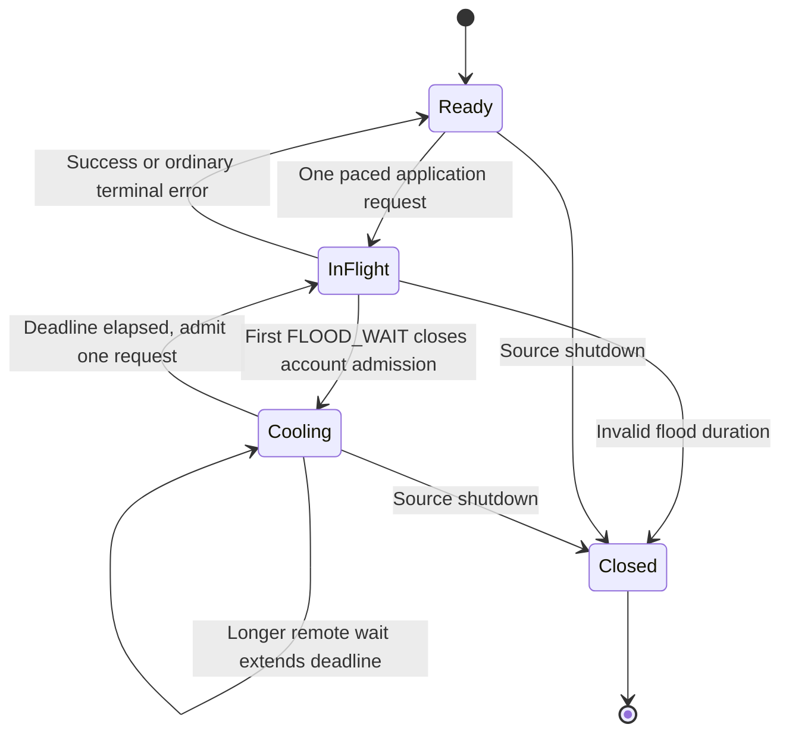

# Prevent avoidable Telegram floods and preserve account cooldowns

Status: SPEC_DRAFT  
Spec lock: unlocked  
Implementation lock: unlocked  
Active Delivery: none  
Unattended decisions: allowed  

<!-- plan:spec:start -->
## The Goal

Prevent a Telegram flood from becoming a cascade of additional requests in the same running Source process. Measure requests at the real SDK transmission boundary, not the number of high-level commands.

- After the first observed `FLOOD_WAIT`, **zero further application requests for that account are transmitted before its wait expires**, including queued history, peer discovery, media chunks, refresh, actions, SDK retries and reconnect replays. Requests already handed to the transport cannot be recalled.
- Use one conservative, account-wide in-memory admission budget across the account's clients and senders. After a wait, release at most one request, never a accumulated burst.
- Local rejections neither count as fresh Telegram floods nor keep extending the original deadline. A later genuine remote wait can only extend it.
- Concurrent missing-peer lookups share an advancing discovery scan; a cached peer needs zero discovery requests. Failed pages do not become empty success or advance Source receipts.
- Keep existing Source wire contracts, sync cursors, Graph batching, credentials and UI unchanged. Add no database tables, migrations, durable cooldowns or cross-process ownership service.
- No real Telegram traffic during development or automated verification; no push or live re-enable without separate owner authorization.

### Owner scope clarification — 2026-09-14

The owner explicitly removed cooldown persistence after a backend/Source crash from this task: a restarted or independent service may receive its first flood; the important guarantee is that the remaining requests then stop. This resolves the previous review's durability objection as **context-mismatched, with an explicit owner override**, not an unresolved requirement.

The limiter's lifetime is the Source process. In-process client eviction/recreation retains that account's limiter, but process death loses it. Independent processes, other Telegram apps and other services are not coordinated. No durable stop flag or manual approval after an ordinary process crash is added. Deliberate process/session rotation to bypass a known wait is still forbidden. The live instance previously disabled for containment stays disabled until separately authorized; removing the persistence requirement does not authorize running it.

Telegram's quota is external and variable. This plan does not guarantee that the first flood can never happen, that a future flood cannot recur, or that another service cannot increase account pressure. It guarantees that this process does not continue hammering after observing one.

## The target

One in-memory account admission owner in the Telegram Source controls the patched GramJS sender boundary. A response hook closes admission synchronously before rejecting the caller's promise; no host round-trip, disk write or background-notification protocol is necessary.



Incoming updates and a narrowly identified set of MTProto control messages remain responsive while application admission is closed. Auth requests, `help.GetConfig`, DC authorization export/import, media reads and nested application requests inside init/container wrappers are application traffic, not control exemptions. Unknown methods cannot silently enter the control allowlist.

### Reused owners and concrete SDK seam

`SessionPool` remains the owner of account clients. It also retains account admission objects across in-process reconnect/evict/recreate. Create and install the guard **before** `TelegramClient.connect()`. Sync clients share by the existing required `account_id`; the separate auth-mode process uses one provisional process-local guard for all clients in that auth ceremony, including a repeated begin. There is no new claim of deduplication across independent processes or distinct externally supplied account identities.

Use a tracked Bun dependency patch pinned to **GramJS 2.26.22**, rather than runtime prototype monkey-patching or a new Telegram transport implementation. The patch adds narrow optional SDK hooks; every Telegram Source client must install them before connect and verify the expected hook revision. Missing hooks are an explicit startup error, never an unguarded fallback.

The patch's exact dependency owners are `client/telegramBaseClient.js` and `.d.ts` (hook revision and typed client hook), `network/MTProtoSender.js` (main/exported sender integration, outgoing recheck, response observation and replay lifecycle), and `extensions/MessagePacker.js` and `.d.ts` (select admissible states without blocking control traffic). These are tracked only inside the patch file, never edited as untracked installed dependencies. Existing sender construction already supplies the same `_client` to main/exported senders; they read the same installed account hook.

Before packing, reserve at most one application request across all that account's senders and leave other states waiting; preserve action ordering and never pack several application requests into one container as one admission. A control-only packet can still proceed. After asynchronous packing/encryption, recheck cancellation and the account hold immediately before handing bytes to `connection.send`. If no longer admissible, requeue the untransmitted application state without treating it as a successful attempt; control acknowledgements remain eligible. Register transmitted state identity so reconnect replay must acquire a new eligible attempt without leaking or double-acquiring the old permit.

A nonempty but ineligible packer queue must sleep on the shared gate's wake signal/next monotonic deadline, not repeatedly return an empty batch into `_sendLoop`. A newly queued control message wakes it immediately. Account gating owns that wake; do not add a second retry timer per request or sender.

In `_handleRPCResult`, record the actual remote error and set the account hold before `state.reject` or releasing the in-flight slot. Success, terminal errors, disconnect and cancellation release or retire permits exactly once. Failed packet construction/send cannot leave a stuck permit; uncertain transmission is not counted as successful receipt. The patch preserves GramJS request serialization, response decoding, sender/DC handling and internal retry code. Wrapping only `TelegramClient.invoke`, `sender.send` or initial queue insertion is insufficient: internal retries and replays bypass those narrower paths.

Proposed internal policy vocabulary (not a Source wire change):

```typescript
interface FloodObservation {
  readonly method: string;
  readonly attemptId: string;
  readonly waitSeconds: number;
  readonly observedAtMonoMs: number;
}

type AdmissionDecision =
  | { readonly kind: "ready" }
  | { readonly kind: "wait"; readonly untilMonoMs: number; readonly reason: "pacing" | "flood" }
  | { readonly kind: "closed"; readonly reason: "stopped" | "invalidFlood" };
```

Initial policy: one in-flight application request per account, at least 3,000 ms between starts, no saved burst tokens, at most 20 starts in `(now - 60 seconds, now]`. A remote wait sets `holdUntil = max(oldHoldUntil, observationTime + waitSeconds * 1000 + 2000)`. All scheduling uses monotonic time; wall-clock timestamps are diagnostic only. Missing, negative, non-finite or unrepresentable durations close this process's account guard without guessing zero. Only a real remote observation changes the deadline. After it expires, the same conservative pacing remains; no speed ramp or exponential retry schedule is introduced. These are conservative local settings, not a promise about Telegram's safe quota.

Do not park a known flooded SDK operation for an hour inside a 30-second host command: reject pending/new application attempts against the current hold using the existing typed rate-limit result and **remaining** wait, not a new remote observation. The current request's caller retains its normal Source error/continuation behavior. SDK-internal retries meet the same gate and cannot transmit; the independent short-flood sleep-and-retry in `sendWithFloodRetry` is removed. For ordinary pacing use a bounded waiting queue of 32 states per account; excess/expired work gets an explicit ordinary local failure without fabricated remote-flood telemetry. No expired waiter is released later. Incoming subscription processing and `listen_stop` do not await a quota permit.

Keep the original remote error as the cause of the internal rate-limit error; normalize its exposed wait to the guard's current remaining hold at the existing client/dispatch boundary. This preserves `-32002`/`data.retry_after` without adding wire fields or recording a second remote flood. Give an ordinary pacing waiter a finite 20-second local queue deadline; SDK/client cancellation can remove it earlier. This does not claim to know an uncommunicated backend command deadline. During a known flood, admission refuses immediately instead of consuming that queue deadline. In the existing stdio loop, control-only `listen_stop` must bypass the eight-command work semaphore: it cannot sit behind eight paced fetches. Keep that same loop testable with injected streams/dependencies; do not build a second protocol driver.

Preserve the host's import-based startup: `main.ts` still starts the Source when its bundle is imported, not only when `import.meta.main` is true. Put the reusable loop with the existing dispatcher in `dispatch.ts` and keep `main.ts` as its normal startup caller; tests inject streams into that same function. No new production entrypoint or test-only production environment switch.

Diagnostics at the Source boundary record only pseudonymous owner, method, attempt ID, origin, monotonic times, remaining wait, deadline, queue length and outcome. Only decoded remote errors increment the remote-flood counter. Never log messages, phone numbers, sessions, request arguments or environment dumps. The test harness captures this structured sink; exposing new diagnostics in Accounts or changing backend stderr handling is outside this fix.

### Proposed file map

All product/test changes are in the **magnis catalog repository**. The app repository changes only this plan; no app runtime or database edits.

```text
MODIFY package.json
       Register the exact SDK patch and route agent:test:backend to the existing test launcher.
MODIFY bun.lock
       Lock the pinned SDK and tracked patch; preserve unrelated dependency versions.
MODIFY plugins/sources/telegram/package.json
       Pin telegram to 2.26.22 because the sender hook is version-specific.
CREATE patches/telegram@2.26.22.patch
       Narrow hooks in the five listed SDK implementation/declaration files.
MODIFY scripts/test-connectors.sh
       Add explicit --agent scoped routing; keep its existing connector-suite behavior.
CREATE scripts/tst_scripts_tgflood_001.test.ts
       Verify exact Bun/Vitest routing and nonzero failure propagation without running providers.
MODIFY plugins/sources/telegram/src/live.ts
       Install/reuse account guards, preserve them on reconnect, and coalesce peer discovery.
MODIFY plugins/sources/telegram/src/client.ts
       Validate flood duration and remove independent short-flood retry policy.
MODIFY plugins/sources/telegram/src/dispatch.ts
       Preserve typed runtime floods during listen/auth/command errors; keep validation errors distinct.
MODIFY plugins/sources/telegram/src/main.ts
       Reuse the stdio loop with injectable streams; let listen_stop bypass only the work semaphore.
CREATE plugins/sources/telegram/src/request-admission.ts
       Single in-memory account policy, clock, wake/cancel and structured observations.
CREATE plugins/sources/telegram/src/testing/mtproto-transport.ts
       Fake low-level transport/crypto boundary and deterministic recording/barriers for real SDK loops.
CREATE plugins/sources/telegram/src/tst_src_tgflood_001.test.ts
       Five coherent in-process behavioral journeys through SDK and Source dispatch.
MODIFY plugins/sources/telegram/src/client.test.ts
       Update the explicitly superseded short-wait retry assertions; preserve unrelated tests and IDs.
MODIFY plugins/sources/telegram/src/live.test.ts
       Supply explicit guard owners to existing client fixtures; preserve paging/media regression coverage.
MODIFY plugins/sources/telegram/src/surfaces/telegram/execute.test.ts
       Replace the superseded short-flood auto-send expectation with an immediate typed refusal.
```

Sixteen files: four dependency/patch files, two test-entrypoint files, five production Source files, and five test/fixture files. The patch is one tracked file but contains changes to five SDK files; report its actual added/deleted lines separately so the file count does not hide a vendor rewrite. `main.ts` is included because direct dispatcher tests would miss the existing eight-command semaphore; the execute regression is included because it currently requires the very short-flood retry the owner wants removed. Existing pagination, Source envelopes, subscriptions, sync state and Graph implementations are reused, not copied. The peer-scan changes stay in `live.ts` with the existing `LiveDialogPager`; no new discovery service. The implementation review must reject unrelated formatting/dependency churn.

### User flows

1. Connect and subscribe once; share paced outgoing requests between history, discovery and media while incoming updates continue.
2. A request receives the first flood. The account guard closes before other callers can launch another application request. Every other queued caller sees the same remaining pause.
3. Advancing time or repeated UI/host commands during the pause sends nothing and does not extend it. An already-transmitted request reporting a longer real wait can extend it.
4. At expiry, one request is allowed. A success keeps conservative pacing; another flood closes the account again immediately. There is no queued burst or separate retry loop per caller.
5. Recreating a client in the same process cannot erase a known wait. Process death may erase it, as explicitly accepted by the owner. A fresh process uses the initial conservative policy and reacts to its own first flood.

## Today, measured against that

App planning base: `origin/staging` at `0d8b5f6cc77493cbd3117446f9a05b0769378103`. The running instance was on `telegram-sync-integration`, receipt `119f2bc5c`, not that base. Catalog audit: `3824bd3065e59ef4a081146a3a1138c15051d881` with pre-existing dirty Telegram changes; the dirty work is not implicitly owned or included. Before implementation decomposition, record the approved catalog base/prerequisite commits through the normal branch workflow. Do not copy files or silently stage that dirty work. No app-native-PG harness prerequisite is needed for this narrowed Source-only task.

Verified deployed Source package: `sha256:3f5ce0dd30d41cdc069faf68c2d696e09d18d97e3e837fd18378f74bf320ea57`; bundled `dist/main.js` digest `ccdd421e109f27565158fcade946f4ad43fe5959b42b14e13bf5d2f14cec5483`. Older unpacked S18 directories are not evidence for this S32 deployment.

- The observed integration branch's host cooldown was process-local and reactive. It is not the fix's enforcement boundary and is not assumed present on staging.
- Catalog `client.ts::sendWithFloodRetry` independently sleeps/retries short waits. `SessionPool` shares clients but no account-wide request budget; `resolvePeer` can restart `iterDialogs({})` on every cache miss.
- GramJS `client/users.js::invoke` requeues retry states; downloads use `invokeWithSender`; `_sendLoop` prepends pending states on reconnect; `_handleRPCResult` has the originating request/error before caller catches. These are why a command-only limiter cannot establish the desired guarantee.
- `dispatch.ts` can relabel listener-start runtime errors as invalid parameters. Background SDK handling can swallow a flood after it reaches the sender, so observation belongs before that catch.
- The catalog agent backend entrypoint currently runs Vitest, whose include list excludes Bun Telegram tests. The existing `scripts/test-connectors.sh` already owns their Bun lane and will be extended rather than bypassed.

### Incident facts retained, not a new live check

On 2026-09-14 the retained log had 138 committed backfill pages between 11:22:48 and 11:27:50 UTC, none afterward through containment. Stored statuses at 16:51/16:55 reported another 27/28 seconds but do not identify fresh Telegram responses versus local hold rejections. Source stderr was discarded by the observed host, so the original method, exact flood count and maximum remote penalty cannot be reconstructed.

At 17:16:06 UTC pause was acknowledged; at 17:16:07 the normal disable action acknowledged `source:magnis.telegram = installed_disabled`. Read-only PostgreSQL observations at 17:17:41 and 17:19:03 retained one account/connection, last attempt 17:15:55.502, update 17:16:06.394 and ingested count 452926 beyond the old retry deadline. No logout, credential export or Graph deletion occurred. This proves stopped sync-state advancement in that instance, not Telegram account health or absence of another client's traffic. No new provider probe is part of this plan update.

## Invariants and five complete mock journeys

Use `test-protocol` metadata (`@test-id`, `@scenario`, `@covers`, `@deterministic`, `@fixtures`) and first-token test IDs. Existing proposed source IDs remain attached to their original behaviors. Retire the unimplemented durable-backend proposals `tst_bts_tgflood_001/002` and `scn_tgflood_003/005`; do not silently repurpose those IDs. New in-process scenarios use `006/007`.

Shared fixture: synthetic account A, three historical chat ID sets of 120, 70 and 5 messages, pinned metadata, two later live messages, and a three-chunk media file; synthetic account B is independent. Real GramJS request construction, message packing, response decoding, internal retry/reconnect code, Telegram Source client and dispatcher run. Fake only low-level socket/crypto I/O and clock/barrier control; inject decoded wire-equivalent error/results through the real sender handlers, never replace `invoke`, `getMessages` or `sendWithFloodRetry`. Record each application request at transmission. Unexpected network attempts fail immediately; no real session or host/DB is needed. This is Source integration, **not a claim of full Nest-to-Graph or live Telegram certification**.

### F1 — Healthy mixed requests share one account budget

`tst_src_tgflood_001` / `scn_tgflood_001`.

1. **Step 1 → Verify:** Construct guarded clients and run normal connection/setup and subscription against fake I/O. Even setup application calls are recorded and gated before the first history page; main/exported senders have the same account owner.
2. **Step 2 → Verify:** Queue history, three media chunks and concurrent peer lookups. Advance fake time through explicit barriers. Maximum application concurrency is one per account, starts are at least 3 seconds apart, rolling count is at most 20, and each media chunk costs its own admission.
3. **Step 3 → Verify:** Inject two incoming updates while application work waits and release a control acknowledgement. Updates are emitted without a quota token; control is not blocked behind waiting application states. Nested application requests do not inherit a control exemption.
4. **Step 4 → Verify:** Finish the history fixture. Its unique emitted historical IDs equal exactly 195, pages contain at most 50 messages, pins survive, and both live IDs appear. No Graph persistence is inferred from Source emissions.
5. **Step 5 → Verify:** Hold A and progress B, then stop A. B has its own budget; A's cancelled work never transmits and every owned timer/permit settles.

### F2 — First flood blocks every other queued request and hidden retry

`tst_src_tgflood_002` / `scn_tgflood_002`; one table-driven journey with separately reported cases.

1. **Step 1 → Verify:** For each named origin (GetDialogs, GetHistory, GetState, media chunk, fake action, fake auth, listen-start setup, SDK server-error retry and reconnect replay), assert the real request reaches the transmission recorder. Queue different request families behind it; a case that misses its intended origin fails rather than skips.
2. **Step 2 → Verify:** Inject `FLOOD_WAIT_4`, then a separate `FLOOD_WAIT_3600` case through the real RPC error handler. Observe the account hold set before the original promise rejects. The recorder sees zero additional application attempts until deadline plus margin; queued requests and caller retries do not escape through another sender.
3. **Step 3 → Verify:** Issue repeated new Source calls during that wait and advance fake time to one millisecond before expiry. All report the decreasing remaining wait; remote-flood count stays one and the deadline stays fixed. No independent short-wait helper sleeps and resends.
4. **Step 4 → Verify:** Seed a genuine delayed response from explicitly pre-existing transmitted work, first shorter then longer, followed by a late success. Only the longer remote wait extends the maximum; successes and local rejections cannot clear or inflate it. Do not fabricate impossible overlapping starts to test this race.
5. **Step 5 → Verify:** Deliver incoming updates/control, then advance past expiry. At most one application request starts. Its new flood closes the account immediately again; its success in a separate case keeps the 3-second spacing. No backlog burst occurs.

### F4 — Peer resolution resumes rather than causing repeat discovery bursts

`tst_src_tgflood_003` / `scn_tgflood_004`.

1. **Step 1 → Verify:** Ask concurrently for two peers beyond the first dialog page. Exactly one shared scan advances; both callers do not request offset zero independently.
2. **Step 2 → Verify:** Flood the next page and retry after fake-time expiry. The shared scan resumes from its last successful continuation, not the beginning. One caller cancelling leaves the other caller's scan intact.
3. **Step 3 → Verify:** Resolve a peer already learned from live data. No GetDialogs request occurs; pinned entities are not dropped from the shared cache.
4. **Step 4 → Verify:** Exhaust the scan for an inaccessible peer and time out a separate history page. Neither failure becomes empty success, advances Source receipt/continuation or claims end-of-history merely because a total estimate matches.
5. **Step 5 → Verify:** Resume successfully. The unique historical IDs are the expected 195; no successful earlier discovery page is needlessly reread in this runtime.

### F6 — In-process guard survives client replacement and expires/cancels correctly

`tst_src_tgflood_004` / `scn_tgflood_006`.

1. **Step 1 → Verify:** Flood account A, evict/recreate its client inside the same SessionPool, and create an exported DC sender. They share the original hold; none transmits before expiry. Repeating auth begin within the same auth-mode process likewise cannot reset its provisional hold.
2. **Step 2 → Verify:** With no flood, fill the 32-state pacing queue and offer a 33rd state. Queue remains bounded, overflow is explicit local failure, and no remote-flood event is invented. Hold fake time fixed: pack/send invocation counters do not spin on the ineligible queue, and only the shared deadline wake is scheduled. A new control message wakes the sender immediately. Cancel/expire waiting operations and advance time: none is transmitted after cancellation.
3. **Step 3 → Verify:** Exercise absent, negative, non-finite and overflowed flood durations plus wall-clock jumps. Invalid values close account admission without a guessed deadline; wall-clock changes do not alter a valid monotonic hold.
4. **Step 4 → Verify:** Fail packet packing/send, reconnect with a replay state, then stop. Permits are neither leaked nor acquired twice; replay is still paced and cancelled states cannot return to the queue. Incoming control is responsive throughout.
5. **Step 5 → Verify:** Construct a completely fresh process-owned pool with no carried state. It starts at the conservative initial policy and reacts correctly to its own first flood. Assert no safety-state file/DB write, cross-process lock or manual-recovery requirement was introduced. This is the owner's explicitly accepted restart boundary, not a durability test.

### F7 — Real Source dispatch exposes one wait and preserves subsequent output

`tst_src_tgflood_005` / `scn_tgflood_007`.

1. **Step 1 → Verify:** Drive the existing stdio loop and its `handleMessage` dispatcher with injected streams and normal fetch, listen and execute calls wired to the guarded real SDK clients on fake I/O. Do not use the high-level `TELEGRAM_FIXTURE_FILE` branch to bypass the client. The real subscription registry emits incoming envelopes. In an entrypoint smoke substep, import `main.ts` in a test-owned child and send only `initialize` plus EOF: exactly one initialization reply proves import-based startup still works; that metadata-only check performs no Telegram call.
2. **Step 2 → Verify:** Inject a runtime flood during listen setup and again during a fetch in separate cases. Responses preserve `-32002` and valid remaining `data.retry_after`; malformed user arguments still return validation errors. No new Source wire field or protocol version is needed.
3. **Step 3 → Verify:** Queue history/media while that hold is active and deliver the two live identities. Zero further application calls transmit; the failed page emits no successful receipt and local command responses are not counted as additional remote floods. Separately fill all eight command slots with paced work and send `listen_stop` through the same stdio stream: it completes without waiting for a command slot or quota permit.
4. **Step 4 → Verify:** Resume one request at expiry, finish the remaining Source pages and compare emitted IDs. Exactly 197 unique message identities are observed, including the two live identities. Replayed envelopes may repeat IDs; no false claim of Graph commit or provider-wide completion is made.
5. **Step 5 → Verify:** Inspect structured diagnostics for original method, remote/local origin, fixed hold and remaining wait; assert fake session/phone/payload/env sentinels are absent. Shut down only fixture-owned clients/tasks; no network or storage resources are left running.

### Commands and required evidence

Extend the existing catalog launcher with an explicit `--agent` lane. `package.json` points `agent:test:backend` at `bash scripts/test-connectors.sh --agent`; exact Telegram Source and `scripts/tst_scripts_tgflood_001.test.ts` targets route to Bun, explicit existing Vitest targets route to Vitest, unsupported targets fail rather than run zero tests. With `--agent` and no target preserve the previous Vitest default. Without `--agent` preserve the existing full connector suite. The routing test (`tst_scripts_tgflood_001` / `scn_tgflood_008`) uses test-owned fake executables to check both lanes, exact argument forwarding, unknown-target rejection and propagated failure exit codes; it invokes no provider tests.

After this adapter exists, the scoped commands from catalog root are:

```bash
bun run agent:test:backend -- scripts/tst_scripts_tgflood_001.test.ts
bun run agent:test:backend -- plugins/sources/telegram/src/tst_src_tgflood_001.test.ts
bun run agent:test:backend -- plugins/sources/telegram/src/client.test.ts plugins/sources/telegram/src/live.test.ts
```

Use fake monotonic time and explicit queue/send/response barriers, never long real sleeps. Each new behavioral case must be RED against the original implementation for the expected behavior, not missing dependencies, missing tests or a runner import error. Removing the first-flood fence, allowing SDK replay, resetting an in-process guard or restarting discovery must make its relevant journey RED. Existing auth/execute/commands/fixture regressions run through the same scoped Bun lane. Installation must apply the tracked SDK patch reproducibly; tests assert hook revision. No automated test uses the owner's credentials.

For each journey and parameter case record UTC start/end, code/patch digests, command, expected/actual result, remote floods, local refusals, per-account transmissions, timestamps, maximum concurrency and emitted IDs/receipts. These are mock correctness metrics, not live Telegram throughput or Graph transaction evidence. No new behavior test has been written or run in this planning turn.

## Validation, sequencing and scope

- The removed durable-host requirement is not allowed to return as a Stage 0 blocker. This task does not need a new database or Nest/Graph harness. Existing application-level sync/Graph verification remains separate and is not certified by these Source tests.
- The SDK hook, admission owner and client wiring share an interface and are sequential work. Once that interface is fixed, launcher/runner checks are disjoint from Source implementation and may run in parallel; final Source regression integration joins them. Do not start parallel agents on overlapping Source files.
- Freeze the catalog prerequisite/base and exact commit-sized Task graph after the owner approves this narrowed SPEC, using the normal worktree/planctl process. Approval of this scope correction alone is not approval of an implementation graph. No app code needs to be merged/copied into that catalog worktree.
- No UI redesign, Source specification amendment, Graph/sync schema change, new durable cooldown, account deletion, session rotation or live full-account run. Record actual changed lines, including dependency patch lines, to measure the minimal-change constraint.
- A later separately authorized live check stays bounded to one known chat, no media/discovery sweep/send, at most three application attempts including setup/retries, at most 60 seconds, and immediate stop on a flood/auth error. A clean result only proves that bounded operation at that time. No new request is needed to assess the already-recorded incident facts.

## Pre-approval screen

- **Result:** the first observed flood stops all remaining application traffic for that account in the running Source; expiry releases one paced request, not a burst.
- **Removed:** database persistence, crash-safe cooldown recovery, cross-process coordination, migrations and backend safety-protocol changes.
- **Still required:** real SDK-path mock tests, typed command errors, no repeat-discovery bursts and unchanged emitted data/receipts. Five journeys are described above, not claimed implemented.
- **Not verified here:** full application/Graph integration, UI, live quota safety or account health. No live Telegram call is authorized by this revision.
- **Next approval:** the narrowed SPEC, then the separately rendered Delivery/Stage/Task plan. No code or publication starts from this draft.
<!-- plan:spec:end -->

<!-- plan:implementation:start -->
## Implementation contract
<!-- plan:implementation:end -->

<!-- plan:execution:start -->
## Execution log
<!-- plan:execution:end -->
