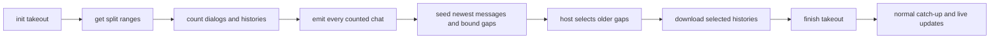

# Telegram takeout sync

Status: SPEC_DRAFT  
Spec lock: unlocked  
Implementation lock: unlocked  
Active Delivery: none  
Unattended decisions: allowed  

<!-- plan:spec:start -->
## The Goal

Telegram first states the exact account plan, then downloads the selected history at the fastest rate the provider accepts. A provider hold pauses requests only until its stated deadline; it never becomes a permanent delay between later requests.

Success means:

- Before the first historical message envelope, every discovered chat has been emitted once with the exact `message_count` returned by Telegram. The existing module therefore fixes the `chats` and `messages` totals before message ingestion begins. Those totals may move later only for a real live message or membership change.
- Full-history reads use Telegram's official Takeout flow: `account.initTakeoutSession`, `messages.getSplitRanges`, and `messages.getDialogs`/`messages.getHistory` wrapped in both `invokeWithMessagesRange` and `invokeWithTakeout`.
- `FLOOD_WAIT_X` and `TAKEOUT_INIT_DELAY_X` pause the account for exactly `X` seconds. On expiry one waiting request may run immediately. No completed-request average or permanent `requestIntervalMs` survives the hold.
- The same real-account, indexer-off stand sustains at least 150 admitted envelopes/second by wall time over a run of at least 10,000 envelopes when Telegram returns no provider hold. If a provider hold occurs, the run reports it separately and makes no local-throughput claim.
- The live performance stand remains only in the `magnis` repository and outside CI. No credential, Telegram network call, PostgreSQL installation, or provisioned-source test enters either repository's CI.

## Why now

The latest real stand regressed from 175.141 envelopes/second (`magnis` `60c24bb`, app `2226442`) to 10.116 envelopes/second (`magnis` `ba40f88`, app `6b2cf303`). In the slow run, Source fetch used 3,403,571 ms and Graph admission 59,889 ms: 98.2% of measured turn time was Telegram fetch, not Graph or PostgreSQL.

The regression is in `AccountAdmission.observe()`. After a remote 420 it derives `requestIntervalMs` from all completed calls and the wait, then applies that interval forever in `select()`. Telegram's documentation says `FLOOD_WAIT_X` is the delay before repeating the action; it does not advertise a continuing request rate. The code turned one temporary provider refusal into permanent throttling.

The current bootstrap also interleaves chat discovery with up to 100 messages per chat. The module cannot know its final plan until the last chat arrives, so both denominators move while messages are already being written. Telegram's Takeout documentation prescribes the missing ordering: count dialogs and each dialog's messages first, then export the histories through split ranges.

Official sources, read 2026-09-22:

- [Takeout API](https://core.telegram.org/api/takeout): initialize one export, obtain split ranges, issue initial `limit=1` dialog and history requests for progress, then paginate histories through the range and takeout wrappers.
- [account.initTakeoutSession](https://core.telegram.org/method/account.initTakeoutSession): security may answer `TAKEOUT_INIT_DELAY_%d` with the exact wait.
- [RPC errors](https://core.telegram.org/api/errors): `FLOOD_WAIT_X` means wait `X` seconds before repeating the action.
- [Data centers / parallel sessions](https://core.telegram.org/api/datacenter#parallel-sessions): absent `tmp_sessions > 1`, one main session is mandatory; exceeding it can invalidate authorization with `AUTH_KEY_DUPLICATED`.

GramJS 2.26.22 already contains `Api.account.InitTakeoutSession`, `Api.account.FinishTakeoutSession`, `Api.messages.GetSplitRanges`, `Api.InvokeWithMessagesRange`, `Api.InvokeWithTakeout`, and `Api.MessageRange`. No dependency replacement or second Telegram client is required.

## The target



### One checkpoint, four phases

The existing Source checkpoint remains the only durable provider state. Existing functions advance it through four literal phases; there is no new service or storage:

| Phase | Owner and provider work | Source answer |
|---|---|---|
| `estimate` | `runBootstrap`: initialize Takeout; read split ranges; in every range call `getDialogs(limit=1)` for its count, paginate those dialogs, then call `getHistory(limit=1)` for every dialog/range and sum exact counts | no envelopes; checkpoint the Takeout id, ranges, per-chat range membership, serializable peer, count, top message and current provider offsets |
| `publish` | `runBootstrap`: revisit recorded dialogs only as needed to rebuild their current chat payload | chat envelopes with final `message_count`; never a message envelope |
| `download` | `runBootstrap` first re-emits each chat with its newest provider page and traversed range; then `backfillChat` serves the bounded older gaps selected by the host through that chat's recorded ranges and peer | newest messages for every chat, then older messages only for gaps retained by the module; existing time and byte budgets apply |
| `finish` | `runCatchup`: the first forward fetch after the gaps are closed finishes Takeout | remove Takeout state, then continue through the existing CatchUp path |

The checkpoint stores the Takeout id as a decimal string because JSON cannot round-trip Telegram's `long`. Per chat it reuses the existing serializable `OffsetPeer` shape and stores count, range membership, top/watermark ids and resumable offsets; it does not store message bodies. The existing `chats` map already scales once per chat, so this adds no second account-sized collection.

Dialog and history pagination remain provider-sized. `messages.getHistory` requests at most Telegram's 100-message page. A Source answer joins as many provider pages as fit the existing 20-second and 3 MiB budgets; it is not split by an arbitrary message count.

The `publish` phase may need more than one Source page to stay under the byte budget. The UI can show chat/message totals growing while the status is still bootstrap, but `messages` completed remains zero. Only after the last counted chat page is committed does `download` begin.

The first `download` page for a chat carries that chat envelope again plus its newest messages. Repeating the same counted chat in the same generation gives a zero plan delta; its traversed range bounds the open Graph gap, and its newest id becomes the CatchUp watermark. Excluded chats still receive their current planned first 100 messages and return in `excluded`, so their gaps stay deleted. Admitted histories longer than the seed page leave one bounded older gap for the existing backfill rotation.

### The existing backfill receives its bootstrap checkpoint

The backend already owns both the per-gap continuation and the opaque `forwardCheckpoint`. It passes that checkpoint unchanged as `forward_checkpoint` in the existing Telegram `backfill_chat` payload. The runtime does not parse Takeout fields.

```ts
// Existing Telegram-specific v1 backfill payload, extended by one existing value.
interface TelegramBackfillPayload {
  action: "backfill_chat";
  chat_id: number;
  before_message_id: number;
  lower_message_id: number;
  forward_checkpoint: JsonValue;
}
```

The Telegram Source reads its own checkpoint, reconstructs the peer from the recorded `OffsetPeer`, selects the split ranges recorded for that chat and wraps each `GetHistory`. Backfill never restarts dialog discovery. A checkpoint created by the previous Source version has no Takeout state. If such a checkpoint still has bounded gaps, the Source throws the existing `CursorExpiredError`; the worker starts one new bootstrap pass. It never silently falls back to the slow ordinary-history path. An old checkpoint already in steady CatchUp remains valid because it has no unfinished export.

### Exact temporary holds, no learned throttle

`AccountAdmission` keeps the existing one-active-request, FIFO, bounded queue, replay fence, control-message bypass and process-local account ownership. It loses only `completedCount`, `completedStartedAt`, `lastSentAt`, `requestIntervalMs`, and the wake/select checks derived from them.

The 420 parser accepts the exact numeric suffix of `FLOOD_WAIT_X`, `FLOOD_PREMIUM_WAIT_X`, and `TAKEOUT_INIT_DELAY_X` when GramJS does not populate `.seconds`. A 420 without a valid non-negative duration still closes admission rather than guessing. A valid wait sets the shared deadline; expiry releases one request immediately. A second real 420 may set a new exact deadline, but successful requests never manufacture a delay.

One main MTProto session remains. This plan does not add parallel main sessions because the running client does not prove `tmp_sessions > 1` with the required PFS setup. Media downloads keep their existing separate GramJS path.

### Crash and finish behavior

Each Source page checkpoints all successful provider work in that page before the host asks for the next page. A process replacement may repeat the uncommitted page, but resumes from the last committed Takeout id and offsets; repeated requests are idempotent and counts are keyed by chat/range before addition.

Finishing uses an explicit checkpoint handshake:

1. the first forward page after backfill writes `phase: "finish"` without finishing remotely;
2. the next page calls `account.finishTakeoutSession(success=true)` through `invokeWithTakeout`;
3. success removes Takeout state; `TAKEOUT_INVALID` is accepted as already finished only while the persisted phase is `finish`, covering a lost host acknowledgement after a successful remote finish.

Any other Takeout error remains visible. There is no ordinary-history fallback, guessed id or automatic re-authentication.

### What people see

The existing Telegram account card and existing module progress plan are reused. During estimate/publication, chats appear and `messages` has a growing denominator with zero historical completion. Then the denominator stops changing and completed messages advance quickly. A real provider delay continues to show `Rate limit (repeat in …)` and clears after its deadline through the already fixed status refresh.

No frontend component, new progress field or second counter is introduced.

## Interfaces and ownership

- `LiveDialogPager` continues to own Telegram dialog decoding and peer reconstruction. It gains wrapper arguments rather than a parallel pager.
- `TgClient` continues to own raw GramJS calls and timeouts. It invokes the already generated Takeout request classes.
- `runBootstrap`, `runCatchup`, and `backfillChat` continue to own Source checkpoint and page assembly.
- `AccountAdmission` continues to own account-wide request admission; it enforces temporary provider deadlines only.
- The backend continues to own gap choice and opaque checkpoint transport. It never interprets Takeout state.
- The Telegram module continues to own admission/exclusion and plan totals. It is unchanged.

## Exact change zones

`magnis-app`, one prerequisite PR into `staging`:

- MODIFY `backend/src/services/sources/sync/sync.page-admission.ts` — include the row's existing `forwardCheckpoint` in a Telegram backfill command.
- MODIFY `backend/src/services/sources/runtime/source-runtime.ts` — pass the opaque value to the v1 `backfill_chat` call.
- MODIFY `backend/test/tst_bts_sync_worker_001.test.ts` and `backend/test/tst_bts_mcp_runtime.test.ts` — prove the exact value crosses both boundaries unchanged.

`magnis`, one Telegram PR into `staging` after the app prerequisite:

- MODIFY `plugins/sources/telegram/src/request-admission.ts` — remove learned permanent pacing and parse exact Takeout/Flood durations.
- MODIFY `plugins/sources/telegram/src/client.ts` and `plugins/sources/telegram/src/live.ts` — use the existing GramJS Takeout/range requests through the current client and pager.
- MODIFY `plugins/sources/telegram/src/surfaces/telegram/commands.ts` — implement estimate, publish, seed, range-aware backfill and finish in the existing checkpoint flow.
- MODIFY `plugins/sources/telegram/src/tst_src_tgflood_001.test.ts`, `plugins/sources/telegram/src/live.test.ts`, `plugins/sources/telegram/src/surfaces/telegram/commands.test.ts`, and `plugins/sources/telegram/src/surfaces/telegram/execute.test.ts` — deterministic RED/GREEN behavior at the existing seams.
- REPLACE the hash-addressed Telegram receipt and MODIFY the generated catalog index outputs selected by the normal publication command; their exact paths are frozen after the new package hash exists.

This is four authored app files and eight authored catalog files. The catalog build adds only its normal hash-addressed generated outputs. No new production, test, runner or stand file is planned. `acceptance/telegram-performance/` is reused unchanged and never joins CI.

## Verification journeys

All automated tests use the existing fake MTProto transport and project `agent:*` commands. No test owns a real Telegram credential or PostgreSQL service.

### Temporary provider hold

1. **Step 1 → Verify:** complete several fake application requests at one clock instant; the next free slot sends immediately, with no minimum interval.
2. **Step 2 → Verify:** inject `FLOOD_WAIT_4`; deadline-minus-one sends nothing and reports one second remaining.
3. **Step 3 → Verify:** advance to the exact deadline; one request sends immediately, and later successful requests never introduce spacing.
4. **Step 4 → Verify:** inject `TAKEOUT_INIT_DELAY_123` without `.seconds`; the wire answer is an exact 123-second typed rate limit. An unparseable 420 still closes admission.

### Exact plan before history

1. **Step 1 → Verify:** initialize Takeout and return two split ranges; the fake wire sees `InitTakeoutSession` then `GetSplitRanges` through `InvokeWithTakeout`.
2. **Step 2 → Verify:** each range starts with `GetDialogs(limit=1)`; return one chat in both ranges and another in one. Every dialog/history count call is nested in `InvokeWithMessagesRange` and `InvokeWithTakeout` using the recorded range.
3. **Step 3 → Verify:** stop after a page and resume its checkpoint; no committed chat/range count is added twice and no range is skipped.
4. **Step 4 → Verify:** finish estimation; both chats are emitted with summed exact counts and recorded peers, and zero message envelopes have been emitted.
5. **Step 5 → Verify:** resume after the last chat page; each seed page repeats the counted chat, emits its newest messages, states the traversed range and fixes its watermark. The existing module test proves the repeat changes plan by zero and still excludes the same chat; the worker test proves an admitted 120-message chat leaves a bounded older gap while an excluded chat leaves none.

### Selected history and finish

1. **Step 1 → Verify:** the app builds a bounded backfill command; the exact opaque `forwardCheckpoint` appears unchanged in the Source tool arguments.
2. **Step 2 → Verify:** after a fake process replacement, the Source reconstructs the peer without `GetDialogs`, selects only that chat's recorded ranges, respects the asked gap and page budgets, and reports exactly the ids it traversed.
3. **Step 3 → Verify:** pass a legacy unfinished checkpoint; `CursorExpiredError` starts a new bootstrap instead of ordinary history. Pass an old steady checkpoint to CatchUp; it remains valid.
4. **Step 4 → Verify:** close all fake gaps; one forward page persists `phase: "finish"` without a finish RPC, and the resumed page then calls FinishTakeout.
5. **Step 5 → Verify:** success clears Takeout state; `TAKEOUT_INVALID` clears it only from persisted `finish`; every other error remains visible.

Regression commands cover current auth, live `link_end`, catch-up, media, queue, replay, cursor, plan and package certification. Run `bun run agent:verify:pr` in both `magnis` and `magnis-app`.

After both artifacts are connected, run the existing manual stand with clean app sync data but the preserved Telegram secret, indexer off, and at least 10,000 admitted envelopes. Report Source fetch, Graph admission, wall time and wall envelope rate. The target is at least 150 envelopes/second when no provider hold occurs. Repeat once with indexer on only after the indexer-off target is met.

The live stand result is evidence attached to the PR, not a CI acceptance test. If Telegram returns `TAKEOUT_INIT_DELAY_X` or `FLOOD_WAIT_X`, record the exact hold and resume after expiry; do not reinterpret the held run as local performance.

## Invariants

1. A provider wait changes only the shared deadline, never a permanent request interval. Covered by the temporary-hold journey.
2. At most one account application request is active; control traffic and incoming updates remain responsive. Covered by the existing wire journey.
3. Every historical message request in a new bootstrap uses the checkpoint's Takeout id and one of that chat's recorded ranges. Covered by the exact-plan journey.
4. No historical message envelope precedes the last counted chat envelope. Covered by the exact-plan journey.
5. A seed page bounds an admitted chat's open gap, keeps its count unchanged and removes an excluded chat's gap. Covered by the exact-plan journey.
6. The backend transports the Source checkpoint byte-for-byte and does not know its schema. Covered by the selected-history journey on both backend boundaries.
7. A committed Source page is the only advancement point. A failed provider call publishes neither a new checkpoint nor traversed coverage. Covered by the resumed fake page.
8. Existing exclusion remains authoritative: only gaps retained by the module reach Takeout backfill. The Source does not duplicate `shouldIndex`.
9. Live `link_end` keeps the provider event's date and is untouched by this work.

## Constraints and non-goals

- No direct push or merge to `staging`; the owner merges both PRs.
- No new runner, worktree helper, Source protocol version, UI state, database table, secret, Graph operation, module rule, background service or SDK fork.
- No parallel main Telegram sessions, speculative request rate, randomized delay, exponential delay for 420, or ordinary-history fallback.
- No media export through Takeout in this change; existing on-demand media download remains as-is.
- No attempt to make a live account test deterministic or suitable for CI.
- No rewrite of CatchUp. Once Takeout is finished, existing forward sync and live updates continue unchanged.

## Dependencies and delivery boundary

- The plan PR is stacked on `magnis` PR #39, which contains the current Telegram integration and the manual performance stand.
- The backend Delivery starts from `magnis-app` PR #278 after the owner merges it into `staging`.
- The catalog Delivery starts from `magnis` PR #39 after merge and depends on the backend Delivery because its new backfill requires `forward_checkpoint`.
- Exactly two implementation PRs exist because code lives in two repositories. There is no child plan.

## Reuse map

Reuse `AccountAdmission`, `SessionPool`, `TgClient`, `LiveDialogPager`, `DialogOffset`, `OffsetPeer`, `TgOps`, `runBootstrap`, `runCatchup`, `backfillChat`, `CursorExpiredError`, the existing checkpoint `chats` map, page time/byte budgets, Graph gaps, module `message_count` planning, current account card, fake MTProto transport, and `acceptance/telegram-performance`.

## Names introduced

| Name | Reason |
|---|---|
| `takeout` | Telegram's official API name for a bulk account export and the exact word used by GramJS classes |
| `estimate`, `publish`, `download`, `finish` | literal durable phases needed to order exact counts, chat publication, selected history and remote completion |
| `forward_checkpoint` | wire spelling of the backend's existing `forwardCheckpoint`; it keeps the Source checkpoint opaque |

## Pre-approval screen

- Result: exact totals first, selected history second, temporary provider holds only, at least 150 envelopes/second on a clean unheld real run.
- Smallest system change: one opaque backend field, existing Telegram classes and checkpoint, existing module/UI/stand.
- Not claimed yet: implementation, a live Takeout authorization, or the target speed on the owner's account.
- After SPEC approval, one Stage graph will be written for the two unavoidable repository PRs. No implementation starts before the second approval.
<!-- plan:spec:end -->

<!-- plan:implementation:start -->
## Implementation contract
<!-- plan:implementation:end -->

<!-- plan:execution:start -->
## Execution log
<!-- plan:execution:end -->
