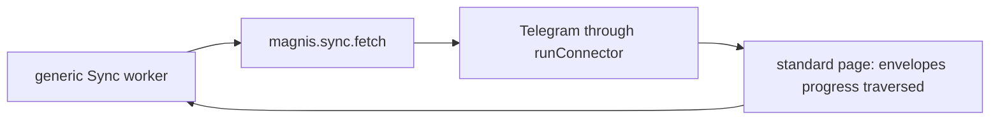
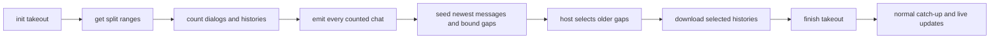

# Telegram takeout sync

Status: SPEC_DRAFT  
Spec lock: unlocked  
Implementation lock: unlocked  
Active Delivery: none  
Unattended decisions: allowed  

<!-- plan:spec:start -->
## The Goal

Telegram first states the exact account plan, then downloads the selected history at the fastest rate the provider accepts. A provider hold pauses requests only until its stated deadline; it never becomes a permanent delay between later requests.

The work also removes Telegram's two Source exceptions. Every in-repository Source runs through `@magnis/connector-sdk`, and every scheduled read—including bounded per-identity history—uses `magnis.sync.fetch`. `magnis.execute` remains only for interactive actions such as send, reply and media download. The backend contains no Telegram command, payload or result adapter.

Success means:

- Before the first historical message envelope, every discovered chat has been emitted once with the exact `message_count` returned by Telegram. The existing module therefore fixes the `chats` and `messages` totals before message ingestion begins. Those totals may move later only for a real live message or membership change.
- Full-history reads use Telegram's official Takeout flow: `account.initTakeoutSession`, `messages.getSplitRanges`, and `messages.getDialogs`/`messages.getHistory` wrapped in both `invokeWithMessagesRange` and `invokeWithTakeout`.
- `FLOOD_WAIT_X` and `TAKEOUT_INIT_DELAY_X` pause the account for exactly `X` seconds. On expiry one waiting request may run immediately. No completed-request average or permanent `requestIntervalMs` survives the hold.
- Telegram uses the same `runConnector` program, Sync Profile requests, push envelopes, error mapping and bounded concurrent dispatcher as every other Source. Its manifest says `runtime_kind = "connector_sdk"`; `plugins/sources/telegram/src/dispatch.ts` is gone.
- The same real-account, indexer-off stand sustains at least 150 admitted envelopes/second by wall time over a run of at least 10,000 envelopes when Telegram returns no provider hold. If a provider hold occurs, the run reports it separately and makes no local-throughput claim.
- The live performance stand remains only in the `magnis` repository and outside CI. No credential, Telegram network call, PostgreSQL installation or provisioned-source test enters either repository's CI.

## Why now

The latest real stand regressed from 175.141 envelopes/second (`magnis` `60c24bb`, app `2226442`) to 10.116 envelopes/second (`magnis` `ba40f88`, app `6b2cf303`). In the slow run, Source fetch used 3,403,571 ms and Graph admission 59,889 ms: 98.2% of measured turn time was Telegram fetch, not Graph or PostgreSQL.

The regression is in `AccountAdmission.observe()`. After a remote 420 it derives `requestIntervalMs` from completed calls and the wait, then applies that interval forever in `select()`. Telegram documents `FLOOD_WAIT_X` as the delay before repeating the action, not a continuing request rate. One temporary provider refusal became permanent throttling.

The current bootstrap interleaves chat discovery with messages, so the plan denominators move during ingestion. Telegram's Takeout documentation prescribes the missing ordering: count dialogs and each dialog's messages first, then export histories through split ranges.

The current Source path also has exactly the exception this plan must not extend. Telegram alone owns a custom stdio dispatcher, and the backend converts a generic `SourceCommand` into `magnis.execute { action: "backfill_chat", ... }`. This is a read disguised as an action and makes the backend know Telegram fields. Adding another Telegram field would deepen that defect.

Official sources, read 2026-09-22:

- [Takeout API](https://core.telegram.org/api/takeout): initialize one export, obtain split ranges, issue initial `limit=1` dialog and history requests for progress, then paginate histories through the range and takeout wrappers.
- [account.initTakeoutSession](https://core.telegram.org/method/account.initTakeoutSession): security may answer `TAKEOUT_INIT_DELAY_%d` with the exact wait.
- [RPC errors](https://core.telegram.org/api/errors): `FLOOD_WAIT_X` means wait `X` seconds before repeating the action.
- [Data centers / parallel sessions](https://core.telegram.org/api/datacenter#parallel-sessions): absent `tmp_sessions > 1`, one main session is mandatory; exceeding it can invalidate authorization with `AUTH_KEY_DUPLICATED`.

GramJS 2.26.22 already contains `Api.account.InitTakeoutSession`, `Api.account.FinishTakeoutSession`, `Api.messages.GetSplitRanges`, `Api.InvokeWithMessagesRange`, `Api.InvokeWithTakeout`, and `Api.MessageRange`. No dependency replacement or second Telegram client is required.

## The target





### One Source program

`@magnis/connector-sdk` remains the one Source executable framework. Its existing `ConnectorConfig` continues to own fetch, auth, listen and execute handlers. The shared implementation gains the behavior for which Telegram had copied a dispatcher:

- `runConnector` dispatches tool calls concurrently under one fixed SDK bound, so a long fetch cannot starve an interactive action. The existing `download_file` action uses the SDK's separate bounded download capacity; `listen_stop` remains an unblocked control call. These rules are Source-independent and serve both Telegram and Google media operations.
- `--auth-mode` is enforced by `runConnector` for every auth-capable Source: that process serves only `magnis.auth.*`; a normal Source process refuses auth calls. Handler state remains alive in the process across begin and step.
- `listen_start` and `listen_stop` require the host's `subscription_id`; there is no `sub:legacy` default and no `magnis.sync.listen` alias. The SDK emitter carries the existing optional envelope `position`. Telegram messages state their positive message position; a dated `link_end` omits `position` because membership is not message coverage.
- Push capabilities omit a polling interval. All tool failures use the SDK's existing `ConnectorError`, `RateLimitError` and `CursorExpiredError` mapping.
- `tools/list` advertises the standard `magnis.sync.fetch` tool. Current catalog certification accepts only `runtime_kind = "connector_sdk"`; the historical selected-channel declaration may still describe the old immutable Telegram artifact as `custom`.

Telegram supplies an ordinary `ConnectorConfig` and calls `runConnector` from `main.ts`, like the other Sources. Its execute table contains only `send_message`, `reply` and `download_file`. Its custom dispatcher, custom notification serialization, `backfill_chat` execute handler and their exceptions in testkit/docs are deleted.

### One standard fetch request

The existing generic `SourceCommand` remains the internal command. It gains only the two values the worker already owns but could not express at the Source boundary: the current `scopeId` and `forwardCheckpoint`. Its existing `cursor` remains the continuation inside the current target, and its existing `target` remains the Magnis-owned durable target.

`callNativeFetch` handles bootstrap, catch-up and backfill. It sends one standard `magnis.sync.fetch` request; backfill is no longer a separate call path:

```ts
interface FetchArgs {
  surface: string;
  direction: "backward" | "forward";
  cursor?: JsonValue;
  scope_id?: string;
  target?: { kind: "gap"; start: number; end: number };
  forward_checkpoint?: JsonValue;
  tracked_handles?: string[];
}
```

The fields are generic Sync concepts already present in the backend. A bootstrap or catch-up omits the fields it does not own. A backfill request uses `direction: "backward"`, the selected gap's `scope_id` and `target`, its target-bound `cursor`, and the account's opaque `forward_checkpoint`. The runtime serializes them and never inspects provider checkpoint contents.

The standard `FetchResult` admits the page fields the host already decodes: `envelopes`, either legacy cursor fields or explicit `progress`, and `traversed`. Telegram itself states the ranges it actually read. The backend no longer computes Telegram coverage from message payloads or validates Telegram message ids; the normal strict page decoder validates the generic result.

On the first page of a selected gap, Telegram starts from `forward_checkpoint`. While that target continues, its opaque continuation token contains the updated Takeout state and provider offset. The worker commits that token as its normal `cursor`. On the terminal page, Telegram returns `completeTarget` with `forwardCheckpoint: { kind: "replace", value: ... }`, promoting the updated account checkpoint. Thus every successful page is resumable without teaching the host Takeout fields or adding a second checkpoint column.

### One checkpoint, four phases

The existing Source checkpoint remains the only durable provider state. Existing Telegram functions advance it through four literal phases; there is no new service or storage:

| Phase | Owner and provider work | Standard fetch answer |
|---|---|---|
| `estimate` | `runBootstrap`: initialize Takeout; read split ranges; in every range call `getDialogs(limit=1)` for its count, paginate those dialogs, then call `getHistory(limit=1)` for every dialog/range and sum exact counts | no envelopes; checkpoint the Takeout id, ranges, per-chat range membership, serializable peer, count, top message and provider offsets |
| `publish` | `runBootstrap`: revisit recorded dialogs only as needed to rebuild their current chat payload | chat envelopes with final `message_count`; never a message envelope |
| `download` | `runBootstrap` first re-emits each chat with its newest provider page; later backward fetches serve the bounded older gaps selected by the host | newest messages for every chat, then older messages only for retained gaps; each answer states `progress` and `traversed` |
| `finish` | `runCatchup`: the first forward fetch after the gaps are closed finishes Takeout | remove Takeout state, then continue through existing catch-up |

The checkpoint stores the Takeout id as a decimal string because JSON cannot round-trip Telegram's `long`. Per chat it reuses the existing serializable `OffsetPeer` and stores count, range membership, top/watermark ids and resumable offsets; it does not store message bodies. The existing `chats` map already scales once per chat, so this adds no second account-sized collection.

Dialog and history pagination remain provider-sized. `messages.getHistory` requests at most Telegram's 100-message page. A Source answer joins as many provider pages as fit the existing 20-second and 3 MiB budgets; it is not split by an arbitrary message count.

The `publish` phase may need more than one Source page to stay under the byte budget. The UI can show chat/message totals growing while status is bootstrap, but `messages` completed remains zero. Only after the last counted chat page is committed does `download` begin.

The first `download` page for a chat carries that chat envelope again plus its newest messages. Repeating the counted chat in the same generation gives a zero plan delta; its `traversed` range bounds the open Graph gap, and its newest id becomes the catch-up watermark. Excluded chats still receive their planned first 100 messages and return in `excluded`, so their gaps stay deleted. Admitted histories longer than the seed page leave one bounded older gap for the existing backfill selection.

The Telegram fetch handler reconstructs the peer from the checkpoint's `OffsetPeer`, selects only the recorded split ranges for `scope_id`, and wraps each `GetHistory`. It never restarts dialog discovery. An unfinished old checkpoint has no Takeout state, so a bounded fetch throws the existing `CursorExpiredError` and the worker starts one new bootstrap pass. It never falls back to ordinary history. An old steady catch-up cursor remains valid.

### Exact temporary holds, no learned throttle

`AccountAdmission` keeps the existing one-active-request, FIFO, bounded queue, replay fence, control-message bypass and process-local account ownership. It loses only `completedCount`, `completedStartedAt`, `lastSentAt`, `requestIntervalMs`, and the wake/select checks derived from them.

The 420 parser accepts the exact numeric suffix of `FLOOD_WAIT_X`, `FLOOD_PREMIUM_WAIT_X`, and `TAKEOUT_INIT_DELAY_X` when GramJS does not populate `.seconds`. A 420 without a valid non-negative duration still closes admission rather than guessing. A valid wait sets the shared deadline; expiry releases one request immediately. A second real 420 may set a new exact deadline, but successful requests never manufacture a delay.

One main MTProto session remains. This plan does not add parallel main sessions because the running client does not prove `tmp_sessions > 1` with the required PFS setup. Media downloads keep their separate GramJS path behind the shared SDK dispatcher.

### Crash and finish behavior

Each Source page checkpoints all successful provider work before the host asks for the next page. A process replacement may repeat an uncommitted page, but resumes from the last committed forward checkpoint or target cursor; repeated requests are idempotent and counts are keyed by chat/range before addition.

Finishing uses an explicit checkpoint handshake:

1. the first forward page after backfill writes `phase: "finish"` without finishing remotely;
2. the next page calls `account.finishTakeoutSession(success=true)` through `invokeWithTakeout`;
3. success removes Takeout state; `TAKEOUT_INVALID` is accepted as already finished only while persisted phase is `finish`, covering a lost host acknowledgement after a successful remote finish.

Any other Takeout error remains visible. There is no ordinary-history fallback, guessed id or automatic re-authentication.

### What people see

The existing Telegram account card and module progress plan are reused. During estimate/publication, chats appear and `messages` has a growing denominator with zero historical completion. Then the denominator stops changing and completed messages advance quickly. A real provider delay continues to show `Rate limit (repeat in …)` and clears after its deadline through the existing status refresh.

No frontend component, new progress field or second counter is introduced.

## Interfaces and ownership

- `@magnis/connector-sdk` owns the only in-repository Source stdio program: capabilities, auth-mode gating, tool dispatch, concurrency, push serialization and error replies.
- `SourceCommand` and `magnis.sync.fetch` own all scheduled read requests. The backend owns target selection; the Source owns provider interpretation and reports its own traversed ranges.
- `graph.request_backfill` remains the existing generic request to wake a stopped bounded-history worker. Telegram passes an empty generic payload; no module fabricates a provider action for it, and the value never crosses the Source boundary.
- `LiveDialogPager` continues to own Telegram dialog decoding and peer reconstruction. It gains Takeout/range wrapper inputs rather than a parallel pager.
- `TgClient` continues to own raw GramJS calls and timeouts. It invokes the generated Takeout request classes.
- `runBootstrap`, `runCatchup`, and the Telegram fetch handler continue to own checkpoint and page assembly. There is no execute-based backfill handler.
- `AccountAdmission` continues to own account-wide request admission and enforces temporary provider deadlines only.
- The Telegram module continues to own admission/exclusion and plan totals; only its obsolete `backfill_chat` wake payload is removed.

## Exact change zones

`magnis-app`, one prerequisite PR into `staging`:

- MODIFY `backend/src/services/sources/runtime/source-protocol.adapter.ts`, `backend/src/services/sources/runtime/source-host.client.ts`, `backend/src/services/sources/runtime/source-runtime.ts`, `backend/src/services/sources/runtime/source-sync-page.codec.ts`, and `backend/src/services/sources/sync/sync.page-admission.ts` — express scope, target and checkpoint in the common fetch request; route every read through `callNativeFetch`; delete the Telegram request/result adapter and provider payload inspection.
- MODIFY `backend/test/tst_bts_mcp_runtime.test.ts`, `backend/test/tst_bts_sync_worker_001.test.ts`, and `backend/test/tst_bts_src_module_adapter_001.test.ts` — prove the exact generic request/result and forbid provider literals or `magnis.execute` in the sync runtime.
- MODIFY `docs/backend/sync.md` and `docs/source-mcp-bridge.md` — document one fetch path and remove `backfill_chat`.

`magnis`, one catalog PR into `staging` after the app prerequisite:

- MODIFY `packages/connector-sdk/contract/source.ts`, `packages/connector-sdk/index.ts`, `packages/connector-sdk/index.test.ts`, and `packages/connector-sdk/contract-v2.test.ts` — type the standard target/checkpoint/traversed/position fields; enforce auth mode, strict subscriptions, standard push, bounded concurrent dispatch and shared error mapping without connector-specific hooks.
- CREATE `plugins/sources/telegram/src/connector.ts`; DELETE `plugins/sources/telegram/src/dispatch.ts` and `plugins/sources/telegram/src/dispatch.test.ts`; MODIFY `plugins/sources/telegram/src/main.ts`, `plugins/sources/telegram/src/subscriptions.ts`, `plugins/sources/telegram/src/surfaces/telegram/fixture.ts`, `plugins/sources/telegram/src/fixture.test.ts`, and `plugins/sources/telegram/manifest.toml` — use `buildConnectorConfig` + `runConnector`, standard notifications and execute actions; remove `backfill_chat`; declare `runtime_kind = "connector_sdk"`.
- MODIFY `plugins/modules/telegram/module/service.ts` and `plugins/modules/telegram/module/__tests__/telegramCommand.test.ts` — remove the obsolete provider action from the existing generic `graph.request_backfill` wake call; the user-selected chat remains UI state and never becomes a Source command.
- MODIFY `plugins/sources/telegram/src/request-admission.ts`, `plugins/sources/telegram/src/client.ts`, `plugins/sources/telegram/src/live.ts`, `plugins/sources/telegram/src/surfaces/telegram/commands.ts`, `plugins/sources/telegram/src/tst_src_tgflood_001.test.ts`, `plugins/sources/telegram/src/live.test.ts`, `plugins/sources/telegram/src/surfaces/telegram/commands.test.ts`, and `plugins/sources/telegram/src/surfaces/telegram/execute.test.ts` — implement exact temporary holds and Takeout through the standard fetch handler; prove messages have positive positions and `link_end` has none.
- MODIFY `packages/testkit/source.ts`, `packages/testkit/__tests__/tst_cat_src_parity_001.test.ts`, `scripts/certify-sources.ts`, `scripts/certify-sources.test.ts`, and `docs/plugins/source.md` — remove the Telegram custom-runtime exception and reject any current in-repository Source not using the connector SDK.
- REPLACE every hash-addressed receipt affected by the shared SDK bundle and MODIFY the generated catalog indexes selected by the normal publication command; exact generated paths are frozen only after the new package hashes exist.

No runner, performance stand or frontend file is added. `acceptance/telegram-performance/` is reused unchanged and never joins CI.

## Verification journeys

All automated tests use existing fake provider transports and project `agent:*` commands. No test owns a real Telegram credential or PostgreSQL service.

### One Source program

1. **Step 1 → Verify:** the packaged Telegram entry calls `runConnector`; certification reports `runtime_kind = "connector_sdk"`, advertises `magnis.sync.fetch`, and has no custom-runtime exception.
2. **Step 2 → Verify:** hold a fake fetch open, then issue an interactive execute call; the shared SDK returns the execute answer before fetch completes and never exceeds its common bound. Fill the download capacity; a fetch and `listen_stop` still complete.
3. **Step 3 → Verify:** start the packaged Source with `--auth-mode`; sync/listen/execute calls are refused and begin→step retains handler state. In normal mode auth calls are refused.
4. **Step 4 → Verify:** a standard live message carries a positive `position`; a dated `link_end` carries none; missing `subscription_id` is an error, and no `sub:legacy` or `magnis.sync.listen` path exists.
5. **Step 5 → Verify:** the module's wake request contains no provider action, and repository guards find no `backfill_chat`, `legacyTelegram`, Telegram provider literal in backend production sync code, custom Telegram dispatcher or current `runtime_kind = "custom"`.

### Temporary provider hold

1. **Step 1 → Verify:** complete several fake application requests at one clock instant; the next free slot sends immediately, with no minimum interval.
2. **Step 2 → Verify:** inject `FLOOD_WAIT_4`; deadline-minus-one sends nothing and reports one second remaining.
3. **Step 3 → Verify:** advance to the exact deadline; one request sends immediately, and later successful requests never introduce spacing.
4. **Step 4 → Verify:** inject `TAKEOUT_INIT_DELAY_123` without `.seconds`; the standard SDK reply is an exact 123-second typed rate limit. An unparseable 420 still closes admission.

### Exact plan before history

1. **Step 1 → Verify:** initialize Takeout and return two split ranges; the fake wire sees `InitTakeoutSession` then `GetSplitRanges` through `InvokeWithTakeout`.
2. **Step 2 → Verify:** each range starts with `GetDialogs(limit=1)`; return one chat in both ranges and another in one. Every dialog/history count call is nested in `InvokeWithMessagesRange` and `InvokeWithTakeout` using the recorded range.
3. **Step 3 → Verify:** stop after a page and resume its checkpoint; no committed chat/range count is added twice and no range is skipped.
4. **Step 4 → Verify:** finish estimation; both chats are emitted with summed exact counts and recorded peers, and zero message envelopes have been emitted.
5. **Step 5 → Verify:** resume after the last chat page; each seed page repeats the counted chat, emits its newest messages, states `traversed` and fixes its watermark. The module test proves the repeat changes plan by zero and still excludes the same chat; the worker test proves an admitted 120-message chat leaves a bounded older gap while an excluded chat leaves none.

### Standard bounded history and finish

1. **Step 1 → Verify:** the app asks `magnis.sync.fetch` with exact `scope_id`, gap `target`, target `cursor` and opaque `forward_checkpoint`; no execute call occurs.
2. **Step 2 → Verify:** a continuing answer atomically persists its updated Takeout state in the opaque target cursor and reports exact `traversed`; the terminal answer promotes the updated forward checkpoint.
3. **Step 3 → Verify:** after a fake process replacement, Telegram reconstructs the peer without `GetDialogs`, selects only the recorded ranges, respects the asked gap and page budgets, and resumes from the committed cursor.
4. **Step 4 → Verify:** an unfinished old checkpoint causes `CursorExpiredError` and a new bootstrap; an old steady catch-up cursor remains valid.
5. **Step 5 → Verify:** after all fake gaps close, one forward page persists `phase: "finish"` without a finish RPC and the resumed page calls FinishTakeout. Success clears state; `TAKEOUT_INVALID` clears it only from persisted `finish`; every other error remains visible.

Regression commands cover every Connector SDK Source contract, auth, live `link_end`, catch-up, media, queue, replay, cursor, module plan and package certification. Run `bun run agent:verify:pr` in both repositories.

After both artifacts are connected, run the existing manual stand with clean app sync data but the preserved Telegram secret, indexer off, and at least 10,000 admitted envelopes. Report Source fetch, Graph admission, wall time and wall envelope rate. The target is at least 150 envelopes/second when no provider hold occurs. Repeat once with indexer on only after the indexer-off target is met.

The live result is evidence attached to the PR, not a CI acceptance test. If Telegram returns `TAKEOUT_INIT_DELAY_X` or `FLOOD_WAIT_X`, record the exact hold and resume after expiry; do not reinterpret the held run as local performance.

## Invariants

1. Every current in-repository Source executes through `runConnector`; connector-specific dispatchers and current custom-runtime certification are forbidden.
2. Every scheduled Source read uses `magnis.sync.fetch`; `magnis.execute` is never a sync or backfill boundary.
3. The backend's production sync code contains no provider name, provider action or provider payload decoder.
4. A provider wait changes only the shared deadline, never a permanent request interval.
5. At most one Telegram account application request is active; shared SDK concurrency keeps control, interactive actions and incoming updates responsive.
6. Every historical message request in a new bootstrap uses the checkpoint's Takeout id and one of that chat's recorded ranges.
7. No historical message envelope precedes the last counted chat envelope.
8. A seed page bounds an admitted chat's open gap, keeps its count unchanged and removes an excluded chat's gap.
9. The backend transports Source cursors and checkpoints byte-for-byte and never knows their schema.
10. A committed Source page is the only advancement point. A failed provider call publishes neither cursor/checkpoint advancement nor traversed coverage.
11. Existing exclusion remains authoritative: only gaps retained by the module reach Takeout history. The Source does not duplicate `shouldIndex`.
12. Live `link_end` keeps the provider event's date through the standard SDK push envelope and states no message position.

## Constraints and non-goals

- No direct push or merge to `staging`; the owner merges implementation PRs.
- No new runner, worktree helper, Source protocol version, UI state, database table, secret, Graph operation, module rule, background service or SDK fork.
- No connector-specific SDK option or callback. Shared behavior changes apply to every Source; Telegram supplies only ordinary handlers.
- No parallel main Telegram sessions, speculative request rate, randomized delay, exponential delay for 420, or ordinary-history fallback.
- No media export through Takeout; existing on-demand media download remains an interactive execute action.
- No attempt to make a live account test deterministic or suitable for CI.
- No rewrite of normal catch-up semantics beyond carrying Takeout's finish phase through the standard fetch contract.

## Dependencies and delivery boundary

- The plan PR is stacked on `magnis` PR #39, which contains the current Telegram integration and manual performance stand.
- The backend Delivery starts from `magnis-app` PR #278 after the owner merges it into `staging`.
- The catalog Delivery starts from `magnis` PR #39 after merge and depends on the backend Delivery because the new standard fetch fields must be accepted before the new Source artifact is selected.
- Code lives in two repositories, so integration still requires one PR per repository. There is one architecture and no child plan.

## Reuse map

Reuse `SourceCommand`, `callNativeFetch`, `magnis.sync.fetch`, `ConnectorConfig`, `runConnector`, `ConnectorError`, `RateLimitError`, `CursorExpiredError`, `AccountAdmission`, `SessionPool`, `TgClient`, `LiveDialogPager`, `DialogOffset`, `OffsetPeer`, `runBootstrap`, `runCatchup`, `SubscriptionRegistry`, the existing checkpoint `chats` map, page time/byte budgets, Graph gaps, module `message_count` planning, current account card, fake MTProto transport, and `acceptance/telegram-performance`.

## Names introduced

| Name | Reason |
|---|---|
| `takeout` | Telegram's official API name for bulk account export and the exact word used by GramJS classes |
| `estimate`, `publish`, `download`, `finish` | literal durable phases needed to order exact counts, chat publication, selected history and remote completion |

`scopeId`, `target`, `cursor`, `forwardCheckpoint`, `scope_id`, `forward_checkpoint`, `position`, `progress` and `traversed` are existing repository names reused at their current internal or wire boundaries. No `TelegramBackfillPayload` or equivalent name is introduced.

## Pre-approval screen

- Result: one Source program and one read protocol; exact totals first; selected Takeout history second; temporary provider holds only; at least 150 envelopes/second on a clean unheld real run.
- Removed, not extended: custom Telegram dispatch, execute-based backfill, backend Telegram adapter, legacy listen alias and subscription-id fallback.
- Not claimed yet: implementation, a live Takeout authorization, or the target speed on the owner's account.
- After SPEC approval, one Stage graph will be written for the two repository PRs. No implementation starts before the second approval.
<!-- plan:spec:end -->

<!-- plan:implementation:start -->
## Implementation contract
<!-- plan:implementation:end -->

<!-- plan:execution:start -->
## Execution log
<!-- plan:execution:end -->
