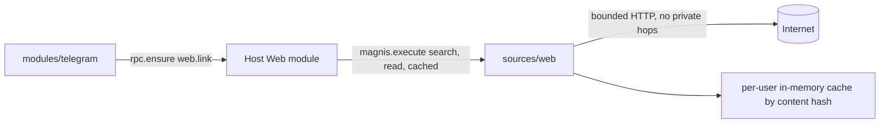

# Web Source: on-demand search and page reading

Status: SPEC_DRAFT  
Spec lock: unlocked  
Implementation lock: unlocked  
Active Delivery: none  
Unattended decisions: allowed  

<!-- plan:spec:start -->
## The Goal

Ship the catalog half of the Web split whose shared SPEC lives in the app repository's plan `docs/plans/web-source.md`. That SPEC owns the data model (`web.domain`, `web.link`, `web.page`, the `contents` link), the agent operations and the byte store; this plan does not restate them. Here, three catalog changes are made:

- **A new `sources/web` connector.** It owns everything the host's Web module does on the network today: public-web search, HTTP reading with redirects and caching, main-content extraction and Markdown conversion. It needs no external account and runs per user, on demand. It has no background work.
- **Telegram registers message URLs through `ensure`.** Telegram calls `rpc.ensure({schema_id: "web.link"})` instead of `graph.web_register_batch` and links each message to the returned UUIDs with `references` in its own batch. The plugin SDK drops `web_register` and `web_register_batch`.
- **The certifier admits on-demand Sources.** It accepts a `module_sync` Source with `delivery = none`, which the host reaches only through `magnis.execute`.

The currency is the network work that leaves the host, and the requests that stop happening during sync:

- No request at all while a message is ingested. Today each new URL triggers a preview fetch after commit.
- One request per read. A cached read makes none, and a revalidation is a conditional request.
- Every Source request is bounded under the host's 30-second action deadline.

## The target



The one decision: the Source is a pure network adapter. It writes nothing to the Graph, keeps no durable state and never decides what is saved. The host's Web module calls it, pins the bytes it returns and writes the Graph.

### Wire

```typescript
// magnis.execute actions of sources/web
interface WebSearchArgs { query: string; limit: number }            // limit 1..10
interface WebSearchResult { url: string; title: string; snippet: string }
interface WebReadArgs { url: string; force_refresh: boolean }
interface WebCachedArgs { url: string; content_hash: string }

interface WebSourcePage {
  url: string;              // the requested URL; the redirect target is not reported
  title: string | null;
  mime_type: "text/markdown";
  content: string;          // complete Markdown, never truncated
  content_hash: string;     // SHA-256 of the UTF-8 Markdown, hex
  size_bytes: number;
  firstGet: string;         // first network confirmation of this content
  lastGet: string;          // last network confirmation (200 or 304)
  expires_at: string | null;    // freshness of that response; null = stale at once
  etag: string | null;          // validators of that response
  last_modified: string | null;
}

// search → { results: WebSearchResult[] }
// read   → WebSourcePage   (network or HTTP cache)
// cached → WebSourcePage   (cache only; ConnectorError kind "not_cached" otherwise)
```

### Rules

- **Search:** DuckDuckGo's HTML endpoint, the same endpoint the host uses today.
- **Reading:**
  - at most 4 redirects;
  - a private or reserved address is refused at every hop;
  - `Cache-Control: max-age` / `Expires` freshness, then `ETag` / `Last-Modified` revalidation;
  - a response with no lifetime gets `expires_at = null` and is stale at once — no default lifetime is invented;
  - `force_refresh` skips both.
- **Conversion:**
  - main content is extracted with `@mozilla/readability` over a `linkedom` document;
  - Markdown comes from `turndown` with `turndown-plugin-gfm`, which keeps headings, lists, tables, code blocks and link URLs;
  - no LLM is involved;
  - nothing time-dependent enters the Markdown, so the same HTML yields the same `content_hash`.
- **Limits:**
  - a body over 5 MiB is `ConnectorError` kind `too_large`, never a partial page;
  - every request is bounded at 20 s and surfaces a typed timeout;
  - an HTTP 429 becomes `RateLimitError` with its `Retry-After`.
- **Cache:**
  - kept in process memory and bounded at 64 MiB, with least-recently-used eviction;
  - it keeps validators per URL and Markdown per content hash;
  - a cache hit never moves `lastGet`, while a `304` does.
- **Manifest and certification:**
  - no `[auth]`;
  - `authority = module_sync`, `delivery = none`;
  - one surface `web`, received by the host Web module;
  - callable operations `magnis.execute:search`, `magnis.execute:read` and `magnis.execute:cached`.

### Target tree

```text
sources/web/manifest.toml                    identity, certification, callable operations
sources/web/package.json                     linkedom, @mozilla/readability, turndown, turndown-plugin-gfm
sources/web/src/main.ts                      runConnector entry
sources/web/src/connector.ts                 execute table: search, read, cached
sources/web/src/http.ts                      bounded fetch, redirects, private-address refusal
sources/web/src/cache.ts                     per-URL validators, per-hash Markdown, LRU bound
sources/web/src/markdown.ts                  extraction and Markdown
sources/web/src/search.ts                    DuckDuckGo HTML parsing
sources/web/src/*.test.ts                    behaviour with an injected fetch
sources/web/src/certification.test.ts        stdio certification of the real bundle
scripts/certify-sources.ts                   module_sync with delivery none
scripts/test-connectors.sh                   runs sources/web
modules/telegram/module/service.ts           ensure web.link, references by UUID
modules/telegram/manifest.toml               call web.ensure, links references, no web_register
modules/telegram/**/__tests__/               ingest, links and routing tests
packages/plugin-sdk/contract/module.ts       web_register and web_register_batch removed
packages/host-stubs/types/                   regenerated from the host SDK
docs/plugins/source.md                       on-demand delivery
```

## Today, measured against that

On catalog base `8f1e371`:

- No catalog Source fetches generic web pages or parses HTML. The lockfile carries no readability, turndown, linkedom or cheerio.
- `scripts/certify-sources.ts:642-644` refuses `module_sync` with `delivery = none`.
- `modules/telegram/module/service.ts:404-409` turns every message URL into a `web_register` row. The page then calls `graph.web_register_batch` after its `apply_batch` (`:1491`). The manifest grants `web_register` (`modules/telegram/manifest.toml:39`).
- `packages/plugin-sdk/contract/module.ts:360-374` declares `web_register` and `web_register_batch`, documented as triggering a background preview fetch.

### Reuse map

- `runConnector`, `ConnectorError`, `RateLimitError` and the `execute` table (`packages/connector-sdk`) carry the wire. The new connector adds no transport.
- `mockFetch`, `runSourceContract` and the certification harness (`packages/testkit`) carry the tests. `sources/local`'s certification test is the pattern.
- `rpc.ensure` and UUID batch refs come from the contact identity work (app PR #297 and its catalog half). Telegram uses them; it adds no web-specific path.

## Invariants

1. `read` of an HTML page returns Markdown that keeps its headings, lists, a table, a fenced code block and link URLs. Reading the same HTML twice yields the same `content_hash`.
2. A body over 5 MiB is `too_large`, and nothing is cached.
3. A redirect to a private or reserved address is refused before it is followed.
4. A request that does not answer within its bound fails with a typed timeout; a 429 is `-32002` with `retry_after`.
5. A fresh cache entry answers with no request and the same `lastGet`. A stale one revalidates; a `304` returns the cached page with a newer `lastGet`. A response without `max-age` or `Expires` carries `expires_at = null`.
6. `cached` answers only from the cache: an evicted or unknown hash is `not_cached`, and no request is made.
7. Search returns at most `limit` results, each with an unwrapped target URL.
8. The certifier accepts `module_sync` with `delivery = none` and still refuses `tools_only` with any other delivery.
9. Telegram ingest of a message with URLs calls `ensure` once per page, links the message with `references` to the returned UUIDs in the same batch, and calls no `web_register` op.

## The pre-approval screen

### Acceptance stories

1. The host opens `https://example.com/doc` through the Source and gets a title and Markdown with the page's table intact. A second open within the page's cache lifetime makes no network request.
2. A link that redirects to `http://127.0.0.1/` is refused, not fetched.
3. The host asks for bytes the agent read an hour ago. If the cache still holds them, it gets them exactly; otherwise it gets `not_cached`.
4. A Telegram message with two URLs is ingested; the message references two `web.link` UUIDs, and no HTTP request happened.

### Deliberately not verified

- Live sites and DuckDuckGo: the tests use an injected `fetch`.
- Telegram end to end before contact identity's `ensure` lands: by the owner's decision Telegram does not work in that window.
- The host side: the app plan verifies the Web module, the byte store and on-demand activation.
<!-- plan:spec:end -->

<!-- plan:implementation:start -->
## Implementation contract
<!-- plan:implementation:end -->

<!-- plan:execution:start -->
## Execution log
<!-- plan:execution:end -->
