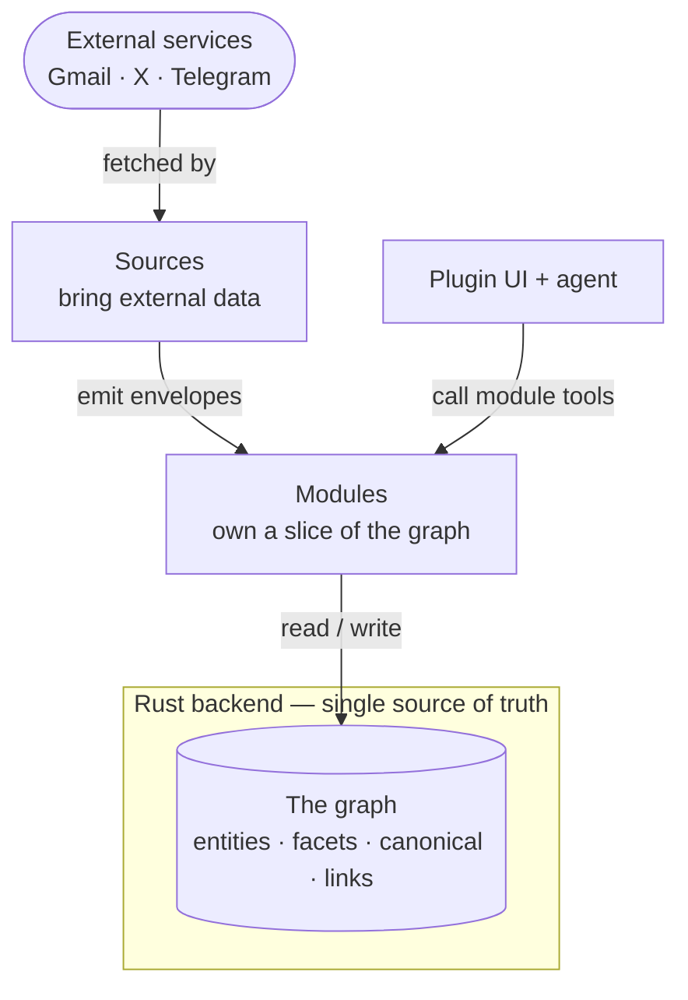
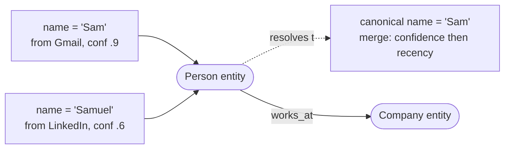
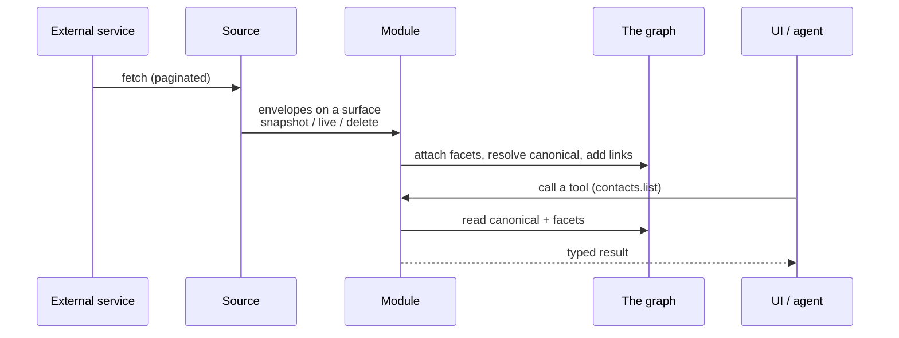
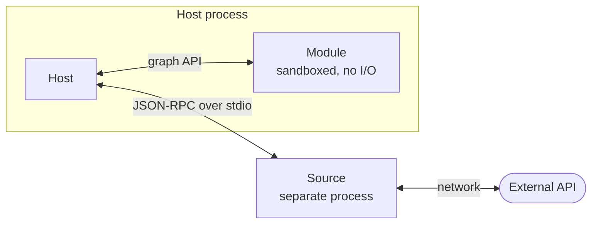

# Plugin architecture

Read this first. It explains, top down, what Magnis is, the graph every plugin
reads and writes, the two kinds of plugin and what each is responsible for, and
how data flows from an external service into the graph and out to the UI. Once
this model is clear, the build guides ([module.md](./module.md),
[source.md](./source.md)) and the [file-structure standard](./structure.md) are
just the details.

This document is for **plugin authors**. It describes the model you build
against — not how the host is implemented internally (its process model, its
database engine, its threading). You never need those to write a plugin.

---

## 1. What Magnis is

Magnis is a local-first personal operations system. A **Rust backend is the
single source of truth**: it stores everything, resolves conflicts, and talks to
external services. Everything the user sees — people, companies, emails,
meetings, messages — lives in one **graph** the backend owns.

**Plugins are how that graph gets its shape and its data.** The backend ships a
small core; every domain (contacts, email, meetings, the X connector, …) is a
plugin. A plugin never owns storage — it reads and writes the backend's graph
through a typed API.

---

## 2. The graph — what every plugin works with

Five concepts. Learn these and the rest follows.

- **Entity** — a generic base object: a person, company, project, meeting,
  message. It has an id and a type, and little else on its own.
- **Facet** — a typed, versioned block of data attached to an entity, *with
  provenance*: "according to Gmail, on this date, this person's name is X." Many
  facets can describe the same field from different sources.
- **Canonical property** — the single derived truth for a field, merged from
  conflicting facets by a deterministic rule (e.g. highest-confidence, then most
  recent). The canonical name is what the UI shows; the facets are the evidence
  behind it.
- **Link** — a typed relationship between two entities ("authored_by",
  "attended", "works_at"). Links make the graph a graph.
- **Event** — an immutable, append-only record of every mutation: the log of
  what happened.

A **module** decides which entities and facets exist for its domain and how
their facets merge into canonical truth. A **source** produces the raw facts (as
*envelopes*) that become those facets.

---

## 3. The two kinds of plugin, and who owns what

Every plugin is one of two kinds. They are different on purpose — different
jobs, different runtimes.

| | **Module** | **Source** |
|---|---|---|
| Job | Own a slice of the graph | Bring data in from an external service |
| Owns | Entity/facet **schemas**, the read/write logic, the UI | Nothing in the graph |
| Produces | Tools (for the agent + UI), canonical truth | **Envelopes** on named surfaces |
| Examples | contacts, email, meetings, companies | google, x, telegram |
| Runs as | a sandboxed **in-process** component | a separate **external process** (MCP) |
| Build guide | [module.md](./module.md) | [source.md](./source.md) |

The division is strict: **a source owns no schema, a module reaches no external
service.** The X source pulls tweets and emits them; the social/contacts module
owns the graph shape they land in and decides how they merge. This keeps the
trust boundary clean — the thing talking to the outside world (the source) is
never the thing holding the truth (the graph, via the module).

There is also a small third concept — a **lifecycle** hook — that a module uses
only when it needs custom install or data-migration logic. Most modules don't;
see [module.md](./module.md).

---

## 4. How data flows

The end-to-end path, from an external service to the user's screen:

1. A **source** fetches from the external service and emits **envelopes** — each
   a `{ surface, remote_id, kind, payload }` fact — on one of its named
   *surfaces*.
2. The **module** that owns that surface receives the envelopes in its sync
   handler and writes them into the graph: it attaches facets (with the source
   as provenance) and re-resolves canonical truth.
3. The **UI and the agent** call the module's tools to read that truth and act
   on it.

The source and the module are decoupled by the envelope contract: the source
knows nothing about the graph schema; the module knows nothing about the X API.

---

## 5. How each kind runs (what an author must know)

You do not need the host's internals — only these two facts, because they
explain the rules the guides enforce.

**A module runs sandboxed, in-process, with no I/O of its own.** The host loads
your module and calls into it; your code reaches the graph only through the
host-provided API (`deps.graph`). It has **no network, no filesystem, no
sockets** — that restriction is the point: a graph-owner can't leak to, or be
attacked from, the outside. Anything needing the outside world is a source's
job. (A module also ships **no database migrations** — "registering a schema"
just declares your entities and facets to the graph; storage is the host's.)

**A source runs as a separate process the host spawns**, speaking a small
JSON-RPC protocol over stdin/stdout. Because it is its own process it *can* do
real network I/O (OAuth, REST, sockets), it can be written in any language, and
you can run it by hand. Credentials are handed to it per call; it holds no
long-lived secret.

That is the whole reason a source is a process and a module is not: a source
*needs* I/O and a language-agnostic boundary; a module must *not* have I/O. The
long-form argument is in
[structure.md](./structure.md).

Everything runs on one toolchain — **Bun** — with no build step for sources and
one bundling step for module UI. Commands and the conformance checklist are in
[README.md](./README.md).

---

## 6. Where to go next

- **[module.md](./module.md)** — build a module end to end: the class, the graph
  API, schemas, the canonical-vs-facet rule, tests.
- **[source.md](./source.md)** — build a source end to end: surfaces,
  authentication, secrets, the wire contract, tests.
- **[structure.md](./structure.md)** — the file-structure standard both kinds
  follow, and the enforced code rules.
- **[manifest.md](./manifest.md)** — the `manifest.toml` reference.
