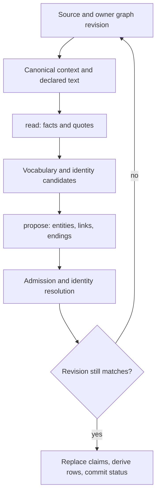
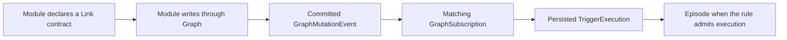

# Magnis: typed knowledge graph contracts

This is the developer reference for the graph: domain values, identity, provenance, relationships, module loading, synchronization and the processes that turn observations into knowledge. Each declaration is followed by its meaning, runtime rules and relevant exceptions.

**Target** identifies a decision made in the design discussion. **Current** describes inspected code. **Open** identifies a contract that still needs a decision. The examples expand canonical SDK definitions for reading; they are not a second implementation. Different inspected branches do not yet form one released system.

The [migration plan](plans/2026-10-06-entity-docs.md) describes adoption and proposed names. The [earlier typing draft](typing.md) is historical and superseded. This reference defines behavior; the plan orders implementation.

Read by concern: [Entity](#entity), [extras](#extras), [links](#links), [users and ownership](#ownership), [domains and modules](#domains), [loading and deduplication](#ingestion), [identity and merge](#identity), [Source and sync](#sync), [tools and parsing](#boundaries), [search and indexing](#search), [extraction and claims](#extraction), [triggers](#triggers), [open contracts](#open-contracts).

<a id="entity"></a>
## 1. Entity: a domain value and its persistence

### Identifiers and the unsaved sentinel

```typescript
import { z } from "zod";
import { UuidShapeSchema } from "@magnis/sdk/core/uuid";

export type Id = string;
export type LinkId = Id;
export type SourceId = string;
export type AccountId = string;
export type SchemaId = string;
export type SchemaVersion = number;
export type DateTimeUtc = string;

export const NIL_ID = "00000000-0000-0000-0000-000000000000";
export type NilId = typeof NIL_ID;

export const PersistentEntityIdSchema = UuidShapeSchema
  .refine((id) => id !== NIL_ID, "Persistent Entity ID must not be nil")
  .brand<"PersistentEntityId">();

export type PersistentEntityId = z.output<typeof PersistentEntityIdSchema>;
export type EntityId = PersistentEntityId | NilId;

export type UserId = PersistentEntityId;

export type JsonPrimitive = null | boolean | number | string;
export type JsonObject = { readonly [key: string]: JsonValue };
export type JsonValue = JsonPrimitive | JsonValue[] | JsonObject;

export type Origin = "canonical" | "derived";
```

**Target:** `PersistentEntityIdSchema` validates an assigned, non-nil ID. `PersistentEntityId` is its branded output; `EntityId` also admits the nil UUID for an unsaved value. Neither type admits JavaScript `null`. A plain `string | NilId` would lose the distinction because the literal already belongs to `string`.

A non-nil UUID proves neither existence nor access. Graph must check both. Keep meaningful aliases such as Link endpoint IDs, User IDs and schema IDs; there is no decision to replace every identifier with a generic string. `SchemaId`, such as `email.address`, is a schema name, not a UUID. Current local auth users can have a nil ID; the proposed graph-user type must not silently invalidate those accounts.

### Source identity

```typescript
export interface SourceRef {
  source: string;
  account: string;
  externalId: string;
}
```

`source` names the Source or module that supplied the record; `account` records its account context; `externalId` identifies the external record. The current lookup key is `(owner, externalId)`, so the external ID must be sufficiently qualified. Neither source name nor account is an additional uniqueness dimension in that lookup.

### Shared domain data

```typescript
interface EntityBase<P extends JsonValue = JsonValue> {
  id: EntityId;
  schemaId: SchemaId;
  schemaVersion: SchemaVersion;
  createdAt: DateTimeUtc;
  name: string | null;
  date: DateTimeUtc;
  idx: string | null;
  properties: P;
}
```

`properties` contains the fields of the declared domain. `name`, domain `date` and grouping key `idx` are shared columns. `createdAt` is Graph creation time, or the Source response time for an unsaved Web result. Operational preferences and processing state belong to extras, not this value.

**Current storage:** `(entities.schema_id, entities.schema_version)` already references `schemas(id, version)` through a composite foreign key. Each version has a row. Registration can currently overwrite the JSON Schema of that same version; immutable published versions remain an open rule.

### Canonical records

```typescript
export interface CanonicalEntity<P extends JsonValue = JsonValue>
  extends EntityBase<P> {
  origin: "canonical";
  source: SourceRef;
  canonicalKey: string | null;
}
```

Canonical means a record written under Source/host authority. It does not mean every provider statement is objectively true. A non-null `canonicalKey` supplies exact domain identity within `(owner, schemaId)`; it is nonempty and must not be casually reassigned. An email address key identifies the address, not every person associated with it.

### Derived statements

```typescript
export interface DerivedStatement {
  origin: "derived";
  confidence: number;
  evidence: [PersistentEntityId, ...PersistentEntityId[]];
  validFrom: DateTimeUtc | null;
  validUntil: DateTimeUtc | null;
}

export interface DerivedEntity<P extends JsonValue = JsonValue>
  extends EntityBase<P>, DerivedStatement {
  keys: string[];
}
```

**Target:** `DerivedStatement`, `DerivedEntity` and `DerivedLink` describe knowledge reconstructed from claims and evidence. Derivation includes extraction, aggregation and inference; it does not identify the producing agent or require a new logical deduction. `GraphClaim` retains the source's assertion; the derived graph value is the result of reconciling its supporting claims.

The current SDK uses `AgentStatement`, `AgentEntity`, `AgentLink` and `origin: "agent"`. The target discriminator is `"derived"`; adopting it requires an explicit migration of Entity and Link origin values, validators and versioned workspace formats. This naming decision does not change confidence, evidence or canonical authority.

`keys` contains alternative names used by identity lookup. Nonempty keys require a hub-role schema in the ordinary creation path. Canonical currently has no equivalent keys field; moving aliases into shared domain identity still needs a rule for their provenance and merge.

Evidence is a nonempty list of `PersistentEntityId` values identifying existing entities in the same owner scope. `0 < confidence <= 1`; only human approval can produce `1`, and approval leaves the origin derived. `validFrom` and `validUntil` describe when the assertion holds, independently of when it was processed.

### Saved and unsaved values

```typescript
export type Entity<P extends JsonValue = JsonValue> =
  | CanonicalEntity<P>
  | DerivedEntity<P>;

export type PersistentEntity<P extends JsonValue = JsonValue> =
  Entity<P> & { id: PersistentEntityId };

export type TransientEntity<P extends JsonValue = JsonValue> =
  Entity<P> & { id: NilId };

export declare function isPersistent<P extends JsonValue>(
  entity: Entity<P>,
): entity is PersistentEntity<P>;
```

`isPersistent` narrows `EntityId` to `PersistentEntityId`, not database existence. Multiple transient results share nil; it cannot serve as a cache key, evidence ID or Link endpoint. The WebSource draft uses provider identity/URL to continue reading a transient result.

| Operation | Persistence behavior |
| --- | --- |
| External `search_global` | Returns unsaved `web.link` values; no Graph writes |
| Open an unknown URL | Returns an unsaved `web.page` |
| Save a selected result | Assigns Graph IDs |
| Open a saved link | Retains identity; refreshing may record a new observation |
| Link or evidence | Requires assigned IDs; nil is rejected |

Transient sync preference and extras before saving remain open. Do not invent saved state to make a preview look persistent.

<a id="extras"></a>
## 2. Extras: optional operational state

### Flat state and indexing status

```typescript
export type IndexingStatus =
  | "pending"
  | "indexed"
  | "refused";

export interface EntityExtrasBase {
  pinOrder: number | null;
  archived: boolean;

  readonly indexed: IndexingStatus;

  private: boolean;
}
```

**Target:** extras is flat. `archived` and `private` are required booleans, with no `is` prefix. `pinOrder` alone represents pinning: null means unpinned; an integer, including zero, means pinned at that order. Test `pinOrder !== null`, not truthiness. There is no separate `pinned` flag.

`indexed` exposes the existing knowledge-indexer statuses only: `pending`, `indexed`, `refused`. If `graph_index` has no row, the read projection supplies `pending`; it does not insert a row or invent model/version timestamps. This is a server-side projection rule, not a parser default. Missing, null or unknown status in a public response is invalid. Search embeddings have a separate watermark and are not represented by this enum.

### Sync capability and read shape

```typescript
export interface Syncable {
  syncEnabled: boolean;
  syncRevision: string;
}

export type EntityExtras = EntityExtrasBase & (
  | Syncable
  | {
      syncEnabled: null;
      syncRevision: null;
    }
);

export interface EntityRead<P extends JsonValue = JsonValue> {
  entity: PersistentEntity<P>;
  extras: EntityExtras;
}

export interface GraphReader {
  get(id: PersistentEntityId): Promise<PersistentEntity>;
  get(id: PersistentEntityId, options: { extras: true }): Promise<EntityRead>;
}

export declare function isSyncable(
  extras: EntityExtras,
): extras is EntityExtras & Syncable;
```

Unsupported sync is the complete pair of nulls. Supported but stopped sync is `syncEnabled: false` with a revision string. Half-present pairs are invalid. Schema capability determines which branch applies. `Syncable` is composed with extras instead of being intrinsic to every Entity.

An ordinary `get` returns domain data without loading extras. `{ extras: true }` requests the complete operational projection; arbitrary field selection is not defined yet. Triggers are independent `triggers.trigger` entities with separate paginated reads and execution history. Neither a trigger ID array nor `hasMore` belongs in extras.

### Parsing and storage

```typescript
const entityExtrasBaseSchema = z.strictObject({
  pinOrder: z.number().int().nullable(),
  archived: z.boolean(),
  indexed: z.enum(["indexed", "pending", "refused"]),
  private: z.boolean(),
});

export const entityExtrasSchema = z.union([
  entityExtrasBaseSchema.extend({
    syncEnabled: z.boolean(),
    syncRevision: z.string().regex(/^(0|[1-9]\d*)$/),
  }),
  entityExtrasBaseSchema.extend({
    syncEnabled: z.null(),
    syncRevision: z.null(),
  }),
]);
```

This illustrative response parser is strict. It rejects unknown fields and missing required values. Schema-aware validation additionally checks whether sync is supported. The read-only indexing status is not accepted as a generic write command.

| Field | Authoritative storage |
| --- | --- |
| `pinOrder` | Viewer-specific `entity_preferences.pin_order`, keyed by `(user_id, entity_id)` |
| `archived` | Existing `entities.is_archived` column |
| `private` | Proposed `entities.is_private` boolean; not yet implemented in the inspected privacy work |
| Sync pair | `entities.sync_enabled` and bigint `sync_revision`, serialized as a decimal string |
| `indexed` | `graph_index.status`, projected as `pending` when absent |

No JSONB `extras` object is proposed. These fields have different owners and constraints; JSONB remains appropriate for domain properties. Omitting extras avoids its preference/status joins, but never skips ACL, archive or privacy filtering.

**Legacy pin exception:** current code permits `pinned: true, pinOrder: null`, and order without pinning. The target cannot represent either combination. Migration must explicitly assign an order to unordered pinned records and account for obsolete order-only state. It must not invent missing request values at runtime. Missing viewer preferences read as `pinOrder: null`.

**Archive normalization:** legacy SQL null/false mean not archived. Normalize them at the storage boundary; the public parser still requires a boolean. An ordinary Source update does not unarchive a record.

### Private data and trusted models

`extras.private` requires a model authorized to process private data. This is an Entity-wide restriction, independent of viewer preferences and ACL. A model running in the owner's cluster can qualify even when Magnis cannot establish its physical location.

```typescript
// Target addition to the existing SDK model directory: private.
export interface EmbeddingModelInfo {
  readonly id: string;
  readonly displayName: string;
  readonly private: boolean; // Authorized to process private data.
  readonly dataBoundary: "device_only" | "cloud_allowed";
  readonly dimensions: number;
  readonly normalization: "none" | "l2";
  readonly revision: string;
  readonly available: boolean;
}
```

The existing `LlmModelInfo` gains the same required `private: boolean`. This flag belongs to a configured logical model and its execution endpoint, not to a model name or its weights. Known local execution qualifies automatically. For other endpoints, an authorized configuration owner explicitly declares the model private; an unclassified endpoint does not qualify. Magnis relies on that declaration rather than claiming to verify the remote operator's infrastructure. Changing the endpoint requires a fresh classification.

`dataBoundary` is existing model-directory metadata, stored as `ai_models.data_boundary`. It describes local/cloud execution for display; it does not decide permission to process private data. In particular, `cloud_allowed` does not disqualify an explicitly trusted cluster, and a provider name or local-looking URL does not establish local execution.

| Entity and selected model | Target embedding/search behavior |
| --- | --- |
| `extras.private: false` | No additional restriction from this flag |
| `extras.private: true`, model `private: true` | Indexing and results are allowed, including an explicitly trusted cluster |
| `extras.private: true`, model `private: false` | Exclude from candidate selection, index audit, counts and ranked results |

The privacy eligibility condition is `!extras.private || model.private`. Ordinary ACL, model availability and processing permission still apply. Store model trust as a typed configuration boolean and expose a required boolean in the directory; missing response fields are invalid. Configuration changes must invalidate the existing model-policy projection before subsequent work uses it. No additional public indexing status is introduced.

**Current versus target:** the [earlier privacy draft](https://github.com/0xmikko/magnis-app/blob/2ea08b25957bbb3d60bdeb144d19f2d24d3d4665/docs/plans/private-entity-flag.md), approved on 2026-08-25, used `dataBoundary` as the eligibility test. Its inspected branch contains documentation changes only. The owner decision above replaces that test with model trust. Its Entity `isPrivate` becomes `extras.private`, retaining the initial false value for newly created records. The inspected SDK has `dataBoundary` but does not yet expose model `private`. The existing `entities.indexed` processing-permission boolean remains independent of privacy and of the proposed indexing status.

**Open:** enforcement in chat/completion and the knowledge extractor, derived-data privacy, Source-account policy and ordering concurrent privacy changes against requests already in flight. The model-trust rule applies conceptually to all private-data processing; the migration's implementation scope here remains embeddings/search and must not be presented as complete enforcement across all AI calls.

<a id="links"></a>
## 3. Links: relation, provenance and time

### Public relationship shape

```typescript
interface LinkBase {
  id: LinkId;
  from: PersistentEntityId;
  to: PersistentEntityId;
  kind: LinkType;
  createdAt: DateTimeUtc;
}

export interface CanonicalLink extends LinkBase {
  origin: "canonical";
  metadata: JsonValue;
  validFrom: DateTimeUtc | null;
  validUntil: DateTimeUtc | null;
}

export interface DerivedLink extends LinkBase, DerivedStatement {}

export type Link = CanonicalLink | DerivedLink;
```

A Link joins two saved Entity IDs. It has its own ID but is not an Entity: no Entity schema, properties or extras. Canonical Links contain metadata; derived Links contain the statement's confidence and evidence. Their parser rejects mixed forms. A Source Link derives provenance from the source Entity; it has no separate `SourceRef` field.

### Built-in and extensible kinds

```typescript
export type SystemLinkType = "owner";

export type BuiltinLinkType =
  | SystemLinkType
  | "identity"
  | "authored_by"
  | "sent_to"
  | "received_from"
  | "belongs_to"
  | "works_at"
  | "child_of"
  | "mentions"
  | "started_with"
  | "created"
  | "modified"
  | "reply_to"
  | "sent"
  | "received"
  | "references"
  | "same_as";

export type LinkType = BuiltinLinkType | (string & {});
```

`LinkType` retains its SDK name. This is the target vocabulary, not an inventory of historical registry entries. It generalizes `triggers.belongs_to` to `belongs_to`, replaces `episode → triggered_by → trigger` with `trigger → created → episode`, and adds protected `owner`. Communication uses `sent`/`received` for observed events and `sent_to`/`received_from` for addressed parties; historical `in_chat` needs a separate context mapping. `string & {}` allows registered module kinds; it grants no write permission or right to recreate retired kinds. The existing `link_kinds` registry remains authoritative.

| Kind | Endpoint roles | Direction and meaning |
| --- | --- | --- |
| `identity` | hub → identity_channel | Person/company → its account, address or card |
| `authored_by` | content → identity_channel | Content → author |
| `sent_to` | content → identity_channel | Message → addressed recipient, including To/CC/BCC; does not assert delivery |
| `received_from` | content → identity_channel | Message → sender reported by the source, such as the email From address; does not assert observed delivery or verified sender identity |
| `belongs_to` | Registered schema pairs | Organizational membership, such as Trigger → Episode or member → project; not proof of communication |
| `works_at` | hub → hub | Person/hub → workplace |
| `child_of` | * → * | Child → parent in a hierarchy; Episode trees use this for delegation and inherited configuration |
| `mentions` | * → * | Entity → mentioned Entity |
| `started_with` | * → * | Episode → initial context Entity, for example the email from which a conversation was opened |
| `created` | Registered schema pairs | Producing Episode or Trigger → newly created Entity; historical provenance |
| `modified` | * → * | Episode → Entity it changed; does not imply creation or containment |
| `reply_to` | * → * | Reply → original record |
| `sent` | Registered sending endpoint → message | Account/mailbox → message it sent; observed transmission with an occurrence timestamp |
| `received` | Registered receiving endpoint → message | Account/mailbox → message delivered to it; observed receipt with an occurrence timestamp |
| `references` | * → * | Entity → explicitly referenced resource; URL registration uses parent → web.link |
| `same_as` | * → * | Symmetric identity assertion; Contacts also uses it for unresolved duplicate candidates, so existence is not proof of equality |
| `owner` | Owned Entity → users.user | Target system-only ownership relation |

Only `same_as` is symmetric in the inspected built-ins; endpoints are sorted by ID before writing. Other kinds retain direction. `*` means no global role restriction, not an exemption from registered schemas, domain rules or access checks.

```typescript
export type CreatedLink = Link & {
  kind: "created";
};

export type BelongsToLink = Link & {
  kind: "belongs_to";
};
```

`created` records how an Entity appeared. `belongs_to` describes its organizational context. Creating a Trigger in Episode A can establish both A → created → Trigger and Trigger → belongs_to → A. Moving it to another context, if the domain permits that operation, changes membership without rewriting its creation history. A letter written in an Episode has creation provenance; membership additionally requires that it is included as that Episode's content.


**Target:** a Trigger firing creates C and records Trigger → created → C. It does not make the Trigger C's container. Replaying one firing reuses the same Episode and creation edge; distinct firings can produce distinct Episodes. Resuming an existing Episode is an execution event, not another creation. Execution history retains the firing time, observed event and outcome.

`belongs_to` has no universal `content → container` restriction: Triggers and project members need other registered schema pairs. Incoming traversal lists members; no stored inverse is needed. Cardinality and transitivity are domain rules, not properties of the shared kind. The trigger runtime must select `episodes.episode` targets and require exactly one active parent; project membership must not affect that lookup. It currently selects the first matching edge, so ambiguous parents need explicit rejection. Membership confers neither ownership nor permission to execute.

### Review of the remaining vocabulary

| Kinds | Review conclusion |
| --- | --- |
| `projects.belongs_to` | Proposed consolidation into `belongs_to`: the current writer is member → project. Preserve project endpoint checks and replace implicit namespace permission with an explicit host-kind grant |
| `child_of` / `belongs_to` | Keep distinct. A hierarchical parent and membership in a collection have different cardinality and execution rules |
| `authored_by` / `created` / `sent` / `received` / `sent_to` / `received_from` | Keep distinct: content author, creation context, observed sending/delivery and reported recipient/sender. Do not duplicate a sender-only fact as authored_by. Headers alone do not prove transmission or delivery |
| `started_with` / `reply_to` / `mentions` / `references` | Keep distinct: opening context, response target, semantic mention and explicit resource reference. One Entity can serve several roles |
| `observed_in` / `observed_participant` / `attendee` | Move out of the built-ins into Telegram and Meetings declarations. Preserve distinct meanings and Telegram observer state; see module-owned kinds below |
| `identity` / `same_as` | Keep separate from merge and ACL. `identity` connects a hub to a representation. Resolve the mismatch between an unconfirmed duplicate hint and a confirmed `same_as` assertion before treating the latter as equality |
| `watches` / `owner` | Replace legacy watch-based execution selection with event subscriptions; retain protected ownership. Membership or provenance grants neither authority |
| `sent_by` | Remove from the target: incoming traversal of `sent` already finds the sender. Reverse historical rows only when their endpoints and evidence meet the communication contract; do not infer a mailbox or successful send from an Episode link |
| `account`, `prospect`, `supports` | Remove from the target: no required contract or dedicated producer was established in this inspection. Preserve historical rows for explicit migration; do not invent generic semantics. A `supports` Link is not automatically a GraphClaim or approval evidence |
| Email `sent_from`, X/LinkedIn schema-pair kind names | Manifests retain these declarations while inspected writers use `authored_by` and `identity`. Review historical rows before retiring declarations; profile → person also reverses the current identity direction |
| `file.attachment` | Keep the module kind: owning content → attached file, with file-role validation. Generic membership would lose attachment semantics |

The review inspected host registry seeds, Episode/Web contracts, Telegram observer/participant writers, Contacts identity resolution and catalog manifests/services. Absence of a writer in those paths does not prove an empty database or exclude generic or external writers. The target removes `sent_by`, `watches`, `account`, `prospect` and `supports` from standard declarations and ordinary new writes. Historical rows remain readable through explicit migration/import compatibility until their semantics can be mapped; removing a name from this union does not delete data. Creation-link conversion is agreed; project membership and concrete communication endpoint schemas remain proposals.

Current code still writes `in_chat`, `triggers.belongs_to`, `projects.belongs_to` and `triggered_by`. Creation migration must reverse endpoints and preserve periods, evidence and producer metadata. The communication proposal supersedes the earlier blanket `in_chat` → `belongs_to` conversion: chat membership alone supplies neither direction nor delivery time. Keep historical rows until the communication context can be reconstructed without inventing facts. WebSource's proposed `contents` relation also needs its extraction semantics checked before consolidation.

### Communication is an observed event

The communication vocabulary has two pairs:

| Pair | Meaning |
| --- | --- |
| `sent` / `received` | Account/mailbox → message: observed sending or delivery, with an occurrence time |
| `sent_to` / `received_from` | Message → address/account: to whom it is addressed and from whom the source reports it came |

`received_from` supplies sender information even when Magnis cannot observe that sender's account. It does not invert `received`, which identifies the receiving endpoint, or manufacture a `sent` event from a From header. There is no separately stored inverse `sent_by`: incoming `sent` traversal already finds an observed sending endpoint. `reply_to` is message → original message and identifies what is being answered.

`authored_by` remains for actual content authorship. The inspected email writer currently maps `from_address` to `authored_by`; the target maps this sender-only fact to `received_from` instead. Migrate only the known email producer/schema pair, preserving provenance and history; do not rename authorship across the graph or write both Links from the same sender field. A domain can record both only when it independently knows the author and the sender. Other communication adapters must declare which fact their source supplies.

```typescript
export type CommunicationLink = CanonicalLink & {
  kind: "sent" | "received";
  from: PersistentEntityId; // Concrete sending/receiving account or mailbox.
  to: PersistentEntityId;   // Message instance.
  metadata: {
    occurredAt: DateTimeUtc | null; // Provider occurrence time; null = unknown.
    conversationId: PersistentEntityId | null;
  };
};
```

**Working proposal for endpoint direction:** mailbox/account → sent/received → message. The same message can be sent by one account and received by another, including two accounts of one user. A shared chat has no single incoming/outgoing direction independent of an account. `conversationId` carries the chat/thread context in this proposal; it must resolve to a registered, same-scope conversation through Graph validation, including merge/deletion handling. Account and conversation must remain separately queryable. Endpoint schemas and whether conversation should instead be an explicit structural edge remain a design decision; do not add an unvalidated ID hidden in metadata or create per-account copies of a shared chat implicitly.

`sent` requires a successful provider send or an authoritative source observation. A draft, failed send or From header is insufficient. `received` requires observed delivery at the receiving endpoint; To/CC/BCC identifies intended recipients, including recipients whose delivery Magnis cannot observe. A self-addressed message can correctly have both facts. An address identifies a channel; a concrete connected mailbox may require its own domain Entity when an address does not identify the receiving endpoint uniquely. Source credentials remain outside the graph.

`metadata.occurredAt` is the communication timestamp. `Link.createdAt` is graph insertion time; validity bounds retain their separate meaning. Do not substitute import time, an email Date header or epoch zero for unknown receipt time. The inspected Gmail adapter currently folds Date/internalDate into `sent_at`, while the Entity schema already allows `received_at`; those are not yet a reliable receipt-time contract.

Repeated ingestion of the same provider message and endpoint reuses the fact and emits no new `link_added`. A genuine resend with a new provider message identity is a new message instance. Several distinct deliveries of the same instance to the same endpoint need an occurrence identity: the present pair/kind/period rules cannot represent them by changing metadata alone. Preserve that distinction as an explicit extension decision, not a fake new delivery on every sync.

Messages and their communication Links commit together. `belongs_to` remains useful for deliberate organizational membership, such as a letter attached to an Episode or a project; it does not stand for sending or receipt. Existing `sent` Episode links and historical `in_chat` links cannot be blindly converted into communication facts.

### Module-owned kinds

Domain relations belong to the module that defines their meaning. Their qualified names remain discoverable in the graph registry and usable by other authorized modules; ownership of a contract does not make its data a separate private graph. Adding a module kind does not require extending the host's BuiltinLinkType union.

| Target kind | Owner and direction | Meaning preserved from current code |
| --- | --- | --- |
| `meetings.attendee` | Meetings: meeting → email.address | An attendee listed by the event; it does not prove that the person physically attended |
| `telegram.observed_in` | Telegram: connected account → chat | The account's observed chat access/membership, with its per-account sync state, unread counts and pins |
| `telegram.observed_participant` | Telegram: participant account → chat | Participation observed through a message; it grants no observer access and carries no observer sync state |

These replace the three unqualified built-ins in the target. The two Telegram facts cannot be merged without confusing participation with the connected account's view. Current writers still use unqualified names; conversion must preserve producer metadata, periods and existing state, and update registry ownership, permissions, queries and imports together. Do not rewrite unknown producers by string alone.

### Registration and endpoint validation

```typescript
export type EndpointSelector =
  | { readonly kind: "exact"; readonly schema: string }
  | { readonly kind: "any_registered_entity" };

export interface LinkContractDeclaration {
  owner: string;
  kind: LinkType;
  from: EndpointSelector;
  to: EndpointSelector;
  symmetric: boolean;
  jsonSchema?: JsonValue | null;
  fromRole?: string;
  toRole?: string;
}
```

A normalized module declaration can use the existing interface. The registry supplies and verifies its registration owner from the installed module:

```typescript
const attendeeContract: Omit<LinkContractDeclaration, "owner"> = {
  kind: "meetings.attendee",
  from: { kind: "exact", schema: "meetings.calendar_event" },
  to: { kind: "exact", schema: "email.address" },
  symmetric: false,
};
```

Namespaced kinds must belong to their registered module; another module cannot claim that namespace. Other writers need explicit permission and must satisfy the same endpoint/metadata contract. Shared host kinds keep their common meaning and system kinds remain protected.

A declaration resolves `(kind, fromSchema, toSchema)`, checks endpoint roles and validates canonical metadata. An exact schema selector is narrower than `any_registered_entity`; equal-priority conflicting declarations fail registration. Without a metadata JSON Schema, no additional JSON restriction is implied. Link metadata has no separately stored schema version.

`owner` in this declaration is the **registration owner**, not the Entity's user. The database foreign key on `links.kind` points to `link_kinds`. Uninstalling a module may leave an `orphan` kind for historical rows; it cannot authorize new writes. `graph.relations` exposes active vocabulary.

### Writing and ending periods

```typescript
interface AddLinkBase {
  owner: UserId;
  from: PersistentEntityId;
  to: PersistentEntityId;
  kind: LinkType;
}

export type AddLinkCommand =
  | (AddLinkBase & {
      origin: "canonical";
      metadata: JsonValue;
      validFrom: DateTimeUtc | null;
      validUntil: DateTimeUtc | null;
    })
  | (AddLinkBase & DerivedStatement);

export interface LinkAddResult {
  id: LinkId;
  kind: LinkType;
  from: PersistentEntityId;
  to: PersistentEntityId;
  created: boolean;
}

export interface EndLinkCommand {
  owner: UserId;
  id: LinkId;
  validUntil: DateTimeUtc;
  evidence: PersistentEntityId | null;
}
```

These are internal commands; owner comes from trusted execution context. The external `graph.link.add` controller constructs a derived statement. Source/host paths create canonical records. Models cannot choose canonical origin or set confidence to one. Ordinary endpoints must exist under the caller and not be archived; evidence must exist under that owner, but may be archived.

The interval is `[validFrom, validUntil)`. A null boundary is unbounded, not creation time or processing time. A known end must be strictly later than a known start. Adjacent periods do not overlap.

| Operation or case | Current behavior |
| --- | --- |
| `addLinkOutcome` / `graph.link.add` | Returns Link identity and `created`; an identical period reuses the row |
| Same start, same end | Idempotent add |
| Same start, requested end null | Reuses the row; does not reopen a previously closed interval |
| Same start, different specified end | Conflict |
| Different start | Allowed only without overlap for the same pair, kind and origin |
| Canonical add repeated with different metadata | Not a metadata patch |
| `end` / `graph.link.end` | Closes an open Link; derived ending needs evidence; repeating end fails |
| `deleteLink` / `graph.link.unlink` | Physical removal with audit, not interval closure |
| `approve` | Human confirmation of a derived row; origin stays derived |
| `withdraw` | Removes selected derived statements with dependency checks |

`graph.link.update` currently aliases end, not arbitrary patch; `graph.link.link` aliases add. Archive changes Entity visibility, not Link periods. Pin preferences do not change Links. Both endpoint foreign keys currently cascade on final Entity deletion. Semantic writes and audit commit together under the owner's mutation lock.

### Reading relationships

```typescript
// Proposed addition to the existing SDK LinkedEntitySummary;
// the remaining fields retain their existing types.
export interface LinkedEntitySummary {
  linkKind: LinkType;
  direction: "out" | "in"; // Relative to the Entity being viewed.
}
```

Keep the stored kind in neighbor responses and carry direction separately. On Episode C, incoming `created` means "created by this Trigger"; on the Trigger, outgoing `created` lists its results. Do not invent inverse stored kinds. A self-link has one `out` summary; symmetric kinds use one label regardless of direction. Current Episode summaries rewrite some incoming kinds as `triggers`, `child_episodes` or `watched_by`, but leave incoming `created` unchanged and expose no direction. This projection must change with the creation-link migration.

`graph.entity.links.list` returns adjacent Links; `graph.links` returns a page of related Entities. Normal reads check internal `eligible`, interval and endpoint visibility. `{ at: null }` removes the time filter but keeps eligibility. Structural reconciliation reads may bypass eligibility while retaining owner scope. A displayed `~kind` is an incoming-direction label, not a stored kind.

Search's `linked` condition currently uses SQL `EXISTS` in **either direction**, including for directed kinds. Its `to`/`none` mode is not Graph's `out`/`in` traversal direction. It supports endpoint fields, edge fields/metadata and one further nested relation. Changing GraphService alone does not update Search's independent SQL access checks.

<a id="ownership"></a>
## 4. Users and protected ownership

### Graph user and internal projection

```typescript
export type UserEntity<P extends JsonValue = JsonValue> =
  CanonicalEntity<P> & {
    id: UserId;
    schemaId: "users.user";
  };

export interface EntitySystemState {
  owner: UserId;
}
```

**Target:** `users.user` is the canonical graph representation of a Magnis user, with role `identity_channel`; `contacts.person --identity--> users.user` connects it to a person. Passwords, sessions and auth secrets remain in specialized storage. Contact matching and merge never change authentication or ACL.

`EntitySystemState.owner` is hidden from public Entity and extras. Current `entities.owner` references the separate auth `users` table. The migration plan must explicitly map that identity to the graph user, including the existing nil-ID local account. Bootstrap and ownership of user nodes cannot be inferred from a string alias.

### System-only ownership operations

```typescript
export interface OwnerLink extends CanonicalLink {
  kind: "owner";
  to: UserId;
  metadata: null;
  validFrom: DateTimeUtc;
  validUntil: DateTimeUtc | null;
}

export interface TransferOwnershipRequest {
  entityId: PersistentEntityId;
  newOwnerId: UserId;
}
```

**Agreed target:** only system GraphService functions create, close, transfer or delete `owner` Links. The relationship is stored with history; the Entity's hidden owner field is its current authoritative projection. It is not merely a virtual edge synthesized on reads. Ownership is canonical even when the owned Entity is derived.

An ordinary saved Entity has exactly one current owner and no overlapping ownership periods, even across different `to` IDs. Transfer at T closes the old interval, inserts a new Link ID starting at T, updates the hidden projection and writes audit atomically. Repeating the same owner assignment adds no interval. The service supplies time and caller identity; the caller cannot invent an ownership history.

```text
document --owner--> kolyaUser    [created, T)
document --owner--> annaUser     [T, ∞)
entities.owner = annaUser.id
```

Anna owns the document at T; Kolya's historical Link gives no current access. Ordinary pair-level Link uniqueness is insufficient to enforce this invariant.

| Entry point | Mandatory target rule |
| --- | --- |
| Generic add, aliases, batches, extraction | Reject `owner` regardless of supplied origin |
| End, unlink, patch by ID | Read the stored kind and reject ordinary ownership mutations |
| Module registration | Cannot claim or override the system kind |
| Generic merge | Cannot repoint or collapse owner Links with ordinary edge rules |
| Workspace import | Restore through the system GraphService path, not direct LinkRepository insertion |
| Entity creation, ownership transfer, final deletion | Maintain protected Links, projection and audit through system operations |

`OwnerLink` is a read shape, not write authority. An open string union cannot express the protection through `Exclude<LinkType, "owner">`; runtime enforcement is mandatory. No external `allowSystemLinks` switch is proposed.

**Current exception to fix:** `GraphTransfer.restore` inserts through repositories directly. Repositories are private to the Graph module but internal code and fixtures can call them. Every writer must preserve the system boundary, not just the public controller.

### Ownership queries and ACL

To count Kolya's contacts whose first name starts with M, resolve his user identity and authorize that owner scope first. A relation filter does not grant access. For Kolya's own query, declared `contacts.person.first_name`, `starts_with: "M"` and `count: "exact"` suffice; the current SQL prefix comparison is case-sensitive.

Stored owner Links support relationship queries, but present queries scope the Link and both endpoints to one owner. Graph-user bootstrap, historical ownership visibility and cross-owner transfer of ordinary Links/evidence require explicit rules. Do not relax generic owner checks to make the query work. Full shared ACL remains open.

<a id="domains"></a>
## 5. Domain declarations and module loading

### Schema identity and capabilities

```typescript
import { z } from "zod";

export type EntityColumn = "name" | "date" | "idx";

export interface EntityIdentity {
  readonly id: string;
  readonly name: string;
  readonly description?: string;
  readonly roles?: readonly string[];
  readonly mergeable?: boolean;
  readonly syncable?: boolean;
}
```

`@magnis/declare` is a build-time catalog API. A domain supplies its stable schema name, roles and capabilities. `mergeable` and `syncable` are independent permissions of the schema, not the current state of an Entity. Target event subscriptions do not require a `triggerable` flag: they validate registered events, predicates and caller access. The inspected code still exposes that legacy capability. Declaring a schema does not supply CRUD or grant caller access.

```typescript
export interface Searched<Shape extends z.ZodRawShape> {
  readonly order: readonly [keyof Shape & string, "asc" | "desc"];
  readonly title?: keyof Shape & string;
  readonly body?: keyof Shape & string;
  readonly alias?: Readonly<Record<string, readonly (keyof Shape & string)[]>>;
}

export interface EntityDeclaration<Shape extends z.ZodRawShape = z.ZodRawShape> {
  readonly identity: EntityIdentity;
  readonly searched: Searched<Shape>;
}

export declare function entity<Shape extends z.ZodRawShape>(
  identity: EntityIdentity,
  shape: Shape,
  searched: Searched<Shape>,
): z.ZodObject<Shape>;

export declare function column<T extends z.ZodType>(
  name: EntityColumn,
  schema: T,
): T;

export declare function moment(): z.ZodISODateTime;
```

`shape` supplies field validation. `column` maps a domain field into a shared Entity column; `moment` describes supported timestamps. `searched` names declared fields and their ordering. Build output includes JSON Schema and a search descriptor; Zod and `entities.ts` execution stay out of UI bundles and plugin isolates.

```typescript
import { z } from "zod";
import { entity, type AssertEqual } from "@magnis/declare";
import type { EmailAddressDetails } from "./types.ts";

export const address = entity(
  {
    id: "email.address",
    name: "Email address",
    description: "An email address entity (sender/recipient hub).",
    roles: ["identity_channel"],
    syncable: true,
  },
  {
    address: z.string(),
    display_name: z.string().nullish(),
  },
  { order: ["address", "asc"] },
) satisfies z.ZodType<EmailAddressDetails>;

const _addressIsTheModulesOwnType:
  AssertEqual<z.infer<typeof address>, EmailAddressDetails> = true;
void _addressIsTheModulesOwnType;
```

This `email.address` example preserves existing domain spelling such as `display_name` while omitting the legacy triggerable flag in the target. SDK camelCase does not rename arbitrary properties or metadata. `satisfies` and `AssertEqual` keep lightweight module interfaces aligned with the build-time schema.

```typescript
export interface Schema {
  id: SchemaId;
  version: SchemaVersion;
  description: string;
  json_schema: JsonValue;
  syncable: boolean;
  can_merge: boolean;
  roles: string[];
}
```

The internal host names `json_schema` and `can_merge` differ from authoring `shape` and `mergeable`. Sync state belongs in extras; trigger subscriptions belong to trigger definitions. `indexed` is processing state, not another schema capability.

### Dependencies and permissions

```toml
id = "addressbook"
version = "0.1.0"
magnis_api_version = "0.1.0"
title = "Address book"
summary = "Address book contacts from your accounts, linked to the people they describe."
publisher = "ai.magnis"
dependsOn = ["email"]

[surfaces.addressbook]
reconciliation = { mode = "full_snapshot" }
item = "addressbook.card"
progress = { "addressbook.card" = "contacts" }

[permissions]
create = ["email.address", "contacts.person"]
links = ["identity"]
```

This Address Book manifest is from `module-dependencies` and declares API 0.1.0; the common-SDK work targets 0.2.0. The loader checks compatibility independently of TypeScript compilation. The dependency chain is `google → addressbook → email → contacts`.

`dependsOn` names immediate module dependencies. Catalog validation checks existence, cycles and cross-domain references against the dependency closure. `permissions.call` does not install a dependency. Sources own provider auth, requests and listeners; modules own domain schemas and behavior. Several Sources may feed one module surface.

### Activation descriptor

```typescript
export interface PluginCapabilityDeclarations {
  readonly owned_schema_prefixes: readonly string[];
  readonly link_kinds_writable: readonly string[];
  readonly reads_schemas: readonly string[];
  readonly events_emitted: readonly string[];
  readonly rpc_calls: readonly string[];
  readonly creates_schemas: readonly string[];
  readonly op_grants: readonly string[];
}

export type PluginSyncReconciliationDeclaration =
  | { readonly mode: "none" }
  | { readonly mode: "fullSnapshot" }
  | { readonly mode: "scopedSnapshot"; readonly scopeSchema: JsonValue };
```

Capabilities declare namespace, writable relations, reads, emissions, calls and creation rights. Reconciliation modes explicitly define when missing observations may mean removal. A package's existence, installation, enabled state and active sync worker are distinct states.

```typescript
export interface ModuleActivationDescriptor {
  readonly pluginId: string;
  readonly packageHash: string;
  readonly manifestHash: string;
  readonly descriptorHash: string;
  readonly tools: readonly ToolDefinition[];
  readonly resources: readonly string[];
  readonly generatedToolNames: readonly string[];
  readonly capabilities: PluginCapabilityDeclarations;
  readonly syncHandlers: readonly string[];
  readonly syncItemSchemas: Readonly<Record<string, string>>;
  readonly syncReconciliation:
    Readonly<Record<string, PluginSyncReconciliationDeclaration>>;
}
```

Loading resolves dependencies and exact package artifacts, validates contracts and permissions, registers a consistent candidate, then publishes its descriptor and operations. A failed replacement retains the last accepted activation. An enabled dependent prevents disabling/removing its dependency.

Native modules use Nest registration; packages use `PluginRuntimeService` and workers. Both populate the operation registry. `resources` can expose tools without creating a new Entity schema.

<a id="ingestion"></a>
## 6. Preparing, loading and deduplicating observations

### References resolved by Graph

```typescript
export type GraphRef =
  | {
      kind: "canonical";
      schemaId: string;
      canonicalKey: string;
    }
  | {
      kind: "source";
      schemaId: string;
      externalId: string;
    }
  | {
      kind: "id";
      schemaId: string;
      id: string;
    }
  | {
      kind: "identity";
      schemaId: string;
      identityRef: GraphRef;
    };
```

References express an identity before the transaction assigns an ID. They are different from extraction's `{ id } | { proposed }` references.

| Reference | Resolution inside the owner transaction |
| --- | --- |
| `canonical` | Exact schema/key lookup; create only with the domain owner's declaration |
| `source` | Resolve external key, including the root batch; verify schema |
| `id` | Require an existing accessible node of the requested schema |
| `identity` | Resolve the representation, then its hub: one candidate reuses, none needs a declaration, multiple fail |

### Owner declarations and preparation

```typescript
export interface GraphEntityDeclaration {
  ref: Exclude<GraphRef, { kind: "id" | "source" }>;
  schemaVersion: SchemaVersion;
  name: string | null;
  idx: string | null;
  date: DateTimeUtc | null;
  properties: JsonValue | null;
  syncEnabled?: boolean;
}

export interface GraphLinkDeclaration {
  from: GraphRef;
  to: GraphRef;
  kind: string;
  confidence: number | null;
  metadata: JsonValue | null;
  validFrom: DateTimeUtc | null;
  validUntil: DateTimeUtc | null;
  declaredBy: GraphRef | null;
}

export interface GraphOwnerFragment {
  entities: GraphEntityDeclaration[];
  links: GraphLinkDeclaration[];
}
```

A module describes its own domain's initial value and required Links. Creation of a syncable Entity requires explicit `syncEnabled`. Host stamps fragment ownership from the registered handler; a caller cannot impersonate another schema owner.

```typescript
export type PluginHostJson =
  | null
  | boolean
  | number
  | string
  | PluginHostJson[]
  | { readonly [key: string]: PluginHostJson };

export interface EnsureRequest {
  schemaId: string;
  items: PluginHostJson[];
}

export interface EnsureResult {
  refs: Array<GraphRef | null>;
}

export interface EnsureHandlerResult extends EnsureResult {
  fragment: GraphOwnerFragment;
}

export interface GraphPreparedFragment {
  owner: string;
  fragment: GraphOwnerFragment;
}

export interface RpcExecutor {
  execute<T = unknown>(method: string, params?: unknown): Promise<T>;
  ensure(request: EnsureRequest): Promise<EnsureResult>;
}
```

`rpc.ensure` calls the registered `${schemaId}.ensure`. The handler returns references plus a fragment; host retains the fragment and returns only positional refs. `PluginHostJson` is the existing standalone boundary type for environments that do not import the regular SDK. A generic `execute<T>` annotation does not validate a dynamic response.

Preparation allows local normalization and nested ensures, but prohibits Graph reads/writes. Depth, cycles, time and size are bounded. A preparation failure invalidates the root operation even if a module catches its exception. Preparation alone creates nothing; the root applies the collected result once.

### Batch inputs

```typescript
export interface BatchEntity {
  key: string;
  schemaId: SchemaId;
  schemaVersion: SchemaVersion;
  name: string | null;
  idx: string | null;
  date: DateTimeUtc | null;
  anchor: string | null;
  properties: JsonValue | null;
  source: SourceRef | null;
  canonicalKey?: string;
  syncEnabled?: boolean;
}

export interface BatchRef {
  key: string;
  anchor: string | null;
}

export interface BatchLink {
  fromKey: string;
  toKey: string;
  kind: string;
  confidence: number | null;
  metadata: JsonValue | null;
  validFrom: DateTimeUtc | null;
  validUntil: DateTimeUtc | null;
  declaredBy: string | null;
}
```

These declarations reflect the inspected `entity-sync` boundary where `anchor` still means `source.externalId`. The target shared SDK uses `externalId`; do not mix these spellings in one request. Local `key` is a batch position, not an EntityId. Source observations replace properties; ordinary user patches merge top-level keys, with null removing a key, then validate the complete result.

```typescript
export interface GraphBatch {
  entities: BatchEntity[];
  refs: BatchRef[];
  links: BatchLink[];
  fragment?: GraphOwnerFragment;
  prepared?: GraphPreparedFragment[];
}
```

`prepared` is host-only. JSON supplied by a module cannot inject trusted fragments. Graph checks schema/version, producer permissions, origins, endpoints and domain values. Nodes, Links and audit commit together; sync page progress participates in that same transaction. Explicit user saves do not advance sync progress.

```typescript
export interface GraphResolvedRef {
  ref: GraphRef;
  id: PersistentEntityId;
  created: boolean;
}

export interface GraphBatchResult {
  ids: Record<string, PersistentEntityId>;
  created: number;
  createdBySchema: Record<SchemaId, number>;
  updated: number;
  stampMoves: {
    id: PersistentEntityId;
    schema: SchemaId;
    from: string;
  }[];
  linksAdded: number;
  droppedKeys: string[];
  resolved: GraphResolvedRef[];
}
```

`resolved` explains identity reuse and creation. Counts describe admitted writes, not downloaded observations. Unresolved old `BatchRef` entries may drop their dependent Links and appear in `droppedKeys`; a required `GraphRef` fails the entire apply instead.

### Exact deduplication and repeat delivery

| Level | Identity or rule | Important exception |
| --- | --- | --- |
| Source record | `(owner, externalId)` | Source/account are provenance, not extra key dimensions |
| Domain value | `(owner, schemaId, canonicalKey)` | Address identity is not person identity |
| Batch position | Local `key` | Duplicate position keys fail; different positions may resolve to the same Entity |
| Repeated observation in one batch | Resolved PersistentEntityId | Last properties write wins within that batch; this is not provider-version conflict resolution |
| Repeated owner declaration | Same GraphRef | Inconsistent initial declarations fail |
| Link | Pair, kind, origin, period start | Period/end rules still apply; symmetry normalizes endpoints |
| Extraction | Source plus committed reread | Replace the old claim set; do not accumulate confidence on retries |
| Two saved nodes for one object | Explicit domain decision | Similar text or embeddings do not supply a universal merge key |

Graph resolves keys under the owner mutation lock and relies on database uniqueness. Key digests accelerate lookup but do not replace exact original-text checking. Renaming a record does not change its stable identity.

| Loading edge case | Current result |
| --- | --- |
| Archived record delivered again | Reuse its ID and possibly refresh its data; preserve archive state |
| External and canonical keys disagree | Fail and roll back; no hidden merge |
| Legacy Source row lacks the newly supplied canonical key | Explicit adoption is needed; mismatch fails |
| Same key, different schema version | Fail; no implicit migration |
| Root external key resolves to another schema | Old batch path reports a dropped key; required GraphRef fails |
| No stable key or other resolving reference | Reapplication creates a new node; atomicity is not idempotency |
| Concurrent creation of the same key | Owner serialization and unique constraints arbitrate |

### Cross-domain example

```typescript
type EmailAddressEnsureItem = {
  address: string;
  name: string | null;
};

type WebDomainEnsureItem = {
  domain: string;
};

type ContactEnsureItem = {
  identityRef: GraphRef;
  name: string | null;
  email: {
    address: string;
    domain: string;
    domainRef: GraphRef;
  } | null;
};

type CompanyEnsureItem = {
  domain: string;
  identityRef: GraphRef;
};
```

These are walkthrough/test owner inputs, not a claim that every production handler is connected. For a meeting participant, Email normalizes the address, Web normalizes the domain, Contacts resolves the person and Companies decides whether a company may be created.

```text
meeting --meetings.attendee--> email.address: ann@acme.nl
                                    ^                 |
                                 identity        domain relation
                                    |                 v
                             contacts.person    web.domain: acme.nl
                                                      ^
                                                   identity
                                                      |
                                               companies.company
```

The domain label is illustrative; actual kinds come from the registry. This chain does not assert `works_at`: a shared email domain does not prove employment. Repeating ensure reuses identities without overwriting user-edited fields.

<a id="identity"></a>
## 7. Identity, representations and merge

### Distinguish the operations

`identity` connects a hub to its representation. `same_as` is an identity assertion between retained nodes, but the current Contacts importer also emits it when several hubs share an address and need human review. Such a Link is not proof of equivalence. `merge` removes one saved node and keeps another. None grants ACL rights; a chain of `same_as` Links does not collapse into one ID. Separating candidate and confirmed identity assertions remains open.

`GraphRef.identity` resolves its representation first, then finds current eligible, unarchived hubs of the requested schema under the owner, including relevant prepared Links. No candidate requires an allowed creation declaration; one is reused; multiple cause `ambiguous identity owner`. A declaration/version mismatch or unresolved dependency aborts apply. Here “identity owner” means the hub, not the security principal.

Multiple hubs may share an identity channel. A request that needs one result must reject ambiguity; the kind itself does not make address → person a globally unique function.

### Address Book: preserve the provider card

```typescript
export interface GoogleContactEmail {
  address?: string;
  label?: string | null;
  is_primary?: boolean;
}

export interface GoogleContactPhone {
  number?: string;
  label?: string | null;
  is_primary?: boolean;
}

export interface CardRecord {
  source_id?: string;
  account_id?: string;
  sync_pass?: string;
  resource_name?: string;
  etag?: string;
  display_name?: string;
  given_name?: string;
  family_name?: string;
  emails?: GoogleContactEmail[];
  phones?: GoogleContactPhone[];
  organizations?: {
    name?: string | null;
    title?: string | null;
    is_current?: boolean;
  }[];
  photo_url?: string;
  external_url?: string;
}
```

Google feeds the `addressbook` surface. Address Book owns `addressbook.card`, Email owns addresses and Contacts owns the person. `display_name` is mapped to Entity.name; `resource_name` and `etag` retain provider record identity/version. Observed emails and phones stay on the card, while shared address nodes connect it to the graph.

```text
contacts.person: Anna
  +--identity--> addressbook.card: Google record
  +--identity--> email.address: anna@example.org
  +--identity--> email.address: anna@example.net
```

| Current people holding the card's addresses | First association |
| --- | --- |
| None | Create one person; attach the card and both addresses |
| Exactly one | Reuse the person; attach the card and free addresses |
| Several | Attach the card to those people; leave free addresses unassigned |

Names do not match people automatically here. Companies holding an address are not person candidates. Re-sync updates observed card data, preserving the person's curated name/fields. A later address already held by another person preserves that ambiguity rather than merging people.

```typescript
const metadata = { producer: "addressbook" };
```

Address Book marks its Links with this producer. Removing an address ends its own person/address Link only when no other current card supports it; another producer's Link is untouched. A returning address opens another period. Deleting a provider contact archives the card and revisits its supported address Links, retaining the person, messages and unrelated history. Person/card Links are retained for a separate duplicate decision.

The inspected module still uses its existing batch/link workflow; host preparation support does not imply production conversion to `rpc.ensure` is complete.

### Canonical and derived identity matching

Extraction may reuse a shown canonical ID of the requested schema. Otherwise `findByIdentity` searches name/keys under the owner and schema: input NFC normalization, trimming and case folding; zero matches creates derived, one reuses, several refuse. Canonical-first sorting does not resolve ambiguity. This is a naming heuristic, not proof that two people are identical.

Reusing canonical creates no entity-claim and changes no canonical properties; derived Links may refer to it. Reusing derived adds support but does not automatically choose new field values. A later Source record resolves external/canonical keys, not a general automatic merge with an earlier derived namesake.

**Current limitations:** name lookup also includes archived/ineligible rows. New proposals in one model answer are not themselves a saved identity index, so repeated new names within that answer are not guaranteed to deduplicate. Alias migration, archived-candidate reuse and stronger domain matching remain open.

### Merge input and pair eligibility

```typescript
export interface MergeOverride {
  key: string;
  value: JsonValue;
}

export interface MergePreviewCommand {
  userId: UserId;
  survivorId: PersistentEntityId;
  retiredId: PersistentEntityId;
}

export interface MergeExecuteCommand extends MergePreviewCommand {
  overrides: readonly MergeOverride[];
  reason: string | null;
}
```

The caller chooses `retiredId → survivorId`; this direction determines the retained ID and shared fields. The trusted context supplies userId. Both participants must exist, share owner/schemaId, be unarchived and have mergeable schemas. Self-merge and episodes fail.

| Survivor / retired | Current rule |
| --- | --- |
| Derived / derived | Allowed subject to the common rules |
| Canonical / derived | Allowed; canonical identity and Source remain |
| Derived / canonical | Rejected |
| Canonical / canonical with different Source keys | Normally rejected; preserve provider representations through identity |
| Internal canonical identity-hubs | Special exception below |

The exception requires both nodes to be eligible, unarchived canonical hubs with `can_merge: true`, `canonicalKey: null` and `source.externalId === entity.id`. It permits merging internally created people while retaining their address/card representations. It is not permission to merge arbitrary provider records or different exact domain keys.

### Preview, then a fresh transactional decision

```typescript
export interface MergeEntityInfo {
  id: PersistentEntityId;
  name: string | null;
  schemaId: SchemaId;
  propertyCount: number;
  linkCount: number;
}

export interface MergeField {
  key: string;
  survivorValue: JsonValue;
  retiredValue: JsonValue;
  autoResolved: JsonValue;
  conflict: boolean;
}

export interface MergeSource {
  source: string;
  entityId: PersistentEntityId;
  propertyCount: number;
}
```

These are the pieces of a preview. `sources` labels the two origins, not field-level provenance. `conflict` determines whether a choice is required: `autoResolved: null` is ambiguous by itself. The current preview also renders a missing field as null, so survivorValue/retiredValue cannot distinguish absence from explicit JSON null.

```typescript
export interface MergePreview {
  survivor: MergeEntityInfo;
  retired: MergeEntityInfo;
  sources: readonly MergeSource[];
  fields: Readonly<Record<string, MergeField>>;
  linksToRepoint: number;
  duplicateLinksToRemove: number;
  reflexiveLinksToRemove: number;
}

export interface MergeResult {
  survivorId: PersistentEntityId;
  retiredId: PersistentEntityId;
  linksRepointed: number;
  linksDeduplicated: number;
  linksReflexiveRemoved: number;
}
```

Preview reads without writing or reserving state. It may itself reject overlapping Link periods. Execute locks fresh rows and recomputes the decision; the SDK has no preview revision token. A previously successful preview may therefore fail at execution.

One transaction writes survivor properties, repoints/collapses Links, rewrites structured claim references, removes retired, reconciles affected statements and writes `entities_merged` plus `entity_deleted`. Failure rolls it back. A Contacts wrapper may subsequently recompute name/idx from merged first/last names through separate calls; that post-processing is outside the merge transaction.

### Property decisions

| Case | Current behavior |
| --- | --- |
| Key exists only on one side | Copy it into the result |
| Structurally equal JSON | No conflict; object key order is irrelevant |
| Different scalar, nested object or ordinary array | Require an explicit whole-key override; no newest-source rule or recursive field arbitration |
| `phones` | Special union on normalized `phone`: keep digits and `+`, survivor first; not complete international number normalization |
| Override key absent from both sides | Reject |
| Override value null | Store JSON null, unlike patch's remove-key meaning |
| Shared fields: name, idx, dates, Source, key | Base merge retains survivor values |
| Derived keys | Current merge does not union aliases |
| Extras | No general merge policy yet for pins, privacy or sync |

The implementation has an array-union helper, but preview still requires overrides for differing ordinary arrays. Copying a missing derived property into canonical currently loses field-level origin: it does not prove the provider supplied that value. A later Source snapshot may replace canonical properties again. Persistent user overrides and field claims need an explicit design.

### Relationship decisions

Replace retired in both endpoints, normalize symmetric kinds, then group by pair, kind, origin and interval.

| Resulting relationships | Decision |
| --- | --- |
| New pair | Repoint the existing Link |
| Canonical and derived for the same pair | Retain separate origins |
| Identical periods in one origin | Collapse duplicates |
| Separate or adjacent periods | Retain both |
| Different overlapping periods | Reject the whole merge |
| Retired/survivor connection becomes a self-loop | Remove the induced loop |
| Duplicate canonical metadata | Retain winner values, fill missing top-level keys; not an Entity override conflict |
| Duplicate derived evidence | Union evidence, then reconcile claims |
| System owner Links | Target requires special system handling, never ordinary collapse/repoint rules |

The surviving Link ID need not be the one originally attached to survivor. Current ordering prefers higher derived confidence, then earlier createdAt and ID. Preview counts incident retired Links, including future deletions; execution counts actual surviving repoints, so totals may differ.

A single `metadata.producer` cannot preserve independent producers' support. Multi-producer provenance and interval handling remain open; metadata collapse does not establish that guarantee.

### Merge exceptions and recovery

| Situation | Consequence |
| --- | --- |
| Another conflict appears after preview | Execute needs another explicit choice; old preview is not authority to lose the new value |
| Execute retried after success | Retired is absent; no idempotent-success promise |
| A client retained retiredId | No automatic redirect; use the returned survivorId |
| IDs embedded in arbitrary JSON/text | No universal rewrite; structured endpoints, evidence and claim sourceId/statement references are the handled paths |
| Original model mention names retired | Original mention/quote remain historical, unlike resolved statement references |
| Same schemaId, different versions | No implicit property migration into survivor's version |
| Result violates domain schema | Inspected merge lacks the ordinary patch path's explicit final validateEntity; target requires it |
| Need to undo | Audit is not an implemented split/unmerge operation |
| Candidate belongs to another user | Merge does not transfer ownership |

### End-to-end example

1. Work and home addresses each resolve to a different internal person, P1/P2. Equal names do not combine them.
2. A card lists both addresses. Address Book links the card to both people; an ensure requiring one person refuses ambiguity.
3. A message says “Anna works at X.” Extraction can reuse a specifically shown candidate; ambiguous name lookup refuses. Reusing canonical P1 creates a derived relationship without replacing P1's properties.
4. The user identifies the duplicate and chooses P1 as survivor. After preview/conflict resolution, eligible internal hubs can merge; address and card nodes remain.
5. Repeating ensure through either address now returns P1. Existing scenario `tst_bts_graph_merge_pg_054` covers this replay without creating nodes or Links.
6. Deleting the provider card archives that representation and revisits only its supported relationships. The person and unrelated evidence remain.

<a id="sync"></a>
## 8. Source pages and synchronization

### Fetching a requested scope

```typescript
export type Direction = "backward" | "forward";

export type SyncTarget =
  | { kind: "forward" }
  | { kind: "gap"; start: number; end: number }
  | { kind: "seededInitialHistory"; params: JsonValue }
  | { kind: "snapshot"; generation: string }
  | { kind: "timeWindow"; from: string; to: string }
  | { kind: "trackedIdentities"; identities: string[] };

export interface FetchArgs {
  direction: Direction;
  cursor: JsonValue | null;
  limit: number | null;
  surface: string | null;
  scope_id?: string | null;
  target?: SyncTarget | null;
  forward_checkpoint?: JsonValue | null;
  tracked_handles: string[] | null;
}
```

These are existing Source-adapter spellings; the separate Source protocol is not automatically camelCased with the common SDK. Cursor is opaque to Graph. Host owns the requested target/scope, Source parses provider payloads, and the module transforms admitted observations into domain records. A module does not receive unrestricted provider credentials.

```typescript
export type ForwardCheckpointEffect =
  | { kind: "retain" }
  | { kind: "replace"; value: JsonValue }
  | { kind: "clear" };

export type SyncProgressReceipt =
  | { kind: "continueTarget"; continuationToken: JsonValue }
  | { kind: "completeTarget"; forwardCheckpoint: ForwardCheckpointEffect };
```

Only an admitted page advances durable progress. Missing data on a page does not imply provider deletion. The module's `none`, `fullSnapshot` or `scopedSnapshot` reconciliation declaration determines that boundary.

```typescript
export interface SyncPageReceipt {
  suspended: string[];
  selectionChanged: boolean;
  progress: Record<SchemaId, {
    inserted: number;
    removed: number;
    plan: { total: number; skipped: number } | "unstated";
  }>;
  moved: Record<AccountId, Record<SchemaId, number>>;
  excluded: string[];
}
```

The receipt describes committed changes, including suspended scopes, a changed selection, counts, excluded records and account stamp moves. Here `plan` means expected sync counts, not an implementation plan. Graph records, audit and checkpoints commit together. Search and trigger processing follow committed data asynchronously.

### Persisting selection

```typescript
export interface SetSyncEnabledParams {
  id: string;
  syncEnabled: boolean;
}

export interface SyncSelectionRequest {
  sourceId: string;
  accountId: string;
  accountGeneration: number;
}

export interface SyncChoice {
  id: string;
  scopeId: string;
  syncEnabled: boolean;
  syncRevision: string;
}

export type SyncSelection =
  | {
      surface: "telegram";
      choices: readonly SyncChoice[];
    }
  | {
      surface: "email";
      choices: readonly SyncChoice[];
      unknownSenderEnabled: boolean;
    }
  | {
      surface: "x";
      choices: readonly (SyncChoice & { handle: string })[];
    };
```

`schema.syncable` enables the capability; extras stores its explicit boolean choice and decimal revision. Creating a syncable value requires a choice, unsupported schemas reject sync input, and rediscovery preserves the existing choice. Module defaults affect later creations only.

```typescript
export type SyncApplication =
  | { kind: "pending" }
  | { kind: "applied" }
  | { kind: "failed"; message: string };

export type SyncTargetResult =
  | {
      identityId: string;
      targetId: string;
      kind: "saved";
      syncEnabled: boolean;
      syncRevision: string;
      application: Exclude<SyncApplication, { kind: "applied" }>;
    }
  | {
      identityId: string;
      targetId: string | null;
      kind: "failed";
      message: string;
    };

export interface SetSyncEnabledResult {
  results: readonly SyncTargetResult[];
}
```

Saving and applying are separate outcomes. `setSyncEnabled` saves through `updateEntitySyncEnabled`, then requests `syncState("apply")`. A saved response reports pending or failed application, not provider acknowledgement. Worker state stores `selection` and `appliedSelection` for recovery after restart.

Revision changes only when the boolean changes. Repeating the same choice adds no revision/event/history pass, although unfinished application can retry. An old acknowledgement cannot confirm a newer Start/Stop/Start. Source failure does not undo the saved choice.

### Admitting a page against the saved choice

```typescript
export interface SyncAdmissionSubject {
  entityId: string;
  remoteIds: readonly string[];
}

export interface GraphService {
  updateEntitySyncEnabled(
    params: SetSyncEnabledParams,
  ): Promise<{ syncRevision: string }>;

  syncState(action: "apply"): Promise<{ pending: true }>;

  admitSyncEntities(
    subjects: readonly SyncAdmissionSubject[],
    controlRemoteIds?: readonly string[],
  ): Promise<readonly string[]>;
}
```

This `GraphService` is a plugin SDK excerpt, not the backend class. Admission rechecks selection inside the page transaction under the same owner lock as the setter. A page either commits before Stop or observes the stopped choice. Modules derive records and side effects only from returned remote IDs.

`controlRemoteIds` names control messages such as mailbox counters; it does not authorize content, files or triggers. Unknown content ownership is an admission error.

| Entity | Selection controls | Start behavior |
| --- | --- | --- |
| telegram.chat | Chat messages, updates, deletions and supported events | Resume stored history and catch up |
| email.address | Exact normalized sender across threads/accounts | Recover available sender history independently of the mailbox checkpoint |
| x.profile | Profile/posts under stable provider identity | Resume supported recent-post polling |
| contacts.person | Delegation to its current supported identities | No independently stored person sync choice |

Telegram account identity delegates to an existing direct chat; it does not implicitly create a chat. One target's success survives another target's failure. Later-added identities use their module's creation rule. Stop retains saved data, indexing permission and manual edits while blocking new Source changes in that scope; triggers do not override Stop.

### Ambiguous legacy selection

```typescript
export interface SyncMigrationTarget {
  schemaId: "telegram.chat" | "email.address" | "x.profile";
  key: string;
}

export interface SyncMigrationIssue {
  target: SyncMigrationTarget | null;
  legacyIds: readonly string[];
  accounts: readonly {
    accountId: string;
    syncEnabled: boolean;
  }[];
  message: string;
}

export interface SyncMigrationStatus {
  complete: boolean;
  issues: readonly SyncMigrationIssue[];
}

export interface ResolveSyncMigrationParams {
  target: SyncMigrationTarget;
  syncEnabled: boolean;
}
```

Legacy choices that cannot resolve a unique supported target are surfaced for explicit resolution through `syncMigration` / `resolveSyncMigration`. The migration must not pick the first same-named account or silently invert the user's choice. Ordinary ingestion for the affected module stays blocked until the ambiguity is resolved. Completing a migration requires the selected identity and relationship to be committed, not merely found by a UI.

<a id="boundaries"></a>
## 9. Tools, RPC and runtime parsing

### Operation registration

```typescript
export interface EntityOperationBinding {
  entity: string;
  operation: string;
}

export interface AllowlistGate {
  targetType: string;
  targetArg: string;
  batchArg?: string;
}

export interface ToolDefinition {
  name: string;
  binding?: EntityOperationBinding;
  description: string;
  inputSchema: JsonValue;
  requiresApproval: boolean;
  allowlistGate: AllowlistGate | null;
  linkKind: string | null;
}
```

An operation belongs to its registered resource/domain. Native modules use `@Tool`, `@WriteTool`, `@Rpc`; packages use corresponding plugin declarations. A client RPC need not be exposed as an agent tool. Selected-handler approval and allowlist policy remains authoritative: a mail create operation may send mail, while a trigger create schedules work.

```typescript
export interface ToolSpec {
  readonly name: string;
  readonly entity?: string;
  readonly description: string;
  readonly params: z.ZodType;
  readonly contract?: RpcContractLike;
  readonly linkKind?: string;
}

export interface WriteToolSpec extends ToolSpec {
  readonly gate?: {
    readonly targetType: string;
    readonly targetArg: string;
    readonly batchArg?: string;
  };
}

export interface RpcSpec {
  readonly name: string;
  readonly params: z.ZodType;
}
```

Declarations supply parameter schemas and optional shared contracts. The wrapper cannot override the selected operation's permissions. Approval is bound to that operation and execution context.

```typescript
export interface ModuleController extends SyncSurface {
  moduleLabel: () => string;
  version: () => string;
  schemas: () => Schema[];
  resources?: () => readonly string[];
  tools: () => ToolDefinition[];
  rpcMethods: () => string[];
  settingsSchema: () => ModuleSettingsSchema | null;
  handle: (
    userId: UserId,
    method: string,
    params: JsonValue,
    scope?: ToolExecutionScope,
  ) => Promise<JsonValue>;
  hasSync: () => boolean;
}
```

This host interface extends the existing `SyncSurface`, which supplies moduleId. `ToolExecutionScope` and `ModuleSettingsSchema` are existing host/SDK types. Routing is dynamic but handler inputs must satisfy the registered contract. Episode-owned todo/memory operations derive episode identity from trusted scope.

```typescript
const getCall = {
  entity: "graph.entity",
  params: { id: "00000000-0000-4000-8000-000000000001" },
};

const setSyncEnabledCall = {
  entity: "email.address",
  params: {
    id: "00000000-0000-4000-8000-000000000002",
    syncEnabled: false,
  },
};
```

These calls go to `get` and `setSyncEnabled`; IDs are illustrative. The dispatcher chooses the resource, then parses params with its actual schema.

| Operation | Purpose |
| --- | --- |
| capabilities | Discover resources, operations and parameter shapes |
| search / list / predicate | Find records through declared search contracts |
| get | Read a known record |
| create / update / delete | Execute the domain's declared mutation |
| link / unlink | Change permitted relationships |
| merge | Preview or execute consolidation |
| setSyncEnabled | Save selection and request application |
| syncMigration / resolveSyncMigration | Inspect and resolve legacy ambiguity |
| resolve_watchable / fire_now | Resolve subscriptions or explicitly fire a trigger |
| open / ask_user / report | Resource-specific operations when registered |

Availability is determined by active registration; no Entity universally supports the whole list.

### Contract-shaped handlers

```typescript
export type RpcParamsMode = "required" | "optional";
export type RpcInputSchema =
  | z.ZodObject
  | z.ZodUnion<readonly z.ZodObject[]>;

type StrictInputSchema<InputSchema extends RpcInputSchema> =
  InputSchema extends z.ZodObject
    ? z.ZodObject<InputSchema["shape"], z.core.$strict>
    : InputSchema;

export interface RpcContract<
  Method extends string,
  InputSchema extends RpcInputSchema,
  OutputSchema extends z.ZodType,
  Params extends RpcParamsMode = "required",
> {
  readonly method: Method;
  readonly input: StrictInputSchema<InputSchema>;
  readonly output: OutputSchema;
  readonly params: Params;
  readonly inputJsonSchema: Readonly<JsonObject>;
}
```

This is the target after removing transitional wire codecs; inspected `RpcContract` still has optional `wire?: RpcWireCodec`. Required versus optional params is part of the contract. JSON Schema publication follows the same definition as runtime parsing.

```typescript
export type RpcContractLike =
  Omit<RpcContract<string, z.ZodObject, z.ZodType, RpcParamsMode>, "input"> & {
    readonly input: RpcInputSchema & z.ZodType;
  };

export type RpcInputFor<Contract extends RpcContractLike> =
  z.input<Contract["input"]>;

export type RpcHandlerInputFor<Contract extends RpcContractLike> =
  z.output<Contract["input"]>;

export type RpcOutputFor<Contract extends RpcContractLike> =
  z.output<Contract["output"]>;

export type RpcHandlerFor<Contract extends RpcContractLike> = (
  input: RpcHandlerInputFor<Contract>,
) => Promise<RpcOutputFor<Contract>>;
```

`RpcInputFor` is accepted input; `RpcHandlerInputFor` is parsed input. `RpcHandlerFor` couples the handler to its response contract. A TypeScript generic cannot validate unknown external JSON.

```typescript
export declare function parseRpcInput<Contract extends RpcContractLike>(
  contract: Contract,
  value: unknown,
): RpcHandlerInputFor<Contract>;

export declare function parseRpcOutput<Contract extends RpcContractLike>(
  contract: Contract,
  value: unknown,
): RpcOutputFor<Contract>;

export type ContractBoundary = "input" | "output" | "chunk";

export interface ContractIssue {
  readonly path: string;
  readonly message: string;
}
```

Errors identify method, boundary and issues with field paths. “Parse once” means once for that contract at its trust boundary, not skipping domain validation, ACL or independent receiver validation.

```typescript
const entityGetContract = defineRpcContract({
  method: "graph.entity.get",
  input: z.object({ id: PersistentEntityIdSchema }),
  output: EntityDetailSchema,
});
```

`defineRpcContract` makes input strict and publishes its JSON Schema. The target example uses the persistent-ID and Entity detail schemas: a read by saved ID rejects nil before Graph checks existence and access.

```typescript
export const sourceRefSchema = z.strictObject({
  source: z.string(),
  account: z.string(),
  externalId: z.string(),
});

export const derivedStatementSchema = z.strictObject({
  origin: z.literal("derived"),
  confidence: z.number().gt(0).lte(1),
  evidence: z.tuple([PersistentEntityIdSchema], PersistentEntityIdSchema),
  validFrom: dateTimeSchema.nullable(),
  validUntil: dateTimeSchema.nullable(),
});
```

Entity parsing discriminates by origin and enforces required provenance. The target moves sync pairing into the extras parser. Generic `Entity<JsonValue>` permits JSON properties; only the registered domain schema requires, for example, a string email address and rejects unknown domain fields.

| Boundary | Responsibility |
| --- | --- |
| Manifest → loader | Validate the complete activation |
| Provider → Source | Parse provider payload |
| Source → host | Validate page and requested scope |
| Tool/RPC → handler | Parse selected operation input |
| Ensure → host | Check refs, positions, schemas and producer rights |
| Handler → Graph | Check schema/version, domain values, owner, origin, evidence and relation |
| Response → client | Parse the SDK output contract |

Shared SDK fields and plugin graph operations use camelCase. SQL, TOML, domain dictionaries and separate Source protocols retain their own spelling. Dynamic module responses without a known output contract remain unknown/JsonValue until their used fields are checked. Extraction and merge validation gaps are stated in their process sections; ordinary-path checks do not prove every writer currently performs them.

<a id="search"></a>
## 10. Reading, search and indexing

### Bounded graph traversal

```typescript
export interface GraphValidity {
  at: DateTimeUtc | null;
}

export type LinkDir = "out" | "in";
export type GraphTraversalDirection = LinkDir | "both";

export interface GraphTraversalQuery extends GraphValidity {
  userId: string;
  startEntityIds: readonly PersistentEntityId[];
  maxDepth: number; // 0..8
  maxNodes: number; // 1..1000
  maxEdges: number; // 0..5000
  direction: GraphTraversalDirection;
  linkKinds: readonly string[] | null;
}

export interface GraphTraversalResult {
  readonly entities: readonly Entity[];
  readonly links: readonly Link[];
}
```

Traversal is deterministic breadth-first within the declared depth, with limits 0..8 depth, 1..1000 nodes and 0..5000 edges. Exceeding a limit fails; there is no `truncated` field. `at: null` explicitly requests all eligible periods. The internal structural `traverseSource` may include stale-support rows for reconciliation but preserves owner checks.

```typescript
export interface EntityBrief {
  id: PersistentEntityId;
  schemaId: string;
  name: string | null;
  date: string;
  idx: string | null;
}

export interface GraphEntityPage {
  items: (EntityBrief & { linkKind?: string })[];
  total: number;
  hasMore: boolean;
}
```

A brief, a full Entity and a detail response with neighbors are different contracts. `GraphEntityPage` paginates a relation view; requesting it does not imply loading extras for every result.

### Search fields and predicates

```typescript
export type FieldTarget =
  | {
      readonly kind: "edge_meta";
      readonly link_kind: string;
      readonly observer_anchor: string;
      readonly path: string;
    }
  | { readonly kind: "property"; readonly path: readonly string[] }
  | { readonly kind: "column"; readonly col: EntityCol }
  | { readonly kind: "any_of"; readonly legs: readonly (readonly string[])[] }
  | { readonly kind: "rank" };

export type CondOp =
  | { readonly op: "is"; readonly value: JsonValue }
  | { readonly op: "iequals"; readonly value: string }
  | { readonly op: "starts_with"; readonly value: string }
  | { readonly op: "contains"; readonly value: string }
  | { readonly op: "icontains"; readonly value: string }
  | { readonly op: "exists" }
  | { readonly op: "lt"; readonly value: number }
  | { readonly op: "lte"; readonly value: number }
  | { readonly op: "gt"; readonly value: number }
  | { readonly op: "gte"; readonly value: number }
  | { readonly op: "in"; readonly values: readonly JsonValue[] }
  | { readonly op: "before"; readonly value: string }
  | { readonly op: "after"; readonly value: string }
  | { readonly op: "on_or_after"; readonly value: string }
  | { readonly op: "on_or_before"; readonly value: string }
  | { readonly op: "month_is"; readonly value: number }
  | { readonly op: "day_is"; readonly value: number }
  | { readonly op: "not"; readonly inner: CondOp };
```

These are internal resolved Search types, not JSON the caller must assemble manually. `EntityCol` is the closed SDK column set. Fields choose a target; operators must be compatible with the declared field type. A numeric comparison on a text field or an undeclared relation is rejected.

```typescript
export interface FieldCond {
  target: FieldTarget;
  op: CondOp;
}

export interface FieldCondInElement {
  path: readonly string[];
  op: CondOp;
}

export type CountCmp =
  | { readonly cmp: "is"; readonly n: number }
  | { readonly cmp: "gt"; readonly n: number }
  | { readonly cmp: "gte"; readonly n: number }
  | { readonly cmp: "lt"; readonly n: number }
  | { readonly cmp: "lte"; readonly n: number };

export type CollectionOp =
  | { readonly kind: "any"; readonly conds: readonly FieldCondInElement[] }
  | {
      readonly kind: "count";
      readonly conds: readonly FieldCondInElement[];
      readonly cmp: CountCmp;
    }
  | { readonly kind: "exists" };

export interface CollectionCond {
  path: readonly string[];
  op: CollectionOp;
}
```

Collection conditions apply within an element before any/count/exists. Exact, case-insensitive and prefix comparisons have different meanings; prefix currently uses case-sensitive SQL LIKE.

```typescript
export interface LinkCond {
  kind: string;
  mode: "to" | "none" | "exists";
  edge: FieldCondInElement[];
  target: LinkTarget | null;
}

export interface LinkTarget {
  schemaId: string;
  fields: FieldCond[];
  collections: CollectionCond[];
  links: LinkCond[];
}
```

Relation predicates can constrain the other endpoint and edge data. Current linked search checks either direction and supports one further relation nesting; this differs from explicitly directed Graph traversal.

```typescript
export interface SearchOrderKey {
  target: FieldTarget;
  desc: boolean;
  nullsLast: boolean;
  numeric: boolean;
}

export type CountMode =
  | { readonly mode: "none" }
  | { readonly mode: "exact" }
  | { readonly mode: "capped"; readonly cap: number };

export interface CursorPos {
  keys: JsonValue[];
  id: string;
}

export interface SemanticFilter {
  phrase: string;
  orderedIds: string[];
}
```

Ordering and cursor values are resolved together. Count may be omitted, exact or capped; a null total is not zero. Semantic ranking narrows/ranks the authorized candidate set and cannot widen access.

```typescript
export interface SearchSpec extends GraphValidity {
  userId: string;
  schemaId: string;
  fields: FieldCond[];
  collections: CollectionCond[];
  links: LinkCond[];
  semantic: SemanticFilter | null;
  order: SearchOrderKey[];
  idDesc: boolean;
  limit: number;
  after: CursorPos | null;
  count: CountMode;
  showArchived: boolean;
}

export interface StructuredSearchPage {
  items: Entity[];
  total: number | null;
  next: CursorPos | null;
}
```

Owner, archive, validity and structural conditions apply before ranking and limit. A module's agent-facing result may use snippets and request the complete text separately. Search uses its own SQL, so Entity/ownership changes must update both readers.

### What indexed means

The extras enum describes a stored knowledge-indexing attempt. Pending means work is needed or retryable; indexed means a result committed, even if it contained no claims; refused means semantic admission refused with a reason. There is no processing/failed/ready status. No-handler and revision-conflict cases do not invent statuses.

Eligibility to run is separate: schema, origin, processing permission, selected model and privacy all matter. Even a presently excluded Entity may project pending when no status row exists. Changing model or prompt causes reprocessing despite an old indexed/refused row.

**Current processing permission:** `entities.indexed` is still a boolean, normally initialized true, with legacy null also accepted by selection. False prevents processing and affects ranked search. The indexer does not toggle it upon completion. Its eventual public control is not defined by the status replacement.

### Current search queue selection

```text
sourceDigest = md5(coalesce(name, '') || md5(properties::text))
contentDigest = md5(sourceDigest || md5(declarationFingerprint))
```

Search currently recomputes these SQL digests while selecting candidates with declared embedding fields and enabled processing. The fingerprint includes field/chunk declarations; hashing uses the whole properties dictionary. Missing embedding_index, a model change or digest mismatch selects work. Completion stores hash, model, chunk count and time in embedding_index.

LIMIT bounds returned rows, not necessarily rows hashed. A subsequent audit also hashes inputs; the current cycle pauses 30 seconds. Actual cost needs measurement. Knowledge extraction instead uses graph_index status/model/prompt and pending invalidation, so these two indexers cannot be summarized by a shared boolean.

### Proposed revision-based work selection

```typescript
export type EntityIndexer = "search" | "graph";

export interface EntityIndexRevision {

  revision: string;

  configurationRevision: string;
}
```

Revision is a nonnegative decimal string, monotonic per Entity and indexer. Configuration revision covers model, schema text declarations, chunk rules and prompt. These are proposed internal names, not additional public Entity fields or a demand for one table per interface.

```typescript
export interface EntityIndexState {
  entityId: PersistentEntityId;
  indexer: EntityIndexer;
  requested: EntityIndexRevision;

  processed: EntityIndexRevision | null;
}

export interface EntityIndexTask extends EntityIndexRevision {
  entityId: PersistentEntityId;
  indexer: EntityIndexer;
}
```

Work remains when processed is missing or either version differs. Meaningful input changes mark requested work transactionally; pin/archive preference changes do not by themselves change index input. Extraction dependencies include context nodes/Links, not just source properties.

The worker reads a versioned input and commits only if requested still matches. Results and processed advancement are atomic. A refusal completes that version's attempt; a technical error does not. Stale results cannot overwrite fresh data or close newer work. This supplements the current owner graph-revision check during extraction.

Policy gates still apply before external calls and during result reads. Hashes may remain for result deduplication/audit, without routine full candidate rehashing. Physical queue storage, dependency invalidation, claims/leases, retries and crash recovery remain open design details.

<a id="extraction"></a>
## 11. Extracting knowledge and maintaining its evidence

### One source and bounded canonical context

```typescript
export interface IndexingContext {
  startEntityIds: PersistentEntityId[];
  maxDepth: number;
  maxNodes: number;
  maxEdges: number;
  direction: "out" | "in" | "both";
  linkKinds: string[] | null;
}

export interface IndexingInput {
  entity: PersistentEntityId;
  context: IndexingContext;
  entities: Array<CanonicalEntity & { id: PersistentEntityId }>;
  links: CanonicalLink[];
  text: Record<PersistentEntityId, string>;
}
```

Here source means one saved canonical Entity, such as a message, not the entire connected account. The module supplies a bounded context query. Host adds the source, keeps canonical rows/Links, and renders declared text. Runtime checks require unique complete IDs, matching text keys, source membership, owned endpoints and nonempty startEntityIds.

Context helps interpret the source; facts must quote the source itself. Derived context is not recycled as primary evidence. Separate identity candidates may still include derived nodes.

### Read the assertions before proposing graph writes

```typescript
export type StatementKind =
  | "states"
  | "reports"
  | "asks"
  | "offers"
  | "hypothetical";

export interface IndexingRead {
  facts: {
    text: string;
    effect: "assert" | "end" | "correct";
    statementKind: StatementKind;
    quote: string;
  }[];
}
```

`read` returns exact quotes, fact text, effect and speech category. `states` and `reports` may support claims; questions, offers and hypothetical statements do not. `correct` currently skips automatic mutation with `owner correction required`. Quote substring checking validates location, not semantic truth.

```typescript
export interface IndexingVocabulary {
  readonly schemas: readonly string[];
  readonly linkKinds: readonly string[];
  readonly candidates: readonly {
    readonly id: PersistentEntityId;
    readonly schemaId: string;
    readonly name: string | null;
  }[];
}

export interface IndexingModel {
  model(): Promise<string | null>;
  read(owner: UserId, model: string, input: IndexingInput): Promise<IndexingRead>;
  propose(
    owner: UserId,
    model: string,
    input: IndexingInput,
    read: IndexingRead,
    vocabulary: IndexingVocabulary,
  ): Promise<IndexingProposal>;
}
```

The second call receives installed schemas/kinds and up to 15 additional search candidates. An existing ID must have been shown; `existing` must also match the proposed schema. Source context and identity candidates are not an unrestricted Graph lookup permission.

### Proposed entities and relationships

```typescript
export type Ref = { id: Id } | { proposed: number };

export interface ProposedEntity {
  existing: Id | null;
  schemaId: string;
  schemaVersion: number;
  name: string;
  keys: string[];
  properties: JsonValue;
  confidence: number;
  validFrom: DateTimeUtc | null;
  validUntil: DateTimeUtc | null;
  fact: number;
}
```

`fact` indexes the first response's accepted fact; `proposed` indexes the second response's Entity array. They are not IDs. A model proposal requires `0 < confidence < 1`. Dates are explicit-offset RFC3339 with at most microsecond precision; missing event dates stay null, never the message or processing time.

```typescript
export interface ProposedLink {
  from: Ref;
  to: Ref;
  kind: string;
  confidence: number;
  validFrom: DateTimeUtc | null;
  validUntil: DateTimeUtc | null;
  fact: number;
}

export interface Change {
  from: Ref;
  to: Ref;
  kind: string;
  confidence: number;
  validFrom: DateTimeUtc | null;
  validUntil: DateTimeUtc | null;
  fact: number;
}

export interface IndexingProposal {
  entities: ProposedEntity[];
  links: ProposedLink[];
  changes: Change[];
}
```

A Change is an ending assertion by endpoints/kind/period, not a command to delete a known Link ID. It may arrive before any start is known. References to an excluded/missing proposal fail admission. Unknown schema/kind, unshown ID, wrong existing schema, invalid quote or ambiguous identity refuses the run rather than writing a partial graph.

### Claims preserve the source's statement

```typescript
export interface ClaimedEntity {
  id: Id;
  schemaId: string;
  schemaVersion: number;
  name: string | null;
  keys: string[];
  properties: JsonValue;
  validFrom: DateTimeUtc | null;
  validUntil: DateTimeUtc | null;
}

export interface ClaimedLink {
  from: Id;
  to: Id;
  kind: string;
  validFrom: DateTimeUtc | null;
  validUntil: DateTimeUtc | null;
}
```

These shapes contain resolved IDs, distinct from the model's original mention. Canonical reuse does not create an entity-claim or replace its properties. A derived target gains support without automatic field replacement.

```typescript
export type GraphClaim = {
  id: Id;
  owner: Id;
  sourceId: Id;
  origin: "indexed" | "manual";
  statementKind: "states" | "reports" | null;
  mention: ProposedEntity | ProposedLink | Change | null;
  quote: string | null;
  confidence: number;
  state: "active" | "inactive" | "replaced";
  reason: string | null;
  createdAt: DateTimeUtc;
} & (
  | { kind: "entity"; statement: ClaimedEntity }
  | { kind: "link"; statement: ClaimedLink }
  | { kind: "ending"; statement: ClaimedLink }
);
```

Indexed claims require non-null mention, quote and states/reports, with confidence below one. Manual claims have those three fields null. Only active claims have null reason; inactive/replaced claims explain why. Multiple claims may support one Entity or one Link period.

### Admission and atomic commit



The indexer captures owner revision before reading and making two model calls. It does not hold a Graph transaction during those calls. Commit acquires the mutation lock, compares the revision, replaces old source claims, inserts new nodes/claims, reconciles old and new targets, and writes indexed in one transaction. A changed graph discards the entire attempt and requires rereading; the owner-wide revision can be invalidated by unrelated changes.

Refusal stores refused; technical/model parsing errors store pending on the handled retry path. Missing context/model prevents a run; a missing module handler excludes that schema in the process. Success with zero claims is still indexed. No result means no automatic assertion of truth.

**Current validation gap:** `admit` checks known schema/kind but commitIndexing writes through repositories without the ordinary paths' explicit domain `validateEntity` and pair `resolveLink` calls. The target requires complete schema-version, property, endpoint-role and protected-owner validation at commit. A typed IndexingProposal alone does not prove those guarantees.

### Rereading and withdrawing support

| Event | Claims and derived state |
| --- | --- |
| Source's meaningful data changes through its write path | Active claims become inactive; affected rows immediately reconcile; source becomes pending |
| Successful reread | Prior active/inactive source claims become replaced; new claims replace the set; old and new targets reconcile |
| Another source still supports a fact | Its claims remain and may keep the row eligible |
| Entity loses all active support | Becomes ineligible, not automatically deleted |
| Human approve | Adds a manual confidence-one claim citing an owned episode; origin stays derived |
| Archive | Changes visibility; not equivalent to withdrawing all source claims |

```typescript
export interface EntityDerivation {
  eligible: boolean;
  reason: string | null;
  confidence: number;
  evidence: PersistentEntityId[];
}

export declare function deriveRelation(
  claims: readonly GraphClaim[],
  withdrawnStarts: readonly (DateTimeUtc | null)[],
): RelationDerivation;

export declare function deriveEntity(
  claims: readonly GraphClaim[],
  withdrawn: boolean,
): EntityDerivation;
```

`EntityDerivation` is the internal computation result returned by `deriveEntity`; it has no identity or domain properties. It replaces the inspected helper's old `DerivedEntity` name, freeing that name for the complete graph Entity and matching `RelationDerivation`.

`deriveEntity` computes eligibility, evidence and maximum active confidence. It does not vote on properties, change name/keys or promote repeated speculation into confidence one. The stored values remain those already written. When support disappears, the hidden row may keep older confidence/evidence; eligibility controls visibility.

`withdraw(evidenceIds)` is stronger than automatic source invalidation: it selects dependent derived statements, physically removes them and records the owner's decision. It refuses if deleting an Entity would strand an incident Link outside the withdrawal. Decisions identify an Entity ID or `(from, to, kind, validFrom)`; they block rematerializing that identity, not every future similar node with a new ID. Undoing withdrawal and carrying decisions through merge remain open.

### Temporal derivation and out-of-order evidence

```typescript
export interface DerivedPeriod {
  validFrom: DateTimeUtc | null;
  validUntil: DateTimeUtc | null;
  eligible: boolean;
  reason: string | null;
  confidence: number;
  evidence: PersistentEntityId[];
}

export interface RelationDerivation {
  periods: DerivedPeriod[];
  unresolved: { claimId: Id; reason: string }[];
}
```

These are internal computation results, not new Link fields or indexing statuses. Reconciliation stores eligibility. Its unresolved list is not currently exposed as a complete explanation page.

| Evidence situation | Derivation rule |
| --- | --- |
| Ending arrives before start | Keep the claim as no matching period; create no relation |
| Start arrives later for the same resolved pair | Reconcile with the saved ending; arrival order does not determine the result |
| Ending names a start | Select that exact start |
| Ending has only a known end | Select the latest known start strictly before it; an additional unknown start may leave ambiguity |
| Several candidate periods | Ambiguous ending; affected periods are ineligible |
| Ending has no date | Undated ending; never insert processing time |
| Vague assertion and one known period | It supports that period |
| Vague assertion and several periods | Period undetermined; do not apply it to all |
| Automatic sources disagree on end | Conflict; higher confidence alone does not pick a date |
| Different starts produce overlap | Conflicting automatic periods are hidden; a human-approved period takes priority over automatic ones |
| One approved end / two different approved ends | Approved boundary wins / still a conflict |
| Ending source changes | Inactive ending prevents silently reopening; retain ending source changed until reread or active support resolves it |
| A new workplace is reported | Does not automatically end the old employment |

For example, A states employment from January 1 and B states departure on June 1. Given the same resolved IDs, A→B and B→A yield the same closed interval. If B changes, the relation is hidden pending resolution rather than becoming open-ended. Re-employment with a new start is another period.

<a id="triggers"></a>
## 12. Subscriptions and Triggers: the graph boundary

This section defines the connection between the graph and future automation. The execution engine and classification logic belong to the next story. The declarations below are boundary excerpts, not a complete queue or Trigger configuration API.

### From a module declaration to an Episode

A module uses the existing `LinkContractDeclaration` to declare a kind, allowed endpoint schemas and metadata. Standard kinds retain their shared meaning; a module can register its own kind for a distinct domain relation. Registration and write permissions are validated by Graph. Registered changes can be selected by subscriptions within the user's access scope; a separate watchable/triggerable Entity capability is unnecessary in the target.



| Element | Responsibility |
| --- | --- |
| Module | Describe domain facts and create them through Graph; it does not invoke subscribed Triggers |
| GraphMutationEvent | Record what changed, with a stable event identity and the relevant state |
| GraphSubscription | Select registered changes by type, kind, endpoints or Entity schema |
| Trigger | Define what should happen when a selected event meets its conditions |
| TriggerExecution | Record one Trigger's handling of one input, including its resulting Episode when any |
| Episode | Perform the admitted action |

Event types describe graph operations; Link kinds and Entity schemas describe the domain. Registering `meetings.attendee` makes it selectable through the same event contract as every other registered kind. The module does not declare separate attendee-created/attendee-deleted event types or embed callbacks in the Link.

| Subscription intent | Event type | Domain filter | State to match |
| --- | --- | --- | --- |
| An attendee Link was added | `link_added` | kind = `meetings.attendee` | after |
| Attendee Link metadata changed | `link_updated` | kind = `meetings.attendee` | before/after as requested |
| An attendee Link was deleted | `link_removed` | kind = `meetings.attendee` | before |
| A message's properties changed | `entity_properties_updated` | schemaId = `telegram.message`, optionally a specific ID | before/after as requested |
| A message was deleted | `entity_deleted` | schemaId = `telegram.message` | before |

Ending a Link's validity period updates the retained historical row; it is not physical deletion. Merely reaching a stored time boundary is not a database mutation. These cases must not be presented as `link_removed`. The event's registered payload defines its state, and subscriber execution happens after commit. Here the subscriber is a Trigger; how it invokes deterministic code or creates an Episode remains in the next logic story. An Episode's `modified` provenance Link is also distinct from the event that reports an Entity update.

For incoming mail, the module creates the message and its observed `received` Link. A subscription selects `link_added`, kind `received` and the receiving mailbox. `received_from` supplies the reported sender; adding sender information alone is not a delivery event.

### The event records the change

```typescript
// Names from the existing core EventPayload; availability is registered.
export type GraphEventType =
  | "entity_created" | "entity_properties_updated" | "entity_updated"
  | "entity_archived" | "entity_unarchived" | "entity_deleted"
  | "entities_merged" | "override_applied"
  | "link_added" | "link_updated" | "link_removed"
  | "link_evidence_recorded";

export type GraphChange =
  | {
      subject: "entity";
      before: PersistentEntity | null;
      after: PersistentEntity | null;
    }
  | {
      subject: "link";
      before: Link | null;
      after: Link | null;
    };

// Boundary excerpt; internal delivery/authorization fields are omitted.
export interface GraphMutationEvent {
  id: Id;
  type: GraphEventType;
  recordedAt: DateTimeUtc;
  occurredAt: DateTimeUtc | null;
  changes: readonly GraphChange[];
}
```

The source of a firing is the mutation Event ID. The affected Link is in the event's snapshot. Creating and later updating one Link produces distinct events; rereading a changed or deleted live Link cannot replace the original event state. Creation has null before, deletion has null after, and both null is invalid. `recordedAt` is graph recording time; `occurredAt` is domain occurrence time when known. Import time does not establish a new delivery.

**Target guarantee:** Graph saves the mutation and its event atomically. A DB hook may append the event; notification can wake the reader after commit. Trigger actions run after commit. Rollback exposes no event, a no-op replay creates none, and a committed event remains recoverable after a process restart. Physical event storage and dispatch are part of the next implementation story.

### A subscription selects events

```typescript
export type GraphEventFilter =
  | {
      subject: "link";
      types: readonly GraphEventType[];
      kind: LinkType | null;
      from: PersistentEntityId | null;
      to: PersistentEntityId | null;
      metadata: JsonObject;
      match: "before" | "after" | "either";
    }
  | {
      subject: "entity";
      types: readonly GraphEventType[];
      schemaId: SchemaId | null;
      id: PersistentEntityId | null;
      match: "before" | "after" | "either";
    };

// Boundary excerpt; activation/history policy belongs to the logic contract.
export interface GraphSubscription {
  filter: GraphEventFilter;
}
```

Filters select recorded before/after state. Null means no restriction; empty metadata adds no condition. Metadata predicates must name fields declared for a concrete Link kind. Registration, filter validity and access are checked before a subscription can run. Multiple subscriptions on one Trigger are alternatives; matching two does not duplicate its handling of the same event.

For a new-mail subscription, the filter is `subject: "link"`, `types: ["link_added"]`, `kind: "received"`, `from: mailboxId`, `to: null`, `metadata: {}` and `match: "after"`. Activation and history rules must distinguish fresh delivery from old imports; they are not inferred from insertion time.

### A firing refers to its event and result

```typescript
// Boundary excerpts; the full execution configuration is deferred.
export interface TriggerConfig {
  subscriptions: readonly GraphSubscription[];
}

export interface TriggerDefinition {
  id: PersistentEntityId;
  revision: string;
  config: TriggerConfig;
}

export type TriggerInput =
  | { kind: "event"; eventId: Id }
  | { kind: "schedule"; scheduledFor: DateTimeUtc }
  | { kind: "manual"; requestId: Id };

export interface TriggerExecution {
  triggerId: PersistentEntityId;
  triggerRevision: string;
  input: TriggerInput;
  episodeId: PersistentEntityId | null;
}
```

One graph event can produce separate execution records for several matching Triggers. Repeated delivery to the same Trigger revision reuses its execution identity. Two real changes to one Entity remain distinct inputs. Schedule slots and manual requests have their own identity without fabricating a graph event. `episodeId: null` means no Episode has been assigned; it does not distinguish pending, rejected and failed execution by itself. Those states belong to the later execution contract.

The record exists before action execution and lets the worker resume handling an input. When the rule admits an action, it records the resulting Episode. TriggerExecution is operational history, not another knowledge Entity or an item in Entity extras. `Trigger → created → Episode` records creation provenance; `Trigger → belongs_to → parent Episode` retains the Trigger's context. The firing Episode also keeps its `child_of` parent relation.

### Scope of the next logic story

The next story defines classification inputs and module-provided context, condition evaluation, execution states, queue ordering/claiming, retries, activation/history policy, debounce, schedules and recursion protection. It must preserve current access/private-data rules and define snapshot access after deletion or transfer. Persisted event identity and recoverable, non-duplicating admission remain required outcomes; this chapter does not choose their storage or worker protocol.

**Current:** modules emit `trigger.check`, Triggers use watches/triggerable and live-only admission, and the EventBus is in-process. The inspected `TriggerGate` always returns relevant; it is not a working semantic classifier. Email currently supplies sender, subject and time without its body; Telegram supplies text, sender name and time. A typed classification context is therefore an explicit follow-up, not an implemented part of this graph contract. Keep the existing runtime compatible until the later cutover.

<a id="open-contracts"></a>
## 13. Open contracts and evidence

| Area | Decision still required |
| --- | --- |
| Identity | Alias provenance, archived-candidate reuse and candidate versus confirmed same_as assertions |
| Ownership | Auth-to-graph-user mapping, bootstrap, user-node ownership, cross-owner Link/evidence policy and historical visibility |
| Merge | Field provenance, schema version compatibility, final domain validation, extras, multi-producer metadata, protected owner handling, old-ID recovery and split |
| Extraction | Shared domain admission, corrections, unresolved explanation API and withdrawal restoration |
| Indexing | Processing-permission control, embedding state, dependency revisions, queue claiming and crash recovery |
| Privacy | Knowledge/chat/completion boundaries, inheritance and concurrent external calls |
| Schema evolution | Immutable versions, stored-record migration and unavailable required versions |
| Runtime domains | Who may register a new domain without installing a module and who owns its behavior |
| Communication | Concrete endpoint/conversation representation and repeated-delivery identity |
| Trigger logic — next story | Classification context, execution states, activation/history, queue/retry/debounce/schedule policy, recursion protection and snapshot access after deletion/transfer |

These are explicit limits, not defaults inferred from incidental code. The migration plan distinguishes implementation-ready decisions from proposals awaiting the owner's approval.

### Sources of the contracts

Initial inspection covered working branches on October 3–5, 2026; this English organization was prepared on October 6. The table identifies canonical definitions rather than claiming all branches have been integrated.

| Contract | Inspected owner |
| --- | --- |
| Entity, Link, Syncable and prepared sync choice | App entity-sync/entity-one-type: `packages/sdk/src/core/{entity,link,statement}.ts`, `backend/src/core/graph-commands.ts`; [app change](https://github.com/0xmikko/magnis-app/pull/299) |
| Domain declarations | Catalog socials: `packages/declare/index.ts`, `modules/email/entities.ts`; [catalog change](https://github.com/0xmikko/magnis/pull/48) |
| Dependencies and Address Book | App auto-modules; catalog module-dependencies: `modules/addressbook/{entities,types}.ts`, module service and manifests |
| Owner preparation | App identity: graph-commands, `plugin-runtime/ops/rpc.ts`, `services/graph/graph-preparation.ts` |
| Sync selection and admission | Catalog socials: `packages/plugin-sdk/contract/module.ts`; app entity-sync sync-state and sources types |
| Unsaved Web results | Catalog web-source: `docs/plans/web-source.md`, Unsaved results; a draft, not an implemented NullableId export |
| Registry and base kinds | App `backend/migrations/20260916000002_link_kinds.sql`, `services/graph/graph-contracts.ts` |
| Search, RPC and tools | App entity-one-type SDK/rpc, services/modules/search and `core/graph-query.ts` |
| Merge and identity-hub replay | SDK `core/merge.ts`; Graph merge/entity.repository/graph.repository/graph.service; existing merge PG scenarios including 054 and 055 |
| Extraction and temporal claims | SDK `core/indexing.ts`; search graph-indexer/indexing-model; Graph claim.repository/derive/graph.repository |
| Import and protected writing | Graph graph.transfer/link.repository/graph.service; owner protection is the target discussion contract |
| Privacy draft | App feat/private-entity-flag, commit 2ea08b259; documentation-only in that branch |

Integrating branches must retain canonicalKey, complete sync pairs, prepared syncEnabled and the explicit sync operations. Older plugin RawEntity and wire codecs are transition artifacts, not an alternative target model.
